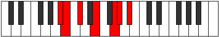

# Mode AFlatAerogimic

## Links

- [Documentation](index.md)
- [Scales Index](Scales.md)
- [Modes Index](Modes.md)
- [Chords Index](Chords.md)

## Scale

[Thalimic](ScaleThalimic.md)

## Mode

[AFlatAerogimic](ModeAFlatAerogimic.md)

## Tonic

Ab

## Signature

[CNaturalMajor]

## Perfection

 - 2 Perfect Notes

 - 4 Imperfect Notes

## Notes

- Ab (Imperfect)
- Bb (Imperfect)
- Cb (Imperfect)
- Db
- E
- F## (Imperfect)
- Ab (Imperfect)

## Illustration

## Relative Modes

| Number | Mode | Tonic | Notes | Illustration |
|--------|------|-------|-------|--------------|
| [603](https://ianring.com/musictheory/scales/603) | [Aeolygimic](ModeAeolygimic.md) | G | G, Ab, Bb, Cb, Db, E, G |  |
| [729](https://ianring.com/musictheory/scales/729) | [Stygimic](ModeStygimic.md) | E | E, F##, G#, A#, B, C#, E |  |
| [1611](https://ianring.com/musictheory/scales/1611) | [Dacrimic](ModeDacrimic.md) | A# | A#, B, C#, D##, E###, F###, A# |  |
| [1611](https://ianring.com/musictheory/scales/1611) | [Dacrimic](ModeDacrimic.md) | Bb | Bb, Cb, Db, E, F##, G#, Bb |  |
| [1737](https://ianring.com/musictheory/scales/1737) | [Thalimic](ModeThalimic.md) | C# | C#, D##, E###, F###, G###, A##, C# |  |
| [1737](https://ianring.com/musictheory/scales/1737) | [Thalimic](ModeThalimic.md) | Db | Db, E, F##, G#, A#, B, Db |  |
| [2349](https://ianring.com/musictheory/scales/2349) | [Aerogimic](ModeAerogimic.md) | G# | G#, A#, B, C#, D##, E###, G# |  |
| [2349](https://ianring.com/musictheory/scales/2349) | [Aerogimic](ModeAerogimic.md) | Ab | Ab, Bb, Cb, Db, E, F##, Ab |  |
| [2853](https://ianring.com/musictheory/scales/2853) | [Baptimic](ModeBaptimic.md) | B | B, C#, D##, E###, F###, G###, B |  |

## Chords

### Ab

| Number | Root | Name | Notes | Illustration | Audio |
|--------|------|------|-------|--------------|-------|

### Bb

| Number | Root | Name | Notes | Illustration | Audio |
|--------|------|------|-------|--------------|-------|

### Cb

| Number | Root | Name | Notes | Illustration | Audio |
|--------|------|------|-------|--------------|-------|

### Db

| Number | Root | Name | Notes | Illustration | Audio |
|--------|------|------|-------|--------------|-------|

### E

| Number | Root | Name | Notes | Illustration | Audio |
|--------|------|------|-------|--------------|-------|

### F##

| Number | Root | Name | Notes | Illustration | Audio |
|--------|------|------|-------|--------------|-------|

