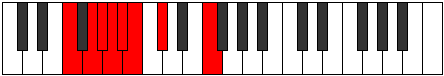

# Mode AFlatAerolian

## Links

- [Documentation](index.md)
- [Scales Index](Scales.md)
- [Modes Index](Modes.md)
- [Chords Index](Chords.md)

## Scale

[Gydian](ScaleGydian.md)

## Mode

[AFlatAerolian](ModeAFlatAerolian.md)

## Tonic

Ab

## Signature

[CNaturalMajor]

## Perfection

 - 2 Perfect Notes

 - 5 Imperfect Notes

## Notes

- Ab (Imperfect)
- Bbb (Imperfect)
- Cbb
- Dbbb (Imperfect)
- Ebbb
- F (Imperfect)
- G (Imperfect)
- Ab (Imperfect)

## Illustration

## Relative Modes

| Number | Mode | Tonic | Notes | Illustration |
|--------|------|-------|-------|--------------|
| [2607](https://ianring.com/musictheory/scales/2607) | [Aerolian](ModeAerolian.md) | Ab | Ab, Bbb, Cbb, Dbbb, Ebbb, F, G, Ab |  |
| [381](https://ianring.com/musictheory/scales/381) | [Kogian](ModeKogian.md) | F | F, G, Ab, Bbb, Cbb, Dbbb, Ebbb, F |  |
| [1119](https://ianring.com/musictheory/scales/1119) | [Rarian](ModeRarian.md) | G | G, Ab, Bbb, Cbb, Dbbb, Ebbb, F, G |  |

## Chords

### Ab

| Number | Root | Name | Notes | Illustration | Audio |
|--------|------|------|-------|--------------|-------|

### Bbb

| Number | Root | Name | Notes | Illustration | Audio |
|--------|------|------|-------|--------------|-------|

### Cbb

| Number | Root | Name | Notes | Illustration | Audio |
|--------|------|------|-------|--------------|-------|

### Dbbb

| Number | Root | Name | Notes | Illustration | Audio |
|--------|------|------|-------|--------------|-------|

### Ebbb

| Number | Root | Name | Notes | Illustration | Audio |
|--------|------|------|-------|--------------|-------|

### F

| Number | Root | Name | Notes | Illustration | Audio |
|--------|------|------|-------|--------------|-------|

### G

| Number | Root | Name | Notes | Illustration | Audio |
|--------|------|------|-------|--------------|-------|

