# Mode AFlatAeronian

## Links

- [Documentation](README.md)
- [Scales Index](Scales.md)
- [Modes Index](Modes.md)
- [Chords Index](Chords.md)

## Scale

[Palian](ScalePalian.md)

## Mode

[AFlatAeronian](ModeAFlatAeronian.md)

## Tonic

Ab

## Signature

[CNaturalMajor]

## Transposition

1, 3, 1, 2, 2, 1, 2

## Chord Pattern

I, II⁺, iii⁰, IV, v⁰, vi, vii

## Perfection

 - 4 Perfect Notes

 - 3 Imperfect Notes

## Notes

- Ab
- Bbb (Imperfect)
- C (Imperfect)
- Db
- Eb (Imperfect)
- F
- Gb
- Ab

## Illustration

## Diagram

| Circle of Fifth | Chromatic Circle |
|-----------------|------------------|
|  |  |
## Relative Modes

| Number | Mode | Tonic | Notes | Illustration |
|--------|------|-------|-------|--------------|
| [1715](https://ianring.com/musictheory/scales/1715) | [Aeronian](ModeAeronian.md) | G# | G#, A, B#, C#, D#, E#, F#, G# |  |
| [1715](https://ianring.com/musictheory/scales/1715) | [Aeronian](ModeAeronian.md) | Ab | Ab, Bbb, C, Db, Eb, F, Gb, Ab |  |
| [2905](https://ianring.com/musictheory/scales/2905) | [Palian](ModePalian.md) | A | A, B#, C#, D#, E#, F#, G#, A |  |
| [875](https://ianring.com/musictheory/scales/875) | [Stothian](ModeStothian.md) | C | C, Db, Eb, F, Gb, Ab, Bbb, C |  |
| [2485](https://ianring.com/musictheory/scales/2485) | [Aerorian](ModeAerorian.md) | C# | C#, D#, E#, F#, G#, A, B#, C# |  |
| [2485](https://ianring.com/musictheory/scales/2485) | [Aerorian](ModeAerorian.md) | Db | Db, Eb, F, Gb, Ab, Bbb, C, Db |  |
| [1645](https://ianring.com/musictheory/scales/1645) | [Katagian](ModeKatagian.md) | D# | D#, E#, F#, G#, A, B#, C#, D# |  |
| [1645](https://ianring.com/musictheory/scales/1645) | [Katagian](ModeKatagian.md) | Eb | Eb, F, Gb, Ab, Bbb, C, Db, Eb |  |
| [1435](https://ianring.com/musictheory/scales/1435) | [Phronian](ModePhronian.md) | F | F, Gb, Ab, Bbb, C, Db, Eb, F |  |
| [2765](https://ianring.com/musictheory/scales/2765) | [Banian](ModeBanian.md) | F# | F#, G#, A, B#, C#, D#, E#, F# |  |
| [2765](https://ianring.com/musictheory/scales/2765) | [Banian](ModeBanian.md) | Gb | Gb, Ab, Bbb, C, Db, Eb, F, Gb |  |
## Relative Brightness

| Number | Mode | Tonic | Notes | Circle Of Fifth | Chromatic Circle |
|--------|------|-------|-------|-----------------|------------------|
| [1715](https://ianring.com/musictheory/scales/1715) | [Aeronian](ModeAeronian.md) | G# | G#, A, B#, C#, D#, E#, F#, G# |  | 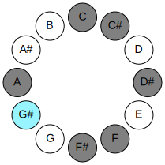 |
| [1715](https://ianring.com/musictheory/scales/1715) | [Aeronian](ModeAeronian.md) | Ab | Ab, Bbb, C, Db, Eb, F, Gb, Ab |  |  |
| [2905](https://ianring.com/musictheory/scales/2905) | [Palian](ModePalian.md) | A | A, B#, C#, D#, E#, F#, G#, A | 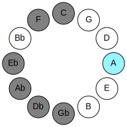 | 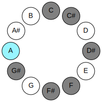 |
| [875](https://ianring.com/musictheory/scales/875) | [Stothian](ModeStothian.md) | C | C, Db, Eb, F, Gb, Ab, Bbb, C |  | 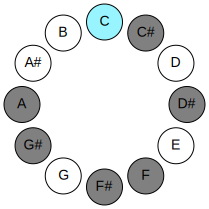 |
| [2485](https://ianring.com/musictheory/scales/2485) | [Aerorian](ModeAerorian.md) | C# | C#, D#, E#, F#, G#, A, B#, C# |  |  |
| [2485](https://ianring.com/musictheory/scales/2485) | [Aerorian](ModeAerorian.md) | Db | Db, Eb, F, Gb, Ab, Bbb, C, Db | 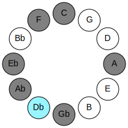 | 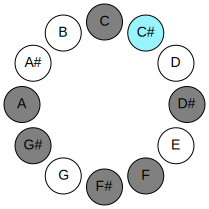 |
| [1645](https://ianring.com/musictheory/scales/1645) | [Katagian](ModeKatagian.md) | D# | D#, E#, F#, G#, A, B#, C#, D# | 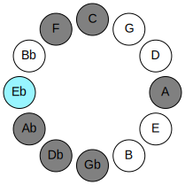 | 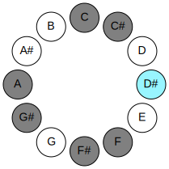 |
| [1645](https://ianring.com/musictheory/scales/1645) | [Katagian](ModeKatagian.md) | Eb | Eb, F, Gb, Ab, Bbb, C, Db, Eb |  |  |
| [1435](https://ianring.com/musictheory/scales/1435) | [Phronian](ModePhronian.md) | F | F, Gb, Ab, Bbb, C, Db, Eb, F | 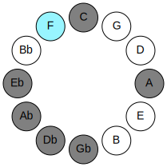 | 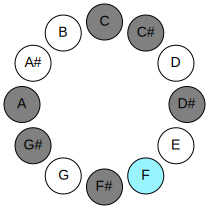 |
| [2765](https://ianring.com/musictheory/scales/2765) | [Banian](ModeBanian.md) | F# | F#, G#, A, B#, C#, D#, E#, F# | 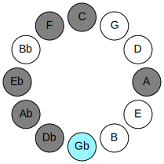 | 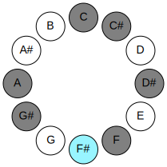 |
| [2765](https://ianring.com/musictheory/scales/2765) | [Banian](ModeBanian.md) | Gb | Gb, Ab, Bbb, C, Db, Eb, F, Gb |  |  |

## Chords

### Ab

| Number | Root | Name | Notes | Illustration | Audio |
|--------|------|------|-------|--------------|-------|
| 264 | Ab | [G#5](ChordGSharpPowerChord.md) | G#, D# |  | [midi](ChordGSharpPowerChordRootPosition.mid) |
| 264 | Ab | [Ab5](ChordAFlatPowerChord.md) | Ab, Eb |  | [midi](ChordAFlatPowerChordRootPosition.mid) |
| 776 | Ab | [G#phryg](ChordGSharpPhrygian.md) | G#, A, D# |  | [midi](ChordGSharpPhrygianRootPosition.mid) |
| 776 | Ab | [Abphryg](ChordAFlatPhrygian.md) | Ab, Bbb, Eb |  | [midi](ChordAFlatPhrygianRootPosition.mid) |
| 265 | Ab | [G#M](ChordGSharpMajor.md) | G#, B#, D# |  | [midi](ChordGSharpMajorRootPosition.mid) |
| 265 | Ab | [AbM](ChordAFlatMajor.md) | Ab, C, Eb |  | [midi](ChordAFlatMajorRootPosition.mid) |
| 266 | Ab | [G#sus4](ChordGSharpSuspendedFourth.md) | G#, C#, D# |  | [midi](ChordGSharpSuspendedFourthRootPosition.mid) |
| 266 | Ab | [Absus4](ChordAFlatSuspendedFourth.md) | Ab, Db, Eb |  | [midi](ChordAFlatSuspendedFourthRootPosition.mid) |
| 267 | Ab | [G#M(add11)](ChordGSharpMajorAddEleventh.md) | G#, B#, D#, C# |  | [midi](ChordGSharpMajorAddEleventhRootPosition.mid) |
| 267 | Ab | [G#M(add4)](ChordGSharpMajorAddFourth.md) | G#, B#, C#, D# |  | [midi](ChordGSharpMajorAddFourthRootPosition.mid) |
| 267 | Ab | [AbM(add11)](ChordAFlatMajorAddEleventh.md) | Ab, C, Eb, Db |  | [midi](ChordAFlatMajorAddEleventhRootPosition.mid) |
| 267 | Ab | [AbM(add4)](ChordAFlatMajorAddFourth.md) | Ab, C, Db, Eb |  | [midi](ChordAFlatMajorAddFourthRootPosition.mid) |
| 289 | Ab | [G#M##5](ChordGSharpMajorDoubleSharpFifth.md) | G#, B#, E# |  | [midi](ChordGSharpMajorDoubleSharpFifthRootPosition.mid) |
| 289 | Ab | [AbM##5](ChordAFlatMajorDoubleSharpFifth.md) | Ab, C, F |  | [midi](ChordAFlatMajorDoubleSharpFifthRootPosition.mid) |
| 290 | Ab | [G#sus4##5](ChordGSharpSuspendedFourthDoubleSharpFifth.md) | G#, C#, E# |  | [midi](ChordGSharpSuspendedFourthDoubleSharpFifthRootPosition.mid) |
| 290 | Ab | [Absus4##5](ChordAFlatSuspendedFourthDoubleSharpFifth.md) | Ab, Db, F |  | [midi](ChordAFlatSuspendedFourthDoubleSharpFifthRootPosition.mid) |
| 297 | Ab | [G#M6](ChordGSharpMajorSixth.md) | G#, B#, D#, E# |  | [midi](ChordGSharpMajorSixthRootPosition.mid) |
| 297 | Ab | [AbM6](ChordAFlatMajorSixth.md) | Ab, C, Eb, F |  | [midi](ChordAFlatMajorSixthRootPosition.mid) |
| 809 | Ab | [G#M6(addb9)](ChordGSharpMajorSixthAddFlatNinth.md) | G#, B#, D#, E#, A |  | [midi](ChordGSharpMajorSixthAddFlatNinthRootPosition.mid) |
| 809 | Ab | [AbM6(addb9)](ChordAFlatMajorSixthAddFlatNinth.md) | Ab, C, Eb, F, Bbb |  | [midi](ChordAFlatMajorSixthAddFlatNinthRootPosition.mid) |
| 298 | Ab | [G#M6sus4](ChordGSharpMajorSixthSuspendedFourth.md) | G#, C#, D#, E# |  | [midi](ChordGSharpMajorSixthSuspendedFourthRootPosition.mid) |
| 298 | Ab | [AbM6sus4](ChordAFlatMajorSixthSuspendedFourth.md) | Ab, Db, Eb, F |  | [midi](ChordAFlatMajorSixthSuspendedFourthRootPosition.mid) |
| 322 | Ab | [G#Q](ChordGSharpQuartal.md) | G#, C#, F# |  | [midi](ChordGSharpQuartalRootPosition.mid) |
| 322 | Ab | [AbQ](ChordAFlatQuartal.md) | Ab, Db, Gb |  | [midi](ChordAFlatQuartalRootPosition.mid) |
| 329 | Ab | [G#7](ChordGSharpDominantSeventh.md) | G#, B#, D#, F# |  | [midi](ChordGSharpDominantSeventhRootPosition.mid) |
| 329 | Ab | [Ab7](ChordAFlatDominantSeventh.md) | Ab, C, Eb, Gb |  | [midi](ChordAFlatDominantSeventhRootPosition.mid) |
| 841 | Ab | [G#7b9](ChordGSharpDominantSeventhFlatNinth.md) | G#, B#, D#, F#, A |  | [midi](ChordGSharpDominantSeventhFlatNinthRootPosition.mid) |
| 841 | Ab | [Ab7b9](ChordAFlatDominantSeventhFlatNinth.md) | Ab, C, Eb, Gb, Bbb |  | [midi](ChordAFlatDominantSeventhFlatNinthRootPosition.mid) |
| 330 | Ab | [G#7sus4](ChordGSharpDominantSeventhSuspendedFourth.md) | G#, C#, D#, F# |  | [midi](ChordGSharpDominantSeventhSuspendedFourthRootPosition.mid) |
| 330 | Ab | [Ab7sus4](ChordAFlatDominantSeventhSuspendedFourth.md) | Ab, Db, Eb, Gb |  | [midi](ChordAFlatDominantSeventhSuspendedFourthRootPosition.mid) |
| 331 | Ab | [G#7add4](ChordGSharpDominantSeventhAddFourth.md) | G#, B#, C#, D#, F# |  | [midi](ChordGSharpDominantSeventhAddFourthRootPosition.mid) |
| 331 | Ab | [G#7add11](ChordGSharpDominantSeventhAddEleventh.md) | G#, B#, D#, F#, C# |  | [midi](ChordGSharpDominantSeventhAddEleventhRootPosition.mid) |
| 331 | Ab | [Ab7add4](ChordAFlatDominantSeventhAddFourth.md) | Ab, C, Db, Eb, Gb |  | [midi](ChordAFlatDominantSeventhAddFourthRootPosition.mid) |
| 331 | Ab | [Ab7add11](ChordAFlatDominantSeventhAddEleventh.md) | Ab, C, Eb, Gb, Db |  | [midi](ChordAFlatDominantSeventhAddEleventhRootPosition.mid) |
| 361 | Ab | [G#7add13](ChordGSharpDominantSeventhAddThirteenth.md) | G#, B#, D#, F#, E# |  | [midi](ChordGSharpDominantSeventhAddThirteenthRootPosition.mid) |
| 361 | Ab | [Ab7add13](ChordAFlatDominantSeventhAddThirteenth.md) | Ab, C, Eb, Gb, F |  | [midi](ChordAFlatDominantSeventhAddThirteenthRootPosition.mid) |
| 875 | Ab | [G#13b9](ChordGSharpDominantThirteenthFlatNinth.md) | G#, B#, D#, F#, A, C#, E# |  | [midi](ChordGSharpDominantThirteenthFlatNinthRootPosition.mid) |
| 875 | Ab | [Ab13b9](ChordAFlatDominantThirteenthFlatNinth.md) | Ab, C, Eb, Gb, Bbb, Db, F |  | [midi](ChordAFlatDominantThirteenthFlatNinthRootPosition.mid) |

### Bbb

| Number | Root | Name | Notes | Illustration | Audio |
|--------|------|------|-------|--------------|-------|
| 521 | Bbb | [Ao](ChordANaturalDiminished.md) | A, C, Eb |  | [midi](ChordANaturalDiminishedRootPosition.mid) |
| 522 | Bbb | [AMb5](ChordANaturalMajorFlatFifth.md) | A, C#, Eb |  | [midi](ChordANaturalMajorFlatFifthRootPosition.mid) |
| 545 | Bbb | [Am#5](ChordANaturalMinorSharpFifth.md) | A, C, F |  | [midi](ChordANaturalMinorSharpFifthRootPosition.mid) |
| 546 | Bbb | [A+](ChordANaturalAugmented.md) | A, C#, E# |  | [midi](ChordANaturalAugmentedRootPosition.mid) |
| 546 | Bbb | [A+7](ChordANaturalAugmentedAugmentedSeventh.md) | A, C#, E#, G## |  | [midi](ChordANaturalAugmentedAugmentedSeventhRootPosition.mid) |
| 578 | Bbb | [AM##5](ChordANaturalMajorDoubleSharpFifth.md) | A, C#, F# |  | [midi](ChordANaturalMajorDoubleSharpFifthRootPosition.mid) |
| 585 | Bbb | [Ao7](ChordANaturalFullDiminishedSeventh.md) | A, C, Eb, Gb |  | [midi](ChordANaturalFullDiminishedSeventhRootPosition.mid) |
| 586 | Bbb | [AM6b5](ChordANaturalMajorSixthFlatFifth.md) | A, C#, Eb, F# |  | [midi](ChordANaturalMajorSixthFlatFifthRootPosition.mid) |
| 777 | Bbb | [AoM7](ChordANaturalDiminishedMajorSeventh.md) | A, C, Eb, G# |  | [midi](ChordANaturalDiminishedMajorSeventhRootPosition.mid) |
| 778 | Bbb | [AM7b5](ChordANaturalMajorSeventhFlatFifth.md) | A, C#, Eb, G# |  | [midi](ChordANaturalMajorSeventhFlatFifthRootPosition.mid) |
| 802 | Bbb | [A+(M7)](ChordANaturalAugmentedMajorSeventh.md) | A, C#, E#, G# |  | [midi](ChordANaturalAugmentedMajorSeventhRootPosition.mid) |
| 834 | Bbb | [AM7##5](ChordANaturalMajorSeventhDoubleSharpFifth.md) | A, C#, F#, G# |  | [midi](ChordANaturalMajorSeventhDoubleSharpFifthRootPosition.mid) |

### C

| Number | Root | Name | Notes | Illustration | Audio |
|--------|------|------|-------|--------------|-------|
| 41 | C | [Cmbb5](ChordCNaturalMinorDoubleFlatFifth.md) | C, Eb, F |  | [midi](ChordCNaturalMinorDoubleFlatFifthRootPosition.mid) |
| 67 | C | [Cloc](ChordCNaturalLocrian.md) | C, Db, Gb |  | [midi](ChordCNaturalLocrianRootPosition.mid) |
| 73 | C | [Co](ChordCNaturalDiminished.md) | C, Eb, Gb |  | [midi](ChordCNaturalDiminishedRootPosition.mid) |
| 97 | C | [Csus4b5](ChordCNaturalSuspendedFourthFlatFifth.md) | C, F, Gb |  | [midi](ChordCNaturalSuspendedFourthFlatFifthRootPosition.mid) |
| 265 | C | [Cm#5](ChordCNaturalMinorSharpFifth.md) | C, Eb, Ab |  | [midi](ChordCNaturalMinorSharpFifthRootPosition.mid) |
| 289 | C | [Csus4#5](ChordCNaturalSuspendedFourthSharpFifth.md) | C, F, G# |  | [midi](ChordCNaturalSuspendedFourthSharpFifthRootPosition.mid) |
| 545 | C | [Csus4##5](ChordCNaturalSuspendedFourthDoubleSharpFifth.md) | C, F, A |  | [midi](ChordCNaturalSuspendedFourthDoubleSharpFifthRootPosition.mid) |
| 585 | C | [Co7](ChordCNaturalFullDiminishedSeventh.md) | C, Eb, Gb, Bbb |  | [midi](ChordCNaturalFullDiminishedSeventhRootPosition.mid) |

### Db

| Number | Root | Name | Notes | Illustration | Audio |
|--------|------|------|-------|--------------|-------|
| 74 | Db | [C#sus2bb5](ChordCSharpSuspendedSecondDoubleFlatFifth.md) | C#, D#, F# |  | [midi](ChordCSharpSuspendedSecondDoubleFlatFifthRootPosition.mid) |
| 74 | Db | [Dbsus2bb5](ChordDFlatSuspendedSecondDoubleFlatFifth.md) | Db, Eb, Gb |  | [midi](ChordDFlatSuspendedSecondDoubleFlatFifthRootPosition.mid) |
| 258 | Db | [C#5](ChordCSharpPowerChord.md) | C#, G# |  | [midi](ChordCSharpPowerChordRootPosition.mid) |
| 258 | Db | [Db5](ChordDFlatPowerChord.md) | Db, Ab |  | [midi](ChordDFlatPowerChordRootPosition.mid) |
| 266 | Db | [C#sus2](ChordCSharpSuspendedSecond.md) | C#, D#, G# |  | [midi](ChordCSharpSuspendedSecondRootPosition.mid) |
| 266 | Db | [Dbsus2](ChordDFlatSuspendedSecond.md) | Db, Eb, Ab |  | [midi](ChordDFlatSuspendedSecondRootPosition.mid) |
| 290 | Db | [C#M](ChordCSharpMajor.md) | C#, E#, G# |  | [midi](ChordCSharpMajorRootPosition.mid) |
| 290 | Db | [DbM](ChordDFlatMajor.md) | Db, F, Ab |  | [midi](ChordDFlatMajorRootPosition.mid) |
| 298 | Db | [C#M(add9)](ChordCSharpMajorAddNinth.md) | C#, E#, G#, D# |  | [midi](ChordCSharpMajorAddNinthRootPosition.mid) |
| 298 | Db | [DbM(add9)](ChordDFlatMajorAddNinth.md) | Db, F, Ab, Eb |  | [midi](ChordDFlatMajorAddNinthRootPosition.mid) |
| 322 | Db | [C#sus4](ChordCSharpSuspendedFourth.md) | C#, F#, G# |  | [midi](ChordCSharpSuspendedFourthRootPosition.mid) |
| 322 | Db | [Dbsus4](ChordDFlatSuspendedFourth.md) | Db, Gb, Ab |  | [midi](ChordDFlatSuspendedFourthRootPosition.mid) |
| 354 | Db | [C#M(add11)](ChordCSharpMajorAddEleventh.md) | C#, E#, G#, F# |  | [midi](ChordCSharpMajorAddEleventhRootPosition.mid) |
| 354 | Db | [C#M(add4)](ChordCSharpMajorAddFourth.md) | C#, E#, F#, G# |  | [midi](ChordCSharpMajorAddFourthRootPosition.mid) |
| 354 | Db | [DbM(add11)](ChordDFlatMajorAddEleventh.md) | Db, F, Ab, Gb |  | [midi](ChordDFlatMajorAddEleventhRootPosition.mid) |
| 354 | Db | [DbM(add4)](ChordDFlatMajorAddFourth.md) | Db, F, Gb, Ab |  | [midi](ChordDFlatMajorAddFourthRootPosition.mid) |
| 522 | Db | [C#sus2#5](ChordCSharpSuspendedSecondSharpFifth.md) | C#, D#, G## |  | [midi](ChordCSharpSuspendedSecondSharpFifthRootPosition.mid) |
| 522 | Db | [Dbsus2#5](ChordDFlatSuspendedSecondSharpFifth.md) | Db, Eb, A |  | [midi](ChordDFlatSuspendedSecondSharpFifthRootPosition.mid) |
| 546 | Db | [C#+](ChordCSharpAugmented.md) | C#, E#, G## |  | [midi](ChordCSharpAugmentedRootPosition.mid) |
| 546 | Db | [C#+7](ChordCSharpAugmentedAugmentedSeventh.md) | C#, E#, G##, B## |  | [midi](ChordCSharpAugmentedAugmentedSeventhRootPosition.mid) |
| 546 | Db | [Db+](ChordDFlatAugmented.md) | Db, F, A |  | [midi](ChordDFlatAugmentedRootPosition.mid) |
| 546 | Db | [Db+7](ChordDFlatAugmentedAugmentedSeventh.md) | Db, F, A, C# |  | [midi](ChordDFlatAugmentedAugmentedSeventhRootPosition.mid) |
| 578 | Db | [C#sus4#5](ChordCSharpSuspendedFourthSharpFifth.md) | C#, F#, G## |  | [midi](ChordCSharpSuspendedFourthSharpFifthRootPosition.mid) |
| 578 | Db | [Dbsus4#5](ChordDFlatSuspendedFourthSharpFifth.md) | Db, Gb, A |  | [midi](ChordDFlatSuspendedFourthSharpFifthRootPosition.mid) |
| 67 | Db | [C#Q+](ChordCSharpQuartalAugmented.md) | C#, F#, B# |  | [midi](ChordCSharpQuartalAugmentedRootPosition.mid) |
| 67 | Db | [DbQ+](ChordDFlatQuartalAugmented.md) | Db, Gb, C |  | [midi](ChordDFlatQuartalAugmentedRootPosition.mid) |
| 267 | Db | [C#M7(sus2)](ChordCSharpMajorSeventhSuspendedSecond.md) | C#, D#, G#, B# |  | [midi](ChordCSharpMajorSeventhSuspendedSecondRootPosition.mid) |
| 267 | Db | [C#M9sus2](ChordCSharpMajorNinthSuspendedSecond.md) | C#, D#, G#, B#, D# |  | [midi](ChordCSharpMajorNinthSuspendedSecondRootPosition.mid) |
| 267 | Db | [DbM7(sus2)](ChordDFlatMajorSeventhSuspendedSecond.md) | Db, Eb, Ab, C |  | [midi](ChordDFlatMajorSeventhSuspendedSecondRootPosition.mid) |
| 267 | Db | [DbM9sus2](ChordDFlatMajorNinthSuspendedSecond.md) | Db, Eb, Ab, C, Eb |  | [midi](ChordDFlatMajorNinthSuspendedSecondRootPosition.mid) |
| 291 | Db | [C#M7](ChordCSharpMajorSeventh.md) | C#, E#, G#, B# |  | [midi](ChordCSharpMajorSeventhRootPosition.mid) |
| 291 | Db | [DbM7](ChordDFlatMajorSeventh.md) | Db, F, Ab, C |  | [midi](ChordDFlatMajorSeventhRootPosition.mid) |
| 299 | Db | [C#M9](ChordCSharpMajorNinth.md) | C#, E#, G#, B#, D# |  | [midi](ChordCSharpMajorNinthRootPosition.mid) |
| 299 | Db | [DbM9](ChordDFlatMajorNinth.md) | Db, F, Ab, C, Eb |  | [midi](ChordDFlatMajorNinthRootPosition.mid) |
| 323 | Db | [C#M7(sus4)](ChordCSharpMajorSeventhSuspendedFourth.md) | C#, F#, G#, B# |  | [midi](ChordCSharpMajorSeventhSuspendedFourthRootPosition.mid) |
| 323 | Db | [DbM7(sus4)](ChordDFlatMajorSeventhSuspendedFourth.md) | Db, Gb, Ab, C |  | [midi](ChordDFlatMajorSeventhSuspendedFourthRootPosition.mid) |
| 331 | Db | [C#M9sus4](ChordCSharpMajorNinthSuspendedFourth.md) | C#, F#, G#, B#, D# |  | [midi](ChordCSharpMajorNinthSuspendedFourthRootPosition.mid) |
| 331 | Db | [DbM9sus4](ChordDFlatMajorNinthSuspendedFourth.md) | Db, Gb, Ab, C, Eb |  | [midi](ChordDFlatMajorNinthSuspendedFourthRootPosition.mid) |
| 355 | Db | [C#M7add4](ChordCSharpMajorSeventhAddFourth.md) | C#, E#, F#, G#, B# |  | [midi](ChordCSharpMajorSeventhAddFourthRootPosition.mid) |
| 355 | Db | [C#M7add11](ChordCSharpMajorSeventhAddEleventh.md) | C#, E#, G#, B#, F# |  | [midi](ChordCSharpMajorSeventhAddEleventhRootPosition.mid) |
| 355 | Db | [DbM7add4](ChordDFlatMajorSeventhAddFourth.md) | Db, F, Gb, Ab, C |  | [midi](ChordDFlatMajorSeventhAddFourthRootPosition.mid) |
| 355 | Db | [DbM7add11](ChordDFlatMajorSeventhAddEleventh.md) | Db, F, Ab, C, Gb |  | [midi](ChordDFlatMajorSeventhAddEleventhRootPosition.mid) |
| 363 | Db | [C#M11](ChordCSharpMajorEleventh.md) | C#, E#, G#, B#, D#, F# |  | [midi](ChordCSharpMajorEleventhRootPosition.mid) |
| 363 | Db | [DbM11](ChordDFlatMajorEleventh.md) | Db, F, Ab, C, Eb, Gb |  | [midi](ChordDFlatMajorEleventhRootPosition.mid) |
| 547 | Db | [C#+(M7)](ChordCSharpAugmentedMajorSeventh.md) | C#, E#, G##, B# |  | [midi](ChordCSharpAugmentedMajorSeventhRootPosition.mid) |
| 547 | Db | [Db+(M7)](ChordDFlatAugmentedMajorSeventh.md) | Db, F, A, C |  | [midi](ChordDFlatAugmentedMajorSeventhRootPosition.mid) |
| 579 | Db | [C#M7(sus4)#5](ChordCSharpMajorSeventhSuspendedFourthSharpFifth.md) | C#, F#, G##, B# |  | [midi](ChordCSharpMajorSeventhSuspendedFourthSharpFifthRootPosition.mid) |
| 579 | Db | [DbM7(sus4)#5](ChordDFlatMajorSeventhSuspendedFourthSharpFifth.md) | Db, Gb, A, C |  | [midi](ChordDFlatMajorSeventhSuspendedFourthSharpFifthRootPosition.mid) |

### Eb

| Number | Root | Name | Notes | Illustration | Audio |
|--------|------|------|-------|--------------|-------|
| 296 | Eb | [D#sus2bb5](ChordDSharpSuspendedSecondDoubleFlatFifth.md) | D#, E#, G# |  | [midi](ChordDSharpSuspendedSecondDoubleFlatFifthRootPosition.mid) |
| 296 | Eb | [Ebsus2bb5](ChordEFlatSuspendedSecondDoubleFlatFifth.md) | Eb, F, Ab |  | [midi](ChordEFlatSuspendedSecondDoubleFlatFifthRootPosition.mid) |
| 328 | Eb | [D#mbb5](ChordDSharpMinorDoubleFlatFifth.md) | D#, F#, G# |  | [midi](ChordDSharpMinorDoubleFlatFifthRootPosition.mid) |
| 328 | Eb | [Ebmbb5](ChordEFlatMinorDoubleFlatFifth.md) | Eb, Gb, Ab |  | [midi](ChordEFlatMinorDoubleFlatFifthRootPosition.mid) |
| 552 | Eb | [D#](ChordDSharpDiminishedFlatThird.md) | D#, F, A |  | [midi](ChordDSharpDiminishedFlatThirdRootPosition.mid) |
| 552 | Eb | [D#sus2b5](ChordDSharpSuspendedSecondFlatFifth.md) | D#, E#, A |  | [midi](ChordDSharpSuspendedSecondFlatFifthRootPosition.mid) |
| 552 | Eb | [Eb](ChordEFlatDiminishedFlatThird.md) | Eb, Gbb, Bbb |  | [midi](ChordEFlatDiminishedFlatThirdRootPosition.mid) |
| 552 | Eb | [Ebsus2b5](ChordEFlatSuspendedSecondFlatFifth.md) | Eb, F, Bbb |  | [midi](ChordEFlatSuspendedSecondFlatFifthRootPosition.mid) |
| 584 | Eb | [D#o](ChordDSharpDiminished.md) | D#, F#, A |  | [midi](ChordDSharpDiminishedRootPosition.mid) |
| 584 | Eb | [Ebo](ChordEFlatDiminished.md) | Eb, Gb, Bbb |  | [midi](ChordEFlatDiminishedRootPosition.mid) |
| 776 | Eb | [D#sus4b5](ChordDSharpSuspendedFourthFlatFifth.md) | D#, G#, A |  | [midi](ChordDSharpSuspendedFourthFlatFifthRootPosition.mid) |
| 776 | Eb | [Ebsus4b5](ChordEFlatSuspendedFourthFlatFifth.md) | Eb, Ab, Bbb |  | [midi](ChordEFlatSuspendedFourthFlatFifthRootPosition.mid) |
| 265 | Eb | [D#sus4##5](ChordDSharpSuspendedFourthDoubleSharpFifth.md) | D#, G#, B# |  | [midi](ChordDSharpSuspendedFourthDoubleSharpFifthRootPosition.mid) |
| 265 | Eb | [Ebsus4##5](ChordEFlatSuspendedFourthDoubleSharpFifth.md) | Eb, Ab, C |  | [midi](ChordEFlatSuspendedFourthDoubleSharpFifthRootPosition.mid) |
| 297 | Eb | [D#M6sus2bb5](ChordDSharpMajorSixthSuspendedSecondDoubleFlatFifth.md) | D#, E#, G#, B# |  | [midi](ChordDSharpMajorSixthSuspendedSecondDoubleFlatFifthRootPosition.mid) |
| 297 | Eb | [EbM6sus2bb5](ChordEFlatMajorSixthSuspendedSecondDoubleFlatFifth.md) | Eb, F, Ab, C |  | [midi](ChordEFlatMajorSixthSuspendedSecondDoubleFlatFifthRootPosition.mid) |
| 553 | Eb | [D#M6sus2b5](ChordDSharpMajorSixthSuspendedSecondFlatFifth.md) | D#, E#, A, B# |  | [midi](ChordDSharpMajorSixthSuspendedSecondFlatFifthRootPosition.mid) |
| 553 | Eb | [EbM6sus2b5](ChordEFlatMajorSixthSuspendedSecondFlatFifth.md) | Eb, F, Bbb, C |  | [midi](ChordEFlatMajorSixthSuspendedSecondFlatFifthRootPosition.mid) |
| 585 | Eb | [D#o7](ChordDSharpFullDiminishedSeventh.md) | D#, F#, A, C |  | [midi](ChordDSharpFullDiminishedSeventhRootPosition.mid) |
| 585 | Eb | [Ebo7](ChordEFlatFullDiminishedSeventh.md) | Eb, Gb, Bbb, Dbb |  | [midi](ChordEFlatFullDiminishedSeventhRootPosition.mid) |
| 266 | Eb | [D#Q](ChordDSharpQuartal.md) | D#, G#, C# |  | [midi](ChordDSharpQuartalRootPosition.mid) |
| 266 | Eb | [EbQ](ChordEFlatQuartal.md) | Eb, Ab, Db |  | [midi](ChordEFlatQuartalRootPosition.mid) |
| 330 | Eb | [D#m7bb5](ChordDSharpMinorSeventhDoubleFlatFifth.md) | D#, F#, G#, C# |  | [midi](ChordDSharpMinorSeventhDoubleFlatFifthRootPosition.mid) |
| 330 | Eb | [Ebm7bb5](ChordEFlatMinorSeventhDoubleFlatFifth.md) | Eb, Gb, Ab, Db |  | [midi](ChordEFlatMinorSeventhDoubleFlatFifthRootPosition.mid) |
| 586 | Eb | [D#ø7](ChordDSharpHalfDiminishedSeventh.md) | D#, F#, A, C# |  | [midi](ChordDSharpHalfDiminishedSeventhRootPosition.mid) |
| 586 | Eb | [Ebø7](ChordEFlatHalfDiminishedSeventh.md) | Eb, Gb, Bbb, Db |  | [midi](ChordEFlatHalfDiminishedSeventhRootPosition.mid) |

### F

| Number | Root | Name | Notes | Illustration | Audio |
|--------|------|------|-------|--------------|-------|
| 33 | F | [F5](ChordFNaturalPowerChord.md) | F, C |  | [midi](ChordFNaturalPowerChordRootPosition.mid) |
| 97 | F | [Fphryg](ChordFNaturalPhrygian.md) | F, Gb, C |  | [midi](ChordFNaturalPhrygianRootPosition.mid) |
| 289 | F | [Fm](ChordFNaturalMinor.md) | F, Ab, C |  | [midi](ChordFNaturalMinorRootPosition.mid) |
| 289 | F | [Fm(add(#9))](ChordFNaturalMinorAddSharpNinth.md) | F, Ab, C, G# |  | [midi](ChordFNaturalMinorAddSharpNinthRootPosition.mid) |
| 545 | F | [FM](ChordFNaturalMajor.md) | F, A, C |  | [midi](ChordFNaturalMajorRootPosition.mid) |
| 801 | F | [FM(add(#9))](ChordFNaturalMajorAddSharpNinth.md) | F, A, C, G# |  | [midi](ChordFNaturalMajorAddSharpNinthRootPosition.mid) |
| 290 | F | [Fm#5](ChordFNaturalMinorSharpFifth.md) | F, Ab, Db |  | [midi](ChordFNaturalMinorSharpFifthRootPosition.mid) |
| 546 | F | [F+](ChordFNaturalAugmented.md) | F, A, C# |  | [midi](ChordFNaturalAugmentedRootPosition.mid) |
| 546 | F | [F+7](ChordFNaturalAugmentedAugmentedSeventh.md) | F, A, C#, E# |  | [midi](ChordFNaturalAugmentedAugmentedSeventhRootPosition.mid) |
| 297 | F | [Fm7](ChordFNaturalMinorSeventh.md) | F, Ab, C, Eb |  | [midi](ChordFNaturalMinorSeventhRootPosition.mid) |
| 361 | F | [Fm7b9](ChordFNaturalMinorSeventhFlatNinth.md) | F, Ab, C, Eb, Gb |  | [midi](ChordFNaturalMinorSeventhFlatNinthRootPosition.mid) |
| 553 | F | [F7](ChordFNaturalDominantSeventh.md) | F, A, C, Eb |  | [midi](ChordFNaturalDominantSeventhRootPosition.mid) |
| 617 | F | [F7b9](ChordFNaturalDominantSeventhFlatNinth.md) | F, A, C, Eb, Gb |  | [midi](ChordFNaturalDominantSeventhFlatNinthRootPosition.mid) |
| 809 | F | [F7#9](ChordFNaturalDominantSeventhSharpNinth.md) | F, A, C, Eb, G# |  | [midi](ChordFNaturalDominantSeventhSharpNinthRootPosition.mid) |
| 298 | F | [Fm7#5](ChordFNaturalMinorSeventhSharpFifth.md) | F, Ab, C#, Eb |  | [midi](ChordFNaturalMinorSeventhSharpFifthRootPosition.mid) |
| 618 | F | [F7#5b9](ChordFNaturalDominantSeventhSharpFifthFlatNinth.md) | F, A, C#, Eb, Gb |  | [midi](ChordFNaturalDominantSeventhSharpFifthFlatNinthRootPosition.mid) |
| 619 | F | [F7b9b13](ChordFNaturalDominantSeventhFlatNinthFlatThirteenth.md) | F, A, C, Eb, Gb, Db |  | [midi](ChordFNaturalDominantSeventhFlatNinthFlatThirteenthRootPosition.mid) |

### Gb

| Number | Root | Name | Notes | Illustration | Audio |
|--------|------|------|-------|--------------|-------|
| 321 | Gb | [F#](ChordFSharpDiminishedFlatThird.md) | F#, Ab, C |  | [midi](ChordFSharpDiminishedFlatThirdRootPosition.mid) |
| 321 | Gb | [F#sus2b5](ChordFSharpSuspendedSecondFlatFifth.md) | F#, G#, C |  | [midi](ChordFSharpSuspendedSecondFlatFifthRootPosition.mid) |
| 321 | Gb | [Gb](ChordGFlatDiminishedFlatThird.md) | Gb, Bbbb, Dbb |  | [midi](ChordGFlatDiminishedFlatThirdRootPosition.mid) |
| 321 | Gb | [Gbsus2b5](ChordGFlatSuspendedSecondFlatFifth.md) | Gb, Ab, Dbb |  | [midi](ChordGFlatSuspendedSecondFlatFifthRootPosition.mid) |
| 577 | Gb | [F#o](ChordFSharpDiminished.md) | F#, A, C |  | [midi](ChordFSharpDiminishedRootPosition.mid) |
| 577 | Gb | [Gbo](ChordGFlatDiminished.md) | Gb, Bbb, Dbb |  | [midi](ChordGFlatDiminishedRootPosition.mid) |
| 66 | Gb | [F#5](ChordFSharpPowerChord.md) | F#, C# |  | [midi](ChordFSharpPowerChordRootPosition.mid) |
| 66 | Gb | [Gb5](ChordGFlatPowerChord.md) | Gb, Db |  | [midi](ChordGFlatPowerChordRootPosition.mid) |
| 322 | Gb | [F#sus2](ChordFSharpSuspendedSecond.md) | F#, G#, C# |  | [midi](ChordFSharpSuspendedSecondRootPosition.mid) |
| 322 | Gb | [Gbsus2](ChordGFlatSuspendedSecond.md) | Gb, Ab, Db |  | [midi](ChordGFlatSuspendedSecondRootPosition.mid) |
| 578 | Gb | [F#m](ChordFSharpMinor.md) | F#, A, C# |  | [midi](ChordFSharpMinorRootPosition.mid) |
| 578 | Gb | [F#m(add(#9))](ChordFSharpMinorAddSharpNinth.md) | F#, A, C#, G## |  | [midi](ChordFSharpMinorAddSharpNinthRootPosition.mid) |
| 578 | Gb | [Gbm](ChordGFlatMinor.md) | Gb, Bbb, Db |  | [midi](ChordGFlatMinorRootPosition.mid) |
| 578 | Gb | [Gbm(add(#9))](ChordGFlatMinorAddSharpNinth.md) | Gb, Bbb, Db, A |  | [midi](ChordGFlatMinorAddSharpNinthRootPosition.mid) |
| 834 | Gb | [F#m(add9)](ChordFSharpMinorAddNinth.md) | F#, A, C#, G# |  | [midi](ChordFSharpMinorAddNinthRootPosition.mid) |
| 834 | Gb | [Gbm(add9)](ChordGFlatMinorAddNinth.md) | Gb, Bbb, Db, Ab |  | [midi](ChordGFlatMinorAddNinthRootPosition.mid) |
| 67 | Gb | [F#lyd](ChordFSharpLydian.md) | F#, B#, C# |  | [midi](ChordFSharpLydianRootPosition.mid) |
| 67 | Gb | [Gblyd](ChordGFlatLydian.md) | Gb, C, Db |  | [midi](ChordGFlatLydianRootPosition.mid) |
| 579 | Gb | [F#m(add(#4))](ChordFSharpMinorAddSharpFourth.md) | F#, A, B#, C# |  | [midi](ChordFSharpMinorAddSharpFourthRootPosition.mid) |
| 579 | Gb | [Gbm(add(#4))](ChordGFlatMinorAddSharpFourth.md) | Gb, Bbb, C, Db |  | [midi](ChordGFlatMinorAddSharpFourthRootPosition.mid) |
| 329 | Gb | [F#M6sus2b5](ChordFSharpMajorSixthSuspendedSecondFlatFifth.md) | F#, G#, C, D# |  | [midi](ChordFSharpMajorSixthSuspendedSecondFlatFifthRootPosition.mid) |
| 329 | Gb | [GbM6sus2b5](ChordGFlatMajorSixthSuspendedSecondFlatFifth.md) | Gb, Ab, Dbb, Eb |  | [midi](ChordGFlatMajorSixthSuspendedSecondFlatFifthRootPosition.mid) |
| 585 | Gb | [F#o7](ChordFSharpFullDiminishedSeventh.md) | F#, A, C, Eb |  | [midi](ChordFSharpFullDiminishedSeventhRootPosition.mid) |
| 585 | Gb | [Gbo7](ChordGFlatFullDiminishedSeventh.md) | Gb, Bbb, Dbb, Fbb |  | [midi](ChordGFlatFullDiminishedSeventhRootPosition.mid) |
| 330 | Gb | [F#M6sus2](ChordFSharpMajorSixthSuspendedSecond.md) | F#, G#, C#, D# |  | [midi](ChordFSharpMajorSixthSuspendedSecondRootPosition.mid) |
| 330 | Gb | [F#7sus2b5](ChordFSharpDominantSeventhSuspendedSecondFlatFifth.md) | F#, G#, C#, Eb |  | [midi](ChordFSharpDominantSeventhSuspendedSecondFlatFifthRootPosition.mid) |
| 330 | Gb | [GbM6sus2](ChordGFlatMajorSixthSuspendedSecond.md) | Gb, Ab, Db, Eb |  | [midi](ChordGFlatMajorSixthSuspendedSecondRootPosition.mid) |
| 330 | Gb | [Gb7sus2b5](ChordGFlatDominantSeventhSuspendedSecondFlatFifth.md) | Gb, Ab, Db, Fbb |  | [midi](ChordGFlatDominantSeventhSuspendedSecondFlatFifthRootPosition.mid) |
| 586 | Gb | [F#m6](ChordFSharpMinorSixth.md) | F#, A, C#, D# |  | [midi](ChordFSharpMinorSixthRootPosition.mid) |
| 586 | Gb | [Gbm6](ChordGFlatMinorSixth.md) | Gb, Bbb, Db, Eb |  | [midi](ChordGFlatMinorSixthRootPosition.mid) |
| 842 | Gb | [F#m6(add9)](ChordFSharpMinorSixthAddNinth.md) | F#, A, C#, D#, G# |  | [midi](ChordFSharpMinorSixthAddNinthRootPosition.mid) |
| 842 | Gb | [Gbm6(add9)](ChordGFlatMinorSixthAddNinth.md) | Gb, Bbb, Db, Eb, Ab |  | [midi](ChordGFlatMinorSixthAddNinthRootPosition.mid) |
| 609 | Gb | [F#oM7](ChordFSharpDiminishedMajorSeventh.md) | F#, A, C, E# |  | [midi](ChordFSharpDiminishedMajorSeventhRootPosition.mid) |
| 609 | Gb | [GboM7](ChordGFlatDiminishedMajorSeventh.md) | Gb, Bbb, Dbb, F |  | [midi](ChordGFlatDiminishedMajorSeventhRootPosition.mid) |
| 354 | Gb | [F#M7(sus2)](ChordFSharpMajorSeventhSuspendedSecond.md) | F#, G#, C#, E# |  | [midi](ChordFSharpMajorSeventhSuspendedSecondRootPosition.mid) |
| 354 | Gb | [F#M9sus2](ChordFSharpMajorNinthSuspendedSecond.md) | F#, G#, C#, E#, G# |  | [midi](ChordFSharpMajorNinthSuspendedSecondRootPosition.mid) |
| 354 | Gb | [GbM7(sus2)](ChordGFlatMajorSeventhSuspendedSecond.md) | Gb, Ab, Db, F |  | [midi](ChordGFlatMajorSeventhSuspendedSecondRootPosition.mid) |
| 354 | Gb | [GbM9sus2](ChordGFlatMajorNinthSuspendedSecond.md) | Gb, Ab, Db, F, Ab |  | [midi](ChordGFlatMajorNinthSuspendedSecondRootPosition.mid) |
| 610 | Gb | [F#m(M7)](ChordFSharpMinorMajorSeventh.md) | F#, A, C#, E# |  | [midi](ChordFSharpMinorMajorSeventhRootPosition.mid) |
| 610 | Gb | [Gbm(M7)](ChordGFlatMinorMajorSeventh.md) | Gb, Bbb, Db, F |  | [midi](ChordGFlatMinorMajorSeventhRootPosition.mid) |
| 866 | Gb | [F#m(M9)](ChordFSharpMinorMajorNinth.md) | F#, A, C#, E#, G# |  | [midi](ChordFSharpMinorMajorNinthRootPosition.mid) |
| 866 | Gb | [Gbm(M9)](ChordGFlatMinorMajorNinth.md) | Gb, Bbb, Db, F, Ab |  | [midi](ChordGFlatMinorMajorNinthRootPosition.mid) |
| 99 | Gb | [F#lyd(M7)](ChordFSharpLydianMajorSeventh.md) | F#, B#, C#, E# |  | [midi](ChordFSharpLydianMajorSeventhRootPosition.mid) |
| 99 | Gb | [Gblyd(M7)](ChordGFlatLydianMajorSeventh.md) | Gb, C, Db, F |  | [midi](ChordGFlatLydianMajorSeventhRootPosition.mid) |
| 618 | Gb | [F#m(M7)add13](ChordFSharpMinorMajorSeventhAddThirteenth.md) | F#, A, C#, E#, D# |  | [midi](ChordFSharpMinorMajorSeventhAddThirteenthRootPosition.mid) |
| 618 | Gb | [Gbm(M7)add13](ChordGFlatMinorMajorSeventhAddThirteenth.md) | Gb, Bbb, Db, F, Eb |  | [midi](ChordGFlatMinorMajorSeventhAddThirteenthRootPosition.mid) |

