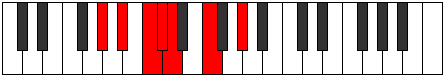
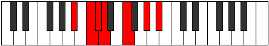
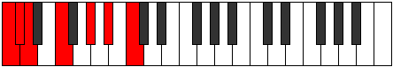
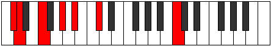
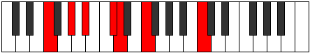

# Mode AFlatAeronimic

## Links

- [Documentation](index.md)
- [Scales Index](Scales.md)
- [Modes Index](Modes.md)
- [Chords Index](Chords.md)

## Scale

[Palimic](ScalePalimic.md)

## Mode

[AFlatAeronimic](ModeAFlatAeronimic.md)

## Tonic

Ab

## Signature

[CNaturalMajor]

## Perfection

 - 3 Perfect Notes

 - 3 Imperfect Notes

## Notes

- Ab (Imperfect)
- Bb
- C (Imperfect)
- Db
- Ebb (Imperfect)
- F
- Ab (Imperfect)

## Illustration

## Relative Modes

| Number | Mode | Tonic | Notes | Illustration |
|--------|------|-------|-------|--------------|
| [629](https://ianring.com/musictheory/scales/629) | [Aeronimic](ModeAeronimic.md) | Ab | Ab, Bb, C, Db, Ebb, F, Ab |  |
| [1181](https://ianring.com/musictheory/scales/1181) | [Katagimic](ModeKatagimic.md) | Bb | Bb, C, Db, Ebb, F, G#, Bb |  |
| [1319](https://ianring.com/musictheory/scales/1319) | [Phronimic](ModePhronimic.md) | C | C, Db, Ebb, F, G#, A#, C |  |
| [2707](https://ianring.com/musictheory/scales/2707) | [Banimic](ModeBanimic.md) | Db | Db, Ebb, F, G#, A#, B#, Db |  |
| [937](https://ianring.com/musictheory/scales/937) | [Stothimic](ModeStothimic.md) | F | F, G#, A#, B#, C#, D, F |  |

## Chords

### Ab

| Number | Root | Name | Notes | Illustration | Audio |
|--------|------|------|-------|--------------|-------|
| 1282 | Ab | [Absus2bb5](ChordAFlatSuspendedSecondDoubleFlatFifth.md) | Ab, Bb, Db |  | [midi](ChordAFlatSuspendedSecondDoubleFlatFifthRootPosition.mid) |
| 1284 | Ab | [Absus2b5](ChordAFlatSuspendedSecondFlatFifth.md) | Ab, Bb, Ebb |  | [midi](ChordAFlatSuspendedSecondFlatFifthRootPosition.mid) |
| 261 | Ab | [AbMb5](ChordAFlatMajorFlatFifth.md) | Ab, C, Ebb |  | [midi](ChordAFlatMajorFlatFifthRootPosition.mid) |
| 262 | Ab | [Absus4b5](ChordAFlatSuspendedFourthFlatFifth.md) | Ab, Db, Ebb |  | [midi](ChordAFlatSuspendedFourthFlatFifthRootPosition.mid) |
| 289 | Ab | [AbM##5](ChordAFlatMajorDoubleSharpFifth.md) | Ab, C, F |  | [midi](ChordAFlatMajorDoubleSharpFifthRootPosition.mid) |
| 290 | Ab | [Absus4##5](ChordAFlatSuspendedFourthDoubleSharpFifth.md) | Ab, Db, F |  | [midi](ChordAFlatSuspendedFourthDoubleSharpFifthRootPosition.mid) |
| 1314 | Ab | [AbM6sus2bb5](ChordAFlatMajorSixthSuspendedSecondDoubleFlatFifth.md) | Ab, Bb, Db, F |  | [midi](ChordAFlatMajorSixthSuspendedSecondDoubleFlatFifthRootPosition.mid) |
| 1316 | Ab | [AbM6sus2b5](ChordAFlatMajorSixthSuspendedSecondFlatFifth.md) | Ab, Bb, Ebb, F |  | [midi](ChordAFlatMajorSixthSuspendedSecondFlatFifthRootPosition.mid) |
| 293 | Ab | [AbM6b5](ChordAFlatMajorSixthFlatFifth.md) | Ab, C, Ebb, F |  | [midi](ChordAFlatMajorSixthFlatFifthRootPosition.mid) |

### Bb

| Number | Root | Name | Notes | Illustration | Audio |
|--------|------|------|-------|--------------|-------|
| 1056 | Bb | [Bb5](ChordBFlatPowerChord.md) | Bb, F |  | [midi](ChordBFlatPowerChordRootPosition.mid) |
| 1057 | Bb | [Bbsus2](ChordBFlatSuspendedSecond.md) | Bb, C, F |  | [midi](ChordBFlatSuspendedSecondRootPosition.mid) |
| 1058 | Bb | [Bbm](ChordBFlatMinor.md) | Bb, Db, F |  | [midi](ChordBFlatMinorRootPosition.mid) |
| 1058 | Bb | [Bbm(add(#9))](ChordBFlatMinorAddSharpNinth.md) | Bb, Db, F, C# |  | [midi](ChordBFlatMinorAddSharpNinthRootPosition.mid) |
| 1059 | Bb | [Bbm(add9)](ChordBFlatMinorAddNinth.md) | Bb, Db, F, C |  | [midi](ChordBFlatMinorAddNinthRootPosition.mid) |
| 1060 | Bb | [BbM](ChordBFlatMajor.md) | Bb, D, F |  | [midi](ChordBFlatMajorRootPosition.mid) |
| 1061 | Bb | [BbM(add9)](ChordBFlatMajorAddNinth.md) | Bb, D, F, C |  | [midi](ChordBFlatMajorAddNinthRootPosition.mid) |
| 1062 | Bb | [BbM(add(#9))](ChordBFlatMajorAddSharpNinth.md) | Bb, D, F, C# |  | [midi](ChordBFlatMajorAddSharpNinthRootPosition.mid) |
| 1313 | Bb | [Bb7sus2](ChordBFlatDominantSeventhSuspendedSecond.md) | Bb, C, F, Ab |  | [midi](ChordBFlatDominantSeventhSuspendedSecondRootPosition.mid) |
| 1313 | Bb | [Bb9sus2](ChordBFlatDominantNinthSuspendedSecond.md) | Bb, C, F, Ab, C |  | [midi](ChordBFlatDominantNinthSuspendedSecondRootPosition.mid) |
| 1314 | Bb | [Bbm7](ChordBFlatMinorSeventh.md) | Bb, Db, F, Ab |  | [midi](ChordBFlatMinorSeventhRootPosition.mid) |
| 1315 | Bb | [Bbm9](ChordBFlatMinorNinth.md) | Bb, Db, F, Ab, C |  | [midi](ChordBFlatMinorNinthRootPosition.mid) |
| 1316 | Bb | [Bb7](ChordBFlatDominantSeventh.md) | Bb, D, F, Ab |  | [midi](ChordBFlatDominantSeventhRootPosition.mid) |
| 1317 | Bb | [Bb9](ChordBFlatDominantNinth.md) | Bb, D, F, Ab, C |  | [midi](ChordBFlatDominantNinthRootPosition.mid) |
| 1318 | Bb | [Bb7#9](ChordBFlatDominantSeventhSharpNinth.md) | Bb, D, F, Ab, C# |  | [midi](ChordBFlatDominantSeventhSharpNinthRootPosition.mid) |

### C

| Number | Root | Name | Notes | Illustration | Audio |
|--------|------|------|-------|--------------|-------|
| 37 | C | [Csus2bb5](ChordCNaturalSuspendedSecondDoubleFlatFifth.md) | C, D, F |  | [midi](ChordCNaturalSuspendedSecondDoubleFlatFifthRootPosition.mid) |
| 261 | C | [Csus2#5](ChordCNaturalSuspendedSecondSharpFifth.md) | C, D, G# |  | [midi](ChordCNaturalSuspendedSecondSharpFifthRootPosition.mid) |
| 289 | C | [Csus4#5](ChordCNaturalSuspendedFourthSharpFifth.md) | C, F, G# |  | [midi](ChordCNaturalSuspendedFourthSharpFifthRootPosition.mid) |
| 1057 | C | [CQ](ChordCNaturalQuartal.md) | C, F, Bb |  | [midi](ChordCNaturalQuartalRootPosition.mid) |

### Db

| Number | Root | Name | Notes | Illustration | Audio |
|--------|------|------|-------|--------------|-------|
| 258 | Db | [Db5](ChordDFlatPowerChord.md) | Db, Ab |  | [midi](ChordDFlatPowerChordRootPosition.mid) |
| 262 | Db | [Dbphryg](ChordDFlatPhrygian.md) | Db, Ebb, Ab |  | [midi](ChordDFlatPhrygianRootPosition.mid) |
| 290 | Db | [DbM](ChordDFlatMajor.md) | Db, F, Ab |  | [midi](ChordDFlatMajorRootPosition.mid) |
| 1058 | Db | [DbM##5](ChordDFlatMajorDoubleSharpFifth.md) | Db, F, Bb |  | [midi](ChordDFlatMajorDoubleSharpFifthRootPosition.mid) |
| 1314 | Db | [DbM6](ChordDFlatMajorSixth.md) | Db, F, Ab, Bb |  | [midi](ChordDFlatMajorSixthRootPosition.mid) |
| 1318 | Db | [DbM6(addb9)](ChordDFlatMajorSixthAddFlatNinth.md) | Db, F, Ab, Bb, Ebb |  | [midi](ChordDFlatMajorSixthAddFlatNinthRootPosition.mid) |
| 263 | Db | [Dbphryg+7](ChordDFlatPhrygianAddSeventh.md) | Db, Ebb, Ab, C |  | [midi](ChordDFlatPhrygianAddSeventhRootPosition.mid) |
| 291 | Db | [DbM7](ChordDFlatMajorSeventh.md) | Db, F, Ab, C |  | [midi](ChordDFlatMajorSeventhRootPosition.mid) |
| 1059 | Db | [DbM7##5](ChordDFlatMajorSeventhDoubleSharpFifth.md) | Db, F, Bb, C |  | [midi](ChordDFlatMajorSeventhDoubleSharpFifthRootPosition.mid) |
| 1315 | Db | [DbM7add13](ChordDFlatMajorSeventhAddThirteenth.md) | Db, F, Ab, C, Bb |  | [midi](ChordDFlatMajorSeventhAddThirteenthRootPosition.mid) |

### Ebb

| Number | Root | Name | Notes | Illustration | Audio |
|--------|------|------|-------|--------------|-------|

### F

| Number | Root | Name | Notes | Illustration | Audio |
|--------|------|------|-------|--------------|-------|
| 1312 | F | [Fmbb5](ChordFNaturalMinorDoubleFlatFifth.md) | F, Ab, Bb |  | [midi](ChordFNaturalMinorDoubleFlatFifthRootPosition.mid) |
| 33 | F | [F5](ChordFNaturalPowerChord.md) | F, C |  | [midi](ChordFNaturalPowerChordRootPosition.mid) |
| 289 | F | [Fm](ChordFNaturalMinor.md) | F, Ab, C |  | [midi](ChordFNaturalMinorRootPosition.mid) |
| 289 | F | [Fm(add(#9))](ChordFNaturalMinorAddSharpNinth.md) | F, Ab, C, G# |  | [midi](ChordFNaturalMinorAddSharpNinthRootPosition.mid) |
| 1057 | F | [Fsus4](ChordFNaturalSuspendedFourth.md) | F, Bb, C |  | [midi](ChordFNaturalSuspendedFourthRootPosition.mid) |
| 1313 | F | [Fm(add11)](ChordFNaturalMinorAddEleventh.md) | F, Ab, C, Bb |  | [midi](ChordFNaturalMinorAddEleventhRootPosition.mid) |
| 1313 | F | [Fm(add4)](ChordFNaturalMinorAddFourth.md) | F, Ab, Bb, C |  | [midi](ChordFNaturalMinorAddFourthRootPosition.mid) |
| 290 | F | [Fm#5](ChordFNaturalMinorSharpFifth.md) | F, Ab, Db |  | [midi](ChordFNaturalMinorSharpFifthRootPosition.mid) |
| 1058 | F | [Fsus4#5](ChordFNaturalSuspendedFourthSharpFifth.md) | F, Bb, C# |  | [midi](ChordFNaturalSuspendedFourthSharpFifthRootPosition.mid) |
| 1060 | F | [Fsus4##5](ChordFNaturalSuspendedFourthDoubleSharpFifth.md) | F, Bb, D |  | [midi](ChordFNaturalSuspendedFourthDoubleSharpFifthRootPosition.mid) |
| 293 | F | [Fm6](ChordFNaturalMinorSixth.md) | F, Ab, C, D |  | [midi](ChordFNaturalMinorSixthRootPosition.mid) |
| 1061 | F | [FM6sus4](ChordFNaturalMajorSixthSuspendedFourth.md) | F, Bb, C, D |  | [midi](ChordFNaturalMajorSixthSuspendedFourthRootPosition.mid) |

