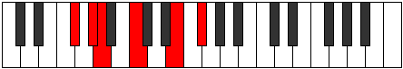
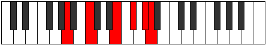

# Mode AFlatAerophitonic

## Links

- [Documentation](index.md)
- [Scales Index](Scales.md)
- [Modes Index](Modes.md)
- [Chords Index](Chords.md)

## Scale

[Aerynitonic](ScaleAerynitonic.md)

## Mode

[AFlatAerophitonic](ModeAFlatAerophitonic.md)

## Tonic

Ab

## Signature

[CNaturalMajor]

## Perfection

 - 1 Perfect Notes

 - 4 Imperfect Notes

## Notes

- Ab (Imperfect)
- A
- C (Imperfect)
- E (Imperfect)
- Gb (Imperfect)
- Ab (Imperfect)

## Illustration

## Relative Modes

| Number | Mode | Tonic | Notes | Illustration |
|--------|------|-------|-------|--------------|
| [309](https://ianring.com/musictheory/scales/309) | [Palitonic](ModePalitonic.md) | E | E, F#, G#, A, C, E |  |
| [849](https://ianring.com/musictheory/scales/849) | [Aerynitonic](ModeAerynitonic.md) | C | C, E, F#, G#, A, C |  |
| [1101](https://ianring.com/musictheory/scales/1101) | [Stothitonic](ModeStothitonic.md) | F# | F#, G#, A, C, E, F# |  |
| [1101](https://ianring.com/musictheory/scales/1101) | [Stothitonic](ModeStothitonic.md) | Gb | Gb, Ab, A, C, E, Gb |  |
| [1299](https://ianring.com/musictheory/scales/1299) | [Aerophitonic](ModeAerophitonic.md) | G# | G#, A, C, E, F#, G# |  |
| [1299](https://ianring.com/musictheory/scales/1299) | [Aerophitonic](ModeAerophitonic.md) | Ab | Ab, A, C, E, Gb, Ab |  |
| [2697](https://ianring.com/musictheory/scales/2697) | [Katagitonic](ModeKatagitonic.md) | A | A, C, E, F#, G#, A |  |

## Chords

### Ab

| Number | Root | Name | Notes | Illustration | Audio |
|--------|------|------|-------|--------------|-------|

### A

| Number | Root | Name | Notes | Illustration | Audio |
|--------|------|------|-------|--------------|-------|
| 528 | A | [A5](ChordANaturalPowerChord.md) | A, E |  | [midi](ChordANaturalPowerChordRootPosition.mid) [ogg](ChordANaturalPowerChordRootPosition.ogg) |
| 529 | A | [Am](ChordANaturalMinor.md) | A, C, E |  | [midi](ChordANaturalMinorRootPosition.mid) [ogg](ChordANaturalMinorRootPosition.ogg) |
| 529 | A | [Am(add(#9))](ChordANaturalMinorAddSharpNinth.md) | A, C, E, B# |  | [midi](ChordANaturalMinorAddSharpNinthRootPosition.mid) [ogg](ChordANaturalMinorAddSharpNinthRootPosition.ogg) |
| 593 | A | [Am6](ChordANaturalMinorSixth.md) | A, C, E, F# |  | [midi](ChordANaturalMinorSixthRootPosition.mid) [ogg](ChordANaturalMinorSixthRootPosition.ogg) |
| 785 | A | [Am(M7)](ChordANaturalMinorMajorSeventh.md) | A, C, E, G# |  | [midi](ChordANaturalMinorMajorSeventhRootPosition.mid) [ogg](ChordANaturalMinorMajorSeventhRootPosition.ogg) |
| 849 | A | [Am(M7)add13](ChordANaturalMinorMajorSeventhAddThirteenth.md) | A, C, E, G#, F# |  | [midi](ChordANaturalMinorMajorSeventhAddThirteenthRootPosition.mid) [ogg](ChordANaturalMinorMajorSeventhAddThirteenthRootPosition.ogg) |

### C

| Number | Root | Name | Notes | Illustration | Audio |
|--------|------|------|-------|--------------|-------|
| 81 | C | [CMb5](ChordCNaturalMajorFlatFifth.md) | C, E, Gb |  | [midi](ChordCNaturalMajorFlatFifthRootPosition.mid) [ogg](ChordCNaturalMajorFlatFifthRootPosition.ogg) |
| 273 | C | [C+](ChordCNaturalAugmented.md) | C, E, G# |  | [midi](ChordCNaturalAugmentedRootPosition.mid) [ogg](ChordCNaturalAugmentedRootPosition.ogg) |
| 273 | C | [C+7](ChordCNaturalAugmentedAugmentedSeventh.md) | C, E, G#, B# |  | [midi](ChordCNaturalAugmentedAugmentedSeventhRootPosition.mid) [ogg](ChordCNaturalAugmentedAugmentedSeventhRootPosition.ogg) |
| 529 | C | [CM##5](ChordCNaturalMajorDoubleSharpFifth.md) | C, E, A |  | [midi](ChordCNaturalMajorDoubleSharpFifthRootPosition.mid) [ogg](ChordCNaturalMajorDoubleSharpFifthRootPosition.ogg) |
| 593 | C | [CM6b5](ChordCNaturalMajorSixthFlatFifth.md) | C, E, Gb, A |  | [midi](ChordCNaturalMajorSixthFlatFifthRootPosition.mid) [ogg](ChordCNaturalMajorSixthFlatFifthRootPosition.ogg) |

### E

| Number | Root | Name | Notes | Illustration | Audio |
|--------|------|------|-------|--------------|-------|
| 592 | E | [Esus2bb5](ChordENaturalSuspendedSecondDoubleFlatFifth.md) | E, F#, A |  | [midi](ChordENaturalSuspendedSecondDoubleFlatFifthRootPosition.mid) [ogg](ChordENaturalSuspendedSecondDoubleFlatFifthRootPosition.ogg) |
| 81 | E | [Esus2#5](ChordENaturalSuspendedSecondSharpFifth.md) | E, F#, B# |  | [midi](ChordENaturalSuspendedSecondSharpFifthRootPosition.mid) [ogg](ChordENaturalSuspendedSecondSharpFifthRootPosition.ogg) |
| 273 | E | [E+](ChordENaturalAugmented.md) | E, G#, B# |  | [midi](ChordENaturalAugmentedRootPosition.mid) [ogg](ChordENaturalAugmentedRootPosition.ogg) |
| 273 | E | [E+7](ChordENaturalAugmentedAugmentedSeventh.md) | E, G#, B#, D## |  | [midi](ChordENaturalAugmentedAugmentedSeventhRootPosition.mid) [ogg](ChordENaturalAugmentedAugmentedSeventhRootPosition.ogg) |
| 529 | E | [Esus4#5](ChordENaturalSuspendedFourthSharpFifth.md) | E, A, B# |  | [midi](ChordENaturalSuspendedFourthSharpFifthRootPosition.mid) [ogg](ChordENaturalSuspendedFourthSharpFifthRootPosition.ogg) |

### Gb

| Number | Root | Name | Notes | Illustration | Audio |
|--------|------|------|-------|--------------|-------|

