# Mode AFlatAerorian

## Links

- [Documentation](README.md)
- [Scales Index](Scales.md)
- [Modes Index](Modes.md)
- [Chords Index](Chords.md)

## Scale

[Palian](ScalePalian.md)

## Mode

[AFlatAerorian](ModeAFlatAerorian.md)

## Tonic

Ab

## Signature

[CNaturalMajor]

## Transposition

2, 2, 1, 2, 1, 3, 1

## Chord Pattern

I, ii⁰, iii, iv, V, VI⁺, vii⁰

## Perfection

 - 4 Perfect Notes

 - 3 Imperfect Notes

## Notes

- Ab
- Bb (Imperfect)
- C
- Db
- Eb
- Fb (Imperfect)
- G (Imperfect)
- Ab

## Illustration

## Diagram

| Circle of Fifth | Chromatic Circle |
|-----------------|------------------|
| 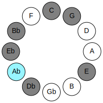 | 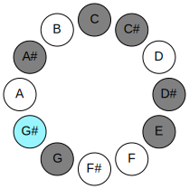 |
## Relative Modes

| Number | Mode | Tonic | Notes | Illustration |
|--------|------|-------|-------|--------------|
| [2485](https://ianring.com/musictheory/scales/2485) | [Aerorian](ModeAerorian.md) | G# | G#, A#, B#, C#, D#, E, F##, G# |  |
| [2485](https://ianring.com/musictheory/scales/2485) | [Aerorian](ModeAerorian.md) | Ab | Ab, Bb, C, Db, Eb, Fb, G, Ab |  |
| [1645](https://ianring.com/musictheory/scales/1645) | [Katagian](ModeKatagian.md) | A# | A#, B#, C#, D#, E, F##, G#, A# |  |
| [1645](https://ianring.com/musictheory/scales/1645) | [Katagian](ModeKatagian.md) | Bb | Bb, C, Db, Eb, Fb, G, Ab, Bb |  |
| [1435](https://ianring.com/musictheory/scales/1435) | [Phronian](ModePhronian.md) | C | C, Db, Eb, Fb, G, Ab, Bb, C |  |
| [2765](https://ianring.com/musictheory/scales/2765) | [Banian](ModeBanian.md) | C# | C#, D#, E, F##, G#, A#, B#, C# |  |
| [2765](https://ianring.com/musictheory/scales/2765) | [Banian](ModeBanian.md) | Db | Db, Eb, Fb, G, Ab, Bb, C, Db |  |
| [1715](https://ianring.com/musictheory/scales/1715) | [Aeronian](ModeAeronian.md) | D# | D#, E, F##, G#, A#, B#, C#, D# |  |
| [1715](https://ianring.com/musictheory/scales/1715) | [Aeronian](ModeAeronian.md) | Eb | Eb, Fb, G, Ab, Bb, C, Db, Eb |  |
| [2905](https://ianring.com/musictheory/scales/2905) | [Palian](ModePalian.md) | E | E, F##, G#, A#, B#, C#, D#, E |  |
| [875](https://ianring.com/musictheory/scales/875) | [Stothian](ModeStothian.md) | G | G, Ab, Bb, C, Db, Eb, Fb, G |  |
## Relative Brightness

| Number | Mode | Tonic | Notes | Circle Of Fifth | Chromatic Circle |
|--------|------|-------|-------|-----------------|------------------|
| [2485](https://ianring.com/musictheory/scales/2485) | [Aerorian](ModeAerorian.md) | G# | G#, A#, B#, C#, D#, E, F##, G# |  |  |
| [2485](https://ianring.com/musictheory/scales/2485) | [Aerorian](ModeAerorian.md) | Ab | Ab, Bb, C, Db, Eb, Fb, G, Ab |  |  |
| [1645](https://ianring.com/musictheory/scales/1645) | [Katagian](ModeKatagian.md) | A# | A#, B#, C#, D#, E, F##, G#, A# | 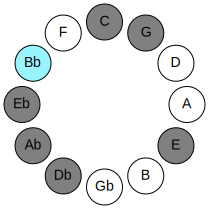 | 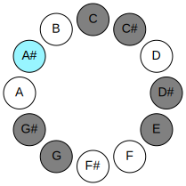 |
| [1645](https://ianring.com/musictheory/scales/1645) | [Katagian](ModeKatagian.md) | Bb | Bb, C, Db, Eb, Fb, G, Ab, Bb |  |  |
| [1435](https://ianring.com/musictheory/scales/1435) | [Phronian](ModePhronian.md) | C | C, Db, Eb, Fb, G, Ab, Bb, C | 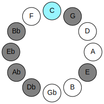 | 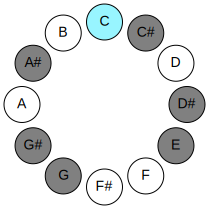 |
| [2765](https://ianring.com/musictheory/scales/2765) | [Banian](ModeBanian.md) | C# | C#, D#, E, F##, G#, A#, B#, C# | 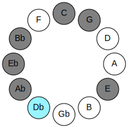 | 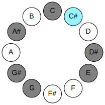 |
| [2765](https://ianring.com/musictheory/scales/2765) | [Banian](ModeBanian.md) | Db | Db, Eb, Fb, G, Ab, Bb, C, Db |  |  |
| [1715](https://ianring.com/musictheory/scales/1715) | [Aeronian](ModeAeronian.md) | D# | D#, E, F##, G#, A#, B#, C#, D# | 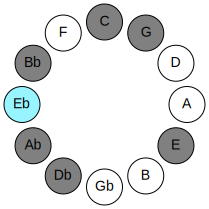 | 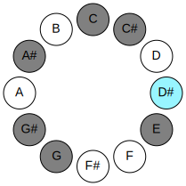 |
| [1715](https://ianring.com/musictheory/scales/1715) | [Aeronian](ModeAeronian.md) | Eb | Eb, Fb, G, Ab, Bb, C, Db, Eb |  |  |
| [2905](https://ianring.com/musictheory/scales/2905) | [Palian](ModePalian.md) | E | E, F##, G#, A#, B#, C#, D#, E | 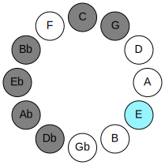 | 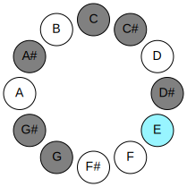 |
| [875](https://ianring.com/musictheory/scales/875) | [Stothian](ModeStothian.md) | G | G, Ab, Bb, C, Db, Eb, Fb, G |  | 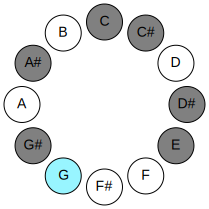 |

## Chords

### Ab

| Number | Root | Name | Notes | Illustration | Audio |
|--------|------|------|-------|--------------|-------|
| 1282 | Ab | [G#sus2bb5](ChordGSharpSuspendedSecondDoubleFlatFifth.md) | G#, A#, C# |  | [midi](ChordGSharpSuspendedSecondDoubleFlatFifthRootPosition.mid) |
| 1282 | Ab | [Absus2bb5](ChordAFlatSuspendedSecondDoubleFlatFifth.md) | Ab, Bb, Db |  | [midi](ChordAFlatSuspendedSecondDoubleFlatFifthRootPosition.mid) |
| 264 | Ab | [G#5](ChordGSharpPowerChord.md) | G#, D# |  | [midi](ChordGSharpPowerChordRootPosition.mid) |
| 264 | Ab | [Ab5](ChordAFlatPowerChord.md) | Ab, Eb |  | [midi](ChordAFlatPowerChordRootPosition.mid) |
| 1288 | Ab | [G#sus2](ChordGSharpSuspendedSecond.md) | G#, A#, D# |  | [midi](ChordGSharpSuspendedSecondRootPosition.mid) |
| 1288 | Ab | [Absus2](ChordAFlatSuspendedSecond.md) | Ab, Bb, Eb |  | [midi](ChordAFlatSuspendedSecondRootPosition.mid) |
| 265 | Ab | [G#M](ChordGSharpMajor.md) | G#, B#, D# |  | [midi](ChordGSharpMajorRootPosition.mid) |
| 265 | Ab | [AbM](ChordAFlatMajor.md) | Ab, C, Eb |  | [midi](ChordAFlatMajorRootPosition.mid) |
| 1289 | Ab | [G#M(add9)](ChordGSharpMajorAddNinth.md) | G#, B#, D#, A# |  | [midi](ChordGSharpMajorAddNinthRootPosition.mid) |
| 1289 | Ab | [AbM(add9)](ChordAFlatMajorAddNinth.md) | Ab, C, Eb, Bb |  | [midi](ChordAFlatMajorAddNinthRootPosition.mid) |
| 266 | Ab | [G#sus4](ChordGSharpSuspendedFourth.md) | G#, C#, D# |  | [midi](ChordGSharpSuspendedFourthRootPosition.mid) |
| 266 | Ab | [Absus4](ChordAFlatSuspendedFourth.md) | Ab, Db, Eb |  | [midi](ChordAFlatSuspendedFourthRootPosition.mid) |
| 267 | Ab | [G#M(add11)](ChordGSharpMajorAddEleventh.md) | G#, B#, D#, C# |  | [midi](ChordGSharpMajorAddEleventhRootPosition.mid) |
| 267 | Ab | [G#M(add4)](ChordGSharpMajorAddFourth.md) | G#, B#, C#, D# |  | [midi](ChordGSharpMajorAddFourthRootPosition.mid) |
| 267 | Ab | [AbM(add11)](ChordAFlatMajorAddEleventh.md) | Ab, C, Eb, Db |  | [midi](ChordAFlatMajorAddEleventhRootPosition.mid) |
| 267 | Ab | [AbM(add4)](ChordAFlatMajorAddFourth.md) | Ab, C, Db, Eb |  | [midi](ChordAFlatMajorAddFourthRootPosition.mid) |
| 1296 | Ab | [G#sus2#5](ChordGSharpSuspendedSecondSharpFifth.md) | G#, A#, D## |  | [midi](ChordGSharpSuspendedSecondSharpFifthRootPosition.mid) |
| 1296 | Ab | [Absus2#5](ChordAFlatSuspendedSecondSharpFifth.md) | Ab, Bb, E |  | [midi](ChordAFlatSuspendedSecondSharpFifthRootPosition.mid) |
| 273 | Ab | [G#+](ChordGSharpAugmented.md) | G#, B#, D## |  | [midi](ChordGSharpAugmentedRootPosition.mid) |
| 273 | Ab | [G#+7](ChordGSharpAugmentedAugmentedSeventh.md) | G#, B#, D##, F### |  | [midi](ChordGSharpAugmentedAugmentedSeventhRootPosition.mid) |
| 273 | Ab | [Ab+](ChordAFlatAugmented.md) | Ab, C, E |  | [midi](ChordAFlatAugmentedRootPosition.mid) |
| 273 | Ab | [Ab+7](ChordAFlatAugmentedAugmentedSeventh.md) | Ab, C, E, G# |  | [midi](ChordAFlatAugmentedAugmentedSeventhRootPosition.mid) |
| 274 | Ab | [G#sus4#5](ChordGSharpSuspendedFourthSharpFifth.md) | G#, C#, D## |  | [midi](ChordGSharpSuspendedFourthSharpFifthRootPosition.mid) |
| 274 | Ab | [Absus4#5](ChordAFlatSuspendedFourthSharpFifth.md) | Ab, Db, E |  | [midi](ChordAFlatSuspendedFourthSharpFifthRootPosition.mid) |
| 386 | Ab | [G#Q+](ChordGSharpQuartalAugmented.md) | G#, C#, F## |  | [midi](ChordGSharpQuartalAugmentedRootPosition.mid) |
| 386 | Ab | [AbQ+](ChordAFlatQuartalAugmented.md) | Ab, Db, G |  | [midi](ChordAFlatQuartalAugmentedRootPosition.mid) |
| 1416 | Ab | [G#M7(sus2)](ChordGSharpMajorSeventhSuspendedSecond.md) | G#, A#, D#, F## |  | [midi](ChordGSharpMajorSeventhSuspendedSecondRootPosition.mid) |
| 1416 | Ab | [G#M9sus2](ChordGSharpMajorNinthSuspendedSecond.md) | G#, A#, D#, F##, A# |  | [midi](ChordGSharpMajorNinthSuspendedSecondRootPosition.mid) |
| 1416 | Ab | [AbM7(sus2)](ChordAFlatMajorSeventhSuspendedSecond.md) | Ab, Bb, Eb, G |  | [midi](ChordAFlatMajorSeventhSuspendedSecondRootPosition.mid) |
| 1416 | Ab | [AbM9sus2](ChordAFlatMajorNinthSuspendedSecond.md) | Ab, Bb, Eb, G, Bb |  | [midi](ChordAFlatMajorNinthSuspendedSecondRootPosition.mid) |
| 393 | Ab | [G#M7](ChordGSharpMajorSeventh.md) | G#, B#, D#, F## |  | [midi](ChordGSharpMajorSeventhRootPosition.mid) |
| 393 | Ab | [AbM7](ChordAFlatMajorSeventh.md) | Ab, C, Eb, G |  | [midi](ChordAFlatMajorSeventhRootPosition.mid) |
| 1417 | Ab | [G#M9](ChordGSharpMajorNinth.md) | G#, B#, D#, F##, A# |  | [midi](ChordGSharpMajorNinthRootPosition.mid) |
| 1417 | Ab | [AbM9](ChordAFlatMajorNinth.md) | Ab, C, Eb, G, Bb |  | [midi](ChordAFlatMajorNinthRootPosition.mid) |
| 394 | Ab | [G#M7(sus4)](ChordGSharpMajorSeventhSuspendedFourth.md) | G#, C#, D#, F## |  | [midi](ChordGSharpMajorSeventhSuspendedFourthRootPosition.mid) |
| 394 | Ab | [AbM7(sus4)](ChordAFlatMajorSeventhSuspendedFourth.md) | Ab, Db, Eb, G |  | [midi](ChordAFlatMajorSeventhSuspendedFourthRootPosition.mid) |
| 1418 | Ab | [G#M9sus4](ChordGSharpMajorNinthSuspendedFourth.md) | G#, C#, D#, F##, A# |  | [midi](ChordGSharpMajorNinthSuspendedFourthRootPosition.mid) |
| 1418 | Ab | [AbM9sus4](ChordAFlatMajorNinthSuspendedFourth.md) | Ab, Db, Eb, G, Bb |  | [midi](ChordAFlatMajorNinthSuspendedFourthRootPosition.mid) |
| 395 | Ab | [G#M7add4](ChordGSharpMajorSeventhAddFourth.md) | G#, B#, C#, D#, F## |  | [midi](ChordGSharpMajorSeventhAddFourthRootPosition.mid) |
| 395 | Ab | [G#M7add11](ChordGSharpMajorSeventhAddEleventh.md) | G#, B#, D#, F##, C# |  | [midi](ChordGSharpMajorSeventhAddEleventhRootPosition.mid) |
| 395 | Ab | [AbM7add4](ChordAFlatMajorSeventhAddFourth.md) | Ab, C, Db, Eb, G |  | [midi](ChordAFlatMajorSeventhAddFourthRootPosition.mid) |
| 395 | Ab | [AbM7add11](ChordAFlatMajorSeventhAddEleventh.md) | Ab, C, Eb, G, Db |  | [midi](ChordAFlatMajorSeventhAddEleventhRootPosition.mid) |
| 1419 | Ab | [G#M11](ChordGSharpMajorEleventh.md) | G#, B#, D#, F##, A#, C# |  | [midi](ChordGSharpMajorEleventhRootPosition.mid) |
| 1419 | Ab | [AbM11](ChordAFlatMajorEleventh.md) | Ab, C, Eb, G, Bb, Db |  | [midi](ChordAFlatMajorEleventhRootPosition.mid) |
| 401 | Ab | [G#+(M7)](ChordGSharpAugmentedMajorSeventh.md) | G#, B#, D##, F## |  | [midi](ChordGSharpAugmentedMajorSeventhRootPosition.mid) |
| 401 | Ab | [Ab+(M7)](ChordAFlatAugmentedMajorSeventh.md) | Ab, C, E, G |  | [midi](ChordAFlatAugmentedMajorSeventhRootPosition.mid) |
| 402 | Ab | [G#M7(sus4)#5](ChordGSharpMajorSeventhSuspendedFourthSharpFifth.md) | G#, C#, D##, F## |  | [midi](ChordGSharpMajorSeventhSuspendedFourthSharpFifthRootPosition.mid) |
| 402 | Ab | [AbM7(sus4)#5](ChordAFlatMajorSeventhSuspendedFourthSharpFifth.md) | Ab, Db, E, G |  | [midi](ChordAFlatMajorSeventhSuspendedFourthSharpFifthRootPosition.mid) |

### Bb

| Number | Root | Name | Notes | Illustration | Audio |
|--------|------|------|-------|--------------|-------|
| 1033 | Bb | [A#sus2bb5](ChordASharpSuspendedSecondDoubleFlatFifth.md) | A#, B#, D# |  | [midi](ChordASharpSuspendedSecondDoubleFlatFifthRootPosition.mid) |
| 1033 | Bb | [Bbsus2bb5](ChordBFlatSuspendedSecondDoubleFlatFifth.md) | Bb, C, Eb |  | [midi](ChordBFlatSuspendedSecondDoubleFlatFifthRootPosition.mid) |
| 1034 | Bb | [A#mbb5](ChordASharpMinorDoubleFlatFifth.md) | A#, C#, D# |  | [midi](ChordASharpMinorDoubleFlatFifthRootPosition.mid) |
| 1034 | Bb | [Bbmbb5](ChordBFlatMinorDoubleFlatFifth.md) | Bb, Db, Eb |  | [midi](ChordBFlatMinorDoubleFlatFifthRootPosition.mid) |
| 1041 | Bb | [A#](ChordASharpDiminishedFlatThird.md) | A#, C, E |  | [midi](ChordASharpDiminishedFlatThirdRootPosition.mid) |
| 1041 | Bb | [A#sus2b5](ChordASharpSuspendedSecondFlatFifth.md) | A#, B#, E |  | [midi](ChordASharpSuspendedSecondFlatFifthRootPosition.mid) |
| 1041 | Bb | [Bb](ChordBFlatDiminishedFlatThird.md) | Bb, Dbb, Fb |  | [midi](ChordBFlatDiminishedFlatThirdRootPosition.mid) |
| 1041 | Bb | [Bbsus2b5](ChordBFlatSuspendedSecondFlatFifth.md) | Bb, C, Fb |  | [midi](ChordBFlatSuspendedSecondFlatFifthRootPosition.mid) |
| 1042 | Bb | [A#o](ChordASharpDiminished.md) | A#, C#, E |  | [midi](ChordASharpDiminishedRootPosition.mid) |
| 1042 | Bb | [Bbo](ChordBFlatDiminished.md) | Bb, Db, Fb |  | [midi](ChordBFlatDiminishedRootPosition.mid) |
| 1048 | Bb | [A#sus4b5](ChordASharpSuspendedFourthFlatFifth.md) | A#, D#, E |  | [midi](ChordASharpSuspendedFourthFlatFifthRootPosition.mid) |
| 1048 | Bb | [Bbsus4b5](ChordBFlatSuspendedFourthFlatFifth.md) | Bb, Eb, Fb |  | [midi](ChordBFlatSuspendedFourthFlatFifthRootPosition.mid) |
| 1160 | Bb | [A#sus4##5](ChordASharpSuspendedFourthDoubleSharpFifth.md) | A#, D#, F## |  | [midi](ChordASharpSuspendedFourthDoubleSharpFifthRootPosition.mid) |
| 1160 | Bb | [Bbsus4##5](ChordBFlatSuspendedFourthDoubleSharpFifth.md) | Bb, Eb, G |  | [midi](ChordBFlatSuspendedFourthDoubleSharpFifthRootPosition.mid) |
| 1161 | Bb | [A#M6sus2bb5](ChordASharpMajorSixthSuspendedSecondDoubleFlatFifth.md) | A#, B#, D#, F## |  | [midi](ChordASharpMajorSixthSuspendedSecondDoubleFlatFifthRootPosition.mid) |
| 1161 | Bb | [BbM6sus2bb5](ChordBFlatMajorSixthSuspendedSecondDoubleFlatFifth.md) | Bb, C, Eb, G |  | [midi](ChordBFlatMajorSixthSuspendedSecondDoubleFlatFifthRootPosition.mid) |
| 1169 | Bb | [A#M6sus2b5](ChordASharpMajorSixthSuspendedSecondFlatFifth.md) | A#, B#, E, F## |  | [midi](ChordASharpMajorSixthSuspendedSecondFlatFifthRootPosition.mid) |
| 1169 | Bb | [BbM6sus2b5](ChordBFlatMajorSixthSuspendedSecondFlatFifth.md) | Bb, C, Fb, G |  | [midi](ChordBFlatMajorSixthSuspendedSecondFlatFifthRootPosition.mid) |
| 1170 | Bb | [A#o7](ChordASharpFullDiminishedSeventh.md) | A#, C#, E, G |  | [midi](ChordASharpFullDiminishedSeventhRootPosition.mid) |
| 1170 | Bb | [Bbo7](ChordBFlatFullDiminishedSeventh.md) | Bb, Db, Fb, Abb |  | [midi](ChordBFlatFullDiminishedSeventhRootPosition.mid) |
| 1288 | Bb | [A#Q](ChordASharpQuartal.md) | A#, D#, G# |  | [midi](ChordASharpQuartalRootPosition.mid) |
| 1288 | Bb | [BbQ](ChordBFlatQuartal.md) | Bb, Eb, Ab |  | [midi](ChordBFlatQuartalRootPosition.mid) |
| 1290 | Bb | [A#m7bb5](ChordASharpMinorSeventhDoubleFlatFifth.md) | A#, C#, D#, G# |  | [midi](ChordASharpMinorSeventhDoubleFlatFifthRootPosition.mid) |
| 1290 | Bb | [Bbm7bb5](ChordBFlatMinorSeventhDoubleFlatFifth.md) | Bb, Db, Eb, Ab |  | [midi](ChordBFlatMinorSeventhDoubleFlatFifthRootPosition.mid) |
| 1298 | Bb | [A#ø7](ChordASharpHalfDiminishedSeventh.md) | A#, C#, E, G# |  | [midi](ChordASharpHalfDiminishedSeventhRootPosition.mid) |
| 1298 | Bb | [Bbø7](ChordBFlatHalfDiminishedSeventh.md) | Bb, Db, Fb, Ab |  | [midi](ChordBFlatHalfDiminishedSeventhRootPosition.mid) |

### C

| Number | Root | Name | Notes | Illustration | Audio |
|--------|------|------|-------|--------------|-------|
| 129 | C | [C5](ChordCNaturalPowerChord.md) | C, G |  | [midi](ChordCNaturalPowerChordRootPosition.mid) |
| 131 | C | [Cphryg](ChordCNaturalPhrygian.md) | C, Db, G |  | [midi](ChordCNaturalPhrygianRootPosition.mid) |
| 137 | C | [Cm](ChordCNaturalMinor.md) | C, Eb, G |  | [midi](ChordCNaturalMinorRootPosition.mid) |
| 137 | C | [Cm(add(#9))](ChordCNaturalMinorAddSharpNinth.md) | C, Eb, G, D# |  | [midi](ChordCNaturalMinorAddSharpNinthRootPosition.mid) |
| 145 | C | [CM](ChordCNaturalMajor.md) | C, E, G |  | [midi](ChordCNaturalMajorRootPosition.mid) |
| 153 | C | [CM(add(#9))](ChordCNaturalMajorAddSharpNinth.md) | C, E, G, D# |  | [midi](ChordCNaturalMajorAddSharpNinthRootPosition.mid) |
| 265 | C | [Cm#5](ChordCNaturalMinorSharpFifth.md) | C, Eb, Ab |  | [midi](ChordCNaturalMinorSharpFifthRootPosition.mid) |
| 273 | C | [C+](ChordCNaturalAugmented.md) | C, E, G# |  | [midi](ChordCNaturalAugmentedRootPosition.mid) |
| 273 | C | [C+7](ChordCNaturalAugmentedAugmentedSeventh.md) | C, E, G#, B# |  | [midi](ChordCNaturalAugmentedAugmentedSeventhRootPosition.mid) |
| 1161 | C | [Cm7](ChordCNaturalMinorSeventh.md) | C, Eb, G, Bb |  | [midi](ChordCNaturalMinorSeventhRootPosition.mid) |
| 1163 | C | [Cm7b9](ChordCNaturalMinorSeventhFlatNinth.md) | C, Eb, G, Bb, Db |  | [midi](ChordCNaturalMinorSeventhFlatNinthRootPosition.mid) |
| 1169 | C | [C7](ChordCNaturalDominantSeventh.md) | C, E, G, Bb |  | [midi](ChordCNaturalDominantSeventhRootPosition.mid) |
| 1171 | C | [C7b9](ChordCNaturalDominantSeventhFlatNinth.md) | C, E, G, Bb, Db |  | [midi](ChordCNaturalDominantSeventhFlatNinthRootPosition.mid) |
| 1177 | C | [C7#9](ChordCNaturalDominantSeventhSharpNinth.md) | C, E, G, Bb, D# |  | [midi](ChordCNaturalDominantSeventhSharpNinthRootPosition.mid) |
| 1289 | C | [Cm7#5](ChordCNaturalMinorSeventhSharpFifth.md) | C, Eb, G#, Bb |  | [midi](ChordCNaturalMinorSeventhSharpFifthRootPosition.mid) |
| 1299 | C | [C7#5b9](ChordCNaturalDominantSeventhSharpFifthFlatNinth.md) | C, E, G#, Bb, Db |  | [midi](ChordCNaturalDominantSeventhSharpFifthFlatNinthRootPosition.mid) |
| 1427 | C | [C7b9b13](ChordCNaturalDominantSeventhFlatNinthFlatThirteenth.md) | C, E, G, Bb, Db, Ab |  | [midi](ChordCNaturalDominantSeventhFlatNinthFlatThirteenthRootPosition.mid) |

### Db

| Number | Root | Name | Notes | Illustration | Audio |
|--------|------|------|-------|--------------|-------|
| 138 | Db | [C#](ChordCSharpDiminishedFlatThird.md) | C#, Eb, G |  | [midi](ChordCSharpDiminishedFlatThirdRootPosition.mid) |
| 138 | Db | [C#sus2b5](ChordCSharpSuspendedSecondFlatFifth.md) | C#, D#, G |  | [midi](ChordCSharpSuspendedSecondFlatFifthRootPosition.mid) |
| 138 | Db | [Db](ChordDFlatDiminishedFlatThird.md) | Db, Fbb, Abb |  | [midi](ChordDFlatDiminishedFlatThirdRootPosition.mid) |
| 138 | Db | [Dbsus2b5](ChordDFlatSuspendedSecondFlatFifth.md) | Db, Eb, Abb |  | [midi](ChordDFlatSuspendedSecondFlatFifthRootPosition.mid) |
| 146 | Db | [C#o](ChordCSharpDiminished.md) | C#, E, G |  | [midi](ChordCSharpDiminishedRootPosition.mid) |
| 146 | Db | [Dbo](ChordDFlatDiminished.md) | Db, Fb, Abb |  | [midi](ChordDFlatDiminishedRootPosition.mid) |
| 258 | Db | [C#5](ChordCSharpPowerChord.md) | C#, G# |  | [midi](ChordCSharpPowerChordRootPosition.mid) |
| 258 | Db | [Db5](ChordDFlatPowerChord.md) | Db, Ab |  | [midi](ChordDFlatPowerChordRootPosition.mid) |
| 266 | Db | [C#sus2](ChordCSharpSuspendedSecond.md) | C#, D#, G# |  | [midi](ChordCSharpSuspendedSecondRootPosition.mid) |
| 266 | Db | [Dbsus2](ChordDFlatSuspendedSecond.md) | Db, Eb, Ab |  | [midi](ChordDFlatSuspendedSecondRootPosition.mid) |
| 274 | Db | [C#m](ChordCSharpMinor.md) | C#, E, G# |  | [midi](ChordCSharpMinorRootPosition.mid) |
| 274 | Db | [C#m(add(#9))](ChordCSharpMinorAddSharpNinth.md) | C#, E, G#, D## |  | [midi](ChordCSharpMinorAddSharpNinthRootPosition.mid) |
| 274 | Db | [Dbm](ChordDFlatMinor.md) | Db, Fb, Ab |  | [midi](ChordDFlatMinorRootPosition.mid) |
| 274 | Db | [Dbm(add(#9))](ChordDFlatMinorAddSharpNinth.md) | Db, Fb, Ab, E |  | [midi](ChordDFlatMinorAddSharpNinthRootPosition.mid) |
| 282 | Db | [C#m(add9)](ChordCSharpMinorAddNinth.md) | C#, E, G#, D# |  | [midi](ChordCSharpMinorAddNinthRootPosition.mid) |
| 282 | Db | [Dbm(add9)](ChordDFlatMinorAddNinth.md) | Db, Fb, Ab, Eb |  | [midi](ChordDFlatMinorAddNinthRootPosition.mid) |
| 386 | Db | [C#lyd](ChordCSharpLydian.md) | C#, F##, G# |  | [midi](ChordCSharpLydianRootPosition.mid) |
| 386 | Db | [Dblyd](ChordDFlatLydian.md) | Db, G, Ab |  | [midi](ChordDFlatLydianRootPosition.mid) |
| 402 | Db | [C#m(add(#4))](ChordCSharpMinorAddSharpFourth.md) | C#, E, F##, G# |  | [midi](ChordCSharpMinorAddSharpFourthRootPosition.mid) |
| 402 | Db | [Dbm(add(#4))](ChordDFlatMinorAddSharpFourth.md) | Db, Fb, G, Ab |  | [midi](ChordDFlatMinorAddSharpFourthRootPosition.mid) |
| 1162 | Db | [C#M6sus2b5](ChordCSharpMajorSixthSuspendedSecondFlatFifth.md) | C#, D#, G, A# |  | [midi](ChordCSharpMajorSixthSuspendedSecondFlatFifthRootPosition.mid) |
| 1162 | Db | [DbM6sus2b5](ChordDFlatMajorSixthSuspendedSecondFlatFifth.md) | Db, Eb, Abb, Bb |  | [midi](ChordDFlatMajorSixthSuspendedSecondFlatFifthRootPosition.mid) |
| 1170 | Db | [C#o7](ChordCSharpFullDiminishedSeventh.md) | C#, E, G, Bb |  | [midi](ChordCSharpFullDiminishedSeventhRootPosition.mid) |
| 1170 | Db | [Dbo7](ChordDFlatFullDiminishedSeventh.md) | Db, Fb, Abb, Cbb |  | [midi](ChordDFlatFullDiminishedSeventhRootPosition.mid) |
| 1290 | Db | [C#M6sus2](ChordCSharpMajorSixthSuspendedSecond.md) | C#, D#, G#, A# |  | [midi](ChordCSharpMajorSixthSuspendedSecondRootPosition.mid) |
| 1290 | Db | [C#7sus2b5](ChordCSharpDominantSeventhSuspendedSecondFlatFifth.md) | C#, D#, G#, Bb |  | [midi](ChordCSharpDominantSeventhSuspendedSecondFlatFifthRootPosition.mid) |
| 1290 | Db | [DbM6sus2](ChordDFlatMajorSixthSuspendedSecond.md) | Db, Eb, Ab, Bb |  | [midi](ChordDFlatMajorSixthSuspendedSecondRootPosition.mid) |
| 1290 | Db | [Db7sus2b5](ChordDFlatDominantSeventhSuspendedSecondFlatFifth.md) | Db, Eb, Ab, Cbb |  | [midi](ChordDFlatDominantSeventhSuspendedSecondFlatFifthRootPosition.mid) |
| 1298 | Db | [C#m6](ChordCSharpMinorSixth.md) | C#, E, G#, A# |  | [midi](ChordCSharpMinorSixthRootPosition.mid) |
| 1298 | Db | [Dbm6](ChordDFlatMinorSixth.md) | Db, Fb, Ab, Bb |  | [midi](ChordDFlatMinorSixthRootPosition.mid) |
| 1306 | Db | [C#m6(add9)](ChordCSharpMinorSixthAddNinth.md) | C#, E, G#, A#, D# |  | [midi](ChordCSharpMinorSixthAddNinthRootPosition.mid) |
| 1306 | Db | [Dbm6(add9)](ChordDFlatMinorSixthAddNinth.md) | Db, Fb, Ab, Bb, Eb |  | [midi](ChordDFlatMinorSixthAddNinthRootPosition.mid) |
| 147 | Db | [C#oM7](ChordCSharpDiminishedMajorSeventh.md) | C#, E, G, B# |  | [midi](ChordCSharpDiminishedMajorSeventhRootPosition.mid) |
| 147 | Db | [DboM7](ChordDFlatDiminishedMajorSeventh.md) | Db, Fb, Abb, C |  | [midi](ChordDFlatDiminishedMajorSeventhRootPosition.mid) |
| 267 | Db | [C#M7(sus2)](ChordCSharpMajorSeventhSuspendedSecond.md) | C#, D#, G#, B# |  | [midi](ChordCSharpMajorSeventhSuspendedSecondRootPosition.mid) |
| 267 | Db | [C#M9sus2](ChordCSharpMajorNinthSuspendedSecond.md) | C#, D#, G#, B#, D# |  | [midi](ChordCSharpMajorNinthSuspendedSecondRootPosition.mid) |
| 267 | Db | [DbM7(sus2)](ChordDFlatMajorSeventhSuspendedSecond.md) | Db, Eb, Ab, C |  | [midi](ChordDFlatMajorSeventhSuspendedSecondRootPosition.mid) |
| 267 | Db | [DbM9sus2](ChordDFlatMajorNinthSuspendedSecond.md) | Db, Eb, Ab, C, Eb |  | [midi](ChordDFlatMajorNinthSuspendedSecondRootPosition.mid) |
| 275 | Db | [C#m(M7)](ChordCSharpMinorMajorSeventh.md) | C#, E, G#, B# |  | [midi](ChordCSharpMinorMajorSeventhRootPosition.mid) |
| 275 | Db | [Dbm(M7)](ChordDFlatMinorMajorSeventh.md) | Db, Fb, Ab, C |  | [midi](ChordDFlatMinorMajorSeventhRootPosition.mid) |
| 283 | Db | [C#m(M9)](ChordCSharpMinorMajorNinth.md) | C#, E, G#, B#, D# |  | [midi](ChordCSharpMinorMajorNinthRootPosition.mid) |
| 283 | Db | [Dbm(M9)](ChordDFlatMinorMajorNinth.md) | Db, Fb, Ab, C, Eb |  | [midi](ChordDFlatMinorMajorNinthRootPosition.mid) |
| 387 | Db | [C#lyd(M7)](ChordCSharpLydianMajorSeventh.md) | C#, F##, G#, B# |  | [midi](ChordCSharpLydianMajorSeventhRootPosition.mid) |
| 387 | Db | [Dblyd(M7)](ChordDFlatLydianMajorSeventh.md) | Db, G, Ab, C |  | [midi](ChordDFlatLydianMajorSeventhRootPosition.mid) |
| 1299 | Db | [C#m(M7)add13](ChordCSharpMinorMajorSeventhAddThirteenth.md) | C#, E, G#, B#, A# |  | [midi](ChordCSharpMinorMajorSeventhAddThirteenthRootPosition.mid) |
| 1299 | Db | [Dbm(M7)add13](ChordDFlatMinorMajorSeventhAddThirteenth.md) | Db, Fb, Ab, C, Bb |  | [midi](ChordDFlatMinorMajorSeventhAddThirteenthRootPosition.mid) |

### Eb

| Number | Root | Name | Notes | Illustration | Audio |
|--------|------|------|-------|--------------|-------|
| 1032 | Eb | [D#5](ChordDSharpPowerChord.md) | D#, A# |  | [midi](ChordDSharpPowerChordRootPosition.mid) |
| 1032 | Eb | [Eb5](ChordEFlatPowerChord.md) | Eb, Bb |  | [midi](ChordEFlatPowerChordRootPosition.mid) |
| 1048 | Eb | [D#phryg](ChordDSharpPhrygian.md) | D#, E, A# |  | [midi](ChordDSharpPhrygianRootPosition.mid) |
| 1048 | Eb | [Ebphryg](ChordEFlatPhrygian.md) | Eb, Fb, Bb |  | [midi](ChordEFlatPhrygianRootPosition.mid) |
| 1160 | Eb | [D#M](ChordDSharpMajor.md) | D#, F##, A# |  | [midi](ChordDSharpMajorRootPosition.mid) |
| 1160 | Eb | [EbM](ChordEFlatMajor.md) | Eb, G, Bb |  | [midi](ChordEFlatMajorRootPosition.mid) |
| 1288 | Eb | [D#sus4](ChordDSharpSuspendedFourth.md) | D#, G#, A# |  | [midi](ChordDSharpSuspendedFourthRootPosition.mid) |
| 1288 | Eb | [Ebsus4](ChordEFlatSuspendedFourth.md) | Eb, Ab, Bb |  | [midi](ChordEFlatSuspendedFourthRootPosition.mid) |
| 1416 | Eb | [D#M(add11)](ChordDSharpMajorAddEleventh.md) | D#, F##, A#, G# |  | [midi](ChordDSharpMajorAddEleventhRootPosition.mid) |
| 1416 | Eb | [D#M(add4)](ChordDSharpMajorAddFourth.md) | D#, F##, G#, A# |  | [midi](ChordDSharpMajorAddFourthRootPosition.mid) |
| 1416 | Eb | [EbM(add11)](ChordEFlatMajorAddEleventh.md) | Eb, G, Bb, Ab |  | [midi](ChordEFlatMajorAddEleventhRootPosition.mid) |
| 1416 | Eb | [EbM(add4)](ChordEFlatMajorAddFourth.md) | Eb, G, Ab, Bb |  | [midi](ChordEFlatMajorAddFourthRootPosition.mid) |
| 137 | Eb | [D#M##5](ChordDSharpMajorDoubleSharpFifth.md) | D#, F##, B# |  | [midi](ChordDSharpMajorDoubleSharpFifthRootPosition.mid) |
| 137 | Eb | [EbM##5](ChordEFlatMajorDoubleSharpFifth.md) | Eb, G, C |  | [midi](ChordEFlatMajorDoubleSharpFifthRootPosition.mid) |
| 265 | Eb | [D#sus4##5](ChordDSharpSuspendedFourthDoubleSharpFifth.md) | D#, G#, B# |  | [midi](ChordDSharpSuspendedFourthDoubleSharpFifthRootPosition.mid) |
| 265 | Eb | [Ebsus4##5](ChordEFlatSuspendedFourthDoubleSharpFifth.md) | Eb, Ab, C |  | [midi](ChordEFlatSuspendedFourthDoubleSharpFifthRootPosition.mid) |
| 1161 | Eb | [D#M6](ChordDSharpMajorSixth.md) | D#, F##, A#, B# |  | [midi](ChordDSharpMajorSixthRootPosition.mid) |
| 1161 | Eb | [EbM6](ChordEFlatMajorSixth.md) | Eb, G, Bb, C |  | [midi](ChordEFlatMajorSixthRootPosition.mid) |
| 1177 | Eb | [D#M6(addb9)](ChordDSharpMajorSixthAddFlatNinth.md) | D#, F##, A#, B#, E |  | [midi](ChordDSharpMajorSixthAddFlatNinthRootPosition.mid) |
| 1177 | Eb | [EbM6(addb9)](ChordEFlatMajorSixthAddFlatNinth.md) | Eb, G, Bb, C, Fb |  | [midi](ChordEFlatMajorSixthAddFlatNinthRootPosition.mid) |
| 1289 | Eb | [D#M6sus4](ChordDSharpMajorSixthSuspendedFourth.md) | D#, G#, A#, B# |  | [midi](ChordDSharpMajorSixthSuspendedFourthRootPosition.mid) |
| 1289 | Eb | [EbM6sus4](ChordEFlatMajorSixthSuspendedFourth.md) | Eb, Ab, Bb, C |  | [midi](ChordEFlatMajorSixthSuspendedFourthRootPosition.mid) |
| 266 | Eb | [D#Q](ChordDSharpQuartal.md) | D#, G#, C# |  | [midi](ChordDSharpQuartalRootPosition.mid) |
| 266 | Eb | [EbQ](ChordEFlatQuartal.md) | Eb, Ab, Db |  | [midi](ChordEFlatQuartalRootPosition.mid) |
| 1162 | Eb | [D#7](ChordDSharpDominantSeventh.md) | D#, F##, A#, C# |  | [midi](ChordDSharpDominantSeventhRootPosition.mid) |
| 1162 | Eb | [Eb7](ChordEFlatDominantSeventh.md) | Eb, G, Bb, Db |  | [midi](ChordEFlatDominantSeventhRootPosition.mid) |
| 1178 | Eb | [D#7b9](ChordDSharpDominantSeventhFlatNinth.md) | D#, F##, A#, C#, E |  | [midi](ChordDSharpDominantSeventhFlatNinthRootPosition.mid) |
| 1178 | Eb | [Eb7b9](ChordEFlatDominantSeventhFlatNinth.md) | Eb, G, Bb, Db, Fb |  | [midi](ChordEFlatDominantSeventhFlatNinthRootPosition.mid) |
| 1290 | Eb | [D#7sus4](ChordDSharpDominantSeventhSuspendedFourth.md) | D#, G#, A#, C# |  | [midi](ChordDSharpDominantSeventhSuspendedFourthRootPosition.mid) |
| 1290 | Eb | [Eb7sus4](ChordEFlatDominantSeventhSuspendedFourth.md) | Eb, Ab, Bb, Db |  | [midi](ChordEFlatDominantSeventhSuspendedFourthRootPosition.mid) |
| 1418 | Eb | [D#7add4](ChordDSharpDominantSeventhAddFourth.md) | D#, F##, G#, A#, C# |  | [midi](ChordDSharpDominantSeventhAddFourthRootPosition.mid) |
| 1418 | Eb | [D#7add11](ChordDSharpDominantSeventhAddEleventh.md) | D#, F##, A#, C#, G# |  | [midi](ChordDSharpDominantSeventhAddEleventhRootPosition.mid) |
| 1418 | Eb | [Eb7add4](ChordEFlatDominantSeventhAddFourth.md) | Eb, G, Ab, Bb, Db |  | [midi](ChordEFlatDominantSeventhAddFourthRootPosition.mid) |
| 1418 | Eb | [Eb7add11](ChordEFlatDominantSeventhAddEleventh.md) | Eb, G, Bb, Db, Ab |  | [midi](ChordEFlatDominantSeventhAddEleventhRootPosition.mid) |
| 1163 | Eb | [D#7add13](ChordDSharpDominantSeventhAddThirteenth.md) | D#, F##, A#, C#, B# |  | [midi](ChordDSharpDominantSeventhAddThirteenthRootPosition.mid) |
| 1163 | Eb | [Eb7add13](ChordEFlatDominantSeventhAddThirteenth.md) | Eb, G, Bb, Db, C |  | [midi](ChordEFlatDominantSeventhAddThirteenthRootPosition.mid) |
| 1435 | Eb | [D#13b9](ChordDSharpDominantThirteenthFlatNinth.md) | D#, F##, A#, C#, E, G#, B# |  | [midi](ChordDSharpDominantThirteenthFlatNinthRootPosition.mid) |
| 1435 | Eb | [Eb13b9](ChordEFlatDominantThirteenthFlatNinth.md) | Eb, G, Bb, Db, Fb, Ab, C |  | [midi](ChordEFlatDominantThirteenthFlatNinthRootPosition.mid) |

### Fb

| Number | Root | Name | Notes | Illustration | Audio |
|--------|------|------|-------|--------------|-------|
| 1168 | Fb | [Eo](ChordENaturalDiminished.md) | E, G, Bb |  | [midi](ChordENaturalDiminishedRootPosition.mid) |
| 1296 | Fb | [EMb5](ChordENaturalMajorFlatFifth.md) | E, G#, Bb |  | [midi](ChordENaturalMajorFlatFifthRootPosition.mid) |
| 145 | Fb | [Em#5](ChordENaturalMinorSharpFifth.md) | E, G, C |  | [midi](ChordENaturalMinorSharpFifthRootPosition.mid) |
| 273 | Fb | [E+](ChordENaturalAugmented.md) | E, G#, B# |  | [midi](ChordENaturalAugmentedRootPosition.mid) |
| 273 | Fb | [E+7](ChordENaturalAugmentedAugmentedSeventh.md) | E, G#, B#, D## |  | [midi](ChordENaturalAugmentedAugmentedSeventhRootPosition.mid) |
| 274 | Fb | [EM##5](ChordENaturalMajorDoubleSharpFifth.md) | E, G#, C# |  | [midi](ChordENaturalMajorDoubleSharpFifthRootPosition.mid) |
| 1170 | Fb | [Eo7](ChordENaturalFullDiminishedSeventh.md) | E, G, Bb, Db |  | [midi](ChordENaturalFullDiminishedSeventhRootPosition.mid) |
| 1298 | Fb | [EM6b5](ChordENaturalMajorSixthFlatFifth.md) | E, G#, Bb, C# |  | [midi](ChordENaturalMajorSixthFlatFifthRootPosition.mid) |
| 1176 | Fb | [EoM7](ChordENaturalDiminishedMajorSeventh.md) | E, G, Bb, D# |  | [midi](ChordENaturalDiminishedMajorSeventhRootPosition.mid) |
| 1304 | Fb | [EM7b5](ChordENaturalMajorSeventhFlatFifth.md) | E, G#, Bb, D# |  | [midi](ChordENaturalMajorSeventhFlatFifthRootPosition.mid) |
| 281 | Fb | [E+(M7)](ChordENaturalAugmentedMajorSeventh.md) | E, G#, B#, D# |  | [midi](ChordENaturalAugmentedMajorSeventhRootPosition.mid) |
| 282 | Fb | [EM7##5](ChordENaturalMajorSeventhDoubleSharpFifth.md) | E, G#, C#, D# |  | [midi](ChordENaturalMajorSeventhDoubleSharpFifthRootPosition.mid) |

### G

| Number | Root | Name | Notes | Illustration | Audio |
|--------|------|------|-------|--------------|-------|
| 1153 | G | [Gmbb5](ChordGNaturalMinorDoubleFlatFifth.md) | G, Bb, C |  | [midi](ChordGNaturalMinorDoubleFlatFifthRootPosition.mid) |
| 386 | G | [Gloc](ChordGNaturalLocrian.md) | G, Ab, Db |  | [midi](ChordGNaturalLocrianRootPosition.mid) |
| 1154 | G | [Go](ChordGNaturalDiminished.md) | G, Bb, Db |  | [midi](ChordGNaturalDiminishedRootPosition.mid) |
| 131 | G | [Gsus4b5](ChordGNaturalSuspendedFourthFlatFifth.md) | G, C, Db |  | [midi](ChordGNaturalSuspendedFourthFlatFifthRootPosition.mid) |
| 1160 | G | [Gm#5](ChordGNaturalMinorSharpFifth.md) | G, Bb, Eb |  | [midi](ChordGNaturalMinorSharpFifthRootPosition.mid) |
| 137 | G | [Gsus4#5](ChordGNaturalSuspendedFourthSharpFifth.md) | G, C, D# |  | [midi](ChordGNaturalSuspendedFourthSharpFifthRootPosition.mid) |
| 145 | G | [Gsus4##5](ChordGNaturalSuspendedFourthDoubleSharpFifth.md) | G, C, E |  | [midi](ChordGNaturalSuspendedFourthDoubleSharpFifthRootPosition.mid) |
| 1170 | G | [Go7](ChordGNaturalFullDiminishedSeventh.md) | G, Bb, Db, Fb |  | [midi](ChordGNaturalFullDiminishedSeventhRootPosition.mid) |

