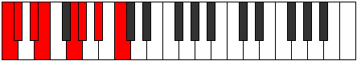

# Mode AFlatAerorian

## Links

- [Documentation](index.md)
- [Scales Index](Scales.md)
- [Modes Index](Modes.md)
- [Chords Index](Chords.md)

## Scale

[Palian](ScalePalian.md)

## Mode

[AFlatAerorian](ModeAFlatAerorian.md)

## Tonic

Ab

## Signature

[CNaturalMajor]

## Interval Pattern

2, 2, 1, 2, 1, 3, 1

## Chord Pattern

I, I⁺, ii⁰, iii, III, III⁺, iv⁰, iv, V, VI⁺, vi⁰, vii⁰

## Perfection

 - 4 Perfect Notes

 - 3 Imperfect Notes

## Notes

- Ab
- Bb (Imperfect)
- C
- Db
- Eb
- Fb (Imperfect)
- G (Imperfect)
- Ab

## Illustration

## Relative Modes

| Number | Mode | Tonic | Notes | Illustration |
|--------|------|-------|-------|--------------|
| [2485](https://ianring.com/musictheory/scales/2485) | [Aerorian](ModeAerorian.md) | Ab | Ab, Bb, C, Db, Eb, Fb, G, Ab |  |
| [1645](https://ianring.com/musictheory/scales/1645) | [Katagian](ModeKatagian.md) | Bb | Bb, C, Db, Eb, Fb, G, Ab, Bb |  |
| [1435](https://ianring.com/musictheory/scales/1435) | [Phronian](ModePhronian.md) | C | C, Db, Eb, Fb, G, Ab, Bb, C |  |
| [2765](https://ianring.com/musictheory/scales/2765) | [Banian](ModeBanian.md) | Db | Db, Eb, Fb, G, Ab, Bb, C, Db |  |
| [1715](https://ianring.com/musictheory/scales/1715) | [Aeronian](ModeAeronian.md) | Eb | Eb, Fb, G, Ab, Bb, C, Db, Eb |  |
| [875](https://ianring.com/musictheory/scales/875) | [Stothian](ModeStothian.md) | G | G, Ab, Bb, C, Db, Eb, Fb, G |  |

## Chords

### Ab

| Number | Root | Name | Notes | Illustration | Audio |
|--------|------|------|-------|--------------|-------|
| 1282 | Ab | [Absus2bb5](ChordAFlatSuspendedSecondDoubleFlatFifth.md) | Ab, Bb, Db |  | [midi](ChordAFlatSuspendedSecondDoubleFlatFifthRootPosition.mid) |
| 264 | Ab | [Ab5](ChordAFlatPowerChord.md) | Ab, Eb |  | [midi](ChordAFlatPowerChordRootPosition.mid) |
| 1288 | Ab | [Absus2](ChordAFlatSuspendedSecond.md) | Ab, Bb, Eb |  | [midi](ChordAFlatSuspendedSecondRootPosition.mid) |
| 265 | Ab | [AbM](ChordAFlatMajor.md) | Ab, C, Eb |  | [midi](ChordAFlatMajorRootPosition.mid) |
| 1289 | Ab | [AbM(add9)](ChordAFlatMajorAddNinth.md) | Ab, C, Eb, Bb |  | [midi](ChordAFlatMajorAddNinthRootPosition.mid) |
| 266 | Ab | [Absus4](ChordAFlatSuspendedFourth.md) | Ab, Db, Eb |  | [midi](ChordAFlatSuspendedFourthRootPosition.mid) |
| 267 | Ab | [AbM(add11)](ChordAFlatMajorAddEleventh.md) | Ab, C, Eb, Db |  | [midi](ChordAFlatMajorAddEleventhRootPosition.mid) |
| 267 | Ab | [AbM(add4)](ChordAFlatMajorAddFourth.md) | Ab, C, Db, Eb |  | [midi](ChordAFlatMajorAddFourthRootPosition.mid) |
| 1296 | Ab | [Absus2#5](ChordAFlatSuspendedSecondSharpFifth.md) | Ab, Bb, E |  | [midi](ChordAFlatSuspendedSecondSharpFifthRootPosition.mid) |
| 273 | Ab | [Ab+](ChordAFlatAugmented.md) | Ab, C, E |  | [midi](ChordAFlatAugmentedRootPosition.mid) |
| 273 | Ab | [Ab+7](ChordAFlatAugmentedAugmentedSeventh.md) | Ab, C, E, G# |  | [midi](ChordAFlatAugmentedAugmentedSeventhRootPosition.mid) |
| 274 | Ab | [Absus4#5](ChordAFlatSuspendedFourthSharpFifth.md) | Ab, Db, E |  | [midi](ChordAFlatSuspendedFourthSharpFifthRootPosition.mid) |
| 386 | Ab | [AbQ+](ChordAFlatQuartalAugmented.md) | Ab, Db, G |  | [midi](ChordAFlatQuartalAugmentedRootPosition.mid) |
| 1416 | Ab | [AbM7(sus2)](ChordAFlatMajorSeventhSuspendedSecond.md) | Ab, Bb, Eb, G |  | [midi](ChordAFlatMajorSeventhSuspendedSecondRootPosition.mid) |
| 1416 | Ab | [AbM9sus2](ChordAFlatMajorNinthSuspendedSecond.md) | Ab, Bb, Eb, G, Bb |  | [midi](ChordAFlatMajorNinthSuspendedSecondRootPosition.mid) |
| 393 | Ab | [AbM7](ChordAFlatMajorSeventh.md) | Ab, C, Eb, G |  | [midi](ChordAFlatMajorSeventhRootPosition.mid) |
| 1417 | Ab | [AbM9](ChordAFlatMajorNinth.md) | Ab, C, Eb, G, Bb |  | [midi](ChordAFlatMajorNinthRootPosition.mid) |
| 394 | Ab | [AbM7(sus4)](ChordAFlatMajorSeventhSuspendedFourth.md) | Ab, Db, Eb, G |  | [midi](ChordAFlatMajorSeventhSuspendedFourthRootPosition.mid) |
| 1418 | Ab | [AbM9sus4](ChordAFlatMajorNinthSuspendedFourth.md) | Ab, Db, Eb, G, Bb |  | [midi](ChordAFlatMajorNinthSuspendedFourthRootPosition.mid) |
| 395 | Ab | [AbM7add4](ChordAFlatMajorSeventhAddFourth.md) | Ab, C, Db, Eb, G |  | [midi](ChordAFlatMajorSeventhAddFourthRootPosition.mid) |
| 395 | Ab | [AbM7add11](ChordAFlatMajorSeventhAddEleventh.md) | Ab, C, Eb, G, Db |  | [midi](ChordAFlatMajorSeventhAddEleventhRootPosition.mid) |
| 1419 | Ab | [AbM11](ChordAFlatMajorEleventh.md) | Ab, C, Eb, G, Bb, Db |  | [midi](ChordAFlatMajorEleventhRootPosition.mid) |
| 401 | Ab | [Ab+(M7)](ChordAFlatAugmentedMajorSeventh.md) | Ab, C, E, G |  | [midi](ChordAFlatAugmentedMajorSeventhRootPosition.mid) |
| 402 | Ab | [AbM7(sus4)#5](ChordAFlatMajorSeventhSuspendedFourthSharpFifth.md) | Ab, Db, E, G |  | [midi](ChordAFlatMajorSeventhSuspendedFourthSharpFifthRootPosition.mid) |

### Bb

| Number | Root | Name | Notes | Illustration | Audio |
|--------|------|------|-------|--------------|-------|
| 1033 | Bb | [Bbsus2bb5](ChordBFlatSuspendedSecondDoubleFlatFifth.md) | Bb, C, Eb |  | [midi](ChordBFlatSuspendedSecondDoubleFlatFifthRootPosition.mid) |
| 1034 | Bb | [Bbmbb5](ChordBFlatMinorDoubleFlatFifth.md) | Bb, Db, Eb |  | [midi](ChordBFlatMinorDoubleFlatFifthRootPosition.mid) |
| 1041 | Bb | [Bbsus2b5](ChordBFlatSuspendedSecondFlatFifth.md) | Bb, C, Fb |  | [midi](ChordBFlatSuspendedSecondFlatFifthRootPosition.mid) |
| 1042 | Bb | [Bbo](ChordBFlatDiminished.md) | Bb, Db, Fb |  | [midi](ChordBFlatDiminishedRootPosition.mid) |
| 1048 | Bb | [Bbsus4b5](ChordBFlatSuspendedFourthFlatFifth.md) | Bb, Eb, Fb |  | [midi](ChordBFlatSuspendedFourthFlatFifthRootPosition.mid) |
| 1160 | Bb | [Bbsus4##5](ChordBFlatSuspendedFourthDoubleSharpFifth.md) | Bb, Eb, G |  | [midi](ChordBFlatSuspendedFourthDoubleSharpFifthRootPosition.mid) |
| 1161 | Bb | [BbM6sus2bb5](ChordBFlatMajorSixthSuspendedSecondDoubleFlatFifth.md) | Bb, C, Eb, G |  | [midi](ChordBFlatMajorSixthSuspendedSecondDoubleFlatFifthRootPosition.mid) |
| 1169 | Bb | [BbM6sus2b5](ChordBFlatMajorSixthSuspendedSecondFlatFifth.md) | Bb, C, Fb, G |  | [midi](ChordBFlatMajorSixthSuspendedSecondFlatFifthRootPosition.mid) |
| 1170 | Bb | [Bbo7](ChordBFlatFullDiminishedSeventh.md) | Bb, Db, Fb, Abb |  | [midi](ChordBFlatFullDiminishedSeventhRootPosition.mid) |
| 1288 | Bb | [BbQ](ChordBFlatQuartal.md) | Bb, Eb, Ab |  | [midi](ChordBFlatQuartalRootPosition.mid) |
| 1290 | Bb | [Bbm7bb5](ChordBFlatMinorSeventhDoubleFlatFifth.md) | Bb, Db, Eb, Ab |  | [midi](ChordBFlatMinorSeventhDoubleFlatFifthRootPosition.mid) |
| 1298 | Bb | [Bbø7](ChordBFlatHalfDiminishedSeventh.md) | Bb, Db, Fb, Ab |  | [midi](ChordBFlatHalfDiminishedSeventhRootPosition.mid) |

### C

| Number | Root | Name | Notes | Illustration | Audio |
|--------|------|------|-------|--------------|-------|
| 129 | C | [C5](ChordCNaturalPowerChord.md) | C, G |  | [midi](ChordCNaturalPowerChordRootPosition.mid) |
| 131 | C | [Cphryg](ChordCNaturalPhrygian.md) | C, Db, G |  | [midi](ChordCNaturalPhrygianRootPosition.mid) |
| 137 | C | [Cm](ChordCNaturalMinor.md) | C, Eb, G |  | [midi](ChordCNaturalMinorRootPosition.mid) |
| 137 | C | [Cm(add(#9))](ChordCNaturalMinorAddSharpNinth.md) | C, Eb, G, D# |  | [midi](ChordCNaturalMinorAddSharpNinthRootPosition.mid) |
| 145 | C | [CM](ChordCNaturalMajor.md) | C, E, G |  | [midi](ChordCNaturalMajorRootPosition.mid) |
| 153 | C | [CM(add(#9))](ChordCNaturalMajorAddSharpNinth.md) | C, E, G, D# |  | [midi](ChordCNaturalMajorAddSharpNinthRootPosition.mid) |
| 265 | C | [Cm#5](ChordCNaturalMinorSharpFifth.md) | C, Eb, Ab |  | [midi](ChordCNaturalMinorSharpFifthRootPosition.mid) |
| 273 | C | [C+](ChordCNaturalAugmented.md) | C, E, G# |  | [midi](ChordCNaturalAugmentedRootPosition.mid) |
| 273 | C | [C+7](ChordCNaturalAugmentedAugmentedSeventh.md) | C, E, G#, B# |  | [midi](ChordCNaturalAugmentedAugmentedSeventhRootPosition.mid) |
| 1161 | C | [Cm7](ChordCNaturalMinorSeventh.md) | C, Eb, G, Bb |  | [midi](ChordCNaturalMinorSeventhRootPosition.mid) |
| 1163 | C | [Cm7b9](ChordCNaturalMinorSeventhFlatNinth.md) | C, Eb, G, Bb, Db |  | [midi](ChordCNaturalMinorSeventhFlatNinthRootPosition.mid) |
| 1169 | C | [C7](ChordCNaturalDominantSeventh.md) | C, E, G, Bb |  | [midi](ChordCNaturalDominantSeventhRootPosition.mid) |
| 1171 | C | [C7b9](ChordCNaturalDominantSeventhFlatNinth.md) | C, E, G, Bb, Db |  | [midi](ChordCNaturalDominantSeventhFlatNinthRootPosition.mid) |
| 1177 | C | [C7#9](ChordCNaturalDominantSeventhSharpNinth.md) | C, E, G, Bb, D# |  | [midi](ChordCNaturalDominantSeventhSharpNinthRootPosition.mid) |
| 1289 | C | [Cm7#5](ChordCNaturalMinorSeventhSharpFifth.md) | C, Eb, G#, Bb |  | [midi](ChordCNaturalMinorSeventhSharpFifthRootPosition.mid) |
| 1299 | C | [C7#5b9](ChordCNaturalDominantSeventhSharpFifthFlatNinth.md) | C, E, G#, Bb, Db |  | [midi](ChordCNaturalDominantSeventhSharpFifthFlatNinthRootPosition.mid) |
| 1427 | C | [C7b9b13](ChordCNaturalDominantSeventhFlatNinthFlatThirteenth.md) | C, E, G, Bb, Db, Ab |  | [midi](ChordCNaturalDominantSeventhFlatNinthFlatThirteenthRootPosition.mid) |

### Db

| Number | Root | Name | Notes | Illustration | Audio |
|--------|------|------|-------|--------------|-------|
| 138 | Db | [Dbsus2b5](ChordDFlatSuspendedSecondFlatFifth.md) | Db, Eb, Abb |  | [midi](ChordDFlatSuspendedSecondFlatFifthRootPosition.mid) |
| 146 | Db | [Dbo](ChordDFlatDiminished.md) | Db, Fb, Abb |  | [midi](ChordDFlatDiminishedRootPosition.mid) |
| 258 | Db | [Db5](ChordDFlatPowerChord.md) | Db, Ab |  | [midi](ChordDFlatPowerChordRootPosition.mid) |
| 266 | Db | [Dbsus2](ChordDFlatSuspendedSecond.md) | Db, Eb, Ab |  | [midi](ChordDFlatSuspendedSecondRootPosition.mid) |
| 274 | Db | [Dbm](ChordDFlatMinor.md) | Db, Fb, Ab |  | [midi](ChordDFlatMinorRootPosition.mid) |
| 274 | Db | [Dbm(add(#9))](ChordDFlatMinorAddSharpNinth.md) | Db, Fb, Ab, E |  | [midi](ChordDFlatMinorAddSharpNinthRootPosition.mid) |
| 282 | Db | [Dbm(add9)](ChordDFlatMinorAddNinth.md) | Db, Fb, Ab, Eb |  | [midi](ChordDFlatMinorAddNinthRootPosition.mid) |
| 386 | Db | [Dblyd](ChordDFlatLydian.md) | Db, G, Ab |  | [midi](ChordDFlatLydianRootPosition.mid) |
| 402 | Db | [Dbm(add(#4))](ChordDFlatMinorAddSharpFourth.md) | Db, Fb, G, Ab |  | [midi](ChordDFlatMinorAddSharpFourthRootPosition.mid) |
| 1162 | Db | [DbM6sus2b5](ChordDFlatMajorSixthSuspendedSecondFlatFifth.md) | Db, Eb, Abb, Bb |  | [midi](ChordDFlatMajorSixthSuspendedSecondFlatFifthRootPosition.mid) |
| 1170 | Db | [Dbo7](ChordDFlatFullDiminishedSeventh.md) | Db, Fb, Abb, Cbb |  | [midi](ChordDFlatFullDiminishedSeventhRootPosition.mid) |
| 1290 | Db | [DbM6sus2](ChordDFlatMajorSixthSuspendedSecond.md) | Db, Eb, Ab, Bb |  | [midi](ChordDFlatMajorSixthSuspendedSecondRootPosition.mid) |
| 1290 | Db | [Db7sus2b5](ChordDFlatDominantSeventhSuspendedSecondFlatFifth.md) | Db, Eb, Ab, Cbb |  | [midi](ChordDFlatDominantSeventhSuspendedSecondFlatFifthRootPosition.mid) |
| 1298 | Db | [Dbm6](ChordDFlatMinorSixth.md) | Db, Fb, Ab, Bb |  | [midi](ChordDFlatMinorSixthRootPosition.mid) |
| 1306 | Db | [Dbm6(add9)](ChordDFlatMinorSixthAddNinth.md) | Db, Fb, Ab, Bb, Eb |  | [midi](ChordDFlatMinorSixthAddNinthRootPosition.mid) |
| 147 | Db | [DboM7](ChordDFlatDiminishedMajorSeventh.md) | Db, Fb, Abb, C |  | [midi](ChordDFlatDiminishedMajorSeventhRootPosition.mid) |
| 267 | Db | [DbM7(sus2)](ChordDFlatMajorSeventhSuspendedSecond.md) | Db, Eb, Ab, C |  | [midi](ChordDFlatMajorSeventhSuspendedSecondRootPosition.mid) |
| 267 | Db | [DbM9sus2](ChordDFlatMajorNinthSuspendedSecond.md) | Db, Eb, Ab, C, Eb |  | [midi](ChordDFlatMajorNinthSuspendedSecondRootPosition.mid) |
| 275 | Db | [Dbm(M7)](ChordDFlatMinorMajorSeventh.md) | Db, Fb, Ab, C |  | [midi](ChordDFlatMinorMajorSeventhRootPosition.mid) |
| 283 | Db | [Dbm(M9)](ChordDFlatMinorMajorNinth.md) | Db, Fb, Ab, C, Eb |  | [midi](ChordDFlatMinorMajorNinthRootPosition.mid) |
| 387 | Db | [Dblyd(M7)](ChordDFlatLydianMajorSeventh.md) | Db, G, Ab, C |  | [midi](ChordDFlatLydianMajorSeventhRootPosition.mid) |
| 1299 | Db | [Dbm(M7)add13](ChordDFlatMinorMajorSeventhAddThirteenth.md) | Db, Fb, Ab, C, Bb |  | [midi](ChordDFlatMinorMajorSeventhAddThirteenthRootPosition.mid) |

### Eb

| Number | Root | Name | Notes | Illustration | Audio |
|--------|------|------|-------|--------------|-------|
| 1032 | Eb | [Eb5](ChordEFlatPowerChord.md) | Eb, Bb |  | [midi](ChordEFlatPowerChordRootPosition.mid) |
| 1048 | Eb | [Ebphryg](ChordEFlatPhrygian.md) | Eb, Fb, Bb |  | [midi](ChordEFlatPhrygianRootPosition.mid) |
| 1160 | Eb | [EbM](ChordEFlatMajor.md) | Eb, G, Bb |  | [midi](ChordEFlatMajorRootPosition.mid) |
| 1288 | Eb | [Ebsus4](ChordEFlatSuspendedFourth.md) | Eb, Ab, Bb |  | [midi](ChordEFlatSuspendedFourthRootPosition.mid) |
| 1416 | Eb | [EbM(add11)](ChordEFlatMajorAddEleventh.md) | Eb, G, Bb, Ab |  | [midi](ChordEFlatMajorAddEleventhRootPosition.mid) |
| 1416 | Eb | [EbM(add4)](ChordEFlatMajorAddFourth.md) | Eb, G, Ab, Bb |  | [midi](ChordEFlatMajorAddFourthRootPosition.mid) |
| 137 | Eb | [EbM##5](ChordEFlatMajorDoubleSharpFifth.md) | Eb, G, C |  | [midi](ChordEFlatMajorDoubleSharpFifthRootPosition.mid) |
| 265 | Eb | [Ebsus4##5](ChordEFlatSuspendedFourthDoubleSharpFifth.md) | Eb, Ab, C |  | [midi](ChordEFlatSuspendedFourthDoubleSharpFifthRootPosition.mid) |
| 1161 | Eb | [EbM6](ChordEFlatMajorSixth.md) | Eb, G, Bb, C |  | [midi](ChordEFlatMajorSixthRootPosition.mid) |
| 1177 | Eb | [EbM6(addb9)](ChordEFlatMajorSixthAddFlatNinth.md) | Eb, G, Bb, C, Fb |  | [midi](ChordEFlatMajorSixthAddFlatNinthRootPosition.mid) |
| 1289 | Eb | [EbM6sus4](ChordEFlatMajorSixthSuspendedFourth.md) | Eb, Ab, Bb, C |  | [midi](ChordEFlatMajorSixthSuspendedFourthRootPosition.mid) |
| 266 | Eb | [EbQ](ChordEFlatQuartal.md) | Eb, Ab, Db |  | [midi](ChordEFlatQuartalRootPosition.mid) |
| 1162 | Eb | [Eb7](ChordEFlatDominantSeventh.md) | Eb, G, Bb, Db |  | [midi](ChordEFlatDominantSeventhRootPosition.mid) |
| 1178 | Eb | [Eb7b9](ChordEFlatDominantSeventhFlatNinth.md) | Eb, G, Bb, Db, Fb |  | [midi](ChordEFlatDominantSeventhFlatNinthRootPosition.mid) |
| 1290 | Eb | [Eb7sus4](ChordEFlatDominantSeventhSuspendedFourth.md) | Eb, Ab, Bb, Db |  | [midi](ChordEFlatDominantSeventhSuspendedFourthRootPosition.mid) |
| 1418 | Eb | [Eb7add4](ChordEFlatDominantSeventhAddFourth.md) | Eb, G, Ab, Bb, Db |  | [midi](ChordEFlatDominantSeventhAddFourthRootPosition.mid) |
| 1418 | Eb | [Eb7add11](ChordEFlatDominantSeventhAddEleventh.md) | Eb, G, Bb, Db, Ab |  | [midi](ChordEFlatDominantSeventhAddEleventhRootPosition.mid) |
| 1163 | Eb | [Eb7add13](ChordEFlatDominantSeventhAddThirteenth.md) | Eb, G, Bb, Db, C |  | [midi](ChordEFlatDominantSeventhAddThirteenthRootPosition.mid) |
| 1435 | Eb | [Eb13b9](ChordEFlatDominantThirteenthFlatNinth.md) | Eb, G, Bb, Db, Fb, Ab, C |  | [midi](ChordEFlatDominantThirteenthFlatNinthRootPosition.mid) |

### Fb

| Number | Root | Name | Notes | Illustration | Audio |
|--------|------|------|-------|--------------|-------|

### G

| Number | Root | Name | Notes | Illustration | Audio |
|--------|------|------|-------|--------------|-------|
| 1153 | G | [Gmbb5](ChordGNaturalMinorDoubleFlatFifth.md) | G, Bb, C |  | [midi](ChordGNaturalMinorDoubleFlatFifthRootPosition.mid) |
| 386 | G | [Gloc](ChordGNaturalLocrian.md) | G, Ab, Db |  | [midi](ChordGNaturalLocrianRootPosition.mid) |
| 1154 | G | [Go](ChordGNaturalDiminished.md) | G, Bb, Db |  | [midi](ChordGNaturalDiminishedRootPosition.mid) |
| 131 | G | [Gsus4b5](ChordGNaturalSuspendedFourthFlatFifth.md) | G, C, Db |  | [midi](ChordGNaturalSuspendedFourthFlatFifthRootPosition.mid) |
| 1160 | G | [Gm#5](ChordGNaturalMinorSharpFifth.md) | G, Bb, Eb |  | [midi](ChordGNaturalMinorSharpFifthRootPosition.mid) |
| 137 | G | [Gsus4#5](ChordGNaturalSuspendedFourthSharpFifth.md) | G, C, D# |  | [midi](ChordGNaturalSuspendedFourthSharpFifthRootPosition.mid) |
| 145 | G | [Gsus4##5](ChordGNaturalSuspendedFourthDoubleSharpFifth.md) | G, C, E |  | [midi](ChordGNaturalSuspendedFourthDoubleSharpFifthRootPosition.mid) |
| 1170 | G | [Go7](ChordGNaturalFullDiminishedSeventh.md) | G, Bb, Db, Fb |  | [midi](ChordGNaturalFullDiminishedSeventhRootPosition.mid) |

