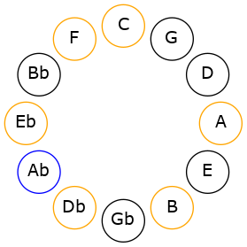

# Mode AFlatAerothian

## Links

- [Documentation](README.md)
- [Scales Index](Scales.md)
- [Modes Index](Modes.md)
- [Chords Index](Chords.md)

## Scale

[Ionanian](ScaleIonanian.md)

## Mode

[AFlatAerothian](ModeAFlatAerothian.md)

## Tonic

Ab

## Signature

[CNaturalMajor]

## Interval Pattern

1, 2, 1, 1, 2, 2, 3

## Chord Pattern

ii⁰, iii⁰b3, V⁺, VII

## Perfection

 - 3 Perfect Notes

 - 4 Imperfect Notes

## Notes

- Ab
- Bbb (Imperfect)
- Cb (Imperfect)
- Dbb (Imperfect)
- Ebbb
- Fbb (Imperfect)
- Gbb
- Ab

## Illustration

## Diagram

## Relative Modes

| Number | Mode | Tonic | Notes | Illustration |
|--------|------|-------|-------|--------------|
| [699](https://ianring.com/musictheory/scales/699) | [Aerothian](ModeAerothian.md) | Ab | Ab, Bbb, Cb, Dbb, Ebbb, Fbb, Gbb, Ab |  |
## Relative Brightness

| Number | Mode | Tonic | Notes | Illustration |
|--------|------|-------|-------|--------------|
| [699](https://ianring.com/musictheory/scales/699) | [Aerothian](ModeAerothian.md) | Ab | Ab, Bbb, Cb, Dbb, Ebbb, Fbb, Gbb, Ab |  |

## Chords

### Ab

| Number | Root | Name | Notes | Illustration | Audio |
|--------|------|------|-------|--------------|-------|
| 2306 | Ab | [Abmbb5](ChordAFlatMinorDoubleFlatFifth.md) | Ab, Cb, Db |  | [midi](ChordAFlatMinorDoubleFlatFifthRootPosition.mid) |
| 264 | Ab | [Ab5](ChordAFlatPowerChord.md) | Ab, Eb |  | [midi](ChordAFlatPowerChordRootPosition.mid) |
| 776 | Ab | [Abphryg](ChordAFlatPhrygian.md) | Ab, Bbb, Eb |  | [midi](ChordAFlatPhrygianRootPosition.mid) |
| 2312 | Ab | [Abm](ChordAFlatMinor.md) | Ab, Cb, Eb |  | [midi](ChordAFlatMinorRootPosition.mid) |
| 2312 | Ab | [Abm(add(#9))](ChordAFlatMinorAddSharpNinth.md) | Ab, Cb, Eb, B |  | [midi](ChordAFlatMinorAddSharpNinthRootPosition.mid) |
| 265 | Ab | [AbM](ChordAFlatMajor.md) | Ab, C, Eb |  | [midi](ChordAFlatMajorRootPosition.mid) |
| 2313 | Ab | [AbM(add(#9))](ChordAFlatMajorAddSharpNinth.md) | Ab, C, Eb, B |  | [midi](ChordAFlatMajorAddSharpNinthRootPosition.mid) |
| 266 | Ab | [Absus4](ChordAFlatSuspendedFourth.md) | Ab, Db, Eb |  | [midi](ChordAFlatSuspendedFourthRootPosition.mid) |
| 2314 | Ab | [Abm(add11)](ChordAFlatMinorAddEleventh.md) | Ab, Cb, Eb, Db |  | [midi](ChordAFlatMinorAddEleventhRootPosition.mid) |
| 2314 | Ab | [Abm(add4)](ChordAFlatMinorAddFourth.md) | Ab, Cb, Db, Eb |  | [midi](ChordAFlatMinorAddFourthRootPosition.mid) |
| 267 | Ab | [AbM(add11)](ChordAFlatMajorAddEleventh.md) | Ab, C, Eb, Db |  | [midi](ChordAFlatMajorAddEleventhRootPosition.mid) |
| 267 | Ab | [AbM(add4)](ChordAFlatMajorAddFourth.md) | Ab, C, Db, Eb |  | [midi](ChordAFlatMajorAddFourthRootPosition.mid) |
| 289 | Ab | [AbM##5](ChordAFlatMajorDoubleSharpFifth.md) | Ab, C, F |  | [midi](ChordAFlatMajorDoubleSharpFifthRootPosition.mid) |
| 290 | Ab | [Absus4##5](ChordAFlatSuspendedFourthDoubleSharpFifth.md) | Ab, Db, F |  | [midi](ChordAFlatSuspendedFourthDoubleSharpFifthRootPosition.mid) |
| 2344 | Ab | [Abm6](ChordAFlatMinorSixth.md) | Ab, Cb, Eb, F |  | [midi](ChordAFlatMinorSixthRootPosition.mid) |
| 2856 | Ab | [Abm6(addb9)](ChordAFlatMinorSixthAddFlatNinth.md) | Ab, Cb, Eb, F, Bbb |  | [midi](ChordAFlatMinorSixthAddFlatNinthRootPosition.mid) |
| 297 | Ab | [AbM6](ChordAFlatMajorSixth.md) | Ab, C, Eb, F |  | [midi](ChordAFlatMajorSixthRootPosition.mid) |
| 809 | Ab | [AbM6(addb9)](ChordAFlatMajorSixthAddFlatNinth.md) | Ab, C, Eb, F, Bbb |  | [midi](ChordAFlatMajorSixthAddFlatNinthRootPosition.mid) |
| 298 | Ab | [AbM6sus4](ChordAFlatMajorSixthSuspendedFourth.md) | Ab, Db, Eb, F |  | [midi](ChordAFlatMajorSixthSuspendedFourthRootPosition.mid) |

### Bbb

| Number | Root | Name | Notes | Illustration | Audio |
|--------|------|------|-------|--------------|-------|

### Cb

| Number | Root | Name | Notes | Illustration | Audio |
|--------|------|------|-------|--------------|-------|

### Dbb

| Number | Root | Name | Notes | Illustration | Audio |
|--------|------|------|-------|--------------|-------|

### Ebbb

| Number | Root | Name | Notes | Illustration | Audio |
|--------|------|------|-------|--------------|-------|

### Fbb

| Number | Root | Name | Notes | Illustration | Audio |
|--------|------|------|-------|--------------|-------|

### Gbb

| Number | Root | Name | Notes | Illustration | Audio |
|--------|------|------|-------|--------------|-------|

