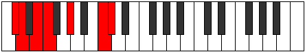

# Mode AFlatAerothimic

## Links

- [Documentation](index.md)
- [Scales Index](Scales.md)
- [Modes Index](Modes.md)
- [Chords Index](Chords.md)

## Scale

[Aerothimic](ScaleAerothimic.md)

## Mode

[AFlatAerothimic](ModeAFlatAerothimic.md)

## Tonic

Ab

## Signature

[CNaturalMajor]

## Perfection

 - 2 Perfect Notes

 - 4 Imperfect Notes

## Notes

- Ab (Imperfect)
- B# (Imperfect)
- C#
- D (Imperfect)
- E (Imperfect)
- F
- Ab (Imperfect)

## Illustration

## Relative Modes

| Number | Mode | Tonic | Notes | Illustration |
|--------|------|-------|-------|--------------|
| [311](https://ianring.com/musictheory/scales/311) | [Stagimic](ModeStagimic.md) | C | C, Db, Ebb, Fb, Gbb, Ab, C |  |
| [881](https://ianring.com/musictheory/scales/881) | [Aerothimic](ModeAerothimic.md) | G# | G#, A###, B##, C##, D##, E#, G# |  |
| [881](https://ianring.com/musictheory/scales/881) | [Aerothimic](ModeAerothimic.md) | Ab | Ab, B#, C#, D, E, F, Ab |  |
| [1811](https://ianring.com/musictheory/scales/1811) | [Kyptimic](ModeKyptimic.md) | E | E, F, G#, A###, B##, C##, E |  |
| [2203](https://ianring.com/musictheory/scales/2203) | [Dorimic](ModeDorimic.md) | C# | C#, D, E, F, G#, A###, C# |  |
| [2203](https://ianring.com/musictheory/scales/2203) | [Dorimic](ModeDorimic.md) | Db | Db, Ebb, Fb, Gbb, Ab, B#, Db |  |
| [2953](https://ianring.com/musictheory/scales/2953) | [Ionylimic](ModeIonylimic.md) | F | F, G#, A###, B##, C##, D##, F |  |
| [3149](https://ianring.com/musictheory/scales/3149) | [Phrycrimic](ModePhrycrimic.md) | D | D, E, F, G#, A###, B##, D |  |

## Chords

### Ab

| Number | Root | Name | Notes | Illustration | Audio |
|--------|------|------|-------|--------------|-------|
| 261 | Ab | [AbMb5](ChordAFlatMajorFlatFifth.md) | Ab, C, Ebb |  | [midi](ChordAFlatMajorFlatFifthRootPosition.mid) [ogg](ChordAFlatMajorFlatFifthRootPosition.ogg) |
| 262 | Ab | [Absus4b5](ChordAFlatSuspendedFourthFlatFifth.md) | Ab, Db, Ebb |  | [midi](ChordAFlatSuspendedFourthFlatFifthRootPosition.mid) [ogg](ChordAFlatSuspendedFourthFlatFifthRootPosition.ogg) |
| 273 | Ab | [Ab+](ChordAFlatAugmented.md) | Ab, C, E |  | [midi](ChordAFlatAugmentedRootPosition.mid) [ogg](ChordAFlatAugmentedRootPosition.ogg) |
| 273 | Ab | [Ab+7](ChordAFlatAugmentedAugmentedSeventh.md) | Ab, C, E, G# |  | [midi](ChordAFlatAugmentedAugmentedSeventhRootPosition.mid) [ogg](ChordAFlatAugmentedAugmentedSeventhRootPosition.ogg) |
| 274 | Ab | [Absus4#5](ChordAFlatSuspendedFourthSharpFifth.md) | Ab, Db, E |  | [midi](ChordAFlatSuspendedFourthSharpFifthRootPosition.mid) [ogg](ChordAFlatSuspendedFourthSharpFifthRootPosition.ogg) |
| 289 | Ab | [AbM##5](ChordAFlatMajorDoubleSharpFifth.md) | Ab, C, F |  | [midi](ChordAFlatMajorDoubleSharpFifthRootPosition.mid) [ogg](ChordAFlatMajorDoubleSharpFifthRootPosition.ogg) |
| 290 | Ab | [Absus4##5](ChordAFlatSuspendedFourthDoubleSharpFifth.md) | Ab, Db, F |  | [midi](ChordAFlatSuspendedFourthDoubleSharpFifthRootPosition.mid) [ogg](ChordAFlatSuspendedFourthDoubleSharpFifthRootPosition.ogg) |
| 293 | Ab | [AbM6b5](ChordAFlatMajorSixthFlatFifth.md) | Ab, C, Ebb, F |  | [midi](ChordAFlatMajorSixthFlatFifthRootPosition.mid) [ogg](ChordAFlatMajorSixthFlatFifthRootPosition.ogg) |

### B#

| Number | Root | Name | Notes | Illustration | Audio |
|--------|------|------|-------|--------------|-------|

### C#

| Number | Root | Name | Notes | Illustration | Audio |
|--------|------|------|-------|--------------|-------|
| 258 | C# | [C#5](ChordCSharpPowerChord.md) | C#, G# |  | [midi](ChordCSharpPowerChordRootPosition.mid) [ogg](ChordCSharpPowerChordRootPosition.ogg) |
| 262 | C# | [C#phryg](ChordCSharpPhrygian.md) | C#, D, G# |  | [midi](ChordCSharpPhrygianRootPosition.mid) [ogg](ChordCSharpPhrygianRootPosition.ogg) |
| 274 | C# | [C#m](ChordCSharpMinor.md) | C#, E, G# |  | [midi](ChordCSharpMinorRootPosition.mid) [ogg](ChordCSharpMinorRootPosition.ogg) |
| 274 | C# | [C#m(add(#9))](ChordCSharpMinorAddSharpNinth.md) | C#, E, G#, D## |  | [midi](ChordCSharpMinorAddSharpNinthRootPosition.mid) [ogg](ChordCSharpMinorAddSharpNinthRootPosition.ogg) |
| 290 | C# | [C#M](ChordCSharpMajor.md) | C#, E#, G# |  | [midi](ChordCSharpMajorRootPosition.mid) [ogg](ChordCSharpMajorRootPosition.ogg) |
| 306 | C# | [C#M(add(#9))](ChordCSharpMajorAddSharpNinth.md) | C#, E#, G#, D## |  | [midi](ChordCSharpMajorAddSharpNinthRootPosition.mid) [ogg](ChordCSharpMajorAddSharpNinthRootPosition.ogg) |
| 263 | C# | [C#phryg+7](ChordCSharpPhrygianAddSeventh.md) | C#, D, G#, B# |  | [midi](ChordCSharpPhrygianAddSeventhRootPosition.mid) [ogg](ChordCSharpPhrygianAddSeventhRootPosition.ogg) |
| 275 | C# | [C#m(M7)](ChordCSharpMinorMajorSeventh.md) | C#, E, G#, B# |  | [midi](ChordCSharpMinorMajorSeventhRootPosition.mid) [ogg](ChordCSharpMinorMajorSeventhRootPosition.ogg) |
| 291 | C# | [C#M7](ChordCSharpMajorSeventh.md) | C#, E#, G#, B# |  | [midi](ChordCSharpMajorSeventhRootPosition.mid) [ogg](ChordCSharpMajorSeventhRootPosition.ogg) |

### D

| Number | Root | Name | Notes | Illustration | Audio |
|--------|------|------|-------|--------------|-------|
| 276 | D | [Dsus2b5](ChordDNaturalSuspendedSecondFlatFifth.md) | D, E, Ab |  | [midi](ChordDNaturalSuspendedSecondFlatFifthRootPosition.mid) [ogg](ChordDNaturalSuspendedSecondFlatFifthRootPosition.ogg) |
| 292 | D | [Do](ChordDNaturalDiminished.md) | D, F, Ab |  | [midi](ChordDNaturalDiminishedRootPosition.mid) [ogg](ChordDNaturalDiminishedRootPosition.ogg) |
| 293 | D | [Dø7](ChordDNaturalHalfDiminishedSeventh.md) | D, F, Ab, C |  | [midi](ChordDNaturalHalfDiminishedSeventhRootPosition.mid) [ogg](ChordDNaturalHalfDiminishedSeventhRootPosition.ogg) |
| 294 | D | [DoM7](ChordDNaturalDiminishedMajorSeventh.md) | D, F, Ab, C# |  | [midi](ChordDNaturalDiminishedMajorSeventhRootPosition.mid) [ogg](ChordDNaturalDiminishedMajorSeventhRootPosition.ogg) |

### E

| Number | Root | Name | Notes | Illustration | Audio |
|--------|------|------|-------|--------------|-------|
| 273 | E | [E+](ChordENaturalAugmented.md) | E, G#, B# |  | [midi](ChordENaturalAugmentedRootPosition.mid) [ogg](ChordENaturalAugmentedRootPosition.ogg) |
| 273 | E | [E+7](ChordENaturalAugmentedAugmentedSeventh.md) | E, G#, B#, D## |  | [midi](ChordENaturalAugmentedAugmentedSeventhRootPosition.mid) [ogg](ChordENaturalAugmentedAugmentedSeventhRootPosition.ogg) |
| 274 | E | [EM##5](ChordENaturalMajorDoubleSharpFifth.md) | E, G#, C# |  | [midi](ChordENaturalMajorDoubleSharpFifthRootPosition.mid) [ogg](ChordENaturalMajorDoubleSharpFifthRootPosition.ogg) |
| 309 | E | [E7#5b9](ChordENaturalDominantSeventhSharpFifthFlatNinth.md) | E, G#, B#, D, F |  | [midi](ChordENaturalDominantSeventhSharpFifthFlatNinthRootPosition.mid) [ogg](ChordENaturalDominantSeventhSharpFifthFlatNinthRootPosition.ogg) |

### F

| Number | Root | Name | Notes | Illustration | Audio |
|--------|------|------|-------|--------------|-------|
| 33 | F | [F5](ChordFNaturalPowerChord.md) | F, C |  | [midi](ChordFNaturalPowerChordRootPosition.mid) [ogg](ChordFNaturalPowerChordRootPosition.ogg) |
| 289 | F | [Fm](ChordFNaturalMinor.md) | F, Ab, C |  | [midi](ChordFNaturalMinorRootPosition.mid) [ogg](ChordFNaturalMinorRootPosition.ogg) |
| 289 | F | [Fm(add(#9))](ChordFNaturalMinorAddSharpNinth.md) | F, Ab, C, G# |  | [midi](ChordFNaturalMinorAddSharpNinthRootPosition.mid) [ogg](ChordFNaturalMinorAddSharpNinthRootPosition.ogg) |
| 290 | F | [Fm#5](ChordFNaturalMinorSharpFifth.md) | F, Ab, Db |  | [midi](ChordFNaturalMinorSharpFifthRootPosition.mid) [ogg](ChordFNaturalMinorSharpFifthRootPosition.ogg) |
| 293 | F | [Fm6](ChordFNaturalMinorSixth.md) | F, Ab, C, D |  | [midi](ChordFNaturalMinorSixthRootPosition.mid) [ogg](ChordFNaturalMinorSixthRootPosition.ogg) |
| 305 | F | [Fm(M7)](ChordFNaturalMinorMajorSeventh.md) | F, Ab, C, E |  | [midi](ChordFNaturalMinorMajorSeventhRootPosition.mid) [ogg](ChordFNaturalMinorMajorSeventhRootPosition.ogg) |
| 309 | F | [Fm(M7)add13](ChordFNaturalMinorMajorSeventhAddThirteenth.md) | F, Ab, C, E, D |  | [midi](ChordFNaturalMinorMajorSeventhAddThirteenthRootPosition.mid) [ogg](ChordFNaturalMinorMajorSeventhAddThirteenthRootPosition.ogg) |

