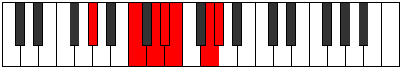

# Mode AFlatAerycrimic

## Links

- [Documentation](index.md)
- [Scales Index](Scales.md)
- [Modes Index](Modes.md)
- [Chords Index](Chords.md)

## Scale

[Aerycrimic](ScaleAerycrimic.md)

## Mode

[AFlatAerycrimic](ModeAFlatAerycrimic.md)

## Tonic

Ab

## Signature

[CNaturalMajor]

## Perfection

 - 3 Perfect Notes

 - 3 Imperfect Notes

## Notes

- Ab
- B#
- C## (Imperfect)
- D# (Imperfect)
- E (Imperfect)
- F##
- Ab

## Illustration

## Relative Modes

| Number | Mode | Tonic | Notes | Illustration |
|--------|------|-------|-------|--------------|
| [413](https://ianring.com/musictheory/scales/413) | [Ganimic](ModeGanimic.md) | C | C, D, Eb, Fb, G, Ab, C |  |
| [931](https://ianring.com/musictheory/scales/931) | [Bacrimic](ModeBacrimic.md) | G | G, Ab, B#, C##, D#, E, G |  |
| [1127](https://ianring.com/musictheory/scales/1127) | [Eparimic](ModeEparimic.md) | D | D, Eb, Fb, G, Ab, B#, D |  |
| [2513](https://ianring.com/musictheory/scales/2513) | [Aerycrimic](ModeAerycrimic.md) | G# | G#, A###, B###, C###, D##, E###, G# |  |
| [2513](https://ianring.com/musictheory/scales/2513) | [Aerycrimic](ModeAerycrimic.md) | Ab | Ab, B#, C##, D#, E, F##, Ab |  |
| [2611](https://ianring.com/musictheory/scales/2611) | [Lyrimic](ModeLyrimic.md) | D# | D#, E, F##, G#, A###, B###, D# |  |
| [2611](https://ianring.com/musictheory/scales/2611) | [Lyrimic](ModeLyrimic.md) | Eb | Eb, Fb, G, Ab, B#, C##, Eb |  |
| [3353](https://ianring.com/musictheory/scales/3353) | [Phraptimic](ModePhraptimic.md) | E | E, F##, G#, A###, B###, C###, E |  |

## Chords

### Ab

| Number | Root | Name | Notes | Illustration | Audio |
|--------|------|------|-------|--------------|-------|
| 261 | Ab | [AbMb5](ChordAFlatMajorFlatFifth.md) | Ab, C, Ebb |  | [midi](ChordAFlatMajorFlatFifthRootPosition.mid) [ogg](ChordAFlatMajorFlatFifthRootPosition.ogg) |
| 264 | Ab | [Ab5](ChordAFlatPowerChord.md) | Ab, Eb |  | [midi](ChordAFlatPowerChordRootPosition.mid) [ogg](ChordAFlatPowerChordRootPosition.ogg) |
| 265 | Ab | [AbM](ChordAFlatMajor.md) | Ab, C, Eb |  | [midi](ChordAFlatMajorRootPosition.mid) [ogg](ChordAFlatMajorRootPosition.ogg) |
| 268 | Ab | [Ablyd](ChordAFlatLydian.md) | Ab, D, Eb |  | [midi](ChordAFlatLydianRootPosition.mid) [ogg](ChordAFlatLydianRootPosition.ogg) |
| 269 | Ab | [AbM(add(#4))](ChordAFlatMajorAddSharpFourth.md) | Ab, C, D, Eb |  | [midi](ChordAFlatMajorAddSharpFourthRootPosition.mid) [ogg](ChordAFlatMajorAddSharpFourthRootPosition.ogg) |
| 273 | Ab | [Ab+](ChordAFlatAugmented.md) | Ab, C, E |  | [midi](ChordAFlatAugmentedRootPosition.mid) [ogg](ChordAFlatAugmentedRootPosition.ogg) |
| 273 | Ab | [Ab+7](ChordAFlatAugmentedAugmentedSeventh.md) | Ab, C, E, G# |  | [midi](ChordAFlatAugmentedAugmentedSeventhRootPosition.mid) [ogg](ChordAFlatAugmentedAugmentedSeventhRootPosition.ogg) |
| 389 | Ab | [AbM7b5](ChordAFlatMajorSeventhFlatFifth.md) | Ab, C, Ebb, G |  | [midi](ChordAFlatMajorSeventhFlatFifthRootPosition.mid) [ogg](ChordAFlatMajorSeventhFlatFifthRootPosition.ogg) |
| 393 | Ab | [AbM7](ChordAFlatMajorSeventh.md) | Ab, C, Eb, G |  | [midi](ChordAFlatMajorSeventhRootPosition.mid) [ogg](ChordAFlatMajorSeventhRootPosition.ogg) |
| 396 | Ab | [Ablyd(M7)](ChordAFlatLydianMajorSeventh.md) | Ab, D, Eb, G |  | [midi](ChordAFlatLydianMajorSeventhRootPosition.mid) [ogg](ChordAFlatLydianMajorSeventhRootPosition.ogg) |
| 397 | Ab | [AbM7add(#11)](ChordAFlatMajorSeventhAddSharpEleventh.md) | Ab, C, Eb, G, D |  | [midi](ChordAFlatMajorSeventhAddSharpEleventhRootPosition.mid) [ogg](ChordAFlatMajorSeventhAddSharpEleventhRootPosition.ogg) |
| 397 | Ab | [AbM7add(#4)](ChordAFlatMajorSeventhAddSharpFourth.md) | Ab, C, D, Eb, G |  | [midi](ChordAFlatMajorSeventhAddSharpFourthRootPosition.mid) [ogg](ChordAFlatMajorSeventhAddSharpFourthRootPosition.ogg) |
| 401 | Ab | [Ab+(M7)](ChordAFlatAugmentedMajorSeventh.md) | Ab, C, E, G |  | [midi](ChordAFlatAugmentedMajorSeventhRootPosition.mid) [ogg](ChordAFlatAugmentedMajorSeventhRootPosition.ogg) |

### B#

| Number | Root | Name | Notes | Illustration | Audio |
|--------|------|------|-------|--------------|-------|

### C##

| Number | Root | Name | Notes | Illustration | Audio |
|--------|------|------|-------|--------------|-------|

### D#

| Number | Root | Name | Notes | Illustration | Audio |
|--------|------|------|-------|--------------|-------|
| 137 | D# | [D#M##5](ChordDSharpMajorDoubleSharpFifth.md) | D#, F##, B# |  | [midi](ChordDSharpMajorDoubleSharpFifthRootPosition.mid) [ogg](ChordDSharpMajorDoubleSharpFifthRootPosition.ogg) |
| 265 | D# | [D#sus4##5](ChordDSharpSuspendedFourthDoubleSharpFifth.md) | D#, G#, B# |  | [midi](ChordDSharpSuspendedFourthDoubleSharpFifthRootPosition.mid) [ogg](ChordDSharpSuspendedFourthDoubleSharpFifthRootPosition.ogg) |
| 268 | D# | [D#Q+](ChordDSharpQuartalAugmented.md) | D#, G#, C## |  | [midi](ChordDSharpQuartalAugmentedRootPosition.mid) [ogg](ChordDSharpQuartalAugmentedRootPosition.ogg) |
| 141 | D# | [D#M7##5](ChordDSharpMajorSeventhDoubleSharpFifth.md) | D#, F##, B#, C## |  | [midi](ChordDSharpMajorSeventhDoubleSharpFifthRootPosition.mid) [ogg](ChordDSharpMajorSeventhDoubleSharpFifthRootPosition.ogg) |
| 269 | D# | [D#M7(sus4)##5](ChordDSharpMajorSeventhSuspendedFourthDoubleSharpFifth.md) | D#, G#, B#, C## |  | [midi](ChordDSharpMajorSeventhSuspendedFourthDoubleSharpFifthRootPosition.mid) [ogg](ChordDSharpMajorSeventhSuspendedFourthDoubleSharpFifthRootPosition.ogg) |

### E

| Number | Root | Name | Notes | Illustration | Audio |
|--------|------|------|-------|--------------|-------|
| 145 | E | [Em#5](ChordENaturalMinorSharpFifth.md) | E, G, C |  | [midi](ChordENaturalMinorSharpFifthRootPosition.mid) [ogg](ChordENaturalMinorSharpFifthRootPosition.ogg) |
| 273 | E | [E+](ChordENaturalAugmented.md) | E, G#, B# |  | [midi](ChordENaturalAugmentedRootPosition.mid) [ogg](ChordENaturalAugmentedRootPosition.ogg) |
| 273 | E | [E+7](ChordENaturalAugmentedAugmentedSeventh.md) | E, G#, B#, D## |  | [midi](ChordENaturalAugmentedAugmentedSeventhRootPosition.mid) [ogg](ChordENaturalAugmentedAugmentedSeventhRootPosition.ogg) |
| 149 | E | [Em7#5](ChordENaturalMinorSeventhSharpFifth.md) | E, G, B#, D |  | [midi](ChordENaturalMinorSeventhSharpFifthRootPosition.mid) [ogg](ChordENaturalMinorSeventhSharpFifthRootPosition.ogg) |
| 281 | E | [E+(M7)](ChordENaturalAugmentedMajorSeventh.md) | E, G#, B#, D# |  | [midi](ChordENaturalAugmentedMajorSeventhRootPosition.mid) [ogg](ChordENaturalAugmentedMajorSeventhRootPosition.ogg) |

### F##

| Number | Root | Name | Notes | Illustration | Audio |
|--------|------|------|-------|--------------|-------|

