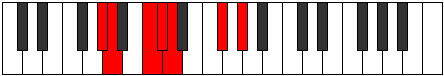
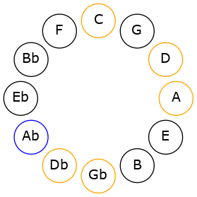
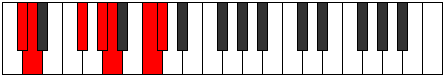
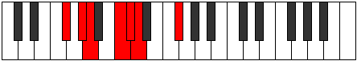
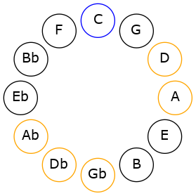
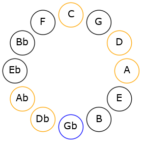

# Mode AFlatAerygimic

## Links

- [Documentation](README.md)
- [Scales Index](Scales.md)
- [Modes Index](Modes.md)
- [Chords Index](Chords.md)

## Scale

[Katythimic](ScaleKatythimic.md)

## Mode

[AFlatAerygimic](ModeAFlatAerygimic.md)

## Tonic

Ab

## Signature

[CNaturalMajor]

## Transposition

1, 3, 1, 1, 4, 2

## Chord Pattern

Ib5, vi

## Perfection

 - 3 Perfect Notes

 - 3 Imperfect Notes

## Notes

- Ab (Imperfect)
- Bbb (Imperfect)
- C (Imperfect)
- Db
- Ebb
- F#
- Ab (Imperfect)

## Illustration

## Diagram

## Relative Modes

| Number | Mode | Tonic | Notes | Illustration |
|--------|------|-------|-------|--------------|
| [1139](https://ianring.com/musictheory/scales/1139) | [Aerygimic](ModeAerygimic.md) | Ab | Ab, Bbb, C, Db, Ebb, F#, Ab |  |
| [839](https://ianring.com/musictheory/scales/839) | [Ionathimic](ModeIonathimic.md) | C | C, Db, Ebb, F#, G#, A, C |  |
| [2467](https://ianring.com/musictheory/scales/2467) | [Morimic](ModeMorimic.md) | Db | Db, Ebb, F#, G#, A, B#, Db |  |
| [461](https://ianring.com/musictheory/scales/461) | [Madimic](ModeMadimic.md) | F# | F#, G#, A, B#, C#, D, F# |  |
## Relative Brightness

| Number | Mode | Tonic | Notes | Illustration |
|--------|------|-------|-------|--------------|
| [1139](https://ianring.com/musictheory/scales/1139) | [Aerygimic](ModeAerygimic.md) | Ab | Ab, Bbb, C, Db, Ebb, F#, Ab |  |
| [839](https://ianring.com/musictheory/scales/839) | [Ionathimic](ModeIonathimic.md) | C | C, Db, Ebb, F#, G#, A, C |  |
| [2467](https://ianring.com/musictheory/scales/2467) | [Morimic](ModeMorimic.md) | Db | Db, Ebb, F#, G#, A, B#, Db |  |
| [461](https://ianring.com/musictheory/scales/461) | [Madimic](ModeMadimic.md) | F# | F#, G#, A, B#, C#, D, F# |  |

## Chords

### Ab

| Number | Root | Name | Notes | Illustration | Audio |
|--------|------|------|-------|--------------|-------|
| 772 | Ab | [Abloc](ChordAFlatLocrian.md) | Ab, Bbb, Ebb |  | [midi](ChordAFlatLocrianRootPosition.mid) |
| 261 | Ab | [AbMb5](ChordAFlatMajorFlatFifth.md) | Ab, C, Ebb |  | [midi](ChordAFlatMajorFlatFifthRootPosition.mid) |
| 262 | Ab | [Absus4b5](ChordAFlatSuspendedFourthFlatFifth.md) | Ab, Db, Ebb |  | [midi](ChordAFlatSuspendedFourthFlatFifthRootPosition.mid) |
| 322 | Ab | [AbQ](ChordAFlatQuartal.md) | Ab, Db, Gb |  | [midi](ChordAFlatQuartalRootPosition.mid) |
| 325 | Ab | [Ab7b5](ChordAFlatDominantSeventhFlatFifth.md) | Ab, C, Ebb, Gb |  | [midi](ChordAFlatDominantSeventhFlatFifthRootPosition.mid) |
| 837 | Ab | [Ab7b5b9](ChordAFlatDominantSeventhFlatFifthFlatNinth.md) | Ab, C, Ebb, Gb, Bbb |  | [midi](ChordAFlatDominantSeventhFlatFifthFlatNinthRootPosition.mid) |

### Bbb

| Number | Root | Name | Notes | Illustration | Audio |
|--------|------|------|-------|--------------|-------|

### C

| Number | Root | Name | Notes | Illustration | Audio |
|--------|------|------|-------|--------------|-------|
| 67 | C | [Cloc](ChordCNaturalLocrian.md) | C, Db, Gb |  | [midi](ChordCNaturalLocrianRootPosition.mid) |
| 69 | C | [C](ChordCNaturalDiminishedFlatThird.md) | C, Ebb, Gb |  | [midi](ChordCNaturalDiminishedFlatThirdRootPosition.mid) |
| 69 | C | [Csus2b5](ChordCNaturalSuspendedSecondFlatFifth.md) | C, D, Gb |  | [midi](ChordCNaturalSuspendedSecondFlatFifthRootPosition.mid) |
| 261 | C | [Csus2#5](ChordCNaturalSuspendedSecondSharpFifth.md) | C, D, G# |  | [midi](ChordCNaturalSuspendedSecondSharpFifthRootPosition.mid) |
| 325 | C | [Csus2b5add(#5)](ChordCNaturalSuspendedSecondFlatFifthAddSharpFifth.md) | C, D, Gb, G# |  | [midi](ChordCNaturalSuspendedSecondFlatFifthAddSharpFifthRootPosition.mid) |
| 581 | C | [CM6sus2b5](ChordCNaturalMajorSixthSuspendedSecondFlatFifth.md) | C, D, Gb, A |  | [midi](ChordCNaturalMajorSixthSuspendedSecondFlatFifthRootPosition.mid) |

### Db

| Number | Root | Name | Notes | Illustration | Audio |
|--------|------|------|-------|--------------|-------|
| 258 | Db | [Db5](ChordDFlatPowerChord.md) | Db, Ab |  | [midi](ChordDFlatPowerChordRootPosition.mid) |
| 262 | Db | [Dbphryg](ChordDFlatPhrygian.md) | Db, Ebb, Ab |  | [midi](ChordDFlatPhrygianRootPosition.mid) |
| 322 | Db | [Dbsus4](ChordDFlatSuspendedFourth.md) | Db, Gb, Ab |  | [midi](ChordDFlatSuspendedFourthRootPosition.mid) |
| 578 | Db | [Dbsus4#5](ChordDFlatSuspendedFourthSharpFifth.md) | Db, Gb, A |  | [midi](ChordDFlatSuspendedFourthSharpFifthRootPosition.mid) |
| 67 | Db | [DbQ+](ChordDFlatQuartalAugmented.md) | Db, Gb, C |  | [midi](ChordDFlatQuartalAugmentedRootPosition.mid) |
| 263 | Db | [Dbphryg+7](ChordDFlatPhrygianAddSeventh.md) | Db, Ebb, Ab, C |  | [midi](ChordDFlatPhrygianAddSeventhRootPosition.mid) |
| 323 | Db | [DbM7(sus4)](ChordDFlatMajorSeventhSuspendedFourth.md) | Db, Gb, Ab, C |  | [midi](ChordDFlatMajorSeventhSuspendedFourthRootPosition.mid) |
| 579 | Db | [DbM7(sus4)#5](ChordDFlatMajorSeventhSuspendedFourthSharpFifth.md) | Db, Gb, A, C |  | [midi](ChordDFlatMajorSeventhSuspendedFourthSharpFifthRootPosition.mid) |

### Ebb

| Number | Root | Name | Notes | Illustration | Audio |
|--------|------|------|-------|--------------|-------|

### F#

| Number | Root | Name | Notes | Illustration | Audio |
|--------|------|------|-------|--------------|-------|
| 321 | F# | [F#](ChordFSharpDiminishedFlatThird.md) | F#, Ab, C |  | [midi](ChordFSharpDiminishedFlatThirdRootPosition.mid) |
| 321 | F# | [F#sus2b5](ChordFSharpSuspendedSecondFlatFifth.md) | F#, G#, C |  | [midi](ChordFSharpSuspendedSecondFlatFifthRootPosition.mid) |
| 577 | F# | [F#o](ChordFSharpDiminished.md) | F#, A, C |  | [midi](ChordFSharpDiminishedRootPosition.mid) |
| 66 | F# | [F#5](ChordFSharpPowerChord.md) | F#, C# |  | [midi](ChordFSharpPowerChordRootPosition.mid) |
| 322 | F# | [F#sus2](ChordFSharpSuspendedSecond.md) | F#, G#, C# |  | [midi](ChordFSharpSuspendedSecondRootPosition.mid) |
| 578 | F# | [F#m](ChordFSharpMinor.md) | F#, A, C# |  | [midi](ChordFSharpMinorRootPosition.mid) |
| 578 | F# | [F#m(add(#9))](ChordFSharpMinorAddSharpNinth.md) | F#, A, C#, G## |  | [midi](ChordFSharpMinorAddSharpNinthRootPosition.mid) |
| 834 | F# | [F#m(add9)](ChordFSharpMinorAddNinth.md) | F#, A, C#, G# |  | [midi](ChordFSharpMinorAddNinthRootPosition.mid) |
| 67 | F# | [F#lyd](ChordFSharpLydian.md) | F#, B#, C# |  | [midi](ChordFSharpLydianRootPosition.mid) |
| 579 | F# | [F#m(add(#4))](ChordFSharpMinorAddSharpFourth.md) | F#, A, B#, C# |  | [midi](ChordFSharpMinorAddSharpFourthRootPosition.mid) |
| 324 | F# | [F#sus2#5](ChordFSharpSuspendedSecondSharpFifth.md) | F#, G#, C## |  | [midi](ChordFSharpSuspendedSecondSharpFifthRootPosition.mid) |
| 580 | F# | [F#m#5](ChordFSharpMinorSharpFifth.md) | F#, A, D |  | [midi](ChordFSharpMinorSharpFifthRootPosition.mid) |
| 325 | F# | [F#sus2b5add(#5)](ChordFSharpSuspendedSecondFlatFifthAddSharpFifth.md) | F#, G#, C, C## |  | [midi](ChordFSharpSuspendedSecondFlatFifthAddSharpFifthRootPosition.mid) |

