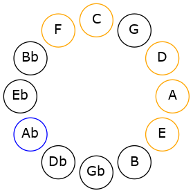
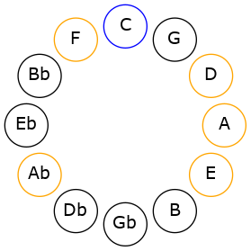
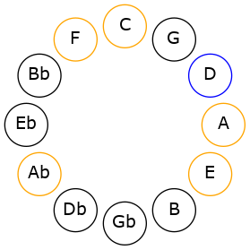
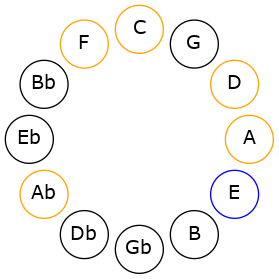
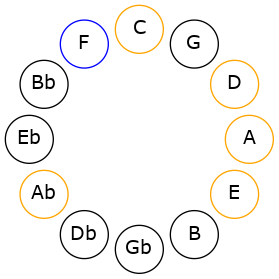

# Mode AFlatAerylimic

## Links

- [Documentation](README.md)
- [Scales Index](Scales.md)
- [Modes Index](Modes.md)
- [Chords Index](Chords.md)

## Scale

[Mothimic](ScaleMothimic.md)

## Mode

[AFlatAerylimic](ModeAFlatAerylimic.md)

## Tonic

Ab

## Signature

[CNaturalMajor]

## Transposition

1, 3, 2, 2, 1, 3

## Chord Pattern

I⁺, III⁺, iv, V⁺

## Perfection

 - 3 Perfect Notes

 - 3 Imperfect Notes

## Notes

- Ab (Imperfect)
- Bbb
- C (Imperfect)
- D
- E (Imperfect)
- F
- Ab (Imperfect)

## Illustration

## Diagram

## Relative Modes

| Number | Mode | Tonic | Notes | Illustration |
|--------|------|-------|-------|--------------|
| [851](https://ianring.com/musictheory/scales/851) | [Aerylimic](ModeAerylimic.md) | Ab | Ab, Bbb, C, D, E, F, Ab |  |
| [821](https://ianring.com/musictheory/scales/821) | [Aeranimic](ModeAeranimic.md) | C | C, D, E, F, G#, A, C |  |
| [1229](https://ianring.com/musictheory/scales/1229) | [Ragimic](ModeRagimic.md) | D | D, E, F, G#, A, B#, D |  |
| [1331](https://ianring.com/musictheory/scales/1331) | [Dolimic](ModeDolimic.md) | E | E, F, G#, A, B#, C##, E |  |
| [2713](https://ianring.com/musictheory/scales/2713) | [Porimic](ModePorimic.md) | F | F, G#, A, B#, C##, D##, F |  |
## Relative Brightness

| Number | Mode | Tonic | Notes | Illustration |
|--------|------|-------|-------|--------------|
| [851](https://ianring.com/musictheory/scales/851) | [Aerylimic](ModeAerylimic.md) | Ab | Ab, Bbb, C, D, E, F, Ab |  |
| [821](https://ianring.com/musictheory/scales/821) | [Aeranimic](ModeAeranimic.md) | C | C, D, E, F, G#, A, C |  |
| [1229](https://ianring.com/musictheory/scales/1229) | [Ragimic](ModeRagimic.md) | D | D, E, F, G#, A, B#, D |  |
| [1331](https://ianring.com/musictheory/scales/1331) | [Dolimic](ModeDolimic.md) | E | E, F, G#, A, B#, C##, E |  |
| [2713](https://ianring.com/musictheory/scales/2713) | [Porimic](ModePorimic.md) | F | F, G#, A, B#, C##, D##, F |  |

## Chords

### Ab

| Number | Root | Name | Notes | Illustration | Audio |
|--------|------|------|-------|--------------|-------|
| 772 | Ab | [Abloc](ChordAFlatLocrian.md) | Ab, Bbb, Ebb |  | [midi](ChordAFlatLocrianRootPosition.mid) |
| 261 | Ab | [AbMb5](ChordAFlatMajorFlatFifth.md) | Ab, C, Ebb |  | [midi](ChordAFlatMajorFlatFifthRootPosition.mid) |
| 273 | Ab | [Ab+](ChordAFlatAugmented.md) | Ab, C, E |  | [midi](ChordAFlatAugmentedRootPosition.mid) |
| 273 | Ab | [Ab+7](ChordAFlatAugmentedAugmentedSeventh.md) | Ab, C, E, G# |  | [midi](ChordAFlatAugmentedAugmentedSeventhRootPosition.mid) |
| 289 | Ab | [AbM##5](ChordAFlatMajorDoubleSharpFifth.md) | Ab, C, F |  | [midi](ChordAFlatMajorDoubleSharpFifthRootPosition.mid) |
| 293 | Ab | [AbM6b5](ChordAFlatMajorSixthFlatFifth.md) | Ab, C, Ebb, F |  | [midi](ChordAFlatMajorSixthFlatFifthRootPosition.mid) |

### Bbb

| Number | Root | Name | Notes | Illustration | Audio |
|--------|------|------|-------|--------------|-------|

### C

| Number | Root | Name | Notes | Illustration | Audio |
|--------|------|------|-------|--------------|-------|
| 37 | C | [Csus2bb5](ChordCNaturalSuspendedSecondDoubleFlatFifth.md) | C, D, F |  | [midi](ChordCNaturalSuspendedSecondDoubleFlatFifthRootPosition.mid) |
| 261 | C | [Csus2#5](ChordCNaturalSuspendedSecondSharpFifth.md) | C, D, G# |  | [midi](ChordCNaturalSuspendedSecondSharpFifthRootPosition.mid) |
| 273 | C | [C+](ChordCNaturalAugmented.md) | C, E, G# |  | [midi](ChordCNaturalAugmentedRootPosition.mid) |
| 273 | C | [C+7](ChordCNaturalAugmentedAugmentedSeventh.md) | C, E, G#, B# |  | [midi](ChordCNaturalAugmentedAugmentedSeventhRootPosition.mid) |
| 289 | C | [Csus4#5](ChordCNaturalSuspendedFourthSharpFifth.md) | C, F, G# |  | [midi](ChordCNaturalSuspendedFourthSharpFifthRootPosition.mid) |
| 529 | C | [CM##5](ChordCNaturalMajorDoubleSharpFifth.md) | C, E, A |  | [midi](ChordCNaturalMajorDoubleSharpFifthRootPosition.mid) |
| 545 | C | [Csus4##5](ChordCNaturalSuspendedFourthDoubleSharpFifth.md) | C, F, A |  | [midi](ChordCNaturalSuspendedFourthDoubleSharpFifthRootPosition.mid) |
| 549 | C | [CM6sus2bb5](ChordCNaturalMajorSixthSuspendedSecondDoubleFlatFifth.md) | C, D, F, A |  | [midi](ChordCNaturalMajorSixthSuspendedSecondDoubleFlatFifthRootPosition.mid) |

### D

| Number | Root | Name | Notes | Illustration | Audio |
|--------|------|------|-------|--------------|-------|
| 276 | D | [D](ChordDNaturalDiminishedFlatThird.md) | D, Fb, Ab |  | [midi](ChordDNaturalDiminishedFlatThirdRootPosition.mid) |
| 276 | D | [Dsus2b5](ChordDNaturalSuspendedSecondFlatFifth.md) | D, E, Ab |  | [midi](ChordDNaturalSuspendedSecondFlatFifthRootPosition.mid) |
| 292 | D | [Do](ChordDNaturalDiminished.md) | D, F, Ab |  | [midi](ChordDNaturalDiminishedRootPosition.mid) |
| 516 | D | [D5](ChordDNaturalPowerChord.md) | D, A |  | [midi](ChordDNaturalPowerChordRootPosition.mid) |
| 532 | D | [Dsus2](ChordDNaturalSuspendedSecond.md) | D, E, A |  | [midi](ChordDNaturalSuspendedSecondRootPosition.mid) |
| 548 | D | [Dm](ChordDNaturalMinor.md) | D, F, A |  | [midi](ChordDNaturalMinorRootPosition.mid) |
| 548 | D | [Dm(add(#9))](ChordDNaturalMinorAddSharpNinth.md) | D, F, A, E# |  | [midi](ChordDNaturalMinorAddSharpNinthRootPosition.mid) |
| 564 | D | [Dm(add9)](ChordDNaturalMinorAddNinth.md) | D, F, A, E |  | [midi](ChordDNaturalMinorAddNinthRootPosition.mid) |
| 772 | D | [Dlyd](ChordDNaturalLydian.md) | D, G#, A |  | [midi](ChordDNaturalLydianRootPosition.mid) |
| 804 | D | [Dm(add(#4))](ChordDNaturalMinorAddSharpFourth.md) | D, F, G#, A |  | [midi](ChordDNaturalMinorAddSharpFourthRootPosition.mid) |
| 293 | D | [Dø7](ChordDNaturalHalfDiminishedSeventh.md) | D, F, Ab, C |  | [midi](ChordDNaturalHalfDiminishedSeventhRootPosition.mid) |
| 533 | D | [D7sus2](ChordDNaturalDominantSeventhSuspendedSecond.md) | D, E, A, C |  | [midi](ChordDNaturalDominantSeventhSuspendedSecondRootPosition.mid) |
| 533 | D | [D9sus2](ChordDNaturalDominantNinthSuspendedSecond.md) | D, E, A, C, E |  | [midi](ChordDNaturalDominantNinthSuspendedSecondRootPosition.mid) |
| 549 | D | [Dm7](ChordDNaturalMinorSeventh.md) | D, F, A, C |  | [midi](ChordDNaturalMinorSeventhRootPosition.mid) |
| 565 | D | [Dm9](ChordDNaturalMinorNinth.md) | D, F, A, C, E |  | [midi](ChordDNaturalMinorNinthRootPosition.mid) |
| 805 | D | [Dm7add(#11)](ChordDNaturalMinorSeventhAddSharpEleventh.md) | D, F, A, C, G# |  | [midi](ChordDNaturalMinorSeventhAddSharpEleventhRootPosition.mid) |

### E

| Number | Root | Name | Notes | Illustration | Audio |
|--------|------|------|-------|--------------|-------|
| 273 | E | [E+](ChordENaturalAugmented.md) | E, G#, B# |  | [midi](ChordENaturalAugmentedRootPosition.mid) |
| 273 | E | [E+7](ChordENaturalAugmentedAugmentedSeventh.md) | E, G#, B#, D## |  | [midi](ChordENaturalAugmentedAugmentedSeventhRootPosition.mid) |
| 529 | E | [Esus4#5](ChordENaturalSuspendedFourthSharpFifth.md) | E, A, B# |  | [midi](ChordENaturalSuspendedFourthSharpFifthRootPosition.mid) |
| 532 | E | [EQ](ChordENaturalQuartal.md) | E, A, D |  | [midi](ChordENaturalQuartalRootPosition.mid) |
| 309 | E | [E7#5b9](ChordENaturalDominantSeventhSharpFifthFlatNinth.md) | E, G#, B#, D, F |  | [midi](ChordENaturalDominantSeventhSharpFifthFlatNinthRootPosition.mid) |

### F

| Number | Root | Name | Notes | Illustration | Audio |
|--------|------|------|-------|--------------|-------|
| 33 | F | [F5](ChordFNaturalPowerChord.md) | F, C |  | [midi](ChordFNaturalPowerChordRootPosition.mid) |
| 289 | F | [Fm](ChordFNaturalMinor.md) | F, Ab, C |  | [midi](ChordFNaturalMinorRootPosition.mid) |
| 289 | F | [Fm(add(#9))](ChordFNaturalMinorAddSharpNinth.md) | F, Ab, C, G# |  | [midi](ChordFNaturalMinorAddSharpNinthRootPosition.mid) |
| 545 | F | [FM](ChordFNaturalMajor.md) | F, A, C |  | [midi](ChordFNaturalMajorRootPosition.mid) |
| 801 | F | [FM(add(#9))](ChordFNaturalMajorAddSharpNinth.md) | F, A, C, G# |  | [midi](ChordFNaturalMajorAddSharpNinthRootPosition.mid) |
| 548 | F | [FM##5](ChordFNaturalMajorDoubleSharpFifth.md) | F, A, D |  | [midi](ChordFNaturalMajorDoubleSharpFifthRootPosition.mid) |
| 293 | F | [Fm6](ChordFNaturalMinorSixth.md) | F, Ab, C, D |  | [midi](ChordFNaturalMinorSixthRootPosition.mid) |
| 549 | F | [FM6](ChordFNaturalMajorSixth.md) | F, A, C, D |  | [midi](ChordFNaturalMajorSixthRootPosition.mid) |
| 305 | F | [Fm(M7)](ChordFNaturalMinorMajorSeventh.md) | F, Ab, C, E |  | [midi](ChordFNaturalMinorMajorSeventhRootPosition.mid) |
| 561 | F | [FM7](ChordFNaturalMajorSeventh.md) | F, A, C, E |  | [midi](ChordFNaturalMajorSeventhRootPosition.mid) |
| 564 | F | [FM7##5](ChordFNaturalMajorSeventhDoubleSharpFifth.md) | F, A, D, E |  | [midi](ChordFNaturalMajorSeventhDoubleSharpFifthRootPosition.mid) |
| 309 | F | [Fm(M7)add13](ChordFNaturalMinorMajorSeventhAddThirteenth.md) | F, Ab, C, E, D |  | [midi](ChordFNaturalMinorMajorSeventhAddThirteenthRootPosition.mid) |
| 565 | F | [FM7add13](ChordFNaturalMajorSeventhAddThirteenth.md) | F, A, C, E, D |  | [midi](ChordFNaturalMajorSeventhAddThirteenthRootPosition.mid) |

