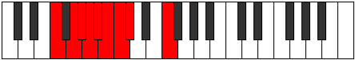

# Mode AFlatAerylyllic

## Links

- [Documentation](index.md)
- [Scales Index](Scales.md)
- [Modes Index](Modes.md)
- [Chords Index](Chords.md)

## Scale

[Stycryllic](ScaleStycryllic.md)

## Mode

[AFlatAerylyllic](ModeAFlatAerylyllic.md)

## Tonic

Ab

## Signature

[CNaturalMajor]

## Perfection

 - 4 Perfect Notes

 - 4 Imperfect Notes

## Notes

- Ab (Imperfect)
- A (Imperfect)
- Bb
- B (Imperfect)
- C
- Db
- F
- G (Imperfect)
- Ab (Imperfect)

## Illustration

## Relative Modes

| Number | Mode | Tonic | Notes | Illustration |
|--------|------|-------|-------|--------------|
| [509](https://ianring.com/musictheory/scales/509) | [Ionothyllic](ModeIonothyllic.md) | F | F, G, G#, A, A#, B, C, C#, F |  |
| [1151](https://ianring.com/musictheory/scales/1151) | [Mythyllic](ModeMythyllic.md) | G | G, G#, A, A#, B, C, C#, F, G |  |
| [2623](https://ianring.com/musictheory/scales/2623) | [Aerylyllic](ModeAerylyllic.md) | G# | G#, A, A#, B, C, C#, F, G, G# |  |
| [2623](https://ianring.com/musictheory/scales/2623) | [Aerylyllic](ModeAerylyllic.md) | Ab | Ab, A, Bb, B, C, Db, F, G, Ab |  |
| [3359](https://ianring.com/musictheory/scales/3359) | [Bonyllic](ModeBonyllic.md) | A | A, A#, B, C, C#, F, G, G#, A |  |
| [3727](https://ianring.com/musictheory/scales/3727) | [Tholyllic](ModeTholyllic.md) | A# | A#, B, C, C#, F, G, G#, A, A# |  |
| [3727](https://ianring.com/musictheory/scales/3727) | [Tholyllic](ModeTholyllic.md) | Bb | Bb, B, C, Db, F, G, Ab, A, Bb |  |
| [3911](https://ianring.com/musictheory/scales/3911) | [Katyryllic](ModeKatyryllic.md) | B | B, C, C#, F, G, G#, A, A#, B |  |
| [4003](https://ianring.com/musictheory/scales/4003) | [Sadyllic](ModeSadyllic.md) | C | C, C#, F, G, G#, A, A#, B, C |  |
| [4049](https://ianring.com/musictheory/scales/4049) | [Stycryllic](ModeStycryllic.md) | C# | C#, F, G, G#, A, A#, B, C, C# |  |
| [4049](https://ianring.com/musictheory/scales/4049) | [Stycryllic](ModeStycryllic.md) | Db | Db, F, G, Ab, A, Bb, B, C, Db |  |

## Chords

### Ab

| Number | Root | Name | Notes | Illustration | Audio |
|--------|------|------|-------|--------------|-------|

### A

| Number | Root | Name | Notes | Illustration | Audio |
|--------|------|------|-------|--------------|-------|
| 2592 | A | [Asus2#5](ChordANaturalSuspendedSecondSharpFifth.md) | A, B, E# |  | [midi](ChordANaturalSuspendedSecondSharpFifthRootPosition.mid) |
| 545 | A | [Am#5](ChordANaturalMinorSharpFifth.md) | A, C, F |  | [midi](ChordANaturalMinorSharpFifthRootPosition.mid) |
| 546 | A | [A+](ChordANaturalAugmented.md) | A, C#, E# |  | [midi](ChordANaturalAugmentedRootPosition.mid) |
| 546 | A | [A+7](ChordANaturalAugmentedAugmentedSeventh.md) | A, C#, E#, G## |  | [midi](ChordANaturalAugmentedAugmentedSeventhRootPosition.mid) |
| 673 | A | [Am7#5](ChordANaturalMinorSeventhSharpFifth.md) | A, C, E#, G |  | [midi](ChordANaturalMinorSeventhSharpFifthRootPosition.mid) |
| 1698 | A | [A7#5b9](ChordANaturalDominantSeventhSharpFifthFlatNinth.md) | A, C#, E#, G, Bb |  | [midi](ChordANaturalDominantSeventhSharpFifthFlatNinthRootPosition.mid) |
| 802 | A | [A+(M7)](ChordANaturalAugmentedMajorSeventh.md) | A, C#, E#, G# |  | [midi](ChordANaturalAugmentedMajorSeventhRootPosition.mid) |

### Bb

| Number | Root | Name | Notes | Illustration | Audio |
|--------|------|------|-------|--------------|-------|

### B

| Number | Root | Name | Notes | Illustration | Audio |
|--------|------|------|-------|--------------|-------|
| 2081 | B | [Bloc](ChordBNaturalLocrian.md) | B, C, F |  | [midi](ChordBNaturalLocrianRootPosition.mid) |
| 2082 | B | [Bsus2b5](ChordBNaturalSuspendedSecondFlatFifth.md) | B, C#, F |  | [midi](ChordBNaturalSuspendedSecondFlatFifthRootPosition.mid) |
| 2178 | B | [Bsus2#5](ChordBNaturalSuspendedSecondSharpFifth.md) | B, C#, F## |  | [midi](ChordBNaturalSuspendedSecondSharpFifthRootPosition.mid) |
| 2210 | B | [Bsus2b5add(#5)](ChordBNaturalSuspendedSecondFlatFifthAddSharpFifth.md) | B, C#, F, F## |  | [midi](ChordBNaturalSuspendedSecondFlatFifthAddSharpFifthRootPosition.mid) |
| 2338 | B | [BM6sus2b5](ChordBNaturalMajorSixthSuspendedSecondFlatFifth.md) | B, C#, F, G# |  | [midi](ChordBNaturalMajorSixthSuspendedSecondFlatFifthRootPosition.mid) |

### C

| Number | Root | Name | Notes | Illustration | Audio |
|--------|------|------|-------|--------------|-------|
| 129 | C | [C5](ChordCNaturalPowerChord.md) | C, G |  | [midi](ChordCNaturalPowerChordRootPosition.mid) |
| 131 | C | [Cphryg](ChordCNaturalPhrygian.md) | C, Db, G |  | [midi](ChordCNaturalPhrygianRootPosition.mid) |
| 161 | C | [Csus4](ChordCNaturalSuspendedFourth.md) | C, F, G |  | [midi](ChordCNaturalSuspendedFourthRootPosition.mid) |
| 289 | C | [Csus4#5](ChordCNaturalSuspendedFourthSharpFifth.md) | C, F, G# |  | [midi](ChordCNaturalSuspendedFourthSharpFifthRootPosition.mid) |
| 545 | C | [Csus4##5](ChordCNaturalSuspendedFourthDoubleSharpFifth.md) | C, F, A |  | [midi](ChordCNaturalSuspendedFourthDoubleSharpFifthRootPosition.mid) |
| 673 | C | [CM6sus4](ChordCNaturalMajorSixthSuspendedFourth.md) | C, F, G, A |  | [midi](ChordCNaturalMajorSixthSuspendedFourthRootPosition.mid) |
| 1057 | C | [CQ](ChordCNaturalQuartal.md) | C, F, Bb |  | [midi](ChordCNaturalQuartalRootPosition.mid) |
| 1185 | C | [C7sus4](ChordCNaturalDominantSeventhSuspendedFourth.md) | C, F, G, Bb |  | [midi](ChordCNaturalDominantSeventhSuspendedFourthRootPosition.mid) |
| 2081 | C | [CQ+](ChordCNaturalQuartalAugmented.md) | C, F, B |  | [midi](ChordCNaturalQuartalAugmentedRootPosition.mid) |
| 2179 | C | [Cphryg+7](ChordCNaturalPhrygianAddSeventh.md) | C, Db, G, B |  | [midi](ChordCNaturalPhrygianAddSeventhRootPosition.mid) |
| 2209 | C | [CM7(sus4)](ChordCNaturalMajorSeventhSuspendedFourth.md) | C, F, G, B |  | [midi](ChordCNaturalMajorSeventhSuspendedFourthRootPosition.mid) |
| 2337 | C | [CM7(sus4)#5](ChordCNaturalMajorSeventhSuspendedFourthSharpFifth.md) | C, F, G#, B |  | [midi](ChordCNaturalMajorSeventhSuspendedFourthSharpFifthRootPosition.mid) |
| 2593 | C | [CM7(sus4)##5](ChordCNaturalMajorSeventhSuspendedFourthDoubleSharpFifth.md) | C, F, A, B |  | [midi](ChordCNaturalMajorSeventhSuspendedFourthDoubleSharpFifthRootPosition.mid) |

### Db

| Number | Root | Name | Notes | Illustration | Audio |
|--------|------|------|-------|--------------|-------|

### F

| Number | Root | Name | Notes | Illustration | Audio |
|--------|------|------|-------|--------------|-------|
| 1184 | F | [Fsus2bb5](ChordFNaturalSuspendedSecondDoubleFlatFifth.md) | F, G, Bb |  | [midi](ChordFNaturalSuspendedSecondDoubleFlatFifthRootPosition.mid) |
| 1312 | F | [Fmbb5](ChordFNaturalMinorDoubleFlatFifth.md) | F, Ab, Bb |  | [midi](ChordFNaturalMinorDoubleFlatFifthRootPosition.mid) |
| 2208 | F | [Fsus2b5](ChordFNaturalSuspendedSecondFlatFifth.md) | F, G, Cb |  | [midi](ChordFNaturalSuspendedSecondFlatFifthRootPosition.mid) |
| 2336 | F | [Fo](ChordFNaturalDiminished.md) | F, Ab, Cb |  | [midi](ChordFNaturalDiminishedRootPosition.mid) |
| 2592 | F | [FMb5](ChordFNaturalMajorFlatFifth.md) | F, A, Cb |  | [midi](ChordFNaturalMajorFlatFifthRootPosition.mid) |
| 3104 | F | [Fsus4b5](ChordFNaturalSuspendedFourthFlatFifth.md) | F, Bb, Cb |  | [midi](ChordFNaturalSuspendedFourthFlatFifthRootPosition.mid) |
| 33 | F | [F5](ChordFNaturalPowerChord.md) | F, C |  | [midi](ChordFNaturalPowerChordRootPosition.mid) |
| 161 | F | [Fsus2](ChordFNaturalSuspendedSecond.md) | F, G, C |  | [midi](ChordFNaturalSuspendedSecondRootPosition.mid) |
| 289 | F | [Fm](ChordFNaturalMinor.md) | F, Ab, C |  | [midi](ChordFNaturalMinorRootPosition.mid) |
| 289 | F | [Fm(add(#9))](ChordFNaturalMinorAddSharpNinth.md) | F, Ab, C, G# |  | [midi](ChordFNaturalMinorAddSharpNinthRootPosition.mid) |
| 417 | F | [Fm(add9)](ChordFNaturalMinorAddNinth.md) | F, Ab, C, G |  | [midi](ChordFNaturalMinorAddNinthRootPosition.mid) |
| 545 | F | [FM](ChordFNaturalMajor.md) | F, A, C |  | [midi](ChordFNaturalMajorRootPosition.mid) |
| 673 | F | [FM(add9)](ChordFNaturalMajorAddNinth.md) | F, A, C, G |  | [midi](ChordFNaturalMajorAddNinthRootPosition.mid) |
| 801 | F | [FM(add(#9))](ChordFNaturalMajorAddSharpNinth.md) | F, A, C, G# |  | [midi](ChordFNaturalMajorAddSharpNinthRootPosition.mid) |
| 1057 | F | [Fsus4](ChordFNaturalSuspendedFourth.md) | F, Bb, C |  | [midi](ChordFNaturalSuspendedFourthRootPosition.mid) |
| 1313 | F | [Fm(add11)](ChordFNaturalMinorAddEleventh.md) | F, Ab, C, Bb |  | [midi](ChordFNaturalMinorAddEleventhRootPosition.mid) |
| 1313 | F | [Fm(add4)](ChordFNaturalMinorAddFourth.md) | F, Ab, Bb, C |  | [midi](ChordFNaturalMinorAddFourthRootPosition.mid) |
| 1569 | F | [FM(add11)](ChordFNaturalMajorAddEleventh.md) | F, A, C, Bb |  | [midi](ChordFNaturalMajorAddEleventhRootPosition.mid) |
| 1569 | F | [FM(add4)](ChordFNaturalMajorAddFourth.md) | F, A, Bb, C |  | [midi](ChordFNaturalMajorAddFourthRootPosition.mid) |
| 2081 | F | [Flyd](ChordFNaturalLydian.md) | F, B, C |  | [midi](ChordFNaturalLydianRootPosition.mid) |
| 2337 | F | [Fm(add(#4))](ChordFNaturalMinorAddSharpFourth.md) | F, Ab, B, C |  | [midi](ChordFNaturalMinorAddSharpFourthRootPosition.mid) |
| 2593 | F | [FM(add(#4))](ChordFNaturalMajorAddSharpFourth.md) | F, A, B, C |  | [midi](ChordFNaturalMajorAddSharpFourthRootPosition.mid) |
| 162 | F | [Fsus2#5](ChordFNaturalSuspendedSecondSharpFifth.md) | F, G, C# |  | [midi](ChordFNaturalSuspendedSecondSharpFifthRootPosition.mid) |
| 290 | F | [Fm#5](ChordFNaturalMinorSharpFifth.md) | F, Ab, Db |  | [midi](ChordFNaturalMinorSharpFifthRootPosition.mid) |
| 546 | F | [F+](ChordFNaturalAugmented.md) | F, A, C# |  | [midi](ChordFNaturalAugmentedRootPosition.mid) |
| 546 | F | [F+7](ChordFNaturalAugmentedAugmentedSeventh.md) | F, A, C#, E# |  | [midi](ChordFNaturalAugmentedAugmentedSeventhRootPosition.mid) |
| 1058 | F | [Fsus4#5](ChordFNaturalSuspendedFourthSharpFifth.md) | F, Bb, C# |  | [midi](ChordFNaturalSuspendedFourthSharpFifthRootPosition.mid) |
| 2210 | F | [Fsus2b5add(#5)](ChordFNaturalSuspendedSecondFlatFifthAddSharpFifth.md) | F, G, Cb, C# |  | [midi](ChordFNaturalSuspendedSecondFlatFifthAddSharpFifthRootPosition.mid) |

### G

| Number | Root | Name | Notes | Illustration | Audio |
|--------|------|------|-------|--------------|-------|
| 641 | G | [Gsus2bb5](ChordGNaturalSuspendedSecondDoubleFlatFifth.md) | G, A, C |  | [midi](ChordGNaturalSuspendedSecondDoubleFlatFifthRootPosition.mid) |
| 1153 | G | [Gmbb5](ChordGNaturalMinorDoubleFlatFifth.md) | G, Bb, C |  | [midi](ChordGNaturalMinorDoubleFlatFifthRootPosition.mid) |
| 386 | G | [Gloc](ChordGNaturalLocrian.md) | G, Ab, Db |  | [midi](ChordGNaturalLocrianRootPosition.mid) |
| 642 | G | [Gsus2b5](ChordGNaturalSuspendedSecondFlatFifth.md) | G, A, Db |  | [midi](ChordGNaturalSuspendedSecondFlatFifthRootPosition.mid) |
| 1154 | G | [Go](ChordGNaturalDiminished.md) | G, Bb, Db |  | [midi](ChordGNaturalDiminishedRootPosition.mid) |
| 2178 | G | [GMb5](ChordGNaturalMajorFlatFifth.md) | G, B, Db |  | [midi](ChordGNaturalMajorFlatFifthRootPosition.mid) |
| 131 | G | [Gsus4b5](ChordGNaturalSuspendedFourthFlatFifth.md) | G, C, Db |  | [midi](ChordGNaturalSuspendedFourthFlatFifthRootPosition.mid) |
| 161 | G | [GQ](ChordGNaturalQuartal.md) | G, C, F |  | [midi](ChordGNaturalQuartalRootPosition.mid) |
| 1185 | G | [Gm7bb5](ChordGNaturalMinorSeventhDoubleFlatFifth.md) | G, Bb, C, F |  | [midi](ChordGNaturalMinorSeventhDoubleFlatFifthRootPosition.mid) |
| 1186 | G | [Gø7](ChordGNaturalHalfDiminishedSeventh.md) | G, Bb, Db, F |  | [midi](ChordGNaturalHalfDiminishedSeventhRootPosition.mid) |
| 2210 | G | [G7b5](ChordGNaturalDominantSeventhFlatFifth.md) | G, B, Db, F |  | [midi](ChordGNaturalDominantSeventhFlatFifthRootPosition.mid) |
| 2466 | G | [G7b5b9](ChordGNaturalDominantSeventhFlatFifthFlatNinth.md) | G, B, Db, F, Ab |  | [midi](ChordGNaturalDominantSeventhFlatFifthFlatNinthRootPosition.mid) |

