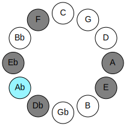
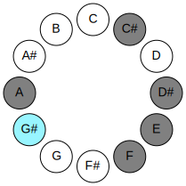
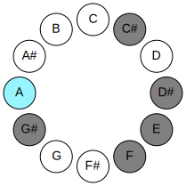
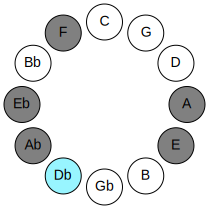
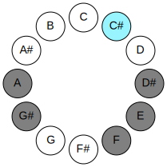
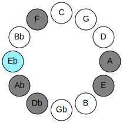
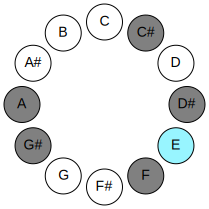
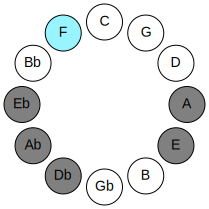
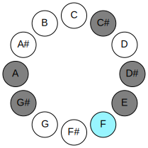

# Mode AFlatBacrimic

## Links

- [Documentation](README.md)
- [Scales Index](Scales.md)
- [Modes Index](Modes.md)
- [Chords Index](Chords.md)

## Parent Scale

[Aerycrimic](ScaleAerycrimic.md)

## Mode

[AFlatBacrimic](ModeAFlatBacrimic.md)

## Number

931

## Luminosity

5

## Tonic

Ab

## Signature

C

## Transposition

1, 4, 2, 1, 1, 3

## Chord Pattern

iii, iv⁰b3

## Perfection

 - 3 Perfect Notes

 - 3 Imperfect Notes

 - Perfection Profile - true, true, true, false, false, false

## Notes

- Ab
- Bbb
- C#
- D# (Imperfect)
- E (Imperfect)
- F (Imperfect)
- Ab

## Illustration

## Diagram

| Circle of Fifth | Chromatic Circle |
|-----------------|------------------|
|  |  |
## Relative Modes

| Number | Mode | Luminosity | Tonic | Notes | Illustration |
|--------|------|------------|-------|-------|--------------|
| [931](https://ianring.com/musictheory/scales/931) | [Bacrimic](ModeBacrimic.md) | 5 | G# | G#, A, B##, C###, D##, E#, G# |  |
| [2513](https://ianring.com/musictheory/scales/2513) | [Aerycrimic](ModeAerycrimic.md) | 6 | A | A, B##, C###, D##, E#, F###, A |  |
| [413](https://ianring.com/musictheory/scales/413) | [Ganimic](ModeGanimic.md) | -1 | C# | C#, D#, E, F, G#, A, C# |  |
| [1127](https://ianring.com/musictheory/scales/1127) | [Eparimic](ModeEparimic.md) | 4 | D# | D#, E, F, G#, A, B##, D# |  |
| [2611](https://ianring.com/musictheory/scales/2611) | [Lyrimic](ModeLyrimic.md) | -1 | E | E, F, G#, A, B##, C###, E |  |
| [3353](https://ianring.com/musictheory/scales/3353) | [Phraptimic](ModePhraptimic.md) | -1 | F | F, G#, A, B##, C###, D##, F |  |
## Relative Brightness

| Number | Mode | Luminosity | Tonic | Notes | Circle Of Fifth | Chromatic Circle |
|--------|------|------------|-------|-------|-----------------|------------------|
| [931](https://ianring.com/musictheory/scales/931) | [Bacrimic](ModeBacrimic.md) | -1 | G# | G#, A, B##, C###, D##, E#, G# |  |  |
| [931](https://ianring.com/musictheory/scales/931) | [Bacrimic](ModeBacrimic.md) | -1 | Ab | Ab, Bbb, C#, D#, E, F, Ab |  |  |
| [2513](https://ianring.com/musictheory/scales/2513) | [Aerycrimic](ModeAerycrimic.md) | -1 | A | A, B##, C###, D##, E#, F###, A |  |  |
| [413](https://ianring.com/musictheory/scales/413) | [Ganimic](ModeGanimic.md) | -1 | C# | C#, D#, E, F, G#, A, C# |  |  |
| [413](https://ianring.com/musictheory/scales/413) | [Ganimic](ModeGanimic.md) | -1 | Db | Db, Eb, Fb, Gbb, Ab, Bbb, Db |  |  |
| [1127](https://ianring.com/musictheory/scales/1127) | [Eparimic](ModeEparimic.md) | 4 | D# | D#, E, F, G#, A, B##, D# |  |  |
| [1127](https://ianring.com/musictheory/scales/1127) | [Eparimic](ModeEparimic.md) | -1 | Eb | Eb, Fb, Gbb, Ab, Bbb, C#, Eb |  |  |
| [2611](https://ianring.com/musictheory/scales/2611) | [Lyrimic](ModeLyrimic.md) | -1 | E | E, F, G#, A, B##, C###, E |  |  |
| [3353](https://ianring.com/musictheory/scales/3353) | [Phraptimic](ModePhraptimic.md) | -1 | F | F, G#, A, B##, C###, D##, F |  |  |

## Chords

### Ab

| Number | Root | Name | Notes | Illustration | Audio |
|--------|------|------|-------|--------------|-------|
| 264 | Ab | [G#5](ChordGSharpPowerChord.md) | G#, D# |  | [midi](ChordGSharpPowerChordRootPosition.mid) |
| 264 | Ab | [Ab5](ChordAFlatPowerChord.md) | Ab, Eb |  | [midi](ChordAFlatPowerChordRootPosition.mid) |
| 776 | Ab | [G#phryg](ChordGSharpPhrygian.md) | G#, A, D# |  | [midi](ChordGSharpPhrygianRootPosition.mid) |
| 776 | Ab | [Abphryg](ChordAFlatPhrygian.md) | Ab, Bbb, Eb |  | [midi](ChordAFlatPhrygianRootPosition.mid) |
| 266 | Ab | [G#sus4](ChordGSharpSuspendedFourth.md) | G#, C#, D# |  | [midi](ChordGSharpSuspendedFourthRootPosition.mid) |
| 266 | Ab | [Absus4](ChordAFlatSuspendedFourth.md) | Ab, Db, Eb |  | [midi](ChordAFlatSuspendedFourthRootPosition.mid) |
| 274 | Ab | [G#sus4#5](ChordGSharpSuspendedFourthSharpFifth.md) | G#, C#, D## |  | [midi](ChordGSharpSuspendedFourthSharpFifthRootPosition.mid) |
| 274 | Ab | [Absus4#5](ChordAFlatSuspendedFourthSharpFifth.md) | Ab, Db, E |  | [midi](ChordAFlatSuspendedFourthSharpFifthRootPosition.mid) |
| 290 | Ab | [G#sus4##5](ChordGSharpSuspendedFourthDoubleSharpFifth.md) | G#, C#, E# |  | [midi](ChordGSharpSuspendedFourthDoubleSharpFifthRootPosition.mid) |
| 290 | Ab | [Absus4##5](ChordAFlatSuspendedFourthDoubleSharpFifth.md) | Ab, Db, F |  | [midi](ChordAFlatSuspendedFourthDoubleSharpFifthRootPosition.mid) |
| 298 | Ab | [G#M6sus4](ChordGSharpMajorSixthSuspendedFourth.md) | G#, C#, D#, E# |  | [midi](ChordGSharpMajorSixthSuspendedFourthRootPosition.mid) |
| 298 | Ab | [AbM6sus4](ChordAFlatMajorSixthSuspendedFourth.md) | Ab, Db, Eb, F |  | [midi](ChordAFlatMajorSixthSuspendedFourthRootPosition.mid) |

### Bbb

| Number | Root | Name | Notes | Illustration | Audio |
|--------|------|------|-------|--------------|-------|
| 522 | Bbb | [AMb5](ChordANaturalMajorFlatFifth.md) | A, C#, Eb |  | [midi](ChordANaturalMajorFlatFifthRootPosition.mid) |
| 528 | Bbb | [A5](ChordANaturalPowerChord.md) | A, E |  | [midi](ChordANaturalPowerChordRootPosition.mid) |
| 530 | Bbb | [AM](ChordANaturalMajor.md) | A, C#, E |  | [midi](ChordANaturalMajorRootPosition.mid) |
| 536 | Bbb | [Alyd](ChordANaturalLydian.md) | A, D#, E |  | [midi](ChordANaturalLydianRootPosition.mid) |
| 538 | Bbb | [AM(add(#4))](ChordANaturalMajorAddSharpFourth.md) | A, C#, D#, E |  | [midi](ChordANaturalMajorAddSharpFourthRootPosition.mid) |
| 546 | Bbb | [A+](ChordANaturalAugmented.md) | A, C#, E# |  | [midi](ChordANaturalAugmentedRootPosition.mid) |
| 546 | Bbb | [A+7](ChordANaturalAugmentedAugmentedSeventh.md) | A, C#, E#, G## |  | [midi](ChordANaturalAugmentedAugmentedSeventhRootPosition.mid) |
| 778 | Bbb | [AM7b5](ChordANaturalMajorSeventhFlatFifth.md) | A, C#, Eb, G# |  | [midi](ChordANaturalMajorSeventhFlatFifthRootPosition.mid) |
| 786 | Bbb | [AM7](ChordANaturalMajorSeventh.md) | A, C#, E, G# |  | [midi](ChordANaturalMajorSeventhRootPosition.mid) |
| 792 | Bbb | [Alyd(M7)](ChordANaturalLydianMajorSeventh.md) | A, D#, E, G# |  | [midi](ChordANaturalLydianMajorSeventhRootPosition.mid) |
| 794 | Bbb | [AM7add(#11)](ChordANaturalMajorSeventhAddSharpEleventh.md) | A, C#, E, G#, D# |  | [midi](ChordANaturalMajorSeventhAddSharpEleventhRootPosition.mid) |
| 794 | Bbb | [AM7add(#4)](ChordANaturalMajorSeventhAddSharpFourth.md) | A, C#, D#, E, G# |  | [midi](ChordANaturalMajorSeventhAddSharpFourthRootPosition.mid) |
| 802 | Bbb | [A+(M7)](ChordANaturalAugmentedMajorSeventh.md) | A, C#, E#, G# |  | [midi](ChordANaturalAugmentedMajorSeventhRootPosition.mid) |

### C#

| Number | Root | Name | Notes | Illustration | Audio |
|--------|------|------|-------|--------------|-------|
| 258 | C# | [C#5](ChordCSharpPowerChord.md) | C#, G# |  | [midi](ChordCSharpPowerChordRootPosition.mid) |
| 258 | C# | [Db5](ChordDFlatPowerChord.md) | Db, Ab |  | [midi](ChordDFlatPowerChordRootPosition.mid) |
| 266 | C# | [C#sus2](ChordCSharpSuspendedSecond.md) | C#, D#, G# |  | [midi](ChordCSharpSuspendedSecondRootPosition.mid) |
| 266 | C# | [Dbsus2](ChordDFlatSuspendedSecond.md) | Db, Eb, Ab |  | [midi](ChordDFlatSuspendedSecondRootPosition.mid) |
| 274 | C# | [C#m](ChordCSharpMinor.md) | C#, E, G# |  | [midi](ChordCSharpMinorRootPosition.mid) |
| 274 | C# | [C#m(add(#9))](ChordCSharpMinorAddSharpNinth.md) | C#, E, G#, D## |  | [midi](ChordCSharpMinorAddSharpNinthRootPosition.mid) |
| 274 | C# | [Dbm](ChordDFlatMinor.md) | Db, Fb, Ab |  | [midi](ChordDFlatMinorRootPosition.mid) |
| 274 | C# | [Dbm(add(#9))](ChordDFlatMinorAddSharpNinth.md) | Db, Fb, Ab, E |  | [midi](ChordDFlatMinorAddSharpNinthRootPosition.mid) |
| 282 | C# | [C#m(add9)](ChordCSharpMinorAddNinth.md) | C#, E, G#, D# |  | [midi](ChordCSharpMinorAddNinthRootPosition.mid) |
| 282 | C# | [Dbm(add9)](ChordDFlatMinorAddNinth.md) | Db, Fb, Ab, Eb |  | [midi](ChordDFlatMinorAddNinthRootPosition.mid) |
| 290 | C# | [C#M](ChordCSharpMajor.md) | C#, E#, G# |  | [midi](ChordCSharpMajorRootPosition.mid) |
| 290 | C# | [DbM](ChordDFlatMajor.md) | Db, F, Ab |  | [midi](ChordDFlatMajorRootPosition.mid) |
| 298 | C# | [C#M(add9)](ChordCSharpMajorAddNinth.md) | C#, E#, G#, D# |  | [midi](ChordCSharpMajorAddNinthRootPosition.mid) |
| 298 | C# | [DbM(add9)](ChordDFlatMajorAddNinth.md) | Db, F, Ab, Eb |  | [midi](ChordDFlatMajorAddNinthRootPosition.mid) |
| 306 | C# | [C#M(add(#9))](ChordCSharpMajorAddSharpNinth.md) | C#, E#, G#, D## |  | [midi](ChordCSharpMajorAddSharpNinthRootPosition.mid) |
| 306 | C# | [DbM(add(#9))](ChordDFlatMajorAddSharpNinth.md) | Db, F, Ab, E |  | [midi](ChordDFlatMajorAddSharpNinthRootPosition.mid) |
| 522 | C# | [C#sus2#5](ChordCSharpSuspendedSecondSharpFifth.md) | C#, D#, G## |  | [midi](ChordCSharpSuspendedSecondSharpFifthRootPosition.mid) |
| 522 | C# | [Dbsus2#5](ChordDFlatSuspendedSecondSharpFifth.md) | Db, Eb, A |  | [midi](ChordDFlatSuspendedSecondSharpFifthRootPosition.mid) |
| 530 | C# | [C#m#5](ChordCSharpMinorSharpFifth.md) | C#, E, A |  | [midi](ChordCSharpMinorSharpFifthRootPosition.mid) |
| 530 | C# | [Dbm#5](ChordDFlatMinorSharpFifth.md) | Db, Fb, Bbb |  | [midi](ChordDFlatMinorSharpFifthRootPosition.mid) |
| 546 | C# | [C#+](ChordCSharpAugmented.md) | C#, E#, G## |  | [midi](ChordCSharpAugmentedRootPosition.mid) |
| 546 | C# | [C#+7](ChordCSharpAugmentedAugmentedSeventh.md) | C#, E#, G##, B## |  | [midi](ChordCSharpAugmentedAugmentedSeventhRootPosition.mid) |
| 546 | C# | [Db+](ChordDFlatAugmented.md) | Db, F, A |  | [midi](ChordDFlatAugmentedRootPosition.mid) |
| 546 | C# | [Db+7](ChordDFlatAugmentedAugmentedSeventh.md) | Db, F, A, C# |  | [midi](ChordDFlatAugmentedAugmentedSeventhRootPosition.mid) |

### D#

| Number | Root | Name | Notes | Illustration | Audio |
|--------|------|------|-------|--------------|-------|
| 296 | D# | [D#sus2bb5](ChordDSharpSuspendedSecondDoubleFlatFifth.md) | D#, E#, G# |  | [midi](ChordDSharpSuspendedSecondDoubleFlatFifthRootPosition.mid) |
| 296 | D# | [Ebsus2bb5](ChordEFlatSuspendedSecondDoubleFlatFifth.md) | Eb, F, Ab |  | [midi](ChordEFlatSuspendedSecondDoubleFlatFifthRootPosition.mid) |
| 536 | D# | [D#loc](ChordDSharpLocrian.md) | D#, E, A |  | [midi](ChordDSharpLocrianRootPosition.mid) |
| 536 | D# | [Ebloc](ChordEFlatLocrian.md) | Eb, Fb, Bbb |  | [midi](ChordEFlatLocrianRootPosition.mid) |
| 552 | D# | [D#](ChordDSharpDiminishedFlatThird.md) | D#, F, A |  | [midi](ChordDSharpDiminishedFlatThirdRootPosition.mid) |
| 552 | D# | [D#sus2b5](ChordDSharpSuspendedSecondFlatFifth.md) | D#, E#, A |  | [midi](ChordDSharpSuspendedSecondFlatFifthRootPosition.mid) |
| 552 | D# | [Eb](ChordEFlatDiminishedFlatThird.md) | Eb, Gbb, Bbb |  | [midi](ChordEFlatDiminishedFlatThirdRootPosition.mid) |
| 552 | D# | [Ebsus2b5](ChordEFlatSuspendedSecondFlatFifth.md) | Eb, F, Bbb |  | [midi](ChordEFlatSuspendedSecondFlatFifthRootPosition.mid) |
| 776 | D# | [D#sus4b5](ChordDSharpSuspendedFourthFlatFifth.md) | D#, G#, A |  | [midi](ChordDSharpSuspendedFourthFlatFifthRootPosition.mid) |
| 776 | D# | [Ebsus4b5](ChordEFlatSuspendedFourthFlatFifth.md) | Eb, Ab, Bbb |  | [midi](ChordEFlatSuspendedFourthFlatFifthRootPosition.mid) |
| 266 | D# | [D#Q](ChordDSharpQuartal.md) | D#, G#, C# |  | [midi](ChordDSharpQuartalRootPosition.mid) |
| 266 | D# | [EbQ](ChordEFlatQuartal.md) | Eb, Ab, Db |  | [midi](ChordEFlatQuartalRootPosition.mid) |

### E

| Number | Root | Name | Notes | Illustration | Audio |
|--------|------|------|-------|--------------|-------|
| 274 | E | [EM##5](ChordENaturalMajorDoubleSharpFifth.md) | E, G#, C# |  | [midi](ChordENaturalMajorDoubleSharpFifthRootPosition.mid) |
| 530 | E | [Esus4##5](ChordENaturalSuspendedFourthDoubleSharpFifth.md) | E, A, C# |  | [midi](ChordENaturalSuspendedFourthDoubleSharpFifthRootPosition.mid) |
| 536 | E | [EQ+](ChordENaturalQuartalAugmented.md) | E, A, D# |  | [midi](ChordENaturalQuartalAugmentedRootPosition.mid) |
| 282 | E | [EM7##5](ChordENaturalMajorSeventhDoubleSharpFifth.md) | E, G#, C#, D# |  | [midi](ChordENaturalMajorSeventhDoubleSharpFifthRootPosition.mid) |
| 538 | E | [EM7(sus4)##5](ChordENaturalMajorSeventhSuspendedFourthDoubleSharpFifth.md) | E, A, C#, D# |  | [midi](ChordENaturalMajorSeventhSuspendedFourthDoubleSharpFifthRootPosition.mid) |

### F

| Number | Root | Name | Notes | Illustration | Audio |
|--------|------|------|-------|--------------|-------|
| 290 | F | [Fm#5](ChordFNaturalMinorSharpFifth.md) | F, Ab, Db |  | [midi](ChordFNaturalMinorSharpFifthRootPosition.mid) |
| 546 | F | [F+](ChordFNaturalAugmented.md) | F, A, C# |  | [midi](ChordFNaturalAugmentedRootPosition.mid) |
| 546 | F | [F+7](ChordFNaturalAugmentedAugmentedSeventh.md) | F, A, C#, E# |  | [midi](ChordFNaturalAugmentedAugmentedSeventhRootPosition.mid) |
| 298 | F | [Fm7#5](ChordFNaturalMinorSeventhSharpFifth.md) | F, Ab, C#, Eb |  | [midi](ChordFNaturalMinorSeventhSharpFifthRootPosition.mid) |
| 562 | F | [F+(M7)](ChordFNaturalAugmentedMajorSeventh.md) | F, A, C#, E |  | [midi](ChordFNaturalAugmentedMajorSeventhRootPosition.mid) |

