# Mode AFlatBanian

## Links

- [Documentation](README.md)
- [Scales Index](Scales.md)
- [Modes Index](Modes.md)
- [Chords Index](Chords.md)

## Parent Scale

[Palian](ScalePalian.md)

## Mode

[Banian](ModeBanian.md)

## Number

2765

## Luminosity

7

## Tonic

Ab

## Signature

C

## Transposition

2, 1, 3, 1, 2, 2, 1

## Chord Pattern

i, II, III⁺, iv⁰, V, vi⁰, vii

## Perfection

 - 4 Perfect Notes

 - 3 Imperfect Notes

 - Perfection Profile - true, true, false, false, true, false, true

## Notes

- Ab
- Bb
- Cb (Imperfect)
- D (Imperfect)
- Eb
- F (Imperfect)
- G
- Ab

## Illustration

## Diagram

| Circle of Fifth | Chromatic Circle |
|-----------------|------------------|
| 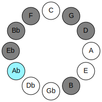 |  |
## Relative Modes

| Number | Mode | Luminosity | Tonic | Notes | Illustration |
|--------|------|------------|-------|-------|--------------|
| [2765](https://ianring.com/musictheory/scales/2765) | [Banian](ModeBanian.md) | -1 | G# | G#, A#, B, C##, D#, E#, F##, G# |  |
| [1715](https://ianring.com/musictheory/scales/1715) | [Aeronian](ModeAeronian.md) | 5 | A# | A#, B, C##, D#, E#, F##, G#, A# |  |
| [2905](https://ianring.com/musictheory/scales/2905) | [Palian](ModePalian.md) | -1 | B | B, C##, D#, E#, F##, G#, A#, B |  |
| [875](https://ianring.com/musictheory/scales/875) | [Stothian](ModeStothian.md) | -1 | D | D, Eb, F, G, Ab, Bb, Cb, D |  |
| [2485](https://ianring.com/musictheory/scales/2485) | [Aerorian](ModeAerorian.md) | 6 | D# | D#, E#, F##, G#, A#, B, C##, D# |  |
| [1645](https://ianring.com/musictheory/scales/1645) | [Katagian](ModeKatagian.md) | -1 | F | F, G, Ab, Bb, Cb, D, Eb, F |  |
| [1435](https://ianring.com/musictheory/scales/1435) | [Phronian](ModePhronian.md) | -1 | G | G, Ab, Bb, Cb, D, Eb, F, G |  |
## Relative Brightness

| Number | Mode | Luminosity | Tonic | Notes | Circle Of Fifth | Chromatic Circle |
|--------|------|------------|-------|-------|-----------------|------------------|
| [2765](https://ianring.com/musictheory/scales/2765) | [Banian](ModeBanian.md) | 7 | G# | G#, A#, B, C##, D#, E#, F##, G# |  | 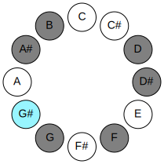 |
| [1715](https://ianring.com/musictheory/scales/1715) | [Aeronian](ModeAeronian.md) | -1 | A# | A#, B, C##, D#, E#, F##, G#, A# | 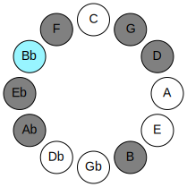 | 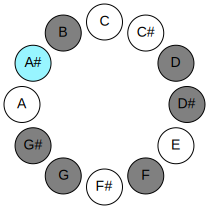 |
| [2905](https://ianring.com/musictheory/scales/2905) | [Palian](ModePalian.md) | -1 | B | B, C##, D#, E#, F##, G#, A#, B | 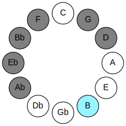 | 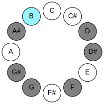 |
| [875](https://ianring.com/musictheory/scales/875) | [Stothian](ModeStothian.md) | 6 | D | D, Eb, F, G, Ab, Bb, Cb, D | 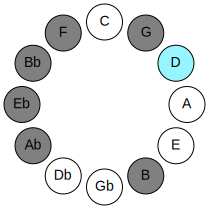 | 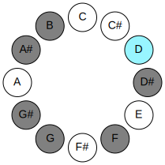 |
| [2485](https://ianring.com/musictheory/scales/2485) | [Aerorian](ModeAerorian.md) | 6 | D# | D#, E#, F##, G#, A#, B, C##, D# | 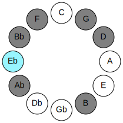 | 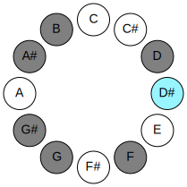 |
| [1645](https://ianring.com/musictheory/scales/1645) | [Katagian](ModeKatagian.md) | -1 | F | F, G, Ab, Bb, Cb, D, Eb, F | 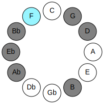 | 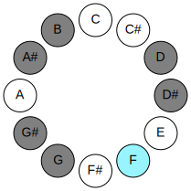 |
| [1435](https://ianring.com/musictheory/scales/1435) | [Phronian](ModePhronian.md) | 7 | G | G, Ab, Bb, Cb, D, Eb, F, G | 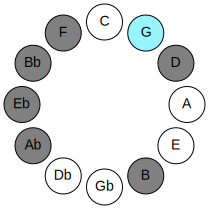 | 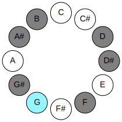 |

## Chords

### Ab

| Number | Root | Name | Notes | Illustration | Audio |
|--------|------|------|-------|--------------|-------|
| 1284 | Ab | [G#](ChordGSharpDiminishedFlatThird.md) | G#, Bb, D |  | [midi](ChordGSharpDiminishedFlatThirdRootPosition.mid) |
| 1284 | Ab | [G#sus2b5](ChordGSharpSuspendedSecondFlatFifth.md) | G#, A#, D |  | [midi](ChordGSharpSuspendedSecondFlatFifthRootPosition.mid) |
| 1284 | Ab | [Ab](ChordAFlatDiminishedFlatThird.md) | Ab, Cbb, Ebb |  | [midi](ChordAFlatDiminishedFlatThirdRootPosition.mid) |
| 1284 | Ab | [Absus2b5](ChordAFlatSuspendedSecondFlatFifth.md) | Ab, Bb, Ebb |  | [midi](ChordAFlatSuspendedSecondFlatFifthRootPosition.mid) |
| 2308 | Ab | [G#o](ChordGSharpDiminished.md) | G#, B, D |  | [midi](ChordGSharpDiminishedRootPosition.mid) |
| 2308 | Ab | [Abo](ChordAFlatDiminished.md) | Ab, Cb, Ebb |  | [midi](ChordAFlatDiminishedRootPosition.mid) |
| 264 | Ab | [G#5](ChordGSharpPowerChord.md) | G#, D# |  | [midi](ChordGSharpPowerChordRootPosition.mid) |
| 264 | Ab | [Ab5](ChordAFlatPowerChord.md) | Ab, Eb |  | [midi](ChordAFlatPowerChordRootPosition.mid) |
| 1288 | Ab | [G#sus2](ChordGSharpSuspendedSecond.md) | G#, A#, D# |  | [midi](ChordGSharpSuspendedSecondRootPosition.mid) |
| 1288 | Ab | [Absus2](ChordAFlatSuspendedSecond.md) | Ab, Bb, Eb |  | [midi](ChordAFlatSuspendedSecondRootPosition.mid) |
| 2312 | Ab | [G#m](ChordGSharpMinor.md) | G#, B, D# |  | [midi](ChordGSharpMinorRootPosition.mid) |
| 2312 | Ab | [G#m(add(#9))](ChordGSharpMinorAddSharpNinth.md) | G#, B, D#, A## |  | [midi](ChordGSharpMinorAddSharpNinthRootPosition.mid) |
| 2312 | Ab | [Abm](ChordAFlatMinor.md) | Ab, Cb, Eb |  | [midi](ChordAFlatMinorRootPosition.mid) |
| 2312 | Ab | [Abm(add(#9))](ChordAFlatMinorAddSharpNinth.md) | Ab, Cb, Eb, B |  | [midi](ChordAFlatMinorAddSharpNinthRootPosition.mid) |
| 3336 | Ab | [G#m(add9)](ChordGSharpMinorAddNinth.md) | G#, B, D#, A# |  | [midi](ChordGSharpMinorAddNinthRootPosition.mid) |
| 3336 | Ab | [Abm(add9)](ChordAFlatMinorAddNinth.md) | Ab, Cb, Eb, Bb |  | [midi](ChordAFlatMinorAddNinthRootPosition.mid) |
| 268 | Ab | [G#lyd](ChordGSharpLydian.md) | G#, C##, D# |  | [midi](ChordGSharpLydianRootPosition.mid) |
| 268 | Ab | [Ablyd](ChordAFlatLydian.md) | Ab, D, Eb |  | [midi](ChordAFlatLydianRootPosition.mid) |
| 2316 | Ab | [G#m(add(#4))](ChordGSharpMinorAddSharpFourth.md) | G#, B, C##, D# |  | [midi](ChordGSharpMinorAddSharpFourthRootPosition.mid) |
| 2316 | Ab | [Abm(add(#4))](ChordAFlatMinorAddSharpFourth.md) | Ab, Cb, D, Eb |  | [midi](ChordAFlatMinorAddSharpFourthRootPosition.mid) |
| 1316 | Ab | [G#M6sus2b5](ChordGSharpMajorSixthSuspendedSecondFlatFifth.md) | G#, A#, D, E# |  | [midi](ChordGSharpMajorSixthSuspendedSecondFlatFifthRootPosition.mid) |
| 1316 | Ab | [AbM6sus2b5](ChordAFlatMajorSixthSuspendedSecondFlatFifth.md) | Ab, Bb, Ebb, F |  | [midi](ChordAFlatMajorSixthSuspendedSecondFlatFifthRootPosition.mid) |
| 2340 | Ab | [G#o7](ChordGSharpFullDiminishedSeventh.md) | G#, B, D, F |  | [midi](ChordGSharpFullDiminishedSeventhRootPosition.mid) |
| 2340 | Ab | [Abo7](ChordAFlatFullDiminishedSeventh.md) | Ab, Cb, Ebb, Gbb |  | [midi](ChordAFlatFullDiminishedSeventhRootPosition.mid) |
| 1320 | Ab | [G#M6sus2](ChordGSharpMajorSixthSuspendedSecond.md) | G#, A#, D#, E# |  | [midi](ChordGSharpMajorSixthSuspendedSecondRootPosition.mid) |
| 1320 | Ab | [G#7sus2b5](ChordGSharpDominantSeventhSuspendedSecondFlatFifth.md) | G#, A#, D#, F |  | [midi](ChordGSharpDominantSeventhSuspendedSecondFlatFifthRootPosition.mid) |
| 1320 | Ab | [AbM6sus2](ChordAFlatMajorSixthSuspendedSecond.md) | Ab, Bb, Eb, F |  | [midi](ChordAFlatMajorSixthSuspendedSecondRootPosition.mid) |
| 1320 | Ab | [Ab7sus2b5](ChordAFlatDominantSeventhSuspendedSecondFlatFifth.md) | Ab, Bb, Eb, Gbb |  | [midi](ChordAFlatDominantSeventhSuspendedSecondFlatFifthRootPosition.mid) |
| 2344 | Ab | [G#m6](ChordGSharpMinorSixth.md) | G#, B, D#, E# |  | [midi](ChordGSharpMinorSixthRootPosition.mid) |
| 2344 | Ab | [Abm6](ChordAFlatMinorSixth.md) | Ab, Cb, Eb, F |  | [midi](ChordAFlatMinorSixthRootPosition.mid) |
| 3368 | Ab | [G#m6(add9)](ChordGSharpMinorSixthAddNinth.md) | G#, B, D#, E#, A# |  | [midi](ChordGSharpMinorSixthAddNinthRootPosition.mid) |
| 3368 | Ab | [Abm6(add9)](ChordAFlatMinorSixthAddNinth.md) | Ab, Cb, Eb, F, Bb |  | [midi](ChordAFlatMinorSixthAddNinthRootPosition.mid) |
| 2436 | Ab | [G#oM7](ChordGSharpDiminishedMajorSeventh.md) | G#, B, D, F## |  | [midi](ChordGSharpDiminishedMajorSeventhRootPosition.mid) |
| 2436 | Ab | [AboM7](ChordAFlatDiminishedMajorSeventh.md) | Ab, Cb, Ebb, G |  | [midi](ChordAFlatDiminishedMajorSeventhRootPosition.mid) |
| 1416 | Ab | [G#M7(sus2)](ChordGSharpMajorSeventhSuspendedSecond.md) | G#, A#, D#, F## |  | [midi](ChordGSharpMajorSeventhSuspendedSecondRootPosition.mid) |
| 1416 | Ab | [G#M9sus2](ChordGSharpMajorNinthSuspendedSecond.md) | G#, A#, D#, F##, A# |  | [midi](ChordGSharpMajorNinthSuspendedSecondRootPosition.mid) |
| 1416 | Ab | [AbM7(sus2)](ChordAFlatMajorSeventhSuspendedSecond.md) | Ab, Bb, Eb, G |  | [midi](ChordAFlatMajorSeventhSuspendedSecondRootPosition.mid) |
| 1416 | Ab | [AbM9sus2](ChordAFlatMajorNinthSuspendedSecond.md) | Ab, Bb, Eb, G, Bb |  | [midi](ChordAFlatMajorNinthSuspendedSecondRootPosition.mid) |
| 2440 | Ab | [G#m(M7)](ChordGSharpMinorMajorSeventh.md) | G#, B, D#, F## |  | [midi](ChordGSharpMinorMajorSeventhRootPosition.mid) |
| 2440 | Ab | [Abm(M7)](ChordAFlatMinorMajorSeventh.md) | Ab, Cb, Eb, G |  | [midi](ChordAFlatMinorMajorSeventhRootPosition.mid) |
| 3464 | Ab | [G#m(M9)](ChordGSharpMinorMajorNinth.md) | G#, B, D#, F##, A# |  | [midi](ChordGSharpMinorMajorNinthRootPosition.mid) |
| 3464 | Ab | [Abm(M9)](ChordAFlatMinorMajorNinth.md) | Ab, Cb, Eb, G, Bb |  | [midi](ChordAFlatMinorMajorNinthRootPosition.mid) |
| 396 | Ab | [G#lyd(M7)](ChordGSharpLydianMajorSeventh.md) | G#, C##, D#, F## |  | [midi](ChordGSharpLydianMajorSeventhRootPosition.mid) |
| 396 | Ab | [Ablyd(M7)](ChordAFlatLydianMajorSeventh.md) | Ab, D, Eb, G |  | [midi](ChordAFlatLydianMajorSeventhRootPosition.mid) |
| 2472 | Ab | [G#m(M7)add13](ChordGSharpMinorMajorSeventhAddThirteenth.md) | G#, B, D#, F##, E# |  | [midi](ChordGSharpMinorMajorSeventhAddThirteenthRootPosition.mid) |
| 2472 | Ab | [Abm(M7)add13](ChordAFlatMinorMajorSeventhAddThirteenth.md) | Ab, Cb, Eb, G, F |  | [midi](ChordAFlatMinorMajorSeventhAddThirteenthRootPosition.mid) |

### Bb

| Number | Root | Name | Notes | Illustration | Audio |
|--------|------|------|-------|--------------|-------|
| 1056 | Bb | [A#5](ChordASharpPowerChord.md) | A#, E# |  | [midi](ChordASharpPowerChordRootPosition.mid) |
| 1056 | Bb | [Bb5](ChordBFlatPowerChord.md) | Bb, F |  | [midi](ChordBFlatPowerChordRootPosition.mid) |
| 3104 | Bb | [A#phryg](ChordASharpPhrygian.md) | A#, B, E# |  | [midi](ChordASharpPhrygianRootPosition.mid) |
| 3104 | Bb | [Bbphryg](ChordBFlatPhrygian.md) | Bb, Cb, F |  | [midi](ChordBFlatPhrygianRootPosition.mid) |
| 1060 | Bb | [A#M](ChordASharpMajor.md) | A#, C##, E# |  | [midi](ChordASharpMajorRootPosition.mid) |
| 1060 | Bb | [BbM](ChordBFlatMajor.md) | Bb, D, F |  | [midi](ChordBFlatMajorRootPosition.mid) |
| 1064 | Bb | [A#sus4](ChordASharpSuspendedFourth.md) | A#, D#, E# |  | [midi](ChordASharpSuspendedFourthRootPosition.mid) |
| 1064 | Bb | [Bbsus4](ChordBFlatSuspendedFourth.md) | Bb, Eb, F |  | [midi](ChordBFlatSuspendedFourthRootPosition.mid) |
| 1068 | Bb | [A#M(add11)](ChordASharpMajorAddEleventh.md) | A#, C##, E#, D# |  | [midi](ChordASharpMajorAddEleventhRootPosition.mid) |
| 1068 | Bb | [A#M(add4)](ChordASharpMajorAddFourth.md) | A#, C##, D#, E# |  | [midi](ChordASharpMajorAddFourthRootPosition.mid) |
| 1068 | Bb | [BbM(add11)](ChordBFlatMajorAddEleventh.md) | Bb, D, F, Eb |  | [midi](ChordBFlatMajorAddEleventhRootPosition.mid) |
| 1068 | Bb | [BbM(add4)](ChordBFlatMajorAddFourth.md) | Bb, D, Eb, F |  | [midi](ChordBFlatMajorAddFourthRootPosition.mid) |
| 1156 | Bb | [A#M##5](ChordASharpMajorDoubleSharpFifth.md) | A#, C##, F## |  | [midi](ChordASharpMajorDoubleSharpFifthRootPosition.mid) |
| 1156 | Bb | [BbM##5](ChordBFlatMajorDoubleSharpFifth.md) | Bb, D, G |  | [midi](ChordBFlatMajorDoubleSharpFifthRootPosition.mid) |
| 1160 | Bb | [A#sus4##5](ChordASharpSuspendedFourthDoubleSharpFifth.md) | A#, D#, F## |  | [midi](ChordASharpSuspendedFourthDoubleSharpFifthRootPosition.mid) |
| 1160 | Bb | [Bbsus4##5](ChordBFlatSuspendedFourthDoubleSharpFifth.md) | Bb, Eb, G |  | [midi](ChordBFlatSuspendedFourthDoubleSharpFifthRootPosition.mid) |
| 1188 | Bb | [A#M6](ChordASharpMajorSixth.md) | A#, C##, E#, F## |  | [midi](ChordASharpMajorSixthRootPosition.mid) |
| 1188 | Bb | [BbM6](ChordBFlatMajorSixth.md) | Bb, D, F, G |  | [midi](ChordBFlatMajorSixthRootPosition.mid) |
| 3236 | Bb | [A#M6(addb9)](ChordASharpMajorSixthAddFlatNinth.md) | A#, C##, E#, F##, B |  | [midi](ChordASharpMajorSixthAddFlatNinthRootPosition.mid) |
| 3236 | Bb | [BbM6(addb9)](ChordBFlatMajorSixthAddFlatNinth.md) | Bb, D, F, G, Cb |  | [midi](ChordBFlatMajorSixthAddFlatNinthRootPosition.mid) |
| 1192 | Bb | [A#M6sus4](ChordASharpMajorSixthSuspendedFourth.md) | A#, D#, E#, F## |  | [midi](ChordASharpMajorSixthSuspendedFourthRootPosition.mid) |
| 1192 | Bb | [BbM6sus4](ChordBFlatMajorSixthSuspendedFourth.md) | Bb, Eb, F, G |  | [midi](ChordBFlatMajorSixthSuspendedFourthRootPosition.mid) |
| 1288 | Bb | [A#Q](ChordASharpQuartal.md) | A#, D#, G# |  | [midi](ChordASharpQuartalRootPosition.mid) |
| 1288 | Bb | [BbQ](ChordBFlatQuartal.md) | Bb, Eb, Ab |  | [midi](ChordBFlatQuartalRootPosition.mid) |
| 1316 | Bb | [A#7](ChordASharpDominantSeventh.md) | A#, C##, E#, G# |  | [midi](ChordASharpDominantSeventhRootPosition.mid) |
| 1316 | Bb | [Bb7](ChordBFlatDominantSeventh.md) | Bb, D, F, Ab |  | [midi](ChordBFlatDominantSeventhRootPosition.mid) |
| 3364 | Bb | [A#7b9](ChordASharpDominantSeventhFlatNinth.md) | A#, C##, E#, G#, B |  | [midi](ChordASharpDominantSeventhFlatNinthRootPosition.mid) |
| 3364 | Bb | [Bb7b9](ChordBFlatDominantSeventhFlatNinth.md) | Bb, D, F, Ab, Cb |  | [midi](ChordBFlatDominantSeventhFlatNinthRootPosition.mid) |
| 1320 | Bb | [A#7sus4](ChordASharpDominantSeventhSuspendedFourth.md) | A#, D#, E#, G# |  | [midi](ChordASharpDominantSeventhSuspendedFourthRootPosition.mid) |
| 1320 | Bb | [Bb7sus4](ChordBFlatDominantSeventhSuspendedFourth.md) | Bb, Eb, F, Ab |  | [midi](ChordBFlatDominantSeventhSuspendedFourthRootPosition.mid) |
| 1324 | Bb | [A#7add4](ChordASharpDominantSeventhAddFourth.md) | A#, C##, D#, E#, G# |  | [midi](ChordASharpDominantSeventhAddFourthRootPosition.mid) |
| 1324 | Bb | [A#7add11](ChordASharpDominantSeventhAddEleventh.md) | A#, C##, E#, G#, D# |  | [midi](ChordASharpDominantSeventhAddEleventhRootPosition.mid) |
| 1324 | Bb | [Bb7add4](ChordBFlatDominantSeventhAddFourth.md) | Bb, D, Eb, F, Ab |  | [midi](ChordBFlatDominantSeventhAddFourthRootPosition.mid) |
| 1324 | Bb | [Bb7add11](ChordBFlatDominantSeventhAddEleventh.md) | Bb, D, F, Ab, Eb |  | [midi](ChordBFlatDominantSeventhAddEleventhRootPosition.mid) |
| 1444 | Bb | [A#7add13](ChordASharpDominantSeventhAddThirteenth.md) | A#, C##, E#, G#, F## |  | [midi](ChordASharpDominantSeventhAddThirteenthRootPosition.mid) |
| 1444 | Bb | [Bb7add13](ChordBFlatDominantSeventhAddThirteenth.md) | Bb, D, F, Ab, G |  | [midi](ChordBFlatDominantSeventhAddThirteenthRootPosition.mid) |
| 3500 | Bb | [A#13b9](ChordASharpDominantThirteenthFlatNinth.md) | A#, C##, E#, G#, B, D#, F## |  | [midi](ChordASharpDominantThirteenthFlatNinthRootPosition.mid) |
| 3500 | Bb | [Bb13b9](ChordBFlatDominantThirteenthFlatNinth.md) | Bb, D, F, Ab, Cb, Eb, G |  | [midi](ChordBFlatDominantThirteenthFlatNinthRootPosition.mid) |

### Cb

| Number | Root | Name | Notes | Illustration | Audio |
|--------|------|------|-------|--------------|-------|
| 2084 | Cb | [Bo](ChordBNaturalDiminished.md) | B, D, F |  | [midi](ChordBNaturalDiminishedRootPosition.mid) |
| 2088 | Cb | [BMb5](ChordBNaturalMajorFlatFifth.md) | B, D#, F |  | [midi](ChordBNaturalMajorFlatFifthRootPosition.mid) |
| 2180 | Cb | [Bm#5](ChordBNaturalMinorSharpFifth.md) | B, D, G |  | [midi](ChordBNaturalMinorSharpFifthRootPosition.mid) |
| 2184 | Cb | [B+](ChordBNaturalAugmented.md) | B, D#, F## |  | [midi](ChordBNaturalAugmentedRootPosition.mid) |
| 2184 | Cb | [B+7](ChordBNaturalAugmentedAugmentedSeventh.md) | B, D#, F##, A## |  | [midi](ChordBNaturalAugmentedAugmentedSeventhRootPosition.mid) |
| 2312 | Cb | [BM##5](ChordBNaturalMajorDoubleSharpFifth.md) | B, D#, G# |  | [midi](ChordBNaturalMajorDoubleSharpFifthRootPosition.mid) |
| 2340 | Cb | [Bo7](ChordBNaturalFullDiminishedSeventh.md) | B, D, F, Ab |  | [midi](ChordBNaturalFullDiminishedSeventhRootPosition.mid) |
| 2344 | Cb | [BM6b5](ChordBNaturalMajorSixthFlatFifth.md) | B, D#, F, G# |  | [midi](ChordBNaturalMajorSixthFlatFifthRootPosition.mid) |
| 3108 | Cb | [BoM7](ChordBNaturalDiminishedMajorSeventh.md) | B, D, F, A# |  | [midi](ChordBNaturalDiminishedMajorSeventhRootPosition.mid) |
| 3112 | Cb | [BM7b5](ChordBNaturalMajorSeventhFlatFifth.md) | B, D#, F, A# |  | [midi](ChordBNaturalMajorSeventhFlatFifthRootPosition.mid) |
| 3208 | Cb | [B+(M7)](ChordBNaturalAugmentedMajorSeventh.md) | B, D#, F##, A# |  | [midi](ChordBNaturalAugmentedMajorSeventhRootPosition.mid) |
| 3336 | Cb | [BM7##5](ChordBNaturalMajorSeventhDoubleSharpFifth.md) | B, D#, G#, A# |  | [midi](ChordBNaturalMajorSeventhDoubleSharpFifthRootPosition.mid) |

### D

| Number | Root | Name | Notes | Illustration | Audio |
|--------|------|------|-------|--------------|-------|
| 164 | D | [Dmbb5](ChordDNaturalMinorDoubleFlatFifth.md) | D, F, G |  | [midi](ChordDNaturalMinorDoubleFlatFifthRootPosition.mid) |
| 268 | D | [Dloc](ChordDNaturalLocrian.md) | D, Eb, Ab |  | [midi](ChordDNaturalLocrianRootPosition.mid) |
| 292 | D | [Do](ChordDNaturalDiminished.md) | D, F, Ab |  | [midi](ChordDNaturalDiminishedRootPosition.mid) |
| 388 | D | [Dsus4b5](ChordDNaturalSuspendedFourthFlatFifth.md) | D, G, Ab |  | [midi](ChordDNaturalSuspendedFourthFlatFifthRootPosition.mid) |
| 1060 | D | [Dm#5](ChordDNaturalMinorSharpFifth.md) | D, F, Bb |  | [midi](ChordDNaturalMinorSharpFifthRootPosition.mid) |
| 1156 | D | [Dsus4#5](ChordDNaturalSuspendedFourthSharpFifth.md) | D, G, A# |  | [midi](ChordDNaturalSuspendedFourthSharpFifthRootPosition.mid) |
| 2180 | D | [Dsus4##5](ChordDNaturalSuspendedFourthDoubleSharpFifth.md) | D, G, B |  | [midi](ChordDNaturalSuspendedFourthDoubleSharpFifthRootPosition.mid) |
| 2340 | D | [Do7](ChordDNaturalFullDiminishedSeventh.md) | D, F, Ab, Cb |  | [midi](ChordDNaturalFullDiminishedSeventhRootPosition.mid) |

### Eb

| Number | Root | Name | Notes | Illustration | Audio |
|--------|------|------|-------|--------------|-------|
| 296 | Eb | [D#sus2bb5](ChordDSharpSuspendedSecondDoubleFlatFifth.md) | D#, E#, G# |  | [midi](ChordDSharpSuspendedSecondDoubleFlatFifthRootPosition.mid) |
| 296 | Eb | [Ebsus2bb5](ChordEFlatSuspendedSecondDoubleFlatFifth.md) | Eb, F, Ab |  | [midi](ChordEFlatSuspendedSecondDoubleFlatFifthRootPosition.mid) |
| 1032 | Eb | [D#5](ChordDSharpPowerChord.md) | D#, A# |  | [midi](ChordDSharpPowerChordRootPosition.mid) |
| 1032 | Eb | [Eb5](ChordEFlatPowerChord.md) | Eb, Bb |  | [midi](ChordEFlatPowerChordRootPosition.mid) |
| 1064 | Eb | [D#sus2](ChordDSharpSuspendedSecond.md) | D#, E#, A# |  | [midi](ChordDSharpSuspendedSecondRootPosition.mid) |
| 1064 | Eb | [Ebsus2](ChordEFlatSuspendedSecond.md) | Eb, F, Bb |  | [midi](ChordEFlatSuspendedSecondRootPosition.mid) |
| 1160 | Eb | [D#M](ChordDSharpMajor.md) | D#, F##, A# |  | [midi](ChordDSharpMajorRootPosition.mid) |
| 1160 | Eb | [EbM](ChordEFlatMajor.md) | Eb, G, Bb |  | [midi](ChordEFlatMajorRootPosition.mid) |
| 1192 | Eb | [D#M(add9)](ChordDSharpMajorAddNinth.md) | D#, F##, A#, E# |  | [midi](ChordDSharpMajorAddNinthRootPosition.mid) |
| 1192 | Eb | [EbM(add9)](ChordEFlatMajorAddNinth.md) | Eb, G, Bb, F |  | [midi](ChordEFlatMajorAddNinthRootPosition.mid) |
| 1288 | Eb | [D#sus4](ChordDSharpSuspendedFourth.md) | D#, G#, A# |  | [midi](ChordDSharpSuspendedFourthRootPosition.mid) |
| 1288 | Eb | [Ebsus4](ChordEFlatSuspendedFourth.md) | Eb, Ab, Bb |  | [midi](ChordEFlatSuspendedFourthRootPosition.mid) |
| 1416 | Eb | [D#M(add11)](ChordDSharpMajorAddEleventh.md) | D#, F##, A#, G# |  | [midi](ChordDSharpMajorAddEleventhRootPosition.mid) |
| 1416 | Eb | [D#M(add4)](ChordDSharpMajorAddFourth.md) | D#, F##, G#, A# |  | [midi](ChordDSharpMajorAddFourthRootPosition.mid) |
| 1416 | Eb | [EbM(add11)](ChordEFlatMajorAddEleventh.md) | Eb, G, Bb, Ab |  | [midi](ChordEFlatMajorAddEleventhRootPosition.mid) |
| 1416 | Eb | [EbM(add4)](ChordEFlatMajorAddFourth.md) | Eb, G, Ab, Bb |  | [midi](ChordEFlatMajorAddFourthRootPosition.mid) |
| 2088 | Eb | [D#sus2#5](ChordDSharpSuspendedSecondSharpFifth.md) | D#, E#, A## |  | [midi](ChordDSharpSuspendedSecondSharpFifthRootPosition.mid) |
| 2088 | Eb | [Ebsus2#5](ChordEFlatSuspendedSecondSharpFifth.md) | Eb, F, B |  | [midi](ChordEFlatSuspendedSecondSharpFifthRootPosition.mid) |
| 2184 | Eb | [D#+](ChordDSharpAugmented.md) | D#, F##, A## |  | [midi](ChordDSharpAugmentedRootPosition.mid) |
| 2184 | Eb | [D#+7](ChordDSharpAugmentedAugmentedSeventh.md) | D#, F##, A##, C### |  | [midi](ChordDSharpAugmentedAugmentedSeventhRootPosition.mid) |
| 2184 | Eb | [Eb+](ChordEFlatAugmented.md) | Eb, G, B |  | [midi](ChordEFlatAugmentedRootPosition.mid) |
| 2184 | Eb | [Eb+7](ChordEFlatAugmentedAugmentedSeventh.md) | Eb, G, B, D# |  | [midi](ChordEFlatAugmentedAugmentedSeventhRootPosition.mid) |
| 2312 | Eb | [D#sus4#5](ChordDSharpSuspendedFourthSharpFifth.md) | D#, G#, A## |  | [midi](ChordDSharpSuspendedFourthSharpFifthRootPosition.mid) |
| 2312 | Eb | [Ebsus4#5](ChordEFlatSuspendedFourthSharpFifth.md) | Eb, Ab, B |  | [midi](ChordEFlatSuspendedFourthSharpFifthRootPosition.mid) |
| 268 | Eb | [D#Q+](ChordDSharpQuartalAugmented.md) | D#, G#, C## |  | [midi](ChordDSharpQuartalAugmentedRootPosition.mid) |
| 268 | Eb | [EbQ+](ChordEFlatQuartalAugmented.md) | Eb, Ab, D |  | [midi](ChordEFlatQuartalAugmentedRootPosition.mid) |
| 1068 | Eb | [D#M7(sus2)](ChordDSharpMajorSeventhSuspendedSecond.md) | D#, E#, A#, C## |  | [midi](ChordDSharpMajorSeventhSuspendedSecondRootPosition.mid) |
| 1068 | Eb | [D#M9sus2](ChordDSharpMajorNinthSuspendedSecond.md) | D#, E#, A#, C##, E# |  | [midi](ChordDSharpMajorNinthSuspendedSecondRootPosition.mid) |
| 1068 | Eb | [EbM7(sus2)](ChordEFlatMajorSeventhSuspendedSecond.md) | Eb, F, Bb, D |  | [midi](ChordEFlatMajorSeventhSuspendedSecondRootPosition.mid) |
| 1068 | Eb | [EbM9sus2](ChordEFlatMajorNinthSuspendedSecond.md) | Eb, F, Bb, D, F |  | [midi](ChordEFlatMajorNinthSuspendedSecondRootPosition.mid) |
| 1164 | Eb | [D#M7](ChordDSharpMajorSeventh.md) | D#, F##, A#, C## |  | [midi](ChordDSharpMajorSeventhRootPosition.mid) |
| 1164 | Eb | [EbM7](ChordEFlatMajorSeventh.md) | Eb, G, Bb, D |  | [midi](ChordEFlatMajorSeventhRootPosition.mid) |
| 1196 | Eb | [D#M9](ChordDSharpMajorNinth.md) | D#, F##, A#, C##, E# |  | [midi](ChordDSharpMajorNinthRootPosition.mid) |
| 1196 | Eb | [EbM9](ChordEFlatMajorNinth.md) | Eb, G, Bb, D, F |  | [midi](ChordEFlatMajorNinthRootPosition.mid) |
| 1292 | Eb | [D#M7(sus4)](ChordDSharpMajorSeventhSuspendedFourth.md) | D#, G#, A#, C## |  | [midi](ChordDSharpMajorSeventhSuspendedFourthRootPosition.mid) |
| 1292 | Eb | [EbM7(sus4)](ChordEFlatMajorSeventhSuspendedFourth.md) | Eb, Ab, Bb, D |  | [midi](ChordEFlatMajorSeventhSuspendedFourthRootPosition.mid) |
| 1324 | Eb | [D#M9sus4](ChordDSharpMajorNinthSuspendedFourth.md) | D#, G#, A#, C##, E# |  | [midi](ChordDSharpMajorNinthSuspendedFourthRootPosition.mid) |
| 1324 | Eb | [EbM9sus4](ChordEFlatMajorNinthSuspendedFourth.md) | Eb, Ab, Bb, D, F |  | [midi](ChordEFlatMajorNinthSuspendedFourthRootPosition.mid) |
| 1420 | Eb | [D#M7add4](ChordDSharpMajorSeventhAddFourth.md) | D#, F##, G#, A#, C## |  | [midi](ChordDSharpMajorSeventhAddFourthRootPosition.mid) |
| 1420 | Eb | [D#M7add11](ChordDSharpMajorSeventhAddEleventh.md) | D#, F##, A#, C##, G# |  | [midi](ChordDSharpMajorSeventhAddEleventhRootPosition.mid) |
| 1420 | Eb | [EbM7add4](ChordEFlatMajorSeventhAddFourth.md) | Eb, G, Ab, Bb, D |  | [midi](ChordEFlatMajorSeventhAddFourthRootPosition.mid) |
| 1420 | Eb | [EbM7add11](ChordEFlatMajorSeventhAddEleventh.md) | Eb, G, Bb, D, Ab |  | [midi](ChordEFlatMajorSeventhAddEleventhRootPosition.mid) |
| 1452 | Eb | [D#M11](ChordDSharpMajorEleventh.md) | D#, F##, A#, C##, E#, G# |  | [midi](ChordDSharpMajorEleventhRootPosition.mid) |
| 1452 | Eb | [EbM11](ChordEFlatMajorEleventh.md) | Eb, G, Bb, D, F, Ab |  | [midi](ChordEFlatMajorEleventhRootPosition.mid) |
| 2188 | Eb | [D#+(M7)](ChordDSharpAugmentedMajorSeventh.md) | D#, F##, A##, C## |  | [midi](ChordDSharpAugmentedMajorSeventhRootPosition.mid) |
| 2188 | Eb | [Eb+(M7)](ChordEFlatAugmentedMajorSeventh.md) | Eb, G, B, D |  | [midi](ChordEFlatAugmentedMajorSeventhRootPosition.mid) |
| 2316 | Eb | [D#M7(sus4)#5](ChordDSharpMajorSeventhSuspendedFourthSharpFifth.md) | D#, G#, A##, C## |  | [midi](ChordDSharpMajorSeventhSuspendedFourthSharpFifthRootPosition.mid) |
| 2316 | Eb | [EbM7(sus4)#5](ChordEFlatMajorSeventhSuspendedFourthSharpFifth.md) | Eb, Ab, B, D |  | [midi](ChordEFlatMajorSeventhSuspendedFourthSharpFifthRootPosition.mid) |

### F

| Number | Root | Name | Notes | Illustration | Audio |
|--------|------|------|-------|--------------|-------|
| 1184 | F | [Fsus2bb5](ChordFNaturalSuspendedSecondDoubleFlatFifth.md) | F, G, Bb |  | [midi](ChordFNaturalSuspendedSecondDoubleFlatFifthRootPosition.mid) |
| 1312 | F | [Fmbb5](ChordFNaturalMinorDoubleFlatFifth.md) | F, Ab, Bb |  | [midi](ChordFNaturalMinorDoubleFlatFifthRootPosition.mid) |
| 2208 | F | [F](ChordFNaturalDiminishedFlatThird.md) | F, Abb, Cb |  | [midi](ChordFNaturalDiminishedFlatThirdRootPosition.mid) |
| 2208 | F | [Fsus2b5](ChordFNaturalSuspendedSecondFlatFifth.md) | F, G, Cb |  | [midi](ChordFNaturalSuspendedSecondFlatFifthRootPosition.mid) |
| 2336 | F | [Fo](ChordFNaturalDiminished.md) | F, Ab, Cb |  | [midi](ChordFNaturalDiminishedRootPosition.mid) |
| 3104 | F | [Fsus4b5](ChordFNaturalSuspendedFourthFlatFifth.md) | F, Bb, Cb |  | [midi](ChordFNaturalSuspendedFourthFlatFifthRootPosition.mid) |
| 1060 | F | [Fsus4##5](ChordFNaturalSuspendedFourthDoubleSharpFifth.md) | F, Bb, D |  | [midi](ChordFNaturalSuspendedFourthDoubleSharpFifthRootPosition.mid) |
| 1188 | F | [FM6sus2bb5](ChordFNaturalMajorSixthSuspendedSecondDoubleFlatFifth.md) | F, G, Bb, D |  | [midi](ChordFNaturalMajorSixthSuspendedSecondDoubleFlatFifthRootPosition.mid) |
| 2212 | F | [FM6sus2b5](ChordFNaturalMajorSixthSuspendedSecondFlatFifth.md) | F, G, Cb, D |  | [midi](ChordFNaturalMajorSixthSuspendedSecondFlatFifthRootPosition.mid) |
| 2340 | F | [Fo7](ChordFNaturalFullDiminishedSeventh.md) | F, Ab, Cb, Ebb |  | [midi](ChordFNaturalFullDiminishedSeventhRootPosition.mid) |
| 1064 | F | [FQ](ChordFNaturalQuartal.md) | F, Bb, Eb |  | [midi](ChordFNaturalQuartalRootPosition.mid) |
| 1320 | F | [Fm7bb5](ChordFNaturalMinorSeventhDoubleFlatFifth.md) | F, Ab, Bb, Eb |  | [midi](ChordFNaturalMinorSeventhDoubleFlatFifthRootPosition.mid) |
| 2344 | F | [Fø7](ChordFNaturalHalfDiminishedSeventh.md) | F, Ab, Cb, Eb |  | [midi](ChordFNaturalHalfDiminishedSeventhRootPosition.mid) |

### G

| Number | Root | Name | Notes | Illustration | Audio |
|--------|------|------|-------|--------------|-------|
| 132 | G | [G5](ChordGNaturalPowerChord.md) | G, D |  | [midi](ChordGNaturalPowerChordRootPosition.mid) |
| 388 | G | [Gphryg](ChordGNaturalPhrygian.md) | G, Ab, D |  | [midi](ChordGNaturalPhrygianRootPosition.mid) |
| 1156 | G | [Gm](ChordGNaturalMinor.md) | G, Bb, D |  | [midi](ChordGNaturalMinorRootPosition.mid) |
| 1156 | G | [Gm(add(#9))](ChordGNaturalMinorAddSharpNinth.md) | G, Bb, D, A# |  | [midi](ChordGNaturalMinorAddSharpNinthRootPosition.mid) |
| 2180 | G | [GM](ChordGNaturalMajor.md) | G, B, D |  | [midi](ChordGNaturalMajorRootPosition.mid) |
| 3204 | G | [GM(add(#9))](ChordGNaturalMajorAddSharpNinth.md) | G, B, D, A# |  | [midi](ChordGNaturalMajorAddSharpNinthRootPosition.mid) |
| 1160 | G | [Gm#5](ChordGNaturalMinorSharpFifth.md) | G, Bb, Eb |  | [midi](ChordGNaturalMinorSharpFifthRootPosition.mid) |
| 2184 | G | [G+](ChordGNaturalAugmented.md) | G, B, D# |  | [midi](ChordGNaturalAugmentedRootPosition.mid) |
| 2184 | G | [G+7](ChordGNaturalAugmentedAugmentedSeventh.md) | G, B, D#, F## |  | [midi](ChordGNaturalAugmentedAugmentedSeventhRootPosition.mid) |
| 1188 | G | [Gm7](ChordGNaturalMinorSeventh.md) | G, Bb, D, F |  | [midi](ChordGNaturalMinorSeventhRootPosition.mid) |
| 1444 | G | [Gm7b9](ChordGNaturalMinorSeventhFlatNinth.md) | G, Bb, D, F, Ab |  | [midi](ChordGNaturalMinorSeventhFlatNinthRootPosition.mid) |
| 2212 | G | [G7](ChordGNaturalDominantSeventh.md) | G, B, D, F |  | [midi](ChordGNaturalDominantSeventhRootPosition.mid) |
| 2468 | G | [G7b9](ChordGNaturalDominantSeventhFlatNinth.md) | G, B, D, F, Ab |  | [midi](ChordGNaturalDominantSeventhFlatNinthRootPosition.mid) |
| 3236 | G | [G7#9](ChordGNaturalDominantSeventhSharpNinth.md) | G, B, D, F, A# |  | [midi](ChordGNaturalDominantSeventhSharpNinthRootPosition.mid) |
| 1192 | G | [Gm7#5](ChordGNaturalMinorSeventhSharpFifth.md) | G, Bb, D#, F |  | [midi](ChordGNaturalMinorSeventhSharpFifthRootPosition.mid) |
| 2472 | G | [G7#5b9](ChordGNaturalDominantSeventhSharpFifthFlatNinth.md) | G, B, D#, F, Ab |  | [midi](ChordGNaturalDominantSeventhSharpFifthFlatNinthRootPosition.mid) |
| 2476 | G | [G7b9b13](ChordGNaturalDominantSeventhFlatNinthFlatThirteenth.md) | G, B, D, F, Ab, Eb |  | [midi](ChordGNaturalDominantSeventhFlatNinthFlatThirteenthRootPosition.mid) |

