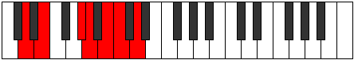

# Mode AFlatBarimic

## Links

- [Documentation](index.md)
- [Scales Index](Scales.md)
- [Modes Index](Modes.md)
- [Chords Index](Chords.md)

## Scale

[Modimic](ScaleModimic.md)

## Mode

[AFlatBarimic](ModeAFlatBarimic.md)

## Tonic

Ab

## Signature

[CNaturalMajor]

## Perfection

 - 3 Perfect Notes

 - 3 Imperfect Notes

## Notes

- Ab (Imperfect)
- Bbb
- Cb (Imperfect)
- Dbb (Imperfect)
- Ebb
- Fb
- Ab (Imperfect)

## Illustration

## Relative Modes

| Number | Mode | Tonic | Notes | Illustration |
|--------|------|-------|-------|--------------|
| [347](https://ianring.com/musictheory/scales/347) | [Barimic](ModeBarimic.md) | G# | G#, A, B, C, D, E, G# |  |
| [347](https://ianring.com/musictheory/scales/347) | [Barimic](ModeBarimic.md) | Ab | Ab, Bbb, Cb, Dbb, Ebb, Fb, Ab |  |
| [1457](https://ianring.com/musictheory/scales/1457) | [Modimic](ModeModimic.md) | E | E, F###, G##, A##, B#, C##, E |  |
| [1579](https://ianring.com/musictheory/scales/1579) | [Sagimic](ModeSagimic.md) | B | B, C, D, E, F###, G##, B |  |
| [1733](https://ianring.com/musictheory/scales/1733) | [Socrimic](ModeSocrimic.md) | D | D, E, F###, G##, A##, B#, D |  |
| [2221](https://ianring.com/musictheory/scales/2221) | [Poptimic](ModePoptimic.md) | A | A, B, C, D, E, F###, A |  |
| [2837](https://ianring.com/musictheory/scales/2837) | [Aelothimic](ModeAelothimic.md) | C | C, D, E, F###, G##, A##, C |  |

## Chords

### Ab

| Number | Root | Name | Notes | Illustration | Audio |
|--------|------|------|-------|--------------|-------|

### Bbb

| Number | Root | Name | Notes | Illustration | Audio |
|--------|------|------|-------|--------------|-------|

### Cb

| Number | Root | Name | Notes | Illustration | Audio |
|--------|------|------|-------|--------------|-------|

### Dbb

| Number | Root | Name | Notes | Illustration | Audio |
|--------|------|------|-------|--------------|-------|

### Ebb

| Number | Root | Name | Notes | Illustration | Audio |
|--------|------|------|-------|--------------|-------|

### Fb

| Number | Root | Name | Notes | Illustration | Audio |
|--------|------|------|-------|--------------|-------|

