# Mode AFlatBaryllic

## Links

- [Documentation](README.md)
- [Scales Index](Scales.md)
- [Modes Index](Modes.md)
- [Chords Index](Chords.md)

## Parent Scale

[Stogyllic](ScaleStogyllic.md)

## Mode

[AFlatBaryllic](ModeAFlatBaryllic.md)

## Number

2923

## Luminosity

7

## Tonic

Ab

## Signature

C

## Transposition

1, 2, 2, 1, 2, 1, 2, 1

## Chord Pattern

i⁰, II, iii⁰, iv⁰, v⁰, vii⁰, viii⁰b3

## Perfection

 - 5 Perfect Notes

 - 3 Imperfect Notes

 - Perfection Profile - false, true, false, true, true, true, false, true

## Notes

- Ab (Imperfect)
- A
- B (Imperfect)
- Db
- D
- E
- F (Imperfect)
- G
- Ab (Imperfect)

## Illustration

## Diagram

| Circle of Fifth | Chromatic Circle |
|-----------------|------------------|
|  |  |
## Relative Modes

| Number | Mode | Luminosity | Tonic | Notes | Illustration |
|--------|------|------------|-------|-------|--------------|
| [2923](https://ianring.com/musictheory/scales/2923) | [Baryllic](ModeBaryllic.md) | -1 | G# | G#, A, B, C#, D, E, F, G, G# |  |
| [3509](https://ianring.com/musictheory/scales/3509) | [Stogyllic](ModeStogyllic.md) | -1 | A | A, B, C#, D, E, F, G, G#, A |  |
| [1901](https://ianring.com/musictheory/scales/1901) | [Ionidyllic](ModeIonidyllic.md) | 4 | B | B, C#, D, E, F, G, G#, A, B |  |
| [1499](https://ianring.com/musictheory/scales/1499) | [Stonyllic](ModeStonyllic.md) | -1 | C# | C#, D, E, F, G, G#, A, B, C# |  |
| [2797](https://ianring.com/musictheory/scales/2797) | [Stalyllic](ModeStalyllic.md) | 7 | D | D, E, F, G, G#, A, B, C#, D |  |
| [1723](https://ianring.com/musictheory/scales/1723) | [Poryllic](ModePoryllic.md) | 5 | E | E, F, G, G#, A, B, C#, D, E |  |
| [2909](https://ianring.com/musictheory/scales/2909) | [Mocryllic](ModeMocryllic.md) | -1 | F | F, G, G#, A, B, C#, D, E, F |  |
| [1751](https://ianring.com/musictheory/scales/1751) | [Aeolyryllic](ModeAeolyryllic.md) | 8 | G | G, G#, A, B, C#, D, E, F, G |  |
## Relative Brightness

| Number | Mode | Luminosity | Tonic | Notes | Circle Of Fifth | Chromatic Circle |
|--------|------|------------|-------|-------|-----------------|------------------|
| [2923](https://ianring.com/musictheory/scales/2923) | [Baryllic](ModeBaryllic.md) | -1 | G# | G#, A, B, C#, D, E, F, G, G# | 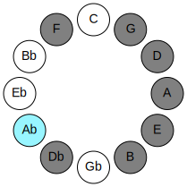 | 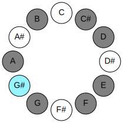 |
| [2923](https://ianring.com/musictheory/scales/2923) | [Baryllic](ModeBaryllic.md) | 7 | Ab | Ab, A, B, Db, D, E, F, G, Ab |  |  |
| [3509](https://ianring.com/musictheory/scales/3509) | [Stogyllic](ModeStogyllic.md) | -1 | A | A, B, C#, D, E, F, G, G#, A |  | 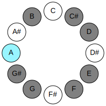 |
| [1901](https://ianring.com/musictheory/scales/1901) | [Ionidyllic](ModeIonidyllic.md) | 4 | B | B, C#, D, E, F, G, G#, A, B | 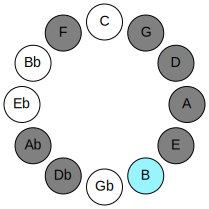 | 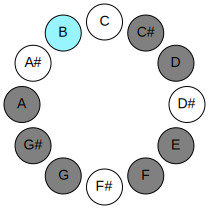 |
| [1499](https://ianring.com/musictheory/scales/1499) | [Stonyllic](ModeStonyllic.md) | -1 | C# | C#, D, E, F, G, G#, A, B, C# |  | 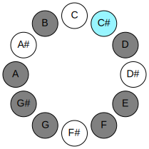 |
| [1499](https://ianring.com/musictheory/scales/1499) | [Stonyllic](ModeStonyllic.md) | 8 | Db | Db, D, E, F, G, Ab, A, B, Db | 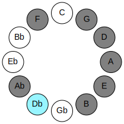 |  |
| [2797](https://ianring.com/musictheory/scales/2797) | [Stalyllic](ModeStalyllic.md) | 7 | D | D, E, F, G, G#, A, B, C#, D | 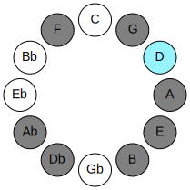 | 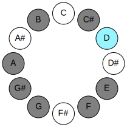 |
| [1723](https://ianring.com/musictheory/scales/1723) | [Poryllic](ModePoryllic.md) | 5 | E | E, F, G, G#, A, B, C#, D, E | 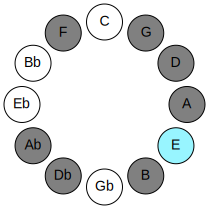 | 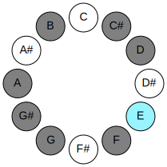 |
| [2909](https://ianring.com/musictheory/scales/2909) | [Mocryllic](ModeMocryllic.md) | -1 | F | F, G, G#, A, B, C#, D, E, F |  | 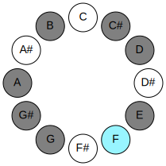 |
| [1751](https://ianring.com/musictheory/scales/1751) | [Aeolyryllic](ModeAeolyryllic.md) | 8 | G | G, G#, A, B, C#, D, E, F, G | 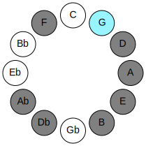 | 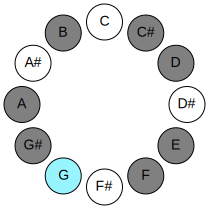 |

## Chords

### Ab

| Number | Root | Name | Notes | Illustration | Audio |
|--------|------|------|-------|--------------|-------|
| 2306 | Ab | [G#mbb5](ChordGSharpMinorDoubleFlatFifth.md) | G#, B, C# |  | [midi](ChordGSharpMinorDoubleFlatFifthRootPosition.mid) |
| 2306 | Ab | [Abmbb5](ChordAFlatMinorDoubleFlatFifth.md) | Ab, Cb, Db |  | [midi](ChordAFlatMinorDoubleFlatFifthRootPosition.mid) |
| 772 | Ab | [G#loc](ChordGSharpLocrian.md) | G#, A, D |  | [midi](ChordGSharpLocrianRootPosition.mid) |
| 772 | Ab | [Abloc](ChordAFlatLocrian.md) | Ab, Bbb, Ebb |  | [midi](ChordAFlatLocrianRootPosition.mid) |
| 2308 | Ab | [G#o](ChordGSharpDiminished.md) | G#, B, D |  | [midi](ChordGSharpDiminishedRootPosition.mid) |
| 2308 | Ab | [Abo](ChordAFlatDiminished.md) | Ab, Cb, Ebb |  | [midi](ChordAFlatDiminishedRootPosition.mid) |
| 262 | Ab | [G#sus4b5](ChordGSharpSuspendedFourthFlatFifth.md) | G#, C#, D |  | [midi](ChordGSharpSuspendedFourthFlatFifthRootPosition.mid) |
| 262 | Ab | [Absus4b5](ChordAFlatSuspendedFourthFlatFifth.md) | Ab, Db, Ebb |  | [midi](ChordAFlatSuspendedFourthFlatFifthRootPosition.mid) |
| 2320 | Ab | [G#m#5](ChordGSharpMinorSharpFifth.md) | G#, B, E |  | [midi](ChordGSharpMinorSharpFifthRootPosition.mid) |
| 2320 | Ab | [Abm#5](ChordAFlatMinorSharpFifth.md) | Ab, Cb, Fb |  | [midi](ChordAFlatMinorSharpFifthRootPosition.mid) |
| 274 | Ab | [G#sus4#5](ChordGSharpSuspendedFourthSharpFifth.md) | G#, C#, D## |  | [midi](ChordGSharpSuspendedFourthSharpFifthRootPosition.mid) |
| 274 | Ab | [Absus4#5](ChordAFlatSuspendedFourthSharpFifth.md) | Ab, Db, E |  | [midi](ChordAFlatSuspendedFourthSharpFifthRootPosition.mid) |
| 290 | Ab | [G#sus4##5](ChordGSharpSuspendedFourthDoubleSharpFifth.md) | G#, C#, E# |  | [midi](ChordGSharpSuspendedFourthDoubleSharpFifthRootPosition.mid) |
| 290 | Ab | [Absus4##5](ChordAFlatSuspendedFourthDoubleSharpFifth.md) | Ab, Db, F |  | [midi](ChordAFlatSuspendedFourthDoubleSharpFifthRootPosition.mid) |
| 2340 | Ab | [G#o7](ChordGSharpFullDiminishedSeventh.md) | G#, B, D, F |  | [midi](ChordGSharpFullDiminishedSeventhRootPosition.mid) |
| 2340 | Ab | [Abo7](ChordAFlatFullDiminishedSeventh.md) | Ab, Cb, Ebb, Gbb |  | [midi](ChordAFlatFullDiminishedSeventhRootPosition.mid) |
| 386 | Ab | [G#Q+](ChordGSharpQuartalAugmented.md) | G#, C#, F## |  | [midi](ChordGSharpQuartalAugmentedRootPosition.mid) |
| 386 | Ab | [AbQ+](ChordAFlatQuartalAugmented.md) | Ab, Db, G |  | [midi](ChordAFlatQuartalAugmentedRootPosition.mid) |
| 2436 | Ab | [G#oM7](ChordGSharpDiminishedMajorSeventh.md) | G#, B, D, F## |  | [midi](ChordGSharpDiminishedMajorSeventhRootPosition.mid) |
| 2436 | Ab | [AboM7](ChordAFlatDiminishedMajorSeventh.md) | Ab, Cb, Ebb, G |  | [midi](ChordAFlatDiminishedMajorSeventhRootPosition.mid) |
| 402 | Ab | [G#M7(sus4)#5](ChordGSharpMajorSeventhSuspendedFourthSharpFifth.md) | G#, C#, D##, F## |  | [midi](ChordGSharpMajorSeventhSuspendedFourthSharpFifthRootPosition.mid) |
| 402 | Ab | [AbM7(sus4)#5](ChordAFlatMajorSeventhSuspendedFourthSharpFifth.md) | Ab, Db, E, G |  | [midi](ChordAFlatMajorSeventhSuspendedFourthSharpFifthRootPosition.mid) |
| 418 | Ab | [G#M7(sus4)##5](ChordGSharpMajorSeventhSuspendedFourthDoubleSharpFifth.md) | G#, C#, E#, F## |  | [midi](ChordGSharpMajorSeventhSuspendedFourthDoubleSharpFifthRootPosition.mid) |
| 418 | Ab | [AbM7(sus4)##5](ChordAFlatMajorSeventhSuspendedFourthDoubleSharpFifth.md) | Ab, Db, F, G |  | [midi](ChordAFlatMajorSeventhSuspendedFourthDoubleSharpFifthRootPosition.mid) |

### A

| Number | Root | Name | Notes | Illustration | Audio |
|--------|------|------|-------|--------------|-------|
| 2564 | A | [Asus2bb5](ChordANaturalSuspendedSecondDoubleFlatFifth.md) | A, B, D |  | [midi](ChordANaturalSuspendedSecondDoubleFlatFifthRootPosition.mid) |
| 528 | A | [A5](ChordANaturalPowerChord.md) | A, E |  | [midi](ChordANaturalPowerChordRootPosition.mid) |
| 2576 | A | [Asus2](ChordANaturalSuspendedSecond.md) | A, B, E |  | [midi](ChordANaturalSuspendedSecondRootPosition.mid) |
| 530 | A | [AM](ChordANaturalMajor.md) | A, C#, E |  | [midi](ChordANaturalMajorRootPosition.mid) |
| 2578 | A | [AM(add9)](ChordANaturalMajorAddNinth.md) | A, C#, E, B |  | [midi](ChordANaturalMajorAddNinthRootPosition.mid) |
| 532 | A | [Asus4](ChordANaturalSuspendedFourth.md) | A, D, E |  | [midi](ChordANaturalSuspendedFourthRootPosition.mid) |
| 534 | A | [AM(add11)](ChordANaturalMajorAddEleventh.md) | A, C#, E, D |  | [midi](ChordANaturalMajorAddEleventhRootPosition.mid) |
| 534 | A | [AM(add4)](ChordANaturalMajorAddFourth.md) | A, C#, D, E |  | [midi](ChordANaturalMajorAddFourthRootPosition.mid) |
| 2592 | A | [Asus2#5](ChordANaturalSuspendedSecondSharpFifth.md) | A, B, E# |  | [midi](ChordANaturalSuspendedSecondSharpFifthRootPosition.mid) |
| 546 | A | [A+](ChordANaturalAugmented.md) | A, C#, E# |  | [midi](ChordANaturalAugmentedRootPosition.mid) |
| 546 | A | [A+7](ChordANaturalAugmentedAugmentedSeventh.md) | A, C#, E#, G## |  | [midi](ChordANaturalAugmentedAugmentedSeventhRootPosition.mid) |
| 548 | A | [Asus4#5](ChordANaturalSuspendedFourthSharpFifth.md) | A, D, E# |  | [midi](ChordANaturalSuspendedFourthSharpFifthRootPosition.mid) |
| 644 | A | [AQ](ChordANaturalQuartal.md) | A, D, G |  | [midi](ChordANaturalQuartalRootPosition.mid) |
| 2704 | A | [A7sus2](ChordANaturalDominantSeventhSuspendedSecond.md) | A, B, E, G |  | [midi](ChordANaturalDominantSeventhSuspendedSecondRootPosition.mid) |
| 2704 | A | [A9sus2](ChordANaturalDominantNinthSuspendedSecond.md) | A, B, E, G, B |  | [midi](ChordANaturalDominantNinthSuspendedSecondRootPosition.mid) |
| 658 | A | [A7](ChordANaturalDominantSeventh.md) | A, C#, E, G |  | [midi](ChordANaturalDominantSeventhRootPosition.mid) |
| 2706 | A | [A9](ChordANaturalDominantNinth.md) | A, C#, E, G, B |  | [midi](ChordANaturalDominantNinthRootPosition.mid) |
| 660 | A | [A7sus4](ChordANaturalDominantSeventhSuspendedFourth.md) | A, D, E, G |  | [midi](ChordANaturalDominantSeventhSuspendedFourthRootPosition.mid) |
| 2708 | A | [A9sus4](ChordANaturalDominantNinthSuspendedFourth.md) | A, D, E, G, B |  | [midi](ChordANaturalDominantNinthSuspendedFourthRootPosition.mid) |
| 662 | A | [A7add4](ChordANaturalDominantSeventhAddFourth.md) | A, C#, D, E, G |  | [midi](ChordANaturalDominantSeventhAddFourthRootPosition.mid) |
| 662 | A | [A7add11](ChordANaturalDominantSeventhAddEleventh.md) | A, C#, E, G, D |  | [midi](ChordANaturalDominantSeventhAddEleventhRootPosition.mid) |
| 2710 | A | [A11](ChordANaturalDominantEleventh.md) | A, C#, E, G, B, D |  | [midi](ChordANaturalDominantEleventhRootPosition.mid) |
| 2738 | A | [A9b13](ChordANaturalDominantNinthFlatThirteenth.md) | A, C#, E, G, B, F |  | [midi](ChordANaturalDominantNinthFlatThirteenthRootPosition.mid) |
| 772 | A | [AQ+](ChordANaturalQuartalAugmented.md) | A, D, G# |  | [midi](ChordANaturalQuartalAugmentedRootPosition.mid) |
| 2832 | A | [AM7(sus2)](ChordANaturalMajorSeventhSuspendedSecond.md) | A, B, E, G# |  | [midi](ChordANaturalMajorSeventhSuspendedSecondRootPosition.mid) |
| 2832 | A | [AM9sus2](ChordANaturalMajorNinthSuspendedSecond.md) | A, B, E, G#, B |  | [midi](ChordANaturalMajorNinthSuspendedSecondRootPosition.mid) |
| 786 | A | [AM7](ChordANaturalMajorSeventh.md) | A, C#, E, G# |  | [midi](ChordANaturalMajorSeventhRootPosition.mid) |
| 2834 | A | [AM9](ChordANaturalMajorNinth.md) | A, C#, E, G#, B |  | [midi](ChordANaturalMajorNinthRootPosition.mid) |
| 788 | A | [AM7(sus4)](ChordANaturalMajorSeventhSuspendedFourth.md) | A, D, E, G# |  | [midi](ChordANaturalMajorSeventhSuspendedFourthRootPosition.mid) |
| 2836 | A | [AM9sus4](ChordANaturalMajorNinthSuspendedFourth.md) | A, D, E, G#, B |  | [midi](ChordANaturalMajorNinthSuspendedFourthRootPosition.mid) |
| 790 | A | [AM7add4](ChordANaturalMajorSeventhAddFourth.md) | A, C#, D, E, G# |  | [midi](ChordANaturalMajorSeventhAddFourthRootPosition.mid) |
| 790 | A | [AM7add11](ChordANaturalMajorSeventhAddEleventh.md) | A, C#, E, G#, D |  | [midi](ChordANaturalMajorSeventhAddEleventhRootPosition.mid) |
| 2838 | A | [AM11](ChordANaturalMajorEleventh.md) | A, C#, E, G#, B, D |  | [midi](ChordANaturalMajorEleventhRootPosition.mid) |
| 802 | A | [A+(M7)](ChordANaturalAugmentedMajorSeventh.md) | A, C#, E#, G# |  | [midi](ChordANaturalAugmentedMajorSeventhRootPosition.mid) |
| 804 | A | [AM7(sus4)#5](ChordANaturalMajorSeventhSuspendedFourthSharpFifth.md) | A, D, E#, G# |  | [midi](ChordANaturalMajorSeventhSuspendedFourthSharpFifthRootPosition.mid) |

### B

| Number | Root | Name | Notes | Illustration | Audio |
|--------|------|------|-------|--------------|-------|
| 2066 | B | [Bsus2bb5](ChordBNaturalSuspendedSecondDoubleFlatFifth.md) | B, C#, E |  | [midi](ChordBNaturalSuspendedSecondDoubleFlatFifthRootPosition.mid) |
| 2068 | B | [Bmbb5](ChordBNaturalMinorDoubleFlatFifth.md) | B, D, E |  | [midi](ChordBNaturalMinorDoubleFlatFifthRootPosition.mid) |
| 2082 | B | [B](ChordBNaturalDiminishedFlatThird.md) | B, Db, F |  | [midi](ChordBNaturalDiminishedFlatThirdRootPosition.mid) |
| 2082 | B | [Bsus2b5](ChordBNaturalSuspendedSecondFlatFifth.md) | B, C#, F |  | [midi](ChordBNaturalSuspendedSecondFlatFifthRootPosition.mid) |
| 2084 | B | [Bo](ChordBNaturalDiminished.md) | B, D, F |  | [midi](ChordBNaturalDiminishedRootPosition.mid) |
| 2096 | B | [Bsus4b5](ChordBNaturalSuspendedFourthFlatFifth.md) | B, E, F |  | [midi](ChordBNaturalSuspendedFourthFlatFifthRootPosition.mid) |
| 2178 | B | [Bsus2#5](ChordBNaturalSuspendedSecondSharpFifth.md) | B, C#, F## |  | [midi](ChordBNaturalSuspendedSecondSharpFifthRootPosition.mid) |
| 2180 | B | [Bm#5](ChordBNaturalMinorSharpFifth.md) | B, D, G |  | [midi](ChordBNaturalMinorSharpFifthRootPosition.mid) |
| 2192 | B | [Bsus4#5](ChordBNaturalSuspendedFourthSharpFifth.md) | B, E, F## |  | [midi](ChordBNaturalSuspendedFourthSharpFifthRootPosition.mid) |
| 2210 | B | [Bsus2b5add(#5)](ChordBNaturalSuspendedSecondFlatFifthAddSharpFifth.md) | B, C#, F, F## |  | [midi](ChordBNaturalSuspendedSecondFlatFifthAddSharpFifthRootPosition.mid) |
| 2320 | B | [Bsus4##5](ChordBNaturalSuspendedFourthDoubleSharpFifth.md) | B, E, G# |  | [midi](ChordBNaturalSuspendedFourthDoubleSharpFifthRootPosition.mid) |
| 2322 | B | [BM6sus2bb5](ChordBNaturalMajorSixthSuspendedSecondDoubleFlatFifth.md) | B, C#, E, G# |  | [midi](ChordBNaturalMajorSixthSuspendedSecondDoubleFlatFifthRootPosition.mid) |
| 2338 | B | [BM6sus2b5](ChordBNaturalMajorSixthSuspendedSecondFlatFifth.md) | B, C#, F, G# |  | [midi](ChordBNaturalMajorSixthSuspendedSecondFlatFifthRootPosition.mid) |
| 2340 | B | [Bo7](ChordBNaturalFullDiminishedSeventh.md) | B, D, F, Ab |  | [midi](ChordBNaturalFullDiminishedSeventhRootPosition.mid) |
| 2576 | B | [BQ](ChordBNaturalQuartal.md) | B, E, A |  | [midi](ChordBNaturalQuartalRootPosition.mid) |
| 2580 | B | [Bm7bb5](ChordBNaturalMinorSeventhDoubleFlatFifth.md) | B, D, E, A |  | [midi](ChordBNaturalMinorSeventhDoubleFlatFifthRootPosition.mid) |
| 2596 | B | [Bø7](ChordBNaturalHalfDiminishedSeventh.md) | B, D, F, A |  | [midi](ChordBNaturalHalfDiminishedSeventhRootPosition.mid) |
| 2692 | B | [Bm7#5](ChordBNaturalMinorSeventhSharpFifth.md) | B, D, F##, A |  | [midi](ChordBNaturalMinorSeventhSharpFifthRootPosition.mid) |

### Db

| Number | Root | Name | Notes | Illustration | Audio |
|--------|------|------|-------|--------------|-------|
| 134 | Db | [C#loc](ChordCSharpLocrian.md) | C#, D, G |  | [midi](ChordCSharpLocrianRootPosition.mid) |
| 134 | Db | [Dbloc](ChordDFlatLocrian.md) | Db, Ebb, Abb |  | [midi](ChordDFlatLocrianRootPosition.mid) |
| 146 | Db | [C#o](ChordCSharpDiminished.md) | C#, E, G |  | [midi](ChordCSharpDiminishedRootPosition.mid) |
| 146 | Db | [Dbo](ChordDFlatDiminished.md) | Db, Fb, Abb |  | [midi](ChordDFlatDiminishedRootPosition.mid) |
| 162 | Db | [C#Mb5](ChordCSharpMajorFlatFifth.md) | C#, E#, G |  | [midi](ChordCSharpMajorFlatFifthRootPosition.mid) |
| 162 | Db | [DbMb5](ChordDFlatMajorFlatFifth.md) | Db, F, Abb |  | [midi](ChordDFlatMajorFlatFifthRootPosition.mid) |
| 258 | Db | [C#5](ChordCSharpPowerChord.md) | C#, G# |  | [midi](ChordCSharpPowerChordRootPosition.mid) |
| 258 | Db | [Db5](ChordDFlatPowerChord.md) | Db, Ab |  | [midi](ChordDFlatPowerChordRootPosition.mid) |
| 262 | Db | [C#phryg](ChordCSharpPhrygian.md) | C#, D, G# |  | [midi](ChordCSharpPhrygianRootPosition.mid) |
| 262 | Db | [Dbphryg](ChordDFlatPhrygian.md) | Db, Ebb, Ab |  | [midi](ChordDFlatPhrygianRootPosition.mid) |
| 274 | Db | [C#m](ChordCSharpMinor.md) | C#, E, G# |  | [midi](ChordCSharpMinorRootPosition.mid) |
| 274 | Db | [C#m(add(#9))](ChordCSharpMinorAddSharpNinth.md) | C#, E, G#, D## |  | [midi](ChordCSharpMinorAddSharpNinthRootPosition.mid) |
| 274 | Db | [Dbm](ChordDFlatMinor.md) | Db, Fb, Ab |  | [midi](ChordDFlatMinorRootPosition.mid) |
| 274 | Db | [Dbm(add(#9))](ChordDFlatMinorAddSharpNinth.md) | Db, Fb, Ab, E |  | [midi](ChordDFlatMinorAddSharpNinthRootPosition.mid) |
| 290 | Db | [C#M](ChordCSharpMajor.md) | C#, E#, G# |  | [midi](ChordCSharpMajorRootPosition.mid) |
| 290 | Db | [DbM](ChordDFlatMajor.md) | Db, F, Ab |  | [midi](ChordDFlatMajorRootPosition.mid) |
| 306 | Db | [C#M(add(#9))](ChordCSharpMajorAddSharpNinth.md) | C#, E#, G#, D## |  | [midi](ChordCSharpMajorAddSharpNinthRootPosition.mid) |
| 306 | Db | [DbM(add(#9))](ChordDFlatMajorAddSharpNinth.md) | Db, F, Ab, E |  | [midi](ChordDFlatMajorAddSharpNinthRootPosition.mid) |
| 386 | Db | [C#lyd](ChordCSharpLydian.md) | C#, F##, G# |  | [midi](ChordCSharpLydianRootPosition.mid) |
| 386 | Db | [Dblyd](ChordDFlatLydian.md) | Db, G, Ab |  | [midi](ChordDFlatLydianRootPosition.mid) |
| 402 | Db | [C#m(add(#4))](ChordCSharpMinorAddSharpFourth.md) | C#, E, F##, G# |  | [midi](ChordCSharpMinorAddSharpFourthRootPosition.mid) |
| 402 | Db | [Dbm(add(#4))](ChordDFlatMinorAddSharpFourth.md) | Db, Fb, G, Ab |  | [midi](ChordDFlatMinorAddSharpFourthRootPosition.mid) |
| 418 | Db | [C#M(add(#4))](ChordCSharpMajorAddSharpFourth.md) | C#, E#, F##, G# |  | [midi](ChordCSharpMajorAddSharpFourthRootPosition.mid) |
| 418 | Db | [DbM(add(#4))](ChordDFlatMajorAddSharpFourth.md) | Db, F, G, Ab |  | [midi](ChordDFlatMajorAddSharpFourthRootPosition.mid) |
| 530 | Db | [C#m#5](ChordCSharpMinorSharpFifth.md) | C#, E, A |  | [midi](ChordCSharpMinorSharpFifthRootPosition.mid) |
| 530 | Db | [Dbm#5](ChordDFlatMinorSharpFifth.md) | Db, Fb, Bbb |  | [midi](ChordDFlatMinorSharpFifthRootPosition.mid) |
| 546 | Db | [C#+](ChordCSharpAugmented.md) | C#, E#, G## |  | [midi](ChordCSharpAugmentedRootPosition.mid) |
| 546 | Db | [C#+7](ChordCSharpAugmentedAugmentedSeventh.md) | C#, E#, G##, B## |  | [midi](ChordCSharpAugmentedAugmentedSeventhRootPosition.mid) |
| 546 | Db | [Db+](ChordDFlatAugmented.md) | Db, F, A |  | [midi](ChordDFlatAugmentedRootPosition.mid) |
| 546 | Db | [Db+7](ChordDFlatAugmentedAugmentedSeventh.md) | Db, F, A, C# |  | [midi](ChordDFlatAugmentedAugmentedSeventhRootPosition.mid) |
| 2194 | Db | [C#ø7](ChordCSharpHalfDiminishedSeventh.md) | C#, E, G, B |  | [midi](ChordCSharpHalfDiminishedSeventhRootPosition.mid) |
| 2194 | Db | [Dbø7](ChordDFlatHalfDiminishedSeventh.md) | Db, Fb, Abb, Cb |  | [midi](ChordDFlatHalfDiminishedSeventhRootPosition.mid) |
| 2210 | Db | [C#7b5](ChordCSharpDominantSeventhFlatFifth.md) | C#, E#, G, B |  | [midi](ChordCSharpDominantSeventhFlatFifthRootPosition.mid) |
| 2210 | Db | [Db7b5](ChordDFlatDominantSeventhFlatFifth.md) | Db, F, Abb, Cb |  | [midi](ChordDFlatDominantSeventhFlatFifthRootPosition.mid) |
| 2214 | Db | [C#7b5b9](ChordCSharpDominantSeventhFlatFifthFlatNinth.md) | C#, E#, G, B, D |  | [midi](ChordCSharpDominantSeventhFlatFifthFlatNinthRootPosition.mid) |
| 2214 | Db | [Db7b5b9](ChordDFlatDominantSeventhFlatFifthFlatNinth.md) | Db, F, Abb, Cb, Ebb |  | [midi](ChordDFlatDominantSeventhFlatFifthFlatNinthRootPosition.mid) |
| 2322 | Db | [C#m7](ChordCSharpMinorSeventh.md) | C#, E, G#, B |  | [midi](ChordCSharpMinorSeventhRootPosition.mid) |
| 2322 | Db | [Dbm7](ChordDFlatMinorSeventh.md) | Db, Fb, Ab, Cb |  | [midi](ChordDFlatMinorSeventhRootPosition.mid) |
| 2326 | Db | [C#m7b9](ChordCSharpMinorSeventhFlatNinth.md) | C#, E, G#, B, D |  | [midi](ChordCSharpMinorSeventhFlatNinthRootPosition.mid) |
| 2326 | Db | [Dbm7b9](ChordDFlatMinorSeventhFlatNinth.md) | Db, Fb, Ab, Cb, Ebb |  | [midi](ChordDFlatMinorSeventhFlatNinthRootPosition.mid) |
| 2338 | Db | [C#7](ChordCSharpDominantSeventh.md) | C#, E#, G#, B |  | [midi](ChordCSharpDominantSeventhRootPosition.mid) |
| 2338 | Db | [Db7](ChordDFlatDominantSeventh.md) | Db, F, Ab, Cb |  | [midi](ChordDFlatDominantSeventhRootPosition.mid) |
| 2342 | Db | [C#7b9](ChordCSharpDominantSeventhFlatNinth.md) | C#, E#, G#, B, D |  | [midi](ChordCSharpDominantSeventhFlatNinthRootPosition.mid) |
| 2342 | Db | [Db7b9](ChordDFlatDominantSeventhFlatNinth.md) | Db, F, Ab, Cb, Ebb |  | [midi](ChordDFlatDominantSeventhFlatNinthRootPosition.mid) |
| 2354 | Db | [C#7#9](ChordCSharpDominantSeventhSharpNinth.md) | C#, E#, G#, B, D## |  | [midi](ChordCSharpDominantSeventhSharpNinthRootPosition.mid) |
| 2354 | Db | [Db7#9](ChordDFlatDominantSeventhSharpNinth.md) | Db, F, Ab, Cb, E |  | [midi](ChordDFlatDominantSeventhSharpNinthRootPosition.mid) |
| 2450 | Db | [C#m7add(#11)](ChordCSharpMinorSeventhAddSharpEleventh.md) | C#, E, G#, B, F## | 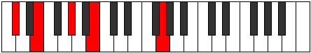 | [midi](ChordCSharpMinorSeventhAddSharpEleventhRootPosition.mid) |
| 2450 | Db | [Dbm7add(#11)](ChordDFlatMinorSeventhAddSharpEleventh.md) | Db, Fb, Ab, Cb, G |  | [midi](ChordDFlatMinorSeventhAddSharpEleventhRootPosition.mid) |
| 2466 | Db | [C#7add(#4)](ChordCSharpDominantSeventhAddSharpFourth.md) | C#, E#, F##, G#, B |  | [midi](ChordCSharpDominantSeventhAddSharpFourthRootPosition.mid) |
| 2466 | Db | [C#7#11](ChordCSharpDominantSeventhSharpEleventh.md) | C#, E#, G#, B, F## |  | [midi](ChordCSharpDominantSeventhSharpEleventhRootPosition.mid) |
| 2466 | Db | [Db7add(#4)](ChordDFlatDominantSeventhAddSharpFourth.md) | Db, F, G, Ab, Cb |  | [midi](ChordDFlatDominantSeventhAddSharpFourthRootPosition.mid) |
| 2466 | Db | [Db7#11](ChordDFlatDominantSeventhSharpEleventh.md) | Db, F, Ab, Cb, G |  | [midi](ChordDFlatDominantSeventhSharpEleventhRootPosition.mid) |
| 2482 | Db | [C#7#9#11](ChordCSharpDominantSeventhSharpNinthSharpEleventh.md) | C#, E#, G#, B, D##, F## |  | [midi](ChordCSharpDominantSeventhSharpNinthSharpEleventhRootPosition.mid) |
| 2482 | Db | [Db7#9#11](ChordDFlatDominantSeventhSharpNinthSharpEleventh.md) | Db, F, Ab, Cb, E, G |  | [midi](ChordDFlatDominantSeventhSharpNinthSharpEleventhRootPosition.mid) |
| 2578 | Db | [C#m7#5](ChordCSharpMinorSeventhSharpFifth.md) | C#, E, G##, B |  | [midi](ChordCSharpMinorSeventhSharpFifthRootPosition.mid) |
| 2578 | Db | [Dbm7#5](ChordDFlatMinorSeventhSharpFifth.md) | Db, Fb, A, Cb |  | [midi](ChordDFlatMinorSeventhSharpFifthRootPosition.mid) |
| 2598 | Db | [C#7#5b9](ChordCSharpDominantSeventhSharpFifthFlatNinth.md) | C#, E#, G##, B, D |  | [midi](ChordCSharpDominantSeventhSharpFifthFlatNinthRootPosition.mid) |
| 2598 | Db | [Db7#5b9](ChordDFlatDominantSeventhSharpFifthFlatNinth.md) | Db, F, A, Cb, Ebb |  | [midi](ChordDFlatDominantSeventhSharpFifthFlatNinthRootPosition.mid) |
| 2854 | Db | [C#7b9b13](ChordCSharpDominantSeventhFlatNinthFlatThirteenth.md) | C#, E#, G#, B, D, A |  | [midi](ChordCSharpDominantSeventhFlatNinthFlatThirteenthRootPosition.mid) |
| 2854 | Db | [Db7b9b13](ChordDFlatDominantSeventhFlatNinthFlatThirteenth.md) | Db, F, Ab, Cb, Ebb, Bbb |  | [midi](ChordDFlatDominantSeventhFlatNinthFlatThirteenthRootPosition.mid) |

### D

| Number | Root | Name | Notes | Illustration | Audio |
|--------|------|------|-------|--------------|-------|
| 148 | D | [Dsus2bb5](ChordDNaturalSuspendedSecondDoubleFlatFifth.md) | D, E, G |  | [midi](ChordDNaturalSuspendedSecondDoubleFlatFifthRootPosition.mid) |
| 164 | D | [Dmbb5](ChordDNaturalMinorDoubleFlatFifth.md) | D, F, G |  | [midi](ChordDNaturalMinorDoubleFlatFifthRootPosition.mid) |
| 276 | D | [D](ChordDNaturalDiminishedFlatThird.md) | D, Fb, Ab |  | [midi](ChordDNaturalDiminishedFlatThirdRootPosition.mid) |
| 276 | D | [Dsus2b5](ChordDNaturalSuspendedSecondFlatFifth.md) | D, E, Ab |  | [midi](ChordDNaturalSuspendedSecondFlatFifthRootPosition.mid) |
| 292 | D | [Do](ChordDNaturalDiminished.md) | D, F, Ab |  | [midi](ChordDNaturalDiminishedRootPosition.mid) |
| 388 | D | [Dsus4b5](ChordDNaturalSuspendedFourthFlatFifth.md) | D, G, Ab |  | [midi](ChordDNaturalSuspendedFourthFlatFifthRootPosition.mid) |
| 516 | D | [D5](ChordDNaturalPowerChord.md) | D, A |  | [midi](ChordDNaturalPowerChordRootPosition.mid) |
| 532 | D | [Dsus2](ChordDNaturalSuspendedSecond.md) | D, E, A |  | [midi](ChordDNaturalSuspendedSecondRootPosition.mid) |
| 548 | D | [Dm](ChordDNaturalMinor.md) | D, F, A |  | [midi](ChordDNaturalMinorRootPosition.mid) |
| 548 | D | [Dm(add(#9))](ChordDNaturalMinorAddSharpNinth.md) | D, F, A, E# |  | [midi](ChordDNaturalMinorAddSharpNinthRootPosition.mid) |
| 564 | D | [Dm(add9)](ChordDNaturalMinorAddNinth.md) | D, F, A, E |  | [midi](ChordDNaturalMinorAddNinthRootPosition.mid) |
| 644 | D | [Dsus4](ChordDNaturalSuspendedFourth.md) | D, G, A |  | [midi](ChordDNaturalSuspendedFourthRootPosition.mid) |
| 676 | D | [Dm(add11)](ChordDNaturalMinorAddEleventh.md) | D, F, A, G |  | [midi](ChordDNaturalMinorAddEleventhRootPosition.mid) |
| 676 | D | [Dm(add4)](ChordDNaturalMinorAddFourth.md) | D, F, G, A |  | [midi](ChordDNaturalMinorAddFourthRootPosition.mid) |
| 772 | D | [Dlyd](ChordDNaturalLydian.md) | D, G#, A |  | [midi](ChordDNaturalLydianRootPosition.mid) |
| 804 | D | [Dm(add(#4))](ChordDNaturalMinorAddSharpFourth.md) | D, F, G#, A |  | [midi](ChordDNaturalMinorAddSharpFourthRootPosition.mid) |
| 2180 | D | [Dsus4##5](ChordDNaturalSuspendedFourthDoubleSharpFifth.md) | D, G, B |  | [midi](ChordDNaturalSuspendedFourthDoubleSharpFifthRootPosition.mid) |
| 2196 | D | [DM6sus2bb5](ChordDNaturalMajorSixthSuspendedSecondDoubleFlatFifth.md) | D, E, G, B |  | [midi](ChordDNaturalMajorSixthSuspendedSecondDoubleFlatFifthRootPosition.mid) |
| 2324 | D | [DM6sus2b5](ChordDNaturalMajorSixthSuspendedSecondFlatFifth.md) | D, E, Ab, B |  | [midi](ChordDNaturalMajorSixthSuspendedSecondFlatFifthRootPosition.mid) |
| 2340 | D | [Do7](ChordDNaturalFullDiminishedSeventh.md) | D, F, Ab, Cb |  | [midi](ChordDNaturalFullDiminishedSeventhRootPosition.mid) |
| 2580 | D | [DM6sus2](ChordDNaturalMajorSixthSuspendedSecond.md) | D, E, A, B |  | [midi](ChordDNaturalMajorSixthSuspendedSecondRootPosition.mid) |
| 2580 | D | [D7sus2b5](ChordDNaturalDominantSeventhSuspendedSecondFlatFifth.md) | D, E, A, Cb |  | [midi](ChordDNaturalDominantSeventhSuspendedSecondFlatFifthRootPosition.mid) |
| 2596 | D | [Dm6](ChordDNaturalMinorSixth.md) | D, F, A, B |  | [midi](ChordDNaturalMinorSixthRootPosition.mid) |
| 2612 | D | [Dm6(add9)](ChordDNaturalMinorSixthAddNinth.md) | D, F, A, B, E |  | [midi](ChordDNaturalMinorSixthAddNinthRootPosition.mid) |
| 2692 | D | [DM6sus4](ChordDNaturalMajorSixthSuspendedFourth.md) | D, G, A, B |  | [midi](ChordDNaturalMajorSixthSuspendedFourthRootPosition.mid) |
| 134 | D | [DQ+](ChordDNaturalQuartalAugmented.md) | D, G, C# |  | [midi](ChordDNaturalQuartalAugmentedRootPosition.mid) |
| 294 | D | [DoM7](ChordDNaturalDiminishedMajorSeventh.md) | D, F, Ab, C# |  | [midi](ChordDNaturalDiminishedMajorSeventhRootPosition.mid) |
| 534 | D | [DM7(sus2)](ChordDNaturalMajorSeventhSuspendedSecond.md) | D, E, A, C# |  | [midi](ChordDNaturalMajorSeventhSuspendedSecondRootPosition.mid) |
| 534 | D | [DM9sus2](ChordDNaturalMajorNinthSuspendedSecond.md) | D, E, A, C#, E |  | [midi](ChordDNaturalMajorNinthSuspendedSecondRootPosition.mid) |
| 550 | D | [Dm(M7)](ChordDNaturalMinorMajorSeventh.md) | D, F, A, C# |  | [midi](ChordDNaturalMinorMajorSeventhRootPosition.mid) |
| 566 | D | [Dm(M9)](ChordDNaturalMinorMajorNinth.md) | D, F, A, C#, E |  | [midi](ChordDNaturalMinorMajorNinthRootPosition.mid) |
| 646 | D | [DM7(sus4)](ChordDNaturalMajorSeventhSuspendedFourth.md) | D, G, A, C# |  | [midi](ChordDNaturalMajorSeventhSuspendedFourthRootPosition.mid) |
| 662 | D | [DM9sus4](ChordDNaturalMajorNinthSuspendedFourth.md) | D, G, A, C#, E |  | [midi](ChordDNaturalMajorNinthSuspendedFourthRootPosition.mid) |
| 678 | D | [Dm(M7)add11](ChordDNaturalMinorMajorSeventhAddEleventh.md) | D, F, A, C#, G |  | [midi](ChordDNaturalMinorMajorSeventhAddEleventhRootPosition.mid) |
| 694 | D | [Dm(M11)](ChordDNaturalMinorMajorEleventh.md) | D, F, A, C#, E, G |  | [midi](ChordDNaturalMinorMajorEleventhRootPosition.mid) |
| 774 | D | [Dlyd(M7)](ChordDNaturalLydianMajorSeventh.md) | D, G#, A, C# |  | [midi](ChordDNaturalLydianMajorSeventhRootPosition.mid) |
| 2182 | D | [DM7(sus4)##5](ChordDNaturalMajorSeventhSuspendedFourthDoubleSharpFifth.md) | D, G, B, C# |  | [midi](ChordDNaturalMajorSeventhSuspendedFourthDoubleSharpFifthRootPosition.mid) |
| 2598 | D | [Dm(M7)add13](ChordDNaturalMinorMajorSeventhAddThirteenth.md) | D, F, A, C#, B |  | [midi](ChordDNaturalMinorMajorSeventhAddThirteenthRootPosition.mid) |
| 2742 | D | [Dm(M13)](ChordDNaturalMinorMajorThirteenth.md) | D, F, A, C#, E, G, B |  | [midi](ChordDNaturalMinorMajorThirteenthRootPosition.mid) |

### E

| Number | Root | Name | Notes | Illustration | Audio |
|--------|------|------|-------|--------------|-------|
| 656 | E | [Embb5](ChordENaturalMinorDoubleFlatFifth.md) | E, G, A |  | [midi](ChordENaturalMinorDoubleFlatFifthRootPosition.mid) |
| 2064 | E | [E5](ChordENaturalPowerChord.md) | E, B |  | [midi](ChordENaturalPowerChordRootPosition.mid) |
| 2096 | E | [Ephryg](ChordENaturalPhrygian.md) | E, F, B |  | [midi](ChordENaturalPhrygianRootPosition.mid) |
| 2192 | E | [Em](ChordENaturalMinor.md) | E, G, B |  | [midi](ChordENaturalMinorRootPosition.mid) |
| 2192 | E | [Em(add(#9))](ChordENaturalMinorAddSharpNinth.md) | E, G, B, F## |  | [midi](ChordENaturalMinorAddSharpNinthRootPosition.mid) |
| 2320 | E | [EM](ChordENaturalMajor.md) | E, G#, B |  | [midi](ChordENaturalMajorRootPosition.mid) |
| 2448 | E | [EM(add(#9))](ChordENaturalMajorAddSharpNinth.md) | E, G#, B, F## |  | [midi](ChordENaturalMajorAddSharpNinthRootPosition.mid) |
| 2576 | E | [Esus4](ChordENaturalSuspendedFourth.md) | E, A, B |  | [midi](ChordENaturalSuspendedFourthRootPosition.mid) |
| 2704 | E | [Em(add11)](ChordENaturalMinorAddEleventh.md) | E, G, B, A |  | [midi](ChordENaturalMinorAddEleventhRootPosition.mid) |
| 2704 | E | [Em(add4)](ChordENaturalMinorAddFourth.md) | E, G, A, B |  | [midi](ChordENaturalMinorAddFourthRootPosition.mid) |
| 2832 | E | [EM(add11)](ChordENaturalMajorAddEleventh.md) | E, G#, B, A |  | [midi](ChordENaturalMajorAddEleventhRootPosition.mid) |
| 2832 | E | [EM(add4)](ChordENaturalMajorAddFourth.md) | E, G#, A, B |  | [midi](ChordENaturalMajorAddFourthRootPosition.mid) |
| 274 | E | [EM##5](ChordENaturalMajorDoubleSharpFifth.md) | E, G#, C# |  | [midi](ChordENaturalMajorDoubleSharpFifthRootPosition.mid) |
| 530 | E | [Esus4##5](ChordENaturalSuspendedFourthDoubleSharpFifth.md) | E, A, C# |  | [midi](ChordENaturalSuspendedFourthDoubleSharpFifthRootPosition.mid) |
| 2194 | E | [Em6](ChordENaturalMinorSixth.md) | E, G, B, C# |  | [midi](ChordENaturalMinorSixthRootPosition.mid) |
| 2226 | E | [Em6(addb9)](ChordENaturalMinorSixthAddFlatNinth.md) | E, G, B, C#, F |  | [midi](ChordENaturalMinorSixthAddFlatNinthRootPosition.mid) |
| 2322 | E | [EM6](ChordENaturalMajorSixth.md) | E, G#, B, C# |  | [midi](ChordENaturalMajorSixthRootPosition.mid) |
| 2354 | E | [EM6(addb9)](ChordENaturalMajorSixthAddFlatNinth.md) | E, G#, B, C#, F |  | [midi](ChordENaturalMajorSixthAddFlatNinthRootPosition.mid) |
| 2578 | E | [EM6sus4](ChordENaturalMajorSixthSuspendedFourth.md) | E, A, B, C# |  | [midi](ChordENaturalMajorSixthSuspendedFourthRootPosition.mid) |
| 532 | E | [EQ](ChordENaturalQuartal.md) | E, A, D |  | [midi](ChordENaturalQuartalRootPosition.mid) |
| 660 | E | [Em7bb5](ChordENaturalMinorSeventhDoubleFlatFifth.md) | E, G, A, D |  | [midi](ChordENaturalMinorSeventhDoubleFlatFifthRootPosition.mid) |
| 2196 | E | [Em7](ChordENaturalMinorSeventh.md) | E, G, B, D |  | [midi](ChordENaturalMinorSeventhRootPosition.mid) |
| 2228 | E | [Em7b9](ChordENaturalMinorSeventhFlatNinth.md) | E, G, B, D, F | 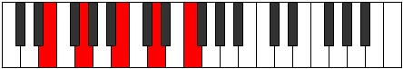 | [midi](ChordENaturalMinorSeventhFlatNinthRootPosition.mid) |
| 2324 | E | [E7](ChordENaturalDominantSeventh.md) | E, G#, B, D |  | [midi](ChordENaturalDominantSeventhRootPosition.mid) |
| 2356 | E | [E7b9](ChordENaturalDominantSeventhFlatNinth.md) | E, G#, B, D, F |  | [midi](ChordENaturalDominantSeventhFlatNinthRootPosition.mid) |
| 2452 | E | [E7#9](ChordENaturalDominantSeventhSharpNinth.md) | E, G#, B, D, F## |  | [midi](ChordENaturalDominantSeventhSharpNinthRootPosition.mid) |
| 2580 | E | [E7sus4](ChordENaturalDominantSeventhSuspendedFourth.md) | E, A, B, D |  | [midi](ChordENaturalDominantSeventhSuspendedFourthRootPosition.mid) |
| 2708 | E | [Em7add11](ChordENaturalMinorSeventhAddEleventh.md) | E, G, B, D, A |  | [midi](ChordENaturalMinorSeventhAddEleventhRootPosition.mid) |
| 2836 | E | [E7add4](ChordENaturalDominantSeventhAddFourth.md) | E, G#, A, B, D |  | [midi](ChordENaturalDominantSeventhAddFourthRootPosition.mid) |
| 2836 | E | [E7add11](ChordENaturalDominantSeventhAddEleventh.md) | E, G#, B, D, A |  | [midi](ChordENaturalDominantSeventhAddEleventhRootPosition.mid) |
| 2198 | E | [Em7add13](ChordENaturalMinorSeventhAddThirteenth.md) | E, G, B, D, C# |  | [midi](ChordENaturalMinorSeventhAddThirteenthRootPosition.mid) |
| 2326 | E | [E7add13](ChordENaturalDominantSeventhAddThirteenth.md) | E, G#, B, D, C# |  | [midi](ChordENaturalDominantSeventhAddThirteenthRootPosition.mid) |
| 2870 | E | [E13b9](ChordENaturalDominantThirteenthFlatNinth.md) | E, G#, B, D, F, A, C# |  | [midi](ChordENaturalDominantThirteenthFlatNinthRootPosition.mid) |

### F

| Number | Root | Name | Notes | Illustration | Audio |
|--------|------|------|-------|--------------|-------|
| 2208 | F | [F](ChordFNaturalDiminishedFlatThird.md) | F, Abb, Cb |  | [midi](ChordFNaturalDiminishedFlatThirdRootPosition.mid) |
| 2208 | F | [Fsus2b5](ChordFNaturalSuspendedSecondFlatFifth.md) | F, G, Cb |  | [midi](ChordFNaturalSuspendedSecondFlatFifthRootPosition.mid) |
| 2336 | F | [Fo](ChordFNaturalDiminished.md) | F, Ab, Cb |  | [midi](ChordFNaturalDiminishedRootPosition.mid) |
| 2592 | F | [FMb5](ChordFNaturalMajorFlatFifth.md) | F, A, Cb |  | [midi](ChordFNaturalMajorFlatFifthRootPosition.mid) |
| 162 | F | [Fsus2#5](ChordFNaturalSuspendedSecondSharpFifth.md) | F, G, C# |  | [midi](ChordFNaturalSuspendedSecondSharpFifthRootPosition.mid) |
| 290 | F | [Fm#5](ChordFNaturalMinorSharpFifth.md) | F, Ab, Db |  | [midi](ChordFNaturalMinorSharpFifthRootPosition.mid) |
| 546 | F | [F+](ChordFNaturalAugmented.md) | F, A, C# |  | [midi](ChordFNaturalAugmentedRootPosition.mid) |
| 546 | F | [F+7](ChordFNaturalAugmentedAugmentedSeventh.md) | F, A, C#, E# |  | [midi](ChordFNaturalAugmentedAugmentedSeventhRootPosition.mid) |
| 2210 | F | [Fsus2b5add(#5)](ChordFNaturalSuspendedSecondFlatFifthAddSharpFifth.md) | F, G, Cb, C# |  | [midi](ChordFNaturalSuspendedSecondFlatFifthAddSharpFifthRootPosition.mid) |
| 548 | F | [FM##5](ChordFNaturalMajorDoubleSharpFifth.md) | F, A, D |  | [midi](ChordFNaturalMajorDoubleSharpFifthRootPosition.mid) |
| 2212 | F | [FM6sus2b5](ChordFNaturalMajorSixthSuspendedSecondFlatFifth.md) | F, G, Cb, D |  | [midi](ChordFNaturalMajorSixthSuspendedSecondFlatFifthRootPosition.mid) |
| 2340 | F | [Fo7](ChordFNaturalFullDiminishedSeventh.md) | F, Ab, Cb, Ebb |  | [midi](ChordFNaturalFullDiminishedSeventhRootPosition.mid) |
| 2596 | F | [FM6b5](ChordFNaturalMajorSixthFlatFifth.md) | F, A, Cb, D |  | [midi](ChordFNaturalMajorSixthFlatFifthRootPosition.mid) |
| 2352 | F | [FoM7](ChordFNaturalDiminishedMajorSeventh.md) | F, Ab, Cb, E |  | [midi](ChordFNaturalDiminishedMajorSeventhRootPosition.mid) |
| 2608 | F | [FM7b5](ChordFNaturalMajorSeventhFlatFifth.md) | F, A, Cb, E |  | [midi](ChordFNaturalMajorSeventhFlatFifthRootPosition.mid) |
| 562 | F | [F+(M7)](ChordFNaturalAugmentedMajorSeventh.md) | F, A, C#, E |  | [midi](ChordFNaturalAugmentedMajorSeventhRootPosition.mid) |
| 564 | F | [FM7##5](ChordFNaturalMajorSeventhDoubleSharpFifth.md) | F, A, D, E |  | [midi](ChordFNaturalMajorSeventhDoubleSharpFifthRootPosition.mid) |

### G

| Number | Root | Name | Notes | Illustration | Audio |
|--------|------|------|-------|--------------|-------|
| 386 | G | [Gloc](ChordGNaturalLocrian.md) | G, Ab, Db |  | [midi](ChordGNaturalLocrianRootPosition.mid) |
| 642 | G | [G](ChordGNaturalDiminishedFlatThird.md) | G, Bbb, Db |  | [midi](ChordGNaturalDiminishedFlatThirdRootPosition.mid) |
| 642 | G | [Gsus2b5](ChordGNaturalSuspendedSecondFlatFifth.md) | G, A, Db |  | [midi](ChordGNaturalSuspendedSecondFlatFifthRootPosition.mid) |
| 2178 | G | [GMb5](ChordGNaturalMajorFlatFifth.md) | G, B, Db |  | [midi](ChordGNaturalMajorFlatFifthRootPosition.mid) |
| 132 | G | [G5](ChordGNaturalPowerChord.md) | G, D |  | [midi](ChordGNaturalPowerChordRootPosition.mid) |
| 388 | G | [Gphryg](ChordGNaturalPhrygian.md) | G, Ab, D |  | [midi](ChordGNaturalPhrygianRootPosition.mid) |
| 644 | G | [Gsus2](ChordGNaturalSuspendedSecond.md) | G, A, D |  | [midi](ChordGNaturalSuspendedSecondRootPosition.mid) |
| 2180 | G | [GM](ChordGNaturalMajor.md) | G, B, D |  | [midi](ChordGNaturalMajorRootPosition.mid) |
| 2692 | G | [GM(add9)](ChordGNaturalMajorAddNinth.md) | G, B, D, A |  | [midi](ChordGNaturalMajorAddNinthRootPosition.mid) |
| 134 | G | [Glyd](ChordGNaturalLydian.md) | G, C#, D |  | [midi](ChordGNaturalLydianRootPosition.mid) |
| 2182 | G | [GM(add(#4))](ChordGNaturalMajorAddSharpFourth.md) | G, B, C#, D |  | [midi](ChordGNaturalMajorAddSharpFourthRootPosition.mid) |
| 2192 | G | [GM##5](ChordGNaturalMajorDoubleSharpFifth.md) | G, B, E |  | [midi](ChordGNaturalMajorDoubleSharpFifthRootPosition.mid) |
| 658 | G | [GM6sus2b5](ChordGNaturalMajorSixthSuspendedSecondFlatFifth.md) | G, A, Db, E |  | [midi](ChordGNaturalMajorSixthSuspendedSecondFlatFifthRootPosition.mid) |
| 2194 | G | [GM6b5](ChordGNaturalMajorSixthFlatFifth.md) | G, B, Db, E |  | [midi](ChordGNaturalMajorSixthFlatFifthRootPosition.mid) |
| 660 | G | [GM6sus2](ChordGNaturalMajorSixthSuspendedSecond.md) | G, A, D, E |  | [midi](ChordGNaturalMajorSixthSuspendedSecondRootPosition.mid) |
| 660 | G | [G7sus2b5](ChordGNaturalDominantSeventhSuspendedSecondFlatFifth.md) | G, A, D, Fb |  | [midi](ChordGNaturalDominantSeventhSuspendedSecondFlatFifthRootPosition.mid) |
| 2196 | G | [GM6](ChordGNaturalMajorSixth.md) | G, B, D, E |  | [midi](ChordGNaturalMajorSixthRootPosition.mid) |
| 2452 | G | [GM6(addb9)](ChordGNaturalMajorSixthAddFlatNinth.md) | G, B, D, E, Ab |  | [midi](ChordGNaturalMajorSixthAddFlatNinthRootPosition.mid) |
| 2708 | G | [GM6(add9)](ChordGNaturalMajorSixthAddNinth.md) | G, B, D, E, A |  | [midi](ChordGNaturalMajorSixthAddNinthRootPosition.mid) |
| 2210 | G | [G7b5](ChordGNaturalDominantSeventhFlatFifth.md) | G, B, Db, F |  | [midi](ChordGNaturalDominantSeventhFlatFifthRootPosition.mid) |
| 2466 | G | [G7b5b9](ChordGNaturalDominantSeventhFlatFifthFlatNinth.md) | G, B, Db, F, Ab |  | [midi](ChordGNaturalDominantSeventhFlatFifthFlatNinthRootPosition.mid) |
| 676 | G | [G7sus2](ChordGNaturalDominantSeventhSuspendedSecond.md) | G, A, D, F |  | [midi](ChordGNaturalDominantSeventhSuspendedSecondRootPosition.mid) |
| 676 | G | [G9sus2](ChordGNaturalDominantNinthSuspendedSecond.md) | G, A, D, F, A |  | [midi](ChordGNaturalDominantNinthSuspendedSecondRootPosition.mid) |
| 2212 | G | [G7](ChordGNaturalDominantSeventh.md) | G, B, D, F |  | [midi](ChordGNaturalDominantSeventhRootPosition.mid) |
| 2468 | G | [G7b9](ChordGNaturalDominantSeventhFlatNinth.md) | G, B, D, F, Ab |  | [midi](ChordGNaturalDominantSeventhFlatNinthRootPosition.mid) |
| 2724 | G | [G9](ChordGNaturalDominantNinth.md) | G, B, D, F, A |  | [midi](ChordGNaturalDominantNinthRootPosition.mid) |
| 2214 | G | [G7add(#4)](ChordGNaturalDominantSeventhAddSharpFourth.md) | G, B, C#, D, F |  | [midi](ChordGNaturalDominantSeventhAddSharpFourthRootPosition.mid) |
| 2214 | G | [G7#11](ChordGNaturalDominantSeventhSharpEleventh.md) | G, B, D, F, C# |  | [midi](ChordGNaturalDominantSeventhSharpEleventhRootPosition.mid) |
| 2726 | G | [G9#11](ChordGNaturalDominantNinthSharpEleventh.md) | G, B, D, F, A, C# |  | [midi](ChordGNaturalDominantNinthSharpEleventhRootPosition.mid) |
| 2228 | G | [G7add13](ChordGNaturalDominantSeventhAddThirteenth.md) | G, B, D, F, E |  | [midi](ChordGNaturalDominantSeventhAddThirteenthRootPosition.mid) |

