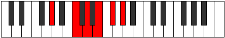

# Mode AFlatBolitonic

## Links

- [Documentation](index.md)
- [Scales Index](Scales.md)
- [Modes Index](Modes.md)
- [Chords Index](Chords.md)

## Scale

[Bolitonic](ScaleBolitonic.md)

## Mode

[AFlatBolitonic](ModeAFlatBolitonic.md)

## Tonic

Ab

## Signature

[CNaturalMajor]

## Perfection

 - 0 Perfect Notes

 - 5 Imperfect Notes

## Notes

- Ab (Imperfect)
- C (Imperfect)
- D (Imperfect)
- E (Imperfect)
- Gb (Imperfect)
- Ab (Imperfect)

## Illustration

## Relative Modes

| Number | Mode | Tonic | Notes | Illustration |
|--------|------|-------|-------|--------------|
| [341](https://ianring.com/musictheory/scales/341) | [Bothitonic](ModeBothitonic.md) | C | C, D, E, F#, G#, C |  |
| [1109](https://ianring.com/musictheory/scales/1109) | [Kataditonic](ModeKataditonic.md) | D | D, E, F#, G#, C, D |  |
| [1301](https://ianring.com/musictheory/scales/1301) | [Koditonic](ModeKoditonic.md) | E | E, F#, G#, C, D, E |  |
| [1349](https://ianring.com/musictheory/scales/1349) | [Tholitonic](ModeTholitonic.md) | F# | F#, G#, C, D, E, F# |  |
| [1349](https://ianring.com/musictheory/scales/1349) | [Tholitonic](ModeTholitonic.md) | Gb | Gb, Ab, C, D, E, Gb |  |
| [1361](https://ianring.com/musictheory/scales/1361) | [Bolitonic](ModeBolitonic.md) | G# | G#, C, D, E, F#, G# |  |
| [1361](https://ianring.com/musictheory/scales/1361) | [Bolitonic](ModeBolitonic.md) | Ab | Ab, C, D, E, Gb, Ab |  |

## Chords

### Ab

| Number | Root | Name | Notes | Illustration | Audio |
|--------|------|------|-------|--------------|-------|
| 261 | Ab | [AbMb5](ChordAFlatMajorFlatFifth.md) | Ab, C, Ebb |  | [midi](ChordAFlatMajorFlatFifthRootPosition.mid) [ogg](ChordAFlatMajorFlatFifthRootPosition.ogg) |
| 273 | Ab | [Ab+](ChordAFlatAugmented.md) | Ab, C, E |  | [midi](ChordAFlatAugmentedRootPosition.mid) [ogg](ChordAFlatAugmentedRootPosition.ogg) |
| 273 | Ab | [Ab+7](ChordAFlatAugmentedAugmentedSeventh.md) | Ab, C, E, G# |  | [midi](ChordAFlatAugmentedAugmentedSeventhRootPosition.mid) [ogg](ChordAFlatAugmentedAugmentedSeventhRootPosition.ogg) |
| 325 | Ab | [Ab7b5](ChordAFlatDominantSeventhFlatFifth.md) | Ab, C, Ebb, Gb |  | [midi](ChordAFlatDominantSeventhFlatFifthRootPosition.mid) [ogg](ChordAFlatDominantSeventhFlatFifthRootPosition.ogg) |

### C

| Number | Root | Name | Notes | Illustration | Audio |
|--------|------|------|-------|--------------|-------|
| 69 | C | [Csus2b5](ChordCNaturalSuspendedSecondFlatFifth.md) | C, D, Gb |  | [midi](ChordCNaturalSuspendedSecondFlatFifthRootPosition.mid) [ogg](ChordCNaturalSuspendedSecondFlatFifthRootPosition.ogg) |
| 81 | C | [CMb5](ChordCNaturalMajorFlatFifth.md) | C, E, Gb |  | [midi](ChordCNaturalMajorFlatFifthRootPosition.mid) [ogg](ChordCNaturalMajorFlatFifthRootPosition.ogg) |
| 261 | C | [Csus2#5](ChordCNaturalSuspendedSecondSharpFifth.md) | C, D, G# |  | [midi](ChordCNaturalSuspendedSecondSharpFifthRootPosition.mid) [ogg](ChordCNaturalSuspendedSecondSharpFifthRootPosition.ogg) |
| 273 | C | [C+](ChordCNaturalAugmented.md) | C, E, G# |  | [midi](ChordCNaturalAugmentedRootPosition.mid) [ogg](ChordCNaturalAugmentedRootPosition.ogg) |
| 273 | C | [C+7](ChordCNaturalAugmentedAugmentedSeventh.md) | C, E, G#, B# |  | [midi](ChordCNaturalAugmentedAugmentedSeventhRootPosition.mid) [ogg](ChordCNaturalAugmentedAugmentedSeventhRootPosition.ogg) |
| 325 | C | [Csus2b5add(#5)](ChordCNaturalSuspendedSecondFlatFifthAddSharpFifth.md) | C, D, Gb, G# |  | [midi](ChordCNaturalSuspendedSecondFlatFifthAddSharpFifthRootPosition.mid) [ogg](ChordCNaturalSuspendedSecondFlatFifthAddSharpFifthRootPosition.ogg) |

### D

| Number | Root | Name | Notes | Illustration | Audio |
|--------|------|------|-------|--------------|-------|
| 276 | D | [Dsus2b5](ChordDNaturalSuspendedSecondFlatFifth.md) | D, E, Ab |  | [midi](ChordDNaturalSuspendedSecondFlatFifthRootPosition.mid) [ogg](ChordDNaturalSuspendedSecondFlatFifthRootPosition.ogg) |
| 324 | D | [DMb5](ChordDNaturalMajorFlatFifth.md) | D, F#, Ab |  | [midi](ChordDNaturalMajorFlatFifthRootPosition.mid) [ogg](ChordDNaturalMajorFlatFifthRootPosition.ogg) |
| 325 | D | [D7b5](ChordDNaturalDominantSeventhFlatFifth.md) | D, F#, Ab, C |  | [midi](ChordDNaturalDominantSeventhFlatFifthRootPosition.mid) [ogg](ChordDNaturalDominantSeventhFlatFifthRootPosition.ogg) |

### E

| Number | Root | Name | Notes | Illustration | Audio |
|--------|------|------|-------|--------------|-------|
| 81 | E | [Esus2#5](ChordENaturalSuspendedSecondSharpFifth.md) | E, F#, B# |  | [midi](ChordENaturalSuspendedSecondSharpFifthRootPosition.mid) [ogg](ChordENaturalSuspendedSecondSharpFifthRootPosition.ogg) |
| 273 | E | [E+](ChordENaturalAugmented.md) | E, G#, B# |  | [midi](ChordENaturalAugmentedRootPosition.mid) [ogg](ChordENaturalAugmentedRootPosition.ogg) |
| 273 | E | [E+7](ChordENaturalAugmentedAugmentedSeventh.md) | E, G#, B#, D## |  | [midi](ChordENaturalAugmentedAugmentedSeventhRootPosition.mid) [ogg](ChordENaturalAugmentedAugmentedSeventhRootPosition.ogg) |

### Gb

| Number | Root | Name | Notes | Illustration | Audio |
|--------|------|------|-------|--------------|-------|
| 321 | Gb | [Gbsus2b5](ChordGFlatSuspendedSecondFlatFifth.md) | Gb, Ab, Dbb |  | [midi](ChordGFlatSuspendedSecondFlatFifthRootPosition.mid) [ogg](ChordGFlatSuspendedSecondFlatFifthRootPosition.ogg) |
| 324 | Gb | [Gbsus2#5](ChordGFlatSuspendedSecondSharpFifth.md) | Gb, Ab, D |  | [midi](ChordGFlatSuspendedSecondSharpFifthRootPosition.mid) [ogg](ChordGFlatSuspendedSecondSharpFifthRootPosition.ogg) |
| 325 | Gb | [Gbsus2b5add(#5)](ChordGFlatSuspendedSecondFlatFifthAddSharpFifth.md) | Gb, Ab, Dbb, D |  | [midi](ChordGFlatSuspendedSecondFlatFifthAddSharpFifthRootPosition.mid) [ogg](ChordGFlatSuspendedSecondFlatFifthAddSharpFifthRootPosition.ogg) |

