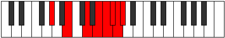
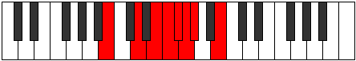
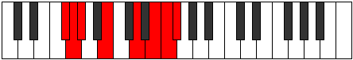
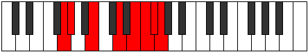
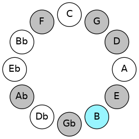
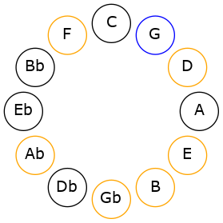

# Mode AFlatBonian

## Links

- [Documentation](README.md)
- [Scales Index](Scales.md)
- [Modes Index](Modes.md)
- [Chords Index](Chords.md)

## Scale

[Bonian](ScaleBonian.md)

## Mode

[AFlatBonian](ModeAFlatBonian.md)

## Tonic

Ab

## Signature

[CNaturalMajor]

## Transposition

3, 3, 2, 1, 1, 1, 1

## Chord Pattern

v⁰b3

## Perfection

 - 3 Perfect Notes

 - 4 Imperfect Notes

## Notes

- Ab (Imperfect)
- B
- C## (Imperfect)
- D##
- E# (Imperfect)
- F# (Imperfect)
- G
- Ab (Imperfect)

## Illustration

## Diagram

## Relative Modes

| Number | Mode | Tonic | Notes | Illustration |
|--------|------|-------|-------|--------------|
| [3913](https://ianring.com/musictheory/scales/3913) | [Bonian](ModeBonian.md) | Ab | Ab, B, C##, D##, E#, F#, G, Ab |  |
| [1001](https://ianring.com/musictheory/scales/1001) | [Badian](ModeBadian.md) | B | B, C##, D##, E#, F#, G, Ab, B |  |
| [3367](https://ianring.com/musictheory/scales/3367) | [Moptian](ModeMoptian.md) | F# | F#, G, Ab, B, C##, D##, E#, F# |  |
| [3731](https://ianring.com/musictheory/scales/3731) | [Aeryrian](ModeAeryrian.md) | G | G, Ab, B, C##, D##, E#, F#, G |  |
## Relative Brightness

| Number | Mode | Tonic | Notes | Illustration |
|--------|------|-------|-------|--------------|
| [3913](https://ianring.com/musictheory/scales/3913) | [Bonian](ModeBonian.md) | Ab | Ab, B, C##, D##, E#, F#, G, Ab |  |
| [1001](https://ianring.com/musictheory/scales/1001) | [Badian](ModeBadian.md) | B | B, C##, D##, E#, F#, G, Ab, B |  |
| [3367](https://ianring.com/musictheory/scales/3367) | [Moptian](ModeMoptian.md) | F# | F#, G, Ab, B, C##, D##, E#, F# |  |
| [3731](https://ianring.com/musictheory/scales/3731) | [Aeryrian](ModeAeryrian.md) | G | G, Ab, B, C##, D##, E#, F#, G |  |

## Chords

### Ab

| Number | Root | Name | Notes | Illustration | Audio |
|--------|------|------|-------|--------------|-------|
| 2308 | Ab | [Abo](ChordAFlatDiminished.md) | Ab, Cb, Ebb |  | [midi](ChordAFlatDiminishedRootPosition.mid) |
| 2320 | Ab | [Abm#5](ChordAFlatMinorSharpFifth.md) | Ab, Cb, Fb |  | [midi](ChordAFlatMinorSharpFifthRootPosition.mid) |
| 2340 | Ab | [Abo7](ChordAFlatFullDiminishedSeventh.md) | Ab, Cb, Ebb, Gbb |  | [midi](ChordAFlatFullDiminishedSeventhRootPosition.mid) |
| 2372 | Ab | [Abø7](ChordAFlatHalfDiminishedSeventh.md) | Ab, Cb, Ebb, Gb |  | [midi](ChordAFlatHalfDiminishedSeventhRootPosition.mid) |
| 2384 | Ab | [Abm7#5](ChordAFlatMinorSeventhSharpFifth.md) | Ab, Cb, E, Gb |  | [midi](ChordAFlatMinorSeventhSharpFifthRootPosition.mid) |
| 2436 | Ab | [AboM7](ChordAFlatDiminishedMajorSeventh.md) | Ab, Cb, Ebb, G |  | [midi](ChordAFlatDiminishedMajorSeventhRootPosition.mid) |

### B

| Number | Root | Name | Notes | Illustration | Audio |
|--------|------|------|-------|--------------|-------|
| 2068 | B | [Bmbb5](ChordBNaturalMinorDoubleFlatFifth.md) | B, D, E |  | [midi](ChordBNaturalMinorDoubleFlatFifthRootPosition.mid) |
| 2084 | B | [Bo](ChordBNaturalDiminished.md) | B, D, F |  | [midi](ChordBNaturalDiminishedRootPosition.mid) |
| 2096 | B | [Bsus4b5](ChordBNaturalSuspendedFourthFlatFifth.md) | B, E, F |  | [midi](ChordBNaturalSuspendedFourthFlatFifthRootPosition.mid) |
| 2112 | B | [B5](ChordBNaturalPowerChord.md) | B, F# |  | [midi](ChordBNaturalPowerChordRootPosition.mid) |
| 2116 | B | [Bm](ChordBNaturalMinor.md) | B, D, F# |  | [midi](ChordBNaturalMinorRootPosition.mid) |
| 2116 | B | [Bm(add(#9))](ChordBNaturalMinorAddSharpNinth.md) | B, D, F#, C## |  | [midi](ChordBNaturalMinorAddSharpNinthRootPosition.mid) |
| 2128 | B | [Bsus4](ChordBNaturalSuspendedFourth.md) | B, E, F# |  | [midi](ChordBNaturalSuspendedFourthRootPosition.mid) |
| 2132 | B | [Bm(add11)](ChordBNaturalMinorAddEleventh.md) | B, D, F#, E |  | [midi](ChordBNaturalMinorAddEleventhRootPosition.mid) |
| 2132 | B | [Bm(add4)](ChordBNaturalMinorAddFourth.md) | B, D, E, F# |  | [midi](ChordBNaturalMinorAddFourthRootPosition.mid) |
| 2144 | B | [Blyd](ChordBNaturalLydian.md) | B, E#, F# |  | [midi](ChordBNaturalLydianRootPosition.mid) |
| 2148 | B | [Bm(add(#4))](ChordBNaturalMinorAddSharpFourth.md) | B, D, E#, F# |  | [midi](ChordBNaturalMinorAddSharpFourthRootPosition.mid) |
| 2180 | B | [Bm#5](ChordBNaturalMinorSharpFifth.md) | B, D, G |  | [midi](ChordBNaturalMinorSharpFifthRootPosition.mid) |
| 2192 | B | [Bsus4#5](ChordBNaturalSuspendedFourthSharpFifth.md) | B, E, F## |  | [midi](ChordBNaturalSuspendedFourthSharpFifthRootPosition.mid) |
| 2320 | B | [Bsus4##5](ChordBNaturalSuspendedFourthDoubleSharpFifth.md) | B, E, G# |  | [midi](ChordBNaturalSuspendedFourthDoubleSharpFifthRootPosition.mid) |
| 2340 | B | [Bo7](ChordBNaturalFullDiminishedSeventh.md) | B, D, F, Ab |  | [midi](ChordBNaturalFullDiminishedSeventhRootPosition.mid) |
| 2372 | B | [Bm6](ChordBNaturalMinorSixth.md) | B, D, F#, G# |  | [midi](ChordBNaturalMinorSixthRootPosition.mid) |
| 2384 | B | [BM6sus4](ChordBNaturalMajorSixthSuspendedFourth.md) | B, E, F#, G# |  | [midi](ChordBNaturalMajorSixthSuspendedFourthRootPosition.mid) |

### C##

| Number | Root | Name | Notes | Illustration | Audio |
|--------|------|------|-------|--------------|-------|

### D##

| Number | Root | Name | Notes | Illustration | Audio |
|--------|------|------|-------|--------------|-------|

### E#

| Number | Root | Name | Notes | Illustration | Audio |
|--------|------|------|-------|--------------|-------|

### F#

| Number | Root | Name | Notes | Illustration | Audio |
|--------|------|------|-------|--------------|-------|
| 2368 | F# | [F#sus2bb5](ChordFSharpSuspendedSecondDoubleFlatFifth.md) | F#, G#, B |  | [midi](ChordFSharpSuspendedSecondDoubleFlatFifthRootPosition.mid) |
| 324 | F# | [F#sus2#5](ChordFSharpSuspendedSecondSharpFifth.md) | F#, G#, C## |  | [midi](ChordFSharpSuspendedSecondSharpFifthRootPosition.mid) |
| 2116 | F# | [F#sus4#5](ChordFSharpSuspendedFourthSharpFifth.md) | F#, B, C## |  | [midi](ChordFSharpSuspendedFourthSharpFifthRootPosition.mid) |
| 2128 | F# | [F#Q](ChordFSharpQuartal.md) | F#, B, E |  | [midi](ChordFSharpQuartalRootPosition.mid) |
| 2144 | F# | [F#Q+](ChordFSharpQuartalAugmented.md) | F#, B, E# |  | [midi](ChordFSharpQuartalAugmentedRootPosition.mid) |
| 2148 | F# | [F#M7(sus4)#5](ChordFSharpMajorSeventhSuspendedFourthSharpFifth.md) | F#, B, C##, E# |  | [midi](ChordFSharpMajorSeventhSuspendedFourthSharpFifthRootPosition.mid) |

### G

| Number | Root | Name | Notes | Illustration | Audio |
|--------|------|------|-------|--------------|-------|
| 132 | G | [G5](ChordGNaturalPowerChord.md) | G, D |  | [midi](ChordGNaturalPowerChordRootPosition.mid) |
| 388 | G | [Gphryg](ChordGNaturalPhrygian.md) | G, Ab, D |  | [midi](ChordGNaturalPhrygianRootPosition.mid) |
| 2180 | G | [GM](ChordGNaturalMajor.md) | G, B, D |  | [midi](ChordGNaturalMajorRootPosition.mid) |
| 2192 | G | [GM##5](ChordGNaturalMajorDoubleSharpFifth.md) | G, B, E |  | [midi](ChordGNaturalMajorDoubleSharpFifthRootPosition.mid) |
| 2196 | G | [GM6](ChordGNaturalMajorSixth.md) | G, B, D, E |  | [midi](ChordGNaturalMajorSixthRootPosition.mid) |
| 2452 | G | [GM6(addb9)](ChordGNaturalMajorSixthAddFlatNinth.md) | G, B, D, E, Ab |  | [midi](ChordGNaturalMajorSixthAddFlatNinthRootPosition.mid) |
| 2212 | G | [G7](ChordGNaturalDominantSeventh.md) | G, B, D, F |  | [midi](ChordGNaturalDominantSeventhRootPosition.mid) |
| 2468 | G | [G7b9](ChordGNaturalDominantSeventhFlatNinth.md) | G, B, D, F, Ab |  | [midi](ChordGNaturalDominantSeventhFlatNinthRootPosition.mid) |
| 2228 | G | [G7add13](ChordGNaturalDominantSeventhAddThirteenth.md) | G, B, D, F, E |  | [midi](ChordGNaturalDominantSeventhAddThirteenthRootPosition.mid) |
| 452 | G | [Gphryg+7](ChordGNaturalPhrygianAddSeventh.md) | G, Ab, D, F# |  | [midi](ChordGNaturalPhrygianAddSeventhRootPosition.mid) |
| 2244 | G | [GM7](ChordGNaturalMajorSeventh.md) | G, B, D, F# |  | [midi](ChordGNaturalMajorSeventhRootPosition.mid) |
| 2256 | G | [GM7##5](ChordGNaturalMajorSeventhDoubleSharpFifth.md) | G, B, E, F# |  | [midi](ChordGNaturalMajorSeventhDoubleSharpFifthRootPosition.mid) |
| 2260 | G | [GM7add13](ChordGNaturalMajorSeventhAddThirteenth.md) | G, B, D, F#, E |  | [midi](ChordGNaturalMajorSeventhAddThirteenthRootPosition.mid) |

