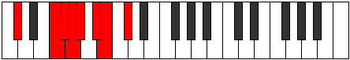

# Mode AFlatBoptian

## Links

- [Documentation](index.md)
- [Scales Index](Scales.md)
- [Modes Index](Modes.md)
- [Chords Index](Chords.md)

## Scale

[Saptian](ScaleSaptian.md)

## Mode

[AFlatBoptian](ModeAFlatBoptian.md)

## Tonic

Ab

## Signature

[CNaturalMajor]

## Perfection

 - 4 Perfect Notes

 - 3 Imperfect Notes

## Notes

- Ab (Imperfect)
- Bb
- Cb
- Db
- E# (Imperfect)
- F#
- G (Imperfect)
- Ab (Imperfect)

## Illustration

## Relative Modes

| Number | Mode | Tonic | Notes | Illustration |
|--------|------|-------|-------|--------------|
| [3629](https://ianring.com/musictheory/scales/3629) | [Boptian](ModeBoptian.md) | Ab | Ab, Bb, Cb, Db, E#, F#, G, Ab |  |
| [1931](https://ianring.com/musictheory/scales/1931) | [Stogian](ModeStogian.md) | Bb | Bb, Cb, Db, E#, F#, G, Ab, Bb |  |
| [1777](https://ianring.com/musictheory/scales/1777) | [Saptian](ModeSaptian.md) | Db | Db, E#, F#, G, Ab, Bb, Cb, Db |  |
| [2231](https://ianring.com/musictheory/scales/2231) | [Macrian](ModeMacrian.md) | F# | F#, G, Ab, Bb, Cb, Db, E#, F# |  |
| [3163](https://ianring.com/musictheory/scales/3163) | [Rogian](ModeRogian.md) | G | G, Ab, Bb, Cb, Db, E#, F#, G |  |

## Chords

### Ab

| Number | Root | Name | Notes | Illustration | Audio |
|--------|------|------|-------|--------------|-------|

### Bb

| Number | Root | Name | Notes | Illustration | Audio |
|--------|------|------|-------|--------------|-------|

### Cb

| Number | Root | Name | Notes | Illustration | Audio |
|--------|------|------|-------|--------------|-------|

### Db

| Number | Root | Name | Notes | Illustration | Audio |
|--------|------|------|-------|--------------|-------|

### E#

| Number | Root | Name | Notes | Illustration | Audio |
|--------|------|------|-------|--------------|-------|

### F#

| Number | Root | Name | Notes | Illustration | Audio |
|--------|------|------|-------|--------------|-------|

### G

| Number | Root | Name | Notes | Illustration | Audio |
|--------|------|------|-------|--------------|-------|

