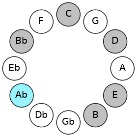
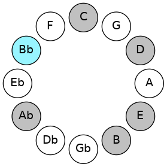

# Mode AFlatBorimic

## Links

- [Documentation](README.md)
- [Scales Index](Scales.md)
- [Modes Index](Modes.md)
- [Chords Index](Chords.md)

## Scale

[Gacrimic](ScaleGacrimic.md)

## Mode

[AFlatBorimic](ModeAFlatBorimic.md)

## Tonic

Ab

## Signature

[CNaturalMajor]

## Interval Pattern

2, 1, 1, 2, 2, 4

## Chord Pattern

i⁰, ii⁰b3

## Perfection

 - 1 Perfect Notes

 - 5 Imperfect Notes

## Notes

- Ab (Imperfect)
- Bb (Imperfect)
- Cb (Imperfect)
- Dbb (Imperfect)
- Ebb (Imperfect)
- Fb
- Ab (Imperfect)

## Illustration

## Diagram

## Relative Modes

| Number | Mode | Tonic | Notes | Illustration |
|--------|------|-------|-------|--------------|
| [349](https://ianring.com/musictheory/scales/349) | [Borimic](ModeBorimic.md) | Ab | Ab, Bb, Cb, Dbb, Ebb, Fb, Ab |  |
| [1111](https://ianring.com/musictheory/scales/1111) | [Sycrimic](ModeSycrimic.md) | Bb | Bb, Cb, Dbb, Ebb, Fb, G#, Bb |  |
## Relative Brightness

| Number | Mode | Tonic | Notes | Illustration |
|--------|------|-------|-------|--------------|
| [349](https://ianring.com/musictheory/scales/349) | [Borimic](ModeBorimic.md) | Ab | Ab, Bb, Cb, Dbb, Ebb, Fb, Ab |  |
| [1111](https://ianring.com/musictheory/scales/1111) | [Sycrimic](ModeSycrimic.md) | Bb | Bb, Cb, Dbb, Ebb, Fb, G#, Bb |  |

## Chords

### Ab

| Number | Root | Name | Notes | Illustration | Audio |
|--------|------|------|-------|--------------|-------|
| 1284 | Ab | [Ab](ChordAFlatDiminishedFlatThird.md) | Ab, Cbb, Ebb |  | [midi](ChordAFlatDiminishedFlatThirdRootPosition.mid) |
| 1284 | Ab | [Absus2b5](ChordAFlatSuspendedSecondFlatFifth.md) | Ab, Bb, Ebb |  | [midi](ChordAFlatSuspendedSecondFlatFifthRootPosition.mid) |
| 2308 | Ab | [Abo](ChordAFlatDiminished.md) | Ab, Cb, Ebb |  | [midi](ChordAFlatDiminishedRootPosition.mid) |
| 261 | Ab | [AbMb5](ChordAFlatMajorFlatFifth.md) | Ab, C, Ebb |  | [midi](ChordAFlatMajorFlatFifthRootPosition.mid) |
| 1296 | Ab | [Absus2#5](ChordAFlatSuspendedSecondSharpFifth.md) | Ab, Bb, E |  | [midi](ChordAFlatSuspendedSecondSharpFifthRootPosition.mid) |
| 2320 | Ab | [Abm#5](ChordAFlatMinorSharpFifth.md) | Ab, Cb, Fb |  | [midi](ChordAFlatMinorSharpFifthRootPosition.mid) |
| 273 | Ab | [Ab+](ChordAFlatAugmented.md) | Ab, C, E |  | [midi](ChordAFlatAugmentedRootPosition.mid) |
| 273 | Ab | [Ab+7](ChordAFlatAugmentedAugmentedSeventh.md) | Ab, C, E, G# |  | [midi](ChordAFlatAugmentedAugmentedSeventhRootPosition.mid) |
| 1300 | Ab | [Absus2b5add(#5)](ChordAFlatSuspendedSecondFlatFifthAddSharpFifth.md) | Ab, Bb, Ebb, E |  | [midi](ChordAFlatSuspendedSecondFlatFifthAddSharpFifthRootPosition.mid) |

### Bb

| Number | Root | Name | Notes | Illustration | Audio |
|--------|------|------|-------|--------------|-------|
| 3088 | Bb | [Bbloc](ChordBFlatLocrian.md) | Bb, Cb, Fb |  | [midi](ChordBFlatLocrianRootPosition.mid) |
| 1041 | Bb | [Bb](ChordBFlatDiminishedFlatThird.md) | Bb, Dbb, Fb |  | [midi](ChordBFlatDiminishedFlatThirdRootPosition.mid) |
| 1041 | Bb | [Bbsus2b5](ChordBFlatSuspendedSecondFlatFifth.md) | Bb, C, Fb |  | [midi](ChordBFlatSuspendedSecondFlatFifthRootPosition.mid) |
| 1044 | Bb | [BbMb5](ChordBFlatMajorFlatFifth.md) | Bb, D, Fb |  | [midi](ChordBFlatMajorFlatFifthRootPosition.mid) |
| 1300 | Bb | [Bb7b5](ChordBFlatDominantSeventhFlatFifth.md) | Bb, D, Fb, Ab |  | [midi](ChordBFlatDominantSeventhFlatFifthRootPosition.mid) |
| 3348 | Bb | [Bb7b5b9](ChordBFlatDominantSeventhFlatFifthFlatNinth.md) | Bb, D, Fb, Ab, Cb |  | [midi](ChordBFlatDominantSeventhFlatFifthFlatNinthRootPosition.mid) |

### Cb

| Number | Root | Name | Notes | Illustration | Audio |
|--------|------|------|-------|--------------|-------|

### Dbb

| Number | Root | Name | Notes | Illustration | Audio |
|--------|------|------|-------|--------------|-------|

### Ebb

| Number | Root | Name | Notes | Illustration | Audio |
|--------|------|------|-------|--------------|-------|

### Fb

| Number | Root | Name | Notes | Illustration | Audio |
|--------|------|------|-------|--------------|-------|

