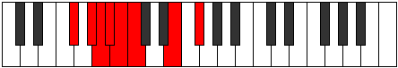

# Mode AFlatBynian

## Links

- [Documentation](index.md)
- [Scales Index](Scales.md)
- [Modes Index](Modes.md)
- [Chords Index](Chords.md)

## Scale

[Pythian](ScalePythian.md)

## Mode

[AFlatBynian](ModeAFlatBynian.md)

## Tonic

Ab

## Signature

[CNaturalMajor]

## Interval Pattern

1, 1, 1, 1, 4, 2, 2

## Chord Pattern

## Perfection

 - 3 Perfect Notes

 - 4 Imperfect Notes

## Notes

- Ab (Imperfect)
- Bbb
- Cbb (Imperfect)
- Dbbb
- Dbb (Imperfect)
- E
- F# (Imperfect)
- Ab (Imperfect)

## Illustration

## Relative Modes

| Number | Mode | Tonic | Notes | Illustration |
|--------|------|-------|-------|--------------|
| [1311](https://ianring.com/musictheory/scales/1311) | [Bynian](ModeBynian.md) | Ab | Ab, Bbb, Cbb, Dbbb, Dbb, E, F#, Ab |  |
| [501](https://ianring.com/musictheory/scales/501) | [Katylian](ModeKatylian.md) | E | E, F#, G#, A, Bb, Cb, Dbb, E |  |
| [1149](https://ianring.com/musictheory/scales/1149) | [Bydian](ModeBydian.md) | F# | F#, G#, A, Bb, Cb, Dbb, E, F# |  |

## Chords

### Ab

| Number | Root | Name | Notes | Illustration | Audio |
|--------|------|------|-------|--------------|-------|
| 1296 | Ab | [Absus2#5](ChordAFlatSuspendedSecondSharpFifth.md) | Ab, Bb, E |  | [midi](ChordAFlatSuspendedSecondSharpFifthRootPosition.mid) |
| 2320 | Ab | [Abm#5](ChordAFlatMinorSharpFifth.md) | Ab, Cb, Fb |  | [midi](ChordAFlatMinorSharpFifthRootPosition.mid) |
| 273 | Ab | [Ab+](ChordAFlatAugmented.md) | Ab, C, E |  | [midi](ChordAFlatAugmentedRootPosition.mid) |
| 273 | Ab | [Ab+7](ChordAFlatAugmentedAugmentedSeventh.md) | Ab, C, E, G# |  | [midi](ChordAFlatAugmentedAugmentedSeventhRootPosition.mid) |
| 2384 | Ab | [Abm7#5](ChordAFlatMinorSeventhSharpFifth.md) | Ab, Cb, E, Gb |  | [midi](ChordAFlatMinorSeventhSharpFifthRootPosition.mid) |
| 849 | Ab | [Ab7#5b9](ChordAFlatDominantSeventhSharpFifthFlatNinth.md) | Ab, C, E, Gb, Bbb |  | [midi](ChordAFlatDominantSeventhSharpFifthFlatNinthRootPosition.mid) |

### Bbb

| Number | Root | Name | Notes | Illustration | Audio |
|--------|------|------|-------|--------------|-------|

### Cbb

| Number | Root | Name | Notes | Illustration | Audio |
|--------|------|------|-------|--------------|-------|

### Dbbb

| Number | Root | Name | Notes | Illustration | Audio |
|--------|------|------|-------|--------------|-------|

### Dbb

| Number | Root | Name | Notes | Illustration | Audio |
|--------|------|------|-------|--------------|-------|

### E

| Number | Root | Name | Notes | Illustration | Audio |
|--------|------|------|-------|--------------|-------|
| 592 | E | [Esus2bb5](ChordENaturalSuspendedSecondDoubleFlatFifth.md) | E, F#, A |  | [midi](ChordENaturalSuspendedSecondDoubleFlatFifthRootPosition.mid) |
| 1104 | E | [Esus2b5](ChordENaturalSuspendedSecondFlatFifth.md) | E, F#, Bb |  | [midi](ChordENaturalSuspendedSecondFlatFifthRootPosition.mid) |
| 1296 | E | [EMb5](ChordENaturalMajorFlatFifth.md) | E, G#, Bb |  | [midi](ChordENaturalMajorFlatFifthRootPosition.mid) |
| 1552 | E | [Esus4b5](ChordENaturalSuspendedFourthFlatFifth.md) | E, A, Bb |  | [midi](ChordENaturalSuspendedFourthFlatFifthRootPosition.mid) |
| 2064 | E | [E5](ChordENaturalPowerChord.md) | E, B |  | [midi](ChordENaturalPowerChordRootPosition.mid) |
| 2128 | E | [Esus2](ChordENaturalSuspendedSecond.md) | E, F#, B |  | [midi](ChordENaturalSuspendedSecondRootPosition.mid) |
| 2320 | E | [EM](ChordENaturalMajor.md) | E, G#, B |  | [midi](ChordENaturalMajorRootPosition.mid) |
| 2384 | E | [EM(add9)](ChordENaturalMajorAddNinth.md) | E, G#, B, F# |  | [midi](ChordENaturalMajorAddNinthRootPosition.mid) |
| 2576 | E | [Esus4](ChordENaturalSuspendedFourth.md) | E, A, B |  | [midi](ChordENaturalSuspendedFourthRootPosition.mid) |
| 2832 | E | [EM(add11)](ChordENaturalMajorAddEleventh.md) | E, G#, B, A |  | [midi](ChordENaturalMajorAddEleventhRootPosition.mid) |
| 2832 | E | [EM(add4)](ChordENaturalMajorAddFourth.md) | E, G#, A, B |  | [midi](ChordENaturalMajorAddFourthRootPosition.mid) |
| 3088 | E | [Elyd](ChordENaturalLydian.md) | E, A#, B |  | [midi](ChordENaturalLydianRootPosition.mid) |
| 3344 | E | [EM(add(#4))](ChordENaturalMajorAddSharpFourth.md) | E, G#, A#, B |  | [midi](ChordENaturalMajorAddSharpFourthRootPosition.mid) |
| 81 | E | [Esus2#5](ChordENaturalSuspendedSecondSharpFifth.md) | E, F#, B# |  | [midi](ChordENaturalSuspendedSecondSharpFifthRootPosition.mid) |
| 273 | E | [E+](ChordENaturalAugmented.md) | E, G#, B# |  | [midi](ChordENaturalAugmentedRootPosition.mid) |
| 273 | E | [E+7](ChordENaturalAugmentedAugmentedSeventh.md) | E, G#, B#, D## |  | [midi](ChordENaturalAugmentedAugmentedSeventhRootPosition.mid) |
| 529 | E | [Esus4#5](ChordENaturalSuspendedFourthSharpFifth.md) | E, A, B# |  | [midi](ChordENaturalSuspendedFourthSharpFifthRootPosition.mid) |
| 1105 | E | [Esus2b5add(#5)](ChordENaturalSuspendedSecondFlatFifthAddSharpFifth.md) | E, F#, Bb, B# |  | [midi](ChordENaturalSuspendedSecondFlatFifthAddSharpFifthRootPosition.mid) |

### F#

| Number | Root | Name | Notes | Illustration | Audio |
|--------|------|------|-------|--------------|-------|
| 2368 | F# | [F#sus2bb5](ChordFSharpSuspendedSecondDoubleFlatFifth.md) | F#, G#, B |  | [midi](ChordFSharpSuspendedSecondDoubleFlatFifthRootPosition.mid) |
| 2624 | F# | [F#mbb5](ChordFSharpMinorDoubleFlatFifth.md) | F#, A, B |  | [midi](ChordFSharpMinorDoubleFlatFifthRootPosition.mid) |
| 321 | F# | [F#sus2b5](ChordFSharpSuspendedSecondFlatFifth.md) | F#, G#, C |  | [midi](ChordFSharpSuspendedSecondFlatFifthRootPosition.mid) |
| 577 | F# | [F#o](ChordFSharpDiminished.md) | F#, A, C |  | [midi](ChordFSharpDiminishedRootPosition.mid) |
| 1089 | F# | [F#Mb5](ChordFSharpMajorFlatFifth.md) | F#, A#, C |  | [midi](ChordFSharpMajorFlatFifthRootPosition.mid) |
| 2113 | F# | [F#sus4b5](ChordFSharpSuspendedFourthFlatFifth.md) | F#, B, C |  | [midi](ChordFSharpSuspendedFourthFlatFifthRootPosition.mid) |
| 2128 | F# | [F#Q](ChordFSharpQuartal.md) | F#, B, E |  | [midi](ChordFSharpQuartalRootPosition.mid) |
| 2640 | F# | [F#m7bb5](ChordFSharpMinorSeventhDoubleFlatFifth.md) | F#, A, B, E |  | [midi](ChordFSharpMinorSeventhDoubleFlatFifthRootPosition.mid) |
| 593 | F# | [F#ø7](ChordFSharpHalfDiminishedSeventh.md) | F#, A, C, E |  | [midi](ChordFSharpHalfDiminishedSeventhRootPosition.mid) |
| 1105 | F# | [F#7b5](ChordFSharpDominantSeventhFlatFifth.md) | F#, A#, C, E |  | [midi](ChordFSharpDominantSeventhFlatFifthRootPosition.mid) |

