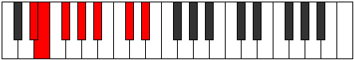

# Mode AFlatByptimic

## Links

- [Documentation](index.md)
- [Scales Index](Scales.md)
- [Modes Index](Modes.md)
- [Chords Index](Chords.md)

## Scale

[Phracrimic](ScalePhracrimic.md)

## Mode

[AFlatByptimic](ModeAFlatByptimic.md)

## Tonic

Ab

## Signature

[CNaturalMajor]

## Perfection

 - 4 Perfect Notes

 - 2 Imperfect Notes

## Notes

- Ab
- Bb (Imperfect)
- C#
- D#
- E (Imperfect)
- F#
- Ab

## Illustration

## Relative Modes

| Number | Mode | Tonic | Notes | Illustration |
|--------|------|-------|-------|--------------|
| [1445](https://ianring.com/musictheory/scales/1445) | [Byptimic](ModeByptimic.md) | Ab | Ab, Bb, C#, D#, E, F#, Ab |  |
| [1385](https://ianring.com/musictheory/scales/1385) | [Phracrimic](ModePhracrimic.md) | Bb | Bb, C#, D#, E, F#, G#, Bb |  |
| [685](https://ianring.com/musictheory/scales/685) | [Aerathimic](ModeAerathimic.md) | C# | C#, D#, E, F#, G#, A#, C# |  |
| [1195](https://ianring.com/musictheory/scales/1195) | [Sarimic](ModeSarimic.md) | D# | D#, E, F#, G#, A#, B##, D# |  |
| [2645](https://ianring.com/musictheory/scales/2645) | [Zoptimic](ModeZoptimic.md) | E | E, F#, G#, A#, B##, C###, E |  |
| [1685](https://ianring.com/musictheory/scales/1685) | [Zeracrimic](ModeZeracrimic.md) | F# | F#, G#, A#, B##, C###, D##, F# |  |

## Chords

### Ab

| Number | Root | Name | Notes | Illustration | Audio |
|--------|------|------|-------|--------------|-------|

### Bb

| Number | Root | Name | Notes | Illustration | Audio |
|--------|------|------|-------|--------------|-------|
| 1034 | Bb | [Bbmbb5](ChordBFlatMinorDoubleFlatFifth.md) | Bb, Db, Eb |  | [midi](ChordBFlatMinorDoubleFlatFifthRootPosition.mid) |
| 1042 | Bb | [Bbo](ChordBFlatDiminished.md) | Bb, Db, Fb |  | [midi](ChordBFlatDiminishedRootPosition.mid) |
| 1048 | Bb | [Bbsus4b5](ChordBFlatSuspendedFourthFlatFifth.md) | Bb, Eb, Fb |  | [midi](ChordBFlatSuspendedFourthFlatFifthRootPosition.mid) |
| 1090 | Bb | [Bbm#5](ChordBFlatMinorSharpFifth.md) | Bb, Db, Gb |  | [midi](ChordBFlatMinorSharpFifthRootPosition.mid) |
| 1096 | Bb | [Bbsus4#5](ChordBFlatSuspendedFourthSharpFifth.md) | Bb, Eb, F# |  | [midi](ChordBFlatSuspendedFourthSharpFifthRootPosition.mid) |
| 1288 | Bb | [BbQ](ChordBFlatQuartal.md) | Bb, Eb, Ab |  | [midi](ChordBFlatQuartalRootPosition.mid) |
| 1290 | Bb | [Bbm7bb5](ChordBFlatMinorSeventhDoubleFlatFifth.md) | Bb, Db, Eb, Ab |  | [midi](ChordBFlatMinorSeventhDoubleFlatFifthRootPosition.mid) |
| 1298 | Bb | [Bbø7](ChordBFlatHalfDiminishedSeventh.md) | Bb, Db, Fb, Ab |  | [midi](ChordBFlatHalfDiminishedSeventhRootPosition.mid) |
| 1346 | Bb | [Bbm7#5](ChordBFlatMinorSeventhSharpFifth.md) | Bb, Db, F#, Ab |  | [midi](ChordBFlatMinorSeventhSharpFifthRootPosition.mid) |

### C#

| Number | Root | Name | Notes | Illustration | Audio |
|--------|------|------|-------|--------------|-------|
| 74 | C# | [C#sus2bb5](ChordCSharpSuspendedSecondDoubleFlatFifth.md) | C#, D#, F# |  | [midi](ChordCSharpSuspendedSecondDoubleFlatFifthRootPosition.mid) |
| 82 | C# | [C#mbb5](ChordCSharpMinorDoubleFlatFifth.md) | C#, E, F# |  | [midi](ChordCSharpMinorDoubleFlatFifthRootPosition.mid) |
| 258 | C# | [C#5](ChordCSharpPowerChord.md) | C#, G# |  | [midi](ChordCSharpPowerChordRootPosition.mid) |
| 266 | C# | [C#sus2](ChordCSharpSuspendedSecond.md) | C#, D#, G# |  | [midi](ChordCSharpSuspendedSecondRootPosition.mid) |
| 274 | C# | [C#m](ChordCSharpMinor.md) | C#, E, G# |  | [midi](ChordCSharpMinorRootPosition.mid) |
| 274 | C# | [C#m(add(#9))](ChordCSharpMinorAddSharpNinth.md) | C#, E, G#, D## |  | [midi](ChordCSharpMinorAddSharpNinthRootPosition.mid) |
| 282 | C# | [C#m(add9)](ChordCSharpMinorAddNinth.md) | C#, E, G#, D# |  | [midi](ChordCSharpMinorAddNinthRootPosition.mid) |
| 322 | C# | [C#sus4](ChordCSharpSuspendedFourth.md) | C#, F#, G# |  | [midi](ChordCSharpSuspendedFourthRootPosition.mid) |
| 338 | C# | [C#m(add11)](ChordCSharpMinorAddEleventh.md) | C#, E, G#, F# |  | [midi](ChordCSharpMinorAddEleventhRootPosition.mid) |
| 338 | C# | [C#m(add4)](ChordCSharpMinorAddFourth.md) | C#, E, F#, G# |  | [midi](ChordCSharpMinorAddFourthRootPosition.mid) |
| 1090 | C# | [C#sus4##5](ChordCSharpSuspendedFourthDoubleSharpFifth.md) | C#, F#, A# |  | [midi](ChordCSharpSuspendedFourthDoubleSharpFifthRootPosition.mid) |
| 1098 | C# | [C#M6sus2bb5](ChordCSharpMajorSixthSuspendedSecondDoubleFlatFifth.md) | C#, D#, F#, A# |  | [midi](ChordCSharpMajorSixthSuspendedSecondDoubleFlatFifthRootPosition.mid) |
| 1290 | C# | [C#M6sus2](ChordCSharpMajorSixthSuspendedSecond.md) | C#, D#, G#, A# |  | [midi](ChordCSharpMajorSixthSuspendedSecondRootPosition.mid) |
| 1290 | C# | [C#7sus2b5](ChordCSharpDominantSeventhSuspendedSecondFlatFifth.md) | C#, D#, G#, Bb |  | [midi](ChordCSharpDominantSeventhSuspendedSecondFlatFifthRootPosition.mid) |
| 1298 | C# | [C#m6](ChordCSharpMinorSixth.md) | C#, E, G#, A# |  | [midi](ChordCSharpMinorSixthRootPosition.mid) |
| 1306 | C# | [C#m6(add9)](ChordCSharpMinorSixthAddNinth.md) | C#, E, G#, A#, D# |  | [midi](ChordCSharpMinorSixthAddNinthRootPosition.mid) |
| 1346 | C# | [C#M6sus4](ChordCSharpMajorSixthSuspendedFourth.md) | C#, F#, G#, A# |  | [midi](ChordCSharpMajorSixthSuspendedFourthRootPosition.mid) |

### D#

| Number | Root | Name | Notes | Illustration | Audio |
|--------|------|------|-------|--------------|-------|
| 328 | D# | [D#mbb5](ChordDSharpMinorDoubleFlatFifth.md) | D#, F#, G# |  | [midi](ChordDSharpMinorDoubleFlatFifthRootPosition.mid) |
| 1032 | D# | [D#5](ChordDSharpPowerChord.md) | D#, A# |  | [midi](ChordDSharpPowerChordRootPosition.mid) |
| 1048 | D# | [D#phryg](ChordDSharpPhrygian.md) | D#, E, A# |  | [midi](ChordDSharpPhrygianRootPosition.mid) |
| 1096 | D# | [D#m](ChordDSharpMinor.md) | D#, F#, A# |  | [midi](ChordDSharpMinorRootPosition.mid) |
| 1096 | D# | [D#m(add(#9))](ChordDSharpMinorAddSharpNinth.md) | D#, F#, A#, E## |  | [midi](ChordDSharpMinorAddSharpNinthRootPosition.mid) |
| 1288 | D# | [D#sus4](ChordDSharpSuspendedFourth.md) | D#, G#, A# |  | [midi](ChordDSharpSuspendedFourthRootPosition.mid) |
| 1352 | D# | [D#m(add11)](ChordDSharpMinorAddEleventh.md) | D#, F#, A#, G# |  | [midi](ChordDSharpMinorAddEleventhRootPosition.mid) |
| 1352 | D# | [D#m(add4)](ChordDSharpMinorAddFourth.md) | D#, F#, G#, A# |  | [midi](ChordDSharpMinorAddFourthRootPosition.mid) |
| 266 | D# | [D#Q](ChordDSharpQuartal.md) | D#, G#, C# |  | [midi](ChordDSharpQuartalRootPosition.mid) |
| 330 | D# | [D#m7bb5](ChordDSharpMinorSeventhDoubleFlatFifth.md) | D#, F#, G#, C# |  | [midi](ChordDSharpMinorSeventhDoubleFlatFifthRootPosition.mid) |
| 1098 | D# | [D#m7](ChordDSharpMinorSeventh.md) | D#, F#, A#, C# |  | [midi](ChordDSharpMinorSeventhRootPosition.mid) |
| 1114 | D# | [D#m7b9](ChordDSharpMinorSeventhFlatNinth.md) | D#, F#, A#, C#, E |  | [midi](ChordDSharpMinorSeventhFlatNinthRootPosition.mid) |
| 1290 | D# | [D#7sus4](ChordDSharpDominantSeventhSuspendedFourth.md) | D#, G#, A#, C# |  | [midi](ChordDSharpDominantSeventhSuspendedFourthRootPosition.mid) |
| 1354 | D# | [D#m7add11](ChordDSharpMinorSeventhAddEleventh.md) | D#, F#, A#, C#, G# |  | [midi](ChordDSharpMinorSeventhAddEleventhRootPosition.mid) |

### E

| Number | Root | Name | Notes | Illustration | Audio |
|--------|------|------|-------|--------------|-------|
| 1104 | E | [Esus2b5](ChordENaturalSuspendedSecondFlatFifth.md) | E, F#, Bb |  | [midi](ChordENaturalSuspendedSecondFlatFifthRootPosition.mid) |
| 1296 | E | [EMb5](ChordENaturalMajorFlatFifth.md) | E, G#, Bb |  | [midi](ChordENaturalMajorFlatFifthRootPosition.mid) |
| 274 | E | [EM##5](ChordENaturalMajorDoubleSharpFifth.md) | E, G#, C# |  | [midi](ChordENaturalMajorDoubleSharpFifthRootPosition.mid) |
| 1106 | E | [EM6sus2b5](ChordENaturalMajorSixthSuspendedSecondFlatFifth.md) | E, F#, Bb, C# |  | [midi](ChordENaturalMajorSixthSuspendedSecondFlatFifthRootPosition.mid) |
| 1298 | E | [EM6b5](ChordENaturalMajorSixthFlatFifth.md) | E, G#, Bb, C# |  | [midi](ChordENaturalMajorSixthFlatFifthRootPosition.mid) |
| 1304 | E | [EM7b5](ChordENaturalMajorSeventhFlatFifth.md) | E, G#, Bb, D# |  | [midi](ChordENaturalMajorSeventhFlatFifthRootPosition.mid) |
| 282 | E | [EM7##5](ChordENaturalMajorSeventhDoubleSharpFifth.md) | E, G#, C#, D# |  | [midi](ChordENaturalMajorSeventhDoubleSharpFifthRootPosition.mid) |

### F#

| Number | Root | Name | Notes | Illustration | Audio |
|--------|------|------|-------|--------------|-------|
| 66 | F# | [F#5](ChordFSharpPowerChord.md) | F#, C# |  | [midi](ChordFSharpPowerChordRootPosition.mid) |
| 322 | F# | [F#sus2](ChordFSharpSuspendedSecond.md) | F#, G#, C# |  | [midi](ChordFSharpSuspendedSecondRootPosition.mid) |
| 1090 | F# | [F#M](ChordFSharpMajor.md) | F#, A#, C# |  | [midi](ChordFSharpMajorRootPosition.mid) |
| 1346 | F# | [F#M(add9)](ChordFSharpMajorAddNinth.md) | F#, A#, C#, G# |  | [midi](ChordFSharpMajorAddNinthRootPosition.mid) |
| 1096 | F# | [F#M##5](ChordFSharpMajorDoubleSharpFifth.md) | F#, A#, D# |  | [midi](ChordFSharpMajorDoubleSharpFifthRootPosition.mid) |
| 330 | F# | [F#M6sus2](ChordFSharpMajorSixthSuspendedSecond.md) | F#, G#, C#, D# |  | [midi](ChordFSharpMajorSixthSuspendedSecondRootPosition.mid) |
| 330 | F# | [F#7sus2b5](ChordFSharpDominantSeventhSuspendedSecondFlatFifth.md) | F#, G#, C#, Eb |  | [midi](ChordFSharpDominantSeventhSuspendedSecondFlatFifthRootPosition.mid) |
| 1098 | F# | [F#M6](ChordFSharpMajorSixth.md) | F#, A#, C#, D# |  | [midi](ChordFSharpMajorSixthRootPosition.mid) |
| 1354 | F# | [F#M6(add9)](ChordFSharpMajorSixthAddNinth.md) | F#, A#, C#, D#, G# |  | [midi](ChordFSharpMajorSixthAddNinthRootPosition.mid) |
| 338 | F# | [F#7sus2](ChordFSharpDominantSeventhSuspendedSecond.md) | F#, G#, C#, E |  | [midi](ChordFSharpDominantSeventhSuspendedSecondRootPosition.mid) |
| 338 | F# | [F#9sus2](ChordFSharpDominantNinthSuspendedSecond.md) | F#, G#, C#, E, G# |  | [midi](ChordFSharpDominantNinthSuspendedSecondRootPosition.mid) |
| 1106 | F# | [F#7](ChordFSharpDominantSeventh.md) | F#, A#, C#, E |  | [midi](ChordFSharpDominantSeventhRootPosition.mid) |
| 1362 | F# | [F#9](ChordFSharpDominantNinth.md) | F#, A#, C#, E, G# |  | [midi](ChordFSharpDominantNinthRootPosition.mid) |
| 1114 | F# | [F#7add13](ChordFSharpDominantSeventhAddThirteenth.md) | F#, A#, C#, E, D# |  | [midi](ChordFSharpDominantSeventhAddThirteenthRootPosition.mid) |

