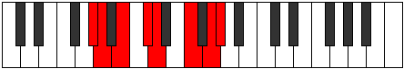
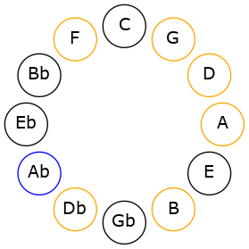
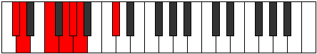
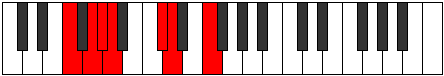
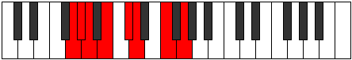
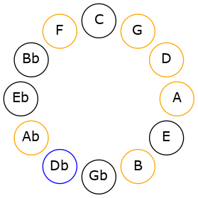
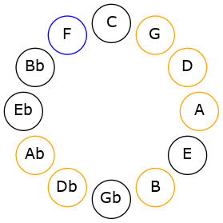
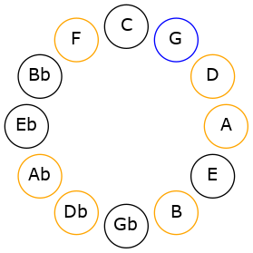

# Mode AFlatByrian

## Links

- [Documentation](README.md)
- [Scales Index](Scales.md)
- [Modes Index](Modes.md)
- [Chords Index](Chords.md)

## Scale

[Eporian](ScaleEporian.md)

## Mode

[AFlatByrian](ModeAFlatByrian.md)

## Tonic

Ab

## Signature

[CNaturalMajor]

## Interval Pattern

1, 2, 2, 1, 3, 2, 1

## Chord Pattern

i⁰, II⁺, IV, vi⁰, vii⁰b3

## Perfection

 - 3 Perfect Notes

 - 4 Imperfect Notes

## Notes

- Ab (Imperfect)
- Bbb (Imperfect)
- Cb (Imperfect)
- Db
- Ebb
- F (Imperfect)
- G
- Ab (Imperfect)

## Illustration

## Diagram

## Relative Modes

| Number | Mode | Tonic | Notes | Illustration |
|--------|------|-------|-------|--------------|
| [2667](https://ianring.com/musictheory/scales/2667) | [Byrian](ModeByrian.md) | Ab | Ab, Bbb, Cb, Db, Ebb, F, G, Ab |  |
| [1491](https://ianring.com/musictheory/scales/1491) | [Rynian](ModeRynian.md) | Db | Db, Ebb, F, G, Ab, Bbb, Cb, Db |  |
| [861](https://ianring.com/musictheory/scales/861) | [Rylian](ModeRylian.md) | F | F, G, Ab, Bbb, Cb, Db, Ebb, F |  |
| [1239](https://ianring.com/musictheory/scales/1239) | [Epaptian](ModeEpaptian.md) | G | G, Ab, Bbb, Cb, Db, Ebb, F, G |  |
## Relative Brightness

| Number | Mode | Tonic | Notes | Illustration |
|--------|------|-------|-------|--------------|
| [2667](https://ianring.com/musictheory/scales/2667) | [Byrian](ModeByrian.md) | Ab | Ab, Bbb, Cb, Db, Ebb, F, G, Ab |  |
| [1491](https://ianring.com/musictheory/scales/1491) | [Rynian](ModeRynian.md) | Db | Db, Ebb, F, G, Ab, Bbb, Cb, Db |  |
| [861](https://ianring.com/musictheory/scales/861) | [Rylian](ModeRylian.md) | F | F, G, Ab, Bbb, Cb, Db, Ebb, F |  |
| [1239](https://ianring.com/musictheory/scales/1239) | [Epaptian](ModeEpaptian.md) | G | G, Ab, Bbb, Cb, Db, Ebb, F, G |  |

## Chords

### Ab

| Number | Root | Name | Notes | Illustration | Audio |
|--------|------|------|-------|--------------|-------|
| 2306 | Ab | [Abmbb5](ChordAFlatMinorDoubleFlatFifth.md) | Ab, Cb, Db |  | [midi](ChordAFlatMinorDoubleFlatFifthRootPosition.mid) |
| 772 | Ab | [Abloc](ChordAFlatLocrian.md) | Ab, Bbb, Ebb |  | [midi](ChordAFlatLocrianRootPosition.mid) |
| 2308 | Ab | [Abo](ChordAFlatDiminished.md) | Ab, Cb, Ebb |  | [midi](ChordAFlatDiminishedRootPosition.mid) |
| 262 | Ab | [Absus4b5](ChordAFlatSuspendedFourthFlatFifth.md) | Ab, Db, Ebb |  | [midi](ChordAFlatSuspendedFourthFlatFifthRootPosition.mid) |
| 290 | Ab | [Absus4##5](ChordAFlatSuspendedFourthDoubleSharpFifth.md) | Ab, Db, F |  | [midi](ChordAFlatSuspendedFourthDoubleSharpFifthRootPosition.mid) |
| 2340 | Ab | [Abo7](ChordAFlatFullDiminishedSeventh.md) | Ab, Cb, Ebb, Gbb |  | [midi](ChordAFlatFullDiminishedSeventhRootPosition.mid) |
| 386 | Ab | [AbQ+](ChordAFlatQuartalAugmented.md) | Ab, Db, G |  | [midi](ChordAFlatQuartalAugmentedRootPosition.mid) |
| 2436 | Ab | [AboM7](ChordAFlatDiminishedMajorSeventh.md) | Ab, Cb, Ebb, G |  | [midi](ChordAFlatDiminishedMajorSeventhRootPosition.mid) |
| 418 | Ab | [AbM7(sus4)##5](ChordAFlatMajorSeventhSuspendedFourthDoubleSharpFifth.md) | Ab, Db, F, G |  | [midi](ChordAFlatMajorSeventhSuspendedFourthDoubleSharpFifthRootPosition.mid) |

### Bbb

| Number | Root | Name | Notes | Illustration | Audio |
|--------|------|------|-------|--------------|-------|

### Cb

| Number | Root | Name | Notes | Illustration | Audio |
|--------|------|------|-------|--------------|-------|

### Db

| Number | Root | Name | Notes | Illustration | Audio |
|--------|------|------|-------|--------------|-------|
| 134 | Db | [Dbloc](ChordDFlatLocrian.md) | Db, Ebb, Abb |  | [midi](ChordDFlatLocrianRootPosition.mid) |
| 162 | Db | [DbMb5](ChordDFlatMajorFlatFifth.md) | Db, F, Abb |  | [midi](ChordDFlatMajorFlatFifthRootPosition.mid) |
| 258 | Db | [Db5](ChordDFlatPowerChord.md) | Db, Ab |  | [midi](ChordDFlatPowerChordRootPosition.mid) |
| 262 | Db | [Dbphryg](ChordDFlatPhrygian.md) | Db, Ebb, Ab |  | [midi](ChordDFlatPhrygianRootPosition.mid) |
| 290 | Db | [DbM](ChordDFlatMajor.md) | Db, F, Ab |  | [midi](ChordDFlatMajorRootPosition.mid) |
| 386 | Db | [Dblyd](ChordDFlatLydian.md) | Db, G, Ab |  | [midi](ChordDFlatLydianRootPosition.mid) |
| 418 | Db | [DbM(add(#4))](ChordDFlatMajorAddSharpFourth.md) | Db, F, G, Ab |  | [midi](ChordDFlatMajorAddSharpFourthRootPosition.mid) |
| 546 | Db | [Db+](ChordDFlatAugmented.md) | Db, F, A |  | [midi](ChordDFlatAugmentedRootPosition.mid) |
| 546 | Db | [Db+7](ChordDFlatAugmentedAugmentedSeventh.md) | Db, F, A, C# |  | [midi](ChordDFlatAugmentedAugmentedSeventhRootPosition.mid) |
| 2210 | Db | [Db7b5](ChordDFlatDominantSeventhFlatFifth.md) | Db, F, Abb, Cb |  | [midi](ChordDFlatDominantSeventhFlatFifthRootPosition.mid) |
| 2214 | Db | [Db7b5b9](ChordDFlatDominantSeventhFlatFifthFlatNinth.md) | Db, F, Abb, Cb, Ebb |  | [midi](ChordDFlatDominantSeventhFlatFifthFlatNinthRootPosition.mid) |
| 2338 | Db | [Db7](ChordDFlatDominantSeventh.md) | Db, F, Ab, Cb |  | [midi](ChordDFlatDominantSeventhRootPosition.mid) |
| 2342 | Db | [Db7b9](ChordDFlatDominantSeventhFlatNinth.md) | Db, F, Ab, Cb, Ebb |  | [midi](ChordDFlatDominantSeventhFlatNinthRootPosition.mid) |
| 2466 | Db | [Db7add(#4)](ChordDFlatDominantSeventhAddSharpFourth.md) | Db, F, G, Ab, Cb |  | [midi](ChordDFlatDominantSeventhAddSharpFourthRootPosition.mid) |
| 2466 | Db | [Db7#11](ChordDFlatDominantSeventhSharpEleventh.md) | Db, F, Ab, Cb, G |  | [midi](ChordDFlatDominantSeventhSharpEleventhRootPosition.mid) |
| 2598 | Db | [Db7#5b9](ChordDFlatDominantSeventhSharpFifthFlatNinth.md) | Db, F, A, Cb, Ebb |  | [midi](ChordDFlatDominantSeventhSharpFifthFlatNinthRootPosition.mid) |
| 2854 | Db | [Db7b9b13](ChordDFlatDominantSeventhFlatNinthFlatThirteenth.md) | Db, F, Ab, Cb, Ebb, Bbb |  | [midi](ChordDFlatDominantSeventhFlatNinthFlatThirteenthRootPosition.mid) |

### Ebb

| Number | Root | Name | Notes | Illustration | Audio |
|--------|------|------|-------|--------------|-------|

### F

| Number | Root | Name | Notes | Illustration | Audio |
|--------|------|------|-------|--------------|-------|
| 2208 | F | [F](ChordFNaturalDiminishedFlatThird.md) | F, Abb, Cb |  | [midi](ChordFNaturalDiminishedFlatThirdRootPosition.mid) |
| 2208 | F | [Fsus2b5](ChordFNaturalSuspendedSecondFlatFifth.md) | F, G, Cb |  | [midi](ChordFNaturalSuspendedSecondFlatFifthRootPosition.mid) |
| 2336 | F | [Fo](ChordFNaturalDiminished.md) | F, Ab, Cb |  | [midi](ChordFNaturalDiminishedRootPosition.mid) |
| 2592 | F | [FMb5](ChordFNaturalMajorFlatFifth.md) | F, A, Cb |  | [midi](ChordFNaturalMajorFlatFifthRootPosition.mid) |
| 162 | F | [Fsus2#5](ChordFNaturalSuspendedSecondSharpFifth.md) | F, G, C# |  | [midi](ChordFNaturalSuspendedSecondSharpFifthRootPosition.mid) |
| 290 | F | [Fm#5](ChordFNaturalMinorSharpFifth.md) | F, Ab, Db |  | [midi](ChordFNaturalMinorSharpFifthRootPosition.mid) |
| 546 | F | [F+](ChordFNaturalAugmented.md) | F, A, C# |  | [midi](ChordFNaturalAugmentedRootPosition.mid) |
| 546 | F | [F+7](ChordFNaturalAugmentedAugmentedSeventh.md) | F, A, C#, E# |  | [midi](ChordFNaturalAugmentedAugmentedSeventhRootPosition.mid) |
| 2210 | F | [Fsus2b5add(#5)](ChordFNaturalSuspendedSecondFlatFifthAddSharpFifth.md) | F, G, Cb, C# |  | [midi](ChordFNaturalSuspendedSecondFlatFifthAddSharpFifthRootPosition.mid) |
| 548 | F | [FM##5](ChordFNaturalMajorDoubleSharpFifth.md) | F, A, D |  | [midi](ChordFNaturalMajorDoubleSharpFifthRootPosition.mid) |
| 2212 | F | [FM6sus2b5](ChordFNaturalMajorSixthSuspendedSecondFlatFifth.md) | F, G, Cb, D |  | [midi](ChordFNaturalMajorSixthSuspendedSecondFlatFifthRootPosition.mid) |
| 2340 | F | [Fo7](ChordFNaturalFullDiminishedSeventh.md) | F, Ab, Cb, Ebb |  | [midi](ChordFNaturalFullDiminishedSeventhRootPosition.mid) |
| 2596 | F | [FM6b5](ChordFNaturalMajorSixthFlatFifth.md) | F, A, Cb, D |  | [midi](ChordFNaturalMajorSixthFlatFifthRootPosition.mid) |

### G

| Number | Root | Name | Notes | Illustration | Audio |
|--------|------|------|-------|--------------|-------|
| 386 | G | [Gloc](ChordGNaturalLocrian.md) | G, Ab, Db |  | [midi](ChordGNaturalLocrianRootPosition.mid) |
| 642 | G | [G](ChordGNaturalDiminishedFlatThird.md) | G, Bbb, Db |  | [midi](ChordGNaturalDiminishedFlatThirdRootPosition.mid) |
| 642 | G | [Gsus2b5](ChordGNaturalSuspendedSecondFlatFifth.md) | G, A, Db |  | [midi](ChordGNaturalSuspendedSecondFlatFifthRootPosition.mid) |
| 2178 | G | [GMb5](ChordGNaturalMajorFlatFifth.md) | G, B, Db |  | [midi](ChordGNaturalMajorFlatFifthRootPosition.mid) |
| 132 | G | [G5](ChordGNaturalPowerChord.md) | G, D |  | [midi](ChordGNaturalPowerChordRootPosition.mid) |
| 388 | G | [Gphryg](ChordGNaturalPhrygian.md) | G, Ab, D |  | [midi](ChordGNaturalPhrygianRootPosition.mid) |
| 644 | G | [Gsus2](ChordGNaturalSuspendedSecond.md) | G, A, D |  | [midi](ChordGNaturalSuspendedSecondRootPosition.mid) |
| 2180 | G | [GM](ChordGNaturalMajor.md) | G, B, D |  | [midi](ChordGNaturalMajorRootPosition.mid) |
| 2692 | G | [GM(add9)](ChordGNaturalMajorAddNinth.md) | G, B, D, A |  | [midi](ChordGNaturalMajorAddNinthRootPosition.mid) |
| 134 | G | [Glyd](ChordGNaturalLydian.md) | G, C#, D |  | [midi](ChordGNaturalLydianRootPosition.mid) |
| 2182 | G | [GM(add(#4))](ChordGNaturalMajorAddSharpFourth.md) | G, B, C#, D |  | [midi](ChordGNaturalMajorAddSharpFourthRootPosition.mid) |
| 2210 | G | [G7b5](ChordGNaturalDominantSeventhFlatFifth.md) | G, B, Db, F |  | [midi](ChordGNaturalDominantSeventhFlatFifthRootPosition.mid) |
| 2466 | G | [G7b5b9](ChordGNaturalDominantSeventhFlatFifthFlatNinth.md) | G, B, Db, F, Ab |  | [midi](ChordGNaturalDominantSeventhFlatFifthFlatNinthRootPosition.mid) |
| 676 | G | [G7sus2](ChordGNaturalDominantSeventhSuspendedSecond.md) | G, A, D, F |  | [midi](ChordGNaturalDominantSeventhSuspendedSecondRootPosition.mid) |
| 676 | G | [G9sus2](ChordGNaturalDominantNinthSuspendedSecond.md) | G, A, D, F, A |  | [midi](ChordGNaturalDominantNinthSuspendedSecondRootPosition.mid) |
| 2212 | G | [G7](ChordGNaturalDominantSeventh.md) | G, B, D, F |  | [midi](ChordGNaturalDominantSeventhRootPosition.mid) |
| 2468 | G | [G7b9](ChordGNaturalDominantSeventhFlatNinth.md) | G, B, D, F, Ab |  | [midi](ChordGNaturalDominantSeventhFlatNinthRootPosition.mid) |
| 2724 | G | [G9](ChordGNaturalDominantNinth.md) | G, B, D, F, A |  | [midi](ChordGNaturalDominantNinthRootPosition.mid) |
| 2214 | G | [G7add(#4)](ChordGNaturalDominantSeventhAddSharpFourth.md) | G, B, C#, D, F |  | [midi](ChordGNaturalDominantSeventhAddSharpFourthRootPosition.mid) |
| 2214 | G | [G7#11](ChordGNaturalDominantSeventhSharpEleventh.md) | G, B, D, F, C# |  | [midi](ChordGNaturalDominantSeventhSharpEleventhRootPosition.mid) |
| 2726 | G | [G9#11](ChordGNaturalDominantNinthSharpEleventh.md) | G, B, D, F, A, C# |  | [midi](ChordGNaturalDominantNinthSharpEleventhRootPosition.mid) |

