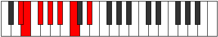

# Mode AFlatBythimic

## Links

- [Documentation](index.md)
- [Scales Index](Scales.md)
- [Modes Index](Modes.md)
- [Chords Index](Chords.md)

## Scale

[Boptimic](ScaleBoptimic.md)

## Mode

[AFlatBythimic](ModeAFlatBythimic.md)

## Tonic

Ab

## Signature

[CNaturalMajor]

## Perfection

 - 2 Perfect Notes

 - 4 Imperfect Notes

## Notes

- Ab
- Bb (Imperfect)
- C (Imperfect)
- D#
- E (Imperfect)
- F# (Imperfect)
- Ab

## Illustration

## Relative Modes

| Number | Mode | Tonic | Notes | Illustration |
|--------|------|-------|-------|--------------|
| [683](https://ianring.com/musictheory/scales/683) | [Stogimic](ModeStogimic.md) | D# | D#, E, F#, G#, A#, B#, D# |  |
| [683](https://ianring.com/musictheory/scales/683) | [Stogimic](ModeStogimic.md) | Eb | Eb, Fb, Gb, Ab, Bb, C, Eb |  |
| [1369](https://ianring.com/musictheory/scales/1369) | [Boptimic](ModeBoptimic.md) | C | C, D#, E, F#, G#, A#, C |  |
| [1381](https://ianring.com/musictheory/scales/1381) | [Padimic](ModePadimic.md) | A# | A#, B#, C###, D##, E##, F###, A# |  |
| [1381](https://ianring.com/musictheory/scales/1381) | [Padimic](ModePadimic.md) | Bb | Bb, C, D#, E, F#, G#, Bb |  |
| [1429](https://ianring.com/musictheory/scales/1429) | [Bythimic](ModeBythimic.md) | G# | G#, A#, B#, C###, D##, E##, G# |  |
| [1429](https://ianring.com/musictheory/scales/1429) | [Bythimic](ModeBythimic.md) | Ab | Ab, Bb, C, D#, E, F#, Ab |  |
| [1621](https://ianring.com/musictheory/scales/1621) | [Aeolathimic](ModeAeolathimic.md) | F# | F#, G#, A#, B#, C###, D##, F# |  |
| [1621](https://ianring.com/musictheory/scales/1621) | [Aeolathimic](ModeAeolathimic.md) | Gb | Gb, Ab, Bb, C, D#, E, Gb |  |
| [2389](https://ianring.com/musictheory/scales/2389) | [Thynimic](ModeThynimic.md) | E | E, F#, G#, A#, B#, C###, E |  |

## Chords

### Ab

| Number | Root | Name | Notes | Illustration | Audio |
|--------|------|------|-------|--------------|-------|

### Bb

| Number | Root | Name | Notes | Illustration | Audio |
|--------|------|------|-------|--------------|-------|
| 1033 | Bb | [Bbsus2bb5](ChordBFlatSuspendedSecondDoubleFlatFifth.md) | Bb, C, Eb |  | [midi](ChordBFlatSuspendedSecondDoubleFlatFifthRootPosition.mid) [ogg](ChordBFlatSuspendedSecondDoubleFlatFifthRootPosition.ogg) |
| 1041 | Bb | [Bbsus2b5](ChordBFlatSuspendedSecondFlatFifth.md) | Bb, C, Fb |  | [midi](ChordBFlatSuspendedSecondFlatFifthRootPosition.mid) [ogg](ChordBFlatSuspendedSecondFlatFifthRootPosition.ogg) |
| 1048 | Bb | [Bbsus4b5](ChordBFlatSuspendedFourthFlatFifth.md) | Bb, Eb, Fb |  | [midi](ChordBFlatSuspendedFourthFlatFifthRootPosition.mid) [ogg](ChordBFlatSuspendedFourthFlatFifthRootPosition.ogg) |
| 1089 | Bb | [Bbsus2#5](ChordBFlatSuspendedSecondSharpFifth.md) | Bb, C, F# |  | [midi](ChordBFlatSuspendedSecondSharpFifthRootPosition.mid) [ogg](ChordBFlatSuspendedSecondSharpFifthRootPosition.ogg) |
| 1096 | Bb | [Bbsus4#5](ChordBFlatSuspendedFourthSharpFifth.md) | Bb, Eb, F# |  | [midi](ChordBFlatSuspendedFourthSharpFifthRootPosition.mid) [ogg](ChordBFlatSuspendedFourthSharpFifthRootPosition.ogg) |
| 1105 | Bb | [Bbsus2b5add(#5)](ChordBFlatSuspendedSecondFlatFifthAddSharpFifth.md) | Bb, C, Fb, F# |  | [midi](ChordBFlatSuspendedSecondFlatFifthAddSharpFifthRootPosition.mid) [ogg](ChordBFlatSuspendedSecondFlatFifthAddSharpFifthRootPosition.ogg) |
| 1288 | Bb | [BbQ](ChordBFlatQuartal.md) | Bb, Eb, Ab |  | [midi](ChordBFlatQuartalRootPosition.mid) [ogg](ChordBFlatQuartalRootPosition.ogg) |

### C

| Number | Root | Name | Notes | Illustration | Audio |
|--------|------|------|-------|--------------|-------|
| 73 | C | [Co](ChordCNaturalDiminished.md) | C, Eb, Gb |  | [midi](ChordCNaturalDiminishedRootPosition.mid) [ogg](ChordCNaturalDiminishedRootPosition.ogg) |
| 81 | C | [CMb5](ChordCNaturalMajorFlatFifth.md) | C, E, Gb |  | [midi](ChordCNaturalMajorFlatFifthRootPosition.mid) [ogg](ChordCNaturalMajorFlatFifthRootPosition.ogg) |
| 265 | C | [Cm#5](ChordCNaturalMinorSharpFifth.md) | C, Eb, Ab |  | [midi](ChordCNaturalMinorSharpFifthRootPosition.mid) [ogg](ChordCNaturalMinorSharpFifthRootPosition.ogg) |
| 273 | C | [C+](ChordCNaturalAugmented.md) | C, E, G# |  | [midi](ChordCNaturalAugmentedRootPosition.mid) [ogg](ChordCNaturalAugmentedRootPosition.ogg) |
| 273 | C | [C+7](ChordCNaturalAugmentedAugmentedSeventh.md) | C, E, G#, B# |  | [midi](ChordCNaturalAugmentedAugmentedSeventhRootPosition.mid) [ogg](ChordCNaturalAugmentedAugmentedSeventhRootPosition.ogg) |
| 1097 | C | [Cø7](ChordCNaturalHalfDiminishedSeventh.md) | C, Eb, Gb, Bb |  | [midi](ChordCNaturalHalfDiminishedSeventhRootPosition.mid) [ogg](ChordCNaturalHalfDiminishedSeventhRootPosition.ogg) |
| 1105 | C | [C7b5](ChordCNaturalDominantSeventhFlatFifth.md) | C, E, Gb, Bb |  | [midi](ChordCNaturalDominantSeventhFlatFifthRootPosition.mid) [ogg](ChordCNaturalDominantSeventhFlatFifthRootPosition.ogg) |
| 1289 | C | [Cm7#5](ChordCNaturalMinorSeventhSharpFifth.md) | C, Eb, G#, Bb |  | [midi](ChordCNaturalMinorSeventhSharpFifthRootPosition.mid) [ogg](ChordCNaturalMinorSeventhSharpFifthRootPosition.ogg) |

### D#

| Number | Root | Name | Notes | Illustration | Audio |
|--------|------|------|-------|--------------|-------|
| 328 | D# | [D#mbb5](ChordDSharpMinorDoubleFlatFifth.md) | D#, F#, G# |  | [midi](ChordDSharpMinorDoubleFlatFifthRootPosition.mid) [ogg](ChordDSharpMinorDoubleFlatFifthRootPosition.ogg) |
| 1032 | D# | [D#5](ChordDSharpPowerChord.md) | D#, A# |  | [midi](ChordDSharpPowerChordRootPosition.mid) [ogg](ChordDSharpPowerChordRootPosition.ogg) |
| 1048 | D# | [D#phryg](ChordDSharpPhrygian.md) | D#, E, A# |  | [midi](ChordDSharpPhrygianRootPosition.mid) [ogg](ChordDSharpPhrygianRootPosition.ogg) |
| 1096 | D# | [D#m](ChordDSharpMinor.md) | D#, F#, A# |  | [midi](ChordDSharpMinorRootPosition.mid) [ogg](ChordDSharpMinorRootPosition.ogg) |
| 1096 | D# | [D#m(add(#9))](ChordDSharpMinorAddSharpNinth.md) | D#, F#, A#, E## |  | [midi](ChordDSharpMinorAddSharpNinthRootPosition.mid) [ogg](ChordDSharpMinorAddSharpNinthRootPosition.ogg) |
| 1288 | D# | [D#sus4](ChordDSharpSuspendedFourth.md) | D#, G#, A# |  | [midi](ChordDSharpSuspendedFourthRootPosition.mid) [ogg](ChordDSharpSuspendedFourthRootPosition.ogg) |
| 1352 | D# | [D#m(add11)](ChordDSharpMinorAddEleventh.md) | D#, F#, A#, G# |  | [midi](ChordDSharpMinorAddEleventhRootPosition.mid) [ogg](ChordDSharpMinorAddEleventhRootPosition.ogg) |
| 1352 | D# | [D#m(add4)](ChordDSharpMinorAddFourth.md) | D#, F#, G#, A# |  | [midi](ChordDSharpMinorAddFourthRootPosition.mid) [ogg](ChordDSharpMinorAddFourthRootPosition.ogg) |
| 265 | D# | [D#sus4##5](ChordDSharpSuspendedFourthDoubleSharpFifth.md) | D#, G#, B# |  | [midi](ChordDSharpSuspendedFourthDoubleSharpFifthRootPosition.mid) [ogg](ChordDSharpSuspendedFourthDoubleSharpFifthRootPosition.ogg) |
| 1097 | D# | [D#m6](ChordDSharpMinorSixth.md) | D#, F#, A#, B# |  | [midi](ChordDSharpMinorSixthRootPosition.mid) [ogg](ChordDSharpMinorSixthRootPosition.ogg) |
| 1113 | D# | [D#m6(addb9)](ChordDSharpMinorSixthAddFlatNinth.md) | D#, F#, A#, B#, E |  | [midi](ChordDSharpMinorSixthAddFlatNinthRootPosition.mid) [ogg](ChordDSharpMinorSixthAddFlatNinthRootPosition.ogg) |
| 1289 | D# | [D#M6sus4](ChordDSharpMajorSixthSuspendedFourth.md) | D#, G#, A#, B# |  | [midi](ChordDSharpMajorSixthSuspendedFourthRootPosition.mid) [ogg](ChordDSharpMajorSixthSuspendedFourthRootPosition.ogg) |

### E

| Number | Root | Name | Notes | Illustration | Audio |
|--------|------|------|-------|--------------|-------|
| 1104 | E | [Esus2b5](ChordENaturalSuspendedSecondFlatFifth.md) | E, F#, Bb |  | [midi](ChordENaturalSuspendedSecondFlatFifthRootPosition.mid) [ogg](ChordENaturalSuspendedSecondFlatFifthRootPosition.ogg) |
| 1296 | E | [EMb5](ChordENaturalMajorFlatFifth.md) | E, G#, Bb |  | [midi](ChordENaturalMajorFlatFifthRootPosition.mid) [ogg](ChordENaturalMajorFlatFifthRootPosition.ogg) |
| 81 | E | [Esus2#5](ChordENaturalSuspendedSecondSharpFifth.md) | E, F#, B# |  | [midi](ChordENaturalSuspendedSecondSharpFifthRootPosition.mid) [ogg](ChordENaturalSuspendedSecondSharpFifthRootPosition.ogg) |
| 273 | E | [E+](ChordENaturalAugmented.md) | E, G#, B# |  | [midi](ChordENaturalAugmentedRootPosition.mid) [ogg](ChordENaturalAugmentedRootPosition.ogg) |
| 273 | E | [E+7](ChordENaturalAugmentedAugmentedSeventh.md) | E, G#, B#, D## |  | [midi](ChordENaturalAugmentedAugmentedSeventhRootPosition.mid) [ogg](ChordENaturalAugmentedAugmentedSeventhRootPosition.ogg) |
| 1105 | E | [Esus2b5add(#5)](ChordENaturalSuspendedSecondFlatFifthAddSharpFifth.md) | E, F#, Bb, B# |  | [midi](ChordENaturalSuspendedSecondFlatFifthAddSharpFifthRootPosition.mid) [ogg](ChordENaturalSuspendedSecondFlatFifthAddSharpFifthRootPosition.ogg) |
| 1304 | E | [EM7b5](ChordENaturalMajorSeventhFlatFifth.md) | E, G#, Bb, D# |  | [midi](ChordENaturalMajorSeventhFlatFifthRootPosition.mid) [ogg](ChordENaturalMajorSeventhFlatFifthRootPosition.ogg) |
| 281 | E | [E+(M7)](ChordENaturalAugmentedMajorSeventh.md) | E, G#, B#, D# |  | [midi](ChordENaturalAugmentedMajorSeventhRootPosition.mid) [ogg](ChordENaturalAugmentedMajorSeventhRootPosition.ogg) |

### F#

| Number | Root | Name | Notes | Illustration | Audio |
|--------|------|------|-------|--------------|-------|
| 321 | F# | [F#sus2b5](ChordFSharpSuspendedSecondFlatFifth.md) | F#, G#, C |  | [midi](ChordFSharpSuspendedSecondFlatFifthRootPosition.mid) [ogg](ChordFSharpSuspendedSecondFlatFifthRootPosition.ogg) |
| 1089 | F# | [F#Mb5](ChordFSharpMajorFlatFifth.md) | F#, A#, C |  | [midi](ChordFSharpMajorFlatFifthRootPosition.mid) [ogg](ChordFSharpMajorFlatFifthRootPosition.ogg) |
| 1096 | F# | [F#M##5](ChordFSharpMajorDoubleSharpFifth.md) | F#, A#, D# |  | [midi](ChordFSharpMajorDoubleSharpFifthRootPosition.mid) [ogg](ChordFSharpMajorDoubleSharpFifthRootPosition.ogg) |
| 329 | F# | [F#M6sus2b5](ChordFSharpMajorSixthSuspendedSecondFlatFifth.md) | F#, G#, C, D# |  | [midi](ChordFSharpMajorSixthSuspendedSecondFlatFifthRootPosition.mid) [ogg](ChordFSharpMajorSixthSuspendedSecondFlatFifthRootPosition.ogg) |
| 1097 | F# | [F#M6b5](ChordFSharpMajorSixthFlatFifth.md) | F#, A#, C, D# |  | [midi](ChordFSharpMajorSixthFlatFifthRootPosition.mid) [ogg](ChordFSharpMajorSixthFlatFifthRootPosition.ogg) |
| 1105 | F# | [F#7b5](ChordFSharpDominantSeventhFlatFifth.md) | F#, A#, C, E |  | [midi](ChordFSharpDominantSeventhFlatFifthRootPosition.mid) [ogg](ChordFSharpDominantSeventhFlatFifthRootPosition.ogg) |

