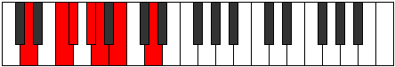
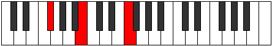

# Mode AFlatDacrimic

## Links

- [Documentation](README.md)
- [Scales Index](Scales.md)
- [Modes Index](Modes.md)
- [Chords Index](Chords.md)

## Scale

[Thalimic](ScaleThalimic.md)

## Mode

[AFlatDacrimic](ModeAFlatDacrimic.md)

## Tonic

Ab

## Signature

[CNaturalMajor]

## Transposition

1, 2, 3, 3, 1, 2

## Chord Pattern

IV, v⁰

## Perfection

 - 2 Perfect Notes

 - 4 Imperfect Notes

## Notes

- Ab (Imperfect)
- Bbb (Imperfect)
- Cb
- D
- E# (Imperfect)
- F# (Imperfect)
- Ab (Imperfect)

## Illustration

## Diagram

## Relative Modes

| Number | Mode | Tonic | Notes | Illustration |
|--------|------|-------|-------|--------------|
| [1611](https://ianring.com/musictheory/scales/1611) | [Dacrimic](ModeDacrimic.md) | Ab | Ab, Bbb, Cb, D, E#, F#, Ab |  |
| [729](https://ianring.com/musictheory/scales/729) | [Stygimic](ModeStygimic.md) | D | D, E#, F#, G#, A, B, D |  |
| [2349](https://ianring.com/musictheory/scales/2349) | [Aerogimic](ModeAerogimic.md) | F# | F#, G#, A, B, C##, D###, F# |  |
## Relative Brightness

| Number | Mode | Tonic | Notes | Illustration |
|--------|------|-------|-------|--------------|
| [1611](https://ianring.com/musictheory/scales/1611) | [Dacrimic](ModeDacrimic.md) | Ab | Ab, Bbb, Cb, D, E#, F#, Ab |  |
| [729](https://ianring.com/musictheory/scales/729) | [Stygimic](ModeStygimic.md) | D | D, E#, F#, G#, A, B, D |  |
| [2349](https://ianring.com/musictheory/scales/2349) | [Aerogimic](ModeAerogimic.md) | F# | F#, G#, A, B, C##, D###, F# |  |

## Chords

### Ab

| Number | Root | Name | Notes | Illustration | Audio |
|--------|------|------|-------|--------------|-------|
| 772 | Ab | [Abloc](ChordAFlatLocrian.md) | Ab, Bbb, Ebb |  | [midi](ChordAFlatLocrianRootPosition.mid) |
| 2308 | Ab | [Abo](ChordAFlatDiminished.md) | Ab, Cb, Ebb |  | [midi](ChordAFlatDiminishedRootPosition.mid) |
| 2340 | Ab | [Abo7](ChordAFlatFullDiminishedSeventh.md) | Ab, Cb, Ebb, Gbb |  | [midi](ChordAFlatFullDiminishedSeventhRootPosition.mid) |
| 2372 | Ab | [Abø7](ChordAFlatHalfDiminishedSeventh.md) | Ab, Cb, Ebb, Gb |  | [midi](ChordAFlatHalfDiminishedSeventhRootPosition.mid) |

### Bbb

| Number | Root | Name | Notes | Illustration | Audio |
|--------|------|------|-------|--------------|-------|

### Cb

| Number | Root | Name | Notes | Illustration | Audio |
|--------|------|------|-------|--------------|-------|

### D

| Number | Root | Name | Notes | Illustration | Audio |
|--------|------|------|-------|--------------|-------|
| 292 | D | [Do](ChordDNaturalDiminished.md) | D, F, Ab |  | [midi](ChordDNaturalDiminishedRootPosition.mid) |
| 324 | D | [DMb5](ChordDNaturalMajorFlatFifth.md) | D, F#, Ab |  | [midi](ChordDNaturalMajorFlatFifthRootPosition.mid) |
| 516 | D | [D5](ChordDNaturalPowerChord.md) | D, A |  | [midi](ChordDNaturalPowerChordRootPosition.mid) |
| 548 | D | [Dm](ChordDNaturalMinor.md) | D, F, A |  | [midi](ChordDNaturalMinorRootPosition.mid) |
| 548 | D | [Dm(add(#9))](ChordDNaturalMinorAddSharpNinth.md) | D, F, A, E# |  | [midi](ChordDNaturalMinorAddSharpNinthRootPosition.mid) |
| 580 | D | [DM](ChordDNaturalMajor.md) | D, F#, A |  | [midi](ChordDNaturalMajorRootPosition.mid) |
| 612 | D | [DM(add(#9))](ChordDNaturalMajorAddSharpNinth.md) | D, F#, A, E# |  | [midi](ChordDNaturalMajorAddSharpNinthRootPosition.mid) |
| 772 | D | [Dlyd](ChordDNaturalLydian.md) | D, G#, A |  | [midi](ChordDNaturalLydianRootPosition.mid) |
| 804 | D | [Dm(add(#4))](ChordDNaturalMinorAddSharpFourth.md) | D, F, G#, A |  | [midi](ChordDNaturalMinorAddSharpFourthRootPosition.mid) |
| 836 | D | [DM(add(#4))](ChordDNaturalMajorAddSharpFourth.md) | D, F#, G#, A |  | [midi](ChordDNaturalMajorAddSharpFourthRootPosition.mid) |
| 2116 | D | [DM##5](ChordDNaturalMajorDoubleSharpFifth.md) | D, F#, B |  | [midi](ChordDNaturalMajorDoubleSharpFifthRootPosition.mid) |
| 2340 | D | [Do7](ChordDNaturalFullDiminishedSeventh.md) | D, F, Ab, Cb |  | [midi](ChordDNaturalFullDiminishedSeventhRootPosition.mid) |
| 2372 | D | [DM6b5](ChordDNaturalMajorSixthFlatFifth.md) | D, F#, Ab, B |  | [midi](ChordDNaturalMajorSixthFlatFifthRootPosition.mid) |
| 2596 | D | [Dm6](ChordDNaturalMinorSixth.md) | D, F, A, B |  | [midi](ChordDNaturalMinorSixthRootPosition.mid) |
| 2628 | D | [DM6](ChordDNaturalMajorSixth.md) | D, F#, A, B |  | [midi](ChordDNaturalMajorSixthRootPosition.mid) |

### E#

| Number | Root | Name | Notes | Illustration | Audio |
|--------|------|------|-------|--------------|-------|

### F#

| Number | Root | Name | Notes | Illustration | Audio |
|--------|------|------|-------|--------------|-------|
| 2368 | F# | [F#sus2bb5](ChordFSharpSuspendedSecondDoubleFlatFifth.md) | F#, G#, B |  | [midi](ChordFSharpSuspendedSecondDoubleFlatFifthRootPosition.mid) |
| 2624 | F# | [F#mbb5](ChordFSharpMinorDoubleFlatFifth.md) | F#, A, B |  | [midi](ChordFSharpMinorDoubleFlatFifthRootPosition.mid) |
| 324 | F# | [F#sus2#5](ChordFSharpSuspendedSecondSharpFifth.md) | F#, G#, C## |  | [midi](ChordFSharpSuspendedSecondSharpFifthRootPosition.mid) |
| 580 | F# | [F#m#5](ChordFSharpMinorSharpFifth.md) | F#, A, D |  | [midi](ChordFSharpMinorSharpFifthRootPosition.mid) |
| 2116 | F# | [F#sus4#5](ChordFSharpSuspendedFourthSharpFifth.md) | F#, B, C## |  | [midi](ChordFSharpSuspendedFourthSharpFifthRootPosition.mid) |
| 2144 | F# | [F#Q+](ChordFSharpQuartalAugmented.md) | F#, B, E# |  | [midi](ChordFSharpQuartalAugmentedRootPosition.mid) |
| 2148 | F# | [F#M7(sus4)#5](ChordFSharpMajorSeventhSuspendedFourthSharpFifth.md) | F#, B, C##, E# |  | [midi](ChordFSharpMajorSeventhSuspendedFourthSharpFifthRootPosition.mid) |

