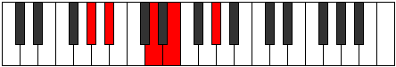
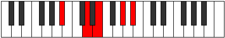
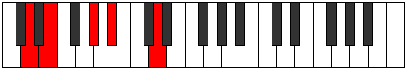
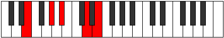

# Mode AFlatDadic

## Links

- [Documentation](index.md)
- [Scales Index](Scales.md)
- [Modes Index](Modes.md)
- [Chords Index](Chords.md)

## Scale

[Stathic](ScaleStathic.md)

## Mode

[AFlatDadic](ModeAFlatDadic.md)

## Tonic

Ab

## Signature

[CNaturalMajor]

## Perfection

 - 0 Perfect Notes

 - 4 Imperfect Notes

## Notes

- Ab (Imperfect)
- Bb (Imperfect)
- D (Imperfect)
- E (Imperfect)
- Ab (Imperfect)

## Illustration

## Relative Modes

| Number | Mode | Tonic | Notes | Illustration |
|--------|------|-------|-------|--------------|
| [325](https://ianring.com/musictheory/scales/325) | [Dadic](ModeDadic.md) | Ab | Ab, Bb, D, E, Ab |  |
| [1105](https://ianring.com/musictheory/scales/1105) | [Stathic](ModeStathic.md) | Bb | Bb, D, E, Ab, Bb |  |
| [325](https://ianring.com/musictheory/scales/325) | [Dadic](ModeDadic.md) | D | D, E, G#, A#, D |  |
| [1105](https://ianring.com/musictheory/scales/1105) | [Stathic](ModeStathic.md) | E | E, G#, A#, D, E |  |

## Chords

### Ab

| Number | Root | Name | Notes | Illustration | Audio |
|--------|------|------|-------|--------------|-------|
| 1284 | Ab | [Absus2b5](ChordAFlatSuspendedSecondFlatFifth.md) | Ab, Bb, Ebb |  | [midi](ChordAFlatSuspendedSecondFlatFifthRootPosition.mid) |
| 1296 | Ab | [Absus2#5](ChordAFlatSuspendedSecondSharpFifth.md) | Ab, Bb, E |  | [midi](ChordAFlatSuspendedSecondSharpFifthRootPosition.mid) |
| 1300 | Ab | [Absus2b5add(#5)](ChordAFlatSuspendedSecondFlatFifthAddSharpFifth.md) | Ab, Bb, Ebb, E |  | [midi](ChordAFlatSuspendedSecondFlatFifthAddSharpFifthRootPosition.mid) |

### Bb

| Number | Root | Name | Notes | Illustration | Audio |
|--------|------|------|-------|--------------|-------|
| 1044 | Bb | [BbMb5](ChordBFlatMajorFlatFifth.md) | Bb, D, Fb |  | [midi](ChordBFlatMajorFlatFifthRootPosition.mid) |
| 1300 | Bb | [Bb7b5](ChordBFlatDominantSeventhFlatFifth.md) | Bb, D, Fb, Ab |  | [midi](ChordBFlatDominantSeventhFlatFifthRootPosition.mid) |

### D

| Number | Root | Name | Notes | Illustration | Audio |
|--------|------|------|-------|--------------|-------|
| 276 | D | [Dsus2b5](ChordDNaturalSuspendedSecondFlatFifth.md) | D, E, Ab |  | [midi](ChordDNaturalSuspendedSecondFlatFifthRootPosition.mid) |
| 1044 | D | [Dsus2#5](ChordDNaturalSuspendedSecondSharpFifth.md) | D, E, A# |  | [midi](ChordDNaturalSuspendedSecondSharpFifthRootPosition.mid) |
| 1300 | D | [Dsus2b5add(#5)](ChordDNaturalSuspendedSecondFlatFifthAddSharpFifth.md) | D, E, Ab, A# |  | [midi](ChordDNaturalSuspendedSecondFlatFifthAddSharpFifthRootPosition.mid) |

### E

| Number | Root | Name | Notes | Illustration | Audio |
|--------|------|------|-------|--------------|-------|
| 1296 | E | [EMb5](ChordENaturalMajorFlatFifth.md) | E, G#, Bb |  | [midi](ChordENaturalMajorFlatFifthRootPosition.mid) |
| 1300 | E | [E7b5](ChordENaturalDominantSeventhFlatFifth.md) | E, G#, Bb, D |  | [midi](ChordENaturalDominantSeventhFlatFifthRootPosition.mid) |

