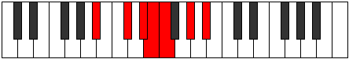

# Mode AFlatDadimic

## Links

- [Documentation](index.md)
- [Scales Index](Scales.md)
- [Modes Index](Modes.md)
- [Chords Index](Chords.md)

## Scale

[Mixolimic](ScaleMixolimic.md)

## Mode

[AFlatDadimic](ModeAFlatDadimic.md)

## Tonic

Ab

## Signature

[CNaturalMajor]

## Interval Pattern

2, 3, 2, 1, 1, 3

## Chord Pattern

ii⁰, ii, iii, III

## Perfection

 - 4 Perfect Notes

 - 2 Imperfect Notes

## Notes

- Ab
- Bb
- C#
- D#
- E (Imperfect)
- F (Imperfect)
- Ab

## Illustration

## Relative Modes

| Number | Mode | Tonic | Notes | Illustration |
|--------|------|-------|-------|--------------|
| [933](https://ianring.com/musictheory/scales/933) | [Dadimic](ModeDadimic.md) | Ab | Ab, Bb, C#, D#, E, F, Ab |  |
| [1257](https://ianring.com/musictheory/scales/1257) | [Aeolyphimic](ModeAeolyphimic.md) | Bb | Bb, C#, D#, E, F, G#, Bb |  |
| [669](https://ianring.com/musictheory/scales/669) | [Gycrimic](ModeGycrimic.md) | C# | C#, D#, E, F, G#, A#, C# |  |
| [1191](https://ianring.com/musictheory/scales/1191) | [Pyrimic](ModePyrimic.md) | D# | D#, E, F, G#, A#, B##, D# |  |
| [2643](https://ianring.com/musictheory/scales/2643) | [Lydimic](ModeLydimic.md) | E | E, F, G#, A#, B##, C###, E |  |
| [3369](https://ianring.com/musictheory/scales/3369) | [Mixolimic](ModeMixolimic.md) | F | F, G#, A#, B##, C###, D##, F |  |

## Chords

### Ab

| Number | Root | Name | Notes | Illustration | Audio |
|--------|------|------|-------|--------------|-------|
| 1282 | Ab | [Absus2bb5](ChordAFlatSuspendedSecondDoubleFlatFifth.md) | Ab, Bb, Db |  | [midi](ChordAFlatSuspendedSecondDoubleFlatFifthRootPosition.mid) |
| 264 | Ab | [Ab5](ChordAFlatPowerChord.md) | Ab, Eb |  | [midi](ChordAFlatPowerChordRootPosition.mid) |
| 1288 | Ab | [Absus2](ChordAFlatSuspendedSecond.md) | Ab, Bb, Eb |  | [midi](ChordAFlatSuspendedSecondRootPosition.mid) |
| 266 | Ab | [Absus4](ChordAFlatSuspendedFourth.md) | Ab, Db, Eb |  | [midi](ChordAFlatSuspendedFourthRootPosition.mid) |
| 1296 | Ab | [Absus2#5](ChordAFlatSuspendedSecondSharpFifth.md) | Ab, Bb, E |  | [midi](ChordAFlatSuspendedSecondSharpFifthRootPosition.mid) |
| 274 | Ab | [Absus4#5](ChordAFlatSuspendedFourthSharpFifth.md) | Ab, Db, E |  | [midi](ChordAFlatSuspendedFourthSharpFifthRootPosition.mid) |
| 290 | Ab | [Absus4##5](ChordAFlatSuspendedFourthDoubleSharpFifth.md) | Ab, Db, F |  | [midi](ChordAFlatSuspendedFourthDoubleSharpFifthRootPosition.mid) |
| 1314 | Ab | [AbM6sus2bb5](ChordAFlatMajorSixthSuspendedSecondDoubleFlatFifth.md) | Ab, Bb, Db, F |  | [midi](ChordAFlatMajorSixthSuspendedSecondDoubleFlatFifthRootPosition.mid) |
| 1320 | Ab | [AbM6sus2](ChordAFlatMajorSixthSuspendedSecond.md) | Ab, Bb, Eb, F |  | [midi](ChordAFlatMajorSixthSuspendedSecondRootPosition.mid) |
| 1320 | Ab | [Ab7sus2b5](ChordAFlatDominantSeventhSuspendedSecondFlatFifth.md) | Ab, Bb, Eb, Gbb |  | [midi](ChordAFlatDominantSeventhSuspendedSecondFlatFifthRootPosition.mid) |
| 298 | Ab | [AbM6sus4](ChordAFlatMajorSixthSuspendedFourth.md) | Ab, Db, Eb, F |  | [midi](ChordAFlatMajorSixthSuspendedFourthRootPosition.mid) |

### Bb

| Number | Root | Name | Notes | Illustration | Audio |
|--------|------|------|-------|--------------|-------|
| 1034 | Bb | [Bbmbb5](ChordBFlatMinorDoubleFlatFifth.md) | Bb, Db, Eb |  | [midi](ChordBFlatMinorDoubleFlatFifthRootPosition.mid) |
| 1042 | Bb | [Bbo](ChordBFlatDiminished.md) | Bb, Db, Fb |  | [midi](ChordBFlatDiminishedRootPosition.mid) |
| 1048 | Bb | [Bbsus4b5](ChordBFlatSuspendedFourthFlatFifth.md) | Bb, Eb, Fb |  | [midi](ChordBFlatSuspendedFourthFlatFifthRootPosition.mid) |
| 1056 | Bb | [Bb5](ChordBFlatPowerChord.md) | Bb, F |  | [midi](ChordBFlatPowerChordRootPosition.mid) |
| 1058 | Bb | [Bbm](ChordBFlatMinor.md) | Bb, Db, F |  | [midi](ChordBFlatMinorRootPosition.mid) |
| 1058 | Bb | [Bbm(add(#9))](ChordBFlatMinorAddSharpNinth.md) | Bb, Db, F, C# |  | [midi](ChordBFlatMinorAddSharpNinthRootPosition.mid) |
| 1064 | Bb | [Bbsus4](ChordBFlatSuspendedFourth.md) | Bb, Eb, F |  | [midi](ChordBFlatSuspendedFourthRootPosition.mid) |
| 1066 | Bb | [Bbm(add11)](ChordBFlatMinorAddEleventh.md) | Bb, Db, F, Eb |  | [midi](ChordBFlatMinorAddEleventhRootPosition.mid) |
| 1066 | Bb | [Bbm(add4)](ChordBFlatMinorAddFourth.md) | Bb, Db, Eb, F |  | [midi](ChordBFlatMinorAddFourthRootPosition.mid) |
| 1072 | Bb | [Bblyd](ChordBFlatLydian.md) | Bb, E, F |  | [midi](ChordBFlatLydianRootPosition.mid) |
| 1074 | Bb | [Bbm(add(#4))](ChordBFlatMinorAddSharpFourth.md) | Bb, Db, E, F |  | [midi](ChordBFlatMinorAddSharpFourthRootPosition.mid) |
| 1288 | Bb | [BbQ](ChordBFlatQuartal.md) | Bb, Eb, Ab |  | [midi](ChordBFlatQuartalRootPosition.mid) |
| 1290 | Bb | [Bbm7bb5](ChordBFlatMinorSeventhDoubleFlatFifth.md) | Bb, Db, Eb, Ab |  | [midi](ChordBFlatMinorSeventhDoubleFlatFifthRootPosition.mid) |
| 1298 | Bb | [Bbø7](ChordBFlatHalfDiminishedSeventh.md) | Bb, Db, Fb, Ab |  | [midi](ChordBFlatHalfDiminishedSeventhRootPosition.mid) |
| 1314 | Bb | [Bbm7](ChordBFlatMinorSeventh.md) | Bb, Db, F, Ab |  | [midi](ChordBFlatMinorSeventhRootPosition.mid) |
| 1320 | Bb | [Bb7sus4](ChordBFlatDominantSeventhSuspendedFourth.md) | Bb, Eb, F, Ab |  | [midi](ChordBFlatDominantSeventhSuspendedFourthRootPosition.mid) |
| 1322 | Bb | [Bbm7add11](ChordBFlatMinorSeventhAddEleventh.md) | Bb, Db, F, Ab, Eb |  | [midi](ChordBFlatMinorSeventhAddEleventhRootPosition.mid) |
| 1330 | Bb | [Bbm7add(#11)](ChordBFlatMinorSeventhAddSharpEleventh.md) | Bb, Db, F, Ab, E |  | [midi](ChordBFlatMinorSeventhAddSharpEleventhRootPosition.mid) |

### C#

| Number | Root | Name | Notes | Illustration | Audio |
|--------|------|------|-------|--------------|-------|
| 258 | C# | [C#5](ChordCSharpPowerChord.md) | C#, G# |  | [midi](ChordCSharpPowerChordRootPosition.mid) |
| 266 | C# | [C#sus2](ChordCSharpSuspendedSecond.md) | C#, D#, G# |  | [midi](ChordCSharpSuspendedSecondRootPosition.mid) |
| 274 | C# | [C#m](ChordCSharpMinor.md) | C#, E, G# |  | [midi](ChordCSharpMinorRootPosition.mid) |
| 274 | C# | [C#m(add(#9))](ChordCSharpMinorAddSharpNinth.md) | C#, E, G#, D## |  | [midi](ChordCSharpMinorAddSharpNinthRootPosition.mid) |
| 282 | C# | [C#m(add9)](ChordCSharpMinorAddNinth.md) | C#, E, G#, D# |  | [midi](ChordCSharpMinorAddNinthRootPosition.mid) |
| 290 | C# | [C#M](ChordCSharpMajor.md) | C#, E#, G# |  | [midi](ChordCSharpMajorRootPosition.mid) |
| 298 | C# | [C#M(add9)](ChordCSharpMajorAddNinth.md) | C#, E#, G#, D# |  | [midi](ChordCSharpMajorAddNinthRootPosition.mid) |
| 306 | C# | [C#M(add(#9))](ChordCSharpMajorAddSharpNinth.md) | C#, E#, G#, D## |  | [midi](ChordCSharpMajorAddSharpNinthRootPosition.mid) |
| 1058 | C# | [C#M##5](ChordCSharpMajorDoubleSharpFifth.md) | C#, E#, A# |  | [midi](ChordCSharpMajorDoubleSharpFifthRootPosition.mid) |
| 1290 | C# | [C#M6sus2](ChordCSharpMajorSixthSuspendedSecond.md) | C#, D#, G#, A# |  | [midi](ChordCSharpMajorSixthSuspendedSecondRootPosition.mid) |
| 1290 | C# | [C#7sus2b5](ChordCSharpDominantSeventhSuspendedSecondFlatFifth.md) | C#, D#, G#, Bb |  | [midi](ChordCSharpDominantSeventhSuspendedSecondFlatFifthRootPosition.mid) |
| 1298 | C# | [C#m6](ChordCSharpMinorSixth.md) | C#, E, G#, A# |  | [midi](ChordCSharpMinorSixthRootPosition.mid) |
| 1306 | C# | [C#m6(add9)](ChordCSharpMinorSixthAddNinth.md) | C#, E, G#, A#, D# |  | [midi](ChordCSharpMinorSixthAddNinthRootPosition.mid) |
| 1314 | C# | [C#M6](ChordCSharpMajorSixth.md) | C#, E#, G#, A# |  | [midi](ChordCSharpMajorSixthRootPosition.mid) |
| 1322 | C# | [C#M6(add9)](ChordCSharpMajorSixthAddNinth.md) | C#, E#, G#, A#, D# |  | [midi](ChordCSharpMajorSixthAddNinthRootPosition.mid) |

### D#

| Number | Root | Name | Notes | Illustration | Audio |
|--------|------|------|-------|--------------|-------|
| 296 | D# | [D#sus2bb5](ChordDSharpSuspendedSecondDoubleFlatFifth.md) | D#, E#, G# |  | [midi](ChordDSharpSuspendedSecondDoubleFlatFifthRootPosition.mid) |
| 1032 | D# | [D#5](ChordDSharpPowerChord.md) | D#, A# |  | [midi](ChordDSharpPowerChordRootPosition.mid) |
| 1048 | D# | [D#phryg](ChordDSharpPhrygian.md) | D#, E, A# |  | [midi](ChordDSharpPhrygianRootPosition.mid) |
| 1064 | D# | [D#sus2](ChordDSharpSuspendedSecond.md) | D#, E#, A# |  | [midi](ChordDSharpSuspendedSecondRootPosition.mid) |
| 1288 | D# | [D#sus4](ChordDSharpSuspendedFourth.md) | D#, G#, A# |  | [midi](ChordDSharpSuspendedFourthRootPosition.mid) |
| 266 | D# | [D#Q](ChordDSharpQuartal.md) | D#, G#, C# |  | [midi](ChordDSharpQuartalRootPosition.mid) |
| 1066 | D# | [D#7sus2](ChordDSharpDominantSeventhSuspendedSecond.md) | D#, E#, A#, C# |  | [midi](ChordDSharpDominantSeventhSuspendedSecondRootPosition.mid) |
| 1066 | D# | [D#9sus2](ChordDSharpDominantNinthSuspendedSecond.md) | D#, E#, A#, C#, E# |  | [midi](ChordDSharpDominantNinthSuspendedSecondRootPosition.mid) |
| 1290 | D# | [D#7sus4](ChordDSharpDominantSeventhSuspendedFourth.md) | D#, G#, A#, C# |  | [midi](ChordDSharpDominantSeventhSuspendedFourthRootPosition.mid) |
| 1322 | D# | [D#9sus4](ChordDSharpDominantNinthSuspendedFourth.md) | D#, G#, A#, C#, E# |  | [midi](ChordDSharpDominantNinthSuspendedFourthRootPosition.mid) |

### E

| Number | Root | Name | Notes | Illustration | Audio |
|--------|------|------|-------|--------------|-------|
| 1072 | E | [Eloc](ChordENaturalLocrian.md) | E, F, Bb |  | [midi](ChordENaturalLocrianRootPosition.mid) |
| 1296 | E | [EMb5](ChordENaturalMajorFlatFifth.md) | E, G#, Bb |  | [midi](ChordENaturalMajorFlatFifthRootPosition.mid) |
| 274 | E | [EM##5](ChordENaturalMajorDoubleSharpFifth.md) | E, G#, C# |  | [midi](ChordENaturalMajorDoubleSharpFifthRootPosition.mid) |
| 1298 | E | [EM6b5](ChordENaturalMajorSixthFlatFifth.md) | E, G#, Bb, C# |  | [midi](ChordENaturalMajorSixthFlatFifthRootPosition.mid) |
| 1304 | E | [EM7b5](ChordENaturalMajorSeventhFlatFifth.md) | E, G#, Bb, D# |  | [midi](ChordENaturalMajorSeventhFlatFifthRootPosition.mid) |
| 282 | E | [EM7##5](ChordENaturalMajorSeventhDoubleSharpFifth.md) | E, G#, C#, D# |  | [midi](ChordENaturalMajorSeventhDoubleSharpFifthRootPosition.mid) |

### F

| Number | Root | Name | Notes | Illustration | Audio |
|--------|------|------|-------|--------------|-------|
| 1312 | F | [Fmbb5](ChordFNaturalMinorDoubleFlatFifth.md) | F, Ab, Bb |  | [midi](ChordFNaturalMinorDoubleFlatFifthRootPosition.mid) |
| 290 | F | [Fm#5](ChordFNaturalMinorSharpFifth.md) | F, Ab, Db |  | [midi](ChordFNaturalMinorSharpFifthRootPosition.mid) |
| 1058 | F | [Fsus4#5](ChordFNaturalSuspendedFourthSharpFifth.md) | F, Bb, C# |  | [midi](ChordFNaturalSuspendedFourthSharpFifthRootPosition.mid) |
| 1064 | F | [FQ](ChordFNaturalQuartal.md) | F, Bb, Eb |  | [midi](ChordFNaturalQuartalRootPosition.mid) |
| 1320 | F | [Fm7bb5](ChordFNaturalMinorSeventhDoubleFlatFifth.md) | F, Ab, Bb, Eb |  | [midi](ChordFNaturalMinorSeventhDoubleFlatFifthRootPosition.mid) |
| 298 | F | [Fm7#5](ChordFNaturalMinorSeventhSharpFifth.md) | F, Ab, C#, Eb |  | [midi](ChordFNaturalMinorSeventhSharpFifthRootPosition.mid) |
| 1072 | F | [FQ+](ChordFNaturalQuartalAugmented.md) | F, Bb, E |  | [midi](ChordFNaturalQuartalAugmentedRootPosition.mid) |
| 1074 | F | [FM7(sus4)#5](ChordFNaturalMajorSeventhSuspendedFourthSharpFifth.md) | F, Bb, C#, E |  | [midi](ChordFNaturalMajorSeventhSuspendedFourthSharpFifthRootPosition.mid) |

