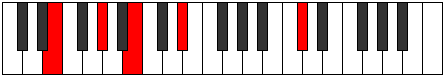

# Mode AFlatDagyllic

## Links

- [Documentation](index.md)
- [Scales Index](Scales.md)
- [Modes Index](Modes.md)
- [Chords Index](Chords.md)

## Scale

[Dagyllic](ScaleDagyllic.md)

## Mode

[AFlatDagyllic](ModeAFlatDagyllic.md)

## Tonic

Ab

## Signature

[CNaturalMajor]

## Perfection

 - 6 Perfect Notes

 - 2 Imperfect Notes

## Notes

- Ab
- B
- C (Imperfect)
- Db
- Eb (Imperfect)
- E
- F
- Gb
- Ab

## Illustration

## Relative Modes

| Number | Mode | Tonic | Notes | Illustration |
|--------|------|-------|-------|--------------|
| [1977](https://ianring.com/musictheory/scales/1977) | [Dagyllic](ModeDagyllic.md) | Ab | Ab, B, C, Db, Eb, E, F, Gb, Ab |  |
| [759](https://ianring.com/musictheory/scales/759) | [Katalyllic](ModeKatalyllic.md) | B | B, C, C#, D#, E, F, F#, G#, B |  |
| [2427](https://ianring.com/musictheory/scales/2427) | [Katoryllic](ModeKatoryllic.md) | C | C, C#, D#, E, F, F#, G#, B, C |  |
| [3261](https://ianring.com/musictheory/scales/3261) | [Dodyllic](ModeDodyllic.md) | Db | Db, Eb, E, F, Gb, Ab, B, C, Db |  |
| [1839](https://ianring.com/musictheory/scales/1839) | [Zogyllic](ModeZogyllic.md) | Eb | Eb, E, F, Gb, Ab, B, C, Db, Eb |  |
| [2967](https://ianring.com/musictheory/scales/2967) | [Madyllic](ModeMadyllic.md) | E | E, F, F#, G#, B, C, C#, D#, E |  |
| [3531](https://ianring.com/musictheory/scales/3531) | [Dycryllic](ModeDycryllic.md) | F | F, F#, G#, B, C, C#, D#, E, F |  |
| [3813](https://ianring.com/musictheory/scales/3813) | [Aeologyllic](ModeAeologyllic.md) | Gb | Gb, Ab, B, C, Db, Eb, E, F, Gb |  |

## Chords

### Ab

| Number | Root | Name | Notes | Illustration | Audio |
|--------|------|------|-------|--------------|-------|

### B

| Number | Root | Name | Notes | Illustration | Audio |
|--------|------|------|-------|--------------|-------|
| 2066 | B | [Bsus2bb5](ChordBNaturalSuspendedSecondDoubleFlatFifth.md) | B, C#, E |  | [midi](ChordBNaturalSuspendedSecondDoubleFlatFifthRootPosition.mid) |
| 2081 | B | [Bloc](ChordBNaturalLocrian.md) | B, C, F |  | [midi](ChordBNaturalLocrianRootPosition.mid) |
| 2082 | B | [Bsus2b5](ChordBNaturalSuspendedSecondFlatFifth.md) | B, C#, F |  | [midi](ChordBNaturalSuspendedSecondFlatFifthRootPosition.mid) |
| 2088 | B | [BMb5](ChordBNaturalMajorFlatFifth.md) | B, D#, F |  | [midi](ChordBNaturalMajorFlatFifthRootPosition.mid) |
| 2096 | B | [Bsus4b5](ChordBNaturalSuspendedFourthFlatFifth.md) | B, E, F |  | [midi](ChordBNaturalSuspendedFourthFlatFifthRootPosition.mid) |
| 2112 | B | [B5](ChordBNaturalPowerChord.md) | B, F# |  | [midi](ChordBNaturalPowerChordRootPosition.mid) |
| 2113 | B | [Bphryg](ChordBNaturalPhrygian.md) | B, C, F# |  | [midi](ChordBNaturalPhrygianRootPosition.mid) |
| 2114 | B | [Bsus2](ChordBNaturalSuspendedSecond.md) | B, C#, F# |  | [midi](ChordBNaturalSuspendedSecondRootPosition.mid) |
| 2120 | B | [BM](ChordBNaturalMajor.md) | B, D#, F# |  | [midi](ChordBNaturalMajorRootPosition.mid) |
| 2122 | B | [BM(add9)](ChordBNaturalMajorAddNinth.md) | B, D#, F#, C# |  | [midi](ChordBNaturalMajorAddNinthRootPosition.mid) |
| 2128 | B | [Bsus4](ChordBNaturalSuspendedFourth.md) | B, E, F# |  | [midi](ChordBNaturalSuspendedFourthRootPosition.mid) |
| 2136 | B | [BM(add11)](ChordBNaturalMajorAddEleventh.md) | B, D#, F#, E |  | [midi](ChordBNaturalMajorAddEleventhRootPosition.mid) |
| 2136 | B | [BM(add4)](ChordBNaturalMajorAddFourth.md) | B, D#, E, F# |  | [midi](ChordBNaturalMajorAddFourthRootPosition.mid) |
| 2144 | B | [Blyd](ChordBNaturalLydian.md) | B, E#, F# |  | [midi](ChordBNaturalLydianRootPosition.mid) |
| 2152 | B | [BM(add(#4))](ChordBNaturalMajorAddSharpFourth.md) | B, D#, E#, F# |  | [midi](ChordBNaturalMajorAddSharpFourthRootPosition.mid) |
| 2312 | B | [BM##5](ChordBNaturalMajorDoubleSharpFifth.md) | B, D#, G# |  | [midi](ChordBNaturalMajorDoubleSharpFifthRootPosition.mid) |
| 2320 | B | [Bsus4##5](ChordBNaturalSuspendedFourthDoubleSharpFifth.md) | B, E, G# |  | [midi](ChordBNaturalSuspendedFourthDoubleSharpFifthRootPosition.mid) |
| 2322 | B | [BM6sus2bb5](ChordBNaturalMajorSixthSuspendedSecondDoubleFlatFifth.md) | B, C#, E, G# |  | [midi](ChordBNaturalMajorSixthSuspendedSecondDoubleFlatFifthRootPosition.mid) |
| 2338 | B | [BM6sus2b5](ChordBNaturalMajorSixthSuspendedSecondFlatFifth.md) | B, C#, F, G# |  | [midi](ChordBNaturalMajorSixthSuspendedSecondFlatFifthRootPosition.mid) |
| 2344 | B | [BM6b5](ChordBNaturalMajorSixthFlatFifth.md) | B, D#, F, G# |  | [midi](ChordBNaturalMajorSixthFlatFifthRootPosition.mid) |
| 2370 | B | [BM6sus2](ChordBNaturalMajorSixthSuspendedSecond.md) | B, C#, F#, G# |  | [midi](ChordBNaturalMajorSixthSuspendedSecondRootPosition.mid) |
| 2370 | B | [B7sus2b5](ChordBNaturalDominantSeventhSuspendedSecondFlatFifth.md) | B, C#, F#, Ab |  | [midi](ChordBNaturalDominantSeventhSuspendedSecondFlatFifthRootPosition.mid) |
| 2376 | B | [BM6](ChordBNaturalMajorSixth.md) | B, D#, F#, G# |  | [midi](ChordBNaturalMajorSixthRootPosition.mid) |
| 2377 | B | [BM6(addb9)](ChordBNaturalMajorSixthAddFlatNinth.md) | B, D#, F#, G#, C |  | [midi](ChordBNaturalMajorSixthAddFlatNinthRootPosition.mid) |
| 2378 | B | [BM6(add9)](ChordBNaturalMajorSixthAddNinth.md) | B, D#, F#, G#, C# |  | [midi](ChordBNaturalMajorSixthAddNinthRootPosition.mid) |
| 2384 | B | [BM6sus4](ChordBNaturalMajorSixthSuspendedFourth.md) | B, E, F#, G# |  | [midi](ChordBNaturalMajorSixthSuspendedFourthRootPosition.mid) |

### C

| Number | Root | Name | Notes | Illustration | Audio |
|--------|------|------|-------|--------------|-------|
| 41 | C | [Cmbb5](ChordCNaturalMinorDoubleFlatFifth.md) | C, Eb, F |  | [midi](ChordCNaturalMinorDoubleFlatFifthRootPosition.mid) |
| 67 | C | [Cloc](ChordCNaturalLocrian.md) | C, Db, Gb |  | [midi](ChordCNaturalLocrianRootPosition.mid) |
| 73 | C | [Co](ChordCNaturalDiminished.md) | C, Eb, Gb |  | [midi](ChordCNaturalDiminishedRootPosition.mid) |
| 81 | C | [CMb5](ChordCNaturalMajorFlatFifth.md) | C, E, Gb |  | [midi](ChordCNaturalMajorFlatFifthRootPosition.mid) |
| 97 | C | [Csus4b5](ChordCNaturalSuspendedFourthFlatFifth.md) | C, F, Gb |  | [midi](ChordCNaturalSuspendedFourthFlatFifthRootPosition.mid) |
| 265 | C | [Cm#5](ChordCNaturalMinorSharpFifth.md) | C, Eb, Ab |  | [midi](ChordCNaturalMinorSharpFifthRootPosition.mid) |
| 273 | C | [C+](ChordCNaturalAugmented.md) | C, E, G# |  | [midi](ChordCNaturalAugmentedRootPosition.mid) |
| 273 | C | [C+7](ChordCNaturalAugmentedAugmentedSeventh.md) | C, E, G#, B# |  | [midi](ChordCNaturalAugmentedAugmentedSeventhRootPosition.mid) |
| 289 | C | [Csus4#5](ChordCNaturalSuspendedFourthSharpFifth.md) | C, F, G# |  | [midi](ChordCNaturalSuspendedFourthSharpFifthRootPosition.mid) |
| 2081 | C | [CQ+](ChordCNaturalQuartalAugmented.md) | C, F, B |  | [midi](ChordCNaturalQuartalAugmentedRootPosition.mid) |
| 2121 | C | [CoM7](ChordCNaturalDiminishedMajorSeventh.md) | C, Eb, Gb, B |  | [midi](ChordCNaturalDiminishedMajorSeventhRootPosition.mid) |
| 2129 | C | [CM7b5](ChordCNaturalMajorSeventhFlatFifth.md) | C, E, Gb, B |  | [midi](ChordCNaturalMajorSeventhFlatFifthRootPosition.mid) |
| 2321 | C | [C+(M7)](ChordCNaturalAugmentedMajorSeventh.md) | C, E, G#, B |  | [midi](ChordCNaturalAugmentedMajorSeventhRootPosition.mid) |
| 2337 | C | [CM7(sus4)#5](ChordCNaturalMajorSeventhSuspendedFourthSharpFifth.md) | C, F, G#, B |  | [midi](ChordCNaturalMajorSeventhSuspendedFourthSharpFifthRootPosition.mid) |

### Db

| Number | Root | Name | Notes | Illustration | Audio |
|--------|------|------|-------|--------------|-------|

### Eb

| Number | Root | Name | Notes | Illustration | Audio |
|--------|------|------|-------|--------------|-------|

### E

| Number | Root | Name | Notes | Illustration | Audio |
|--------|------|------|-------|--------------|-------|
| 2064 | E | [E5](ChordENaturalPowerChord.md) | E, B |  | [midi](ChordENaturalPowerChordRootPosition.mid) |
| 2096 | E | [Ephryg](ChordENaturalPhrygian.md) | E, F, B |  | [midi](ChordENaturalPhrygianRootPosition.mid) |
| 2128 | E | [Esus2](ChordENaturalSuspendedSecond.md) | E, F#, B |  | [midi](ChordENaturalSuspendedSecondRootPosition.mid) |
| 2320 | E | [EM](ChordENaturalMajor.md) | E, G#, B |  | [midi](ChordENaturalMajorRootPosition.mid) |
| 2384 | E | [EM(add9)](ChordENaturalMajorAddNinth.md) | E, G#, B, F# |  | [midi](ChordENaturalMajorAddNinthRootPosition.mid) |
| 81 | E | [Esus2#5](ChordENaturalSuspendedSecondSharpFifth.md) | E, F#, B# |  | [midi](ChordENaturalSuspendedSecondSharpFifthRootPosition.mid) |
| 273 | E | [E+](ChordENaturalAugmented.md) | E, G#, B# |  | [midi](ChordENaturalAugmentedRootPosition.mid) |
| 273 | E | [E+7](ChordENaturalAugmentedAugmentedSeventh.md) | E, G#, B#, D## |  | [midi](ChordENaturalAugmentedAugmentedSeventhRootPosition.mid) |
| 274 | E | [EM##5](ChordENaturalMajorDoubleSharpFifth.md) | E, G#, C# |  | [midi](ChordENaturalMajorDoubleSharpFifthRootPosition.mid) |
| 2130 | E | [EM6sus2](ChordENaturalMajorSixthSuspendedSecond.md) | E, F#, B, C# |  | [midi](ChordENaturalMajorSixthSuspendedSecondRootPosition.mid) |
| 2130 | E | [E7sus2b5](ChordENaturalDominantSeventhSuspendedSecondFlatFifth.md) | E, F#, B, Db |  | [midi](ChordENaturalDominantSeventhSuspendedSecondFlatFifthRootPosition.mid) |
| 2322 | E | [EM6](ChordENaturalMajorSixth.md) | E, G#, B, C# |  | [midi](ChordENaturalMajorSixthRootPosition.mid) |
| 2354 | E | [EM6(addb9)](ChordENaturalMajorSixthAddFlatNinth.md) | E, G#, B, C#, F |  | [midi](ChordENaturalMajorSixthAddFlatNinthRootPosition.mid) |
| 2386 | E | [EM6(add9)](ChordENaturalMajorSixthAddNinth.md) | E, G#, B, C#, F# |  | [midi](ChordENaturalMajorSixthAddNinthRootPosition.mid) |
| 2104 | E | [Ephryg+7](ChordENaturalPhrygianAddSeventh.md) | E, F, B, D# |  | [midi](ChordENaturalPhrygianAddSeventhRootPosition.mid) |
| 2136 | E | [EM7(sus2)](ChordENaturalMajorSeventhSuspendedSecond.md) | E, F#, B, D# |  | [midi](ChordENaturalMajorSeventhSuspendedSecondRootPosition.mid) |
| 2136 | E | [EM9sus2](ChordENaturalMajorNinthSuspendedSecond.md) | E, F#, B, D#, F# |  | [midi](ChordENaturalMajorNinthSuspendedSecondRootPosition.mid) |
| 2328 | E | [EM7](ChordENaturalMajorSeventh.md) | E, G#, B, D# |  | [midi](ChordENaturalMajorSeventhRootPosition.mid) |
| 2392 | E | [EM9](ChordENaturalMajorNinth.md) | E, G#, B, D#, F# |  | [midi](ChordENaturalMajorNinthRootPosition.mid) |
| 281 | E | [E+(M7)](ChordENaturalAugmentedMajorSeventh.md) | E, G#, B#, D# |  | [midi](ChordENaturalAugmentedMajorSeventhRootPosition.mid) |
| 282 | E | [EM7##5](ChordENaturalMajorSeventhDoubleSharpFifth.md) | E, G#, C#, D# |  | [midi](ChordENaturalMajorSeventhDoubleSharpFifthRootPosition.mid) |
| 2330 | E | [EM7add13](ChordENaturalMajorSeventhAddThirteenth.md) | E, G#, B, D#, C# |  | [midi](ChordENaturalMajorSeventhAddThirteenthRootPosition.mid) |

### F

| Number | Root | Name | Notes | Illustration | Audio |
|--------|------|------|-------|--------------|-------|
| 2144 | F | [Floc](ChordFNaturalLocrian.md) | F, Gb, Cb |  | [midi](ChordFNaturalLocrianRootPosition.mid) |
| 2336 | F | [Fo](ChordFNaturalDiminished.md) | F, Ab, Cb |  | [midi](ChordFNaturalDiminishedRootPosition.mid) |
| 33 | F | [F5](ChordFNaturalPowerChord.md) | F, C |  | [midi](ChordFNaturalPowerChordRootPosition.mid) |
| 97 | F | [Fphryg](ChordFNaturalPhrygian.md) | F, Gb, C |  | [midi](ChordFNaturalPhrygianRootPosition.mid) |
| 289 | F | [Fm](ChordFNaturalMinor.md) | F, Ab, C |  | [midi](ChordFNaturalMinorRootPosition.mid) |
| 289 | F | [Fm(add(#9))](ChordFNaturalMinorAddSharpNinth.md) | F, Ab, C, G# |  | [midi](ChordFNaturalMinorAddSharpNinthRootPosition.mid) |
| 2081 | F | [Flyd](ChordFNaturalLydian.md) | F, B, C |  | [midi](ChordFNaturalLydianRootPosition.mid) |
| 2337 | F | [Fm(add(#4))](ChordFNaturalMinorAddSharpFourth.md) | F, Ab, B, C |  | [midi](ChordFNaturalMinorAddSharpFourthRootPosition.mid) |
| 290 | F | [Fm#5](ChordFNaturalMinorSharpFifth.md) | F, Ab, Db |  | [midi](ChordFNaturalMinorSharpFifthRootPosition.mid) |
| 2344 | F | [Fø7](ChordFNaturalHalfDiminishedSeventh.md) | F, Ab, Cb, Eb |  | [midi](ChordFNaturalHalfDiminishedSeventhRootPosition.mid) |
| 297 | F | [Fm7](ChordFNaturalMinorSeventh.md) | F, Ab, C, Eb |  | [midi](ChordFNaturalMinorSeventhRootPosition.mid) |
| 361 | F | [Fm7b9](ChordFNaturalMinorSeventhFlatNinth.md) | F, Ab, C, Eb, Gb |  | [midi](ChordFNaturalMinorSeventhFlatNinthRootPosition.mid) |
| 2345 | F | [Fm7add(#11)](ChordFNaturalMinorSeventhAddSharpEleventh.md) | F, Ab, C, Eb, B |  | [midi](ChordFNaturalMinorSeventhAddSharpEleventhRootPosition.mid) |
| 298 | F | [Fm7#5](ChordFNaturalMinorSeventhSharpFifth.md) | F, Ab, C#, Eb |  | [midi](ChordFNaturalMinorSeventhSharpFifthRootPosition.mid) |
| 2352 | F | [FoM7](ChordFNaturalDiminishedMajorSeventh.md) | F, Ab, Cb, E |  | [midi](ChordFNaturalDiminishedMajorSeventhRootPosition.mid) |
| 113 | F | [Fphryg+7](ChordFNaturalPhrygianAddSeventh.md) | F, Gb, C, E |  | [midi](ChordFNaturalPhrygianAddSeventhRootPosition.mid) |
| 305 | F | [Fm(M7)](ChordFNaturalMinorMajorSeventh.md) | F, Ab, C, E |  | [midi](ChordFNaturalMinorMajorSeventhRootPosition.mid) |
| 2097 | F | [Flyd(M7)](ChordFNaturalLydianMajorSeventh.md) | F, B, C, E |  | [midi](ChordFNaturalLydianMajorSeventhRootPosition.mid) |

### Gb

| Number | Root | Name | Notes | Illustration | Audio |
|--------|------|------|-------|--------------|-------|

