# Mode AFlatDalic

## Links

- [Documentation](README.md)
- [Scales Index](Scales.md)
- [Modes Index](Modes.md)
- [Chords Index](Chords.md)

## Parent Scale

[Aeoloric](ScaleAeoloric.md)

## Mode

[AFlatDalic](ModeAFlatDalic.md)

## Number

275

## Luminosity

-1

## Tonic

Ab

## Signature

C

## Transposition

1, 3, 4, 4

## Chord Pattern

## Perfection

 - 1 Perfect Notes

 - 3 Imperfect Notes

 - Perfection Profile - false, true, false, false

## Notes

- Ab (Imperfect)
- A
- C (Imperfect)
- E (Imperfect)
- Ab (Imperfect)

## Illustration

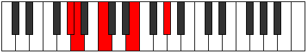

## Diagram

| Circle of Fifth | Chromatic Circle |
|-----------------|------------------|
| 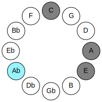 | 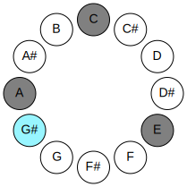 |
## Relative Modes

| Number | Mode | Luminosity | Tonic | Notes | Illustration |
|--------|------|------------|-------|-------|--------------|
| [275](https://ianring.com/musictheory/scales/275) | [Dalic](ModeDalic.md) | -1 | G# | G#, A, C, E, G# |  |
| [275](https://ianring.com/musictheory/scales/275) | [Dalic](ModeDalic.md) | -1 | Ab | Ab, A, C, E, Ab |  |
| [2185](https://ianring.com/musictheory/scales/2185) | [Dygic](ModeDygic.md) | 4 | A | A, C, E, G#, A | 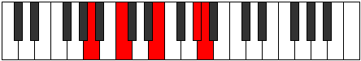 |
| [785](https://ianring.com/musictheory/scales/785) | [Aeoloric](ModeAeoloric.md) | -1 | C | C, E, G#, A, C | 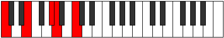 |
| [305](https://ianring.com/musictheory/scales/305) | [Gonic](ModeGonic.md) | 3 | E | E, G#, A, C, E | 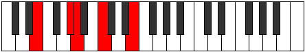 |
## Relative Brightness

| Number | Mode | Luminosity | Tonic | Notes | Circle Of Fifth | Chromatic Circle |
|--------|------|------------|-------|-------|-----------------|------------------|
| [275](https://ianring.com/musictheory/scales/275) | [Dalic](ModeDalic.md) | -1 | G# | G#, A, C, E, G# |  |  |
| [275](https://ianring.com/musictheory/scales/275) | [Dalic](ModeDalic.md) | -1 | Ab | Ab, A, C, E, Ab |  |  |
| [2185](https://ianring.com/musictheory/scales/2185) | [Dygic](ModeDygic.md) | 4 | A | A, C, E, G#, A | 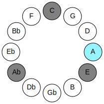 | 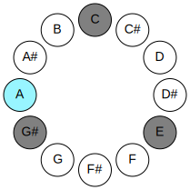 |
| [785](https://ianring.com/musictheory/scales/785) | [Aeoloric](ModeAeoloric.md) | -1 | C | C, E, G#, A, C | 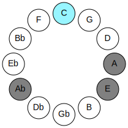 | 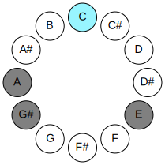 |
| [305](https://ianring.com/musictheory/scales/305) | [Gonic](ModeGonic.md) | 3 | E | E, G#, A, C, E | 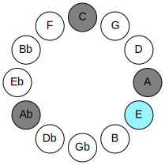 | 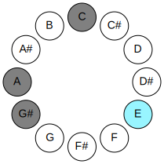 |

## Chords

### Ab

| Number | Root | Name | Notes | Illustration | Audio |
|--------|------|------|-------|--------------|-------|
| 273 | Ab | [G#+](ChordGSharpAugmented.md) | G#, B#, D## |  | [midi](ChordGSharpAugmentedRootPosition.mid) |
| 273 | Ab | [G#+7](ChordGSharpAugmentedAugmentedSeventh.md) | G#, B#, D##, F### |  | [midi](ChordGSharpAugmentedAugmentedSeventhRootPosition.mid) |
| 273 | Ab | [Ab+](ChordAFlatAugmented.md) | Ab, C, E |  | [midi](ChordAFlatAugmentedRootPosition.mid) |
| 273 | Ab | [Ab+7](ChordAFlatAugmentedAugmentedSeventh.md) | Ab, C, E, G# |  | [midi](ChordAFlatAugmentedAugmentedSeventhRootPosition.mid) |

### A

| Number | Root | Name | Notes | Illustration | Audio |
|--------|------|------|-------|--------------|-------|
| 528 | A | [A5](ChordANaturalPowerChord.md) | A, E |  | [midi](ChordANaturalPowerChordRootPosition.mid) |
| 529 | A | [Am](ChordANaturalMinor.md) | A, C, E |  | [midi](ChordANaturalMinorRootPosition.mid) |
| 529 | A | [Am(add(#9))](ChordANaturalMinorAddSharpNinth.md) | A, C, E, B# |  | [midi](ChordANaturalMinorAddSharpNinthRootPosition.mid) |
| 785 | A | [Am(M7)](ChordANaturalMinorMajorSeventh.md) | A, C, E, G# |  | [midi](ChordANaturalMinorMajorSeventhRootPosition.mid) |

### C

| Number | Root | Name | Notes | Illustration | Audio |
|--------|------|------|-------|--------------|-------|
| 273 | C | [C+](ChordCNaturalAugmented.md) | C, E, G# |  | [midi](ChordCNaturalAugmentedRootPosition.mid) |
| 273 | C | [C+7](ChordCNaturalAugmentedAugmentedSeventh.md) | C, E, G#, B# |  | [midi](ChordCNaturalAugmentedAugmentedSeventhRootPosition.mid) |
| 529 | C | [CM##5](ChordCNaturalMajorDoubleSharpFifth.md) | C, E, A |  | [midi](ChordCNaturalMajorDoubleSharpFifthRootPosition.mid) |

### E

| Number | Root | Name | Notes | Illustration | Audio |
|--------|------|------|-------|--------------|-------|
| 273 | E | [E+](ChordENaturalAugmented.md) | E, G#, B# |  | [midi](ChordENaturalAugmentedRootPosition.mid) |
| 273 | E | [E+7](ChordENaturalAugmentedAugmentedSeventh.md) | E, G#, B#, D## |  | [midi](ChordENaturalAugmentedAugmentedSeventhRootPosition.mid) |
| 529 | E | [Esus4#5](ChordENaturalSuspendedFourthSharpFifth.md) | E, A, B# |  | [midi](ChordENaturalSuspendedFourthSharpFifthRootPosition.mid) |

