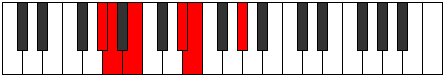
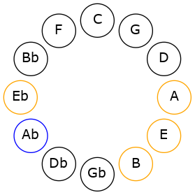
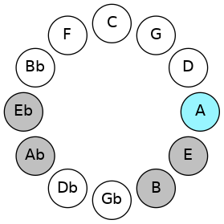
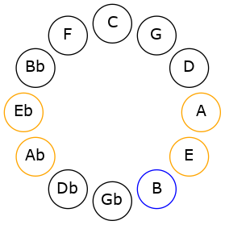
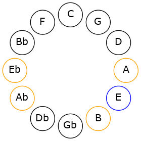

# Mode AFlatDalitonic

## Links

- [Documentation](README.md)
- [Scales Index](Scales.md)
- [Modes Index](Modes.md)
- [Chords Index](Chords.md)

## Scale

[Phraditonic](ScalePhraditonic.md)

## Mode

[AFlatDalitonic](ModeAFlatDalitonic.md)

## Tonic

Ab

## Signature

[CNaturalMajor]

## Interval Pattern

1, 2, 4, 1, 4

## Chord Pattern

## Perfection

 - 3 Perfect Notes

 - 2 Imperfect Notes

## Notes

- Ab
- A
- B (Imperfect)
- Eb (Imperfect)
- E
- Ab

## Illustration

## Diagram

## Relative Modes

| Number | Mode | Tonic | Notes | Illustration |
|--------|------|-------|-------|--------------|
| [395](https://ianring.com/musictheory/scales/395) | [Dalitonic](ModeDalitonic.md) | Ab | Ab, A, B, Eb, E, Ab |  |
| [2245](https://ianring.com/musictheory/scales/2245) | [Dygitonic](ModeDygitonic.md) | A | A, B, D#, E, G#, A |  |
| [1585](https://ianring.com/musictheory/scales/1585) | [Phraditonic](ModePhraditonic.md) | B | B, D#, E, G#, A, B |  |
| [355](https://ianring.com/musictheory/scales/355) | [Aeoloritonic](ModeAeoloritonic.md) | Eb | Eb, E, Ab, A, B, Eb |  |
| [2225](https://ianring.com/musictheory/scales/2225) | [Gonitonic](ModeGonitonic.md) | E | E, G#, A, B, D#, E |  |
## Relative Brightness

| Number | Mode | Tonic | Notes | Illustration |
|--------|------|-------|-------|--------------|
| [395](https://ianring.com/musictheory/scales/395) | [Dalitonic](ModeDalitonic.md) | Ab | Ab, A, B, Eb, E, Ab |  |
| [2245](https://ianring.com/musictheory/scales/2245) | [Dygitonic](ModeDygitonic.md) | A | A, B, D#, E, G#, A |  |
| [1585](https://ianring.com/musictheory/scales/1585) | [Phraditonic](ModePhraditonic.md) | B | B, D#, E, G#, A, B |  |
| [355](https://ianring.com/musictheory/scales/355) | [Aeoloritonic](ModeAeoloritonic.md) | Eb | Eb, E, Ab, A, B, Eb |  |
| [2225](https://ianring.com/musictheory/scales/2225) | [Gonitonic](ModeGonitonic.md) | E | E, G#, A, B, D#, E |  |

## Chords

### Ab

| Number | Root | Name | Notes | Illustration | Audio |
|--------|------|------|-------|--------------|-------|
| 264 | Ab | [Ab5](ChordAFlatPowerChord.md) | Ab, Eb |  | [midi](ChordAFlatPowerChordRootPosition.mid) |
| 776 | Ab | [Abphryg](ChordAFlatPhrygian.md) | Ab, Bbb, Eb |  | [midi](ChordAFlatPhrygianRootPosition.mid) |
| 2312 | Ab | [Abm](ChordAFlatMinor.md) | Ab, Cb, Eb |  | [midi](ChordAFlatMinorRootPosition.mid) |
| 2312 | Ab | [Abm(add(#9))](ChordAFlatMinorAddSharpNinth.md) | Ab, Cb, Eb, B |  | [midi](ChordAFlatMinorAddSharpNinthRootPosition.mid) |
| 2320 | Ab | [Abm#5](ChordAFlatMinorSharpFifth.md) | Ab, Cb, Fb |  | [midi](ChordAFlatMinorSharpFifthRootPosition.mid) |

### A

| Number | Root | Name | Notes | Illustration | Audio |
|--------|------|------|-------|--------------|-------|
| 2568 | A | [A](ChordANaturalDiminishedFlatThird.md) | A, Cb, Eb |  | [midi](ChordANaturalDiminishedFlatThirdRootPosition.mid) |
| 2568 | A | [Asus2b5](ChordANaturalSuspendedSecondFlatFifth.md) | A, B, Eb |  | [midi](ChordANaturalSuspendedSecondFlatFifthRootPosition.mid) |
| 528 | A | [A5](ChordANaturalPowerChord.md) | A, E |  | [midi](ChordANaturalPowerChordRootPosition.mid) |
| 2576 | A | [Asus2](ChordANaturalSuspendedSecond.md) | A, B, E |  | [midi](ChordANaturalSuspendedSecondRootPosition.mid) |
| 536 | A | [Alyd](ChordANaturalLydian.md) | A, D#, E |  | [midi](ChordANaturalLydianRootPosition.mid) |
| 2832 | A | [AM7(sus2)](ChordANaturalMajorSeventhSuspendedSecond.md) | A, B, E, G# |  | [midi](ChordANaturalMajorSeventhSuspendedSecondRootPosition.mid) |
| 2832 | A | [AM9sus2](ChordANaturalMajorNinthSuspendedSecond.md) | A, B, E, G#, B |  | [midi](ChordANaturalMajorNinthSuspendedSecondRootPosition.mid) |
| 792 | A | [Alyd(M7)](ChordANaturalLydianMajorSeventh.md) | A, D#, E, G# |  | [midi](ChordANaturalLydianMajorSeventhRootPosition.mid) |

### B

| Number | Root | Name | Notes | Illustration | Audio |
|--------|------|------|-------|--------------|-------|
| 2312 | B | [BM##5](ChordBNaturalMajorDoubleSharpFifth.md) | B, D#, G# |  | [midi](ChordBNaturalMajorDoubleSharpFifthRootPosition.mid) |
| 2320 | B | [Bsus4##5](ChordBNaturalSuspendedFourthDoubleSharpFifth.md) | B, E, G# |  | [midi](ChordBNaturalSuspendedFourthDoubleSharpFifthRootPosition.mid) |
| 2576 | B | [BQ](ChordBNaturalQuartal.md) | B, E, A |  | [midi](ChordBNaturalQuartalRootPosition.mid) |

### Eb

| Number | Root | Name | Notes | Illustration | Audio |
|--------|------|------|-------|--------------|-------|
| 536 | Eb | [Ebloc](ChordEFlatLocrian.md) | Eb, Fb, Bbb |  | [midi](ChordEFlatLocrianRootPosition.mid) |
| 776 | Eb | [Ebsus4b5](ChordEFlatSuspendedFourthFlatFifth.md) | Eb, Ab, Bbb |  | [midi](ChordEFlatSuspendedFourthFlatFifthRootPosition.mid) |
| 2312 | Eb | [Ebsus4#5](ChordEFlatSuspendedFourthSharpFifth.md) | Eb, Ab, B |  | [midi](ChordEFlatSuspendedFourthSharpFifthRootPosition.mid) |

### E

| Number | Root | Name | Notes | Illustration | Audio |
|--------|------|------|-------|--------------|-------|
| 2064 | E | [E5](ChordENaturalPowerChord.md) | E, B |  | [midi](ChordENaturalPowerChordRootPosition.mid) |
| 2320 | E | [EM](ChordENaturalMajor.md) | E, G#, B |  | [midi](ChordENaturalMajorRootPosition.mid) |
| 2576 | E | [Esus4](ChordENaturalSuspendedFourth.md) | E, A, B |  | [midi](ChordENaturalSuspendedFourthRootPosition.mid) |
| 2832 | E | [EM(add11)](ChordENaturalMajorAddEleventh.md) | E, G#, B, A |  | [midi](ChordENaturalMajorAddEleventhRootPosition.mid) |
| 2832 | E | [EM(add4)](ChordENaturalMajorAddFourth.md) | E, G#, A, B |  | [midi](ChordENaturalMajorAddFourthRootPosition.mid) |
| 536 | E | [EQ+](ChordENaturalQuartalAugmented.md) | E, A, D# |  | [midi](ChordENaturalQuartalAugmentedRootPosition.mid) |
| 2328 | E | [EM7](ChordENaturalMajorSeventh.md) | E, G#, B, D# |  | [midi](ChordENaturalMajorSeventhRootPosition.mid) |
| 2584 | E | [EM7(sus4)](ChordENaturalMajorSeventhSuspendedFourth.md) | E, A, B, D# |  | [midi](ChordENaturalMajorSeventhSuspendedFourthRootPosition.mid) |
| 2840 | E | [EM7add4](ChordENaturalMajorSeventhAddFourth.md) | E, G#, A, B, D# |  | [midi](ChordENaturalMajorSeventhAddFourthRootPosition.mid) |
| 2840 | E | [EM7add11](ChordENaturalMajorSeventhAddEleventh.md) | E, G#, B, D#, A |  | [midi](ChordENaturalMajorSeventhAddEleventhRootPosition.mid) |

