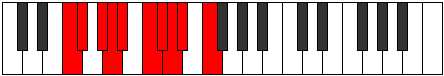
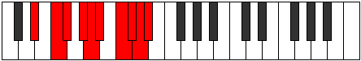

# Mode AFlatDanygic

## Links

- [Documentation](index.md)
- [Scales Index](Scales.md)
- [Modes Index](Modes.md)
- [Chords Index](Chords.md)

## Scale

[Epyrygic](ScaleEpyrygic.md)

## Mode

[AFlatDanygic](ModeAFlatDanygic.md)

## Tonic

Ab

## Signature

[CNaturalMajor]

## Perfection

 - 7 Perfect Notes

 - 2 Imperfect Notes

## Notes

- Ab
- A (Imperfect)
- Bb
- C (Imperfect)
- Db
- D
- Eb
- F
- Gb
- Ab

## Illustration

## Relative Modes

| Number | Mode | Tonic | Notes | Illustration |
|--------|------|-------|-------|--------------|
| [1783](https://ianring.com/musictheory/scales/1783) | [Danygic](ModeDanygic.md) | G# | G#, A, A#, C, C#, D, D#, F, F#, G# |  |
| [1783](https://ianring.com/musictheory/scales/1783) | [Danygic](ModeDanygic.md) | Ab | Ab, A, Bb, C, Db, D, Eb, F, Gb, Ab |  |
| [1903](https://ianring.com/musictheory/scales/1903) | [Rocrygic](ModeRocrygic.md) | C | C, C#, D, D#, F, F#, G#, A, A#, C |  |
| [1979](https://ianring.com/musictheory/scales/1979) | [Aeradygic](ModeAeradygic.md) | F | F, F#, G#, A, A#, C, C#, D, D#, F |  |
| [2939](https://ianring.com/musictheory/scales/2939) | [Goptygic](ModeGoptygic.md) | A | A, A#, C, C#, D, D#, F, F#, G#, A |  |
| [2999](https://ianring.com/musictheory/scales/2999) | [Zyrygic](ModeZyrygic.md) | C# | C#, D, D#, F, F#, G#, A, A#, C, C# |  |
| [2999](https://ianring.com/musictheory/scales/2999) | [Zyrygic](ModeZyrygic.md) | Db | Db, D, Eb, F, Gb, Ab, A, Bb, C, Db |  |
| [3037](https://ianring.com/musictheory/scales/3037) | [Staptygic](ModeStaptygic.md) | F# | F#, G#, A, A#, C, C#, D, D#, F, F# |  |
| [3037](https://ianring.com/musictheory/scales/3037) | [Staptygic](ModeStaptygic.md) | Gb | Gb, Ab, A, Bb, C, Db, D, Eb, F, Gb |  |
| [3517](https://ianring.com/musictheory/scales/3517) | [Epocrygic](ModeEpocrygic.md) | A# | A#, C, C#, D, D#, F, F#, G#, A, A# |  |
| [3517](https://ianring.com/musictheory/scales/3517) | [Epocrygic](ModeEpocrygic.md) | Bb | Bb, C, Db, D, Eb, F, Gb, Ab, A, Bb |  |
| [3547](https://ianring.com/musictheory/scales/3547) | [Sadygic](ModeSadygic.md) | D | D, D#, F, F#, G#, A, A#, C, C#, D |  |
| [3821](https://ianring.com/musictheory/scales/3821) | [Epyrygic](ModeEpyrygic.md) | D# | D#, F, F#, G#, A, A#, C, C#, D, D# |  |
| [3821](https://ianring.com/musictheory/scales/3821) | [Epyrygic](ModeEpyrygic.md) | Eb | Eb, F, Gb, Ab, A, Bb, C, Db, D, Eb |  |

## Chords

### Ab

| Number | Root | Name | Notes | Illustration | Audio |
|--------|------|------|-------|--------------|-------|
| 1282 | Ab | [Absus2bb5](ChordAFlatSuspendedSecondDoubleFlatFifth.md) | Ab, Bb, Db |  | [midi](ChordAFlatSuspendedSecondDoubleFlatFifthRootPosition.mid) |
| 772 | Ab | [Abloc](ChordAFlatLocrian.md) | Ab, Bbb, Ebb |  | [midi](ChordAFlatLocrianRootPosition.mid) |
| 1284 | Ab | [Absus2b5](ChordAFlatSuspendedSecondFlatFifth.md) | Ab, Bb, Ebb |  | [midi](ChordAFlatSuspendedSecondFlatFifthRootPosition.mid) |
| 261 | Ab | [AbMb5](ChordAFlatMajorFlatFifth.md) | Ab, C, Ebb |  | [midi](ChordAFlatMajorFlatFifthRootPosition.mid) |
| 262 | Ab | [Absus4b5](ChordAFlatSuspendedFourthFlatFifth.md) | Ab, Db, Ebb |  | [midi](ChordAFlatSuspendedFourthFlatFifthRootPosition.mid) |
| 264 | Ab | [Ab5](ChordAFlatPowerChord.md) | Ab, Eb |  | [midi](ChordAFlatPowerChordRootPosition.mid) |
| 776 | Ab | [Abphryg](ChordAFlatPhrygian.md) | Ab, Bbb, Eb |  | [midi](ChordAFlatPhrygianRootPosition.mid) |
| 1288 | Ab | [Absus2](ChordAFlatSuspendedSecond.md) | Ab, Bb, Eb |  | [midi](ChordAFlatSuspendedSecondRootPosition.mid) |
| 265 | Ab | [AbM](ChordAFlatMajor.md) | Ab, C, Eb |  | [midi](ChordAFlatMajorRootPosition.mid) |
| 1289 | Ab | [AbM(add9)](ChordAFlatMajorAddNinth.md) | Ab, C, Eb, Bb |  | [midi](ChordAFlatMajorAddNinthRootPosition.mid) |
| 266 | Ab | [Absus4](ChordAFlatSuspendedFourth.md) | Ab, Db, Eb |  | [midi](ChordAFlatSuspendedFourthRootPosition.mid) |
| 267 | Ab | [AbM(add11)](ChordAFlatMajorAddEleventh.md) | Ab, C, Eb, Db |  | [midi](ChordAFlatMajorAddEleventhRootPosition.mid) |
| 267 | Ab | [AbM(add4)](ChordAFlatMajorAddFourth.md) | Ab, C, Db, Eb |  | [midi](ChordAFlatMajorAddFourthRootPosition.mid) |
| 268 | Ab | [Ablyd](ChordAFlatLydian.md) | Ab, D, Eb |  | [midi](ChordAFlatLydianRootPosition.mid) |
| 269 | Ab | [AbM(add(#4))](ChordAFlatMajorAddSharpFourth.md) | Ab, C, D, Eb |  | [midi](ChordAFlatMajorAddSharpFourthRootPosition.mid) |
| 289 | Ab | [AbM##5](ChordAFlatMajorDoubleSharpFifth.md) | Ab, C, F |  | [midi](ChordAFlatMajorDoubleSharpFifthRootPosition.mid) |
| 290 | Ab | [Absus4##5](ChordAFlatSuspendedFourthDoubleSharpFifth.md) | Ab, Db, F |  | [midi](ChordAFlatSuspendedFourthDoubleSharpFifthRootPosition.mid) |
| 1314 | Ab | [AbM6sus2bb5](ChordAFlatMajorSixthSuspendedSecondDoubleFlatFifth.md) | Ab, Bb, Db, F |  | [midi](ChordAFlatMajorSixthSuspendedSecondDoubleFlatFifthRootPosition.mid) |
| 1316 | Ab | [AbM6sus2b5](ChordAFlatMajorSixthSuspendedSecondFlatFifth.md) | Ab, Bb, Ebb, F |  | [midi](ChordAFlatMajorSixthSuspendedSecondFlatFifthRootPosition.mid) |
| 293 | Ab | [AbM6b5](ChordAFlatMajorSixthFlatFifth.md) | Ab, C, Ebb, F |  | [midi](ChordAFlatMajorSixthFlatFifthRootPosition.mid) |
| 1320 | Ab | [AbM6sus2](ChordAFlatMajorSixthSuspendedSecond.md) | Ab, Bb, Eb, F |  | [midi](ChordAFlatMajorSixthSuspendedSecondRootPosition.mid) |
| 1320 | Ab | [Ab7sus2b5](ChordAFlatDominantSeventhSuspendedSecondFlatFifth.md) | Ab, Bb, Eb, Gbb |  | [midi](ChordAFlatDominantSeventhSuspendedSecondFlatFifthRootPosition.mid) |
| 297 | Ab | [AbM6](ChordAFlatMajorSixth.md) | Ab, C, Eb, F |  | [midi](ChordAFlatMajorSixthRootPosition.mid) |
| 809 | Ab | [AbM6(addb9)](ChordAFlatMajorSixthAddFlatNinth.md) | Ab, C, Eb, F, Bbb |  | [midi](ChordAFlatMajorSixthAddFlatNinthRootPosition.mid) |
| 1321 | Ab | [AbM6(add9)](ChordAFlatMajorSixthAddNinth.md) | Ab, C, Eb, F, Bb |  | [midi](ChordAFlatMajorSixthAddNinthRootPosition.mid) |
| 298 | Ab | [AbM6sus4](ChordAFlatMajorSixthSuspendedFourth.md) | Ab, Db, Eb, F |  | [midi](ChordAFlatMajorSixthSuspendedFourthRootPosition.mid) |
| 322 | Ab | [AbQ](ChordAFlatQuartal.md) | Ab, Db, Gb |  | [midi](ChordAFlatQuartalRootPosition.mid) |
| 325 | Ab | [Ab7b5](ChordAFlatDominantSeventhFlatFifth.md) | Ab, C, Ebb, Gb |  | [midi](ChordAFlatDominantSeventhFlatFifthRootPosition.mid) |
| 837 | Ab | [Ab7b5b9](ChordAFlatDominantSeventhFlatFifthFlatNinth.md) | Ab, C, Ebb, Gb, Bbb |  | [midi](ChordAFlatDominantSeventhFlatFifthFlatNinthRootPosition.mid) |
| 1352 | Ab | [Ab7sus2](ChordAFlatDominantSeventhSuspendedSecond.md) | Ab, Bb, Eb, Gb |  | [midi](ChordAFlatDominantSeventhSuspendedSecondRootPosition.mid) |
| 1352 | Ab | [Ab9sus2](ChordAFlatDominantNinthSuspendedSecond.md) | Ab, Bb, Eb, Gb, Bb |  | [midi](ChordAFlatDominantNinthSuspendedSecondRootPosition.mid) |
| 329 | Ab | [Ab7](ChordAFlatDominantSeventh.md) | Ab, C, Eb, Gb |  | [midi](ChordAFlatDominantSeventhRootPosition.mid) |
| 841 | Ab | [Ab7b9](ChordAFlatDominantSeventhFlatNinth.md) | Ab, C, Eb, Gb, Bbb |  | [midi](ChordAFlatDominantSeventhFlatNinthRootPosition.mid) |
| 1353 | Ab | [Ab9](ChordAFlatDominantNinth.md) | Ab, C, Eb, Gb, Bb |  | [midi](ChordAFlatDominantNinthRootPosition.mid) |
| 330 | Ab | [Ab7sus4](ChordAFlatDominantSeventhSuspendedFourth.md) | Ab, Db, Eb, Gb |  | [midi](ChordAFlatDominantSeventhSuspendedFourthRootPosition.mid) |
| 1354 | Ab | [Ab9sus4](ChordAFlatDominantNinthSuspendedFourth.md) | Ab, Db, Eb, Gb, Bb |  | [midi](ChordAFlatDominantNinthSuspendedFourthRootPosition.mid) |
| 331 | Ab | [Ab7add4](ChordAFlatDominantSeventhAddFourth.md) | Ab, C, Db, Eb, Gb |  | [midi](ChordAFlatDominantSeventhAddFourthRootPosition.mid) |
| 331 | Ab | [Ab7add11](ChordAFlatDominantSeventhAddEleventh.md) | Ab, C, Eb, Gb, Db |  | [midi](ChordAFlatDominantSeventhAddEleventhRootPosition.mid) |
| 1355 | Ab | [Ab11](ChordAFlatDominantEleventh.md) | Ab, C, Eb, Gb, Bb, Db |  | [midi](ChordAFlatDominantEleventhRootPosition.mid) |
| 333 | Ab | [Ab7add(#4)](ChordAFlatDominantSeventhAddSharpFourth.md) | Ab, C, D, Eb, Gb |  | [midi](ChordAFlatDominantSeventhAddSharpFourthRootPosition.mid) |
| 333 | Ab | [Ab7#11](ChordAFlatDominantSeventhSharpEleventh.md) | Ab, C, Eb, Gb, D |  | [midi](ChordAFlatDominantSeventhSharpEleventhRootPosition.mid) |
| 1357 | Ab | [Ab9#11](ChordAFlatDominantNinthSharpEleventh.md) | Ab, C, Eb, Gb, Bb, D |  | [midi](ChordAFlatDominantNinthSharpEleventhRootPosition.mid) |
| 361 | Ab | [Ab7add13](ChordAFlatDominantSeventhAddThirteenth.md) | Ab, C, Eb, Gb, F |  | [midi](ChordAFlatDominantSeventhAddThirteenthRootPosition.mid) |
| 875 | Ab | [Ab13b9](ChordAFlatDominantThirteenthFlatNinth.md) | Ab, C, Eb, Gb, Bbb, Db, F |  | [midi](ChordAFlatDominantThirteenthFlatNinthRootPosition.mid) |
| 1387 | Ab | [Ab13](ChordAFlatDominantThirteenth.md) | Ab, C, Eb, Gb, Bb, Db, F |  | [midi](ChordAFlatDominantThirteenthRootPosition.mid) |

### A

| Number | Root | Name | Notes | Illustration | Audio |
|--------|------|------|-------|--------------|-------|
| 517 | A | [Ambb5](ChordANaturalMinorDoubleFlatFifth.md) | A, C, D |  | [midi](ChordANaturalMinorDoubleFlatFifthRootPosition.mid) |
| 1544 | A | [Aloc](ChordANaturalLocrian.md) | A, Bb, Eb |  | [midi](ChordANaturalLocrianRootPosition.mid) |
| 521 | A | [Ao](ChordANaturalDiminished.md) | A, C, Eb |  | [midi](ChordANaturalDiminishedRootPosition.mid) |
| 522 | A | [AMb5](ChordANaturalMajorFlatFifth.md) | A, C#, Eb |  | [midi](ChordANaturalMajorFlatFifthRootPosition.mid) |
| 524 | A | [Asus4b5](ChordANaturalSuspendedFourthFlatFifth.md) | A, D, Eb |  | [midi](ChordANaturalSuspendedFourthFlatFifthRootPosition.mid) |
| 545 | A | [Am#5](ChordANaturalMinorSharpFifth.md) | A, C, F |  | [midi](ChordANaturalMinorSharpFifthRootPosition.mid) |
| 546 | A | [A+](ChordANaturalAugmented.md) | A, C#, E# |  | [midi](ChordANaturalAugmentedRootPosition.mid) |
| 546 | A | [A+7](ChordANaturalAugmentedAugmentedSeventh.md) | A, C#, E#, G## |  | [midi](ChordANaturalAugmentedAugmentedSeventhRootPosition.mid) |
| 548 | A | [Asus4#5](ChordANaturalSuspendedFourthSharpFifth.md) | A, D, E# |  | [midi](ChordANaturalSuspendedFourthSharpFifthRootPosition.mid) |
| 578 | A | [AM##5](ChordANaturalMajorDoubleSharpFifth.md) | A, C#, F# |  | [midi](ChordANaturalMajorDoubleSharpFifthRootPosition.mid) |
| 580 | A | [Asus4##5](ChordANaturalSuspendedFourthDoubleSharpFifth.md) | A, D, F# |  | [midi](ChordANaturalSuspendedFourthDoubleSharpFifthRootPosition.mid) |
| 585 | A | [Ao7](ChordANaturalFullDiminishedSeventh.md) | A, C, Eb, Gb |  | [midi](ChordANaturalFullDiminishedSeventhRootPosition.mid) |
| 586 | A | [AM6b5](ChordANaturalMajorSixthFlatFifth.md) | A, C#, Eb, F# |  | [midi](ChordANaturalMajorSixthFlatFifthRootPosition.mid) |
| 772 | A | [AQ+](ChordANaturalQuartalAugmented.md) | A, D, G# |  | [midi](ChordANaturalQuartalAugmentedRootPosition.mid) |
| 777 | A | [AoM7](ChordANaturalDiminishedMajorSeventh.md) | A, C, Eb, G# |  | [midi](ChordANaturalDiminishedMajorSeventhRootPosition.mid) |
| 778 | A | [AM7b5](ChordANaturalMajorSeventhFlatFifth.md) | A, C#, Eb, G# |  | [midi](ChordANaturalMajorSeventhFlatFifthRootPosition.mid) |
| 802 | A | [A+(M7)](ChordANaturalAugmentedMajorSeventh.md) | A, C#, E#, G# |  | [midi](ChordANaturalAugmentedMajorSeventhRootPosition.mid) |
| 804 | A | [AM7(sus4)#5](ChordANaturalMajorSeventhSuspendedFourthSharpFifth.md) | A, D, E#, G# |  | [midi](ChordANaturalMajorSeventhSuspendedFourthSharpFifthRootPosition.mid) |
| 834 | A | [AM7##5](ChordANaturalMajorSeventhDoubleSharpFifth.md) | A, C#, F#, G# |  | [midi](ChordANaturalMajorSeventhDoubleSharpFifthRootPosition.mid) |
| 836 | A | [AM7(sus4)##5](ChordANaturalMajorSeventhSuspendedFourthDoubleSharpFifth.md) | A, D, F#, G# |  | [midi](ChordANaturalMajorSeventhSuspendedFourthDoubleSharpFifthRootPosition.mid) |

### Bb

| Number | Root | Name | Notes | Illustration | Audio |
|--------|------|------|-------|--------------|-------|
| 1033 | Bb | [Bbsus2bb5](ChordBFlatSuspendedSecondDoubleFlatFifth.md) | Bb, C, Eb |  | [midi](ChordBFlatSuspendedSecondDoubleFlatFifthRootPosition.mid) |
| 1034 | Bb | [Bbmbb5](ChordBFlatMinorDoubleFlatFifth.md) | Bb, Db, Eb |  | [midi](ChordBFlatMinorDoubleFlatFifthRootPosition.mid) |
| 1056 | Bb | [Bb5](ChordBFlatPowerChord.md) | Bb, F |  | [midi](ChordBFlatPowerChordRootPosition.mid) |
| 1057 | Bb | [Bbsus2](ChordBFlatSuspendedSecond.md) | Bb, C, F |  | [midi](ChordBFlatSuspendedSecondRootPosition.mid) |
| 1058 | Bb | [Bbm](ChordBFlatMinor.md) | Bb, Db, F |  | [midi](ChordBFlatMinorRootPosition.mid) |
| 1058 | Bb | [Bbm(add(#9))](ChordBFlatMinorAddSharpNinth.md) | Bb, Db, F, C# |  | [midi](ChordBFlatMinorAddSharpNinthRootPosition.mid) |
| 1059 | Bb | [Bbm(add9)](ChordBFlatMinorAddNinth.md) | Bb, Db, F, C |  | [midi](ChordBFlatMinorAddNinthRootPosition.mid) |
| 1060 | Bb | [BbM](ChordBFlatMajor.md) | Bb, D, F |  | [midi](ChordBFlatMajorRootPosition.mid) |
| 1061 | Bb | [BbM(add9)](ChordBFlatMajorAddNinth.md) | Bb, D, F, C |  | [midi](ChordBFlatMajorAddNinthRootPosition.mid) |
| 1062 | Bb | [BbM(add(#9))](ChordBFlatMajorAddSharpNinth.md) | Bb, D, F, C# |  | [midi](ChordBFlatMajorAddSharpNinthRootPosition.mid) |
| 1064 | Bb | [Bbsus4](ChordBFlatSuspendedFourth.md) | Bb, Eb, F |  | [midi](ChordBFlatSuspendedFourthRootPosition.mid) |
| 1066 | Bb | [Bbm(add11)](ChordBFlatMinorAddEleventh.md) | Bb, Db, F, Eb |  | [midi](ChordBFlatMinorAddEleventhRootPosition.mid) |
| 1066 | Bb | [Bbm(add4)](ChordBFlatMinorAddFourth.md) | Bb, Db, Eb, F |  | [midi](ChordBFlatMinorAddFourthRootPosition.mid) |
| 1068 | Bb | [BbM(add11)](ChordBFlatMajorAddEleventh.md) | Bb, D, F, Eb |  | [midi](ChordBFlatMajorAddEleventhRootPosition.mid) |
| 1068 | Bb | [BbM(add4)](ChordBFlatMajorAddFourth.md) | Bb, D, Eb, F |  | [midi](ChordBFlatMajorAddFourthRootPosition.mid) |
| 1089 | Bb | [Bbsus2#5](ChordBFlatSuspendedSecondSharpFifth.md) | Bb, C, F# |  | [midi](ChordBFlatSuspendedSecondSharpFifthRootPosition.mid) |
| 1090 | Bb | [Bbm#5](ChordBFlatMinorSharpFifth.md) | Bb, Db, Gb |  | [midi](ChordBFlatMinorSharpFifthRootPosition.mid) |
| 1092 | Bb | [Bb+](ChordBFlatAugmented.md) | Bb, D, F# |  | [midi](ChordBFlatAugmentedRootPosition.mid) |
| 1092 | Bb | [Bb+7](ChordBFlatAugmentedAugmentedSeventh.md) | Bb, D, F#, A# |  | [midi](ChordBFlatAugmentedAugmentedSeventhRootPosition.mid) |
| 1096 | Bb | [Bbsus4#5](ChordBFlatSuspendedFourthSharpFifth.md) | Bb, Eb, F# |  | [midi](ChordBFlatSuspendedFourthSharpFifthRootPosition.mid) |
| 1288 | Bb | [BbQ](ChordBFlatQuartal.md) | Bb, Eb, Ab |  | [midi](ChordBFlatQuartalRootPosition.mid) |
| 1290 | Bb | [Bbm7bb5](ChordBFlatMinorSeventhDoubleFlatFifth.md) | Bb, Db, Eb, Ab |  | [midi](ChordBFlatMinorSeventhDoubleFlatFifthRootPosition.mid) |
| 1313 | Bb | [Bb7sus2](ChordBFlatDominantSeventhSuspendedSecond.md) | Bb, C, F, Ab |  | [midi](ChordBFlatDominantSeventhSuspendedSecondRootPosition.mid) |
| 1313 | Bb | [Bb9sus2](ChordBFlatDominantNinthSuspendedSecond.md) | Bb, C, F, Ab, C |  | [midi](ChordBFlatDominantNinthSuspendedSecondRootPosition.mid) |
| 1314 | Bb | [Bbm7](ChordBFlatMinorSeventh.md) | Bb, Db, F, Ab |  | [midi](ChordBFlatMinorSeventhRootPosition.mid) |
| 1315 | Bb | [Bbm9](ChordBFlatMinorNinth.md) | Bb, Db, F, Ab, C |  | [midi](ChordBFlatMinorNinthRootPosition.mid) |
| 1316 | Bb | [Bb7](ChordBFlatDominantSeventh.md) | Bb, D, F, Ab |  | [midi](ChordBFlatDominantSeventhRootPosition.mid) |
| 1317 | Bb | [Bb9](ChordBFlatDominantNinth.md) | Bb, D, F, Ab, C |  | [midi](ChordBFlatDominantNinthRootPosition.mid) |
| 1318 | Bb | [Bb7#9](ChordBFlatDominantSeventhSharpNinth.md) | Bb, D, F, Ab, C# |  | [midi](ChordBFlatDominantSeventhSharpNinthRootPosition.mid) |
| 1320 | Bb | [Bb7sus4](ChordBFlatDominantSeventhSuspendedFourth.md) | Bb, Eb, F, Ab |  | [midi](ChordBFlatDominantSeventhSuspendedFourthRootPosition.mid) |
| 1321 | Bb | [Bb9sus4](ChordBFlatDominantNinthSuspendedFourth.md) | Bb, Eb, F, Ab, C |  | [midi](ChordBFlatDominantNinthSuspendedFourthRootPosition.mid) |
| 1322 | Bb | [Bbm7add11](ChordBFlatMinorSeventhAddEleventh.md) | Bb, Db, F, Ab, Eb |  | [midi](ChordBFlatMinorSeventhAddEleventhRootPosition.mid) |
| 1323 | Bb | [Bbm11](ChordBFlatMinorEleventh.md) | Bb, Db, F, Ab, C, Eb |  | [midi](ChordBFlatMinorEleventhRootPosition.mid) |
| 1324 | Bb | [Bb7add4](ChordBFlatDominantSeventhAddFourth.md) | Bb, D, Eb, F, Ab |  | [midi](ChordBFlatDominantSeventhAddFourthRootPosition.mid) |
| 1324 | Bb | [Bb7add11](ChordBFlatDominantSeventhAddEleventh.md) | Bb, D, F, Ab, Eb |  | [midi](ChordBFlatDominantSeventhAddEleventhRootPosition.mid) |
| 1325 | Bb | [Bb11](ChordBFlatDominantEleventh.md) | Bb, D, F, Ab, C, Eb |  | [midi](ChordBFlatDominantEleventhRootPosition.mid) |
| 1346 | Bb | [Bbm7#5](ChordBFlatMinorSeventhSharpFifth.md) | Bb, Db, F#, Ab |  | [midi](ChordBFlatMinorSeventhSharpFifthRootPosition.mid) |
| 1381 | Bb | [Bb9b13](ChordBFlatDominantNinthFlatThirteenth.md) | Bb, D, F, Ab, C, Gb |  | [midi](ChordBFlatDominantNinthFlatThirteenthRootPosition.mid) |
| 1544 | Bb | [BbQ+](ChordBFlatQuartalAugmented.md) | Bb, Eb, A |  | [midi](ChordBFlatQuartalAugmentedRootPosition.mid) |
| 1569 | Bb | [BbM7(sus2)](ChordBFlatMajorSeventhSuspendedSecond.md) | Bb, C, F, A |  | [midi](ChordBFlatMajorSeventhSuspendedSecondRootPosition.mid) |
| 1569 | Bb | [BbM9sus2](ChordBFlatMajorNinthSuspendedSecond.md) | Bb, C, F, A, C |  | [midi](ChordBFlatMajorNinthSuspendedSecondRootPosition.mid) |
| 1570 | Bb | [Bbm(M7)](ChordBFlatMinorMajorSeventh.md) | Bb, Db, F, A |  | [midi](ChordBFlatMinorMajorSeventhRootPosition.mid) |
| 1571 | Bb | [Bbm(M9)](ChordBFlatMinorMajorNinth.md) | Bb, Db, F, A, C |  | [midi](ChordBFlatMinorMajorNinthRootPosition.mid) |
| 1572 | Bb | [BbM7](ChordBFlatMajorSeventh.md) | Bb, D, F, A |  | [midi](ChordBFlatMajorSeventhRootPosition.mid) |
| 1573 | Bb | [BbM9](ChordBFlatMajorNinth.md) | Bb, D, F, A, C |  | [midi](ChordBFlatMajorNinthRootPosition.mid) |
| 1576 | Bb | [BbM7(sus4)](ChordBFlatMajorSeventhSuspendedFourth.md) | Bb, Eb, F, A |  | [midi](ChordBFlatMajorSeventhSuspendedFourthRootPosition.mid) |
| 1577 | Bb | [BbM9sus4](ChordBFlatMajorNinthSuspendedFourth.md) | Bb, Eb, F, A, C |  | [midi](ChordBFlatMajorNinthSuspendedFourthRootPosition.mid) |
| 1578 | Bb | [Bbm(M7)add11](ChordBFlatMinorMajorSeventhAddEleventh.md) | Bb, Db, F, A, Eb |  | [midi](ChordBFlatMinorMajorSeventhAddEleventhRootPosition.mid) |
| 1579 | Bb | [Bbm(M11)](ChordBFlatMinorMajorEleventh.md) | Bb, Db, F, A, C, Eb |  | [midi](ChordBFlatMinorMajorEleventhRootPosition.mid) |
| 1580 | Bb | [BbM7add4](ChordBFlatMajorSeventhAddFourth.md) | Bb, D, Eb, F, A |  | [midi](ChordBFlatMajorSeventhAddFourthRootPosition.mid) |
| 1580 | Bb | [BbM7add11](ChordBFlatMajorSeventhAddEleventh.md) | Bb, D, F, A, Eb |  | [midi](ChordBFlatMajorSeventhAddEleventhRootPosition.mid) |
| 1581 | Bb | [BbM11](ChordBFlatMajorEleventh.md) | Bb, D, F, A, C, Eb |  | [midi](ChordBFlatMajorEleventhRootPosition.mid) |
| 1604 | Bb | [Bb+(M7)](ChordBFlatAugmentedMajorSeventh.md) | Bb, D, F#, A |  | [midi](ChordBFlatAugmentedMajorSeventhRootPosition.mid) |
| 1608 | Bb | [BbM7(sus4)#5](ChordBFlatMajorSeventhSuspendedFourthSharpFifth.md) | Bb, Eb, F#, A |  | [midi](ChordBFlatMajorSeventhSuspendedFourthSharpFifthRootPosition.mid) |

### C

| Number | Root | Name | Notes | Illustration | Audio |
|--------|------|------|-------|--------------|-------|
| 37 | C | [Csus2bb5](ChordCNaturalSuspendedSecondDoubleFlatFifth.md) | C, D, F |  | [midi](ChordCNaturalSuspendedSecondDoubleFlatFifthRootPosition.mid) |
| 41 | C | [Cmbb5](ChordCNaturalMinorDoubleFlatFifth.md) | C, Eb, F |  | [midi](ChordCNaturalMinorDoubleFlatFifthRootPosition.mid) |
| 67 | C | [Cloc](ChordCNaturalLocrian.md) | C, Db, Gb |  | [midi](ChordCNaturalLocrianRootPosition.mid) |
| 69 | C | [Csus2b5](ChordCNaturalSuspendedSecondFlatFifth.md) | C, D, Gb |  | [midi](ChordCNaturalSuspendedSecondFlatFifthRootPosition.mid) |
| 73 | C | [Co](ChordCNaturalDiminished.md) | C, Eb, Gb |  | [midi](ChordCNaturalDiminishedRootPosition.mid) |
| 97 | C | [Csus4b5](ChordCNaturalSuspendedFourthFlatFifth.md) | C, F, Gb |  | [midi](ChordCNaturalSuspendedFourthFlatFifthRootPosition.mid) |
| 261 | C | [Csus2#5](ChordCNaturalSuspendedSecondSharpFifth.md) | C, D, G# |  | [midi](ChordCNaturalSuspendedSecondSharpFifthRootPosition.mid) |
| 265 | C | [Cm#5](ChordCNaturalMinorSharpFifth.md) | C, Eb, Ab |  | [midi](ChordCNaturalMinorSharpFifthRootPosition.mid) |
| 289 | C | [Csus4#5](ChordCNaturalSuspendedFourthSharpFifth.md) | C, F, G# |  | [midi](ChordCNaturalSuspendedFourthSharpFifthRootPosition.mid) |
| 325 | C | [Csus2b5add(#5)](ChordCNaturalSuspendedSecondFlatFifthAddSharpFifth.md) | C, D, Gb, G# |  | [midi](ChordCNaturalSuspendedSecondFlatFifthAddSharpFifthRootPosition.mid) |
| 545 | C | [Csus4##5](ChordCNaturalSuspendedFourthDoubleSharpFifth.md) | C, F, A |  | [midi](ChordCNaturalSuspendedFourthDoubleSharpFifthRootPosition.mid) |
| 549 | C | [CM6sus2bb5](ChordCNaturalMajorSixthSuspendedSecondDoubleFlatFifth.md) | C, D, F, A |  | [midi](ChordCNaturalMajorSixthSuspendedSecondDoubleFlatFifthRootPosition.mid) |
| 581 | C | [CM6sus2b5](ChordCNaturalMajorSixthSuspendedSecondFlatFifth.md) | C, D, Gb, A |  | [midi](ChordCNaturalMajorSixthSuspendedSecondFlatFifthRootPosition.mid) |
| 585 | C | [Co7](ChordCNaturalFullDiminishedSeventh.md) | C, Eb, Gb, Bbb |  | [midi](ChordCNaturalFullDiminishedSeventhRootPosition.mid) |
| 1057 | C | [CQ](ChordCNaturalQuartal.md) | C, F, Bb |  | [midi](ChordCNaturalQuartalRootPosition.mid) |
| 1065 | C | [Cm7bb5](ChordCNaturalMinorSeventhDoubleFlatFifth.md) | C, Eb, F, Bb |  | [midi](ChordCNaturalMinorSeventhDoubleFlatFifthRootPosition.mid) |
| 1097 | C | [Cø7](ChordCNaturalHalfDiminishedSeventh.md) | C, Eb, Gb, Bb |  | [midi](ChordCNaturalHalfDiminishedSeventhRootPosition.mid) |
| 1289 | C | [Cm7#5](ChordCNaturalMinorSeventhSharpFifth.md) | C, Eb, G#, Bb |  | [midi](ChordCNaturalMinorSeventhSharpFifthRootPosition.mid) |

### Db

| Number | Root | Name | Notes | Illustration | Audio |
|--------|------|------|-------|--------------|-------|
| 74 | Db | [Dbsus2bb5](ChordDFlatSuspendedSecondDoubleFlatFifth.md) | Db, Eb, Gb |  | [midi](ChordDFlatSuspendedSecondDoubleFlatFifthRootPosition.mid) |
| 258 | Db | [Db5](ChordDFlatPowerChord.md) | Db, Ab |  | [midi](ChordDFlatPowerChordRootPosition.mid) |
| 262 | Db | [Dbphryg](ChordDFlatPhrygian.md) | Db, Ebb, Ab |  | [midi](ChordDFlatPhrygianRootPosition.mid) |
| 266 | Db | [Dbsus2](ChordDFlatSuspendedSecond.md) | Db, Eb, Ab |  | [midi](ChordDFlatSuspendedSecondRootPosition.mid) |
| 290 | Db | [DbM](ChordDFlatMajor.md) | Db, F, Ab |  | [midi](ChordDFlatMajorRootPosition.mid) |
| 298 | Db | [DbM(add9)](ChordDFlatMajorAddNinth.md) | Db, F, Ab, Eb |  | [midi](ChordDFlatMajorAddNinthRootPosition.mid) |
| 322 | Db | [Dbsus4](ChordDFlatSuspendedFourth.md) | Db, Gb, Ab |  | [midi](ChordDFlatSuspendedFourthRootPosition.mid) |
| 354 | Db | [DbM(add11)](ChordDFlatMajorAddEleventh.md) | Db, F, Ab, Gb |  | [midi](ChordDFlatMajorAddEleventhRootPosition.mid) |
| 354 | Db | [DbM(add4)](ChordDFlatMajorAddFourth.md) | Db, F, Gb, Ab |  | [midi](ChordDFlatMajorAddFourthRootPosition.mid) |
| 522 | Db | [Dbsus2#5](ChordDFlatSuspendedSecondSharpFifth.md) | Db, Eb, A |  | [midi](ChordDFlatSuspendedSecondSharpFifthRootPosition.mid) |
| 546 | Db | [Db+](ChordDFlatAugmented.md) | Db, F, A |  | [midi](ChordDFlatAugmentedRootPosition.mid) |
| 546 | Db | [Db+7](ChordDFlatAugmentedAugmentedSeventh.md) | Db, F, A, C# |  | [midi](ChordDFlatAugmentedAugmentedSeventhRootPosition.mid) |
| 578 | Db | [Dbsus4#5](ChordDFlatSuspendedFourthSharpFifth.md) | Db, Gb, A |  | [midi](ChordDFlatSuspendedFourthSharpFifthRootPosition.mid) |
| 1058 | Db | [DbM##5](ChordDFlatMajorDoubleSharpFifth.md) | Db, F, Bb |  | [midi](ChordDFlatMajorDoubleSharpFifthRootPosition.mid) |
| 1090 | Db | [Dbsus4##5](ChordDFlatSuspendedFourthDoubleSharpFifth.md) | Db, Gb, Bb |  | [midi](ChordDFlatSuspendedFourthDoubleSharpFifthRootPosition.mid) |
| 1098 | Db | [DbM6sus2bb5](ChordDFlatMajorSixthSuspendedSecondDoubleFlatFifth.md) | Db, Eb, Gb, Bb |  | [midi](ChordDFlatMajorSixthSuspendedSecondDoubleFlatFifthRootPosition.mid) |
| 1290 | Db | [DbM6sus2](ChordDFlatMajorSixthSuspendedSecond.md) | Db, Eb, Ab, Bb |  | [midi](ChordDFlatMajorSixthSuspendedSecondRootPosition.mid) |
| 1290 | Db | [Db7sus2b5](ChordDFlatDominantSeventhSuspendedSecondFlatFifth.md) | Db, Eb, Ab, Cbb |  | [midi](ChordDFlatDominantSeventhSuspendedSecondFlatFifthRootPosition.mid) |
| 1314 | Db | [DbM6](ChordDFlatMajorSixth.md) | Db, F, Ab, Bb |  | [midi](ChordDFlatMajorSixthRootPosition.mid) |
| 1318 | Db | [DbM6(addb9)](ChordDFlatMajorSixthAddFlatNinth.md) | Db, F, Ab, Bb, Ebb |  | [midi](ChordDFlatMajorSixthAddFlatNinthRootPosition.mid) |
| 1322 | Db | [DbM6(add9)](ChordDFlatMajorSixthAddNinth.md) | Db, F, Ab, Bb, Eb |  | [midi](ChordDFlatMajorSixthAddNinthRootPosition.mid) |
| 1346 | Db | [DbM6sus4](ChordDFlatMajorSixthSuspendedFourth.md) | Db, Gb, Ab, Bb |  | [midi](ChordDFlatMajorSixthSuspendedFourthRootPosition.mid) |
| 67 | Db | [DbQ+](ChordDFlatQuartalAugmented.md) | Db, Gb, C |  | [midi](ChordDFlatQuartalAugmentedRootPosition.mid) |
| 263 | Db | [Dbphryg+7](ChordDFlatPhrygianAddSeventh.md) | Db, Ebb, Ab, C |  | [midi](ChordDFlatPhrygianAddSeventhRootPosition.mid) |
| 267 | Db | [DbM7(sus2)](ChordDFlatMajorSeventhSuspendedSecond.md) | Db, Eb, Ab, C |  | [midi](ChordDFlatMajorSeventhSuspendedSecondRootPosition.mid) |
| 267 | Db | [DbM9sus2](ChordDFlatMajorNinthSuspendedSecond.md) | Db, Eb, Ab, C, Eb |  | [midi](ChordDFlatMajorNinthSuspendedSecondRootPosition.mid) |
| 291 | Db | [DbM7](ChordDFlatMajorSeventh.md) | Db, F, Ab, C |  | [midi](ChordDFlatMajorSeventhRootPosition.mid) |
| 299 | Db | [DbM9](ChordDFlatMajorNinth.md) | Db, F, Ab, C, Eb |  | [midi](ChordDFlatMajorNinthRootPosition.mid) |
| 323 | Db | [DbM7(sus4)](ChordDFlatMajorSeventhSuspendedFourth.md) | Db, Gb, Ab, C |  | [midi](ChordDFlatMajorSeventhSuspendedFourthRootPosition.mid) |
| 331 | Db | [DbM9sus4](ChordDFlatMajorNinthSuspendedFourth.md) | Db, Gb, Ab, C, Eb |  | [midi](ChordDFlatMajorNinthSuspendedFourthRootPosition.mid) |
| 355 | Db | [DbM7add4](ChordDFlatMajorSeventhAddFourth.md) | Db, F, Gb, Ab, C |  | [midi](ChordDFlatMajorSeventhAddFourthRootPosition.mid) |
| 355 | Db | [DbM7add11](ChordDFlatMajorSeventhAddEleventh.md) | Db, F, Ab, C, Gb |  | [midi](ChordDFlatMajorSeventhAddEleventhRootPosition.mid) |
| 363 | Db | [DbM11](ChordDFlatMajorEleventh.md) | Db, F, Ab, C, Eb, Gb |  | [midi](ChordDFlatMajorEleventhRootPosition.mid) |
| 547 | Db | [Db+(M7)](ChordDFlatAugmentedMajorSeventh.md) | Db, F, A, C |  | [midi](ChordDFlatAugmentedMajorSeventhRootPosition.mid) |
| 579 | Db | [DbM7(sus4)#5](ChordDFlatMajorSeventhSuspendedFourthSharpFifth.md) | Db, Gb, A, C |  | [midi](ChordDFlatMajorSeventhSuspendedFourthSharpFifthRootPosition.mid) |
| 1059 | Db | [DbM7##5](ChordDFlatMajorSeventhDoubleSharpFifth.md) | Db, F, Bb, C |  | [midi](ChordDFlatMajorSeventhDoubleSharpFifthRootPosition.mid) |
| 1091 | Db | [DbM7(sus4)##5](ChordDFlatMajorSeventhSuspendedFourthDoubleSharpFifth.md) | Db, Gb, Bb, C |  | [midi](ChordDFlatMajorSeventhSuspendedFourthDoubleSharpFifthRootPosition.mid) |
| 1315 | Db | [DbM7add13](ChordDFlatMajorSeventhAddThirteenth.md) | Db, F, Ab, C, Bb |  | [midi](ChordDFlatMajorSeventhAddThirteenthRootPosition.mid) |
| 1387 | Db | [DbM13](ChordDFlatMajorThirteenth.md) | Db, F, Ab, C, Eb, Gb, Bb |  | [midi](ChordDFlatMajorThirteenthRootPosition.mid) |

### D

| Number | Root | Name | Notes | Illustration | Audio |
|--------|------|------|-------|--------------|-------|
| 268 | D | [Dloc](ChordDNaturalLocrian.md) | D, Eb, Ab |  | [midi](ChordDNaturalLocrianRootPosition.mid) |
| 292 | D | [Do](ChordDNaturalDiminished.md) | D, F, Ab |  | [midi](ChordDNaturalDiminishedRootPosition.mid) |
| 324 | D | [DMb5](ChordDNaturalMajorFlatFifth.md) | D, F#, Ab |  | [midi](ChordDNaturalMajorFlatFifthRootPosition.mid) |
| 516 | D | [D5](ChordDNaturalPowerChord.md) | D, A |  | [midi](ChordDNaturalPowerChordRootPosition.mid) |
| 524 | D | [Dphryg](ChordDNaturalPhrygian.md) | D, Eb, A |  | [midi](ChordDNaturalPhrygianRootPosition.mid) |
| 548 | D | [Dm](ChordDNaturalMinor.md) | D, F, A |  | [midi](ChordDNaturalMinorRootPosition.mid) |
| 548 | D | [Dm(add(#9))](ChordDNaturalMinorAddSharpNinth.md) | D, F, A, E# |  | [midi](ChordDNaturalMinorAddSharpNinthRootPosition.mid) |
| 580 | D | [DM](ChordDNaturalMajor.md) | D, F#, A |  | [midi](ChordDNaturalMajorRootPosition.mid) |
| 612 | D | [DM(add(#9))](ChordDNaturalMajorAddSharpNinth.md) | D, F#, A, E# |  | [midi](ChordDNaturalMajorAddSharpNinthRootPosition.mid) |
| 772 | D | [Dlyd](ChordDNaturalLydian.md) | D, G#, A |  | [midi](ChordDNaturalLydianRootPosition.mid) |
| 804 | D | [Dm(add(#4))](ChordDNaturalMinorAddSharpFourth.md) | D, F, G#, A |  | [midi](ChordDNaturalMinorAddSharpFourthRootPosition.mid) |
| 836 | D | [DM(add(#4))](ChordDNaturalMajorAddSharpFourth.md) | D, F#, G#, A |  | [midi](ChordDNaturalMajorAddSharpFourthRootPosition.mid) |
| 1060 | D | [Dm#5](ChordDNaturalMinorSharpFifth.md) | D, F, Bb |  | [midi](ChordDNaturalMinorSharpFifthRootPosition.mid) |
| 1092 | D | [D+](ChordDNaturalAugmented.md) | D, F#, A# |  | [midi](ChordDNaturalAugmentedRootPosition.mid) |
| 1092 | D | [D+7](ChordDNaturalAugmentedAugmentedSeventh.md) | D, F#, A#, C## |  | [midi](ChordDNaturalAugmentedAugmentedSeventhRootPosition.mid) |
| 293 | D | [Dø7](ChordDNaturalHalfDiminishedSeventh.md) | D, F, Ab, C |  | [midi](ChordDNaturalHalfDiminishedSeventhRootPosition.mid) |
| 325 | D | [D7b5](ChordDNaturalDominantSeventhFlatFifth.md) | D, F#, Ab, C |  | [midi](ChordDNaturalDominantSeventhFlatFifthRootPosition.mid) |
| 333 | D | [D7b5b9](ChordDNaturalDominantSeventhFlatFifthFlatNinth.md) | D, F#, Ab, C, Eb |  | [midi](ChordDNaturalDominantSeventhFlatFifthFlatNinthRootPosition.mid) |
| 549 | D | [Dm7](ChordDNaturalMinorSeventh.md) | D, F, A, C |  | [midi](ChordDNaturalMinorSeventhRootPosition.mid) |
| 557 | D | [Dm7b9](ChordDNaturalMinorSeventhFlatNinth.md) | D, F, A, C, Eb |  | [midi](ChordDNaturalMinorSeventhFlatNinthRootPosition.mid) |
| 581 | D | [D7](ChordDNaturalDominantSeventh.md) | D, F#, A, C |  | [midi](ChordDNaturalDominantSeventhRootPosition.mid) |
| 589 | D | [D7b9](ChordDNaturalDominantSeventhFlatNinth.md) | D, F#, A, C, Eb |  | [midi](ChordDNaturalDominantSeventhFlatNinthRootPosition.mid) |
| 613 | D | [D7#9](ChordDNaturalDominantSeventhSharpNinth.md) | D, F#, A, C, E# |  | [midi](ChordDNaturalDominantSeventhSharpNinthRootPosition.mid) |
| 805 | D | [Dm7add(#11)](ChordDNaturalMinorSeventhAddSharpEleventh.md) | D, F, A, C, G# |  | [midi](ChordDNaturalMinorSeventhAddSharpEleventhRootPosition.mid) |
| 837 | D | [D7add(#4)](ChordDNaturalDominantSeventhAddSharpFourth.md) | D, F#, G#, A, C |  | [midi](ChordDNaturalDominantSeventhAddSharpFourthRootPosition.mid) |
| 837 | D | [D7#11](ChordDNaturalDominantSeventhSharpEleventh.md) | D, F#, A, C, G# |  | [midi](ChordDNaturalDominantSeventhSharpEleventhRootPosition.mid) |
| 869 | D | [D7#9#11](ChordDNaturalDominantSeventhSharpNinthSharpEleventh.md) | D, F#, A, C, E#, G# |  | [midi](ChordDNaturalDominantSeventhSharpNinthSharpEleventhRootPosition.mid) |
| 1061 | D | [Dm7#5](ChordDNaturalMinorSeventhSharpFifth.md) | D, F, A#, C |  | [midi](ChordDNaturalMinorSeventhSharpFifthRootPosition.mid) |
| 1101 | D | [D7#5b9](ChordDNaturalDominantSeventhSharpFifthFlatNinth.md) | D, F#, A#, C, Eb |  | [midi](ChordDNaturalDominantSeventhSharpFifthFlatNinthRootPosition.mid) |
| 1613 | D | [D7b9b13](ChordDNaturalDominantSeventhFlatNinthFlatThirteenth.md) | D, F#, A, C, Eb, Bb |  | [midi](ChordDNaturalDominantSeventhFlatNinthFlatThirteenthRootPosition.mid) |
| 294 | D | [DoM7](ChordDNaturalDiminishedMajorSeventh.md) | D, F, Ab, C# |  | [midi](ChordDNaturalDiminishedMajorSeventhRootPosition.mid) |
| 326 | D | [DM7b5](ChordDNaturalMajorSeventhFlatFifth.md) | D, F#, Ab, C# |  | [midi](ChordDNaturalMajorSeventhFlatFifthRootPosition.mid) |
| 526 | D | [Dphryg+7](ChordDNaturalPhrygianAddSeventh.md) | D, Eb, A, C# |  | [midi](ChordDNaturalPhrygianAddSeventhRootPosition.mid) |
| 550 | D | [Dm(M7)](ChordDNaturalMinorMajorSeventh.md) | D, F, A, C# |  | [midi](ChordDNaturalMinorMajorSeventhRootPosition.mid) |
| 582 | D | [DM7](ChordDNaturalMajorSeventh.md) | D, F#, A, C# |  | [midi](ChordDNaturalMajorSeventhRootPosition.mid) |
| 774 | D | [Dlyd(M7)](ChordDNaturalLydianMajorSeventh.md) | D, G#, A, C# |  | [midi](ChordDNaturalLydianMajorSeventhRootPosition.mid) |
| 838 | D | [DM7add(#11)](ChordDNaturalMajorSeventhAddSharpEleventh.md) | D, F#, A, C#, G# |  | [midi](ChordDNaturalMajorSeventhAddSharpEleventhRootPosition.mid) |
| 838 | D | [DM7add(#4)](ChordDNaturalMajorSeventhAddSharpFourth.md) | D, F#, G#, A, C# |  | [midi](ChordDNaturalMajorSeventhAddSharpFourthRootPosition.mid) |
| 1094 | D | [D+(M7)](ChordDNaturalAugmentedMajorSeventh.md) | D, F#, A#, C# |  | [midi](ChordDNaturalAugmentedMajorSeventhRootPosition.mid) |

### Eb

| Number | Root | Name | Notes | Illustration | Audio |
|--------|------|------|-------|--------------|-------|
| 296 | Eb | [Ebsus2bb5](ChordEFlatSuspendedSecondDoubleFlatFifth.md) | Eb, F, Ab |  | [midi](ChordEFlatSuspendedSecondDoubleFlatFifthRootPosition.mid) |
| 328 | Eb | [Ebmbb5](ChordEFlatMinorDoubleFlatFifth.md) | Eb, Gb, Ab |  | [midi](ChordEFlatMinorDoubleFlatFifthRootPosition.mid) |
| 552 | Eb | [Ebsus2b5](ChordEFlatSuspendedSecondFlatFifth.md) | Eb, F, Bbb |  | [midi](ChordEFlatSuspendedSecondFlatFifthRootPosition.mid) |
| 584 | Eb | [Ebo](ChordEFlatDiminished.md) | Eb, Gb, Bbb |  | [midi](ChordEFlatDiminishedRootPosition.mid) |
| 776 | Eb | [Ebsus4b5](ChordEFlatSuspendedFourthFlatFifth.md) | Eb, Ab, Bbb |  | [midi](ChordEFlatSuspendedFourthFlatFifthRootPosition.mid) |
| 1032 | Eb | [Eb5](ChordEFlatPowerChord.md) | Eb, Bb |  | [midi](ChordEFlatPowerChordRootPosition.mid) |
| 1064 | Eb | [Ebsus2](ChordEFlatSuspendedSecond.md) | Eb, F, Bb |  | [midi](ChordEFlatSuspendedSecondRootPosition.mid) |
| 1096 | Eb | [Ebm](ChordEFlatMinor.md) | Eb, Gb, Bb |  | [midi](ChordEFlatMinorRootPosition.mid) |
| 1096 | Eb | [Ebm(add(#9))](ChordEFlatMinorAddSharpNinth.md) | Eb, Gb, Bb, F# |  | [midi](ChordEFlatMinorAddSharpNinthRootPosition.mid) |
| 1128 | Eb | [Ebm(add9)](ChordEFlatMinorAddNinth.md) | Eb, Gb, Bb, F |  | [midi](ChordEFlatMinorAddNinthRootPosition.mid) |
| 1288 | Eb | [Ebsus4](ChordEFlatSuspendedFourth.md) | Eb, Ab, Bb |  | [midi](ChordEFlatSuspendedFourthRootPosition.mid) |
| 1352 | Eb | [Ebm(add11)](ChordEFlatMinorAddEleventh.md) | Eb, Gb, Bb, Ab |  | [midi](ChordEFlatMinorAddEleventhRootPosition.mid) |
| 1352 | Eb | [Ebm(add4)](ChordEFlatMinorAddFourth.md) | Eb, Gb, Ab, Bb |  | [midi](ChordEFlatMinorAddFourthRootPosition.mid) |
| 1544 | Eb | [Eblyd](ChordEFlatLydian.md) | Eb, A, Bb |  | [midi](ChordEFlatLydianRootPosition.mid) |
| 1608 | Eb | [Ebm(add(#4))](ChordEFlatMinorAddSharpFourth.md) | Eb, Gb, A, Bb |  | [midi](ChordEFlatMinorAddSharpFourthRootPosition.mid) |
| 265 | Eb | [Ebsus4##5](ChordEFlatSuspendedFourthDoubleSharpFifth.md) | Eb, Ab, C |  | [midi](ChordEFlatSuspendedFourthDoubleSharpFifthRootPosition.mid) |
| 297 | Eb | [EbM6sus2bb5](ChordEFlatMajorSixthSuspendedSecondDoubleFlatFifth.md) | Eb, F, Ab, C |  | [midi](ChordEFlatMajorSixthSuspendedSecondDoubleFlatFifthRootPosition.mid) |
| 553 | Eb | [EbM6sus2b5](ChordEFlatMajorSixthSuspendedSecondFlatFifth.md) | Eb, F, Bbb, C |  | [midi](ChordEFlatMajorSixthSuspendedSecondFlatFifthRootPosition.mid) |
| 585 | Eb | [Ebo7](ChordEFlatFullDiminishedSeventh.md) | Eb, Gb, Bbb, Dbb |  | [midi](ChordEFlatFullDiminishedSeventhRootPosition.mid) |
| 1065 | Eb | [EbM6sus2](ChordEFlatMajorSixthSuspendedSecond.md) | Eb, F, Bb, C |  | [midi](ChordEFlatMajorSixthSuspendedSecondRootPosition.mid) |
| 1065 | Eb | [Eb7sus2b5](ChordEFlatDominantSeventhSuspendedSecondFlatFifth.md) | Eb, F, Bb, Dbb |  | [midi](ChordEFlatDominantSeventhSuspendedSecondFlatFifthRootPosition.mid) |
| 1097 | Eb | [Ebm6](ChordEFlatMinorSixth.md) | Eb, Gb, Bb, C |  | [midi](ChordEFlatMinorSixthRootPosition.mid) |
| 1129 | Eb | [Ebm6(add9)](ChordEFlatMinorSixthAddNinth.md) | Eb, Gb, Bb, C, F |  | [midi](ChordEFlatMinorSixthAddNinthRootPosition.mid) |
| 1289 | Eb | [EbM6sus4](ChordEFlatMajorSixthSuspendedFourth.md) | Eb, Ab, Bb, C |  | [midi](ChordEFlatMajorSixthSuspendedFourthRootPosition.mid) |
| 266 | Eb | [EbQ](ChordEFlatQuartal.md) | Eb, Ab, Db |  | [midi](ChordEFlatQuartalRootPosition.mid) |
| 330 | Eb | [Ebm7bb5](ChordEFlatMinorSeventhDoubleFlatFifth.md) | Eb, Gb, Ab, Db |  | [midi](ChordEFlatMinorSeventhDoubleFlatFifthRootPosition.mid) |
| 586 | Eb | [Ebø7](ChordEFlatHalfDiminishedSeventh.md) | Eb, Gb, Bbb, Db |  | [midi](ChordEFlatHalfDiminishedSeventhRootPosition.mid) |
| 1066 | Eb | [Eb7sus2](ChordEFlatDominantSeventhSuspendedSecond.md) | Eb, F, Bb, Db |  | [midi](ChordEFlatDominantSeventhSuspendedSecondRootPosition.mid) |
| 1066 | Eb | [Eb9sus2](ChordEFlatDominantNinthSuspendedSecond.md) | Eb, F, Bb, Db, F |  | [midi](ChordEFlatDominantNinthSuspendedSecondRootPosition.mid) |
| 1098 | Eb | [Ebm7](ChordEFlatMinorSeventh.md) | Eb, Gb, Bb, Db |  | [midi](ChordEFlatMinorSeventhRootPosition.mid) |
| 1130 | Eb | [Ebm9](ChordEFlatMinorNinth.md) | Eb, Gb, Bb, Db, F |  | [midi](ChordEFlatMinorNinthRootPosition.mid) |
| 1290 | Eb | [Eb7sus4](ChordEFlatDominantSeventhSuspendedFourth.md) | Eb, Ab, Bb, Db |  | [midi](ChordEFlatDominantSeventhSuspendedFourthRootPosition.mid) |
| 1322 | Eb | [Eb9sus4](ChordEFlatDominantNinthSuspendedFourth.md) | Eb, Ab, Bb, Db, F |  | [midi](ChordEFlatDominantNinthSuspendedFourthRootPosition.mid) |
| 1354 | Eb | [Ebm7add11](ChordEFlatMinorSeventhAddEleventh.md) | Eb, Gb, Bb, Db, Ab |  | [midi](ChordEFlatMinorSeventhAddEleventhRootPosition.mid) |
| 1386 | Eb | [Ebm11](ChordEFlatMinorEleventh.md) | Eb, Gb, Bb, Db, F, Ab |  | [midi](ChordEFlatMinorEleventhRootPosition.mid) |
| 1610 | Eb | [Ebm7add(#11)](ChordEFlatMinorSeventhAddSharpEleventh.md) | Eb, Gb, Bb, Db, A |  | [midi](ChordEFlatMinorSeventhAddSharpEleventhRootPosition.mid) |
| 1099 | Eb | [Ebm7add13](ChordEFlatMinorSeventhAddThirteenth.md) | Eb, Gb, Bb, Db, C |  | [midi](ChordEFlatMinorSeventhAddThirteenthRootPosition.mid) |
| 1387 | Eb | [Ebm13](ChordEFlatMinorThirteenth.md) | Eb, Gb, Bb, Db, F, Ab, C |  | [midi](ChordEFlatMinorThirteenthRootPosition.mid) |
| 268 | Eb | [EbQ+](ChordEFlatQuartalAugmented.md) | Eb, Ab, D |  | [midi](ChordEFlatQuartalAugmentedRootPosition.mid) |
| 588 | Eb | [EboM7](ChordEFlatDiminishedMajorSeventh.md) | Eb, Gb, Bbb, D |  | [midi](ChordEFlatDiminishedMajorSeventhRootPosition.mid) |
| 1068 | Eb | [EbM7(sus2)](ChordEFlatMajorSeventhSuspendedSecond.md) | Eb, F, Bb, D |  | [midi](ChordEFlatMajorSeventhSuspendedSecondRootPosition.mid) |
| 1068 | Eb | [EbM9sus2](ChordEFlatMajorNinthSuspendedSecond.md) | Eb, F, Bb, D, F |  | [midi](ChordEFlatMajorNinthSuspendedSecondRootPosition.mid) |
| 1100 | Eb | [Ebm(M7)](ChordEFlatMinorMajorSeventh.md) | Eb, Gb, Bb, D |  | [midi](ChordEFlatMinorMajorSeventhRootPosition.mid) |
| 1132 | Eb | [Ebm(M9)](ChordEFlatMinorMajorNinth.md) | Eb, Gb, Bb, D, F |  | [midi](ChordEFlatMinorMajorNinthRootPosition.mid) |
| 1292 | Eb | [EbM7(sus4)](ChordEFlatMajorSeventhSuspendedFourth.md) | Eb, Ab, Bb, D |  | [midi](ChordEFlatMajorSeventhSuspendedFourthRootPosition.mid) |
| 1324 | Eb | [EbM9sus4](ChordEFlatMajorNinthSuspendedFourth.md) | Eb, Ab, Bb, D, F |  | [midi](ChordEFlatMajorNinthSuspendedFourthRootPosition.mid) |
| 1356 | Eb | [Ebm(M7)add11](ChordEFlatMinorMajorSeventhAddEleventh.md) | Eb, Gb, Bb, D, Ab |  | [midi](ChordEFlatMinorMajorSeventhAddEleventhRootPosition.mid) |
| 1388 | Eb | [Ebm(M11)](ChordEFlatMinorMajorEleventh.md) | Eb, Gb, Bb, D, F, Ab |  | [midi](ChordEFlatMinorMajorEleventhRootPosition.mid) |
| 1548 | Eb | [Eblyd(M7)](ChordEFlatLydianMajorSeventh.md) | Eb, A, Bb, D |  | [midi](ChordEFlatLydianMajorSeventhRootPosition.mid) |
| 269 | Eb | [EbM7(sus4)##5](ChordEFlatMajorSeventhSuspendedFourthDoubleSharpFifth.md) | Eb, Ab, C, D |  | [midi](ChordEFlatMajorSeventhSuspendedFourthDoubleSharpFifthRootPosition.mid) |
| 1101 | Eb | [Ebm(M7)add13](ChordEFlatMinorMajorSeventhAddThirteenth.md) | Eb, Gb, Bb, D, C |  | [midi](ChordEFlatMinorMajorSeventhAddThirteenthRootPosition.mid) |
| 1389 | Eb | [Ebm(M13)](ChordEFlatMinorMajorThirteenth.md) | Eb, Gb, Bb, D, F, Ab, C |  | [midi](ChordEFlatMinorMajorThirteenthRootPosition.mid) |

### F

| Number | Root | Name | Notes | Illustration | Audio |
|--------|------|------|-------|--------------|-------|
| 1312 | F | [Fmbb5](ChordFNaturalMinorDoubleFlatFifth.md) | F, Ab, Bb |  | [midi](ChordFNaturalMinorDoubleFlatFifthRootPosition.mid) |
| 33 | F | [F5](ChordFNaturalPowerChord.md) | F, C |  | [midi](ChordFNaturalPowerChordRootPosition.mid) |
| 97 | F | [Fphryg](ChordFNaturalPhrygian.md) | F, Gb, C |  | [midi](ChordFNaturalPhrygianRootPosition.mid) |
| 289 | F | [Fm](ChordFNaturalMinor.md) | F, Ab, C |  | [midi](ChordFNaturalMinorRootPosition.mid) |
| 289 | F | [Fm(add(#9))](ChordFNaturalMinorAddSharpNinth.md) | F, Ab, C, G# |  | [midi](ChordFNaturalMinorAddSharpNinthRootPosition.mid) |
| 545 | F | [FM](ChordFNaturalMajor.md) | F, A, C |  | [midi](ChordFNaturalMajorRootPosition.mid) |
| 801 | F | [FM(add(#9))](ChordFNaturalMajorAddSharpNinth.md) | F, A, C, G# |  | [midi](ChordFNaturalMajorAddSharpNinthRootPosition.mid) |
| 1057 | F | [Fsus4](ChordFNaturalSuspendedFourth.md) | F, Bb, C |  | [midi](ChordFNaturalSuspendedFourthRootPosition.mid) |
| 1313 | F | [Fm(add11)](ChordFNaturalMinorAddEleventh.md) | F, Ab, C, Bb |  | [midi](ChordFNaturalMinorAddEleventhRootPosition.mid) |
| 1313 | F | [Fm(add4)](ChordFNaturalMinorAddFourth.md) | F, Ab, Bb, C |  | [midi](ChordFNaturalMinorAddFourthRootPosition.mid) |
| 1569 | F | [FM(add11)](ChordFNaturalMajorAddEleventh.md) | F, A, C, Bb |  | [midi](ChordFNaturalMajorAddEleventhRootPosition.mid) |
| 1569 | F | [FM(add4)](ChordFNaturalMajorAddFourth.md) | F, A, Bb, C |  | [midi](ChordFNaturalMajorAddFourthRootPosition.mid) |
| 290 | F | [Fm#5](ChordFNaturalMinorSharpFifth.md) | F, Ab, Db |  | [midi](ChordFNaturalMinorSharpFifthRootPosition.mid) |
| 546 | F | [F+](ChordFNaturalAugmented.md) | F, A, C# |  | [midi](ChordFNaturalAugmentedRootPosition.mid) |
| 546 | F | [F+7](ChordFNaturalAugmentedAugmentedSeventh.md) | F, A, C#, E# |  | [midi](ChordFNaturalAugmentedAugmentedSeventhRootPosition.mid) |
| 1058 | F | [Fsus4#5](ChordFNaturalSuspendedFourthSharpFifth.md) | F, Bb, C# |  | [midi](ChordFNaturalSuspendedFourthSharpFifthRootPosition.mid) |
| 548 | F | [FM##5](ChordFNaturalMajorDoubleSharpFifth.md) | F, A, D |  | [midi](ChordFNaturalMajorDoubleSharpFifthRootPosition.mid) |
| 1060 | F | [Fsus4##5](ChordFNaturalSuspendedFourthDoubleSharpFifth.md) | F, Bb, D |  | [midi](ChordFNaturalSuspendedFourthDoubleSharpFifthRootPosition.mid) |
| 293 | F | [Fm6](ChordFNaturalMinorSixth.md) | F, Ab, C, D |  | [midi](ChordFNaturalMinorSixthRootPosition.mid) |
| 357 | F | [Fm6(addb9)](ChordFNaturalMinorSixthAddFlatNinth.md) | F, Ab, C, D, Gb |  | [midi](ChordFNaturalMinorSixthAddFlatNinthRootPosition.mid) |
| 549 | F | [FM6](ChordFNaturalMajorSixth.md) | F, A, C, D |  | [midi](ChordFNaturalMajorSixthRootPosition.mid) |
| 613 | F | [FM6(addb9)](ChordFNaturalMajorSixthAddFlatNinth.md) | F, A, C, D, Gb |  | [midi](ChordFNaturalMajorSixthAddFlatNinthRootPosition.mid) |
| 1061 | F | [FM6sus4](ChordFNaturalMajorSixthSuspendedFourth.md) | F, Bb, C, D |  | [midi](ChordFNaturalMajorSixthSuspendedFourthRootPosition.mid) |
| 1064 | F | [FQ](ChordFNaturalQuartal.md) | F, Bb, Eb |  | [midi](ChordFNaturalQuartalRootPosition.mid) |
| 1320 | F | [Fm7bb5](ChordFNaturalMinorSeventhDoubleFlatFifth.md) | F, Ab, Bb, Eb |  | [midi](ChordFNaturalMinorSeventhDoubleFlatFifthRootPosition.mid) |
| 297 | F | [Fm7](ChordFNaturalMinorSeventh.md) | F, Ab, C, Eb |  | [midi](ChordFNaturalMinorSeventhRootPosition.mid) |
| 361 | F | [Fm7b9](ChordFNaturalMinorSeventhFlatNinth.md) | F, Ab, C, Eb, Gb |  | [midi](ChordFNaturalMinorSeventhFlatNinthRootPosition.mid) |
| 553 | F | [F7](ChordFNaturalDominantSeventh.md) | F, A, C, Eb |  | [midi](ChordFNaturalDominantSeventhRootPosition.mid) |
| 617 | F | [F7b9](ChordFNaturalDominantSeventhFlatNinth.md) | F, A, C, Eb, Gb |  | [midi](ChordFNaturalDominantSeventhFlatNinthRootPosition.mid) |
| 809 | F | [F7#9](ChordFNaturalDominantSeventhSharpNinth.md) | F, A, C, Eb, G# |  | [midi](ChordFNaturalDominantSeventhSharpNinthRootPosition.mid) |
| 1065 | F | [F7sus4](ChordFNaturalDominantSeventhSuspendedFourth.md) | F, Bb, C, Eb |  | [midi](ChordFNaturalDominantSeventhSuspendedFourthRootPosition.mid) |
| 1321 | F | [Fm7add11](ChordFNaturalMinorSeventhAddEleventh.md) | F, Ab, C, Eb, Bb |  | [midi](ChordFNaturalMinorSeventhAddEleventhRootPosition.mid) |
| 1577 | F | [F7add4](ChordFNaturalDominantSeventhAddFourth.md) | F, A, Bb, C, Eb |  | [midi](ChordFNaturalDominantSeventhAddFourthRootPosition.mid) |
| 1577 | F | [F7add11](ChordFNaturalDominantSeventhAddEleventh.md) | F, A, C, Eb, Bb |  | [midi](ChordFNaturalDominantSeventhAddEleventhRootPosition.mid) |
| 298 | F | [Fm7#5](ChordFNaturalMinorSeventhSharpFifth.md) | F, Ab, C#, Eb |  | [midi](ChordFNaturalMinorSeventhSharpFifthRootPosition.mid) |
| 618 | F | [F7#5b9](ChordFNaturalDominantSeventhSharpFifthFlatNinth.md) | F, A, C#, Eb, Gb |  | [midi](ChordFNaturalDominantSeventhSharpFifthFlatNinthRootPosition.mid) |
| 619 | F | [F7b9b13](ChordFNaturalDominantSeventhFlatNinthFlatThirteenth.md) | F, A, C, Eb, Gb, Db |  | [midi](ChordFNaturalDominantSeventhFlatNinthFlatThirteenthRootPosition.mid) |
| 301 | F | [Fm7add13](ChordFNaturalMinorSeventhAddThirteenth.md) | F, Ab, C, Eb, D |  | [midi](ChordFNaturalMinorSeventhAddThirteenthRootPosition.mid) |
| 557 | F | [F7add13](ChordFNaturalDominantSeventhAddThirteenth.md) | F, A, C, Eb, D |  | [midi](ChordFNaturalDominantSeventhAddThirteenthRootPosition.mid) |
| 1645 | F | [F13b9](ChordFNaturalDominantThirteenthFlatNinth.md) | F, A, C, Eb, Gb, Bb, D |  | [midi](ChordFNaturalDominantThirteenthFlatNinthRootPosition.mid) |

### Gb

| Number | Root | Name | Notes | Illustration | Audio |
|--------|------|------|-------|--------------|-------|
| 321 | Gb | [Gbsus2b5](ChordGFlatSuspendedSecondFlatFifth.md) | Gb, Ab, Dbb |  | [midi](ChordGFlatSuspendedSecondFlatFifthRootPosition.mid) |
| 577 | Gb | [Gbo](ChordGFlatDiminished.md) | Gb, Bbb, Dbb |  | [midi](ChordGFlatDiminishedRootPosition.mid) |
| 1089 | Gb | [GbMb5](ChordGFlatMajorFlatFifth.md) | Gb, Bb, Dbb |  | [midi](ChordGFlatMajorFlatFifthRootPosition.mid) |
| 66 | Gb | [Gb5](ChordGFlatPowerChord.md) | Gb, Db |  | [midi](ChordGFlatPowerChordRootPosition.mid) |
| 322 | Gb | [Gbsus2](ChordGFlatSuspendedSecond.md) | Gb, Ab, Db |  | [midi](ChordGFlatSuspendedSecondRootPosition.mid) |
| 578 | Gb | [Gbm](ChordGFlatMinor.md) | Gb, Bbb, Db |  | [midi](ChordGFlatMinorRootPosition.mid) |
| 578 | Gb | [Gbm(add(#9))](ChordGFlatMinorAddSharpNinth.md) | Gb, Bbb, Db, A |  | [midi](ChordGFlatMinorAddSharpNinthRootPosition.mid) |
| 834 | Gb | [Gbm(add9)](ChordGFlatMinorAddNinth.md) | Gb, Bbb, Db, Ab |  | [midi](ChordGFlatMinorAddNinthRootPosition.mid) |
| 1090 | Gb | [GbM](ChordGFlatMajor.md) | Gb, Bb, Db |  | [midi](ChordGFlatMajorRootPosition.mid) |
| 1346 | Gb | [GbM(add9)](ChordGFlatMajorAddNinth.md) | Gb, Bb, Db, Ab |  | [midi](ChordGFlatMajorAddNinthRootPosition.mid) |
| 1602 | Gb | [GbM(add(#9))](ChordGFlatMajorAddSharpNinth.md) | Gb, Bb, Db, A |  | [midi](ChordGFlatMajorAddSharpNinthRootPosition.mid) |
| 67 | Gb | [Gblyd](ChordGFlatLydian.md) | Gb, C, Db |  | [midi](ChordGFlatLydianRootPosition.mid) |
| 579 | Gb | [Gbm(add(#4))](ChordGFlatMinorAddSharpFourth.md) | Gb, Bbb, C, Db |  | [midi](ChordGFlatMinorAddSharpFourthRootPosition.mid) |
| 1091 | Gb | [GbM(add(#4))](ChordGFlatMajorAddSharpFourth.md) | Gb, Bb, C, Db |  | [midi](ChordGFlatMajorAddSharpFourthRootPosition.mid) |
| 324 | Gb | [Gbsus2#5](ChordGFlatSuspendedSecondSharpFifth.md) | Gb, Ab, D |  | [midi](ChordGFlatSuspendedSecondSharpFifthRootPosition.mid) |
| 580 | Gb | [Gbm#5](ChordGFlatMinorSharpFifth.md) | Gb, Bbb, Ebb |  | [midi](ChordGFlatMinorSharpFifthRootPosition.mid) |
| 1092 | Gb | [Gb+](ChordGFlatAugmented.md) | Gb, Bb, D |  | [midi](ChordGFlatAugmentedRootPosition.mid) |
| 1092 | Gb | [Gb+7](ChordGFlatAugmentedAugmentedSeventh.md) | Gb, Bb, D, F# |  | [midi](ChordGFlatAugmentedAugmentedSeventhRootPosition.mid) |
| 325 | Gb | [Gbsus2b5add(#5)](ChordGFlatSuspendedSecondFlatFifthAddSharpFifth.md) | Gb, Ab, Dbb, D |  | [midi](ChordGFlatSuspendedSecondFlatFifthAddSharpFifthRootPosition.mid) |
| 1096 | Gb | [GbM##5](ChordGFlatMajorDoubleSharpFifth.md) | Gb, Bb, Eb |  | [midi](ChordGFlatMajorDoubleSharpFifthRootPosition.mid) |
| 329 | Gb | [GbM6sus2b5](ChordGFlatMajorSixthSuspendedSecondFlatFifth.md) | Gb, Ab, Dbb, Eb |  | [midi](ChordGFlatMajorSixthSuspendedSecondFlatFifthRootPosition.mid) |
| 585 | Gb | [Gbo7](ChordGFlatFullDiminishedSeventh.md) | Gb, Bbb, Dbb, Fbb |  | [midi](ChordGFlatFullDiminishedSeventhRootPosition.mid) |
| 1097 | Gb | [GbM6b5](ChordGFlatMajorSixthFlatFifth.md) | Gb, Bb, Dbb, Eb |  | [midi](ChordGFlatMajorSixthFlatFifthRootPosition.mid) |
| 330 | Gb | [GbM6sus2](ChordGFlatMajorSixthSuspendedSecond.md) | Gb, Ab, Db, Eb |  | [midi](ChordGFlatMajorSixthSuspendedSecondRootPosition.mid) |
| 330 | Gb | [Gb7sus2b5](ChordGFlatDominantSeventhSuspendedSecondFlatFifth.md) | Gb, Ab, Db, Fbb |  | [midi](ChordGFlatDominantSeventhSuspendedSecondFlatFifthRootPosition.mid) |
| 586 | Gb | [Gbm6](ChordGFlatMinorSixth.md) | Gb, Bbb, Db, Eb |  | [midi](ChordGFlatMinorSixthRootPosition.mid) |
| 842 | Gb | [Gbm6(add9)](ChordGFlatMinorSixthAddNinth.md) | Gb, Bbb, Db, Eb, Ab |  | [midi](ChordGFlatMinorSixthAddNinthRootPosition.mid) |
| 1098 | Gb | [GbM6](ChordGFlatMajorSixth.md) | Gb, Bb, Db, Eb |  | [midi](ChordGFlatMajorSixthRootPosition.mid) |
| 1354 | Gb | [GbM6(add9)](ChordGFlatMajorSixthAddNinth.md) | Gb, Bb, Db, Eb, Ab |  | [midi](ChordGFlatMajorSixthAddNinthRootPosition.mid) |
| 609 | Gb | [GboM7](ChordGFlatDiminishedMajorSeventh.md) | Gb, Bbb, Dbb, F |  | [midi](ChordGFlatDiminishedMajorSeventhRootPosition.mid) |
| 1121 | Gb | [GbM7b5](ChordGFlatMajorSeventhFlatFifth.md) | Gb, Bb, Dbb, F |  | [midi](ChordGFlatMajorSeventhFlatFifthRootPosition.mid) |
| 354 | Gb | [GbM7(sus2)](ChordGFlatMajorSeventhSuspendedSecond.md) | Gb, Ab, Db, F |  | [midi](ChordGFlatMajorSeventhSuspendedSecondRootPosition.mid) |
| 354 | Gb | [GbM9sus2](ChordGFlatMajorNinthSuspendedSecond.md) | Gb, Ab, Db, F, Ab |  | [midi](ChordGFlatMajorNinthSuspendedSecondRootPosition.mid) |
| 610 | Gb | [Gbm(M7)](ChordGFlatMinorMajorSeventh.md) | Gb, Bbb, Db, F |  | [midi](ChordGFlatMinorMajorSeventhRootPosition.mid) |
| 866 | Gb | [Gbm(M9)](ChordGFlatMinorMajorNinth.md) | Gb, Bbb, Db, F, Ab |  | [midi](ChordGFlatMinorMajorNinthRootPosition.mid) |
| 1122 | Gb | [GbM7](ChordGFlatMajorSeventh.md) | Gb, Bb, Db, F |  | [midi](ChordGFlatMajorSeventhRootPosition.mid) |
| 1378 | Gb | [GbM9](ChordGFlatMajorNinth.md) | Gb, Bb, Db, F, Ab |  | [midi](ChordGFlatMajorNinthRootPosition.mid) |
| 99 | Gb | [Gblyd(M7)](ChordGFlatLydianMajorSeventh.md) | Gb, C, Db, F |  | [midi](ChordGFlatLydianMajorSeventhRootPosition.mid) |
| 1123 | Gb | [GbM7add(#11)](ChordGFlatMajorSeventhAddSharpEleventh.md) | Gb, Bb, Db, F, C |  | [midi](ChordGFlatMajorSeventhAddSharpEleventhRootPosition.mid) |
| 1123 | Gb | [GbM7add(#4)](ChordGFlatMajorSeventhAddSharpFourth.md) | Gb, Bb, C, Db, F |  | [midi](ChordGFlatMajorSeventhAddSharpFourthRootPosition.mid) |
| 1124 | Gb | [Gb+(M7)](ChordGFlatAugmentedMajorSeventh.md) | Gb, Bb, D, F |  | [midi](ChordGFlatAugmentedMajorSeventhRootPosition.mid) |
| 1128 | Gb | [GbM7##5](ChordGFlatMajorSeventhDoubleSharpFifth.md) | Gb, Bb, Eb, F |  | [midi](ChordGFlatMajorSeventhDoubleSharpFifthRootPosition.mid) |
| 618 | Gb | [Gbm(M7)add13](ChordGFlatMinorMajorSeventhAddThirteenth.md) | Gb, Bbb, Db, F, Eb |  | [midi](ChordGFlatMinorMajorSeventhAddThirteenthRootPosition.mid) |
| 1130 | Gb | [GbM7add13](ChordGFlatMajorSeventhAddThirteenth.md) | Gb, Bb, Db, F, Eb |  | [midi](ChordGFlatMajorSeventhAddThirteenthRootPosition.mid) |

