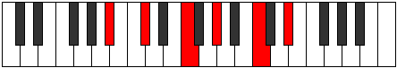

# Mode AFlatDanyllian

## Links

- [Documentation](index.md)
- [Scales Index](Scales.md)
- [Modes Index](Modes.md)
- [Chords Index](Chords.md)

## Scale

[Staptyllian](ScaleStaptyllian.md)

## Mode

[AFlatDanyllian](ModeAFlatDanyllian.md)

## Tonic

Ab

## Signature

[CNaturalMajor]

## Perfection

 - 8 Perfect Notes

 - 2 Imperfect Notes

## Notes

- Ab
- A
- Bb
- C (Imperfect)
- Db
- D
- Eb
- E (Imperfect)
- F
- Gb
- Ab

## Illustration

## Relative Modes

| Number | Mode | Tonic | Notes | Illustration |
|--------|------|-------|-------|--------------|
| [1919](https://ianring.com/musictheory/scales/1919) | [Rocryllian](ModeRocryllian.md) | C | C, C#, D, D#, E, F, F#, G#, A, A#, C |  |
| [2039](https://ianring.com/musictheory/scales/2039) | [Danyllian](ModeDanyllian.md) | G# | G#, A, A#, C, C#, D, D#, E, F, F#, G# |  |
| [2039](https://ianring.com/musictheory/scales/2039) | [Danyllian](ModeDanyllian.md) | Ab | Ab, A, Bb, C, Db, D, Eb, E, F, Gb, Ab |  |
| [3007](https://ianring.com/musictheory/scales/3007) | [Zyryllian](ModeZyryllian.md) | C# | C#, D, D#, E, F, F#, G#, A, A#, C, C# |  |
| [3007](https://ianring.com/musictheory/scales/3007) | [Zyryllian](ModeZyryllian.md) | Db | Db, D, Eb, E, F, Gb, Ab, A, Bb, C, Db |  |
| [3067](https://ianring.com/musictheory/scales/3067) | [Goptyllian](ModeGoptyllian.md) | A | A, A#, C, C#, D, D#, E, F, F#, G#, A |  |
| [3551](https://ianring.com/musictheory/scales/3551) | [Sagyllian](ModeSagyllian.md) | D | D, D#, E, F, F#, G#, A, A#, C, C#, D |  |
| [3581](https://ianring.com/musictheory/scales/3581) | [Epocryllian](ModeEpocryllian.md) | A# | A#, C, C#, D, D#, E, F, F#, G#, A, A# |  |
| [3581](https://ianring.com/musictheory/scales/3581) | [Epocryllian](ModeEpocryllian.md) | Bb | Bb, C, Db, D, Eb, E, F, Gb, Ab, A, Bb |  |
| [3823](https://ianring.com/musictheory/scales/3823) | [Epinyllian](ModeEpinyllian.md) | D# | D#, E, F, F#, G#, A, A#, C, C#, D, D# |  |
| [3823](https://ianring.com/musictheory/scales/3823) | [Epinyllian](ModeEpinyllian.md) | Eb | Eb, E, F, Gb, Ab, A, Bb, C, Db, D, Eb |  |
| [3959](https://ianring.com/musictheory/scales/3959) | [Katagyllian](ModeKatagyllian.md) | E | E, F, F#, G#, A, A#, C, C#, D, D#, E |  |
| [4027](https://ianring.com/musictheory/scales/4027) | [Ragyllian](ModeRagyllian.md) | F | F, F#, G#, A, A#, C, C#, D, D#, E, F |  |
| [4061](https://ianring.com/musictheory/scales/4061) | [Staptyllian](ModeStaptyllian.md) | F# | F#, G#, A, A#, C, C#, D, D#, E, F, F# |  |
| [4061](https://ianring.com/musictheory/scales/4061) | [Staptyllian](ModeStaptyllian.md) | Gb | Gb, Ab, A, Bb, C, Db, D, Eb, E, F, Gb |  |

## Chords

### Ab

| Number | Root | Name | Notes | Illustration | Audio |
|--------|------|------|-------|--------------|-------|
| 1282 | Ab | [Absus2bb5](ChordAFlatSuspendedSecondDoubleFlatFifth.md) | Ab, Bb, Db |  | [midi](ChordAFlatSuspendedSecondDoubleFlatFifthRootPosition.mid) [ogg](ChordAFlatSuspendedSecondDoubleFlatFifthRootPosition.ogg) |
| 772 | Ab | [Abloc](ChordAFlatLocrian.md) | Ab, Bbb, Ebb |  | [midi](ChordAFlatLocrianRootPosition.mid) [ogg](ChordAFlatLocrianRootPosition.ogg) |
| 1284 | Ab | [Absus2b5](ChordAFlatSuspendedSecondFlatFifth.md) | Ab, Bb, Ebb |  | [midi](ChordAFlatSuspendedSecondFlatFifthRootPosition.mid) [ogg](ChordAFlatSuspendedSecondFlatFifthRootPosition.ogg) |
| 261 | Ab | [AbMb5](ChordAFlatMajorFlatFifth.md) | Ab, C, Ebb |  | [midi](ChordAFlatMajorFlatFifthRootPosition.mid) [ogg](ChordAFlatMajorFlatFifthRootPosition.ogg) |
| 262 | Ab | [Absus4b5](ChordAFlatSuspendedFourthFlatFifth.md) | Ab, Db, Ebb |  | [midi](ChordAFlatSuspendedFourthFlatFifthRootPosition.mid) [ogg](ChordAFlatSuspendedFourthFlatFifthRootPosition.ogg) |
| 264 | Ab | [Ab5](ChordAFlatPowerChord.md) | Ab, Eb |  | [midi](ChordAFlatPowerChordRootPosition.mid) [ogg](ChordAFlatPowerChordRootPosition.ogg) |
| 776 | Ab | [Abphryg](ChordAFlatPhrygian.md) | Ab, Bbb, Eb |  | [midi](ChordAFlatPhrygianRootPosition.mid) [ogg](ChordAFlatPhrygianRootPosition.ogg) |
| 1288 | Ab | [Absus2](ChordAFlatSuspendedSecond.md) | Ab, Bb, Eb |  | [midi](ChordAFlatSuspendedSecondRootPosition.mid) [ogg](ChordAFlatSuspendedSecondRootPosition.ogg) |
| 265 | Ab | [AbM](ChordAFlatMajor.md) | Ab, C, Eb |  | [midi](ChordAFlatMajorRootPosition.mid) [ogg](ChordAFlatMajorRootPosition.ogg) |
| 1289 | Ab | [AbM(add9)](ChordAFlatMajorAddNinth.md) | Ab, C, Eb, Bb |  | [midi](ChordAFlatMajorAddNinthRootPosition.mid) [ogg](ChordAFlatMajorAddNinthRootPosition.ogg) |
| 266 | Ab | [Absus4](ChordAFlatSuspendedFourth.md) | Ab, Db, Eb |  | [midi](ChordAFlatSuspendedFourthRootPosition.mid) [ogg](ChordAFlatSuspendedFourthRootPosition.ogg) |
| 267 | Ab | [AbM(add11)](ChordAFlatMajorAddEleventh.md) | Ab, C, Eb, Db |  | [midi](ChordAFlatMajorAddEleventhRootPosition.mid) [ogg](ChordAFlatMajorAddEleventhRootPosition.ogg) |
| 267 | Ab | [AbM(add4)](ChordAFlatMajorAddFourth.md) | Ab, C, Db, Eb |  | [midi](ChordAFlatMajorAddFourthRootPosition.mid) [ogg](ChordAFlatMajorAddFourthRootPosition.ogg) |
| 268 | Ab | [Ablyd](ChordAFlatLydian.md) | Ab, D, Eb |  | [midi](ChordAFlatLydianRootPosition.mid) [ogg](ChordAFlatLydianRootPosition.ogg) |
| 269 | Ab | [AbM(add(#4))](ChordAFlatMajorAddSharpFourth.md) | Ab, C, D, Eb |  | [midi](ChordAFlatMajorAddSharpFourthRootPosition.mid) [ogg](ChordAFlatMajorAddSharpFourthRootPosition.ogg) |
| 1296 | Ab | [Absus2#5](ChordAFlatSuspendedSecondSharpFifth.md) | Ab, Bb, E |  | [midi](ChordAFlatSuspendedSecondSharpFifthRootPosition.mid) [ogg](ChordAFlatSuspendedSecondSharpFifthRootPosition.ogg) |
| 273 | Ab | [Ab+](ChordAFlatAugmented.md) | Ab, C, E |  | [midi](ChordAFlatAugmentedRootPosition.mid) [ogg](ChordAFlatAugmentedRootPosition.ogg) |
| 273 | Ab | [Ab+7](ChordAFlatAugmentedAugmentedSeventh.md) | Ab, C, E, G# |  | [midi](ChordAFlatAugmentedAugmentedSeventhRootPosition.mid) [ogg](ChordAFlatAugmentedAugmentedSeventhRootPosition.ogg) |
| 274 | Ab | [Absus4#5](ChordAFlatSuspendedFourthSharpFifth.md) | Ab, Db, E |  | [midi](ChordAFlatSuspendedFourthSharpFifthRootPosition.mid) [ogg](ChordAFlatSuspendedFourthSharpFifthRootPosition.ogg) |
| 1300 | Ab | [Absus2b5add(#5)](ChordAFlatSuspendedSecondFlatFifthAddSharpFifth.md) | Ab, Bb, Ebb, E |  | [midi](ChordAFlatSuspendedSecondFlatFifthAddSharpFifthRootPosition.mid) [ogg](ChordAFlatSuspendedSecondFlatFifthAddSharpFifthRootPosition.ogg) |
| 289 | Ab | [AbM##5](ChordAFlatMajorDoubleSharpFifth.md) | Ab, C, F |  | [midi](ChordAFlatMajorDoubleSharpFifthRootPosition.mid) [ogg](ChordAFlatMajorDoubleSharpFifthRootPosition.ogg) |
| 290 | Ab | [Absus4##5](ChordAFlatSuspendedFourthDoubleSharpFifth.md) | Ab, Db, F |  | [midi](ChordAFlatSuspendedFourthDoubleSharpFifthRootPosition.mid) [ogg](ChordAFlatSuspendedFourthDoubleSharpFifthRootPosition.ogg) |
| 1314 | Ab | [AbM6sus2bb5](ChordAFlatMajorSixthSuspendedSecondDoubleFlatFifth.md) | Ab, Bb, Db, F |  | [midi](ChordAFlatMajorSixthSuspendedSecondDoubleFlatFifthRootPosition.mid) [ogg](ChordAFlatMajorSixthSuspendedSecondDoubleFlatFifthRootPosition.ogg) |
| 1316 | Ab | [AbM6sus2b5](ChordAFlatMajorSixthSuspendedSecondFlatFifth.md) | Ab, Bb, Ebb, F |  | [midi](ChordAFlatMajorSixthSuspendedSecondFlatFifthRootPosition.mid) [ogg](ChordAFlatMajorSixthSuspendedSecondFlatFifthRootPosition.ogg) |
| 293 | Ab | [AbM6b5](ChordAFlatMajorSixthFlatFifth.md) | Ab, C, Ebb, F |  | [midi](ChordAFlatMajorSixthFlatFifthRootPosition.mid) [ogg](ChordAFlatMajorSixthFlatFifthRootPosition.ogg) |
| 1320 | Ab | [AbM6sus2](ChordAFlatMajorSixthSuspendedSecond.md) | Ab, Bb, Eb, F |  | [midi](ChordAFlatMajorSixthSuspendedSecondRootPosition.mid) [ogg](ChordAFlatMajorSixthSuspendedSecondRootPosition.ogg) |
| 1320 | Ab | [Ab7sus2b5](ChordAFlatDominantSeventhSuspendedSecondFlatFifth.md) | Ab, Bb, Eb, Gbb |  | [midi](ChordAFlatDominantSeventhSuspendedSecondFlatFifthRootPosition.mid) [ogg](ChordAFlatDominantSeventhSuspendedSecondFlatFifthRootPosition.ogg) |
| 297 | Ab | [AbM6](ChordAFlatMajorSixth.md) | Ab, C, Eb, F |  | [midi](ChordAFlatMajorSixthRootPosition.mid) [ogg](ChordAFlatMajorSixthRootPosition.ogg) |
| 809 | Ab | [AbM6(addb9)](ChordAFlatMajorSixthAddFlatNinth.md) | Ab, C, Eb, F, Bbb |  | [midi](ChordAFlatMajorSixthAddFlatNinthRootPosition.mid) [ogg](ChordAFlatMajorSixthAddFlatNinthRootPosition.ogg) |
| 1321 | Ab | [AbM6(add9)](ChordAFlatMajorSixthAddNinth.md) | Ab, C, Eb, F, Bb |  | [midi](ChordAFlatMajorSixthAddNinthRootPosition.mid) [ogg](ChordAFlatMajorSixthAddNinthRootPosition.ogg) |
| 298 | Ab | [AbM6sus4](ChordAFlatMajorSixthSuspendedFourth.md) | Ab, Db, Eb, F |  | [midi](ChordAFlatMajorSixthSuspendedFourthRootPosition.mid) [ogg](ChordAFlatMajorSixthSuspendedFourthRootPosition.ogg) |
| 322 | Ab | [AbQ](ChordAFlatQuartal.md) | Ab, Db, Gb |  | [midi](ChordAFlatQuartalRootPosition.mid) [ogg](ChordAFlatQuartalRootPosition.ogg) |
| 325 | Ab | [Ab7b5](ChordAFlatDominantSeventhFlatFifth.md) | Ab, C, Ebb, Gb |  | [midi](ChordAFlatDominantSeventhFlatFifthRootPosition.mid) [ogg](ChordAFlatDominantSeventhFlatFifthRootPosition.ogg) |
| 837 | Ab | [Ab7b5b9](ChordAFlatDominantSeventhFlatFifthFlatNinth.md) | Ab, C, Ebb, Gb, Bbb |  | [midi](ChordAFlatDominantSeventhFlatFifthFlatNinthRootPosition.mid) [ogg](ChordAFlatDominantSeventhFlatFifthFlatNinthRootPosition.ogg) |
| 1352 | Ab | [Ab7sus2](ChordAFlatDominantSeventhSuspendedSecond.md) | Ab, Bb, Eb, Gb |  | [midi](ChordAFlatDominantSeventhSuspendedSecondRootPosition.mid) [ogg](ChordAFlatDominantSeventhSuspendedSecondRootPosition.ogg) |
| 1352 | Ab | [Ab9sus2](ChordAFlatDominantNinthSuspendedSecond.md) | Ab, Bb, Eb, Gb, Bb |  | [midi](ChordAFlatDominantNinthSuspendedSecondRootPosition.mid) [ogg](ChordAFlatDominantNinthSuspendedSecondRootPosition.ogg) |
| 329 | Ab | [Ab7](ChordAFlatDominantSeventh.md) | Ab, C, Eb, Gb |  | [midi](ChordAFlatDominantSeventhRootPosition.mid) [ogg](ChordAFlatDominantSeventhRootPosition.ogg) |
| 841 | Ab | [Ab7b9](ChordAFlatDominantSeventhFlatNinth.md) | Ab, C, Eb, Gb, Bbb |  | [midi](ChordAFlatDominantSeventhFlatNinthRootPosition.mid) [ogg](ChordAFlatDominantSeventhFlatNinthRootPosition.ogg) |
| 1353 | Ab | [Ab9](ChordAFlatDominantNinth.md) | Ab, C, Eb, Gb, Bb |  | [midi](ChordAFlatDominantNinthRootPosition.mid) [ogg](ChordAFlatDominantNinthRootPosition.ogg) |
| 330 | Ab | [Ab7sus4](ChordAFlatDominantSeventhSuspendedFourth.md) | Ab, Db, Eb, Gb |  | [midi](ChordAFlatDominantSeventhSuspendedFourthRootPosition.mid) [ogg](ChordAFlatDominantSeventhSuspendedFourthRootPosition.ogg) |
| 1354 | Ab | [Ab9sus4](ChordAFlatDominantNinthSuspendedFourth.md) | Ab, Db, Eb, Gb, Bb |  | [midi](ChordAFlatDominantNinthSuspendedFourthRootPosition.mid) [ogg](ChordAFlatDominantNinthSuspendedFourthRootPosition.ogg) |
| 331 | Ab | [Ab7add4](ChordAFlatDominantSeventhAddFourth.md) | Ab, C, Db, Eb, Gb |  | [midi](ChordAFlatDominantSeventhAddFourthRootPosition.mid) [ogg](ChordAFlatDominantSeventhAddFourthRootPosition.ogg) |
| 331 | Ab | [Ab7add11](ChordAFlatDominantSeventhAddEleventh.md) | Ab, C, Eb, Gb, Db |  | [midi](ChordAFlatDominantSeventhAddEleventhRootPosition.mid) [ogg](ChordAFlatDominantSeventhAddEleventhRootPosition.ogg) |
| 1355 | Ab | [Ab11](ChordAFlatDominantEleventh.md) | Ab, C, Eb, Gb, Bb, Db |  | [midi](ChordAFlatDominantEleventhRootPosition.mid) [ogg](ChordAFlatDominantEleventhRootPosition.ogg) |
| 333 | Ab | [Ab7add(#4)](ChordAFlatDominantSeventhAddSharpFourth.md) | Ab, C, D, Eb, Gb |  | [midi](ChordAFlatDominantSeventhAddSharpFourthRootPosition.mid) [ogg](ChordAFlatDominantSeventhAddSharpFourthRootPosition.ogg) |
| 333 | Ab | [Ab7#11](ChordAFlatDominantSeventhSharpEleventh.md) | Ab, C, Eb, Gb, D |  | [midi](ChordAFlatDominantSeventhSharpEleventhRootPosition.mid) [ogg](ChordAFlatDominantSeventhSharpEleventhRootPosition.ogg) |
| 1357 | Ab | [Ab9#11](ChordAFlatDominantNinthSharpEleventh.md) | Ab, C, Eb, Gb, Bb, D |  | [midi](ChordAFlatDominantNinthSharpEleventhRootPosition.mid) [ogg](ChordAFlatDominantNinthSharpEleventhRootPosition.ogg) |
| 849 | Ab | [Ab7#5b9](ChordAFlatDominantSeventhSharpFifthFlatNinth.md) | Ab, C, E, Gb, Bbb |  | [midi](ChordAFlatDominantSeventhSharpFifthFlatNinthRootPosition.mid) [ogg](ChordAFlatDominantSeventhSharpFifthFlatNinthRootPosition.ogg) |
| 857 | Ab | [Ab7b9b13](ChordAFlatDominantSeventhFlatNinthFlatThirteenth.md) | Ab, C, Eb, Gb, Bbb, Fb |  | [midi](ChordAFlatDominantSeventhFlatNinthFlatThirteenthRootPosition.mid) [ogg](ChordAFlatDominantSeventhFlatNinthFlatThirteenthRootPosition.ogg) |
| 1369 | Ab | [Ab9b13](ChordAFlatDominantNinthFlatThirteenth.md) | Ab, C, Eb, Gb, Bb, Fb |  | [midi](ChordAFlatDominantNinthFlatThirteenthRootPosition.mid) [ogg](ChordAFlatDominantNinthFlatThirteenthRootPosition.ogg) |
| 361 | Ab | [Ab7add13](ChordAFlatDominantSeventhAddThirteenth.md) | Ab, C, Eb, Gb, F |  | [midi](ChordAFlatDominantSeventhAddThirteenthRootPosition.mid) [ogg](ChordAFlatDominantSeventhAddThirteenthRootPosition.ogg) |
| 875 | Ab | [Ab13b9](ChordAFlatDominantThirteenthFlatNinth.md) | Ab, C, Eb, Gb, Bbb, Db, F |  | [midi](ChordAFlatDominantThirteenthFlatNinthRootPosition.mid) [ogg](ChordAFlatDominantThirteenthFlatNinthRootPosition.ogg) |
| 1387 | Ab | [Ab13](ChordAFlatDominantThirteenth.md) | Ab, C, Eb, Gb, Bb, Db, F |  | [midi](ChordAFlatDominantThirteenthRootPosition.mid) [ogg](ChordAFlatDominantThirteenthRootPosition.ogg) |

### A

| Number | Root | Name | Notes | Illustration | Audio |
|--------|------|------|-------|--------------|-------|
| 517 | A | [Ambb5](ChordANaturalMinorDoubleFlatFifth.md) | A, C, D |  | [midi](ChordANaturalMinorDoubleFlatFifthRootPosition.mid) [ogg](ChordANaturalMinorDoubleFlatFifthRootPosition.ogg) |
| 1544 | A | [Aloc](ChordANaturalLocrian.md) | A, Bb, Eb |  | [midi](ChordANaturalLocrianRootPosition.mid) [ogg](ChordANaturalLocrianRootPosition.ogg) |
| 521 | A | [Ao](ChordANaturalDiminished.md) | A, C, Eb |  | [midi](ChordANaturalDiminishedRootPosition.mid) [ogg](ChordANaturalDiminishedRootPosition.ogg) |
| 522 | A | [AMb5](ChordANaturalMajorFlatFifth.md) | A, C#, Eb |  | [midi](ChordANaturalMajorFlatFifthRootPosition.mid) [ogg](ChordANaturalMajorFlatFifthRootPosition.ogg) |
| 524 | A | [Asus4b5](ChordANaturalSuspendedFourthFlatFifth.md) | A, D, Eb |  | [midi](ChordANaturalSuspendedFourthFlatFifthRootPosition.mid) [ogg](ChordANaturalSuspendedFourthFlatFifthRootPosition.ogg) |
| 528 | A | [A5](ChordANaturalPowerChord.md) | A, E |  | [midi](ChordANaturalPowerChordRootPosition.mid) [ogg](ChordANaturalPowerChordRootPosition.ogg) |
| 1552 | A | [Aphryg](ChordANaturalPhrygian.md) | A, Bb, E |  | [midi](ChordANaturalPhrygianRootPosition.mid) [ogg](ChordANaturalPhrygianRootPosition.ogg) |
| 529 | A | [Am](ChordANaturalMinor.md) | A, C, E |  | [midi](ChordANaturalMinorRootPosition.mid) [ogg](ChordANaturalMinorRootPosition.ogg) |
| 529 | A | [Am(add(#9))](ChordANaturalMinorAddSharpNinth.md) | A, C, E, B# |  | [midi](ChordANaturalMinorAddSharpNinthRootPosition.mid) [ogg](ChordANaturalMinorAddSharpNinthRootPosition.ogg) |
| 530 | A | [AM](ChordANaturalMajor.md) | A, C#, E |  | [midi](ChordANaturalMajorRootPosition.mid) [ogg](ChordANaturalMajorRootPosition.ogg) |
| 531 | A | [AM(add(#9))](ChordANaturalMajorAddSharpNinth.md) | A, C#, E, B# |  | [midi](ChordANaturalMajorAddSharpNinthRootPosition.mid) [ogg](ChordANaturalMajorAddSharpNinthRootPosition.ogg) |
| 532 | A | [Asus4](ChordANaturalSuspendedFourth.md) | A, D, E |  | [midi](ChordANaturalSuspendedFourthRootPosition.mid) [ogg](ChordANaturalSuspendedFourthRootPosition.ogg) |
| 533 | A | [Am(add11)](ChordANaturalMinorAddEleventh.md) | A, C, E, D |  | [midi](ChordANaturalMinorAddEleventhRootPosition.mid) [ogg](ChordANaturalMinorAddEleventhRootPosition.ogg) |
| 533 | A | [Am(add4)](ChordANaturalMinorAddFourth.md) | A, C, D, E |  | [midi](ChordANaturalMinorAddFourthRootPosition.mid) [ogg](ChordANaturalMinorAddFourthRootPosition.ogg) |
| 534 | A | [AM(add11)](ChordANaturalMajorAddEleventh.md) | A, C#, E, D |  | [midi](ChordANaturalMajorAddEleventhRootPosition.mid) [ogg](ChordANaturalMajorAddEleventhRootPosition.ogg) |
| 534 | A | [AM(add4)](ChordANaturalMajorAddFourth.md) | A, C#, D, E |  | [midi](ChordANaturalMajorAddFourthRootPosition.mid) [ogg](ChordANaturalMajorAddFourthRootPosition.ogg) |
| 536 | A | [Alyd](ChordANaturalLydian.md) | A, D#, E |  | [midi](ChordANaturalLydianRootPosition.mid) [ogg](ChordANaturalLydianRootPosition.ogg) |
| 537 | A | [Am(add(#4))](ChordANaturalMinorAddSharpFourth.md) | A, C, D#, E |  | [midi](ChordANaturalMinorAddSharpFourthRootPosition.mid) [ogg](ChordANaturalMinorAddSharpFourthRootPosition.ogg) |
| 538 | A | [AM(add(#4))](ChordANaturalMajorAddSharpFourth.md) | A, C#, D#, E |  | [midi](ChordANaturalMajorAddSharpFourthRootPosition.mid) [ogg](ChordANaturalMajorAddSharpFourthRootPosition.ogg) |
| 545 | A | [Am#5](ChordANaturalMinorSharpFifth.md) | A, C, F |  | [midi](ChordANaturalMinorSharpFifthRootPosition.mid) [ogg](ChordANaturalMinorSharpFifthRootPosition.ogg) |
| 546 | A | [A+](ChordANaturalAugmented.md) | A, C#, E# |  | [midi](ChordANaturalAugmentedRootPosition.mid) [ogg](ChordANaturalAugmentedRootPosition.ogg) |
| 546 | A | [A+7](ChordANaturalAugmentedAugmentedSeventh.md) | A, C#, E#, G## |  | [midi](ChordANaturalAugmentedAugmentedSeventhRootPosition.mid) [ogg](ChordANaturalAugmentedAugmentedSeventhRootPosition.ogg) |
| 548 | A | [Asus4#5](ChordANaturalSuspendedFourthSharpFifth.md) | A, D, E# |  | [midi](ChordANaturalSuspendedFourthSharpFifthRootPosition.mid) [ogg](ChordANaturalSuspendedFourthSharpFifthRootPosition.ogg) |
| 578 | A | [AM##5](ChordANaturalMajorDoubleSharpFifth.md) | A, C#, F# |  | [midi](ChordANaturalMajorDoubleSharpFifthRootPosition.mid) [ogg](ChordANaturalMajorDoubleSharpFifthRootPosition.ogg) |
| 580 | A | [Asus4##5](ChordANaturalSuspendedFourthDoubleSharpFifth.md) | A, D, F# |  | [midi](ChordANaturalSuspendedFourthDoubleSharpFifthRootPosition.mid) [ogg](ChordANaturalSuspendedFourthDoubleSharpFifthRootPosition.ogg) |
| 585 | A | [Ao7](ChordANaturalFullDiminishedSeventh.md) | A, C, Eb, Gb |  | [midi](ChordANaturalFullDiminishedSeventhRootPosition.mid) [ogg](ChordANaturalFullDiminishedSeventhRootPosition.ogg) |
| 586 | A | [AM6b5](ChordANaturalMajorSixthFlatFifth.md) | A, C#, Eb, F# |  | [midi](ChordANaturalMajorSixthFlatFifthRootPosition.mid) [ogg](ChordANaturalMajorSixthFlatFifthRootPosition.ogg) |
| 593 | A | [Am6](ChordANaturalMinorSixth.md) | A, C, E, F# |  | [midi](ChordANaturalMinorSixthRootPosition.mid) [ogg](ChordANaturalMinorSixthRootPosition.ogg) |
| 1617 | A | [Am6(addb9)](ChordANaturalMinorSixthAddFlatNinth.md) | A, C, E, F#, Bb |  | [midi](ChordANaturalMinorSixthAddFlatNinthRootPosition.mid) [ogg](ChordANaturalMinorSixthAddFlatNinthRootPosition.ogg) |
| 594 | A | [AM6](ChordANaturalMajorSixth.md) | A, C#, E, F# |  | [midi](ChordANaturalMajorSixthRootPosition.mid) [ogg](ChordANaturalMajorSixthRootPosition.ogg) |
| 1618 | A | [AM6(addb9)](ChordANaturalMajorSixthAddFlatNinth.md) | A, C#, E, F#, Bb |  | [midi](ChordANaturalMajorSixthAddFlatNinthRootPosition.mid) [ogg](ChordANaturalMajorSixthAddFlatNinthRootPosition.ogg) |
| 596 | A | [AM6sus4](ChordANaturalMajorSixthSuspendedFourth.md) | A, D, E, F# |  | [midi](ChordANaturalMajorSixthSuspendedFourthRootPosition.mid) [ogg](ChordANaturalMajorSixthSuspendedFourthRootPosition.ogg) |
| 772 | A | [AQ+](ChordANaturalQuartalAugmented.md) | A, D, G# |  | [midi](ChordANaturalQuartalAugmentedRootPosition.mid) [ogg](ChordANaturalQuartalAugmentedRootPosition.ogg) |
| 777 | A | [AoM7](ChordANaturalDiminishedMajorSeventh.md) | A, C, Eb, G# |  | [midi](ChordANaturalDiminishedMajorSeventhRootPosition.mid) [ogg](ChordANaturalDiminishedMajorSeventhRootPosition.ogg) |
| 778 | A | [AM7b5](ChordANaturalMajorSeventhFlatFifth.md) | A, C#, Eb, G# |  | [midi](ChordANaturalMajorSeventhFlatFifthRootPosition.mid) [ogg](ChordANaturalMajorSeventhFlatFifthRootPosition.ogg) |
| 1808 | A | [Aphryg+7](ChordANaturalPhrygianAddSeventh.md) | A, Bb, E, G# |  | [midi](ChordANaturalPhrygianAddSeventhRootPosition.mid) [ogg](ChordANaturalPhrygianAddSeventhRootPosition.ogg) |
| 785 | A | [Am(M7)](ChordANaturalMinorMajorSeventh.md) | A, C, E, G# |  | [midi](ChordANaturalMinorMajorSeventhRootPosition.mid) [ogg](ChordANaturalMinorMajorSeventhRootPosition.ogg) |
| 786 | A | [AM7](ChordANaturalMajorSeventh.md) | A, C#, E, G# |  | [midi](ChordANaturalMajorSeventhRootPosition.mid) [ogg](ChordANaturalMajorSeventhRootPosition.ogg) |
| 788 | A | [AM7(sus4)](ChordANaturalMajorSeventhSuspendedFourth.md) | A, D, E, G# |  | [midi](ChordANaturalMajorSeventhSuspendedFourthRootPosition.mid) [ogg](ChordANaturalMajorSeventhSuspendedFourthRootPosition.ogg) |
| 789 | A | [Am(M7)add11](ChordANaturalMinorMajorSeventhAddEleventh.md) | A, C, E, G#, D |  | [midi](ChordANaturalMinorMajorSeventhAddEleventhRootPosition.mid) [ogg](ChordANaturalMinorMajorSeventhAddEleventhRootPosition.ogg) |
| 790 | A | [AM7add4](ChordANaturalMajorSeventhAddFourth.md) | A, C#, D, E, G# |  | [midi](ChordANaturalMajorSeventhAddFourthRootPosition.mid) [ogg](ChordANaturalMajorSeventhAddFourthRootPosition.ogg) |
| 790 | A | [AM7add11](ChordANaturalMajorSeventhAddEleventh.md) | A, C#, E, G#, D |  | [midi](ChordANaturalMajorSeventhAddEleventhRootPosition.mid) [ogg](ChordANaturalMajorSeventhAddEleventhRootPosition.ogg) |
| 792 | A | [Alyd(M7)](ChordANaturalLydianMajorSeventh.md) | A, D#, E, G# |  | [midi](ChordANaturalLydianMajorSeventhRootPosition.mid) [ogg](ChordANaturalLydianMajorSeventhRootPosition.ogg) |
| 794 | A | [AM7add(#11)](ChordANaturalMajorSeventhAddSharpEleventh.md) | A, C#, E, G#, D# |  | [midi](ChordANaturalMajorSeventhAddSharpEleventhRootPosition.mid) [ogg](ChordANaturalMajorSeventhAddSharpEleventhRootPosition.ogg) |
| 794 | A | [AM7add(#4)](ChordANaturalMajorSeventhAddSharpFourth.md) | A, C#, D#, E, G# |  | [midi](ChordANaturalMajorSeventhAddSharpFourthRootPosition.mid) [ogg](ChordANaturalMajorSeventhAddSharpFourthRootPosition.ogg) |
| 802 | A | [A+(M7)](ChordANaturalAugmentedMajorSeventh.md) | A, C#, E#, G# |  | [midi](ChordANaturalAugmentedMajorSeventhRootPosition.mid) [ogg](ChordANaturalAugmentedMajorSeventhRootPosition.ogg) |
| 804 | A | [AM7(sus4)#5](ChordANaturalMajorSeventhSuspendedFourthSharpFifth.md) | A, D, E#, G# |  | [midi](ChordANaturalMajorSeventhSuspendedFourthSharpFifthRootPosition.mid) [ogg](ChordANaturalMajorSeventhSuspendedFourthSharpFifthRootPosition.ogg) |
| 834 | A | [AM7##5](ChordANaturalMajorSeventhDoubleSharpFifth.md) | A, C#, F#, G# |  | [midi](ChordANaturalMajorSeventhDoubleSharpFifthRootPosition.mid) [ogg](ChordANaturalMajorSeventhDoubleSharpFifthRootPosition.ogg) |
| 836 | A | [AM7(sus4)##5](ChordANaturalMajorSeventhSuspendedFourthDoubleSharpFifth.md) | A, D, F#, G# |  | [midi](ChordANaturalMajorSeventhSuspendedFourthDoubleSharpFifthRootPosition.mid) [ogg](ChordANaturalMajorSeventhSuspendedFourthDoubleSharpFifthRootPosition.ogg) |
| 849 | A | [Am(M7)add13](ChordANaturalMinorMajorSeventhAddThirteenth.md) | A, C, E, G#, F# |  | [midi](ChordANaturalMinorMajorSeventhAddThirteenthRootPosition.mid) [ogg](ChordANaturalMinorMajorSeventhAddThirteenthRootPosition.ogg) |
| 850 | A | [AM7add13](ChordANaturalMajorSeventhAddThirteenth.md) | A, C#, E, G#, F# |  | [midi](ChordANaturalMajorSeventhAddThirteenthRootPosition.mid) [ogg](ChordANaturalMajorSeventhAddThirteenthRootPosition.ogg) |

### Bb

| Number | Root | Name | Notes | Illustration | Audio |
|--------|------|------|-------|--------------|-------|
| 1033 | Bb | [Bbsus2bb5](ChordBFlatSuspendedSecondDoubleFlatFifth.md) | Bb, C, Eb |  | [midi](ChordBFlatSuspendedSecondDoubleFlatFifthRootPosition.mid) [ogg](ChordBFlatSuspendedSecondDoubleFlatFifthRootPosition.ogg) |
| 1034 | Bb | [Bbmbb5](ChordBFlatMinorDoubleFlatFifth.md) | Bb, Db, Eb |  | [midi](ChordBFlatMinorDoubleFlatFifthRootPosition.mid) [ogg](ChordBFlatMinorDoubleFlatFifthRootPosition.ogg) |
| 1041 | Bb | [Bbsus2b5](ChordBFlatSuspendedSecondFlatFifth.md) | Bb, C, Fb |  | [midi](ChordBFlatSuspendedSecondFlatFifthRootPosition.mid) [ogg](ChordBFlatSuspendedSecondFlatFifthRootPosition.ogg) |
| 1042 | Bb | [Bbo](ChordBFlatDiminished.md) | Bb, Db, Fb |  | [midi](ChordBFlatDiminishedRootPosition.mid) [ogg](ChordBFlatDiminishedRootPosition.ogg) |
| 1044 | Bb | [BbMb5](ChordBFlatMajorFlatFifth.md) | Bb, D, Fb |  | [midi](ChordBFlatMajorFlatFifthRootPosition.mid) [ogg](ChordBFlatMajorFlatFifthRootPosition.ogg) |
| 1048 | Bb | [Bbsus4b5](ChordBFlatSuspendedFourthFlatFifth.md) | Bb, Eb, Fb |  | [midi](ChordBFlatSuspendedFourthFlatFifthRootPosition.mid) [ogg](ChordBFlatSuspendedFourthFlatFifthRootPosition.ogg) |
| 1056 | Bb | [Bb5](ChordBFlatPowerChord.md) | Bb, F |  | [midi](ChordBFlatPowerChordRootPosition.mid) [ogg](ChordBFlatPowerChordRootPosition.ogg) |
| 1057 | Bb | [Bbsus2](ChordBFlatSuspendedSecond.md) | Bb, C, F |  | [midi](ChordBFlatSuspendedSecondRootPosition.mid) [ogg](ChordBFlatSuspendedSecondRootPosition.ogg) |
| 1058 | Bb | [Bbm](ChordBFlatMinor.md) | Bb, Db, F |  | [midi](ChordBFlatMinorRootPosition.mid) [ogg](ChordBFlatMinorRootPosition.ogg) |
| 1058 | Bb | [Bbm(add(#9))](ChordBFlatMinorAddSharpNinth.md) | Bb, Db, F, C# |  | [midi](ChordBFlatMinorAddSharpNinthRootPosition.mid) [ogg](ChordBFlatMinorAddSharpNinthRootPosition.ogg) |
| 1059 | Bb | [Bbm(add9)](ChordBFlatMinorAddNinth.md) | Bb, Db, F, C |  | [midi](ChordBFlatMinorAddNinthRootPosition.mid) [ogg](ChordBFlatMinorAddNinthRootPosition.ogg) |
| 1060 | Bb | [BbM](ChordBFlatMajor.md) | Bb, D, F |  | [midi](ChordBFlatMajorRootPosition.mid) [ogg](ChordBFlatMajorRootPosition.ogg) |
| 1061 | Bb | [BbM(add9)](ChordBFlatMajorAddNinth.md) | Bb, D, F, C |  | [midi](ChordBFlatMajorAddNinthRootPosition.mid) [ogg](ChordBFlatMajorAddNinthRootPosition.ogg) |
| 1062 | Bb | [BbM(add(#9))](ChordBFlatMajorAddSharpNinth.md) | Bb, D, F, C# |  | [midi](ChordBFlatMajorAddSharpNinthRootPosition.mid) [ogg](ChordBFlatMajorAddSharpNinthRootPosition.ogg) |
| 1064 | Bb | [Bbsus4](ChordBFlatSuspendedFourth.md) | Bb, Eb, F |  | [midi](ChordBFlatSuspendedFourthRootPosition.mid) [ogg](ChordBFlatSuspendedFourthRootPosition.ogg) |
| 1066 | Bb | [Bbm(add11)](ChordBFlatMinorAddEleventh.md) | Bb, Db, F, Eb |  | [midi](ChordBFlatMinorAddEleventhRootPosition.mid) [ogg](ChordBFlatMinorAddEleventhRootPosition.ogg) |
| 1066 | Bb | [Bbm(add4)](ChordBFlatMinorAddFourth.md) | Bb, Db, Eb, F |  | [midi](ChordBFlatMinorAddFourthRootPosition.mid) [ogg](ChordBFlatMinorAddFourthRootPosition.ogg) |
| 1068 | Bb | [BbM(add11)](ChordBFlatMajorAddEleventh.md) | Bb, D, F, Eb |  | [midi](ChordBFlatMajorAddEleventhRootPosition.mid) [ogg](ChordBFlatMajorAddEleventhRootPosition.ogg) |
| 1068 | Bb | [BbM(add4)](ChordBFlatMajorAddFourth.md) | Bb, D, Eb, F |  | [midi](ChordBFlatMajorAddFourthRootPosition.mid) [ogg](ChordBFlatMajorAddFourthRootPosition.ogg) |
| 1072 | Bb | [Bblyd](ChordBFlatLydian.md) | Bb, E, F |  | [midi](ChordBFlatLydianRootPosition.mid) [ogg](ChordBFlatLydianRootPosition.ogg) |
| 1074 | Bb | [Bbm(add(#4))](ChordBFlatMinorAddSharpFourth.md) | Bb, Db, E, F |  | [midi](ChordBFlatMinorAddSharpFourthRootPosition.mid) [ogg](ChordBFlatMinorAddSharpFourthRootPosition.ogg) |
| 1076 | Bb | [BbM(add(#4))](ChordBFlatMajorAddSharpFourth.md) | Bb, D, E, F |  | [midi](ChordBFlatMajorAddSharpFourthRootPosition.mid) [ogg](ChordBFlatMajorAddSharpFourthRootPosition.ogg) |
| 1089 | Bb | [Bbsus2#5](ChordBFlatSuspendedSecondSharpFifth.md) | Bb, C, F# |  | [midi](ChordBFlatSuspendedSecondSharpFifthRootPosition.mid) [ogg](ChordBFlatSuspendedSecondSharpFifthRootPosition.ogg) |
| 1090 | Bb | [Bbm#5](ChordBFlatMinorSharpFifth.md) | Bb, Db, Gb |  | [midi](ChordBFlatMinorSharpFifthRootPosition.mid) [ogg](ChordBFlatMinorSharpFifthRootPosition.ogg) |
| 1092 | Bb | [Bb+](ChordBFlatAugmented.md) | Bb, D, F# |  | [midi](ChordBFlatAugmentedRootPosition.mid) [ogg](ChordBFlatAugmentedRootPosition.ogg) |
| 1092 | Bb | [Bb+7](ChordBFlatAugmentedAugmentedSeventh.md) | Bb, D, F#, A# |  | [midi](ChordBFlatAugmentedAugmentedSeventhRootPosition.mid) [ogg](ChordBFlatAugmentedAugmentedSeventhRootPosition.ogg) |
| 1096 | Bb | [Bbsus4#5](ChordBFlatSuspendedFourthSharpFifth.md) | Bb, Eb, F# |  | [midi](ChordBFlatSuspendedFourthSharpFifthRootPosition.mid) [ogg](ChordBFlatSuspendedFourthSharpFifthRootPosition.ogg) |
| 1105 | Bb | [Bbsus2b5add(#5)](ChordBFlatSuspendedSecondFlatFifthAddSharpFifth.md) | Bb, C, Fb, F# |  | [midi](ChordBFlatSuspendedSecondFlatFifthAddSharpFifthRootPosition.mid) [ogg](ChordBFlatSuspendedSecondFlatFifthAddSharpFifthRootPosition.ogg) |
| 1288 | Bb | [BbQ](ChordBFlatQuartal.md) | Bb, Eb, Ab |  | [midi](ChordBFlatQuartalRootPosition.mid) [ogg](ChordBFlatQuartalRootPosition.ogg) |
| 1290 | Bb | [Bbm7bb5](ChordBFlatMinorSeventhDoubleFlatFifth.md) | Bb, Db, Eb, Ab |  | [midi](ChordBFlatMinorSeventhDoubleFlatFifthRootPosition.mid) [ogg](ChordBFlatMinorSeventhDoubleFlatFifthRootPosition.ogg) |
| 1298 | Bb | [Bbø7](ChordBFlatHalfDiminishedSeventh.md) | Bb, Db, Fb, Ab |  | [midi](ChordBFlatHalfDiminishedSeventhRootPosition.mid) [ogg](ChordBFlatHalfDiminishedSeventhRootPosition.ogg) |
| 1300 | Bb | [Bb7b5](ChordBFlatDominantSeventhFlatFifth.md) | Bb, D, Fb, Ab |  | [midi](ChordBFlatDominantSeventhFlatFifthRootPosition.mid) [ogg](ChordBFlatDominantSeventhFlatFifthRootPosition.ogg) |
| 1313 | Bb | [Bb7sus2](ChordBFlatDominantSeventhSuspendedSecond.md) | Bb, C, F, Ab |  | [midi](ChordBFlatDominantSeventhSuspendedSecondRootPosition.mid) [ogg](ChordBFlatDominantSeventhSuspendedSecondRootPosition.ogg) |
| 1313 | Bb | [Bb9sus2](ChordBFlatDominantNinthSuspendedSecond.md) | Bb, C, F, Ab, C |  | [midi](ChordBFlatDominantNinthSuspendedSecondRootPosition.mid) [ogg](ChordBFlatDominantNinthSuspendedSecondRootPosition.ogg) |
| 1314 | Bb | [Bbm7](ChordBFlatMinorSeventh.md) | Bb, Db, F, Ab |  | [midi](ChordBFlatMinorSeventhRootPosition.mid) [ogg](ChordBFlatMinorSeventhRootPosition.ogg) |
| 1315 | Bb | [Bbm9](ChordBFlatMinorNinth.md) | Bb, Db, F, Ab, C |  | [midi](ChordBFlatMinorNinthRootPosition.mid) [ogg](ChordBFlatMinorNinthRootPosition.ogg) |
| 1316 | Bb | [Bb7](ChordBFlatDominantSeventh.md) | Bb, D, F, Ab |  | [midi](ChordBFlatDominantSeventhRootPosition.mid) [ogg](ChordBFlatDominantSeventhRootPosition.ogg) |
| 1317 | Bb | [Bb9](ChordBFlatDominantNinth.md) | Bb, D, F, Ab, C |  | [midi](ChordBFlatDominantNinthRootPosition.mid) [ogg](ChordBFlatDominantNinthRootPosition.ogg) |
| 1318 | Bb | [Bb7#9](ChordBFlatDominantSeventhSharpNinth.md) | Bb, D, F, Ab, C# |  | [midi](ChordBFlatDominantSeventhSharpNinthRootPosition.mid) [ogg](ChordBFlatDominantSeventhSharpNinthRootPosition.ogg) |
| 1320 | Bb | [Bb7sus4](ChordBFlatDominantSeventhSuspendedFourth.md) | Bb, Eb, F, Ab |  | [midi](ChordBFlatDominantSeventhSuspendedFourthRootPosition.mid) [ogg](ChordBFlatDominantSeventhSuspendedFourthRootPosition.ogg) |
| 1321 | Bb | [Bb9sus4](ChordBFlatDominantNinthSuspendedFourth.md) | Bb, Eb, F, Ab, C |  | [midi](ChordBFlatDominantNinthSuspendedFourthRootPosition.mid) [ogg](ChordBFlatDominantNinthSuspendedFourthRootPosition.ogg) |
| 1322 | Bb | [Bbm7add11](ChordBFlatMinorSeventhAddEleventh.md) | Bb, Db, F, Ab, Eb |  | [midi](ChordBFlatMinorSeventhAddEleventhRootPosition.mid) [ogg](ChordBFlatMinorSeventhAddEleventhRootPosition.ogg) |
| 1323 | Bb | [Bbm11](ChordBFlatMinorEleventh.md) | Bb, Db, F, Ab, C, Eb |  | [midi](ChordBFlatMinorEleventhRootPosition.mid) [ogg](ChordBFlatMinorEleventhRootPosition.ogg) |
| 1324 | Bb | [Bb7add4](ChordBFlatDominantSeventhAddFourth.md) | Bb, D, Eb, F, Ab |  | [midi](ChordBFlatDominantSeventhAddFourthRootPosition.mid) [ogg](ChordBFlatDominantSeventhAddFourthRootPosition.ogg) |
| 1324 | Bb | [Bb7add11](ChordBFlatDominantSeventhAddEleventh.md) | Bb, D, F, Ab, Eb |  | [midi](ChordBFlatDominantSeventhAddEleventhRootPosition.mid) [ogg](ChordBFlatDominantSeventhAddEleventhRootPosition.ogg) |
| 1325 | Bb | [Bb11](ChordBFlatDominantEleventh.md) | Bb, D, F, Ab, C, Eb |  | [midi](ChordBFlatDominantEleventhRootPosition.mid) [ogg](ChordBFlatDominantEleventhRootPosition.ogg) |
| 1330 | Bb | [Bbm7add(#11)](ChordBFlatMinorSeventhAddSharpEleventh.md) | Bb, Db, F, Ab, E |  | [midi](ChordBFlatMinorSeventhAddSharpEleventhRootPosition.mid) [ogg](ChordBFlatMinorSeventhAddSharpEleventhRootPosition.ogg) |
| 1332 | Bb | [Bb7add(#4)](ChordBFlatDominantSeventhAddSharpFourth.md) | Bb, D, E, F, Ab |  | [midi](ChordBFlatDominantSeventhAddSharpFourthRootPosition.mid) [ogg](ChordBFlatDominantSeventhAddSharpFourthRootPosition.ogg) |
| 1332 | Bb | [Bb7#11](ChordBFlatDominantSeventhSharpEleventh.md) | Bb, D, F, Ab, E |  | [midi](ChordBFlatDominantSeventhSharpEleventhRootPosition.mid) [ogg](ChordBFlatDominantSeventhSharpEleventhRootPosition.ogg) |
| 1333 | Bb | [Bb9#11](ChordBFlatDominantNinthSharpEleventh.md) | Bb, D, F, Ab, C, E |  | [midi](ChordBFlatDominantNinthSharpEleventhRootPosition.mid) [ogg](ChordBFlatDominantNinthSharpEleventhRootPosition.ogg) |
| 1334 | Bb | [Bb7#9#11](ChordBFlatDominantSeventhSharpNinthSharpEleventh.md) | Bb, D, F, Ab, C#, E |  | [midi](ChordBFlatDominantSeventhSharpNinthSharpEleventhRootPosition.mid) [ogg](ChordBFlatDominantSeventhSharpNinthSharpEleventhRootPosition.ogg) |
| 1346 | Bb | [Bbm7#5](ChordBFlatMinorSeventhSharpFifth.md) | Bb, Db, F#, Ab |  | [midi](ChordBFlatMinorSeventhSharpFifthRootPosition.mid) [ogg](ChordBFlatMinorSeventhSharpFifthRootPosition.ogg) |
| 1381 | Bb | [Bb9b13](ChordBFlatDominantNinthFlatThirteenth.md) | Bb, D, F, Ab, C, Gb |  | [midi](ChordBFlatDominantNinthFlatThirteenthRootPosition.mid) [ogg](ChordBFlatDominantNinthFlatThirteenthRootPosition.ogg) |
| 1544 | Bb | [BbQ+](ChordBFlatQuartalAugmented.md) | Bb, Eb, A |  | [midi](ChordBFlatQuartalAugmentedRootPosition.mid) [ogg](ChordBFlatQuartalAugmentedRootPosition.ogg) |
| 1554 | Bb | [BboM7](ChordBFlatDiminishedMajorSeventh.md) | Bb, Db, Fb, A |  | [midi](ChordBFlatDiminishedMajorSeventhRootPosition.mid) [ogg](ChordBFlatDiminishedMajorSeventhRootPosition.ogg) |
| 1556 | Bb | [BbM7b5](ChordBFlatMajorSeventhFlatFifth.md) | Bb, D, Fb, A |  | [midi](ChordBFlatMajorSeventhFlatFifthRootPosition.mid) [ogg](ChordBFlatMajorSeventhFlatFifthRootPosition.ogg) |
| 1569 | Bb | [BbM7(sus2)](ChordBFlatMajorSeventhSuspendedSecond.md) | Bb, C, F, A |  | [midi](ChordBFlatMajorSeventhSuspendedSecondRootPosition.mid) [ogg](ChordBFlatMajorSeventhSuspendedSecondRootPosition.ogg) |
| 1569 | Bb | [BbM9sus2](ChordBFlatMajorNinthSuspendedSecond.md) | Bb, C, F, A, C |  | [midi](ChordBFlatMajorNinthSuspendedSecondRootPosition.mid) [ogg](ChordBFlatMajorNinthSuspendedSecondRootPosition.ogg) |
| 1570 | Bb | [Bbm(M7)](ChordBFlatMinorMajorSeventh.md) | Bb, Db, F, A |  | [midi](ChordBFlatMinorMajorSeventhRootPosition.mid) [ogg](ChordBFlatMinorMajorSeventhRootPosition.ogg) |
| 1571 | Bb | [Bbm(M9)](ChordBFlatMinorMajorNinth.md) | Bb, Db, F, A, C |  | [midi](ChordBFlatMinorMajorNinthRootPosition.mid) [ogg](ChordBFlatMinorMajorNinthRootPosition.ogg) |
| 1572 | Bb | [BbM7](ChordBFlatMajorSeventh.md) | Bb, D, F, A |  | [midi](ChordBFlatMajorSeventhRootPosition.mid) [ogg](ChordBFlatMajorSeventhRootPosition.ogg) |
| 1573 | Bb | [BbM9](ChordBFlatMajorNinth.md) | Bb, D, F, A, C |  | [midi](ChordBFlatMajorNinthRootPosition.mid) [ogg](ChordBFlatMajorNinthRootPosition.ogg) |
| 1576 | Bb | [BbM7(sus4)](ChordBFlatMajorSeventhSuspendedFourth.md) | Bb, Eb, F, A |  | [midi](ChordBFlatMajorSeventhSuspendedFourthRootPosition.mid) [ogg](ChordBFlatMajorSeventhSuspendedFourthRootPosition.ogg) |
| 1577 | Bb | [BbM9sus4](ChordBFlatMajorNinthSuspendedFourth.md) | Bb, Eb, F, A, C |  | [midi](ChordBFlatMajorNinthSuspendedFourthRootPosition.mid) [ogg](ChordBFlatMajorNinthSuspendedFourthRootPosition.ogg) |
| 1578 | Bb | [Bbm(M7)add11](ChordBFlatMinorMajorSeventhAddEleventh.md) | Bb, Db, F, A, Eb |  | [midi](ChordBFlatMinorMajorSeventhAddEleventhRootPosition.mid) [ogg](ChordBFlatMinorMajorSeventhAddEleventhRootPosition.ogg) |
| 1579 | Bb | [Bbm(M11)](ChordBFlatMinorMajorEleventh.md) | Bb, Db, F, A, C, Eb |  | [midi](ChordBFlatMinorMajorEleventhRootPosition.mid) [ogg](ChordBFlatMinorMajorEleventhRootPosition.ogg) |
| 1580 | Bb | [BbM7add4](ChordBFlatMajorSeventhAddFourth.md) | Bb, D, Eb, F, A |  | [midi](ChordBFlatMajorSeventhAddFourthRootPosition.mid) [ogg](ChordBFlatMajorSeventhAddFourthRootPosition.ogg) |
| 1580 | Bb | [BbM7add11](ChordBFlatMajorSeventhAddEleventh.md) | Bb, D, F, A, Eb |  | [midi](ChordBFlatMajorSeventhAddEleventhRootPosition.mid) [ogg](ChordBFlatMajorSeventhAddEleventhRootPosition.ogg) |
| 1581 | Bb | [BbM11](ChordBFlatMajorEleventh.md) | Bb, D, F, A, C, Eb |  | [midi](ChordBFlatMajorEleventhRootPosition.mid) [ogg](ChordBFlatMajorEleventhRootPosition.ogg) |
| 1584 | Bb | [Bblyd(M7)](ChordBFlatLydianMajorSeventh.md) | Bb, E, F, A |  | [midi](ChordBFlatLydianMajorSeventhRootPosition.mid) [ogg](ChordBFlatLydianMajorSeventhRootPosition.ogg) |
| 1588 | Bb | [BbM7add(#11)](ChordBFlatMajorSeventhAddSharpEleventh.md) | Bb, D, F, A, E |  | [midi](ChordBFlatMajorSeventhAddSharpEleventhRootPosition.mid) [ogg](ChordBFlatMajorSeventhAddSharpEleventhRootPosition.ogg) |
| 1588 | Bb | [BbM7add(#4)](ChordBFlatMajorSeventhAddSharpFourth.md) | Bb, D, E, F, A |  | [midi](ChordBFlatMajorSeventhAddSharpFourthRootPosition.mid) [ogg](ChordBFlatMajorSeventhAddSharpFourthRootPosition.ogg) |
| 1604 | Bb | [Bb+(M7)](ChordBFlatAugmentedMajorSeventh.md) | Bb, D, F#, A |  | [midi](ChordBFlatAugmentedMajorSeventhRootPosition.mid) [ogg](ChordBFlatAugmentedMajorSeventhRootPosition.ogg) |
| 1608 | Bb | [BbM7(sus4)#5](ChordBFlatMajorSeventhSuspendedFourthSharpFifth.md) | Bb, Eb, F#, A |  | [midi](ChordBFlatMajorSeventhSuspendedFourthSharpFifthRootPosition.mid) [ogg](ChordBFlatMajorSeventhSuspendedFourthSharpFifthRootPosition.ogg) |

### C

| Number | Root | Name | Notes | Illustration | Audio |
|--------|------|------|-------|--------------|-------|
| 37 | C | [Csus2bb5](ChordCNaturalSuspendedSecondDoubleFlatFifth.md) | C, D, F |  | [midi](ChordCNaturalSuspendedSecondDoubleFlatFifthRootPosition.mid) [ogg](ChordCNaturalSuspendedSecondDoubleFlatFifthRootPosition.ogg) |
| 41 | C | [Cmbb5](ChordCNaturalMinorDoubleFlatFifth.md) | C, Eb, F |  | [midi](ChordCNaturalMinorDoubleFlatFifthRootPosition.mid) [ogg](ChordCNaturalMinorDoubleFlatFifthRootPosition.ogg) |
| 67 | C | [Cloc](ChordCNaturalLocrian.md) | C, Db, Gb |  | [midi](ChordCNaturalLocrianRootPosition.mid) [ogg](ChordCNaturalLocrianRootPosition.ogg) |
| 69 | C | [Csus2b5](ChordCNaturalSuspendedSecondFlatFifth.md) | C, D, Gb |  | [midi](ChordCNaturalSuspendedSecondFlatFifthRootPosition.mid) [ogg](ChordCNaturalSuspendedSecondFlatFifthRootPosition.ogg) |
| 73 | C | [Co](ChordCNaturalDiminished.md) | C, Eb, Gb |  | [midi](ChordCNaturalDiminishedRootPosition.mid) [ogg](ChordCNaturalDiminishedRootPosition.ogg) |
| 81 | C | [CMb5](ChordCNaturalMajorFlatFifth.md) | C, E, Gb |  | [midi](ChordCNaturalMajorFlatFifthRootPosition.mid) [ogg](ChordCNaturalMajorFlatFifthRootPosition.ogg) |
| 97 | C | [Csus4b5](ChordCNaturalSuspendedFourthFlatFifth.md) | C, F, Gb |  | [midi](ChordCNaturalSuspendedFourthFlatFifthRootPosition.mid) [ogg](ChordCNaturalSuspendedFourthFlatFifthRootPosition.ogg) |
| 261 | C | [Csus2#5](ChordCNaturalSuspendedSecondSharpFifth.md) | C, D, G# |  | [midi](ChordCNaturalSuspendedSecondSharpFifthRootPosition.mid) [ogg](ChordCNaturalSuspendedSecondSharpFifthRootPosition.ogg) |
| 265 | C | [Cm#5](ChordCNaturalMinorSharpFifth.md) | C, Eb, Ab |  | [midi](ChordCNaturalMinorSharpFifthRootPosition.mid) [ogg](ChordCNaturalMinorSharpFifthRootPosition.ogg) |
| 273 | C | [C+](ChordCNaturalAugmented.md) | C, E, G# |  | [midi](ChordCNaturalAugmentedRootPosition.mid) [ogg](ChordCNaturalAugmentedRootPosition.ogg) |
| 273 | C | [C+7](ChordCNaturalAugmentedAugmentedSeventh.md) | C, E, G#, B# |  | [midi](ChordCNaturalAugmentedAugmentedSeventhRootPosition.mid) [ogg](ChordCNaturalAugmentedAugmentedSeventhRootPosition.ogg) |
| 289 | C | [Csus4#5](ChordCNaturalSuspendedFourthSharpFifth.md) | C, F, G# |  | [midi](ChordCNaturalSuspendedFourthSharpFifthRootPosition.mid) [ogg](ChordCNaturalSuspendedFourthSharpFifthRootPosition.ogg) |
| 325 | C | [Csus2b5add(#5)](ChordCNaturalSuspendedSecondFlatFifthAddSharpFifth.md) | C, D, Gb, G# |  | [midi](ChordCNaturalSuspendedSecondFlatFifthAddSharpFifthRootPosition.mid) [ogg](ChordCNaturalSuspendedSecondFlatFifthAddSharpFifthRootPosition.ogg) |
| 529 | C | [CM##5](ChordCNaturalMajorDoubleSharpFifth.md) | C, E, A |  | [midi](ChordCNaturalMajorDoubleSharpFifthRootPosition.mid) [ogg](ChordCNaturalMajorDoubleSharpFifthRootPosition.ogg) |
| 545 | C | [Csus4##5](ChordCNaturalSuspendedFourthDoubleSharpFifth.md) | C, F, A |  | [midi](ChordCNaturalSuspendedFourthDoubleSharpFifthRootPosition.mid) [ogg](ChordCNaturalSuspendedFourthDoubleSharpFifthRootPosition.ogg) |
| 549 | C | [CM6sus2bb5](ChordCNaturalMajorSixthSuspendedSecondDoubleFlatFifth.md) | C, D, F, A |  | [midi](ChordCNaturalMajorSixthSuspendedSecondDoubleFlatFifthRootPosition.mid) [ogg](ChordCNaturalMajorSixthSuspendedSecondDoubleFlatFifthRootPosition.ogg) |
| 581 | C | [CM6sus2b5](ChordCNaturalMajorSixthSuspendedSecondFlatFifth.md) | C, D, Gb, A |  | [midi](ChordCNaturalMajorSixthSuspendedSecondFlatFifthRootPosition.mid) [ogg](ChordCNaturalMajorSixthSuspendedSecondFlatFifthRootPosition.ogg) |
| 585 | C | [Co7](ChordCNaturalFullDiminishedSeventh.md) | C, Eb, Gb, Bbb |  | [midi](ChordCNaturalFullDiminishedSeventhRootPosition.mid) [ogg](ChordCNaturalFullDiminishedSeventhRootPosition.ogg) |
| 593 | C | [CM6b5](ChordCNaturalMajorSixthFlatFifth.md) | C, E, Gb, A |  | [midi](ChordCNaturalMajorSixthFlatFifthRootPosition.mid) [ogg](ChordCNaturalMajorSixthFlatFifthRootPosition.ogg) |
| 1057 | C | [CQ](ChordCNaturalQuartal.md) | C, F, Bb |  | [midi](ChordCNaturalQuartalRootPosition.mid) [ogg](ChordCNaturalQuartalRootPosition.ogg) |
| 1065 | C | [Cm7bb5](ChordCNaturalMinorSeventhDoubleFlatFifth.md) | C, Eb, F, Bb |  | [midi](ChordCNaturalMinorSeventhDoubleFlatFifthRootPosition.mid) [ogg](ChordCNaturalMinorSeventhDoubleFlatFifthRootPosition.ogg) |
| 1097 | C | [Cø7](ChordCNaturalHalfDiminishedSeventh.md) | C, Eb, Gb, Bb |  | [midi](ChordCNaturalHalfDiminishedSeventhRootPosition.mid) [ogg](ChordCNaturalHalfDiminishedSeventhRootPosition.ogg) |
| 1105 | C | [C7b5](ChordCNaturalDominantSeventhFlatFifth.md) | C, E, Gb, Bb |  | [midi](ChordCNaturalDominantSeventhFlatFifthRootPosition.mid) [ogg](ChordCNaturalDominantSeventhFlatFifthRootPosition.ogg) |
| 1107 | C | [C7b5b9](ChordCNaturalDominantSeventhFlatFifthFlatNinth.md) | C, E, Gb, Bb, Db |  | [midi](ChordCNaturalDominantSeventhFlatFifthFlatNinthRootPosition.mid) [ogg](ChordCNaturalDominantSeventhFlatFifthFlatNinthRootPosition.ogg) |
| 1289 | C | [Cm7#5](ChordCNaturalMinorSeventhSharpFifth.md) | C, Eb, G#, Bb |  | [midi](ChordCNaturalMinorSeventhSharpFifthRootPosition.mid) [ogg](ChordCNaturalMinorSeventhSharpFifthRootPosition.ogg) |
| 1299 | C | [C7#5b9](ChordCNaturalDominantSeventhSharpFifthFlatNinth.md) | C, E, G#, Bb, Db |  | [midi](ChordCNaturalDominantSeventhSharpFifthFlatNinthRootPosition.mid) [ogg](ChordCNaturalDominantSeventhSharpFifthFlatNinthRootPosition.ogg) |

### Db

| Number | Root | Name | Notes | Illustration | Audio |
|--------|------|------|-------|--------------|-------|
| 74 | Db | [Dbsus2bb5](ChordDFlatSuspendedSecondDoubleFlatFifth.md) | Db, Eb, Gb |  | [midi](ChordDFlatSuspendedSecondDoubleFlatFifthRootPosition.mid) [ogg](ChordDFlatSuspendedSecondDoubleFlatFifthRootPosition.ogg) |
| 82 | Db | [Dbmbb5](ChordDFlatMinorDoubleFlatFifth.md) | Db, Fb, Gb |  | [midi](ChordDFlatMinorDoubleFlatFifthRootPosition.mid) [ogg](ChordDFlatMinorDoubleFlatFifthRootPosition.ogg) |
| 258 | Db | [Db5](ChordDFlatPowerChord.md) | Db, Ab |  | [midi](ChordDFlatPowerChordRootPosition.mid) [ogg](ChordDFlatPowerChordRootPosition.ogg) |
| 262 | Db | [Dbphryg](ChordDFlatPhrygian.md) | Db, Ebb, Ab |  | [midi](ChordDFlatPhrygianRootPosition.mid) [ogg](ChordDFlatPhrygianRootPosition.ogg) |
| 266 | Db | [Dbsus2](ChordDFlatSuspendedSecond.md) | Db, Eb, Ab |  | [midi](ChordDFlatSuspendedSecondRootPosition.mid) [ogg](ChordDFlatSuspendedSecondRootPosition.ogg) |
| 274 | Db | [Dbm](ChordDFlatMinor.md) | Db, Fb, Ab |  | [midi](ChordDFlatMinorRootPosition.mid) [ogg](ChordDFlatMinorRootPosition.ogg) |
| 274 | Db | [Dbm(add(#9))](ChordDFlatMinorAddSharpNinth.md) | Db, Fb, Ab, E |  | [midi](ChordDFlatMinorAddSharpNinthRootPosition.mid) [ogg](ChordDFlatMinorAddSharpNinthRootPosition.ogg) |
| 282 | Db | [Dbm(add9)](ChordDFlatMinorAddNinth.md) | Db, Fb, Ab, Eb |  | [midi](ChordDFlatMinorAddNinthRootPosition.mid) [ogg](ChordDFlatMinorAddNinthRootPosition.ogg) |
| 290 | Db | [DbM](ChordDFlatMajor.md) | Db, F, Ab |  | [midi](ChordDFlatMajorRootPosition.mid) [ogg](ChordDFlatMajorRootPosition.ogg) |
| 298 | Db | [DbM(add9)](ChordDFlatMajorAddNinth.md) | Db, F, Ab, Eb |  | [midi](ChordDFlatMajorAddNinthRootPosition.mid) [ogg](ChordDFlatMajorAddNinthRootPosition.ogg) |
| 306 | Db | [DbM(add(#9))](ChordDFlatMajorAddSharpNinth.md) | Db, F, Ab, E |  | [midi](ChordDFlatMajorAddSharpNinthRootPosition.mid) [ogg](ChordDFlatMajorAddSharpNinthRootPosition.ogg) |
| 322 | Db | [Dbsus4](ChordDFlatSuspendedFourth.md) | Db, Gb, Ab |  | [midi](ChordDFlatSuspendedFourthRootPosition.mid) [ogg](ChordDFlatSuspendedFourthRootPosition.ogg) |
| 338 | Db | [Dbm(add11)](ChordDFlatMinorAddEleventh.md) | Db, Fb, Ab, Gb |  | [midi](ChordDFlatMinorAddEleventhRootPosition.mid) [ogg](ChordDFlatMinorAddEleventhRootPosition.ogg) |
| 338 | Db | [Dbm(add4)](ChordDFlatMinorAddFourth.md) | Db, Fb, Gb, Ab |  | [midi](ChordDFlatMinorAddFourthRootPosition.mid) [ogg](ChordDFlatMinorAddFourthRootPosition.ogg) |
| 354 | Db | [DbM(add11)](ChordDFlatMajorAddEleventh.md) | Db, F, Ab, Gb |  | [midi](ChordDFlatMajorAddEleventhRootPosition.mid) [ogg](ChordDFlatMajorAddEleventhRootPosition.ogg) |
| 354 | Db | [DbM(add4)](ChordDFlatMajorAddFourth.md) | Db, F, Gb, Ab |  | [midi](ChordDFlatMajorAddFourthRootPosition.mid) [ogg](ChordDFlatMajorAddFourthRootPosition.ogg) |
| 522 | Db | [Dbsus2#5](ChordDFlatSuspendedSecondSharpFifth.md) | Db, Eb, A |  | [midi](ChordDFlatSuspendedSecondSharpFifthRootPosition.mid) [ogg](ChordDFlatSuspendedSecondSharpFifthRootPosition.ogg) |
| 530 | Db | [Dbm#5](ChordDFlatMinorSharpFifth.md) | Db, Fb, Bbb |  | [midi](ChordDFlatMinorSharpFifthRootPosition.mid) [ogg](ChordDFlatMinorSharpFifthRootPosition.ogg) |
| 546 | Db | [Db+](ChordDFlatAugmented.md) | Db, F, A |  | [midi](ChordDFlatAugmentedRootPosition.mid) [ogg](ChordDFlatAugmentedRootPosition.ogg) |
| 546 | Db | [Db+7](ChordDFlatAugmentedAugmentedSeventh.md) | Db, F, A, C# |  | [midi](ChordDFlatAugmentedAugmentedSeventhRootPosition.mid) [ogg](ChordDFlatAugmentedAugmentedSeventhRootPosition.ogg) |
| 578 | Db | [Dbsus4#5](ChordDFlatSuspendedFourthSharpFifth.md) | Db, Gb, A |  | [midi](ChordDFlatSuspendedFourthSharpFifthRootPosition.mid) [ogg](ChordDFlatSuspendedFourthSharpFifthRootPosition.ogg) |
| 1058 | Db | [DbM##5](ChordDFlatMajorDoubleSharpFifth.md) | Db, F, Bb |  | [midi](ChordDFlatMajorDoubleSharpFifthRootPosition.mid) [ogg](ChordDFlatMajorDoubleSharpFifthRootPosition.ogg) |
| 1090 | Db | [Dbsus4##5](ChordDFlatSuspendedFourthDoubleSharpFifth.md) | Db, Gb, Bb |  | [midi](ChordDFlatSuspendedFourthDoubleSharpFifthRootPosition.mid) [ogg](ChordDFlatSuspendedFourthDoubleSharpFifthRootPosition.ogg) |
| 1098 | Db | [DbM6sus2bb5](ChordDFlatMajorSixthSuspendedSecondDoubleFlatFifth.md) | Db, Eb, Gb, Bb |  | [midi](ChordDFlatMajorSixthSuspendedSecondDoubleFlatFifthRootPosition.mid) [ogg](ChordDFlatMajorSixthSuspendedSecondDoubleFlatFifthRootPosition.ogg) |
| 1290 | Db | [DbM6sus2](ChordDFlatMajorSixthSuspendedSecond.md) | Db, Eb, Ab, Bb |  | [midi](ChordDFlatMajorSixthSuspendedSecondRootPosition.mid) [ogg](ChordDFlatMajorSixthSuspendedSecondRootPosition.ogg) |
| 1290 | Db | [Db7sus2b5](ChordDFlatDominantSeventhSuspendedSecondFlatFifth.md) | Db, Eb, Ab, Cbb |  | [midi](ChordDFlatDominantSeventhSuspendedSecondFlatFifthRootPosition.mid) [ogg](ChordDFlatDominantSeventhSuspendedSecondFlatFifthRootPosition.ogg) |
| 1298 | Db | [Dbm6](ChordDFlatMinorSixth.md) | Db, Fb, Ab, Bb |  | [midi](ChordDFlatMinorSixthRootPosition.mid) [ogg](ChordDFlatMinorSixthRootPosition.ogg) |
| 1302 | Db | [Dbm6(addb9)](ChordDFlatMinorSixthAddFlatNinth.md) | Db, Fb, Ab, Bb, Ebb |  | [midi](ChordDFlatMinorSixthAddFlatNinthRootPosition.mid) [ogg](ChordDFlatMinorSixthAddFlatNinthRootPosition.ogg) |
| 1306 | Db | [Dbm6(add9)](ChordDFlatMinorSixthAddNinth.md) | Db, Fb, Ab, Bb, Eb |  | [midi](ChordDFlatMinorSixthAddNinthRootPosition.mid) [ogg](ChordDFlatMinorSixthAddNinthRootPosition.ogg) |
| 1314 | Db | [DbM6](ChordDFlatMajorSixth.md) | Db, F, Ab, Bb |  | [midi](ChordDFlatMajorSixthRootPosition.mid) [ogg](ChordDFlatMajorSixthRootPosition.ogg) |
| 1318 | Db | [DbM6(addb9)](ChordDFlatMajorSixthAddFlatNinth.md) | Db, F, Ab, Bb, Ebb |  | [midi](ChordDFlatMajorSixthAddFlatNinthRootPosition.mid) [ogg](ChordDFlatMajorSixthAddFlatNinthRootPosition.ogg) |
| 1322 | Db | [DbM6(add9)](ChordDFlatMajorSixthAddNinth.md) | Db, F, Ab, Bb, Eb |  | [midi](ChordDFlatMajorSixthAddNinthRootPosition.mid) [ogg](ChordDFlatMajorSixthAddNinthRootPosition.ogg) |
| 1346 | Db | [DbM6sus4](ChordDFlatMajorSixthSuspendedFourth.md) | Db, Gb, Ab, Bb |  | [midi](ChordDFlatMajorSixthSuspendedFourthRootPosition.mid) [ogg](ChordDFlatMajorSixthSuspendedFourthRootPosition.ogg) |
| 67 | Db | [DbQ+](ChordDFlatQuartalAugmented.md) | Db, Gb, C |  | [midi](ChordDFlatQuartalAugmentedRootPosition.mid) [ogg](ChordDFlatQuartalAugmentedRootPosition.ogg) |
| 263 | Db | [Dbphryg+7](ChordDFlatPhrygianAddSeventh.md) | Db, Ebb, Ab, C |  | [midi](ChordDFlatPhrygianAddSeventhRootPosition.mid) [ogg](ChordDFlatPhrygianAddSeventhRootPosition.ogg) |
| 267 | Db | [DbM7(sus2)](ChordDFlatMajorSeventhSuspendedSecond.md) | Db, Eb, Ab, C |  | [midi](ChordDFlatMajorSeventhSuspendedSecondRootPosition.mid) [ogg](ChordDFlatMajorSeventhSuspendedSecondRootPosition.ogg) |
| 267 | Db | [DbM9sus2](ChordDFlatMajorNinthSuspendedSecond.md) | Db, Eb, Ab, C, Eb |  | [midi](ChordDFlatMajorNinthSuspendedSecondRootPosition.mid) [ogg](ChordDFlatMajorNinthSuspendedSecondRootPosition.ogg) |
| 275 | Db | [Dbm(M7)](ChordDFlatMinorMajorSeventh.md) | Db, Fb, Ab, C |  | [midi](ChordDFlatMinorMajorSeventhRootPosition.mid) [ogg](ChordDFlatMinorMajorSeventhRootPosition.ogg) |
| 283 | Db | [Dbm(M9)](ChordDFlatMinorMajorNinth.md) | Db, Fb, Ab, C, Eb |  | [midi](ChordDFlatMinorMajorNinthRootPosition.mid) [ogg](ChordDFlatMinorMajorNinthRootPosition.ogg) |
| 291 | Db | [DbM7](ChordDFlatMajorSeventh.md) | Db, F, Ab, C |  | [midi](ChordDFlatMajorSeventhRootPosition.mid) [ogg](ChordDFlatMajorSeventhRootPosition.ogg) |
| 299 | Db | [DbM9](ChordDFlatMajorNinth.md) | Db, F, Ab, C, Eb |  | [midi](ChordDFlatMajorNinthRootPosition.mid) [ogg](ChordDFlatMajorNinthRootPosition.ogg) |
| 323 | Db | [DbM7(sus4)](ChordDFlatMajorSeventhSuspendedFourth.md) | Db, Gb, Ab, C |  | [midi](ChordDFlatMajorSeventhSuspendedFourthRootPosition.mid) [ogg](ChordDFlatMajorSeventhSuspendedFourthRootPosition.ogg) |
| 331 | Db | [DbM9sus4](ChordDFlatMajorNinthSuspendedFourth.md) | Db, Gb, Ab, C, Eb |  | [midi](ChordDFlatMajorNinthSuspendedFourthRootPosition.mid) [ogg](ChordDFlatMajorNinthSuspendedFourthRootPosition.ogg) |
| 339 | Db | [Dbm(M7)add11](ChordDFlatMinorMajorSeventhAddEleventh.md) | Db, Fb, Ab, C, Gb |  | [midi](ChordDFlatMinorMajorSeventhAddEleventhRootPosition.mid) [ogg](ChordDFlatMinorMajorSeventhAddEleventhRootPosition.ogg) |
| 347 | Db | [Dbm(M11)](ChordDFlatMinorMajorEleventh.md) | Db, Fb, Ab, C, Eb, Gb |  | [midi](ChordDFlatMinorMajorEleventhRootPosition.mid) [ogg](ChordDFlatMinorMajorEleventhRootPosition.ogg) |
| 355 | Db | [DbM7add4](ChordDFlatMajorSeventhAddFourth.md) | Db, F, Gb, Ab, C |  | [midi](ChordDFlatMajorSeventhAddFourthRootPosition.mid) [ogg](ChordDFlatMajorSeventhAddFourthRootPosition.ogg) |
| 355 | Db | [DbM7add11](ChordDFlatMajorSeventhAddEleventh.md) | Db, F, Ab, C, Gb |  | [midi](ChordDFlatMajorSeventhAddEleventhRootPosition.mid) [ogg](ChordDFlatMajorSeventhAddEleventhRootPosition.ogg) |
| 363 | Db | [DbM11](ChordDFlatMajorEleventh.md) | Db, F, Ab, C, Eb, Gb |  | [midi](ChordDFlatMajorEleventhRootPosition.mid) [ogg](ChordDFlatMajorEleventhRootPosition.ogg) |
| 547 | Db | [Db+(M7)](ChordDFlatAugmentedMajorSeventh.md) | Db, F, A, C |  | [midi](ChordDFlatAugmentedMajorSeventhRootPosition.mid) [ogg](ChordDFlatAugmentedMajorSeventhRootPosition.ogg) |
| 579 | Db | [DbM7(sus4)#5](ChordDFlatMajorSeventhSuspendedFourthSharpFifth.md) | Db, Gb, A, C |  | [midi](ChordDFlatMajorSeventhSuspendedFourthSharpFifthRootPosition.mid) [ogg](ChordDFlatMajorSeventhSuspendedFourthSharpFifthRootPosition.ogg) |
| 1059 | Db | [DbM7##5](ChordDFlatMajorSeventhDoubleSharpFifth.md) | Db, F, Bb, C |  | [midi](ChordDFlatMajorSeventhDoubleSharpFifthRootPosition.mid) [ogg](ChordDFlatMajorSeventhDoubleSharpFifthRootPosition.ogg) |
| 1091 | Db | [DbM7(sus4)##5](ChordDFlatMajorSeventhSuspendedFourthDoubleSharpFifth.md) | Db, Gb, Bb, C |  | [midi](ChordDFlatMajorSeventhSuspendedFourthDoubleSharpFifthRootPosition.mid) [ogg](ChordDFlatMajorSeventhSuspendedFourthDoubleSharpFifthRootPosition.ogg) |
| 1299 | Db | [Dbm(M7)add13](ChordDFlatMinorMajorSeventhAddThirteenth.md) | Db, Fb, Ab, C, Bb |  | [midi](ChordDFlatMinorMajorSeventhAddThirteenthRootPosition.mid) [ogg](ChordDFlatMinorMajorSeventhAddThirteenthRootPosition.ogg) |
| 1315 | Db | [DbM7add13](ChordDFlatMajorSeventhAddThirteenth.md) | Db, F, Ab, C, Bb |  | [midi](ChordDFlatMajorSeventhAddThirteenthRootPosition.mid) [ogg](ChordDFlatMajorSeventhAddThirteenthRootPosition.ogg) |
| 1371 | Db | [Dbm(M13)](ChordDFlatMinorMajorThirteenth.md) | Db, Fb, Ab, C, Eb, Gb, Bb |  | [midi](ChordDFlatMinorMajorThirteenthRootPosition.mid) [ogg](ChordDFlatMinorMajorThirteenthRootPosition.ogg) |
| 1387 | Db | [DbM13](ChordDFlatMajorThirteenth.md) | Db, F, Ab, C, Eb, Gb, Bb |  | [midi](ChordDFlatMajorThirteenthRootPosition.mid) [ogg](ChordDFlatMajorThirteenthRootPosition.ogg) |

### D

| Number | Root | Name | Notes | Illustration | Audio |
|--------|------|------|-------|--------------|-------|
| 268 | D | [Dloc](ChordDNaturalLocrian.md) | D, Eb, Ab |  | [midi](ChordDNaturalLocrianRootPosition.mid) [ogg](ChordDNaturalLocrianRootPosition.ogg) |
| 276 | D | [Dsus2b5](ChordDNaturalSuspendedSecondFlatFifth.md) | D, E, Ab |  | [midi](ChordDNaturalSuspendedSecondFlatFifthRootPosition.mid) [ogg](ChordDNaturalSuspendedSecondFlatFifthRootPosition.ogg) |
| 292 | D | [Do](ChordDNaturalDiminished.md) | D, F, Ab |  | [midi](ChordDNaturalDiminishedRootPosition.mid) [ogg](ChordDNaturalDiminishedRootPosition.ogg) |
| 324 | D | [DMb5](ChordDNaturalMajorFlatFifth.md) | D, F#, Ab |  | [midi](ChordDNaturalMajorFlatFifthRootPosition.mid) [ogg](ChordDNaturalMajorFlatFifthRootPosition.ogg) |
| 516 | D | [D5](ChordDNaturalPowerChord.md) | D, A |  | [midi](ChordDNaturalPowerChordRootPosition.mid) [ogg](ChordDNaturalPowerChordRootPosition.ogg) |
| 524 | D | [Dphryg](ChordDNaturalPhrygian.md) | D, Eb, A |  | [midi](ChordDNaturalPhrygianRootPosition.mid) [ogg](ChordDNaturalPhrygianRootPosition.ogg) |
| 532 | D | [Dsus2](ChordDNaturalSuspendedSecond.md) | D, E, A |  | [midi](ChordDNaturalSuspendedSecondRootPosition.mid) [ogg](ChordDNaturalSuspendedSecondRootPosition.ogg) |
| 548 | D | [Dm](ChordDNaturalMinor.md) | D, F, A |  | [midi](ChordDNaturalMinorRootPosition.mid) [ogg](ChordDNaturalMinorRootPosition.ogg) |
| 548 | D | [Dm(add(#9))](ChordDNaturalMinorAddSharpNinth.md) | D, F, A, E# |  | [midi](ChordDNaturalMinorAddSharpNinthRootPosition.mid) [ogg](ChordDNaturalMinorAddSharpNinthRootPosition.ogg) |
| 564 | D | [Dm(add9)](ChordDNaturalMinorAddNinth.md) | D, F, A, E |  | [midi](ChordDNaturalMinorAddNinthRootPosition.mid) [ogg](ChordDNaturalMinorAddNinthRootPosition.ogg) |
| 580 | D | [DM](ChordDNaturalMajor.md) | D, F#, A |  | [midi](ChordDNaturalMajorRootPosition.mid) [ogg](ChordDNaturalMajorRootPosition.ogg) |
| 596 | D | [DM(add9)](ChordDNaturalMajorAddNinth.md) | D, F#, A, E |  | [midi](ChordDNaturalMajorAddNinthRootPosition.mid) [ogg](ChordDNaturalMajorAddNinthRootPosition.ogg) |
| 612 | D | [DM(add(#9))](ChordDNaturalMajorAddSharpNinth.md) | D, F#, A, E# |  | [midi](ChordDNaturalMajorAddSharpNinthRootPosition.mid) [ogg](ChordDNaturalMajorAddSharpNinthRootPosition.ogg) |
| 772 | D | [Dlyd](ChordDNaturalLydian.md) | D, G#, A |  | [midi](ChordDNaturalLydianRootPosition.mid) [ogg](ChordDNaturalLydianRootPosition.ogg) |
| 804 | D | [Dm(add(#4))](ChordDNaturalMinorAddSharpFourth.md) | D, F, G#, A |  | [midi](ChordDNaturalMinorAddSharpFourthRootPosition.mid) [ogg](ChordDNaturalMinorAddSharpFourthRootPosition.ogg) |
| 836 | D | [DM(add(#4))](ChordDNaturalMajorAddSharpFourth.md) | D, F#, G#, A |  | [midi](ChordDNaturalMajorAddSharpFourthRootPosition.mid) [ogg](ChordDNaturalMajorAddSharpFourthRootPosition.ogg) |
| 1044 | D | [Dsus2#5](ChordDNaturalSuspendedSecondSharpFifth.md) | D, E, A# |  | [midi](ChordDNaturalSuspendedSecondSharpFifthRootPosition.mid) [ogg](ChordDNaturalSuspendedSecondSharpFifthRootPosition.ogg) |
| 1060 | D | [Dm#5](ChordDNaturalMinorSharpFifth.md) | D, F, Bb |  | [midi](ChordDNaturalMinorSharpFifthRootPosition.mid) [ogg](ChordDNaturalMinorSharpFifthRootPosition.ogg) |
| 1092 | D | [D+](ChordDNaturalAugmented.md) | D, F#, A# |  | [midi](ChordDNaturalAugmentedRootPosition.mid) [ogg](ChordDNaturalAugmentedRootPosition.ogg) |
| 1092 | D | [D+7](ChordDNaturalAugmentedAugmentedSeventh.md) | D, F#, A#, C## |  | [midi](ChordDNaturalAugmentedAugmentedSeventhRootPosition.mid) [ogg](ChordDNaturalAugmentedAugmentedSeventhRootPosition.ogg) |
| 1300 | D | [Dsus2b5add(#5)](ChordDNaturalSuspendedSecondFlatFifthAddSharpFifth.md) | D, E, Ab, A# |  | [midi](ChordDNaturalSuspendedSecondFlatFifthAddSharpFifthRootPosition.mid) [ogg](ChordDNaturalSuspendedSecondFlatFifthAddSharpFifthRootPosition.ogg) |
| 293 | D | [Dø7](ChordDNaturalHalfDiminishedSeventh.md) | D, F, Ab, C |  | [midi](ChordDNaturalHalfDiminishedSeventhRootPosition.mid) [ogg](ChordDNaturalHalfDiminishedSeventhRootPosition.ogg) |
| 325 | D | [D7b5](ChordDNaturalDominantSeventhFlatFifth.md) | D, F#, Ab, C |  | [midi](ChordDNaturalDominantSeventhFlatFifthRootPosition.mid) [ogg](ChordDNaturalDominantSeventhFlatFifthRootPosition.ogg) |
| 333 | D | [D7b5b9](ChordDNaturalDominantSeventhFlatFifthFlatNinth.md) | D, F#, Ab, C, Eb |  | [midi](ChordDNaturalDominantSeventhFlatFifthFlatNinthRootPosition.mid) [ogg](ChordDNaturalDominantSeventhFlatFifthFlatNinthRootPosition.ogg) |
| 533 | D | [D7sus2](ChordDNaturalDominantSeventhSuspendedSecond.md) | D, E, A, C |  | [midi](ChordDNaturalDominantSeventhSuspendedSecondRootPosition.mid) [ogg](ChordDNaturalDominantSeventhSuspendedSecondRootPosition.ogg) |
| 533 | D | [D9sus2](ChordDNaturalDominantNinthSuspendedSecond.md) | D, E, A, C, E |  | [midi](ChordDNaturalDominantNinthSuspendedSecondRootPosition.mid) [ogg](ChordDNaturalDominantNinthSuspendedSecondRootPosition.ogg) |
| 549 | D | [Dm7](ChordDNaturalMinorSeventh.md) | D, F, A, C |  | [midi](ChordDNaturalMinorSeventhRootPosition.mid) [ogg](ChordDNaturalMinorSeventhRootPosition.ogg) |
| 557 | D | [Dm7b9](ChordDNaturalMinorSeventhFlatNinth.md) | D, F, A, C, Eb |  | [midi](ChordDNaturalMinorSeventhFlatNinthRootPosition.mid) [ogg](ChordDNaturalMinorSeventhFlatNinthRootPosition.ogg) |
| 565 | D | [Dm9](ChordDNaturalMinorNinth.md) | D, F, A, C, E |  | [midi](ChordDNaturalMinorNinthRootPosition.mid) [ogg](ChordDNaturalMinorNinthRootPosition.ogg) |
| 581 | D | [D7](ChordDNaturalDominantSeventh.md) | D, F#, A, C |  | [midi](ChordDNaturalDominantSeventhRootPosition.mid) [ogg](ChordDNaturalDominantSeventhRootPosition.ogg) |
| 589 | D | [D7b9](ChordDNaturalDominantSeventhFlatNinth.md) | D, F#, A, C, Eb |  | [midi](ChordDNaturalDominantSeventhFlatNinthRootPosition.mid) [ogg](ChordDNaturalDominantSeventhFlatNinthRootPosition.ogg) |
| 597 | D | [D9](ChordDNaturalDominantNinth.md) | D, F#, A, C, E |  | [midi](ChordDNaturalDominantNinthRootPosition.mid) [ogg](ChordDNaturalDominantNinthRootPosition.ogg) |
| 613 | D | [D7#9](ChordDNaturalDominantSeventhSharpNinth.md) | D, F#, A, C, E# |  | [midi](ChordDNaturalDominantSeventhSharpNinthRootPosition.mid) [ogg](ChordDNaturalDominantSeventhSharpNinthRootPosition.ogg) |
| 805 | D | [Dm7add(#11)](ChordDNaturalMinorSeventhAddSharpEleventh.md) | D, F, A, C, G# |  | [midi](ChordDNaturalMinorSeventhAddSharpEleventhRootPosition.mid) [ogg](ChordDNaturalMinorSeventhAddSharpEleventhRootPosition.ogg) |
| 837 | D | [D7add(#4)](ChordDNaturalDominantSeventhAddSharpFourth.md) | D, F#, G#, A, C |  | [midi](ChordDNaturalDominantSeventhAddSharpFourthRootPosition.mid) [ogg](ChordDNaturalDominantSeventhAddSharpFourthRootPosition.ogg) |
| 837 | D | [D7#11](ChordDNaturalDominantSeventhSharpEleventh.md) | D, F#, A, C, G# |  | [midi](ChordDNaturalDominantSeventhSharpEleventhRootPosition.mid) [ogg](ChordDNaturalDominantSeventhSharpEleventhRootPosition.ogg) |
| 853 | D | [D9#11](ChordDNaturalDominantNinthSharpEleventh.md) | D, F#, A, C, E, G# |  | [midi](ChordDNaturalDominantNinthSharpEleventhRootPosition.mid) [ogg](ChordDNaturalDominantNinthSharpEleventhRootPosition.ogg) |
| 869 | D | [D7#9#11](ChordDNaturalDominantSeventhSharpNinthSharpEleventh.md) | D, F#, A, C, E#, G# |  | [midi](ChordDNaturalDominantSeventhSharpNinthSharpEleventhRootPosition.mid) [ogg](ChordDNaturalDominantSeventhSharpNinthSharpEleventhRootPosition.ogg) |
| 1061 | D | [Dm7#5](ChordDNaturalMinorSeventhSharpFifth.md) | D, F, A#, C |  | [midi](ChordDNaturalMinorSeventhSharpFifthRootPosition.mid) [ogg](ChordDNaturalMinorSeventhSharpFifthRootPosition.ogg) |
| 1101 | D | [D7#5b9](ChordDNaturalDominantSeventhSharpFifthFlatNinth.md) | D, F#, A#, C, Eb |  | [midi](ChordDNaturalDominantSeventhSharpFifthFlatNinthRootPosition.mid) [ogg](ChordDNaturalDominantSeventhSharpFifthFlatNinthRootPosition.ogg) |
| 1613 | D | [D7b9b13](ChordDNaturalDominantSeventhFlatNinthFlatThirteenth.md) | D, F#, A, C, Eb, Bb |  | [midi](ChordDNaturalDominantSeventhFlatNinthFlatThirteenthRootPosition.mid) [ogg](ChordDNaturalDominantSeventhFlatNinthFlatThirteenthRootPosition.ogg) |
| 1621 | D | [D9b13](ChordDNaturalDominantNinthFlatThirteenth.md) | D, F#, A, C, E, Bb |  | [midi](ChordDNaturalDominantNinthFlatThirteenthRootPosition.mid) [ogg](ChordDNaturalDominantNinthFlatThirteenthRootPosition.ogg) |
| 294 | D | [DoM7](ChordDNaturalDiminishedMajorSeventh.md) | D, F, Ab, C# |  | [midi](ChordDNaturalDiminishedMajorSeventhRootPosition.mid) [ogg](ChordDNaturalDiminishedMajorSeventhRootPosition.ogg) |
| 326 | D | [DM7b5](ChordDNaturalMajorSeventhFlatFifth.md) | D, F#, Ab, C# |  | [midi](ChordDNaturalMajorSeventhFlatFifthRootPosition.mid) [ogg](ChordDNaturalMajorSeventhFlatFifthRootPosition.ogg) |
| 526 | D | [Dphryg+7](ChordDNaturalPhrygianAddSeventh.md) | D, Eb, A, C# |  | [midi](ChordDNaturalPhrygianAddSeventhRootPosition.mid) [ogg](ChordDNaturalPhrygianAddSeventhRootPosition.ogg) |
| 534 | D | [DM7(sus2)](ChordDNaturalMajorSeventhSuspendedSecond.md) | D, E, A, C# |  | [midi](ChordDNaturalMajorSeventhSuspendedSecondRootPosition.mid) [ogg](ChordDNaturalMajorSeventhSuspendedSecondRootPosition.ogg) |
| 534 | D | [DM9sus2](ChordDNaturalMajorNinthSuspendedSecond.md) | D, E, A, C#, E |  | [midi](ChordDNaturalMajorNinthSuspendedSecondRootPosition.mid) [ogg](ChordDNaturalMajorNinthSuspendedSecondRootPosition.ogg) |
| 550 | D | [Dm(M7)](ChordDNaturalMinorMajorSeventh.md) | D, F, A, C# |  | [midi](ChordDNaturalMinorMajorSeventhRootPosition.mid) [ogg](ChordDNaturalMinorMajorSeventhRootPosition.ogg) |
| 566 | D | [Dm(M9)](ChordDNaturalMinorMajorNinth.md) | D, F, A, C#, E |  | [midi](ChordDNaturalMinorMajorNinthRootPosition.mid) [ogg](ChordDNaturalMinorMajorNinthRootPosition.ogg) |
| 582 | D | [DM7](ChordDNaturalMajorSeventh.md) | D, F#, A, C# |  | [midi](ChordDNaturalMajorSeventhRootPosition.mid) [ogg](ChordDNaturalMajorSeventhRootPosition.ogg) |
| 598 | D | [DM9](ChordDNaturalMajorNinth.md) | D, F#, A, C#, E |  | [midi](ChordDNaturalMajorNinthRootPosition.mid) [ogg](ChordDNaturalMajorNinthRootPosition.ogg) |
| 774 | D | [Dlyd(M7)](ChordDNaturalLydianMajorSeventh.md) | D, G#, A, C# |  | [midi](ChordDNaturalLydianMajorSeventhRootPosition.mid) [ogg](ChordDNaturalLydianMajorSeventhRootPosition.ogg) |
| 838 | D | [DM7add(#11)](ChordDNaturalMajorSeventhAddSharpEleventh.md) | D, F#, A, C#, G# |  | [midi](ChordDNaturalMajorSeventhAddSharpEleventhRootPosition.mid) [ogg](ChordDNaturalMajorSeventhAddSharpEleventhRootPosition.ogg) |
| 838 | D | [DM7add(#4)](ChordDNaturalMajorSeventhAddSharpFourth.md) | D, F#, G#, A, C# |  | [midi](ChordDNaturalMajorSeventhAddSharpFourthRootPosition.mid) [ogg](ChordDNaturalMajorSeventhAddSharpFourthRootPosition.ogg) |
| 1094 | D | [D+(M7)](ChordDNaturalAugmentedMajorSeventh.md) | D, F#, A#, C# |  | [midi](ChordDNaturalAugmentedMajorSeventhRootPosition.mid) [ogg](ChordDNaturalAugmentedMajorSeventhRootPosition.ogg) |

### Eb

| Number | Root | Name | Notes | Illustration | Audio |
|--------|------|------|-------|--------------|-------|
| 296 | Eb | [Ebsus2bb5](ChordEFlatSuspendedSecondDoubleFlatFifth.md) | Eb, F, Ab |  | [midi](ChordEFlatSuspendedSecondDoubleFlatFifthRootPosition.mid) [ogg](ChordEFlatSuspendedSecondDoubleFlatFifthRootPosition.ogg) |
| 328 | Eb | [Ebmbb5](ChordEFlatMinorDoubleFlatFifth.md) | Eb, Gb, Ab |  | [midi](ChordEFlatMinorDoubleFlatFifthRootPosition.mid) [ogg](ChordEFlatMinorDoubleFlatFifthRootPosition.ogg) |
| 536 | Eb | [Ebloc](ChordEFlatLocrian.md) | Eb, Fb, Bbb |  | [midi](ChordEFlatLocrianRootPosition.mid) [ogg](ChordEFlatLocrianRootPosition.ogg) |
| 552 | Eb | [Ebsus2b5](ChordEFlatSuspendedSecondFlatFifth.md) | Eb, F, Bbb |  | [midi](ChordEFlatSuspendedSecondFlatFifthRootPosition.mid) [ogg](ChordEFlatSuspendedSecondFlatFifthRootPosition.ogg) |
| 584 | Eb | [Ebo](ChordEFlatDiminished.md) | Eb, Gb, Bbb |  | [midi](ChordEFlatDiminishedRootPosition.mid) [ogg](ChordEFlatDiminishedRootPosition.ogg) |
| 776 | Eb | [Ebsus4b5](ChordEFlatSuspendedFourthFlatFifth.md) | Eb, Ab, Bbb |  | [midi](ChordEFlatSuspendedFourthFlatFifthRootPosition.mid) [ogg](ChordEFlatSuspendedFourthFlatFifthRootPosition.ogg) |
| 1032 | Eb | [Eb5](ChordEFlatPowerChord.md) | Eb, Bb |  | [midi](ChordEFlatPowerChordRootPosition.mid) [ogg](ChordEFlatPowerChordRootPosition.ogg) |
| 1048 | Eb | [Ebphryg](ChordEFlatPhrygian.md) | Eb, Fb, Bb |  | [midi](ChordEFlatPhrygianRootPosition.mid) [ogg](ChordEFlatPhrygianRootPosition.ogg) |
| 1064 | Eb | [Ebsus2](ChordEFlatSuspendedSecond.md) | Eb, F, Bb |  | [midi](ChordEFlatSuspendedSecondRootPosition.mid) [ogg](ChordEFlatSuspendedSecondRootPosition.ogg) |
| 1096 | Eb | [Ebm](ChordEFlatMinor.md) | Eb, Gb, Bb |  | [midi](ChordEFlatMinorRootPosition.mid) [ogg](ChordEFlatMinorRootPosition.ogg) |
| 1096 | Eb | [Ebm(add(#9))](ChordEFlatMinorAddSharpNinth.md) | Eb, Gb, Bb, F# |  | [midi](ChordEFlatMinorAddSharpNinthRootPosition.mid) [ogg](ChordEFlatMinorAddSharpNinthRootPosition.ogg) |
| 1128 | Eb | [Ebm(add9)](ChordEFlatMinorAddNinth.md) | Eb, Gb, Bb, F |  | [midi](ChordEFlatMinorAddNinthRootPosition.mid) [ogg](ChordEFlatMinorAddNinthRootPosition.ogg) |
| 1288 | Eb | [Ebsus4](ChordEFlatSuspendedFourth.md) | Eb, Ab, Bb |  | [midi](ChordEFlatSuspendedFourthRootPosition.mid) [ogg](ChordEFlatSuspendedFourthRootPosition.ogg) |
| 1352 | Eb | [Ebm(add11)](ChordEFlatMinorAddEleventh.md) | Eb, Gb, Bb, Ab |  | [midi](ChordEFlatMinorAddEleventhRootPosition.mid) [ogg](ChordEFlatMinorAddEleventhRootPosition.ogg) |
| 1352 | Eb | [Ebm(add4)](ChordEFlatMinorAddFourth.md) | Eb, Gb, Ab, Bb |  | [midi](ChordEFlatMinorAddFourthRootPosition.mid) [ogg](ChordEFlatMinorAddFourthRootPosition.ogg) |
| 1544 | Eb | [Eblyd](ChordEFlatLydian.md) | Eb, A, Bb |  | [midi](ChordEFlatLydianRootPosition.mid) [ogg](ChordEFlatLydianRootPosition.ogg) |
| 1608 | Eb | [Ebm(add(#4))](ChordEFlatMinorAddSharpFourth.md) | Eb, Gb, A, Bb |  | [midi](ChordEFlatMinorAddSharpFourthRootPosition.mid) [ogg](ChordEFlatMinorAddSharpFourthRootPosition.ogg) |
| 265 | Eb | [Ebsus4##5](ChordEFlatSuspendedFourthDoubleSharpFifth.md) | Eb, Ab, C |  | [midi](ChordEFlatSuspendedFourthDoubleSharpFifthRootPosition.mid) [ogg](ChordEFlatSuspendedFourthDoubleSharpFifthRootPosition.ogg) |
| 297 | Eb | [EbM6sus2bb5](ChordEFlatMajorSixthSuspendedSecondDoubleFlatFifth.md) | Eb, F, Ab, C |  | [midi](ChordEFlatMajorSixthSuspendedSecondDoubleFlatFifthRootPosition.mid) [ogg](ChordEFlatMajorSixthSuspendedSecondDoubleFlatFifthRootPosition.ogg) |
| 553 | Eb | [EbM6sus2b5](ChordEFlatMajorSixthSuspendedSecondFlatFifth.md) | Eb, F, Bbb, C |  | [midi](ChordEFlatMajorSixthSuspendedSecondFlatFifthRootPosition.mid) [ogg](ChordEFlatMajorSixthSuspendedSecondFlatFifthRootPosition.ogg) |
| 585 | Eb | [Ebo7](ChordEFlatFullDiminishedSeventh.md) | Eb, Gb, Bbb, Dbb |  | [midi](ChordEFlatFullDiminishedSeventhRootPosition.mid) [ogg](ChordEFlatFullDiminishedSeventhRootPosition.ogg) |
| 1065 | Eb | [EbM6sus2](ChordEFlatMajorSixthSuspendedSecond.md) | Eb, F, Bb, C |  | [midi](ChordEFlatMajorSixthSuspendedSecondRootPosition.mid) [ogg](ChordEFlatMajorSixthSuspendedSecondRootPosition.ogg) |
| 1065 | Eb | [Eb7sus2b5](ChordEFlatDominantSeventhSuspendedSecondFlatFifth.md) | Eb, F, Bb, Dbb |  | [midi](ChordEFlatDominantSeventhSuspendedSecondFlatFifthRootPosition.mid) [ogg](ChordEFlatDominantSeventhSuspendedSecondFlatFifthRootPosition.ogg) |
| 1097 | Eb | [Ebm6](ChordEFlatMinorSixth.md) | Eb, Gb, Bb, C |  | [midi](ChordEFlatMinorSixthRootPosition.mid) [ogg](ChordEFlatMinorSixthRootPosition.ogg) |
| 1113 | Eb | [Ebm6(addb9)](ChordEFlatMinorSixthAddFlatNinth.md) | Eb, Gb, Bb, C, Fb |  | [midi](ChordEFlatMinorSixthAddFlatNinthRootPosition.mid) [ogg](ChordEFlatMinorSixthAddFlatNinthRootPosition.ogg) |
| 1129 | Eb | [Ebm6(add9)](ChordEFlatMinorSixthAddNinth.md) | Eb, Gb, Bb, C, F |  | [midi](ChordEFlatMinorSixthAddNinthRootPosition.mid) [ogg](ChordEFlatMinorSixthAddNinthRootPosition.ogg) |
| 1289 | Eb | [EbM6sus4](ChordEFlatMajorSixthSuspendedFourth.md) | Eb, Ab, Bb, C |  | [midi](ChordEFlatMajorSixthSuspendedFourthRootPosition.mid) [ogg](ChordEFlatMajorSixthSuspendedFourthRootPosition.ogg) |
| 266 | Eb | [EbQ](ChordEFlatQuartal.md) | Eb, Ab, Db |  | [midi](ChordEFlatQuartalRootPosition.mid) [ogg](ChordEFlatQuartalRootPosition.ogg) |
| 330 | Eb | [Ebm7bb5](ChordEFlatMinorSeventhDoubleFlatFifth.md) | Eb, Gb, Ab, Db |  | [midi](ChordEFlatMinorSeventhDoubleFlatFifthRootPosition.mid) [ogg](ChordEFlatMinorSeventhDoubleFlatFifthRootPosition.ogg) |
| 586 | Eb | [Ebø7](ChordEFlatHalfDiminishedSeventh.md) | Eb, Gb, Bbb, Db |  | [midi](ChordEFlatHalfDiminishedSeventhRootPosition.mid) [ogg](ChordEFlatHalfDiminishedSeventhRootPosition.ogg) |
| 1066 | Eb | [Eb7sus2](ChordEFlatDominantSeventhSuspendedSecond.md) | Eb, F, Bb, Db |  | [midi](ChordEFlatDominantSeventhSuspendedSecondRootPosition.mid) [ogg](ChordEFlatDominantSeventhSuspendedSecondRootPosition.ogg) |
| 1066 | Eb | [Eb9sus2](ChordEFlatDominantNinthSuspendedSecond.md) | Eb, F, Bb, Db, F |  | [midi](ChordEFlatDominantNinthSuspendedSecondRootPosition.mid) [ogg](ChordEFlatDominantNinthSuspendedSecondRootPosition.ogg) |
| 1098 | Eb | [Ebm7](ChordEFlatMinorSeventh.md) | Eb, Gb, Bb, Db |  | [midi](ChordEFlatMinorSeventhRootPosition.mid) [ogg](ChordEFlatMinorSeventhRootPosition.ogg) |
| 1114 | Eb | [Ebm7b9](ChordEFlatMinorSeventhFlatNinth.md) | Eb, Gb, Bb, Db, Fb |  | [midi](ChordEFlatMinorSeventhFlatNinthRootPosition.mid) [ogg](ChordEFlatMinorSeventhFlatNinthRootPosition.ogg) |
| 1130 | Eb | [Ebm9](ChordEFlatMinorNinth.md) | Eb, Gb, Bb, Db, F |  | [midi](ChordEFlatMinorNinthRootPosition.mid) [ogg](ChordEFlatMinorNinthRootPosition.ogg) |
| 1290 | Eb | [Eb7sus4](ChordEFlatDominantSeventhSuspendedFourth.md) | Eb, Ab, Bb, Db |  | [midi](ChordEFlatDominantSeventhSuspendedFourthRootPosition.mid) [ogg](ChordEFlatDominantSeventhSuspendedFourthRootPosition.ogg) |
| 1322 | Eb | [Eb9sus4](ChordEFlatDominantNinthSuspendedFourth.md) | Eb, Ab, Bb, Db, F |  | [midi](ChordEFlatDominantNinthSuspendedFourthRootPosition.mid) [ogg](ChordEFlatDominantNinthSuspendedFourthRootPosition.ogg) |
| 1354 | Eb | [Ebm7add11](ChordEFlatMinorSeventhAddEleventh.md) | Eb, Gb, Bb, Db, Ab |  | [midi](ChordEFlatMinorSeventhAddEleventhRootPosition.mid) [ogg](ChordEFlatMinorSeventhAddEleventhRootPosition.ogg) |
| 1386 | Eb | [Ebm11](ChordEFlatMinorEleventh.md) | Eb, Gb, Bb, Db, F, Ab |  | [midi](ChordEFlatMinorEleventhRootPosition.mid) [ogg](ChordEFlatMinorEleventhRootPosition.ogg) |
| 1610 | Eb | [Ebm7add(#11)](ChordEFlatMinorSeventhAddSharpEleventh.md) | Eb, Gb, Bb, Db, A |  | [midi](ChordEFlatMinorSeventhAddSharpEleventhRootPosition.mid) [ogg](ChordEFlatMinorSeventhAddSharpEleventhRootPosition.ogg) |
| 1099 | Eb | [Ebm7add13](ChordEFlatMinorSeventhAddThirteenth.md) | Eb, Gb, Bb, Db, C |  | [midi](ChordEFlatMinorSeventhAddThirteenthRootPosition.mid) [ogg](ChordEFlatMinorSeventhAddThirteenthRootPosition.ogg) |
| 1387 | Eb | [Ebm13](ChordEFlatMinorThirteenth.md) | Eb, Gb, Bb, Db, F, Ab, C |  | [midi](ChordEFlatMinorThirteenthRootPosition.mid) [ogg](ChordEFlatMinorThirteenthRootPosition.ogg) |
| 268 | Eb | [EbQ+](ChordEFlatQuartalAugmented.md) | Eb, Ab, D |  | [midi](ChordEFlatQuartalAugmentedRootPosition.mid) [ogg](ChordEFlatQuartalAugmentedRootPosition.ogg) |
| 588 | Eb | [EboM7](ChordEFlatDiminishedMajorSeventh.md) | Eb, Gb, Bbb, D |  | [midi](ChordEFlatDiminishedMajorSeventhRootPosition.mid) [ogg](ChordEFlatDiminishedMajorSeventhRootPosition.ogg) |
| 1052 | Eb | [Ebphryg+7](ChordEFlatPhrygianAddSeventh.md) | Eb, Fb, Bb, D |  | [midi](ChordEFlatPhrygianAddSeventhRootPosition.mid) [ogg](ChordEFlatPhrygianAddSeventhRootPosition.ogg) |
| 1068 | Eb | [EbM7(sus2)](ChordEFlatMajorSeventhSuspendedSecond.md) | Eb, F, Bb, D |  | [midi](ChordEFlatMajorSeventhSuspendedSecondRootPosition.mid) [ogg](ChordEFlatMajorSeventhSuspendedSecondRootPosition.ogg) |
| 1068 | Eb | [EbM9sus2](ChordEFlatMajorNinthSuspendedSecond.md) | Eb, F, Bb, D, F |  | [midi](ChordEFlatMajorNinthSuspendedSecondRootPosition.mid) [ogg](ChordEFlatMajorNinthSuspendedSecondRootPosition.ogg) |
| 1100 | Eb | [Ebm(M7)](ChordEFlatMinorMajorSeventh.md) | Eb, Gb, Bb, D |  | [midi](ChordEFlatMinorMajorSeventhRootPosition.mid) [ogg](ChordEFlatMinorMajorSeventhRootPosition.ogg) |
| 1132 | Eb | [Ebm(M9)](ChordEFlatMinorMajorNinth.md) | Eb, Gb, Bb, D, F |  | [midi](ChordEFlatMinorMajorNinthRootPosition.mid) [ogg](ChordEFlatMinorMajorNinthRootPosition.ogg) |
| 1292 | Eb | [EbM7(sus4)](ChordEFlatMajorSeventhSuspendedFourth.md) | Eb, Ab, Bb, D |  | [midi](ChordEFlatMajorSeventhSuspendedFourthRootPosition.mid) [ogg](ChordEFlatMajorSeventhSuspendedFourthRootPosition.ogg) |
| 1324 | Eb | [EbM9sus4](ChordEFlatMajorNinthSuspendedFourth.md) | Eb, Ab, Bb, D, F |  | [midi](ChordEFlatMajorNinthSuspendedFourthRootPosition.mid) [ogg](ChordEFlatMajorNinthSuspendedFourthRootPosition.ogg) |
| 1356 | Eb | [Ebm(M7)add11](ChordEFlatMinorMajorSeventhAddEleventh.md) | Eb, Gb, Bb, D, Ab |  | [midi](ChordEFlatMinorMajorSeventhAddEleventhRootPosition.mid) [ogg](ChordEFlatMinorMajorSeventhAddEleventhRootPosition.ogg) |
| 1388 | Eb | [Ebm(M11)](ChordEFlatMinorMajorEleventh.md) | Eb, Gb, Bb, D, F, Ab |  | [midi](ChordEFlatMinorMajorEleventhRootPosition.mid) [ogg](ChordEFlatMinorMajorEleventhRootPosition.ogg) |
| 1548 | Eb | [Eblyd(M7)](ChordEFlatLydianMajorSeventh.md) | Eb, A, Bb, D |  | [midi](ChordEFlatLydianMajorSeventhRootPosition.mid) [ogg](ChordEFlatLydianMajorSeventhRootPosition.ogg) |
| 269 | Eb | [EbM7(sus4)##5](ChordEFlatMajorSeventhSuspendedFourthDoubleSharpFifth.md) | Eb, Ab, C, D |  | [midi](ChordEFlatMajorSeventhSuspendedFourthDoubleSharpFifthRootPosition.mid) [ogg](ChordEFlatMajorSeventhSuspendedFourthDoubleSharpFifthRootPosition.ogg) |
| 1101 | Eb | [Ebm(M7)add13](ChordEFlatMinorMajorSeventhAddThirteenth.md) | Eb, Gb, Bb, D, C |  | [midi](ChordEFlatMinorMajorSeventhAddThirteenthRootPosition.mid) [ogg](ChordEFlatMinorMajorSeventhAddThirteenthRootPosition.ogg) |
| 1389 | Eb | [Ebm(M13)](ChordEFlatMinorMajorThirteenth.md) | Eb, Gb, Bb, D, F, Ab, C |  | [midi](ChordEFlatMinorMajorThirteenthRootPosition.mid) [ogg](ChordEFlatMinorMajorThirteenthRootPosition.ogg) |

### E

| Number | Root | Name | Notes | Illustration | Audio |
|--------|------|------|-------|--------------|-------|
| 592 | E | [Esus2bb5](ChordENaturalSuspendedSecondDoubleFlatFifth.md) | E, F#, A |  | [midi](ChordENaturalSuspendedSecondDoubleFlatFifthRootPosition.mid) [ogg](ChordENaturalSuspendedSecondDoubleFlatFifthRootPosition.ogg) |
| 1072 | E | [Eloc](ChordENaturalLocrian.md) | E, F, Bb |  | [midi](ChordENaturalLocrianRootPosition.mid) [ogg](ChordENaturalLocrianRootPosition.ogg) |
| 1104 | E | [Esus2b5](ChordENaturalSuspendedSecondFlatFifth.md) | E, F#, Bb |  | [midi](ChordENaturalSuspendedSecondFlatFifthRootPosition.mid) [ogg](ChordENaturalSuspendedSecondFlatFifthRootPosition.ogg) |
| 1296 | E | [EMb5](ChordENaturalMajorFlatFifth.md) | E, G#, Bb |  | [midi](ChordENaturalMajorFlatFifthRootPosition.mid) [ogg](ChordENaturalMajorFlatFifthRootPosition.ogg) |
| 1552 | E | [Esus4b5](ChordENaturalSuspendedFourthFlatFifth.md) | E, A, Bb |  | [midi](ChordENaturalSuspendedFourthFlatFifthRootPosition.mid) [ogg](ChordENaturalSuspendedFourthFlatFifthRootPosition.ogg) |
| 81 | E | [Esus2#5](ChordENaturalSuspendedSecondSharpFifth.md) | E, F#, B# |  | [midi](ChordENaturalSuspendedSecondSharpFifthRootPosition.mid) [ogg](ChordENaturalSuspendedSecondSharpFifthRootPosition.ogg) |
| 273 | E | [E+](ChordENaturalAugmented.md) | E, G#, B# |  | [midi](ChordENaturalAugmentedRootPosition.mid) [ogg](ChordENaturalAugmentedRootPosition.ogg) |
| 273 | E | [E+7](ChordENaturalAugmentedAugmentedSeventh.md) | E, G#, B#, D## |  | [midi](ChordENaturalAugmentedAugmentedSeventhRootPosition.mid) [ogg](ChordENaturalAugmentedAugmentedSeventhRootPosition.ogg) |
| 529 | E | [Esus4#5](ChordENaturalSuspendedFourthSharpFifth.md) | E, A, B# |  | [midi](ChordENaturalSuspendedFourthSharpFifthRootPosition.mid) [ogg](ChordENaturalSuspendedFourthSharpFifthRootPosition.ogg) |
| 1105 | E | [Esus2b5add(#5)](ChordENaturalSuspendedSecondFlatFifthAddSharpFifth.md) | E, F#, Bb, B# |  | [midi](ChordENaturalSuspendedSecondFlatFifthAddSharpFifthRootPosition.mid) [ogg](ChordENaturalSuspendedSecondFlatFifthAddSharpFifthRootPosition.ogg) |
| 274 | E | [EM##5](ChordENaturalMajorDoubleSharpFifth.md) | E, G#, C# |  | [midi](ChordENaturalMajorDoubleSharpFifthRootPosition.mid) [ogg](ChordENaturalMajorDoubleSharpFifthRootPosition.ogg) |
| 530 | E | [Esus4##5](ChordENaturalSuspendedFourthDoubleSharpFifth.md) | E, A, C# |  | [midi](ChordENaturalSuspendedFourthDoubleSharpFifthRootPosition.mid) [ogg](ChordENaturalSuspendedFourthDoubleSharpFifthRootPosition.ogg) |
| 594 | E | [EM6sus2bb5](ChordENaturalMajorSixthSuspendedSecondDoubleFlatFifth.md) | E, F#, A, C# |  | [midi](ChordENaturalMajorSixthSuspendedSecondDoubleFlatFifthRootPosition.mid) [ogg](ChordENaturalMajorSixthSuspendedSecondDoubleFlatFifthRootPosition.ogg) |
| 1106 | E | [EM6sus2b5](ChordENaturalMajorSixthSuspendedSecondFlatFifth.md) | E, F#, Bb, C# |  | [midi](ChordENaturalMajorSixthSuspendedSecondFlatFifthRootPosition.mid) [ogg](ChordENaturalMajorSixthSuspendedSecondFlatFifthRootPosition.ogg) |
| 1298 | E | [EM6b5](ChordENaturalMajorSixthFlatFifth.md) | E, G#, Bb, C# |  | [midi](ChordENaturalMajorSixthFlatFifthRootPosition.mid) [ogg](ChordENaturalMajorSixthFlatFifthRootPosition.ogg) |
| 532 | E | [EQ](ChordENaturalQuartal.md) | E, A, D |  | [midi](ChordENaturalQuartalRootPosition.mid) [ogg](ChordENaturalQuartalRootPosition.ogg) |
| 1300 | E | [E7b5](ChordENaturalDominantSeventhFlatFifth.md) | E, G#, Bb, D |  | [midi](ChordENaturalDominantSeventhFlatFifthRootPosition.mid) [ogg](ChordENaturalDominantSeventhFlatFifthRootPosition.ogg) |
| 1332 | E | [E7b5b9](ChordENaturalDominantSeventhFlatFifthFlatNinth.md) | E, G#, Bb, D, F |  | [midi](ChordENaturalDominantSeventhFlatFifthFlatNinthRootPosition.mid) [ogg](ChordENaturalDominantSeventhFlatFifthFlatNinthRootPosition.ogg) |
| 309 | E | [E7#5b9](ChordENaturalDominantSeventhSharpFifthFlatNinth.md) | E, G#, B#, D, F |  | [midi](ChordENaturalDominantSeventhSharpFifthFlatNinthRootPosition.mid) [ogg](ChordENaturalDominantSeventhSharpFifthFlatNinthRootPosition.ogg) |
| 536 | E | [EQ+](ChordENaturalQuartalAugmented.md) | E, A, D# |  | [midi](ChordENaturalQuartalAugmentedRootPosition.mid) [ogg](ChordENaturalQuartalAugmentedRootPosition.ogg) |
| 1304 | E | [EM7b5](ChordENaturalMajorSeventhFlatFifth.md) | E, G#, Bb, D# |  | [midi](ChordENaturalMajorSeventhFlatFifthRootPosition.mid) [ogg](ChordENaturalMajorSeventhFlatFifthRootPosition.ogg) |
| 281 | E | [E+(M7)](ChordENaturalAugmentedMajorSeventh.md) | E, G#, B#, D# |  | [midi](ChordENaturalAugmentedMajorSeventhRootPosition.mid) [ogg](ChordENaturalAugmentedMajorSeventhRootPosition.ogg) |
| 537 | E | [EM7(sus4)#5](ChordENaturalMajorSeventhSuspendedFourthSharpFifth.md) | E, A, B#, D# |  | [midi](ChordENaturalMajorSeventhSuspendedFourthSharpFifthRootPosition.mid) [ogg](ChordENaturalMajorSeventhSuspendedFourthSharpFifthRootPosition.ogg) |
| 282 | E | [EM7##5](ChordENaturalMajorSeventhDoubleSharpFifth.md) | E, G#, C#, D# |  | [midi](ChordENaturalMajorSeventhDoubleSharpFifthRootPosition.mid) [ogg](ChordENaturalMajorSeventhDoubleSharpFifthRootPosition.ogg) |
| 538 | E | [EM7(sus4)##5](ChordENaturalMajorSeventhSuspendedFourthDoubleSharpFifth.md) | E, A, C#, D# |  | [midi](ChordENaturalMajorSeventhSuspendedFourthDoubleSharpFifthRootPosition.mid) [ogg](ChordENaturalMajorSeventhSuspendedFourthDoubleSharpFifthRootPosition.ogg) |

### F

| Number | Root | Name | Notes | Illustration | Audio |
|--------|------|------|-------|--------------|-------|
| 1312 | F | [Fmbb5](ChordFNaturalMinorDoubleFlatFifth.md) | F, Ab, Bb |  | [midi](ChordFNaturalMinorDoubleFlatFifthRootPosition.mid) [ogg](ChordFNaturalMinorDoubleFlatFifthRootPosition.ogg) |
| 33 | F | [F5](ChordFNaturalPowerChord.md) | F, C |  | [midi](ChordFNaturalPowerChordRootPosition.mid) [ogg](ChordFNaturalPowerChordRootPosition.ogg) |
| 97 | F | [Fphryg](ChordFNaturalPhrygian.md) | F, Gb, C |  | [midi](ChordFNaturalPhrygianRootPosition.mid) [ogg](ChordFNaturalPhrygianRootPosition.ogg) |
| 289 | F | [Fm](ChordFNaturalMinor.md) | F, Ab, C |  | [midi](ChordFNaturalMinorRootPosition.mid) [ogg](ChordFNaturalMinorRootPosition.ogg) |
| 289 | F | [Fm(add(#9))](ChordFNaturalMinorAddSharpNinth.md) | F, Ab, C, G# |  | [midi](ChordFNaturalMinorAddSharpNinthRootPosition.mid) [ogg](ChordFNaturalMinorAddSharpNinthRootPosition.ogg) |
| 545 | F | [FM](ChordFNaturalMajor.md) | F, A, C |  | [midi](ChordFNaturalMajorRootPosition.mid) [ogg](ChordFNaturalMajorRootPosition.ogg) |
| 801 | F | [FM(add(#9))](ChordFNaturalMajorAddSharpNinth.md) | F, A, C, G# |  | [midi](ChordFNaturalMajorAddSharpNinthRootPosition.mid) [ogg](ChordFNaturalMajorAddSharpNinthRootPosition.ogg) |
| 1057 | F | [Fsus4](ChordFNaturalSuspendedFourth.md) | F, Bb, C |  | [midi](ChordFNaturalSuspendedFourthRootPosition.mid) [ogg](ChordFNaturalSuspendedFourthRootPosition.ogg) |
| 1313 | F | [Fm(add11)](ChordFNaturalMinorAddEleventh.md) | F, Ab, C, Bb |  | [midi](ChordFNaturalMinorAddEleventhRootPosition.mid) [ogg](ChordFNaturalMinorAddEleventhRootPosition.ogg) |
| 1313 | F | [Fm(add4)](ChordFNaturalMinorAddFourth.md) | F, Ab, Bb, C |  | [midi](ChordFNaturalMinorAddFourthRootPosition.mid) [ogg](ChordFNaturalMinorAddFourthRootPosition.ogg) |
| 1569 | F | [FM(add11)](ChordFNaturalMajorAddEleventh.md) | F, A, C, Bb |  | [midi](ChordFNaturalMajorAddEleventhRootPosition.mid) [ogg](ChordFNaturalMajorAddEleventhRootPosition.ogg) |
| 1569 | F | [FM(add4)](ChordFNaturalMajorAddFourth.md) | F, A, Bb, C |  | [midi](ChordFNaturalMajorAddFourthRootPosition.mid) [ogg](ChordFNaturalMajorAddFourthRootPosition.ogg) |
| 290 | F | [Fm#5](ChordFNaturalMinorSharpFifth.md) | F, Ab, Db |  | [midi](ChordFNaturalMinorSharpFifthRootPosition.mid) [ogg](ChordFNaturalMinorSharpFifthRootPosition.ogg) |
| 546 | F | [F+](ChordFNaturalAugmented.md) | F, A, C# |  | [midi](ChordFNaturalAugmentedRootPosition.mid) [ogg](ChordFNaturalAugmentedRootPosition.ogg) |
| 546 | F | [F+7](ChordFNaturalAugmentedAugmentedSeventh.md) | F, A, C#, E# |  | [midi](ChordFNaturalAugmentedAugmentedSeventhRootPosition.mid) [ogg](ChordFNaturalAugmentedAugmentedSeventhRootPosition.ogg) |
| 1058 | F | [Fsus4#5](ChordFNaturalSuspendedFourthSharpFifth.md) | F, Bb, C# |  | [midi](ChordFNaturalSuspendedFourthSharpFifthRootPosition.mid) [ogg](ChordFNaturalSuspendedFourthSharpFifthRootPosition.ogg) |
| 548 | F | [FM##5](ChordFNaturalMajorDoubleSharpFifth.md) | F, A, D |  | [midi](ChordFNaturalMajorDoubleSharpFifthRootPosition.mid) [ogg](ChordFNaturalMajorDoubleSharpFifthRootPosition.ogg) |
| 1060 | F | [Fsus4##5](ChordFNaturalSuspendedFourthDoubleSharpFifth.md) | F, Bb, D |  | [midi](ChordFNaturalSuspendedFourthDoubleSharpFifthRootPosition.mid) [ogg](ChordFNaturalSuspendedFourthDoubleSharpFifthRootPosition.ogg) |
| 293 | F | [Fm6](ChordFNaturalMinorSixth.md) | F, Ab, C, D |  | [midi](ChordFNaturalMinorSixthRootPosition.mid) [ogg](ChordFNaturalMinorSixthRootPosition.ogg) |
| 357 | F | [Fm6(addb9)](ChordFNaturalMinorSixthAddFlatNinth.md) | F, Ab, C, D, Gb |  | [midi](ChordFNaturalMinorSixthAddFlatNinthRootPosition.mid) [ogg](ChordFNaturalMinorSixthAddFlatNinthRootPosition.ogg) |
| 549 | F | [FM6](ChordFNaturalMajorSixth.md) | F, A, C, D |  | [midi](ChordFNaturalMajorSixthRootPosition.mid) [ogg](ChordFNaturalMajorSixthRootPosition.ogg) |
| 613 | F | [FM6(addb9)](ChordFNaturalMajorSixthAddFlatNinth.md) | F, A, C, D, Gb |  | [midi](ChordFNaturalMajorSixthAddFlatNinthRootPosition.mid) [ogg](ChordFNaturalMajorSixthAddFlatNinthRootPosition.ogg) |
| 1061 | F | [FM6sus4](ChordFNaturalMajorSixthSuspendedFourth.md) | F, Bb, C, D |  | [midi](ChordFNaturalMajorSixthSuspendedFourthRootPosition.mid) [ogg](ChordFNaturalMajorSixthSuspendedFourthRootPosition.ogg) |
| 1064 | F | [FQ](ChordFNaturalQuartal.md) | F, Bb, Eb |  | [midi](ChordFNaturalQuartalRootPosition.mid) [ogg](ChordFNaturalQuartalRootPosition.ogg) |
| 1320 | F | [Fm7bb5](ChordFNaturalMinorSeventhDoubleFlatFifth.md) | F, Ab, Bb, Eb |  | [midi](ChordFNaturalMinorSeventhDoubleFlatFifthRootPosition.mid) [ogg](ChordFNaturalMinorSeventhDoubleFlatFifthRootPosition.ogg) |
| 297 | F | [Fm7](ChordFNaturalMinorSeventh.md) | F, Ab, C, Eb |  | [midi](ChordFNaturalMinorSeventhRootPosition.mid) [ogg](ChordFNaturalMinorSeventhRootPosition.ogg) |
| 361 | F | [Fm7b9](ChordFNaturalMinorSeventhFlatNinth.md) | F, Ab, C, Eb, Gb |  | [midi](ChordFNaturalMinorSeventhFlatNinthRootPosition.mid) [ogg](ChordFNaturalMinorSeventhFlatNinthRootPosition.ogg) |
| 553 | F | [F7](ChordFNaturalDominantSeventh.md) | F, A, C, Eb |  | [midi](ChordFNaturalDominantSeventhRootPosition.mid) [ogg](ChordFNaturalDominantSeventhRootPosition.ogg) |
| 617 | F | [F7b9](ChordFNaturalDominantSeventhFlatNinth.md) | F, A, C, Eb, Gb |  | [midi](ChordFNaturalDominantSeventhFlatNinthRootPosition.mid) [ogg](ChordFNaturalDominantSeventhFlatNinthRootPosition.ogg) |
| 809 | F | [F7#9](ChordFNaturalDominantSeventhSharpNinth.md) | F, A, C, Eb, G# |  | [midi](ChordFNaturalDominantSeventhSharpNinthRootPosition.mid) [ogg](ChordFNaturalDominantSeventhSharpNinthRootPosition.ogg) |
| 1065 | F | [F7sus4](ChordFNaturalDominantSeventhSuspendedFourth.md) | F, Bb, C, Eb |  | [midi](ChordFNaturalDominantSeventhSuspendedFourthRootPosition.mid) [ogg](ChordFNaturalDominantSeventhSuspendedFourthRootPosition.ogg) |
| 1321 | F | [Fm7add11](ChordFNaturalMinorSeventhAddEleventh.md) | F, Ab, C, Eb, Bb |  | [midi](ChordFNaturalMinorSeventhAddEleventhRootPosition.mid) [ogg](ChordFNaturalMinorSeventhAddEleventhRootPosition.ogg) |
| 1577 | F | [F7add4](ChordFNaturalDominantSeventhAddFourth.md) | F, A, Bb, C, Eb |  | [midi](ChordFNaturalDominantSeventhAddFourthRootPosition.mid) [ogg](ChordFNaturalDominantSeventhAddFourthRootPosition.ogg) |
| 1577 | F | [F7add11](ChordFNaturalDominantSeventhAddEleventh.md) | F, A, C, Eb, Bb |  | [midi](ChordFNaturalDominantSeventhAddEleventhRootPosition.mid) [ogg](ChordFNaturalDominantSeventhAddEleventhRootPosition.ogg) |
| 298 | F | [Fm7#5](ChordFNaturalMinorSeventhSharpFifth.md) | F, Ab, C#, Eb |  | [midi](ChordFNaturalMinorSeventhSharpFifthRootPosition.mid) [ogg](ChordFNaturalMinorSeventhSharpFifthRootPosition.ogg) |
| 618 | F | [F7#5b9](ChordFNaturalDominantSeventhSharpFifthFlatNinth.md) | F, A, C#, Eb, Gb |  | [midi](ChordFNaturalDominantSeventhSharpFifthFlatNinthRootPosition.mid) [ogg](ChordFNaturalDominantSeventhSharpFifthFlatNinthRootPosition.ogg) |
| 619 | F | [F7b9b13](ChordFNaturalDominantSeventhFlatNinthFlatThirteenth.md) | F, A, C, Eb, Gb, Db |  | [midi](ChordFNaturalDominantSeventhFlatNinthFlatThirteenthRootPosition.mid) [ogg](ChordFNaturalDominantSeventhFlatNinthFlatThirteenthRootPosition.ogg) |
| 301 | F | [Fm7add13](ChordFNaturalMinorSeventhAddThirteenth.md) | F, Ab, C, Eb, D |  | [midi](ChordFNaturalMinorSeventhAddThirteenthRootPosition.mid) [ogg](ChordFNaturalMinorSeventhAddThirteenthRootPosition.ogg) |
| 557 | F | [F7add13](ChordFNaturalDominantSeventhAddThirteenth.md) | F, A, C, Eb, D |  | [midi](ChordFNaturalDominantSeventhAddThirteenthRootPosition.mid) [ogg](ChordFNaturalDominantSeventhAddThirteenthRootPosition.ogg) |
| 1645 | F | [F13b9](ChordFNaturalDominantThirteenthFlatNinth.md) | F, A, C, Eb, Gb, Bb, D |  | [midi](ChordFNaturalDominantThirteenthFlatNinthRootPosition.mid) [ogg](ChordFNaturalDominantThirteenthFlatNinthRootPosition.ogg) |
| 1072 | F | [FQ+](ChordFNaturalQuartalAugmented.md) | F, Bb, E |  | [midi](ChordFNaturalQuartalAugmentedRootPosition.mid) [ogg](ChordFNaturalQuartalAugmentedRootPosition.ogg) |
| 113 | F | [Fphryg+7](ChordFNaturalPhrygianAddSeventh.md) | F, Gb, C, E |  | [midi](ChordFNaturalPhrygianAddSeventhRootPosition.mid) [ogg](ChordFNaturalPhrygianAddSeventhRootPosition.ogg) |
| 305 | F | [Fm(M7)](ChordFNaturalMinorMajorSeventh.md) | F, Ab, C, E |  | [midi](ChordFNaturalMinorMajorSeventhRootPosition.mid) [ogg](ChordFNaturalMinorMajorSeventhRootPosition.ogg) |
| 561 | F | [FM7](ChordFNaturalMajorSeventh.md) | F, A, C, E |  | [midi](ChordFNaturalMajorSeventhRootPosition.mid) [ogg](ChordFNaturalMajorSeventhRootPosition.ogg) |
| 1073 | F | [FM7(sus4)](ChordFNaturalMajorSeventhSuspendedFourth.md) | F, Bb, C, E |  | [midi](ChordFNaturalMajorSeventhSuspendedFourthRootPosition.mid) [ogg](ChordFNaturalMajorSeventhSuspendedFourthRootPosition.ogg) |
| 1329 | F | [Fm(M7)add11](ChordFNaturalMinorMajorSeventhAddEleventh.md) | F, Ab, C, E, Bb |  | [midi](ChordFNaturalMinorMajorSeventhAddEleventhRootPosition.mid) [ogg](ChordFNaturalMinorMajorSeventhAddEleventhRootPosition.ogg) |
| 1585 | F | [FM7add4](ChordFNaturalMajorSeventhAddFourth.md) | F, A, Bb, C, E |  | [midi](ChordFNaturalMajorSeventhAddFourthRootPosition.mid) [ogg](ChordFNaturalMajorSeventhAddFourthRootPosition.ogg) |
| 1585 | F | [FM7add11](ChordFNaturalMajorSeventhAddEleventh.md) | F, A, C, E, Bb |  | [midi](ChordFNaturalMajorSeventhAddEleventhRootPosition.mid) [ogg](ChordFNaturalMajorSeventhAddEleventhRootPosition.ogg) |
| 562 | F | [F+(M7)](ChordFNaturalAugmentedMajorSeventh.md) | F, A, C#, E |  | [midi](ChordFNaturalAugmentedMajorSeventhRootPosition.mid) [ogg](ChordFNaturalAugmentedMajorSeventhRootPosition.ogg) |
| 1074 | F | [FM7(sus4)#5](ChordFNaturalMajorSeventhSuspendedFourthSharpFifth.md) | F, Bb, C#, E |  | [midi](ChordFNaturalMajorSeventhSuspendedFourthSharpFifthRootPosition.mid) [ogg](ChordFNaturalMajorSeventhSuspendedFourthSharpFifthRootPosition.ogg) |
| 564 | F | [FM7##5](ChordFNaturalMajorSeventhDoubleSharpFifth.md) | F, A, D, E |  | [midi](ChordFNaturalMajorSeventhDoubleSharpFifthRootPosition.mid) [ogg](ChordFNaturalMajorSeventhDoubleSharpFifthRootPosition.ogg) |
| 1076 | F | [FM7(sus4)##5](ChordFNaturalMajorSeventhSuspendedFourthDoubleSharpFifth.md) | F, Bb, D, E |  | [midi](ChordFNaturalMajorSeventhSuspendedFourthDoubleSharpFifthRootPosition.mid) [ogg](ChordFNaturalMajorSeventhSuspendedFourthDoubleSharpFifthRootPosition.ogg) |
| 309 | F | [Fm(M7)add13](ChordFNaturalMinorMajorSeventhAddThirteenth.md) | F, Ab, C, E, D |  | [midi](ChordFNaturalMinorMajorSeventhAddThirteenthRootPosition.mid) [ogg](ChordFNaturalMinorMajorSeventhAddThirteenthRootPosition.ogg) |
| 565 | F | [FM7add13](ChordFNaturalMajorSeventhAddThirteenth.md) | F, A, C, E, D |  | [midi](ChordFNaturalMajorSeventhAddThirteenthRootPosition.mid) [ogg](ChordFNaturalMajorSeventhAddThirteenthRootPosition.ogg) |

### Gb

| Number | Root | Name | Notes | Illustration | Audio |
|--------|------|------|-------|--------------|-------|
| 321 | Gb | [Gbsus2b5](ChordGFlatSuspendedSecondFlatFifth.md) | Gb, Ab, Dbb |  | [midi](ChordGFlatSuspendedSecondFlatFifthRootPosition.mid) [ogg](ChordGFlatSuspendedSecondFlatFifthRootPosition.ogg) |
| 577 | Gb | [Gbo](ChordGFlatDiminished.md) | Gb, Bbb, Dbb |  | [midi](ChordGFlatDiminishedRootPosition.mid) [ogg](ChordGFlatDiminishedRootPosition.ogg) |
| 1089 | Gb | [GbMb5](ChordGFlatMajorFlatFifth.md) | Gb, Bb, Dbb |  | [midi](ChordGFlatMajorFlatFifthRootPosition.mid) [ogg](ChordGFlatMajorFlatFifthRootPosition.ogg) |
| 66 | Gb | [Gb5](ChordGFlatPowerChord.md) | Gb, Db |  | [midi](ChordGFlatPowerChordRootPosition.mid) [ogg](ChordGFlatPowerChordRootPosition.ogg) |
| 322 | Gb | [Gbsus2](ChordGFlatSuspendedSecond.md) | Gb, Ab, Db |  | [midi](ChordGFlatSuspendedSecondRootPosition.mid) [ogg](ChordGFlatSuspendedSecondRootPosition.ogg) |
| 578 | Gb | [Gbm](ChordGFlatMinor.md) | Gb, Bbb, Db |  | [midi](ChordGFlatMinorRootPosition.mid) [ogg](ChordGFlatMinorRootPosition.ogg) |
| 578 | Gb | [Gbm(add(#9))](ChordGFlatMinorAddSharpNinth.md) | Gb, Bbb, Db, A |  | [midi](ChordGFlatMinorAddSharpNinthRootPosition.mid) [ogg](ChordGFlatMinorAddSharpNinthRootPosition.ogg) |
| 834 | Gb | [Gbm(add9)](ChordGFlatMinorAddNinth.md) | Gb, Bbb, Db, Ab |  | [midi](ChordGFlatMinorAddNinthRootPosition.mid) [ogg](ChordGFlatMinorAddNinthRootPosition.ogg) |
| 1090 | Gb | [GbM](ChordGFlatMajor.md) | Gb, Bb, Db |  | [midi](ChordGFlatMajorRootPosition.mid) [ogg](ChordGFlatMajorRootPosition.ogg) |
| 1346 | Gb | [GbM(add9)](ChordGFlatMajorAddNinth.md) | Gb, Bb, Db, Ab |  | [midi](ChordGFlatMajorAddNinthRootPosition.mid) [ogg](ChordGFlatMajorAddNinthRootPosition.ogg) |
| 1602 | Gb | [GbM(add(#9))](ChordGFlatMajorAddSharpNinth.md) | Gb, Bb, Db, A |  | [midi](ChordGFlatMajorAddSharpNinthRootPosition.mid) [ogg](ChordGFlatMajorAddSharpNinthRootPosition.ogg) |
| 67 | Gb | [Gblyd](ChordGFlatLydian.md) | Gb, C, Db |  | [midi](ChordGFlatLydianRootPosition.mid) [ogg](ChordGFlatLydianRootPosition.ogg) |
| 579 | Gb | [Gbm(add(#4))](ChordGFlatMinorAddSharpFourth.md) | Gb, Bbb, C, Db |  | [midi](ChordGFlatMinorAddSharpFourthRootPosition.mid) [ogg](ChordGFlatMinorAddSharpFourthRootPosition.ogg) |
| 1091 | Gb | [GbM(add(#4))](ChordGFlatMajorAddSharpFourth.md) | Gb, Bb, C, Db |  | [midi](ChordGFlatMajorAddSharpFourthRootPosition.mid) [ogg](ChordGFlatMajorAddSharpFourthRootPosition.ogg) |
| 324 | Gb | [Gbsus2#5](ChordGFlatSuspendedSecondSharpFifth.md) | Gb, Ab, D |  | [midi](ChordGFlatSuspendedSecondSharpFifthRootPosition.mid) [ogg](ChordGFlatSuspendedSecondSharpFifthRootPosition.ogg) |
| 580 | Gb | [Gbm#5](ChordGFlatMinorSharpFifth.md) | Gb, Bbb, Ebb |  | [midi](ChordGFlatMinorSharpFifthRootPosition.mid) [ogg](ChordGFlatMinorSharpFifthRootPosition.ogg) |
| 1092 | Gb | [Gb+](ChordGFlatAugmented.md) | Gb, Bb, D |  | [midi](ChordGFlatAugmentedRootPosition.mid) [ogg](ChordGFlatAugmentedRootPosition.ogg) |
| 1092 | Gb | [Gb+7](ChordGFlatAugmentedAugmentedSeventh.md) | Gb, Bb, D, F# |  | [midi](ChordGFlatAugmentedAugmentedSeventhRootPosition.mid) [ogg](ChordGFlatAugmentedAugmentedSeventhRootPosition.ogg) |
| 325 | Gb | [Gbsus2b5add(#5)](ChordGFlatSuspendedSecondFlatFifthAddSharpFifth.md) | Gb, Ab, Dbb, D |  | [midi](ChordGFlatSuspendedSecondFlatFifthAddSharpFifthRootPosition.mid) [ogg](ChordGFlatSuspendedSecondFlatFifthAddSharpFifthRootPosition.ogg) |
| 1096 | Gb | [GbM##5](ChordGFlatMajorDoubleSharpFifth.md) | Gb, Bb, Eb |  | [midi](ChordGFlatMajorDoubleSharpFifthRootPosition.mid) [ogg](ChordGFlatMajorDoubleSharpFifthRootPosition.ogg) |
| 329 | Gb | [GbM6sus2b5](ChordGFlatMajorSixthSuspendedSecondFlatFifth.md) | Gb, Ab, Dbb, Eb |  | [midi](ChordGFlatMajorSixthSuspendedSecondFlatFifthRootPosition.mid) [ogg](ChordGFlatMajorSixthSuspendedSecondFlatFifthRootPosition.ogg) |
| 585 | Gb | [Gbo7](ChordGFlatFullDiminishedSeventh.md) | Gb, Bbb, Dbb, Fbb |  | [midi](ChordGFlatFullDiminishedSeventhRootPosition.mid) [ogg](ChordGFlatFullDiminishedSeventhRootPosition.ogg) |
| 1097 | Gb | [GbM6b5](ChordGFlatMajorSixthFlatFifth.md) | Gb, Bb, Dbb, Eb |  | [midi](ChordGFlatMajorSixthFlatFifthRootPosition.mid) [ogg](ChordGFlatMajorSixthFlatFifthRootPosition.ogg) |
| 330 | Gb | [GbM6sus2](ChordGFlatMajorSixthSuspendedSecond.md) | Gb, Ab, Db, Eb |  | [midi](ChordGFlatMajorSixthSuspendedSecondRootPosition.mid) [ogg](ChordGFlatMajorSixthSuspendedSecondRootPosition.ogg) |
| 330 | Gb | [Gb7sus2b5](ChordGFlatDominantSeventhSuspendedSecondFlatFifth.md) | Gb, Ab, Db, Fbb |  | [midi](ChordGFlatDominantSeventhSuspendedSecondFlatFifthRootPosition.mid) [ogg](ChordGFlatDominantSeventhSuspendedSecondFlatFifthRootPosition.ogg) |
| 586 | Gb | [Gbm6](ChordGFlatMinorSixth.md) | Gb, Bbb, Db, Eb |  | [midi](ChordGFlatMinorSixthRootPosition.mid) [ogg](ChordGFlatMinorSixthRootPosition.ogg) |
| 842 | Gb | [Gbm6(add9)](ChordGFlatMinorSixthAddNinth.md) | Gb, Bbb, Db, Eb, Ab |  | [midi](ChordGFlatMinorSixthAddNinthRootPosition.mid) [ogg](ChordGFlatMinorSixthAddNinthRootPosition.ogg) |
| 1098 | Gb | [GbM6](ChordGFlatMajorSixth.md) | Gb, Bb, Db, Eb |  | [midi](ChordGFlatMajorSixthRootPosition.mid) [ogg](ChordGFlatMajorSixthRootPosition.ogg) |
| 1354 | Gb | [GbM6(add9)](ChordGFlatMajorSixthAddNinth.md) | Gb, Bb, Db, Eb, Ab |  | [midi](ChordGFlatMajorSixthAddNinthRootPosition.mid) [ogg](ChordGFlatMajorSixthAddNinthRootPosition.ogg) |
| 593 | Gb | [Gbø7](ChordGFlatHalfDiminishedSeventh.md) | Gb, Bbb, Dbb, Fb |  | [midi](ChordGFlatHalfDiminishedSeventhRootPosition.mid) [ogg](ChordGFlatHalfDiminishedSeventhRootPosition.ogg) |
| 1105 | Gb | [Gb7b5](ChordGFlatDominantSeventhFlatFifth.md) | Gb, Bb, Dbb, Fb |  | [midi](ChordGFlatDominantSeventhFlatFifthRootPosition.mid) [ogg](ChordGFlatDominantSeventhFlatFifthRootPosition.ogg) |
| 338 | Gb | [Gb7sus2](ChordGFlatDominantSeventhSuspendedSecond.md) | Gb, Ab, Db, Fb |  | [midi](ChordGFlatDominantSeventhSuspendedSecondRootPosition.mid) [ogg](ChordGFlatDominantSeventhSuspendedSecondRootPosition.ogg) |
| 338 | Gb | [Gb9sus2](ChordGFlatDominantNinthSuspendedSecond.md) | Gb, Ab, Db, Fb, Ab |  | [midi](ChordGFlatDominantNinthSuspendedSecondRootPosition.mid) [ogg](ChordGFlatDominantNinthSuspendedSecondRootPosition.ogg) |
| 594 | Gb | [Gbm7](ChordGFlatMinorSeventh.md) | Gb, Bbb, Db, Fb |  | [midi](ChordGFlatMinorSeventhRootPosition.mid) [ogg](ChordGFlatMinorSeventhRootPosition.ogg) |
| 850 | Gb | [Gbm9](ChordGFlatMinorNinth.md) | Gb, Bbb, Db, Fb, Ab |  | [midi](ChordGFlatMinorNinthRootPosition.mid) [ogg](ChordGFlatMinorNinthRootPosition.ogg) |
| 1106 | Gb | [Gb7](ChordGFlatDominantSeventh.md) | Gb, Bb, Db, Fb |  | [midi](ChordGFlatDominantSeventhRootPosition.mid) [ogg](ChordGFlatDominantSeventhRootPosition.ogg) |
| 1362 | Gb | [Gb9](ChordGFlatDominantNinth.md) | Gb, Bb, Db, Fb, Ab |  | [midi](ChordGFlatDominantNinthRootPosition.mid) [ogg](ChordGFlatDominantNinthRootPosition.ogg) |
| 1618 | Gb | [Gb7#9](ChordGFlatDominantSeventhSharpNinth.md) | Gb, Bb, Db, Fb, A |  | [midi](ChordGFlatDominantSeventhSharpNinthRootPosition.mid) [ogg](ChordGFlatDominantSeventhSharpNinthRootPosition.ogg) |
| 595 | Gb | [Gbm7add(#11)](ChordGFlatMinorSeventhAddSharpEleventh.md) | Gb, Bbb, Db, Fb, C |  | [midi](ChordGFlatMinorSeventhAddSharpEleventhRootPosition.mid) [ogg](ChordGFlatMinorSeventhAddSharpEleventhRootPosition.ogg) |
| 1107 | Gb | [Gb7add(#4)](ChordGFlatDominantSeventhAddSharpFourth.md) | Gb, Bb, C, Db, Fb |  | [midi](ChordGFlatDominantSeventhAddSharpFourthRootPosition.mid) [ogg](ChordGFlatDominantSeventhAddSharpFourthRootPosition.ogg) |
| 1107 | Gb | [Gb7#11](ChordGFlatDominantSeventhSharpEleventh.md) | Gb, Bb, Db, Fb, C |  | [midi](ChordGFlatDominantSeventhSharpEleventhRootPosition.mid) [ogg](ChordGFlatDominantSeventhSharpEleventhRootPosition.ogg) |
| 1363 | Gb | [Gb9#11](ChordGFlatDominantNinthSharpEleventh.md) | Gb, Bb, Db, Fb, Ab, C |  | [midi](ChordGFlatDominantNinthSharpEleventhRootPosition.mid) [ogg](ChordGFlatDominantNinthSharpEleventhRootPosition.ogg) |
| 1619 | Gb | [Gb7#9#11](ChordGFlatDominantSeventhSharpNinthSharpEleventh.md) | Gb, Bb, Db, Fb, A, C |  | [midi](ChordGFlatDominantSeventhSharpNinthSharpEleventhRootPosition.mid) [ogg](ChordGFlatDominantSeventhSharpNinthSharpEleventhRootPosition.ogg) |
| 596 | Gb | [Gbm7#5](ChordGFlatMinorSeventhSharpFifth.md) | Gb, Bbb, D, Fb |  | [midi](ChordGFlatMinorSeventhSharpFifthRootPosition.mid) [ogg](ChordGFlatMinorSeventhSharpFifthRootPosition.ogg) |
| 1366 | Gb | [Gb9b13](ChordGFlatDominantNinthFlatThirteenth.md) | Gb, Bb, Db, Fb, Ab, Ebb |  | [midi](ChordGFlatDominantNinthFlatThirteenthRootPosition.mid) [ogg](ChordGFlatDominantNinthFlatThirteenthRootPosition.ogg) |
| 602 | Gb | [Gbm7add13](ChordGFlatMinorSeventhAddThirteenth.md) | Gb, Bbb, Db, Fb, Eb |  | [midi](ChordGFlatMinorSeventhAddThirteenthRootPosition.mid) [ogg](ChordGFlatMinorSeventhAddThirteenthRootPosition.ogg) |
| 1114 | Gb | [Gb7add13](ChordGFlatDominantSeventhAddThirteenth.md) | Gb, Bb, Db, Fb, Eb |  | [midi](ChordGFlatDominantSeventhAddThirteenthRootPosition.mid) [ogg](ChordGFlatDominantSeventhAddThirteenthRootPosition.ogg) |
| 609 | Gb | [GboM7](ChordGFlatDiminishedMajorSeventh.md) | Gb, Bbb, Dbb, F |  | [midi](ChordGFlatDiminishedMajorSeventhRootPosition.mid) [ogg](ChordGFlatDiminishedMajorSeventhRootPosition.ogg) |
| 1121 | Gb | [GbM7b5](ChordGFlatMajorSeventhFlatFifth.md) | Gb, Bb, Dbb, F |  | [midi](ChordGFlatMajorSeventhFlatFifthRootPosition.mid) [ogg](ChordGFlatMajorSeventhFlatFifthRootPosition.ogg) |
| 354 | Gb | [GbM7(sus2)](ChordGFlatMajorSeventhSuspendedSecond.md) | Gb, Ab, Db, F |  | [midi](ChordGFlatMajorSeventhSuspendedSecondRootPosition.mid) [ogg](ChordGFlatMajorSeventhSuspendedSecondRootPosition.ogg) |
| 354 | Gb | [GbM9sus2](ChordGFlatMajorNinthSuspendedSecond.md) | Gb, Ab, Db, F, Ab |  | [midi](ChordGFlatMajorNinthSuspendedSecondRootPosition.mid) [ogg](ChordGFlatMajorNinthSuspendedSecondRootPosition.ogg) |
| 610 | Gb | [Gbm(M7)](ChordGFlatMinorMajorSeventh.md) | Gb, Bbb, Db, F |  | [midi](ChordGFlatMinorMajorSeventhRootPosition.mid) [ogg](ChordGFlatMinorMajorSeventhRootPosition.ogg) |
| 866 | Gb | [Gbm(M9)](ChordGFlatMinorMajorNinth.md) | Gb, Bbb, Db, F, Ab |  | [midi](ChordGFlatMinorMajorNinthRootPosition.mid) [ogg](ChordGFlatMinorMajorNinthRootPosition.ogg) |
| 1122 | Gb | [GbM7](ChordGFlatMajorSeventh.md) | Gb, Bb, Db, F |  | [midi](ChordGFlatMajorSeventhRootPosition.mid) [ogg](ChordGFlatMajorSeventhRootPosition.ogg) |
| 1378 | Gb | [GbM9](ChordGFlatMajorNinth.md) | Gb, Bb, Db, F, Ab |  | [midi](ChordGFlatMajorNinthRootPosition.mid) [ogg](ChordGFlatMajorNinthRootPosition.ogg) |
| 99 | Gb | [Gblyd(M7)](ChordGFlatLydianMajorSeventh.md) | Gb, C, Db, F |  | [midi](ChordGFlatLydianMajorSeventhRootPosition.mid) [ogg](ChordGFlatLydianMajorSeventhRootPosition.ogg) |
| 1123 | Gb | [GbM7add(#11)](ChordGFlatMajorSeventhAddSharpEleventh.md) | Gb, Bb, Db, F, C |  | [midi](ChordGFlatMajorSeventhAddSharpEleventhRootPosition.mid) [ogg](ChordGFlatMajorSeventhAddSharpEleventhRootPosition.ogg) |
| 1123 | Gb | [GbM7add(#4)](ChordGFlatMajorSeventhAddSharpFourth.md) | Gb, Bb, C, Db, F |  | [midi](ChordGFlatMajorSeventhAddSharpFourthRootPosition.mid) [ogg](ChordGFlatMajorSeventhAddSharpFourthRootPosition.ogg) |
| 1124 | Gb | [Gb+(M7)](ChordGFlatAugmentedMajorSeventh.md) | Gb, Bb, D, F |  | [midi](ChordGFlatAugmentedMajorSeventhRootPosition.mid) [ogg](ChordGFlatAugmentedMajorSeventhRootPosition.ogg) |
| 1128 | Gb | [GbM7##5](ChordGFlatMajorSeventhDoubleSharpFifth.md) | Gb, Bb, Eb, F |  | [midi](ChordGFlatMajorSeventhDoubleSharpFifthRootPosition.mid) [ogg](ChordGFlatMajorSeventhDoubleSharpFifthRootPosition.ogg) |
| 618 | Gb | [Gbm(M7)add13](ChordGFlatMinorMajorSeventhAddThirteenth.md) | Gb, Bbb, Db, F, Eb |  | [midi](ChordGFlatMinorMajorSeventhAddThirteenthRootPosition.mid) [ogg](ChordGFlatMinorMajorSeventhAddThirteenthRootPosition.ogg) |
| 1130 | Gb | [GbM7add13](ChordGFlatMajorSeventhAddThirteenth.md) | Gb, Bb, Db, F, Eb |  | [midi](ChordGFlatMajorSeventhAddThirteenthRootPosition.mid) [ogg](ChordGFlatMajorSeventhAddThirteenthRootPosition.ogg) |

