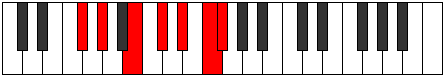

# Mode AFlatDarmic

## Links

- [Documentation](index.md)
- [Scales Index](Scales.md)
- [Modes Index](Modes.md)
- [Chords Index](Chords.md)

## Scale

[Darmic](ScaleDarmic.md)

## Mode

[AFlatDarmic](ModeAFlatDarmic.md)

## Tonic

Ab

## Signature

[CNaturalMajor]

## Perfection

 - 4 Perfect Notes

 - 2 Imperfect Notes

## Notes

- Ab
- B
- C#
- D# (Imperfect)
- E# (Imperfect)
- F#
- Ab

## Illustration

## Relative Modes

| Number | Mode | Tonic | Notes | Illustration |
|--------|------|-------|-------|--------------|
| [725](https://ianring.com/musictheory/scales/725) | [Lonimic](ModeLonimic.md) | B | B, C#, D#, E#, F#, G#, B |  |
| [1205](https://ianring.com/musictheory/scales/1205) | [Ionycrimic](ModeIonycrimic.md) | C# | C#, D#, E#, F#, G#, A##, C# |  |
| [1205](https://ianring.com/musictheory/scales/1205) | [Ionycrimic](ModeIonycrimic.md) | Db | Db, Eb, F, Gb, Ab, B, Db |  |
| [1325](https://ianring.com/musictheory/scales/1325) | [Phradimic](ModePhradimic.md) | D# | D#, E#, F#, G#, A##, B##, D# |  |
| [1325](https://ianring.com/musictheory/scales/1325) | [Phradimic](ModePhradimic.md) | Eb | Eb, F, Gb, Ab, B, C#, Eb |  |
| [1355](https://ianring.com/musictheory/scales/1355) | [Aeolorimic](ModeAeolorimic.md) | F | F, Gb, Ab, B, C#, D#, F |  |
| [1705](https://ianring.com/musictheory/scales/1705) | [Darmic](ModeDarmic.md) | G# | G#, A##, B##, C###, D###, E##, G# |  |
| [1705](https://ianring.com/musictheory/scales/1705) | [Darmic](ModeDarmic.md) | Ab | Ab, B, C#, D#, E#, F#, Ab |  |
| [2725](https://ianring.com/musictheory/scales/2725) | [Gonimic](ModeGonimic.md) | F# | F#, G#, A##, B##, C###, D###, F# |  |
| [2725](https://ianring.com/musictheory/scales/2725) | [Gonimic](ModeGonimic.md) | Gb | Gb, Ab, B, C#, D#, E#, Gb |  |

## Chords

### Ab

| Number | Root | Name | Notes | Illustration | Audio |
|--------|------|------|-------|--------------|-------|

### B

| Number | Root | Name | Notes | Illustration | Audio |
|--------|------|------|-------|--------------|-------|
| 2082 | B | [Bsus2b5](ChordBNaturalSuspendedSecondFlatFifth.md) | B, C#, F |  | [midi](ChordBNaturalSuspendedSecondFlatFifthRootPosition.mid) [ogg](ChordBNaturalSuspendedSecondFlatFifthRootPosition.ogg) |
| 2088 | B | [BMb5](ChordBNaturalMajorFlatFifth.md) | B, D#, F |  | [midi](ChordBNaturalMajorFlatFifthRootPosition.mid) [ogg](ChordBNaturalMajorFlatFifthRootPosition.ogg) |
| 2112 | B | [B5](ChordBNaturalPowerChord.md) | B, F# |  | [midi](ChordBNaturalPowerChordRootPosition.mid) [ogg](ChordBNaturalPowerChordRootPosition.ogg) |
| 2114 | B | [Bsus2](ChordBNaturalSuspendedSecond.md) | B, C#, F# |  | [midi](ChordBNaturalSuspendedSecondRootPosition.mid) [ogg](ChordBNaturalSuspendedSecondRootPosition.ogg) |
| 2120 | B | [BM](ChordBNaturalMajor.md) | B, D#, F# |  | [midi](ChordBNaturalMajorRootPosition.mid) [ogg](ChordBNaturalMajorRootPosition.ogg) |
| 2122 | B | [BM(add9)](ChordBNaturalMajorAddNinth.md) | B, D#, F#, C# |  | [midi](ChordBNaturalMajorAddNinthRootPosition.mid) [ogg](ChordBNaturalMajorAddNinthRootPosition.ogg) |
| 2144 | B | [Blyd](ChordBNaturalLydian.md) | B, E#, F# |  | [midi](ChordBNaturalLydianRootPosition.mid) [ogg](ChordBNaturalLydianRootPosition.ogg) |
| 2152 | B | [BM(add(#4))](ChordBNaturalMajorAddSharpFourth.md) | B, D#, E#, F# |  | [midi](ChordBNaturalMajorAddSharpFourthRootPosition.mid) [ogg](ChordBNaturalMajorAddSharpFourthRootPosition.ogg) |
| 2312 | B | [BM##5](ChordBNaturalMajorDoubleSharpFifth.md) | B, D#, G# |  | [midi](ChordBNaturalMajorDoubleSharpFifthRootPosition.mid) [ogg](ChordBNaturalMajorDoubleSharpFifthRootPosition.ogg) |
| 2338 | B | [BM6sus2b5](ChordBNaturalMajorSixthSuspendedSecondFlatFifth.md) | B, C#, F, G# |  | [midi](ChordBNaturalMajorSixthSuspendedSecondFlatFifthRootPosition.mid) [ogg](ChordBNaturalMajorSixthSuspendedSecondFlatFifthRootPosition.ogg) |
| 2344 | B | [BM6b5](ChordBNaturalMajorSixthFlatFifth.md) | B, D#, F, G# |  | [midi](ChordBNaturalMajorSixthFlatFifthRootPosition.mid) [ogg](ChordBNaturalMajorSixthFlatFifthRootPosition.ogg) |
| 2370 | B | [BM6sus2](ChordBNaturalMajorSixthSuspendedSecond.md) | B, C#, F#, G# |  | [midi](ChordBNaturalMajorSixthSuspendedSecondRootPosition.mid) [ogg](ChordBNaturalMajorSixthSuspendedSecondRootPosition.ogg) |
| 2370 | B | [B7sus2b5](ChordBNaturalDominantSeventhSuspendedSecondFlatFifth.md) | B, C#, F#, Ab |  | [midi](ChordBNaturalDominantSeventhSuspendedSecondFlatFifthRootPosition.mid) [ogg](ChordBNaturalDominantSeventhSuspendedSecondFlatFifthRootPosition.ogg) |
| 2376 | B | [BM6](ChordBNaturalMajorSixth.md) | B, D#, F#, G# |  | [midi](ChordBNaturalMajorSixthRootPosition.mid) [ogg](ChordBNaturalMajorSixthRootPosition.ogg) |
| 2378 | B | [BM6(add9)](ChordBNaturalMajorSixthAddNinth.md) | B, D#, F#, G#, C# |  | [midi](ChordBNaturalMajorSixthAddNinthRootPosition.mid) [ogg](ChordBNaturalMajorSixthAddNinthRootPosition.ogg) |

### C#

| Number | Root | Name | Notes | Illustration | Audio |
|--------|------|------|-------|--------------|-------|
| 74 | C# | [C#sus2bb5](ChordCSharpSuspendedSecondDoubleFlatFifth.md) | C#, D#, F# |  | [midi](ChordCSharpSuspendedSecondDoubleFlatFifthRootPosition.mid) [ogg](ChordCSharpSuspendedSecondDoubleFlatFifthRootPosition.ogg) |
| 258 | C# | [C#5](ChordCSharpPowerChord.md) | C#, G# |  | [midi](ChordCSharpPowerChordRootPosition.mid) [ogg](ChordCSharpPowerChordRootPosition.ogg) |
| 266 | C# | [C#sus2](ChordCSharpSuspendedSecond.md) | C#, D#, G# |  | [midi](ChordCSharpSuspendedSecondRootPosition.mid) [ogg](ChordCSharpSuspendedSecondRootPosition.ogg) |
| 290 | C# | [C#M](ChordCSharpMajor.md) | C#, E#, G# |  | [midi](ChordCSharpMajorRootPosition.mid) [ogg](ChordCSharpMajorRootPosition.ogg) |
| 298 | C# | [C#M(add9)](ChordCSharpMajorAddNinth.md) | C#, E#, G#, D# |  | [midi](ChordCSharpMajorAddNinthRootPosition.mid) [ogg](ChordCSharpMajorAddNinthRootPosition.ogg) |
| 322 | C# | [C#sus4](ChordCSharpSuspendedFourth.md) | C#, F#, G# |  | [midi](ChordCSharpSuspendedFourthRootPosition.mid) [ogg](ChordCSharpSuspendedFourthRootPosition.ogg) |
| 354 | C# | [C#M(add11)](ChordCSharpMajorAddEleventh.md) | C#, E#, G#, F# |  | [midi](ChordCSharpMajorAddEleventhRootPosition.mid) [ogg](ChordCSharpMajorAddEleventhRootPosition.ogg) |
| 354 | C# | [C#M(add4)](ChordCSharpMajorAddFourth.md) | C#, E#, F#, G# |  | [midi](ChordCSharpMajorAddFourthRootPosition.mid) [ogg](ChordCSharpMajorAddFourthRootPosition.ogg) |
| 2114 | C# | [C#Q](ChordCSharpQuartal.md) | C#, F#, B |  | [midi](ChordCSharpQuartalRootPosition.mid) [ogg](ChordCSharpQuartalRootPosition.ogg) |
| 2314 | C# | [C#7sus2](ChordCSharpDominantSeventhSuspendedSecond.md) | C#, D#, G#, B |  | [midi](ChordCSharpDominantSeventhSuspendedSecondRootPosition.mid) [ogg](ChordCSharpDominantSeventhSuspendedSecondRootPosition.ogg) |
| 2314 | C# | [C#9sus2](ChordCSharpDominantNinthSuspendedSecond.md) | C#, D#, G#, B, D# |  | [midi](ChordCSharpDominantNinthSuspendedSecondRootPosition.mid) [ogg](ChordCSharpDominantNinthSuspendedSecondRootPosition.ogg) |
| 2338 | C# | [C#7](ChordCSharpDominantSeventh.md) | C#, E#, G#, B |  | [midi](ChordCSharpDominantSeventhRootPosition.mid) [ogg](ChordCSharpDominantSeventhRootPosition.ogg) |
| 2346 | C# | [C#9](ChordCSharpDominantNinth.md) | C#, E#, G#, B, D# |  | [midi](ChordCSharpDominantNinthRootPosition.mid) [ogg](ChordCSharpDominantNinthRootPosition.ogg) |
| 2370 | C# | [C#7sus4](ChordCSharpDominantSeventhSuspendedFourth.md) | C#, F#, G#, B |  | [midi](ChordCSharpDominantSeventhSuspendedFourthRootPosition.mid) [ogg](ChordCSharpDominantSeventhSuspendedFourthRootPosition.ogg) |
| 2378 | C# | [C#9sus4](ChordCSharpDominantNinthSuspendedFourth.md) | C#, F#, G#, B, D# |  | [midi](ChordCSharpDominantNinthSuspendedFourthRootPosition.mid) [ogg](ChordCSharpDominantNinthSuspendedFourthRootPosition.ogg) |
| 2402 | C# | [C#7add4](ChordCSharpDominantSeventhAddFourth.md) | C#, E#, F#, G#, B |  | [midi](ChordCSharpDominantSeventhAddFourthRootPosition.mid) [ogg](ChordCSharpDominantSeventhAddFourthRootPosition.ogg) |
| 2402 | C# | [C#7add11](ChordCSharpDominantSeventhAddEleventh.md) | C#, E#, G#, B, F# |  | [midi](ChordCSharpDominantSeventhAddEleventhRootPosition.mid) [ogg](ChordCSharpDominantSeventhAddEleventhRootPosition.ogg) |
| 2410 | C# | [C#11](ChordCSharpDominantEleventh.md) | C#, E#, G#, B, D#, F# |  | [midi](ChordCSharpDominantEleventhRootPosition.mid) [ogg](ChordCSharpDominantEleventhRootPosition.ogg) |

### D#

| Number | Root | Name | Notes | Illustration | Audio |
|--------|------|------|-------|--------------|-------|
| 296 | D# | [D#sus2bb5](ChordDSharpSuspendedSecondDoubleFlatFifth.md) | D#, E#, G# |  | [midi](ChordDSharpSuspendedSecondDoubleFlatFifthRootPosition.mid) [ogg](ChordDSharpSuspendedSecondDoubleFlatFifthRootPosition.ogg) |
| 328 | D# | [D#mbb5](ChordDSharpMinorDoubleFlatFifth.md) | D#, F#, G# |  | [midi](ChordDSharpMinorDoubleFlatFifthRootPosition.mid) [ogg](ChordDSharpMinorDoubleFlatFifthRootPosition.ogg) |
| 2088 | D# | [D#sus2#5](ChordDSharpSuspendedSecondSharpFifth.md) | D#, E#, A## |  | [midi](ChordDSharpSuspendedSecondSharpFifthRootPosition.mid) [ogg](ChordDSharpSuspendedSecondSharpFifthRootPosition.ogg) |
| 2120 | D# | [D#m#5](ChordDSharpMinorSharpFifth.md) | D#, F#, B |  | [midi](ChordDSharpMinorSharpFifthRootPosition.mid) [ogg](ChordDSharpMinorSharpFifthRootPosition.ogg) |
| 2312 | D# | [D#sus4#5](ChordDSharpSuspendedFourthSharpFifth.md) | D#, G#, A## |  | [midi](ChordDSharpSuspendedFourthSharpFifthRootPosition.mid) [ogg](ChordDSharpSuspendedFourthSharpFifthRootPosition.ogg) |
| 266 | D# | [D#Q](ChordDSharpQuartal.md) | D#, G#, C# |  | [midi](ChordDSharpQuartalRootPosition.mid) [ogg](ChordDSharpQuartalRootPosition.ogg) |
| 330 | D# | [D#m7bb5](ChordDSharpMinorSeventhDoubleFlatFifth.md) | D#, F#, G#, C# |  | [midi](ChordDSharpMinorSeventhDoubleFlatFifthRootPosition.mid) [ogg](ChordDSharpMinorSeventhDoubleFlatFifthRootPosition.ogg) |
| 2122 | D# | [D#m7#5](ChordDSharpMinorSeventhSharpFifth.md) | D#, F#, A##, C# |  | [midi](ChordDSharpMinorSeventhSharpFifthRootPosition.mid) [ogg](ChordDSharpMinorSeventhSharpFifthRootPosition.ogg) |

### E#

| Number | Root | Name | Notes | Illustration | Audio |
|--------|------|------|-------|--------------|-------|

### F#

| Number | Root | Name | Notes | Illustration | Audio |
|--------|------|------|-------|--------------|-------|
| 2368 | F# | [F#sus2bb5](ChordFSharpSuspendedSecondDoubleFlatFifth.md) | F#, G#, B |  | [midi](ChordFSharpSuspendedSecondDoubleFlatFifthRootPosition.mid) [ogg](ChordFSharpSuspendedSecondDoubleFlatFifthRootPosition.ogg) |
| 66 | F# | [F#5](ChordFSharpPowerChord.md) | F#, C# |  | [midi](ChordFSharpPowerChordRootPosition.mid) [ogg](ChordFSharpPowerChordRootPosition.ogg) |
| 322 | F# | [F#sus2](ChordFSharpSuspendedSecond.md) | F#, G#, C# |  | [midi](ChordFSharpSuspendedSecondRootPosition.mid) [ogg](ChordFSharpSuspendedSecondRootPosition.ogg) |
| 2114 | F# | [F#sus4](ChordFSharpSuspendedFourth.md) | F#, B, C# |  | [midi](ChordFSharpSuspendedFourthRootPosition.mid) [ogg](ChordFSharpSuspendedFourthRootPosition.ogg) |
| 2120 | F# | [F#sus4##5](ChordFSharpSuspendedFourthDoubleSharpFifth.md) | F#, B, D# |  | [midi](ChordFSharpSuspendedFourthDoubleSharpFifthRootPosition.mid) [ogg](ChordFSharpSuspendedFourthDoubleSharpFifthRootPosition.ogg) |
| 2376 | F# | [F#M6sus2bb5](ChordFSharpMajorSixthSuspendedSecondDoubleFlatFifth.md) | F#, G#, B, D# |  | [midi](ChordFSharpMajorSixthSuspendedSecondDoubleFlatFifthRootPosition.mid) [ogg](ChordFSharpMajorSixthSuspendedSecondDoubleFlatFifthRootPosition.ogg) |
| 330 | F# | [F#M6sus2](ChordFSharpMajorSixthSuspendedSecond.md) | F#, G#, C#, D# |  | [midi](ChordFSharpMajorSixthSuspendedSecondRootPosition.mid) [ogg](ChordFSharpMajorSixthSuspendedSecondRootPosition.ogg) |
| 330 | F# | [F#7sus2b5](ChordFSharpDominantSeventhSuspendedSecondFlatFifth.md) | F#, G#, C#, Eb |  | [midi](ChordFSharpDominantSeventhSuspendedSecondFlatFifthRootPosition.mid) [ogg](ChordFSharpDominantSeventhSuspendedSecondFlatFifthRootPosition.ogg) |
| 2122 | F# | [F#M6sus4](ChordFSharpMajorSixthSuspendedFourth.md) | F#, B, C#, D# |  | [midi](ChordFSharpMajorSixthSuspendedFourthRootPosition.mid) [ogg](ChordFSharpMajorSixthSuspendedFourthRootPosition.ogg) |
| 2144 | F# | [F#Q+](ChordFSharpQuartalAugmented.md) | F#, B, E# |  | [midi](ChordFSharpQuartalAugmentedRootPosition.mid) [ogg](ChordFSharpQuartalAugmentedRootPosition.ogg) |
| 354 | F# | [F#M7(sus2)](ChordFSharpMajorSeventhSuspendedSecond.md) | F#, G#, C#, E# |  | [midi](ChordFSharpMajorSeventhSuspendedSecondRootPosition.mid) [ogg](ChordFSharpMajorSeventhSuspendedSecondRootPosition.ogg) |
| 354 | F# | [F#M9sus2](ChordFSharpMajorNinthSuspendedSecond.md) | F#, G#, C#, E#, G# |  | [midi](ChordFSharpMajorNinthSuspendedSecondRootPosition.mid) [ogg](ChordFSharpMajorNinthSuspendedSecondRootPosition.ogg) |
| 2146 | F# | [F#M7(sus4)](ChordFSharpMajorSeventhSuspendedFourth.md) | F#, B, C#, E# |  | [midi](ChordFSharpMajorSeventhSuspendedFourthRootPosition.mid) [ogg](ChordFSharpMajorSeventhSuspendedFourthRootPosition.ogg) |
| 2402 | F# | [F#M9sus4](ChordFSharpMajorNinthSuspendedFourth.md) | F#, B, C#, E#, G# |  | [midi](ChordFSharpMajorNinthSuspendedFourthRootPosition.mid) [ogg](ChordFSharpMajorNinthSuspendedFourthRootPosition.ogg) |
| 2152 | F# | [F#M7(sus4)##5](ChordFSharpMajorSeventhSuspendedFourthDoubleSharpFifth.md) | F#, B, D#, E# |  | [midi](ChordFSharpMajorSeventhSuspendedFourthDoubleSharpFifthRootPosition.mid) [ogg](ChordFSharpMajorSeventhSuspendedFourthDoubleSharpFifthRootPosition.ogg) |

