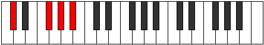

# Mode AFlatDaryllic

## Links

- [Documentation](index.md)
- [Scales Index](Scales.md)
- [Modes Index](Modes.md)
- [Chords Index](Chords.md)

## Scale

[Tharyllic](ScaleTharyllic.md)

## Mode

[AFlatDaryllic](ModeAFlatDaryllic.md)

## Tonic

Ab

## Signature

[CNaturalMajor]

## Perfection

 - 5 Perfect Notes

 - 3 Imperfect Notes

## Notes

- Ab
- A (Imperfect)
- Bb (Imperfect)
- C
- Db
- Eb
- Gb
- G (Imperfect)
- Ab

## Illustration

## Relative Modes

| Number | Mode | Tonic | Notes | Illustration |
|--------|------|-------|-------|--------------|
| [735](https://ianring.com/musictheory/scales/735) | [Sylyllic](ModeSylyllic.md) | F# | F#, G, G#, A, A#, C, C#, D#, F# |  |
| [735](https://ianring.com/musictheory/scales/735) | [Sylyllic](ModeSylyllic.md) | Gb | Gb, G, Ab, A, Bb, C, Db, Eb, Gb |  |
| [1785](https://ianring.com/musictheory/scales/1785) | [Tharyllic](ModeTharyllic.md) | D# | D#, F#, G, G#, A, A#, C, C#, D# |  |
| [1785](https://ianring.com/musictheory/scales/1785) | [Tharyllic](ModeTharyllic.md) | Eb | Eb, Gb, G, Ab, A, Bb, C, Db, Eb |  |
| [1995](https://ianring.com/musictheory/scales/1995) | [Aeolacryllic](ModeAeolacryllic.md) | C | C, C#, D#, F#, G, G#, A, A#, C |  |
| [2415](https://ianring.com/musictheory/scales/2415) | [Lothyllic](ModeLothyllic.md) | G | G, G#, A, A#, C, C#, D#, F#, G |  |
| [3045](https://ianring.com/musictheory/scales/3045) | [Raptyllic](ModeRaptyllic.md) | C# | C#, D#, F#, G, G#, A, A#, C, C# |  |
| [3045](https://ianring.com/musictheory/scales/3045) | [Raptyllic](ModeRaptyllic.md) | Db | Db, Eb, Gb, G, Ab, A, Bb, C, Db |  |
| [3255](https://ianring.com/musictheory/scales/3255) | [Daryllic](ModeDaryllic.md) | G# | G#, A, A#, C, C#, D#, F#, G, G# |  |
| [3255](https://ianring.com/musictheory/scales/3255) | [Daryllic](ModeDaryllic.md) | Ab | Ab, A, Bb, C, Db, Eb, Gb, G, Ab |  |
| [3675](https://ianring.com/musictheory/scales/3675) | [Monyllic](ModeMonyllic.md) | A | A, A#, C, C#, D#, F#, G, G#, A |  |
| [3885](https://ianring.com/musictheory/scales/3885) | [Styryllic](ModeStyryllic.md) | A# | A#, C, C#, D#, F#, G, G#, A, A# |  |
| [3885](https://ianring.com/musictheory/scales/3885) | [Styryllic](ModeStyryllic.md) | Bb | Bb, C, Db, Eb, Gb, G, Ab, A, Bb |  |

## Chords

### Ab

| Number | Root | Name | Notes | Illustration | Audio |
|--------|------|------|-------|--------------|-------|
| 1282 | Ab | [Absus2bb5](ChordAFlatSuspendedSecondDoubleFlatFifth.md) | Ab, Bb, Db |  | [midi](ChordAFlatSuspendedSecondDoubleFlatFifthRootPosition.mid) [ogg](ChordAFlatSuspendedSecondDoubleFlatFifthRootPosition.ogg) |
| 264 | Ab | [Ab5](ChordAFlatPowerChord.md) | Ab, Eb |  | [midi](ChordAFlatPowerChordRootPosition.mid) [ogg](ChordAFlatPowerChordRootPosition.ogg) |
| 776 | Ab | [Abphryg](ChordAFlatPhrygian.md) | Ab, Bbb, Eb |  | [midi](ChordAFlatPhrygianRootPosition.mid) [ogg](ChordAFlatPhrygianRootPosition.ogg) |
| 1288 | Ab | [Absus2](ChordAFlatSuspendedSecond.md) | Ab, Bb, Eb |  | [midi](ChordAFlatSuspendedSecondRootPosition.mid) [ogg](ChordAFlatSuspendedSecondRootPosition.ogg) |
| 265 | Ab | [AbM](ChordAFlatMajor.md) | Ab, C, Eb |  | [midi](ChordAFlatMajorRootPosition.mid) [ogg](ChordAFlatMajorRootPosition.ogg) |
| 1289 | Ab | [AbM(add9)](ChordAFlatMajorAddNinth.md) | Ab, C, Eb, Bb |  | [midi](ChordAFlatMajorAddNinthRootPosition.mid) [ogg](ChordAFlatMajorAddNinthRootPosition.ogg) |
| 266 | Ab | [Absus4](ChordAFlatSuspendedFourth.md) | Ab, Db, Eb |  | [midi](ChordAFlatSuspendedFourthRootPosition.mid) [ogg](ChordAFlatSuspendedFourthRootPosition.ogg) |
| 267 | Ab | [AbM(add11)](ChordAFlatMajorAddEleventh.md) | Ab, C, Eb, Db |  | [midi](ChordAFlatMajorAddEleventhRootPosition.mid) [ogg](ChordAFlatMajorAddEleventhRootPosition.ogg) |
| 267 | Ab | [AbM(add4)](ChordAFlatMajorAddFourth.md) | Ab, C, Db, Eb |  | [midi](ChordAFlatMajorAddFourthRootPosition.mid) [ogg](ChordAFlatMajorAddFourthRootPosition.ogg) |
| 322 | Ab | [AbQ](ChordAFlatQuartal.md) | Ab, Db, Gb |  | [midi](ChordAFlatQuartalRootPosition.mid) [ogg](ChordAFlatQuartalRootPosition.ogg) |
| 1352 | Ab | [Ab7sus2](ChordAFlatDominantSeventhSuspendedSecond.md) | Ab, Bb, Eb, Gb |  | [midi](ChordAFlatDominantSeventhSuspendedSecondRootPosition.mid) [ogg](ChordAFlatDominantSeventhSuspendedSecondRootPosition.ogg) |
| 1352 | Ab | [Ab9sus2](ChordAFlatDominantNinthSuspendedSecond.md) | Ab, Bb, Eb, Gb, Bb |  | [midi](ChordAFlatDominantNinthSuspendedSecondRootPosition.mid) [ogg](ChordAFlatDominantNinthSuspendedSecondRootPosition.ogg) |
| 329 | Ab | [Ab7](ChordAFlatDominantSeventh.md) | Ab, C, Eb, Gb |  | [midi](ChordAFlatDominantSeventhRootPosition.mid) [ogg](ChordAFlatDominantSeventhRootPosition.ogg) |
| 841 | Ab | [Ab7b9](ChordAFlatDominantSeventhFlatNinth.md) | Ab, C, Eb, Gb, Bbb |  | [midi](ChordAFlatDominantSeventhFlatNinthRootPosition.mid) [ogg](ChordAFlatDominantSeventhFlatNinthRootPosition.ogg) |
| 1353 | Ab | [Ab9](ChordAFlatDominantNinth.md) | Ab, C, Eb, Gb, Bb |  | [midi](ChordAFlatDominantNinthRootPosition.mid) [ogg](ChordAFlatDominantNinthRootPosition.ogg) |
| 330 | Ab | [Ab7sus4](ChordAFlatDominantSeventhSuspendedFourth.md) | Ab, Db, Eb, Gb |  | [midi](ChordAFlatDominantSeventhSuspendedFourthRootPosition.mid) [ogg](ChordAFlatDominantSeventhSuspendedFourthRootPosition.ogg) |
| 1354 | Ab | [Ab9sus4](ChordAFlatDominantNinthSuspendedFourth.md) | Ab, Db, Eb, Gb, Bb |  | [midi](ChordAFlatDominantNinthSuspendedFourthRootPosition.mid) [ogg](ChordAFlatDominantNinthSuspendedFourthRootPosition.ogg) |
| 331 | Ab | [Ab7add4](ChordAFlatDominantSeventhAddFourth.md) | Ab, C, Db, Eb, Gb |  | [midi](ChordAFlatDominantSeventhAddFourthRootPosition.mid) [ogg](ChordAFlatDominantSeventhAddFourthRootPosition.ogg) |
| 331 | Ab | [Ab7add11](ChordAFlatDominantSeventhAddEleventh.md) | Ab, C, Eb, Gb, Db |  | [midi](ChordAFlatDominantSeventhAddEleventhRootPosition.mid) [ogg](ChordAFlatDominantSeventhAddEleventhRootPosition.ogg) |
| 1355 | Ab | [Ab11](ChordAFlatDominantEleventh.md) | Ab, C, Eb, Gb, Bb, Db |  | [midi](ChordAFlatDominantEleventhRootPosition.mid) [ogg](ChordAFlatDominantEleventhRootPosition.ogg) |
| 386 | Ab | [AbQ+](ChordAFlatQuartalAugmented.md) | Ab, Db, G |  | [midi](ChordAFlatQuartalAugmentedRootPosition.mid) [ogg](ChordAFlatQuartalAugmentedRootPosition.ogg) |
| 904 | Ab | [Abphryg+7](ChordAFlatPhrygianAddSeventh.md) | Ab, Bbb, Eb, G |  | [midi](ChordAFlatPhrygianAddSeventhRootPosition.mid) [ogg](ChordAFlatPhrygianAddSeventhRootPosition.ogg) |
| 1416 | Ab | [AbM7(sus2)](ChordAFlatMajorSeventhSuspendedSecond.md) | Ab, Bb, Eb, G |  | [midi](ChordAFlatMajorSeventhSuspendedSecondRootPosition.mid) [ogg](ChordAFlatMajorSeventhSuspendedSecondRootPosition.ogg) |
| 1416 | Ab | [AbM9sus2](ChordAFlatMajorNinthSuspendedSecond.md) | Ab, Bb, Eb, G, Bb |  | [midi](ChordAFlatMajorNinthSuspendedSecondRootPosition.mid) [ogg](ChordAFlatMajorNinthSuspendedSecondRootPosition.ogg) |
| 393 | Ab | [AbM7](ChordAFlatMajorSeventh.md) | Ab, C, Eb, G |  | [midi](ChordAFlatMajorSeventhRootPosition.mid) [ogg](ChordAFlatMajorSeventhRootPosition.ogg) |
| 1417 | Ab | [AbM9](ChordAFlatMajorNinth.md) | Ab, C, Eb, G, Bb |  | [midi](ChordAFlatMajorNinthRootPosition.mid) [ogg](ChordAFlatMajorNinthRootPosition.ogg) |
| 394 | Ab | [AbM7(sus4)](ChordAFlatMajorSeventhSuspendedFourth.md) | Ab, Db, Eb, G |  | [midi](ChordAFlatMajorSeventhSuspendedFourthRootPosition.mid) [ogg](ChordAFlatMajorSeventhSuspendedFourthRootPosition.ogg) |
| 1418 | Ab | [AbM9sus4](ChordAFlatMajorNinthSuspendedFourth.md) | Ab, Db, Eb, G, Bb |  | [midi](ChordAFlatMajorNinthSuspendedFourthRootPosition.mid) [ogg](ChordAFlatMajorNinthSuspendedFourthRootPosition.ogg) |
| 395 | Ab | [AbM7add4](ChordAFlatMajorSeventhAddFourth.md) | Ab, C, Db, Eb, G |  | [midi](ChordAFlatMajorSeventhAddFourthRootPosition.mid) [ogg](ChordAFlatMajorSeventhAddFourthRootPosition.ogg) |
| 395 | Ab | [AbM7add11](ChordAFlatMajorSeventhAddEleventh.md) | Ab, C, Eb, G, Db |  | [midi](ChordAFlatMajorSeventhAddEleventhRootPosition.mid) [ogg](ChordAFlatMajorSeventhAddEleventhRootPosition.ogg) |
| 1419 | Ab | [AbM11](ChordAFlatMajorEleventh.md) | Ab, C, Eb, G, Bb, Db |  | [midi](ChordAFlatMajorEleventhRootPosition.mid) [ogg](ChordAFlatMajorEleventhRootPosition.ogg) |

### A

| Number | Root | Name | Notes | Illustration | Audio |
|--------|------|------|-------|--------------|-------|
| 1544 | A | [Aloc](ChordANaturalLocrian.md) | A, Bb, Eb |  | [midi](ChordANaturalLocrianRootPosition.mid) [ogg](ChordANaturalLocrianRootPosition.ogg) |
| 521 | A | [Ao](ChordANaturalDiminished.md) | A, C, Eb |  | [midi](ChordANaturalDiminishedRootPosition.mid) [ogg](ChordANaturalDiminishedRootPosition.ogg) |
| 522 | A | [AMb5](ChordANaturalMajorFlatFifth.md) | A, C#, Eb |  | [midi](ChordANaturalMajorFlatFifthRootPosition.mid) [ogg](ChordANaturalMajorFlatFifthRootPosition.ogg) |
| 578 | A | [AM##5](ChordANaturalMajorDoubleSharpFifth.md) | A, C#, F# |  | [midi](ChordANaturalMajorDoubleSharpFifthRootPosition.mid) [ogg](ChordANaturalMajorDoubleSharpFifthRootPosition.ogg) |
| 585 | A | [Ao7](ChordANaturalFullDiminishedSeventh.md) | A, C, Eb, Gb |  | [midi](ChordANaturalFullDiminishedSeventhRootPosition.mid) [ogg](ChordANaturalFullDiminishedSeventhRootPosition.ogg) |
| 586 | A | [AM6b5](ChordANaturalMajorSixthFlatFifth.md) | A, C#, Eb, F# |  | [midi](ChordANaturalMajorSixthFlatFifthRootPosition.mid) [ogg](ChordANaturalMajorSixthFlatFifthRootPosition.ogg) |
| 649 | A | [Aø7](ChordANaturalHalfDiminishedSeventh.md) | A, C, Eb, G |  | [midi](ChordANaturalHalfDiminishedSeventhRootPosition.mid) [ogg](ChordANaturalHalfDiminishedSeventhRootPosition.ogg) |
| 650 | A | [A7b5](ChordANaturalDominantSeventhFlatFifth.md) | A, C#, Eb, G |  | [midi](ChordANaturalDominantSeventhFlatFifthRootPosition.mid) [ogg](ChordANaturalDominantSeventhFlatFifthRootPosition.ogg) |
| 1674 | A | [A7b5b9](ChordANaturalDominantSeventhFlatFifthFlatNinth.md) | A, C#, Eb, G, Bb |  | [midi](ChordANaturalDominantSeventhFlatFifthFlatNinthRootPosition.mid) [ogg](ChordANaturalDominantSeventhFlatFifthFlatNinthRootPosition.ogg) |
| 777 | A | [AoM7](ChordANaturalDiminishedMajorSeventh.md) | A, C, Eb, G# |  | [midi](ChordANaturalDiminishedMajorSeventhRootPosition.mid) [ogg](ChordANaturalDiminishedMajorSeventhRootPosition.ogg) |
| 778 | A | [AM7b5](ChordANaturalMajorSeventhFlatFifth.md) | A, C#, Eb, G# |  | [midi](ChordANaturalMajorSeventhFlatFifthRootPosition.mid) [ogg](ChordANaturalMajorSeventhFlatFifthRootPosition.ogg) |
| 834 | A | [AM7##5](ChordANaturalMajorSeventhDoubleSharpFifth.md) | A, C#, F#, G# |  | [midi](ChordANaturalMajorSeventhDoubleSharpFifthRootPosition.mid) [ogg](ChordANaturalMajorSeventhDoubleSharpFifthRootPosition.ogg) |

### Bb

| Number | Root | Name | Notes | Illustration | Audio |
|--------|------|------|-------|--------------|-------|
| 1033 | Bb | [Bbsus2bb5](ChordBFlatSuspendedSecondDoubleFlatFifth.md) | Bb, C, Eb |  | [midi](ChordBFlatSuspendedSecondDoubleFlatFifthRootPosition.mid) [ogg](ChordBFlatSuspendedSecondDoubleFlatFifthRootPosition.ogg) |
| 1034 | Bb | [Bbmbb5](ChordBFlatMinorDoubleFlatFifth.md) | Bb, Db, Eb |  | [midi](ChordBFlatMinorDoubleFlatFifthRootPosition.mid) [ogg](ChordBFlatMinorDoubleFlatFifthRootPosition.ogg) |
| 1089 | Bb | [Bbsus2#5](ChordBFlatSuspendedSecondSharpFifth.md) | Bb, C, F# |  | [midi](ChordBFlatSuspendedSecondSharpFifthRootPosition.mid) [ogg](ChordBFlatSuspendedSecondSharpFifthRootPosition.ogg) |
| 1090 | Bb | [Bbm#5](ChordBFlatMinorSharpFifth.md) | Bb, Db, Gb |  | [midi](ChordBFlatMinorSharpFifthRootPosition.mid) [ogg](ChordBFlatMinorSharpFifthRootPosition.ogg) |
| 1096 | Bb | [Bbsus4#5](ChordBFlatSuspendedFourthSharpFifth.md) | Bb, Eb, F# |  | [midi](ChordBFlatSuspendedFourthSharpFifthRootPosition.mid) [ogg](ChordBFlatSuspendedFourthSharpFifthRootPosition.ogg) |
| 1160 | Bb | [Bbsus4##5](ChordBFlatSuspendedFourthDoubleSharpFifth.md) | Bb, Eb, G |  | [midi](ChordBFlatSuspendedFourthDoubleSharpFifthRootPosition.mid) [ogg](ChordBFlatSuspendedFourthDoubleSharpFifthRootPosition.ogg) |
| 1161 | Bb | [BbM6sus2bb5](ChordBFlatMajorSixthSuspendedSecondDoubleFlatFifth.md) | Bb, C, Eb, G |  | [midi](ChordBFlatMajorSixthSuspendedSecondDoubleFlatFifthRootPosition.mid) [ogg](ChordBFlatMajorSixthSuspendedSecondDoubleFlatFifthRootPosition.ogg) |
| 1288 | Bb | [BbQ](ChordBFlatQuartal.md) | Bb, Eb, Ab |  | [midi](ChordBFlatQuartalRootPosition.mid) [ogg](ChordBFlatQuartalRootPosition.ogg) |
| 1290 | Bb | [Bbm7bb5](ChordBFlatMinorSeventhDoubleFlatFifth.md) | Bb, Db, Eb, Ab |  | [midi](ChordBFlatMinorSeventhDoubleFlatFifthRootPosition.mid) [ogg](ChordBFlatMinorSeventhDoubleFlatFifthRootPosition.ogg) |
| 1346 | Bb | [Bbm7#5](ChordBFlatMinorSeventhSharpFifth.md) | Bb, Db, F#, Ab |  | [midi](ChordBFlatMinorSeventhSharpFifthRootPosition.mid) [ogg](ChordBFlatMinorSeventhSharpFifthRootPosition.ogg) |
| 1544 | Bb | [BbQ+](ChordBFlatQuartalAugmented.md) | Bb, Eb, A |  | [midi](ChordBFlatQuartalAugmentedRootPosition.mid) [ogg](ChordBFlatQuartalAugmentedRootPosition.ogg) |
| 1608 | Bb | [BbM7(sus4)#5](ChordBFlatMajorSeventhSuspendedFourthSharpFifth.md) | Bb, Eb, F#, A |  | [midi](ChordBFlatMajorSeventhSuspendedFourthSharpFifthRootPosition.mid) [ogg](ChordBFlatMajorSeventhSuspendedFourthSharpFifthRootPosition.ogg) |
| 1672 | Bb | [BbM7(sus4)##5](ChordBFlatMajorSeventhSuspendedFourthDoubleSharpFifth.md) | Bb, Eb, G, A |  | [midi](ChordBFlatMajorSeventhSuspendedFourthDoubleSharpFifthRootPosition.mid) [ogg](ChordBFlatMajorSeventhSuspendedFourthDoubleSharpFifthRootPosition.ogg) |

### C

| Number | Root | Name | Notes | Illustration | Audio |
|--------|------|------|-------|--------------|-------|
| 67 | C | [Cloc](ChordCNaturalLocrian.md) | C, Db, Gb |  | [midi](ChordCNaturalLocrianRootPosition.mid) [ogg](ChordCNaturalLocrianRootPosition.ogg) |
| 73 | C | [Co](ChordCNaturalDiminished.md) | C, Eb, Gb |  | [midi](ChordCNaturalDiminishedRootPosition.mid) [ogg](ChordCNaturalDiminishedRootPosition.ogg) |
| 129 | C | [C5](ChordCNaturalPowerChord.md) | C, G |  | [midi](ChordCNaturalPowerChordRootPosition.mid) [ogg](ChordCNaturalPowerChordRootPosition.ogg) |
| 131 | C | [Cphryg](ChordCNaturalPhrygian.md) | C, Db, G |  | [midi](ChordCNaturalPhrygianRootPosition.mid) [ogg](ChordCNaturalPhrygianRootPosition.ogg) |
| 137 | C | [Cm](ChordCNaturalMinor.md) | C, Eb, G |  | [midi](ChordCNaturalMinorRootPosition.mid) [ogg](ChordCNaturalMinorRootPosition.ogg) |
| 137 | C | [Cm(add(#9))](ChordCNaturalMinorAddSharpNinth.md) | C, Eb, G, D# |  | [midi](ChordCNaturalMinorAddSharpNinthRootPosition.mid) [ogg](ChordCNaturalMinorAddSharpNinthRootPosition.ogg) |
| 193 | C | [Clyd](ChordCNaturalLydian.md) | C, F#, G |  | [midi](ChordCNaturalLydianRootPosition.mid) [ogg](ChordCNaturalLydianRootPosition.ogg) |
| 201 | C | [Cm(add(#4))](ChordCNaturalMinorAddSharpFourth.md) | C, Eb, F#, G |  | [midi](ChordCNaturalMinorAddSharpFourthRootPosition.mid) [ogg](ChordCNaturalMinorAddSharpFourthRootPosition.ogg) |
| 265 | C | [Cm#5](ChordCNaturalMinorSharpFifth.md) | C, Eb, Ab |  | [midi](ChordCNaturalMinorSharpFifthRootPosition.mid) [ogg](ChordCNaturalMinorSharpFifthRootPosition.ogg) |
| 585 | C | [Co7](ChordCNaturalFullDiminishedSeventh.md) | C, Eb, Gb, Bbb |  | [midi](ChordCNaturalFullDiminishedSeventhRootPosition.mid) [ogg](ChordCNaturalFullDiminishedSeventhRootPosition.ogg) |
| 649 | C | [Cm6](ChordCNaturalMinorSixth.md) | C, Eb, G, A |  | [midi](ChordCNaturalMinorSixthRootPosition.mid) [ogg](ChordCNaturalMinorSixthRootPosition.ogg) |
| 651 | C | [Cm6(addb9)](ChordCNaturalMinorSixthAddFlatNinth.md) | C, Eb, G, A, Db |  | [midi](ChordCNaturalMinorSixthAddFlatNinthRootPosition.mid) [ogg](ChordCNaturalMinorSixthAddFlatNinthRootPosition.ogg) |
| 1097 | C | [Cø7](ChordCNaturalHalfDiminishedSeventh.md) | C, Eb, Gb, Bb |  | [midi](ChordCNaturalHalfDiminishedSeventhRootPosition.mid) [ogg](ChordCNaturalHalfDiminishedSeventhRootPosition.ogg) |
| 1161 | C | [Cm7](ChordCNaturalMinorSeventh.md) | C, Eb, G, Bb |  | [midi](ChordCNaturalMinorSeventhRootPosition.mid) [ogg](ChordCNaturalMinorSeventhRootPosition.ogg) |
| 1163 | C | [Cm7b9](ChordCNaturalMinorSeventhFlatNinth.md) | C, Eb, G, Bb, Db |  | [midi](ChordCNaturalMinorSeventhFlatNinthRootPosition.mid) [ogg](ChordCNaturalMinorSeventhFlatNinthRootPosition.ogg) |
| 1225 | C | [Cm7add(#11)](ChordCNaturalMinorSeventhAddSharpEleventh.md) | C, Eb, G, Bb, F# |  | [midi](ChordCNaturalMinorSeventhAddSharpEleventhRootPosition.mid) [ogg](ChordCNaturalMinorSeventhAddSharpEleventhRootPosition.ogg) |
| 1289 | C | [Cm7#5](ChordCNaturalMinorSeventhSharpFifth.md) | C, Eb, G#, Bb |  | [midi](ChordCNaturalMinorSeventhSharpFifthRootPosition.mid) [ogg](ChordCNaturalMinorSeventhSharpFifthRootPosition.ogg) |
| 1673 | C | [Cm7add13](ChordCNaturalMinorSeventhAddThirteenth.md) | C, Eb, G, Bb, A |  | [midi](ChordCNaturalMinorSeventhAddThirteenthRootPosition.mid) [ogg](ChordCNaturalMinorSeventhAddThirteenthRootPosition.ogg) |

### Db

| Number | Root | Name | Notes | Illustration | Audio |
|--------|------|------|-------|--------------|-------|
| 74 | Db | [Dbsus2bb5](ChordDFlatSuspendedSecondDoubleFlatFifth.md) | Db, Eb, Gb |  | [midi](ChordDFlatSuspendedSecondDoubleFlatFifthRootPosition.mid) [ogg](ChordDFlatSuspendedSecondDoubleFlatFifthRootPosition.ogg) |
| 138 | Db | [Dbsus2b5](ChordDFlatSuspendedSecondFlatFifth.md) | Db, Eb, Abb |  | [midi](ChordDFlatSuspendedSecondFlatFifthRootPosition.mid) [ogg](ChordDFlatSuspendedSecondFlatFifthRootPosition.ogg) |
| 194 | Db | [Dbsus4b5](ChordDFlatSuspendedFourthFlatFifth.md) | Db, Gb, Abb |  | [midi](ChordDFlatSuspendedFourthFlatFifthRootPosition.mid) [ogg](ChordDFlatSuspendedFourthFlatFifthRootPosition.ogg) |
| 258 | Db | [Db5](ChordDFlatPowerChord.md) | Db, Ab |  | [midi](ChordDFlatPowerChordRootPosition.mid) [ogg](ChordDFlatPowerChordRootPosition.ogg) |
| 266 | Db | [Dbsus2](ChordDFlatSuspendedSecond.md) | Db, Eb, Ab |  | [midi](ChordDFlatSuspendedSecondRootPosition.mid) [ogg](ChordDFlatSuspendedSecondRootPosition.ogg) |
| 322 | Db | [Dbsus4](ChordDFlatSuspendedFourth.md) | Db, Gb, Ab |  | [midi](ChordDFlatSuspendedFourthRootPosition.mid) [ogg](ChordDFlatSuspendedFourthRootPosition.ogg) |
| 386 | Db | [Dblyd](ChordDFlatLydian.md) | Db, G, Ab |  | [midi](ChordDFlatLydianRootPosition.mid) [ogg](ChordDFlatLydianRootPosition.ogg) |
| 522 | Db | [Dbsus2#5](ChordDFlatSuspendedSecondSharpFifth.md) | Db, Eb, A |  | [midi](ChordDFlatSuspendedSecondSharpFifthRootPosition.mid) [ogg](ChordDFlatSuspendedSecondSharpFifthRootPosition.ogg) |
| 578 | Db | [Dbsus4#5](ChordDFlatSuspendedFourthSharpFifth.md) | Db, Gb, A |  | [midi](ChordDFlatSuspendedFourthSharpFifthRootPosition.mid) [ogg](ChordDFlatSuspendedFourthSharpFifthRootPosition.ogg) |
| 650 | Db | [Dbsus2b5add(#5)](ChordDFlatSuspendedSecondFlatFifthAddSharpFifth.md) | Db, Eb, Abb, A |  | [midi](ChordDFlatSuspendedSecondFlatFifthAddSharpFifthRootPosition.mid) [ogg](ChordDFlatSuspendedSecondFlatFifthAddSharpFifthRootPosition.ogg) |
| 1090 | Db | [Dbsus4##5](ChordDFlatSuspendedFourthDoubleSharpFifth.md) | Db, Gb, Bb |  | [midi](ChordDFlatSuspendedFourthDoubleSharpFifthRootPosition.mid) [ogg](ChordDFlatSuspendedFourthDoubleSharpFifthRootPosition.ogg) |
| 1098 | Db | [DbM6sus2bb5](ChordDFlatMajorSixthSuspendedSecondDoubleFlatFifth.md) | Db, Eb, Gb, Bb |  | [midi](ChordDFlatMajorSixthSuspendedSecondDoubleFlatFifthRootPosition.mid) [ogg](ChordDFlatMajorSixthSuspendedSecondDoubleFlatFifthRootPosition.ogg) |
| 1162 | Db | [DbM6sus2b5](ChordDFlatMajorSixthSuspendedSecondFlatFifth.md) | Db, Eb, Abb, Bb |  | [midi](ChordDFlatMajorSixthSuspendedSecondFlatFifthRootPosition.mid) [ogg](ChordDFlatMajorSixthSuspendedSecondFlatFifthRootPosition.ogg) |
| 1290 | Db | [DbM6sus2](ChordDFlatMajorSixthSuspendedSecond.md) | Db, Eb, Ab, Bb |  | [midi](ChordDFlatMajorSixthSuspendedSecondRootPosition.mid) [ogg](ChordDFlatMajorSixthSuspendedSecondRootPosition.ogg) |
| 1290 | Db | [Db7sus2b5](ChordDFlatDominantSeventhSuspendedSecondFlatFifth.md) | Db, Eb, Ab, Cbb |  | [midi](ChordDFlatDominantSeventhSuspendedSecondFlatFifthRootPosition.mid) [ogg](ChordDFlatDominantSeventhSuspendedSecondFlatFifthRootPosition.ogg) |
| 1346 | Db | [DbM6sus4](ChordDFlatMajorSixthSuspendedFourth.md) | Db, Gb, Ab, Bb |  | [midi](ChordDFlatMajorSixthSuspendedFourthRootPosition.mid) [ogg](ChordDFlatMajorSixthSuspendedFourthRootPosition.ogg) |
| 67 | Db | [DbQ+](ChordDFlatQuartalAugmented.md) | Db, Gb, C |  | [midi](ChordDFlatQuartalAugmentedRootPosition.mid) [ogg](ChordDFlatQuartalAugmentedRootPosition.ogg) |
| 267 | Db | [DbM7(sus2)](ChordDFlatMajorSeventhSuspendedSecond.md) | Db, Eb, Ab, C |  | [midi](ChordDFlatMajorSeventhSuspendedSecondRootPosition.mid) [ogg](ChordDFlatMajorSeventhSuspendedSecondRootPosition.ogg) |
| 267 | Db | [DbM9sus2](ChordDFlatMajorNinthSuspendedSecond.md) | Db, Eb, Ab, C, Eb |  | [midi](ChordDFlatMajorNinthSuspendedSecondRootPosition.mid) [ogg](ChordDFlatMajorNinthSuspendedSecondRootPosition.ogg) |
| 323 | Db | [DbM7(sus4)](ChordDFlatMajorSeventhSuspendedFourth.md) | Db, Gb, Ab, C |  | [midi](ChordDFlatMajorSeventhSuspendedFourthRootPosition.mid) [ogg](ChordDFlatMajorSeventhSuspendedFourthRootPosition.ogg) |
| 331 | Db | [DbM9sus4](ChordDFlatMajorNinthSuspendedFourth.md) | Db, Gb, Ab, C, Eb |  | [midi](ChordDFlatMajorNinthSuspendedFourthRootPosition.mid) [ogg](ChordDFlatMajorNinthSuspendedFourthRootPosition.ogg) |
| 387 | Db | [Dblyd(M7)](ChordDFlatLydianMajorSeventh.md) | Db, G, Ab, C |  | [midi](ChordDFlatLydianMajorSeventhRootPosition.mid) [ogg](ChordDFlatLydianMajorSeventhRootPosition.ogg) |
| 579 | Db | [DbM7(sus4)#5](ChordDFlatMajorSeventhSuspendedFourthSharpFifth.md) | Db, Gb, A, C |  | [midi](ChordDFlatMajorSeventhSuspendedFourthSharpFifthRootPosition.mid) [ogg](ChordDFlatMajorSeventhSuspendedFourthSharpFifthRootPosition.ogg) |
| 1091 | Db | [DbM7(sus4)##5](ChordDFlatMajorSeventhSuspendedFourthDoubleSharpFifth.md) | Db, Gb, Bb, C |  | [midi](ChordDFlatMajorSeventhSuspendedFourthDoubleSharpFifthRootPosition.mid) [ogg](ChordDFlatMajorSeventhSuspendedFourthDoubleSharpFifthRootPosition.ogg) |

### Eb

| Number | Root | Name | Notes | Illustration | Audio |
|--------|------|------|-------|--------------|-------|
| 328 | Eb | [Ebmbb5](ChordEFlatMinorDoubleFlatFifth.md) | Eb, Gb, Ab |  | [midi](ChordEFlatMinorDoubleFlatFifthRootPosition.mid) [ogg](ChordEFlatMinorDoubleFlatFifthRootPosition.ogg) |
| 584 | Eb | [Ebo](ChordEFlatDiminished.md) | Eb, Gb, Bbb |  | [midi](ChordEFlatDiminishedRootPosition.mid) [ogg](ChordEFlatDiminishedRootPosition.ogg) |
| 648 | Eb | [EbMb5](ChordEFlatMajorFlatFifth.md) | Eb, G, Bbb |  | [midi](ChordEFlatMajorFlatFifthRootPosition.mid) [ogg](ChordEFlatMajorFlatFifthRootPosition.ogg) |
| 776 | Eb | [Ebsus4b5](ChordEFlatSuspendedFourthFlatFifth.md) | Eb, Ab, Bbb |  | [midi](ChordEFlatSuspendedFourthFlatFifthRootPosition.mid) [ogg](ChordEFlatSuspendedFourthFlatFifthRootPosition.ogg) |
| 1032 | Eb | [Eb5](ChordEFlatPowerChord.md) | Eb, Bb |  | [midi](ChordEFlatPowerChordRootPosition.mid) [ogg](ChordEFlatPowerChordRootPosition.ogg) |
| 1096 | Eb | [Ebm](ChordEFlatMinor.md) | Eb, Gb, Bb |  | [midi](ChordEFlatMinorRootPosition.mid) [ogg](ChordEFlatMinorRootPosition.ogg) |
| 1096 | Eb | [Ebm(add(#9))](ChordEFlatMinorAddSharpNinth.md) | Eb, Gb, Bb, F# |  | [midi](ChordEFlatMinorAddSharpNinthRootPosition.mid) [ogg](ChordEFlatMinorAddSharpNinthRootPosition.ogg) |
| 1160 | Eb | [EbM](ChordEFlatMajor.md) | Eb, G, Bb |  | [midi](ChordEFlatMajorRootPosition.mid) [ogg](ChordEFlatMajorRootPosition.ogg) |
| 1224 | Eb | [EbM(add(#9))](ChordEFlatMajorAddSharpNinth.md) | Eb, G, Bb, F# |  | [midi](ChordEFlatMajorAddSharpNinthRootPosition.mid) [ogg](ChordEFlatMajorAddSharpNinthRootPosition.ogg) |
| 1288 | Eb | [Ebsus4](ChordEFlatSuspendedFourth.md) | Eb, Ab, Bb |  | [midi](ChordEFlatSuspendedFourthRootPosition.mid) [ogg](ChordEFlatSuspendedFourthRootPosition.ogg) |
| 1352 | Eb | [Ebm(add11)](ChordEFlatMinorAddEleventh.md) | Eb, Gb, Bb, Ab |  | [midi](ChordEFlatMinorAddEleventhRootPosition.mid) [ogg](ChordEFlatMinorAddEleventhRootPosition.ogg) |
| 1352 | Eb | [Ebm(add4)](ChordEFlatMinorAddFourth.md) | Eb, Gb, Ab, Bb |  | [midi](ChordEFlatMinorAddFourthRootPosition.mid) [ogg](ChordEFlatMinorAddFourthRootPosition.ogg) |
| 1416 | Eb | [EbM(add11)](ChordEFlatMajorAddEleventh.md) | Eb, G, Bb, Ab |  | [midi](ChordEFlatMajorAddEleventhRootPosition.mid) [ogg](ChordEFlatMajorAddEleventhRootPosition.ogg) |
| 1416 | Eb | [EbM(add4)](ChordEFlatMajorAddFourth.md) | Eb, G, Ab, Bb |  | [midi](ChordEFlatMajorAddFourthRootPosition.mid) [ogg](ChordEFlatMajorAddFourthRootPosition.ogg) |
| 1544 | Eb | [Eblyd](ChordEFlatLydian.md) | Eb, A, Bb |  | [midi](ChordEFlatLydianRootPosition.mid) [ogg](ChordEFlatLydianRootPosition.ogg) |
| 1608 | Eb | [Ebm(add(#4))](ChordEFlatMinorAddSharpFourth.md) | Eb, Gb, A, Bb |  | [midi](ChordEFlatMinorAddSharpFourthRootPosition.mid) [ogg](ChordEFlatMinorAddSharpFourthRootPosition.ogg) |
| 1672 | Eb | [EbM(add(#4))](ChordEFlatMajorAddSharpFourth.md) | Eb, G, A, Bb |  | [midi](ChordEFlatMajorAddSharpFourthRootPosition.mid) [ogg](ChordEFlatMajorAddSharpFourthRootPosition.ogg) |
| 137 | Eb | [EbM##5](ChordEFlatMajorDoubleSharpFifth.md) | Eb, G, C |  | [midi](ChordEFlatMajorDoubleSharpFifthRootPosition.mid) [ogg](ChordEFlatMajorDoubleSharpFifthRootPosition.ogg) |
| 265 | Eb | [Ebsus4##5](ChordEFlatSuspendedFourthDoubleSharpFifth.md) | Eb, Ab, C |  | [midi](ChordEFlatSuspendedFourthDoubleSharpFifthRootPosition.mid) [ogg](ChordEFlatSuspendedFourthDoubleSharpFifthRootPosition.ogg) |
| 585 | Eb | [Ebo7](ChordEFlatFullDiminishedSeventh.md) | Eb, Gb, Bbb, Dbb |  | [midi](ChordEFlatFullDiminishedSeventhRootPosition.mid) [ogg](ChordEFlatFullDiminishedSeventhRootPosition.ogg) |
| 649 | Eb | [EbM6b5](ChordEFlatMajorSixthFlatFifth.md) | Eb, G, Bbb, C |  | [midi](ChordEFlatMajorSixthFlatFifthRootPosition.mid) [ogg](ChordEFlatMajorSixthFlatFifthRootPosition.ogg) |
| 1097 | Eb | [Ebm6](ChordEFlatMinorSixth.md) | Eb, Gb, Bb, C |  | [midi](ChordEFlatMinorSixthRootPosition.mid) [ogg](ChordEFlatMinorSixthRootPosition.ogg) |
| 1161 | Eb | [EbM6](ChordEFlatMajorSixth.md) | Eb, G, Bb, C |  | [midi](ChordEFlatMajorSixthRootPosition.mid) [ogg](ChordEFlatMajorSixthRootPosition.ogg) |
| 1289 | Eb | [EbM6sus4](ChordEFlatMajorSixthSuspendedFourth.md) | Eb, Ab, Bb, C |  | [midi](ChordEFlatMajorSixthSuspendedFourthRootPosition.mid) [ogg](ChordEFlatMajorSixthSuspendedFourthRootPosition.ogg) |
| 266 | Eb | [EbQ](ChordEFlatQuartal.md) | Eb, Ab, Db |  | [midi](ChordEFlatQuartalRootPosition.mid) [ogg](ChordEFlatQuartalRootPosition.ogg) |
| 330 | Eb | [Ebm7bb5](ChordEFlatMinorSeventhDoubleFlatFifth.md) | Eb, Gb, Ab, Db |  | [midi](ChordEFlatMinorSeventhDoubleFlatFifthRootPosition.mid) [ogg](ChordEFlatMinorSeventhDoubleFlatFifthRootPosition.ogg) |
| 586 | Eb | [Ebø7](ChordEFlatHalfDiminishedSeventh.md) | Eb, Gb, Bbb, Db |  | [midi](ChordEFlatHalfDiminishedSeventhRootPosition.mid) [ogg](ChordEFlatHalfDiminishedSeventhRootPosition.ogg) |
| 650 | Eb | [Eb7b5](ChordEFlatDominantSeventhFlatFifth.md) | Eb, G, Bbb, Db |  | [midi](ChordEFlatDominantSeventhFlatFifthRootPosition.mid) [ogg](ChordEFlatDominantSeventhFlatFifthRootPosition.ogg) |
| 1098 | Eb | [Ebm7](ChordEFlatMinorSeventh.md) | Eb, Gb, Bb, Db |  | [midi](ChordEFlatMinorSeventhRootPosition.mid) [ogg](ChordEFlatMinorSeventhRootPosition.ogg) |
| 1162 | Eb | [Eb7](ChordEFlatDominantSeventh.md) | Eb, G, Bb, Db |  | [midi](ChordEFlatDominantSeventhRootPosition.mid) [ogg](ChordEFlatDominantSeventhRootPosition.ogg) |
| 1226 | Eb | [Eb7#9](ChordEFlatDominantSeventhSharpNinth.md) | Eb, G, Bb, Db, F# |  | [midi](ChordEFlatDominantSeventhSharpNinthRootPosition.mid) [ogg](ChordEFlatDominantSeventhSharpNinthRootPosition.ogg) |
| 1290 | Eb | [Eb7sus4](ChordEFlatDominantSeventhSuspendedFourth.md) | Eb, Ab, Bb, Db |  | [midi](ChordEFlatDominantSeventhSuspendedFourthRootPosition.mid) [ogg](ChordEFlatDominantSeventhSuspendedFourthRootPosition.ogg) |
| 1354 | Eb | [Ebm7add11](ChordEFlatMinorSeventhAddEleventh.md) | Eb, Gb, Bb, Db, Ab |  | [midi](ChordEFlatMinorSeventhAddEleventhRootPosition.mid) [ogg](ChordEFlatMinorSeventhAddEleventhRootPosition.ogg) |
| 1418 | Eb | [Eb7add4](ChordEFlatDominantSeventhAddFourth.md) | Eb, G, Ab, Bb, Db |  | [midi](ChordEFlatDominantSeventhAddFourthRootPosition.mid) [ogg](ChordEFlatDominantSeventhAddFourthRootPosition.ogg) |
| 1418 | Eb | [Eb7add11](ChordEFlatDominantSeventhAddEleventh.md) | Eb, G, Bb, Db, Ab |  | [midi](ChordEFlatDominantSeventhAddEleventhRootPosition.mid) [ogg](ChordEFlatDominantSeventhAddEleventhRootPosition.ogg) |
| 1610 | Eb | [Ebm7add(#11)](ChordEFlatMinorSeventhAddSharpEleventh.md) | Eb, Gb, Bb, Db, A |  | [midi](ChordEFlatMinorSeventhAddSharpEleventhRootPosition.mid) [ogg](ChordEFlatMinorSeventhAddSharpEleventhRootPosition.ogg) |
| 1674 | Eb | [Eb7add(#4)](ChordEFlatDominantSeventhAddSharpFourth.md) | Eb, G, A, Bb, Db |  | [midi](ChordEFlatDominantSeventhAddSharpFourthRootPosition.mid) [ogg](ChordEFlatDominantSeventhAddSharpFourthRootPosition.ogg) |
| 1674 | Eb | [Eb7#11](ChordEFlatDominantSeventhSharpEleventh.md) | Eb, G, Bb, Db, A |  | [midi](ChordEFlatDominantSeventhSharpEleventhRootPosition.mid) [ogg](ChordEFlatDominantSeventhSharpEleventhRootPosition.ogg) |
| 1738 | Eb | [Eb7#9#11](ChordEFlatDominantSeventhSharpNinthSharpEleventh.md) | Eb, G, Bb, Db, F#, A |  | [midi](ChordEFlatDominantSeventhSharpNinthSharpEleventhRootPosition.mid) [ogg](ChordEFlatDominantSeventhSharpNinthSharpEleventhRootPosition.ogg) |
| 1099 | Eb | [Ebm7add13](ChordEFlatMinorSeventhAddThirteenth.md) | Eb, Gb, Bb, Db, C |  | [midi](ChordEFlatMinorSeventhAddThirteenthRootPosition.mid) [ogg](ChordEFlatMinorSeventhAddThirteenthRootPosition.ogg) |
| 1163 | Eb | [Eb7add13](ChordEFlatDominantSeventhAddThirteenth.md) | Eb, G, Bb, Db, C |  | [midi](ChordEFlatDominantSeventhAddThirteenthRootPosition.mid) [ogg](ChordEFlatDominantSeventhAddThirteenthRootPosition.ogg) |

### Gb

| Number | Root | Name | Notes | Illustration | Audio |
|--------|------|------|-------|--------------|-------|
| 193 | Gb | [Gbloc](ChordGFlatLocrian.md) | Gb, Abb, Dbb |  | [midi](ChordGFlatLocrianRootPosition.mid) [ogg](ChordGFlatLocrianRootPosition.ogg) |
| 321 | Gb | [Gbsus2b5](ChordGFlatSuspendedSecondFlatFifth.md) | Gb, Ab, Dbb |  | [midi](ChordGFlatSuspendedSecondFlatFifthRootPosition.mid) [ogg](ChordGFlatSuspendedSecondFlatFifthRootPosition.ogg) |
| 577 | Gb | [Gbo](ChordGFlatDiminished.md) | Gb, Bbb, Dbb |  | [midi](ChordGFlatDiminishedRootPosition.mid) [ogg](ChordGFlatDiminishedRootPosition.ogg) |
| 1089 | Gb | [GbMb5](ChordGFlatMajorFlatFifth.md) | Gb, Bb, Dbb |  | [midi](ChordGFlatMajorFlatFifthRootPosition.mid) [ogg](ChordGFlatMajorFlatFifthRootPosition.ogg) |
| 66 | Gb | [Gb5](ChordGFlatPowerChord.md) | Gb, Db |  | [midi](ChordGFlatPowerChordRootPosition.mid) [ogg](ChordGFlatPowerChordRootPosition.ogg) |
| 194 | Gb | [Gbphryg](ChordGFlatPhrygian.md) | Gb, Abb, Db |  | [midi](ChordGFlatPhrygianRootPosition.mid) [ogg](ChordGFlatPhrygianRootPosition.ogg) |
| 322 | Gb | [Gbsus2](ChordGFlatSuspendedSecond.md) | Gb, Ab, Db |  | [midi](ChordGFlatSuspendedSecondRootPosition.mid) [ogg](ChordGFlatSuspendedSecondRootPosition.ogg) |
| 578 | Gb | [Gbm](ChordGFlatMinor.md) | Gb, Bbb, Db |  | [midi](ChordGFlatMinorRootPosition.mid) [ogg](ChordGFlatMinorRootPosition.ogg) |
| 578 | Gb | [Gbm(add(#9))](ChordGFlatMinorAddSharpNinth.md) | Gb, Bbb, Db, A |  | [midi](ChordGFlatMinorAddSharpNinthRootPosition.mid) [ogg](ChordGFlatMinorAddSharpNinthRootPosition.ogg) |
| 834 | Gb | [Gbm(add9)](ChordGFlatMinorAddNinth.md) | Gb, Bbb, Db, Ab |  | [midi](ChordGFlatMinorAddNinthRootPosition.mid) [ogg](ChordGFlatMinorAddNinthRootPosition.ogg) |
| 1090 | Gb | [GbM](ChordGFlatMajor.md) | Gb, Bb, Db |  | [midi](ChordGFlatMajorRootPosition.mid) [ogg](ChordGFlatMajorRootPosition.ogg) |
| 1346 | Gb | [GbM(add9)](ChordGFlatMajorAddNinth.md) | Gb, Bb, Db, Ab |  | [midi](ChordGFlatMajorAddNinthRootPosition.mid) [ogg](ChordGFlatMajorAddNinthRootPosition.ogg) |
| 1602 | Gb | [GbM(add(#9))](ChordGFlatMajorAddSharpNinth.md) | Gb, Bb, Db, A |  | [midi](ChordGFlatMajorAddSharpNinthRootPosition.mid) [ogg](ChordGFlatMajorAddSharpNinthRootPosition.ogg) |
| 67 | Gb | [Gblyd](ChordGFlatLydian.md) | Gb, C, Db |  | [midi](ChordGFlatLydianRootPosition.mid) [ogg](ChordGFlatLydianRootPosition.ogg) |
| 579 | Gb | [Gbm(add(#4))](ChordGFlatMinorAddSharpFourth.md) | Gb, Bbb, C, Db |  | [midi](ChordGFlatMinorAddSharpFourthRootPosition.mid) [ogg](ChordGFlatMinorAddSharpFourthRootPosition.ogg) |
| 1091 | Gb | [GbM(add(#4))](ChordGFlatMajorAddSharpFourth.md) | Gb, Bb, C, Db |  | [midi](ChordGFlatMajorAddSharpFourthRootPosition.mid) [ogg](ChordGFlatMajorAddSharpFourthRootPosition.ogg) |
| 1096 | Gb | [GbM##5](ChordGFlatMajorDoubleSharpFifth.md) | Gb, Bb, Eb |  | [midi](ChordGFlatMajorDoubleSharpFifthRootPosition.mid) [ogg](ChordGFlatMajorDoubleSharpFifthRootPosition.ogg) |
| 329 | Gb | [GbM6sus2b5](ChordGFlatMajorSixthSuspendedSecondFlatFifth.md) | Gb, Ab, Dbb, Eb |  | [midi](ChordGFlatMajorSixthSuspendedSecondFlatFifthRootPosition.mid) [ogg](ChordGFlatMajorSixthSuspendedSecondFlatFifthRootPosition.ogg) |
| 585 | Gb | [Gbo7](ChordGFlatFullDiminishedSeventh.md) | Gb, Bbb, Dbb, Fbb |  | [midi](ChordGFlatFullDiminishedSeventhRootPosition.mid) [ogg](ChordGFlatFullDiminishedSeventhRootPosition.ogg) |
| 1097 | Gb | [GbM6b5](ChordGFlatMajorSixthFlatFifth.md) | Gb, Bb, Dbb, Eb |  | [midi](ChordGFlatMajorSixthFlatFifthRootPosition.mid) [ogg](ChordGFlatMajorSixthFlatFifthRootPosition.ogg) |
| 330 | Gb | [GbM6sus2](ChordGFlatMajorSixthSuspendedSecond.md) | Gb, Ab, Db, Eb |  | [midi](ChordGFlatMajorSixthSuspendedSecondRootPosition.mid) [ogg](ChordGFlatMajorSixthSuspendedSecondRootPosition.ogg) |
| 330 | Gb | [Gb7sus2b5](ChordGFlatDominantSeventhSuspendedSecondFlatFifth.md) | Gb, Ab, Db, Fbb |  | [midi](ChordGFlatDominantSeventhSuspendedSecondFlatFifthRootPosition.mid) [ogg](ChordGFlatDominantSeventhSuspendedSecondFlatFifthRootPosition.ogg) |
| 586 | Gb | [Gbm6](ChordGFlatMinorSixth.md) | Gb, Bbb, Db, Eb |  | [midi](ChordGFlatMinorSixthRootPosition.mid) [ogg](ChordGFlatMinorSixthRootPosition.ogg) |
| 714 | Gb | [Gbm6(addb9)](ChordGFlatMinorSixthAddFlatNinth.md) | Gb, Bbb, Db, Eb, Abb |  | [midi](ChordGFlatMinorSixthAddFlatNinthRootPosition.mid) [ogg](ChordGFlatMinorSixthAddFlatNinthRootPosition.ogg) |
| 842 | Gb | [Gbm6(add9)](ChordGFlatMinorSixthAddNinth.md) | Gb, Bbb, Db, Eb, Ab |  | [midi](ChordGFlatMinorSixthAddNinthRootPosition.mid) [ogg](ChordGFlatMinorSixthAddNinthRootPosition.ogg) |
| 1098 | Gb | [GbM6](ChordGFlatMajorSixth.md) | Gb, Bb, Db, Eb |  | [midi](ChordGFlatMajorSixthRootPosition.mid) [ogg](ChordGFlatMajorSixthRootPosition.ogg) |
| 1226 | Gb | [GbM6(addb9)](ChordGFlatMajorSixthAddFlatNinth.md) | Gb, Bb, Db, Eb, Abb |  | [midi](ChordGFlatMajorSixthAddFlatNinthRootPosition.mid) [ogg](ChordGFlatMajorSixthAddFlatNinthRootPosition.ogg) |
| 1354 | Gb | [GbM6(add9)](ChordGFlatMajorSixthAddNinth.md) | Gb, Bb, Db, Eb, Ab |  | [midi](ChordGFlatMajorSixthAddNinthRootPosition.mid) [ogg](ChordGFlatMajorSixthAddNinthRootPosition.ogg) |

### G

| Number | Root | Name | Notes | Illustration | Audio |
|--------|------|------|-------|--------------|-------|
| 641 | G | [Gsus2bb5](ChordGNaturalSuspendedSecondDoubleFlatFifth.md) | G, A, C |  | [midi](ChordGNaturalSuspendedSecondDoubleFlatFifthRootPosition.mid) [ogg](ChordGNaturalSuspendedSecondDoubleFlatFifthRootPosition.ogg) |
| 1153 | G | [Gmbb5](ChordGNaturalMinorDoubleFlatFifth.md) | G, Bb, C |  | [midi](ChordGNaturalMinorDoubleFlatFifthRootPosition.mid) [ogg](ChordGNaturalMinorDoubleFlatFifthRootPosition.ogg) |
| 386 | G | [Gloc](ChordGNaturalLocrian.md) | G, Ab, Db |  | [midi](ChordGNaturalLocrianRootPosition.mid) [ogg](ChordGNaturalLocrianRootPosition.ogg) |
| 642 | G | [Gsus2b5](ChordGNaturalSuspendedSecondFlatFifth.md) | G, A, Db |  | [midi](ChordGNaturalSuspendedSecondFlatFifthRootPosition.mid) [ogg](ChordGNaturalSuspendedSecondFlatFifthRootPosition.ogg) |
| 1154 | G | [Go](ChordGNaturalDiminished.md) | G, Bb, Db |  | [midi](ChordGNaturalDiminishedRootPosition.mid) [ogg](ChordGNaturalDiminishedRootPosition.ogg) |
| 131 | G | [Gsus4b5](ChordGNaturalSuspendedFourthFlatFifth.md) | G, C, Db |  | [midi](ChordGNaturalSuspendedFourthFlatFifthRootPosition.mid) [ogg](ChordGNaturalSuspendedFourthFlatFifthRootPosition.ogg) |
| 648 | G | [Gsus2#5](ChordGNaturalSuspendedSecondSharpFifth.md) | G, A, D# |  | [midi](ChordGNaturalSuspendedSecondSharpFifthRootPosition.mid) [ogg](ChordGNaturalSuspendedSecondSharpFifthRootPosition.ogg) |
| 1160 | G | [Gm#5](ChordGNaturalMinorSharpFifth.md) | G, Bb, Eb |  | [midi](ChordGNaturalMinorSharpFifthRootPosition.mid) [ogg](ChordGNaturalMinorSharpFifthRootPosition.ogg) |
| 137 | G | [Gsus4#5](ChordGNaturalSuspendedFourthSharpFifth.md) | G, C, D# |  | [midi](ChordGNaturalSuspendedFourthSharpFifthRootPosition.mid) [ogg](ChordGNaturalSuspendedFourthSharpFifthRootPosition.ogg) |
| 650 | G | [Gsus2b5add(#5)](ChordGNaturalSuspendedSecondFlatFifthAddSharpFifth.md) | G, A, Db, D# |  | [midi](ChordGNaturalSuspendedSecondFlatFifthAddSharpFifthRootPosition.mid) [ogg](ChordGNaturalSuspendedSecondFlatFifthAddSharpFifthRootPosition.ogg) |
| 193 | G | [GQ+](ChordGNaturalQuartalAugmented.md) | G, C, F# |  | [midi](ChordGNaturalQuartalAugmentedRootPosition.mid) [ogg](ChordGNaturalQuartalAugmentedRootPosition.ogg) |
| 1218 | G | [GoM7](ChordGNaturalDiminishedMajorSeventh.md) | G, Bb, Db, F# |  | [midi](ChordGNaturalDiminishedMajorSeventhRootPosition.mid) [ogg](ChordGNaturalDiminishedMajorSeventhRootPosition.ogg) |
| 201 | G | [GM7(sus4)#5](ChordGNaturalMajorSeventhSuspendedFourthSharpFifth.md) | G, C, D#, F# |  | [midi](ChordGNaturalMajorSeventhSuspendedFourthSharpFifthRootPosition.mid) [ogg](ChordGNaturalMajorSeventhSuspendedFourthSharpFifthRootPosition.ogg) |

