# Mode AFlatDathian

## Links

- [Documentation](README.md)
- [Scales Index](Scales.md)
- [Modes Index](Modes.md)
- [Chords Index](Chords.md)

## Scale

[Gacrian](ScaleGacrian.md)

## Mode

[AFlatDathian](ModeAFlatDathian.md)

## Tonic

Ab

## Signature

[CNaturalMajor]

## Transposition

1, 3, 3, 1, 1, 1, 2

## Chord Pattern

I⁺, IIIb5, vi

## Perfection

 - 3 Perfect Notes

 - 4 Imperfect Notes

## Notes

- Ab
- Bbb
- C (Imperfect)
- D# (Imperfect)
- E (Imperfect)
- F
- Gb (Imperfect)
- Ab

## Illustration

## Diagram

| Circle of Fifth | Chromatic Circle |
|-----------------|------------------|
| 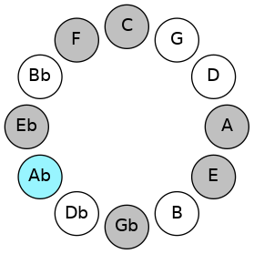 |  |
## Relative Modes

| Number | Mode | Tonic | Notes | Illustration |
|--------|------|-------|-------|--------------|
| [1939](https://ianring.com/musictheory/scales/1939) | [Dathian](ModeDathian.md) | G# | G#, A, B#, C###, D##, E#, F#, G# |  |
| [1939](https://ianring.com/musictheory/scales/1939) | [Dathian](ModeDathian.md) | Ab | Ab, Bbb, C, D#, E, F, Gb, Ab |  |
| [3017](https://ianring.com/musictheory/scales/3017) | [Gacrian](ModeGacrian.md) | A | A, B#, C###, D##, E#, F#, G#, A |  |
| [889](https://ianring.com/musictheory/scales/889) | [Borian](ModeBorian.md) | C | C, D#, E, F, Gb, Ab, Bbb, C |  |
| [623](https://ianring.com/musictheory/scales/623) | [Sycrian](ModeSycrian.md) | D# | D#, E, F, Gb, Ab, Bbb, C, D# |  |
| [623](https://ianring.com/musictheory/scales/623) | [Sycrian](ModeSycrian.md) | Eb | Eb, Fb, Gbb, Abbb, Bbbb, Cbbb, Dbb, Eb |  |
| [2359](https://ianring.com/musictheory/scales/2359) | [Gadian](ModeGadian.md) | E | E, F, Gb, Ab, Bbb, C, D#, E |  |
| [3227](https://ianring.com/musictheory/scales/3227) | [Aeolocrian](ModeAeolocrian.md) | F | F, Gb, Ab, Bbb, C, D#, E, F |  |
| [3661](https://ianring.com/musictheory/scales/3661) | [Mixodorian](ModeMixodorian.md) | F# | F#, G#, A, B#, C###, D##, E#, F# |  |
| [3661](https://ianring.com/musictheory/scales/3661) | [Mixodorian](ModeMixodorian.md) | Gb | Gb, Ab, Bbb, C, D#, E, F, Gb |  |
## Relative Brightness

| Number | Mode | Tonic | Notes | Circle Of Fifth | Chromatic Circle |
|--------|------|-------|-------|-----------------|------------------|
| [1939](https://ianring.com/musictheory/scales/1939) | [Dathian](ModeDathian.md) | G# | G#, A, B#, C###, D##, E#, F#, G# |  | 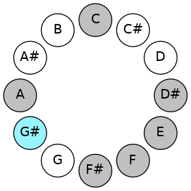 |
| [1939](https://ianring.com/musictheory/scales/1939) | [Dathian](ModeDathian.md) | Ab | Ab, Bbb, C, D#, E, F, Gb, Ab |  |  |
| [3017](https://ianring.com/musictheory/scales/3017) | [Gacrian](ModeGacrian.md) | A | A, B#, C###, D##, E#, F#, G#, A | 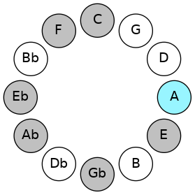 | 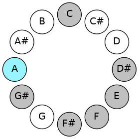 |
| [889](https://ianring.com/musictheory/scales/889) | [Borian](ModeBorian.md) | C | C, D#, E, F, Gb, Ab, Bbb, C | 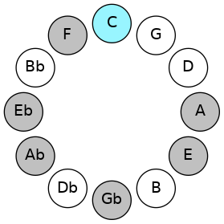 | 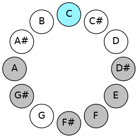 |
| [623](https://ianring.com/musictheory/scales/623) | [Sycrian](ModeSycrian.md) | D# | D#, E, F, Gb, Ab, Bbb, C, D# | 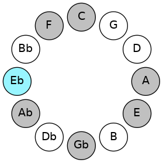 | 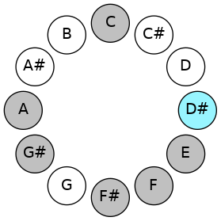 |
| [623](https://ianring.com/musictheory/scales/623) | [Sycrian](ModeSycrian.md) | Eb | Eb, Fb, Gbb, Abbb, Bbbb, Cbbb, Dbb, Eb |  |  |
| [2359](https://ianring.com/musictheory/scales/2359) | [Gadian](ModeGadian.md) | E | E, F, Gb, Ab, Bbb, C, D#, E | 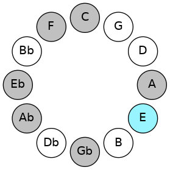 | 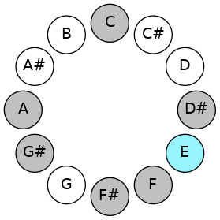 |
| [3227](https://ianring.com/musictheory/scales/3227) | [Aeolocrian](ModeAeolocrian.md) | F | F, Gb, Ab, Bbb, C, D#, E, F | 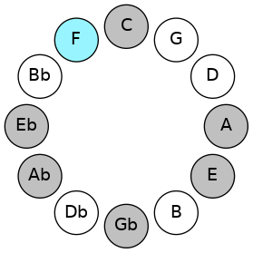 | 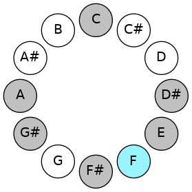 |
| [3661](https://ianring.com/musictheory/scales/3661) | [Mixodorian](ModeMixodorian.md) | F# | F#, G#, A, B#, C###, D##, E#, F# |  |  |
| [3661](https://ianring.com/musictheory/scales/3661) | [Mixodorian](ModeMixodorian.md) | Gb | Gb, Ab, Bbb, C, D#, E, F, Gb | 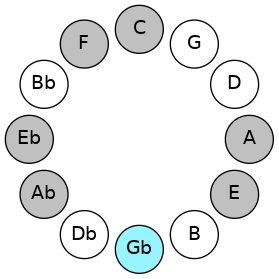 | 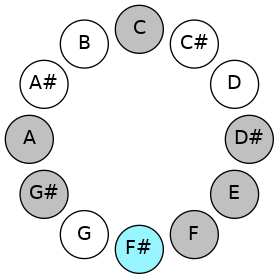 |

## Chords

### Ab

| Number | Root | Name | Notes | Illustration | Audio |
|--------|------|------|-------|--------------|-------|
| 264 | Ab | [G#5](ChordGSharpPowerChord.md) | G#, D# |  | [midi](ChordGSharpPowerChordRootPosition.mid) |
| 264 | Ab | [Ab5](ChordAFlatPowerChord.md) | Ab, Eb |  | [midi](ChordAFlatPowerChordRootPosition.mid) |
| 776 | Ab | [G#phryg](ChordGSharpPhrygian.md) | G#, A, D# |  | [midi](ChordGSharpPhrygianRootPosition.mid) |
| 776 | Ab | [Abphryg](ChordAFlatPhrygian.md) | Ab, Bbb, Eb |  | [midi](ChordAFlatPhrygianRootPosition.mid) |
| 265 | Ab | [G#M](ChordGSharpMajor.md) | G#, B#, D# |  | [midi](ChordGSharpMajorRootPosition.mid) |
| 265 | Ab | [AbM](ChordAFlatMajor.md) | Ab, C, Eb |  | [midi](ChordAFlatMajorRootPosition.mid) |
| 273 | Ab | [G#+](ChordGSharpAugmented.md) | G#, B#, D## |  | [midi](ChordGSharpAugmentedRootPosition.mid) |
| 273 | Ab | [G#+7](ChordGSharpAugmentedAugmentedSeventh.md) | G#, B#, D##, F### |  | [midi](ChordGSharpAugmentedAugmentedSeventhRootPosition.mid) |
| 273 | Ab | [Ab+](ChordAFlatAugmented.md) | Ab, C, E |  | [midi](ChordAFlatAugmentedRootPosition.mid) |
| 273 | Ab | [Ab+7](ChordAFlatAugmentedAugmentedSeventh.md) | Ab, C, E, G# |  | [midi](ChordAFlatAugmentedAugmentedSeventhRootPosition.mid) |
| 289 | Ab | [G#M##5](ChordGSharpMajorDoubleSharpFifth.md) | G#, B#, E# |  | [midi](ChordGSharpMajorDoubleSharpFifthRootPosition.mid) |
| 289 | Ab | [AbM##5](ChordAFlatMajorDoubleSharpFifth.md) | Ab, C, F |  | [midi](ChordAFlatMajorDoubleSharpFifthRootPosition.mid) |
| 297 | Ab | [G#M6](ChordGSharpMajorSixth.md) | G#, B#, D#, E# |  | [midi](ChordGSharpMajorSixthRootPosition.mid) |
| 297 | Ab | [AbM6](ChordAFlatMajorSixth.md) | Ab, C, Eb, F |  | [midi](ChordAFlatMajorSixthRootPosition.mid) |
| 809 | Ab | [G#M6(addb9)](ChordGSharpMajorSixthAddFlatNinth.md) | G#, B#, D#, E#, A |  | [midi](ChordGSharpMajorSixthAddFlatNinthRootPosition.mid) |
| 809 | Ab | [AbM6(addb9)](ChordAFlatMajorSixthAddFlatNinth.md) | Ab, C, Eb, F, Bbb |  | [midi](ChordAFlatMajorSixthAddFlatNinthRootPosition.mid) |
| 329 | Ab | [G#7](ChordGSharpDominantSeventh.md) | G#, B#, D#, F# |  | [midi](ChordGSharpDominantSeventhRootPosition.mid) |
| 329 | Ab | [Ab7](ChordAFlatDominantSeventh.md) | Ab, C, Eb, Gb |  | [midi](ChordAFlatDominantSeventhRootPosition.mid) |
| 841 | Ab | [G#7b9](ChordGSharpDominantSeventhFlatNinth.md) | G#, B#, D#, F#, A |  | [midi](ChordGSharpDominantSeventhFlatNinthRootPosition.mid) |
| 841 | Ab | [Ab7b9](ChordAFlatDominantSeventhFlatNinth.md) | Ab, C, Eb, Gb, Bbb |  | [midi](ChordAFlatDominantSeventhFlatNinthRootPosition.mid) |
| 849 | Ab | [G#7#5b9](ChordGSharpDominantSeventhSharpFifthFlatNinth.md) | G#, B#, D##, F#, A |  | [midi](ChordGSharpDominantSeventhSharpFifthFlatNinthRootPosition.mid) |
| 849 | Ab | [Ab7#5b9](ChordAFlatDominantSeventhSharpFifthFlatNinth.md) | Ab, C, E, Gb, Bbb |  | [midi](ChordAFlatDominantSeventhSharpFifthFlatNinthRootPosition.mid) |
| 857 | Ab | [G#7b9b13](ChordGSharpDominantSeventhFlatNinthFlatThirteenth.md) | G#, B#, D#, F#, A, E |  | [midi](ChordGSharpDominantSeventhFlatNinthFlatThirteenthRootPosition.mid) |
| 857 | Ab | [Ab7b9b13](ChordAFlatDominantSeventhFlatNinthFlatThirteenth.md) | Ab, C, Eb, Gb, Bbb, Fb |  | [midi](ChordAFlatDominantSeventhFlatNinthFlatThirteenthRootPosition.mid) |
| 361 | Ab | [G#7add13](ChordGSharpDominantSeventhAddThirteenth.md) | G#, B#, D#, F#, E# |  | [midi](ChordGSharpDominantSeventhAddThirteenthRootPosition.mid) |
| 361 | Ab | [Ab7add13](ChordAFlatDominantSeventhAddThirteenth.md) | Ab, C, Eb, Gb, F |  | [midi](ChordAFlatDominantSeventhAddThirteenthRootPosition.mid) |

### Bbb

| Number | Root | Name | Notes | Illustration | Audio |
|--------|------|------|-------|--------------|-------|
| 521 | Bbb | [Ao](ChordANaturalDiminished.md) | A, C, Eb |  | [midi](ChordANaturalDiminishedRootPosition.mid) |
| 528 | Bbb | [A5](ChordANaturalPowerChord.md) | A, E |  | [midi](ChordANaturalPowerChordRootPosition.mid) |
| 529 | Bbb | [Am](ChordANaturalMinor.md) | A, C, E |  | [midi](ChordANaturalMinorRootPosition.mid) |
| 529 | Bbb | [Am(add(#9))](ChordANaturalMinorAddSharpNinth.md) | A, C, E, B# |  | [midi](ChordANaturalMinorAddSharpNinthRootPosition.mid) |
| 536 | Bbb | [Alyd](ChordANaturalLydian.md) | A, D#, E |  | [midi](ChordANaturalLydianRootPosition.mid) |
| 537 | Bbb | [Am(add(#4))](ChordANaturalMinorAddSharpFourth.md) | A, C, D#, E |  | [midi](ChordANaturalMinorAddSharpFourthRootPosition.mid) |
| 545 | Bbb | [Am#5](ChordANaturalMinorSharpFifth.md) | A, C, F |  | [midi](ChordANaturalMinorSharpFifthRootPosition.mid) |
| 585 | Bbb | [Ao7](ChordANaturalFullDiminishedSeventh.md) | A, C, Eb, Gb |  | [midi](ChordANaturalFullDiminishedSeventhRootPosition.mid) |
| 593 | Bbb | [Am6](ChordANaturalMinorSixth.md) | A, C, E, F# |  | [midi](ChordANaturalMinorSixthRootPosition.mid) |
| 777 | Bbb | [AoM7](ChordANaturalDiminishedMajorSeventh.md) | A, C, Eb, G# |  | [midi](ChordANaturalDiminishedMajorSeventhRootPosition.mid) |
| 785 | Bbb | [Am(M7)](ChordANaturalMinorMajorSeventh.md) | A, C, E, G# |  | [midi](ChordANaturalMinorMajorSeventhRootPosition.mid) |
| 792 | Bbb | [Alyd(M7)](ChordANaturalLydianMajorSeventh.md) | A, D#, E, G# |  | [midi](ChordANaturalLydianMajorSeventhRootPosition.mid) |
| 849 | Bbb | [Am(M7)add13](ChordANaturalMinorMajorSeventhAddThirteenth.md) | A, C, E, G#, F# |  | [midi](ChordANaturalMinorMajorSeventhAddThirteenthRootPosition.mid) |

### C

| Number | Root | Name | Notes | Illustration | Audio |
|--------|------|------|-------|--------------|-------|
| 41 | C | [Cmbb5](ChordCNaturalMinorDoubleFlatFifth.md) | C, Eb, F |  | [midi](ChordCNaturalMinorDoubleFlatFifthRootPosition.mid) |
| 73 | C | [Co](ChordCNaturalDiminished.md) | C, Eb, Gb |  | [midi](ChordCNaturalDiminishedRootPosition.mid) |
| 81 | C | [CMb5](ChordCNaturalMajorFlatFifth.md) | C, E, Gb |  | [midi](ChordCNaturalMajorFlatFifthRootPosition.mid) |
| 97 | C | [Csus4b5](ChordCNaturalSuspendedFourthFlatFifth.md) | C, F, Gb |  | [midi](ChordCNaturalSuspendedFourthFlatFifthRootPosition.mid) |
| 265 | C | [Cm#5](ChordCNaturalMinorSharpFifth.md) | C, Eb, Ab |  | [midi](ChordCNaturalMinorSharpFifthRootPosition.mid) |
| 273 | C | [C+](ChordCNaturalAugmented.md) | C, E, G# |  | [midi](ChordCNaturalAugmentedRootPosition.mid) |
| 273 | C | [C+7](ChordCNaturalAugmentedAugmentedSeventh.md) | C, E, G#, B# |  | [midi](ChordCNaturalAugmentedAugmentedSeventhRootPosition.mid) |
| 289 | C | [Csus4#5](ChordCNaturalSuspendedFourthSharpFifth.md) | C, F, G# |  | [midi](ChordCNaturalSuspendedFourthSharpFifthRootPosition.mid) |
| 529 | C | [CM##5](ChordCNaturalMajorDoubleSharpFifth.md) | C, E, A |  | [midi](ChordCNaturalMajorDoubleSharpFifthRootPosition.mid) |
| 545 | C | [Csus4##5](ChordCNaturalSuspendedFourthDoubleSharpFifth.md) | C, F, A |  | [midi](ChordCNaturalSuspendedFourthDoubleSharpFifthRootPosition.mid) |
| 585 | C | [Co7](ChordCNaturalFullDiminishedSeventh.md) | C, Eb, Gb, Bbb |  | [midi](ChordCNaturalFullDiminishedSeventhRootPosition.mid) |
| 593 | C | [CM6b5](ChordCNaturalMajorSixthFlatFifth.md) | C, E, Gb, A |  | [midi](ChordCNaturalMajorSixthFlatFifthRootPosition.mid) |

### D#

| Number | Root | Name | Notes | Illustration | Audio |
|--------|------|------|-------|--------------|-------|
| 296 | D# | [D#sus2bb5](ChordDSharpSuspendedSecondDoubleFlatFifth.md) | D#, E#, G# |  | [midi](ChordDSharpSuspendedSecondDoubleFlatFifthRootPosition.mid) |
| 296 | D# | [Ebsus2bb5](ChordEFlatSuspendedSecondDoubleFlatFifth.md) | Eb, F, Ab |  | [midi](ChordEFlatSuspendedSecondDoubleFlatFifthRootPosition.mid) |
| 328 | D# | [D#mbb5](ChordDSharpMinorDoubleFlatFifth.md) | D#, F#, G# |  | [midi](ChordDSharpMinorDoubleFlatFifthRootPosition.mid) |
| 328 | D# | [Ebmbb5](ChordEFlatMinorDoubleFlatFifth.md) | Eb, Gb, Ab |  | [midi](ChordEFlatMinorDoubleFlatFifthRootPosition.mid) |
| 536 | D# | [D#loc](ChordDSharpLocrian.md) | D#, E, A |  | [midi](ChordDSharpLocrianRootPosition.mid) |
| 536 | D# | [Ebloc](ChordEFlatLocrian.md) | Eb, Fb, Bbb |  | [midi](ChordEFlatLocrianRootPosition.mid) |
| 552 | D# | [D#](ChordDSharpDiminishedFlatThird.md) | D#, F, A |  | [midi](ChordDSharpDiminishedFlatThirdRootPosition.mid) |
| 552 | D# | [D#sus2b5](ChordDSharpSuspendedSecondFlatFifth.md) | D#, E#, A |  | [midi](ChordDSharpSuspendedSecondFlatFifthRootPosition.mid) |
| 552 | D# | [Eb](ChordEFlatDiminishedFlatThird.md) | Eb, Gbb, Bbb |  | [midi](ChordEFlatDiminishedFlatThirdRootPosition.mid) |
| 552 | D# | [Ebsus2b5](ChordEFlatSuspendedSecondFlatFifth.md) | Eb, F, Bbb |  | [midi](ChordEFlatSuspendedSecondFlatFifthRootPosition.mid) |
| 584 | D# | [D#o](ChordDSharpDiminished.md) | D#, F#, A |  | [midi](ChordDSharpDiminishedRootPosition.mid) |
| 584 | D# | [Ebo](ChordEFlatDiminished.md) | Eb, Gb, Bbb |  | [midi](ChordEFlatDiminishedRootPosition.mid) |
| 776 | D# | [D#sus4b5](ChordDSharpSuspendedFourthFlatFifth.md) | D#, G#, A |  | [midi](ChordDSharpSuspendedFourthFlatFifthRootPosition.mid) |
| 776 | D# | [Ebsus4b5](ChordEFlatSuspendedFourthFlatFifth.md) | Eb, Ab, Bbb |  | [midi](ChordEFlatSuspendedFourthFlatFifthRootPosition.mid) |
| 265 | D# | [D#sus4##5](ChordDSharpSuspendedFourthDoubleSharpFifth.md) | D#, G#, B# |  | [midi](ChordDSharpSuspendedFourthDoubleSharpFifthRootPosition.mid) |
| 265 | D# | [Ebsus4##5](ChordEFlatSuspendedFourthDoubleSharpFifth.md) | Eb, Ab, C |  | [midi](ChordEFlatSuspendedFourthDoubleSharpFifthRootPosition.mid) |
| 297 | D# | [D#M6sus2bb5](ChordDSharpMajorSixthSuspendedSecondDoubleFlatFifth.md) | D#, E#, G#, B# |  | [midi](ChordDSharpMajorSixthSuspendedSecondDoubleFlatFifthRootPosition.mid) |
| 297 | D# | [EbM6sus2bb5](ChordEFlatMajorSixthSuspendedSecondDoubleFlatFifth.md) | Eb, F, Ab, C |  | [midi](ChordEFlatMajorSixthSuspendedSecondDoubleFlatFifthRootPosition.mid) |
| 553 | D# | [D#M6sus2b5](ChordDSharpMajorSixthSuspendedSecondFlatFifth.md) | D#, E#, A, B# |  | [midi](ChordDSharpMajorSixthSuspendedSecondFlatFifthRootPosition.mid) |
| 553 | D# | [EbM6sus2b5](ChordEFlatMajorSixthSuspendedSecondFlatFifth.md) | Eb, F, Bbb, C |  | [midi](ChordEFlatMajorSixthSuspendedSecondFlatFifthRootPosition.mid) |
| 585 | D# | [D#o7](ChordDSharpFullDiminishedSeventh.md) | D#, F#, A, C |  | [midi](ChordDSharpFullDiminishedSeventhRootPosition.mid) |
| 585 | D# | [Ebo7](ChordEFlatFullDiminishedSeventh.md) | Eb, Gb, Bbb, Dbb |  | [midi](ChordEFlatFullDiminishedSeventhRootPosition.mid) |

### E

| Number | Root | Name | Notes | Illustration | Audio |
|--------|------|------|-------|--------------|-------|
| 592 | E | [Esus2bb5](ChordENaturalSuspendedSecondDoubleFlatFifth.md) | E, F#, A |  | [midi](ChordENaturalSuspendedSecondDoubleFlatFifthRootPosition.mid) |
| 81 | E | [Esus2#5](ChordENaturalSuspendedSecondSharpFifth.md) | E, F#, B# |  | [midi](ChordENaturalSuspendedSecondSharpFifthRootPosition.mid) |
| 273 | E | [E+](ChordENaturalAugmented.md) | E, G#, B# |  | [midi](ChordENaturalAugmentedRootPosition.mid) |
| 273 | E | [E+7](ChordENaturalAugmentedAugmentedSeventh.md) | E, G#, B#, D## |  | [midi](ChordENaturalAugmentedAugmentedSeventhRootPosition.mid) |
| 529 | E | [Esus4#5](ChordENaturalSuspendedFourthSharpFifth.md) | E, A, B# |  | [midi](ChordENaturalSuspendedFourthSharpFifthRootPosition.mid) |
| 536 | E | [EQ+](ChordENaturalQuartalAugmented.md) | E, A, D# |  | [midi](ChordENaturalQuartalAugmentedRootPosition.mid) |
| 281 | E | [E+(M7)](ChordENaturalAugmentedMajorSeventh.md) | E, G#, B#, D# |  | [midi](ChordENaturalAugmentedMajorSeventhRootPosition.mid) |
| 537 | E | [EM7(sus4)#5](ChordENaturalMajorSeventhSuspendedFourthSharpFifth.md) | E, A, B#, D# |  | [midi](ChordENaturalMajorSeventhSuspendedFourthSharpFifthRootPosition.mid) |

### F

| Number | Root | Name | Notes | Illustration | Audio |
|--------|------|------|-------|--------------|-------|
| 33 | F | [F5](ChordFNaturalPowerChord.md) | F, C |  | [midi](ChordFNaturalPowerChordRootPosition.mid) |
| 97 | F | [Fphryg](ChordFNaturalPhrygian.md) | F, Gb, C |  | [midi](ChordFNaturalPhrygianRootPosition.mid) |
| 289 | F | [Fm](ChordFNaturalMinor.md) | F, Ab, C |  | [midi](ChordFNaturalMinorRootPosition.mid) |
| 289 | F | [Fm(add(#9))](ChordFNaturalMinorAddSharpNinth.md) | F, Ab, C, G# |  | [midi](ChordFNaturalMinorAddSharpNinthRootPosition.mid) |
| 545 | F | [FM](ChordFNaturalMajor.md) | F, A, C |  | [midi](ChordFNaturalMajorRootPosition.mid) |
| 801 | F | [FM(add(#9))](ChordFNaturalMajorAddSharpNinth.md) | F, A, C, G# |  | [midi](ChordFNaturalMajorAddSharpNinthRootPosition.mid) |
| 297 | F | [Fm7](ChordFNaturalMinorSeventh.md) | F, Ab, C, Eb |  | [midi](ChordFNaturalMinorSeventhRootPosition.mid) |
| 361 | F | [Fm7b9](ChordFNaturalMinorSeventhFlatNinth.md) | F, Ab, C, Eb, Gb |  | [midi](ChordFNaturalMinorSeventhFlatNinthRootPosition.mid) |
| 553 | F | [F7](ChordFNaturalDominantSeventh.md) | F, A, C, Eb |  | [midi](ChordFNaturalDominantSeventhRootPosition.mid) |
| 617 | F | [F7b9](ChordFNaturalDominantSeventhFlatNinth.md) | F, A, C, Eb, Gb |  | [midi](ChordFNaturalDominantSeventhFlatNinthRootPosition.mid) |
| 809 | F | [F7#9](ChordFNaturalDominantSeventhSharpNinth.md) | F, A, C, Eb, G# |  | [midi](ChordFNaturalDominantSeventhSharpNinthRootPosition.mid) |
| 113 | F | [Fphryg+7](ChordFNaturalPhrygianAddSeventh.md) | F, Gb, C, E |  | [midi](ChordFNaturalPhrygianAddSeventhRootPosition.mid) |
| 305 | F | [Fm(M7)](ChordFNaturalMinorMajorSeventh.md) | F, Ab, C, E |  | [midi](ChordFNaturalMinorMajorSeventhRootPosition.mid) |
| 561 | F | [FM7](ChordFNaturalMajorSeventh.md) | F, A, C, E |  | [midi](ChordFNaturalMajorSeventhRootPosition.mid) |

### Gb

| Number | Root | Name | Notes | Illustration | Audio |
|--------|------|------|-------|--------------|-------|
| 321 | Gb | [F#](ChordFSharpDiminishedFlatThird.md) | F#, Ab, C |  | [midi](ChordFSharpDiminishedFlatThirdRootPosition.mid) |
| 321 | Gb | [F#sus2b5](ChordFSharpSuspendedSecondFlatFifth.md) | F#, G#, C |  | [midi](ChordFSharpSuspendedSecondFlatFifthRootPosition.mid) |
| 321 | Gb | [Gb](ChordGFlatDiminishedFlatThird.md) | Gb, Bbbb, Dbb |  | [midi](ChordGFlatDiminishedFlatThirdRootPosition.mid) |
| 321 | Gb | [Gbsus2b5](ChordGFlatSuspendedSecondFlatFifth.md) | Gb, Ab, Dbb |  | [midi](ChordGFlatSuspendedSecondFlatFifthRootPosition.mid) |
| 577 | Gb | [F#o](ChordFSharpDiminished.md) | F#, A, C |  | [midi](ChordFSharpDiminishedRootPosition.mid) |
| 577 | Gb | [Gbo](ChordGFlatDiminished.md) | Gb, Bbb, Dbb |  | [midi](ChordGFlatDiminishedRootPosition.mid) |
| 329 | Gb | [F#M6sus2b5](ChordFSharpMajorSixthSuspendedSecondFlatFifth.md) | F#, G#, C, D# |  | [midi](ChordFSharpMajorSixthSuspendedSecondFlatFifthRootPosition.mid) |
| 329 | Gb | [GbM6sus2b5](ChordGFlatMajorSixthSuspendedSecondFlatFifth.md) | Gb, Ab, Dbb, Eb |  | [midi](ChordGFlatMajorSixthSuspendedSecondFlatFifthRootPosition.mid) |
| 585 | Gb | [F#o7](ChordFSharpFullDiminishedSeventh.md) | F#, A, C, Eb |  | [midi](ChordFSharpFullDiminishedSeventhRootPosition.mid) |
| 585 | Gb | [Gbo7](ChordGFlatFullDiminishedSeventh.md) | Gb, Bbb, Dbb, Fbb |  | [midi](ChordGFlatFullDiminishedSeventhRootPosition.mid) |
| 593 | Gb | [F#ø7](ChordFSharpHalfDiminishedSeventh.md) | F#, A, C, E |  | [midi](ChordFSharpHalfDiminishedSeventhRootPosition.mid) |
| 593 | Gb | [Gbø7](ChordGFlatHalfDiminishedSeventh.md) | Gb, Bbb, Dbb, Fb |  | [midi](ChordGFlatHalfDiminishedSeventhRootPosition.mid) |
| 609 | Gb | [F#oM7](ChordFSharpDiminishedMajorSeventh.md) | F#, A, C, E# |  | [midi](ChordFSharpDiminishedMajorSeventhRootPosition.mid) |
| 609 | Gb | [GboM7](ChordGFlatDiminishedMajorSeventh.md) | Gb, Bbb, Dbb, F |  | [midi](ChordGFlatDiminishedMajorSeventhRootPosition.mid) |

