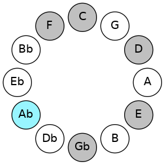
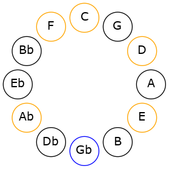

# Mode AFlatDathimic

## Links

- [Documentation](README.md)
- [Scales Index](Scales.md)
- [Modes Index](Modes.md)
- [Chords Index](Chords.md)

## Scale

[Dathimic](ScaleDathimic.md)

## Mode

[AFlatDathimic](ModeAFlatDathimic.md)

## Tonic

Ab

## Signature

[CNaturalMajor]

## Interval Pattern

4, 2, 2, 1, 1, 2

## Chord Pattern

iii⁰

## Perfection

 - 1 Perfect Notes

 - 5 Imperfect Notes

## Notes

- Ab (Imperfect)
- B# (Imperfect)
- C## (Imperfect)
- D## (Imperfect)
- E#
- F# (Imperfect)
- Ab (Imperfect)

## Illustration

## Diagram

## Relative Modes

| Number | Mode | Tonic | Notes | Illustration |
|--------|------|-------|-------|--------------|
| [1873](https://ianring.com/musictheory/scales/1873) | [Dathimic](ModeDathimic.md) | Ab | Ab, B#, C##, D##, E#, F#, Ab |  |
| [3397](https://ianring.com/musictheory/scales/3397) | [Sydimic](ModeSydimic.md) | F# | F#, G#, A###, B###, D##, E#, F# |  |
## Relative Brightness

| Number | Mode | Tonic | Notes | Illustration |
|--------|------|-------|-------|--------------|
| [1873](https://ianring.com/musictheory/scales/1873) | [Dathimic](ModeDathimic.md) | Ab | Ab, B#, C##, D##, E#, F#, Ab |  |
| [3397](https://ianring.com/musictheory/scales/3397) | [Sydimic](ModeSydimic.md) | F# | F#, G#, A###, B###, D##, E#, F# |  |

## Chords

### Ab

| Number | Root | Name | Notes | Illustration | Audio |
|--------|------|------|-------|--------------|-------|
| 261 | Ab | [AbMb5](ChordAFlatMajorFlatFifth.md) | Ab, C, Ebb |  | [midi](ChordAFlatMajorFlatFifthRootPosition.mid) |
| 273 | Ab | [Ab+](ChordAFlatAugmented.md) | Ab, C, E |  | [midi](ChordAFlatAugmentedRootPosition.mid) |
| 273 | Ab | [Ab+7](ChordAFlatAugmentedAugmentedSeventh.md) | Ab, C, E, G# |  | [midi](ChordAFlatAugmentedAugmentedSeventhRootPosition.mid) |
| 289 | Ab | [AbM##5](ChordAFlatMajorDoubleSharpFifth.md) | Ab, C, F |  | [midi](ChordAFlatMajorDoubleSharpFifthRootPosition.mid) |
| 293 | Ab | [AbM6b5](ChordAFlatMajorSixthFlatFifth.md) | Ab, C, Ebb, F |  | [midi](ChordAFlatMajorSixthFlatFifthRootPosition.mid) |
| 325 | Ab | [Ab7b5](ChordAFlatDominantSeventhFlatFifth.md) | Ab, C, Ebb, Gb |  | [midi](ChordAFlatDominantSeventhFlatFifthRootPosition.mid) |

### B#

| Number | Root | Name | Notes | Illustration | Audio |
|--------|------|------|-------|--------------|-------|

### C##

| Number | Root | Name | Notes | Illustration | Audio |
|--------|------|------|-------|--------------|-------|

### D##

| Number | Root | Name | Notes | Illustration | Audio |
|--------|------|------|-------|--------------|-------|

### E#

| Number | Root | Name | Notes | Illustration | Audio |
|--------|------|------|-------|--------------|-------|

### F#

| Number | Root | Name | Notes | Illustration | Audio |
|--------|------|------|-------|--------------|-------|
| 321 | F# | [F#sus2b5](ChordFSharpSuspendedSecondFlatFifth.md) | F#, G#, C |  | [midi](ChordFSharpSuspendedSecondFlatFifthRootPosition.mid) |
| 324 | F# | [F#sus2#5](ChordFSharpSuspendedSecondSharpFifth.md) | F#, G#, C## |  | [midi](ChordFSharpSuspendedSecondSharpFifthRootPosition.mid) |
| 325 | F# | [F#sus2b5add(#5)](ChordFSharpSuspendedSecondFlatFifthAddSharpFifth.md) | F#, G#, C, C## |  | [midi](ChordFSharpSuspendedSecondFlatFifthAddSharpFifthRootPosition.mid) |

