# Mode AFlatDodian

## Links

- [Documentation](README.md)
- [Scales Index](Scales.md)
- [Modes Index](Modes.md)
- [Chords Index](Chords.md)

## Scale

[Thacrian](ScaleThacrian.md)

## Mode

[AFlatDodian](ModeAFlatDodian.md)

## Tonic

Ab

## Signature

[CNaturalMajor]

## Transposition

1, 1, 2, 2, 1, 1, 4

## Chord Pattern

i⁰b3, ii⁰, IIIb5

## Perfection

 - 4 Perfect Notes

 - 3 Imperfect Notes

## Notes

- Ab
- Bbb
- Cbb (Imperfect)
- Dbb (Imperfect)
- Ebb
- Fbb
- Gbbb (Imperfect)
- Ab

## Illustration

## Diagram

| Circle of Fifth | Chromatic Circle |
|-----------------|------------------|
| 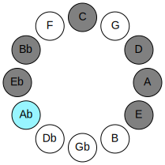 | 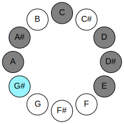 |
## Relative Modes

| Number | Mode | Tonic | Notes | Illustration |
|--------|------|-------|-------|--------------|
| [471](https://ianring.com/musictheory/scales/471) | [Dodian](ModeDodian.md) | G# | G#, A, Bb, C, D, Eb, Fb, G# |  |
| [471](https://ianring.com/musictheory/scales/471) | [Dodian](ModeDodian.md) | Ab | Ab, Bbb, Cbb, Dbb, Ebb, Fbb, Gbbb, Ab |  |
| [2283](https://ianring.com/musictheory/scales/2283) | [Aeolyptian](ModeAeolyptian.md) | A | A, Bb, C, D, Eb, Fb, G#, A |  |
| [3189](https://ianring.com/musictheory/scales/3189) | [Aeolonian](ModeAeolonian.md) | A# | A#, B#, C##, D#, E, F###, G##, A# |  |
| [3189](https://ianring.com/musictheory/scales/3189) | [Aeolonian](ModeAeolonian.md) | Bb | Bb, C, D, Eb, Fb, G#, A, Bb |  |
| [1821](https://ianring.com/musictheory/scales/1821) | [Aeradian](ModeAeradian.md) | C | C, D, Eb, Fb, G#, A, Bb, C |  |
| [1479](https://ianring.com/musictheory/scales/1479) | [Aeolagian](ModeAeolagian.md) | D | D, Eb, Fb, G#, A, Bb, C, D |  |
| [2787](https://ianring.com/musictheory/scales/2787) | [Zyrian](ModeZyrian.md) | D# | D#, E, F###, G##, A#, B#, C##, D# |  |
| [2787](https://ianring.com/musictheory/scales/2787) | [Zyrian](ModeZyrian.md) | Eb | Eb, Fb, G#, A, Bb, C, D, Eb |  |
| [3441](https://ianring.com/musictheory/scales/3441) | [Thacrian](ModeThacrian.md) | E | E, F###, G##, A#, B#, C##, D#, E |  |
## Relative Brightness

| Number | Mode | Tonic | Notes | Circle Of Fifth | Chromatic Circle |
|--------|------|-------|-------|-----------------|------------------|
| [471](https://ianring.com/musictheory/scales/471) | [Dodian](ModeDodian.md) | G# | G#, A, Bb, C, D, Eb, Fb, G# |  |  |
| [471](https://ianring.com/musictheory/scales/471) | [Dodian](ModeDodian.md) | Ab | Ab, Bbb, Cbb, Dbb, Ebb, Fbb, Gbbb, Ab |  |  |
| [2283](https://ianring.com/musictheory/scales/2283) | [Aeolyptian](ModeAeolyptian.md) | A | A, Bb, C, D, Eb, Fb, G#, A | 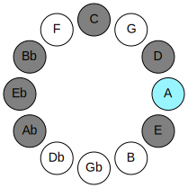 | 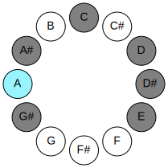 |
| [3189](https://ianring.com/musictheory/scales/3189) | [Aeolonian](ModeAeolonian.md) | A# | A#, B#, C##, D#, E, F###, G##, A# |  | 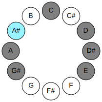 |
| [3189](https://ianring.com/musictheory/scales/3189) | [Aeolonian](ModeAeolonian.md) | Bb | Bb, C, D, Eb, Fb, G#, A, Bb | 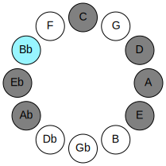 |  |
| [1821](https://ianring.com/musictheory/scales/1821) | [Aeradian](ModeAeradian.md) | C | C, D, Eb, Fb, G#, A, Bb, C | 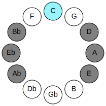 | 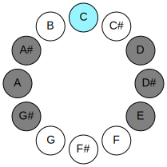 |
| [1479](https://ianring.com/musictheory/scales/1479) | [Aeolagian](ModeAeolagian.md) | D | D, Eb, Fb, G#, A, Bb, C, D | 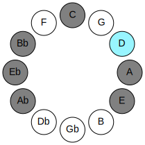 | 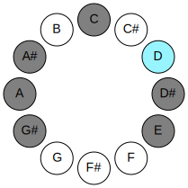 |
| [2787](https://ianring.com/musictheory/scales/2787) | [Zyrian](ModeZyrian.md) | D# | D#, E, F###, G##, A#, B#, C##, D# | 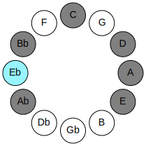 |  |
| [2787](https://ianring.com/musictheory/scales/2787) | [Zyrian](ModeZyrian.md) | Eb | Eb, Fb, G#, A, Bb, C, D, Eb |  | 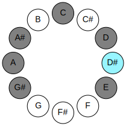 |
| [3441](https://ianring.com/musictheory/scales/3441) | [Thacrian](ModeThacrian.md) | E | E, F###, G##, A#, B#, C##, D#, E | 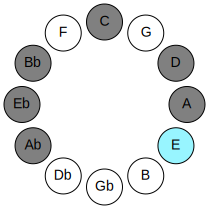 | 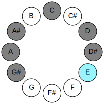 |

## Chords

### Ab

| Number | Root | Name | Notes | Illustration | Audio |
|--------|------|------|-------|--------------|-------|
| 772 | Ab | [G#loc](ChordGSharpLocrian.md) | G#, A, D |  | [midi](ChordGSharpLocrianRootPosition.mid) |
| 772 | Ab | [Abloc](ChordAFlatLocrian.md) | Ab, Bbb, Ebb |  | [midi](ChordAFlatLocrianRootPosition.mid) |
| 1284 | Ab | [G#](ChordGSharpDiminishedFlatThird.md) | G#, Bb, D |  | [midi](ChordGSharpDiminishedFlatThirdRootPosition.mid) |
| 1284 | Ab | [G#sus2b5](ChordGSharpSuspendedSecondFlatFifth.md) | G#, A#, D |  | [midi](ChordGSharpSuspendedSecondFlatFifthRootPosition.mid) |
| 1284 | Ab | [Ab](ChordAFlatDiminishedFlatThird.md) | Ab, Cbb, Ebb |  | [midi](ChordAFlatDiminishedFlatThirdRootPosition.mid) |
| 1284 | Ab | [Absus2b5](ChordAFlatSuspendedSecondFlatFifth.md) | Ab, Bb, Ebb |  | [midi](ChordAFlatSuspendedSecondFlatFifthRootPosition.mid) |
| 261 | Ab | [G#Mb5](ChordGSharpMajorFlatFifth.md) | G#, B#, D |  | [midi](ChordGSharpMajorFlatFifthRootPosition.mid) |
| 261 | Ab | [AbMb5](ChordAFlatMajorFlatFifth.md) | Ab, C, Ebb |  | [midi](ChordAFlatMajorFlatFifthRootPosition.mid) |
| 264 | Ab | [G#5](ChordGSharpPowerChord.md) | G#, D# |  | [midi](ChordGSharpPowerChordRootPosition.mid) |
| 264 | Ab | [Ab5](ChordAFlatPowerChord.md) | Ab, Eb |  | [midi](ChordAFlatPowerChordRootPosition.mid) |
| 776 | Ab | [G#phryg](ChordGSharpPhrygian.md) | G#, A, D# |  | [midi](ChordGSharpPhrygianRootPosition.mid) |
| 776 | Ab | [Abphryg](ChordAFlatPhrygian.md) | Ab, Bbb, Eb |  | [midi](ChordAFlatPhrygianRootPosition.mid) |
| 1288 | Ab | [G#sus2](ChordGSharpSuspendedSecond.md) | G#, A#, D# |  | [midi](ChordGSharpSuspendedSecondRootPosition.mid) |
| 1288 | Ab | [Absus2](ChordAFlatSuspendedSecond.md) | Ab, Bb, Eb |  | [midi](ChordAFlatSuspendedSecondRootPosition.mid) |
| 265 | Ab | [G#M](ChordGSharpMajor.md) | G#, B#, D# |  | [midi](ChordGSharpMajorRootPosition.mid) |
| 265 | Ab | [AbM](ChordAFlatMajor.md) | Ab, C, Eb |  | [midi](ChordAFlatMajorRootPosition.mid) |
| 1289 | Ab | [G#M(add9)](ChordGSharpMajorAddNinth.md) | G#, B#, D#, A# |  | [midi](ChordGSharpMajorAddNinthRootPosition.mid) |
| 1289 | Ab | [AbM(add9)](ChordAFlatMajorAddNinth.md) | Ab, C, Eb, Bb |  | [midi](ChordAFlatMajorAddNinthRootPosition.mid) |
| 268 | Ab | [G#lyd](ChordGSharpLydian.md) | G#, C##, D# |  | [midi](ChordGSharpLydianRootPosition.mid) |
| 268 | Ab | [Ablyd](ChordAFlatLydian.md) | Ab, D, Eb |  | [midi](ChordAFlatLydianRootPosition.mid) |
| 269 | Ab | [G#M(add(#4))](ChordGSharpMajorAddSharpFourth.md) | G#, B#, C##, D# |  | [midi](ChordGSharpMajorAddSharpFourthRootPosition.mid) |
| 269 | Ab | [AbM(add(#4))](ChordAFlatMajorAddSharpFourth.md) | Ab, C, D, Eb |  | [midi](ChordAFlatMajorAddSharpFourthRootPosition.mid) |
| 1296 | Ab | [G#sus2#5](ChordGSharpSuspendedSecondSharpFifth.md) | G#, A#, D## |  | [midi](ChordGSharpSuspendedSecondSharpFifthRootPosition.mid) |
| 1296 | Ab | [Absus2#5](ChordAFlatSuspendedSecondSharpFifth.md) | Ab, Bb, E |  | [midi](ChordAFlatSuspendedSecondSharpFifthRootPosition.mid) |
| 273 | Ab | [G#+](ChordGSharpAugmented.md) | G#, B#, D## |  | [midi](ChordGSharpAugmentedRootPosition.mid) |
| 273 | Ab | [G#+7](ChordGSharpAugmentedAugmentedSeventh.md) | G#, B#, D##, F### |  | [midi](ChordGSharpAugmentedAugmentedSeventhRootPosition.mid) |
| 273 | Ab | [Ab+](ChordAFlatAugmented.md) | Ab, C, E |  | [midi](ChordAFlatAugmentedRootPosition.mid) |
| 273 | Ab | [Ab+7](ChordAFlatAugmentedAugmentedSeventh.md) | Ab, C, E, G# |  | [midi](ChordAFlatAugmentedAugmentedSeventhRootPosition.mid) |
| 1300 | Ab | [G#sus2b5add(#5)](ChordGSharpSuspendedSecondFlatFifthAddSharpFifth.md) | G#, A#, D, D## |  | [midi](ChordGSharpSuspendedSecondFlatFifthAddSharpFifthRootPosition.mid) |
| 1300 | Ab | [Absus2b5add(#5)](ChordAFlatSuspendedSecondFlatFifthAddSharpFifth.md) | Ab, Bb, Ebb, E |  | [midi](ChordAFlatSuspendedSecondFlatFifthAddSharpFifthRootPosition.mid) |

### Bbb

| Number | Root | Name | Notes | Illustration | Audio |
|--------|------|------|-------|--------------|-------|
| 517 | Bbb | [Ambb5](ChordANaturalMinorDoubleFlatFifth.md) | A, C, D |  | [midi](ChordANaturalMinorDoubleFlatFifthRootPosition.mid) |
| 1544 | Bbb | [Aloc](ChordANaturalLocrian.md) | A, Bb, Eb |  | [midi](ChordANaturalLocrianRootPosition.mid) |
| 521 | Bbb | [Ao](ChordANaturalDiminished.md) | A, C, Eb |  | [midi](ChordANaturalDiminishedRootPosition.mid) |
| 524 | Bbb | [Asus4b5](ChordANaturalSuspendedFourthFlatFifth.md) | A, D, Eb |  | [midi](ChordANaturalSuspendedFourthFlatFifthRootPosition.mid) |
| 528 | Bbb | [A5](ChordANaturalPowerChord.md) | A, E |  | [midi](ChordANaturalPowerChordRootPosition.mid) |
| 1552 | Bbb | [Aphryg](ChordANaturalPhrygian.md) | A, Bb, E |  | [midi](ChordANaturalPhrygianRootPosition.mid) |
| 529 | Bbb | [Am](ChordANaturalMinor.md) | A, C, E |  | [midi](ChordANaturalMinorRootPosition.mid) |
| 529 | Bbb | [Am(add(#9))](ChordANaturalMinorAddSharpNinth.md) | A, C, E, B# |  | [midi](ChordANaturalMinorAddSharpNinthRootPosition.mid) |
| 532 | Bbb | [Asus4](ChordANaturalSuspendedFourth.md) | A, D, E |  | [midi](ChordANaturalSuspendedFourthRootPosition.mid) |
| 533 | Bbb | [Am(add11)](ChordANaturalMinorAddEleventh.md) | A, C, E, D |  | [midi](ChordANaturalMinorAddEleventhRootPosition.mid) |
| 533 | Bbb | [Am(add4)](ChordANaturalMinorAddFourth.md) | A, C, D, E |  | [midi](ChordANaturalMinorAddFourthRootPosition.mid) |
| 536 | Bbb | [Alyd](ChordANaturalLydian.md) | A, D#, E |  | [midi](ChordANaturalLydianRootPosition.mid) |
| 537 | Bbb | [Am(add(#4))](ChordANaturalMinorAddSharpFourth.md) | A, C, D#, E |  | [midi](ChordANaturalMinorAddSharpFourthRootPosition.mid) |
| 772 | Bbb | [AQ+](ChordANaturalQuartalAugmented.md) | A, D, G# |  | [midi](ChordANaturalQuartalAugmentedRootPosition.mid) |
| 777 | Bbb | [AoM7](ChordANaturalDiminishedMajorSeventh.md) | A, C, Eb, G# |  | [midi](ChordANaturalDiminishedMajorSeventhRootPosition.mid) |
| 1808 | Bbb | [Aphryg+7](ChordANaturalPhrygianAddSeventh.md) | A, Bb, E, G# |  | [midi](ChordANaturalPhrygianAddSeventhRootPosition.mid) |
| 785 | Bbb | [Am(M7)](ChordANaturalMinorMajorSeventh.md) | A, C, E, G# |  | [midi](ChordANaturalMinorMajorSeventhRootPosition.mid) |
| 788 | Bbb | [AM7(sus4)](ChordANaturalMajorSeventhSuspendedFourth.md) | A, D, E, G# |  | [midi](ChordANaturalMajorSeventhSuspendedFourthRootPosition.mid) |
| 789 | Bbb | [Am(M7)add11](ChordANaturalMinorMajorSeventhAddEleventh.md) | A, C, E, G#, D |  | [midi](ChordANaturalMinorMajorSeventhAddEleventhRootPosition.mid) |
| 792 | Bbb | [Alyd(M7)](ChordANaturalLydianMajorSeventh.md) | A, D#, E, G# |  | [midi](ChordANaturalLydianMajorSeventhRootPosition.mid) |

### Cbb

| Number | Root | Name | Notes | Illustration | Audio |
|--------|------|------|-------|--------------|-------|
| 1033 | Cbb | [A#sus2bb5](ChordASharpSuspendedSecondDoubleFlatFifth.md) | A#, B#, D# |  | [midi](ChordASharpSuspendedSecondDoubleFlatFifthRootPosition.mid) |
| 1033 | Cbb | [Bbsus2bb5](ChordBFlatSuspendedSecondDoubleFlatFifth.md) | Bb, C, Eb |  | [midi](ChordBFlatSuspendedSecondDoubleFlatFifthRootPosition.mid) |
| 1041 | Cbb | [A#](ChordASharpDiminishedFlatThird.md) | A#, C, E |  | [midi](ChordASharpDiminishedFlatThirdRootPosition.mid) |
| 1041 | Cbb | [A#sus2b5](ChordASharpSuspendedSecondFlatFifth.md) | A#, B#, E |  | [midi](ChordASharpSuspendedSecondFlatFifthRootPosition.mid) |
| 1041 | Cbb | [Bb](ChordBFlatDiminishedFlatThird.md) | Bb, Dbb, Fb |  | [midi](ChordBFlatDiminishedFlatThirdRootPosition.mid) |
| 1041 | Cbb | [Bbsus2b5](ChordBFlatSuspendedSecondFlatFifth.md) | Bb, C, Fb |  | [midi](ChordBFlatSuspendedSecondFlatFifthRootPosition.mid) |
| 1044 | Cbb | [A#Mb5](ChordASharpMajorFlatFifth.md) | A#, C##, E |  | [midi](ChordASharpMajorFlatFifthRootPosition.mid) |
| 1044 | Cbb | [BbMb5](ChordBFlatMajorFlatFifth.md) | Bb, D, Fb |  | [midi](ChordBFlatMajorFlatFifthRootPosition.mid) |
| 1048 | Cbb | [A#sus4b5](ChordASharpSuspendedFourthFlatFifth.md) | A#, D#, E |  | [midi](ChordASharpSuspendedFourthFlatFifthRootPosition.mid) |
| 1048 | Cbb | [Bbsus4b5](ChordBFlatSuspendedFourthFlatFifth.md) | Bb, Eb, Fb |  | [midi](ChordBFlatSuspendedFourthFlatFifthRootPosition.mid) |
| 1288 | Cbb | [A#Q](ChordASharpQuartal.md) | A#, D#, G# |  | [midi](ChordASharpQuartalRootPosition.mid) |
| 1288 | Cbb | [BbQ](ChordBFlatQuartal.md) | Bb, Eb, Ab |  | [midi](ChordBFlatQuartalRootPosition.mid) |
| 1300 | Cbb | [A#7b5](ChordASharpDominantSeventhFlatFifth.md) | A#, C##, E, G# |  | [midi](ChordASharpDominantSeventhFlatFifthRootPosition.mid) |
| 1300 | Cbb | [Bb7b5](ChordBFlatDominantSeventhFlatFifth.md) | Bb, D, Fb, Ab |  | [midi](ChordBFlatDominantSeventhFlatFifthRootPosition.mid) |
| 1544 | Cbb | [A#Q+](ChordASharpQuartalAugmented.md) | A#, D#, G## |  | [midi](ChordASharpQuartalAugmentedRootPosition.mid) |
| 1544 | Cbb | [BbQ+](ChordBFlatQuartalAugmented.md) | Bb, Eb, A |  | [midi](ChordBFlatQuartalAugmentedRootPosition.mid) |
| 1556 | Cbb | [A#M7b5](ChordASharpMajorSeventhFlatFifth.md) | A#, C##, E, G## |  | [midi](ChordASharpMajorSeventhFlatFifthRootPosition.mid) |
| 1556 | Cbb | [BbM7b5](ChordBFlatMajorSeventhFlatFifth.md) | Bb, D, Fb, A |  | [midi](ChordBFlatMajorSeventhFlatFifthRootPosition.mid) |

### Dbb

| Number | Root | Name | Notes | Illustration | Audio |
|--------|------|------|-------|--------------|-------|
| 261 | Dbb | [Csus2#5](ChordCNaturalSuspendedSecondSharpFifth.md) | C, D, G# |  | [midi](ChordCNaturalSuspendedSecondSharpFifthRootPosition.mid) |
| 265 | Dbb | [Cm#5](ChordCNaturalMinorSharpFifth.md) | C, Eb, Ab |  | [midi](ChordCNaturalMinorSharpFifthRootPosition.mid) |
| 273 | Dbb | [C+](ChordCNaturalAugmented.md) | C, E, G# |  | [midi](ChordCNaturalAugmentedRootPosition.mid) |
| 273 | Dbb | [C+7](ChordCNaturalAugmentedAugmentedSeventh.md) | C, E, G#, B# |  | [midi](ChordCNaturalAugmentedAugmentedSeventhRootPosition.mid) |
| 529 | Dbb | [CM##5](ChordCNaturalMajorDoubleSharpFifth.md) | C, E, A |  | [midi](ChordCNaturalMajorDoubleSharpFifthRootPosition.mid) |
| 1289 | Dbb | [Cm7#5](ChordCNaturalMinorSeventhSharpFifth.md) | C, Eb, G#, Bb |  | [midi](ChordCNaturalMinorSeventhSharpFifthRootPosition.mid) |

### Ebb

| Number | Root | Name | Notes | Illustration | Audio |
|--------|------|------|-------|--------------|-------|
| 268 | Ebb | [Dloc](ChordDNaturalLocrian.md) | D, Eb, Ab |  | [midi](ChordDNaturalLocrianRootPosition.mid) |
| 276 | Ebb | [D](ChordDNaturalDiminishedFlatThird.md) | D, Fb, Ab |  | [midi](ChordDNaturalDiminishedFlatThirdRootPosition.mid) |
| 276 | Ebb | [Dsus2b5](ChordDNaturalSuspendedSecondFlatFifth.md) | D, E, Ab |  | [midi](ChordDNaturalSuspendedSecondFlatFifthRootPosition.mid) |
| 516 | Ebb | [D5](ChordDNaturalPowerChord.md) | D, A |  | [midi](ChordDNaturalPowerChordRootPosition.mid) |
| 524 | Ebb | [Dphryg](ChordDNaturalPhrygian.md) | D, Eb, A |  | [midi](ChordDNaturalPhrygianRootPosition.mid) |
| 532 | Ebb | [Dsus2](ChordDNaturalSuspendedSecond.md) | D, E, A |  | [midi](ChordDNaturalSuspendedSecondRootPosition.mid) |
| 772 | Ebb | [Dlyd](ChordDNaturalLydian.md) | D, G#, A |  | [midi](ChordDNaturalLydianRootPosition.mid) |
| 1044 | Ebb | [Dsus2#5](ChordDNaturalSuspendedSecondSharpFifth.md) | D, E, A# |  | [midi](ChordDNaturalSuspendedSecondSharpFifthRootPosition.mid) |
| 1300 | Ebb | [Dsus2b5add(#5)](ChordDNaturalSuspendedSecondFlatFifthAddSharpFifth.md) | D, E, Ab, A# |  | [midi](ChordDNaturalSuspendedSecondFlatFifthAddSharpFifthRootPosition.mid) |
| 533 | Ebb | [D7sus2](ChordDNaturalDominantSeventhSuspendedSecond.md) | D, E, A, C |  | [midi](ChordDNaturalDominantSeventhSuspendedSecondRootPosition.mid) |
| 533 | Ebb | [D9sus2](ChordDNaturalDominantNinthSuspendedSecond.md) | D, E, A, C, E |  | [midi](ChordDNaturalDominantNinthSuspendedSecondRootPosition.mid) |

### Fbb

| Number | Root | Name | Notes | Illustration | Audio |
|--------|------|------|-------|--------------|-------|
| 536 | Fbb | [D#loc](ChordDSharpLocrian.md) | D#, E, A |  | [midi](ChordDSharpLocrianRootPosition.mid) |
| 536 | Fbb | [Ebloc](ChordEFlatLocrian.md) | Eb, Fb, Bbb |  | [midi](ChordEFlatLocrianRootPosition.mid) |
| 776 | Fbb | [D#sus4b5](ChordDSharpSuspendedFourthFlatFifth.md) | D#, G#, A |  | [midi](ChordDSharpSuspendedFourthFlatFifthRootPosition.mid) |
| 776 | Fbb | [Ebsus4b5](ChordEFlatSuspendedFourthFlatFifth.md) | Eb, Ab, Bbb |  | [midi](ChordEFlatSuspendedFourthFlatFifthRootPosition.mid) |
| 1032 | Fbb | [D#5](ChordDSharpPowerChord.md) | D#, A# |  | [midi](ChordDSharpPowerChordRootPosition.mid) |
| 1032 | Fbb | [Eb5](ChordEFlatPowerChord.md) | Eb, Bb |  | [midi](ChordEFlatPowerChordRootPosition.mid) |
| 1048 | Fbb | [D#phryg](ChordDSharpPhrygian.md) | D#, E, A# |  | [midi](ChordDSharpPhrygianRootPosition.mid) |
| 1048 | Fbb | [Ebphryg](ChordEFlatPhrygian.md) | Eb, Fb, Bb |  | [midi](ChordEFlatPhrygianRootPosition.mid) |
| 1288 | Fbb | [D#sus4](ChordDSharpSuspendedFourth.md) | D#, G#, A# |  | [midi](ChordDSharpSuspendedFourthRootPosition.mid) |
| 1288 | Fbb | [Ebsus4](ChordEFlatSuspendedFourth.md) | Eb, Ab, Bb |  | [midi](ChordEFlatSuspendedFourthRootPosition.mid) |
| 1544 | Fbb | [D#lyd](ChordDSharpLydian.md) | D#, G##, A# |  | [midi](ChordDSharpLydianRootPosition.mid) |
| 1544 | Fbb | [Eblyd](ChordEFlatLydian.md) | Eb, A, Bb |  | [midi](ChordEFlatLydianRootPosition.mid) |
| 265 | Fbb | [D#sus4##5](ChordDSharpSuspendedFourthDoubleSharpFifth.md) | D#, G#, B# |  | [midi](ChordDSharpSuspendedFourthDoubleSharpFifthRootPosition.mid) |
| 265 | Fbb | [Ebsus4##5](ChordEFlatSuspendedFourthDoubleSharpFifth.md) | Eb, Ab, C |  | [midi](ChordEFlatSuspendedFourthDoubleSharpFifthRootPosition.mid) |
| 1289 | Fbb | [D#M6sus4](ChordDSharpMajorSixthSuspendedFourth.md) | D#, G#, A#, B# |  | [midi](ChordDSharpMajorSixthSuspendedFourthRootPosition.mid) |
| 1289 | Fbb | [EbM6sus4](ChordEFlatMajorSixthSuspendedFourth.md) | Eb, Ab, Bb, C |  | [midi](ChordEFlatMajorSixthSuspendedFourthRootPosition.mid) |
| 268 | Fbb | [D#Q+](ChordDSharpQuartalAugmented.md) | D#, G#, C## |  | [midi](ChordDSharpQuartalAugmentedRootPosition.mid) |
| 268 | Fbb | [EbQ+](ChordEFlatQuartalAugmented.md) | Eb, Ab, D |  | [midi](ChordEFlatQuartalAugmentedRootPosition.mid) |
| 1052 | Fbb | [D#phryg+7](ChordDSharpPhrygianAddSeventh.md) | D#, E, A#, C## |  | [midi](ChordDSharpPhrygianAddSeventhRootPosition.mid) |
| 1052 | Fbb | [Ebphryg+7](ChordEFlatPhrygianAddSeventh.md) | Eb, Fb, Bb, D |  | [midi](ChordEFlatPhrygianAddSeventhRootPosition.mid) |
| 1292 | Fbb | [D#M7(sus4)](ChordDSharpMajorSeventhSuspendedFourth.md) | D#, G#, A#, C## |  | [midi](ChordDSharpMajorSeventhSuspendedFourthRootPosition.mid) |
| 1292 | Fbb | [EbM7(sus4)](ChordEFlatMajorSeventhSuspendedFourth.md) | Eb, Ab, Bb, D |  | [midi](ChordEFlatMajorSeventhSuspendedFourthRootPosition.mid) |
| 1548 | Fbb | [D#lyd(M7)](ChordDSharpLydianMajorSeventh.md) | D#, G##, A#, C## |  | [midi](ChordDSharpLydianMajorSeventhRootPosition.mid) |
| 1548 | Fbb | [Eblyd(M7)](ChordEFlatLydianMajorSeventh.md) | Eb, A, Bb, D |  | [midi](ChordEFlatLydianMajorSeventhRootPosition.mid) |
| 269 | Fbb | [D#M7(sus4)##5](ChordDSharpMajorSeventhSuspendedFourthDoubleSharpFifth.md) | D#, G#, B#, C## |  | [midi](ChordDSharpMajorSeventhSuspendedFourthDoubleSharpFifthRootPosition.mid) |
| 269 | Fbb | [EbM7(sus4)##5](ChordEFlatMajorSeventhSuspendedFourthDoubleSharpFifth.md) | Eb, Ab, C, D |  | [midi](ChordEFlatMajorSeventhSuspendedFourthDoubleSharpFifthRootPosition.mid) |

### Gbbb

| Number | Root | Name | Notes | Illustration | Audio |
|--------|------|------|-------|--------------|-------|
| 1296 | Gbbb | [EMb5](ChordENaturalMajorFlatFifth.md) | E, G#, Bb |  | [midi](ChordENaturalMajorFlatFifthRootPosition.mid) |
| 1552 | Gbbb | [Esus4b5](ChordENaturalSuspendedFourthFlatFifth.md) | E, A, Bb |  | [midi](ChordENaturalSuspendedFourthFlatFifthRootPosition.mid) |
| 273 | Gbbb | [E+](ChordENaturalAugmented.md) | E, G#, B# |  | [midi](ChordENaturalAugmentedRootPosition.mid) |
| 273 | Gbbb | [E+7](ChordENaturalAugmentedAugmentedSeventh.md) | E, G#, B#, D## |  | [midi](ChordENaturalAugmentedAugmentedSeventhRootPosition.mid) |
| 529 | Gbbb | [Esus4#5](ChordENaturalSuspendedFourthSharpFifth.md) | E, A, B# |  | [midi](ChordENaturalSuspendedFourthSharpFifthRootPosition.mid) |
| 532 | Gbbb | [EQ](ChordENaturalQuartal.md) | E, A, D |  | [midi](ChordENaturalQuartalRootPosition.mid) |
| 1300 | Gbbb | [E7b5](ChordENaturalDominantSeventhFlatFifth.md) | E, G#, Bb, D |  | [midi](ChordENaturalDominantSeventhFlatFifthRootPosition.mid) |
| 536 | Gbbb | [EQ+](ChordENaturalQuartalAugmented.md) | E, A, D# |  | [midi](ChordENaturalQuartalAugmentedRootPosition.mid) |
| 1304 | Gbbb | [EM7b5](ChordENaturalMajorSeventhFlatFifth.md) | E, G#, Bb, D# |  | [midi](ChordENaturalMajorSeventhFlatFifthRootPosition.mid) |
| 281 | Gbbb | [E+(M7)](ChordENaturalAugmentedMajorSeventh.md) | E, G#, B#, D# |  | [midi](ChordENaturalAugmentedMajorSeventhRootPosition.mid) |
| 537 | Gbbb | [EM7(sus4)#5](ChordENaturalMajorSeventhSuspendedFourthSharpFifth.md) | E, A, B#, D# |  | [midi](ChordENaturalMajorSeventhSuspendedFourthSharpFifthRootPosition.mid) |

