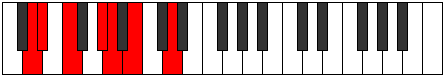
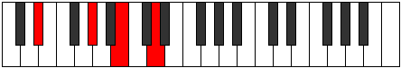

# Mode AFlatDodimic

## Links

- [Documentation](README.md)
- [Scales Index](Scales.md)
- [Modes Index](Modes.md)
- [Chords Index](Chords.md)

## Scale

[Lythimic](ScaleLythimic.md)

## Mode

[AFlatDodimic](ModeAFlatDodimic.md)

## Tonic

Ab

## Signature

[CNaturalMajor]

## Transposition

1, 2, 3, 1, 2, 3

## Chord Pattern

i, i, iv

## Perfection

 - 2 Perfect Notes

 - 4 Imperfect Notes

## Notes

- Ab
- Bbb (Imperfect)
- Cb (Imperfect)
- D
- Eb (Imperfect)
- F (Imperfect)
- Ab

## Illustration

## Diagram

| Circle of Fifth | Chromatic Circle |
|-----------------|------------------|
|  |  |
## Relative Modes

| Number | Mode | Tonic | Notes | Illustration |
|--------|------|-------|-------|--------------|
| [715](https://ianring.com/musictheory/scales/715) | [Dodimic](ModeDodimic.md) | G# | G#, A, B, C##, D#, E#, G# |  |
| [715](https://ianring.com/musictheory/scales/715) | [Dodimic](ModeDodimic.md) | Ab | Ab, Bbb, Cb, D, Eb, F, Ab |  |
| [2405](https://ianring.com/musictheory/scales/2405) | [Katalimic](ModeKatalimic.md) | A | A, B, C##, D#, E#, F###, A |  |
| [1625](https://ianring.com/musictheory/scales/1625) | [Lythimic](ModeLythimic.md) | B | B, C##, D#, E#, F###, G##, B |  |
| [715](https://ianring.com/musictheory/scales/715) | [Dodimic](ModeDodimic.md) | D | D, Eb, F, G#, A, B, D |  |
| [2405](https://ianring.com/musictheory/scales/2405) | [Katalimic](ModeKatalimic.md) | D# | D#, E#, F###, G##, A##, B###, D# |  |
| [2405](https://ianring.com/musictheory/scales/2405) | [Katalimic](ModeKatalimic.md) | Eb | Eb, F, G#, A, B, C##, Eb |  |
| [1625](https://ianring.com/musictheory/scales/1625) | [Lythimic](ModeLythimic.md) | F | F, G#, A, B, C##, D#, F |  |
## Relative Brightness

| Number | Mode | Tonic | Notes | Circle Of Fifth | Chromatic Circle |
|--------|------|-------|-------|-----------------|------------------|
| [715](https://ianring.com/musictheory/scales/715) | [Dodimic](ModeDodimic.md) | G# | G#, A, B, C##, D#, E#, G# |  |  |
| [715](https://ianring.com/musictheory/scales/715) | [Dodimic](ModeDodimic.md) | Ab | Ab, Bbb, Cb, D, Eb, F, Ab |  |  |
| [2405](https://ianring.com/musictheory/scales/2405) | [Katalimic](ModeKatalimic.md) | A | A, B, C##, D#, E#, F###, A |  |  |
| [1625](https://ianring.com/musictheory/scales/1625) | [Lythimic](ModeLythimic.md) | B | B, C##, D#, E#, F###, G##, B |  |  |
| [715](https://ianring.com/musictheory/scales/715) | [Dodimic](ModeDodimic.md) | D | D, Eb, F, G#, A, B, D |  |  |
| [2405](https://ianring.com/musictheory/scales/2405) | [Katalimic](ModeKatalimic.md) | D# | D#, E#, F###, G##, A##, B###, D# |  |  |
| [2405](https://ianring.com/musictheory/scales/2405) | [Katalimic](ModeKatalimic.md) | Eb | Eb, F, G#, A, B, C##, Eb |  |  |
| [1625](https://ianring.com/musictheory/scales/1625) | [Lythimic](ModeLythimic.md) | F | F, G#, A, B, C##, D#, F |  |  |

## Chords

### Ab

| Number | Root | Name | Notes | Illustration | Audio |
|--------|------|------|-------|--------------|-------|
| 772 | Ab | [G#loc](ChordGSharpLocrian.md) | G#, A, D |  | [midi](ChordGSharpLocrianRootPosition.mid) |
| 772 | Ab | [Abloc](ChordAFlatLocrian.md) | Ab, Bbb, Ebb |  | [midi](ChordAFlatLocrianRootPosition.mid) |
| 2308 | Ab | [G#o](ChordGSharpDiminished.md) | G#, B, D |  | [midi](ChordGSharpDiminishedRootPosition.mid) |
| 2308 | Ab | [Abo](ChordAFlatDiminished.md) | Ab, Cb, Ebb |  | [midi](ChordAFlatDiminishedRootPosition.mid) |
| 264 | Ab | [G#5](ChordGSharpPowerChord.md) | G#, D# |  | [midi](ChordGSharpPowerChordRootPosition.mid) |
| 264 | Ab | [Ab5](ChordAFlatPowerChord.md) | Ab, Eb |  | [midi](ChordAFlatPowerChordRootPosition.mid) |
| 776 | Ab | [G#phryg](ChordGSharpPhrygian.md) | G#, A, D# |  | [midi](ChordGSharpPhrygianRootPosition.mid) |
| 776 | Ab | [Abphryg](ChordAFlatPhrygian.md) | Ab, Bbb, Eb |  | [midi](ChordAFlatPhrygianRootPosition.mid) |
| 2312 | Ab | [G#m](ChordGSharpMinor.md) | G#, B, D# |  | [midi](ChordGSharpMinorRootPosition.mid) |
| 2312 | Ab | [G#m(add(#9))](ChordGSharpMinorAddSharpNinth.md) | G#, B, D#, A## |  | [midi](ChordGSharpMinorAddSharpNinthRootPosition.mid) |
| 2312 | Ab | [Abm](ChordAFlatMinor.md) | Ab, Cb, Eb |  | [midi](ChordAFlatMinorRootPosition.mid) |
| 2312 | Ab | [Abm(add(#9))](ChordAFlatMinorAddSharpNinth.md) | Ab, Cb, Eb, B |  | [midi](ChordAFlatMinorAddSharpNinthRootPosition.mid) |
| 268 | Ab | [G#lyd](ChordGSharpLydian.md) | G#, C##, D# |  | [midi](ChordGSharpLydianRootPosition.mid) |
| 268 | Ab | [Ablyd](ChordAFlatLydian.md) | Ab, D, Eb |  | [midi](ChordAFlatLydianRootPosition.mid) |
| 2316 | Ab | [G#m(add(#4))](ChordGSharpMinorAddSharpFourth.md) | G#, B, C##, D# |  | [midi](ChordGSharpMinorAddSharpFourthRootPosition.mid) |
| 2316 | Ab | [Abm(add(#4))](ChordAFlatMinorAddSharpFourth.md) | Ab, Cb, D, Eb |  | [midi](ChordAFlatMinorAddSharpFourthRootPosition.mid) |
| 2340 | Ab | [G#o7](ChordGSharpFullDiminishedSeventh.md) | G#, B, D, F |  | [midi](ChordGSharpFullDiminishedSeventhRootPosition.mid) |
| 2340 | Ab | [Abo7](ChordAFlatFullDiminishedSeventh.md) | Ab, Cb, Ebb, Gbb |  | [midi](ChordAFlatFullDiminishedSeventhRootPosition.mid) |
| 2344 | Ab | [G#m6](ChordGSharpMinorSixth.md) | G#, B, D#, E# |  | [midi](ChordGSharpMinorSixthRootPosition.mid) |
| 2344 | Ab | [Abm6](ChordAFlatMinorSixth.md) | Ab, Cb, Eb, F |  | [midi](ChordAFlatMinorSixthRootPosition.mid) |
| 2856 | Ab | [G#m6(addb9)](ChordGSharpMinorSixthAddFlatNinth.md) | G#, B, D#, E#, A |  | [midi](ChordGSharpMinorSixthAddFlatNinthRootPosition.mid) |
| 2856 | Ab | [Abm6(addb9)](ChordAFlatMinorSixthAddFlatNinth.md) | Ab, Cb, Eb, F, Bbb |  | [midi](ChordAFlatMinorSixthAddFlatNinthRootPosition.mid) |

### Bbb

| Number | Root | Name | Notes | Illustration | Audio |
|--------|------|------|-------|--------------|-------|
| 2564 | Bbb | [Asus2bb5](ChordANaturalSuspendedSecondDoubleFlatFifth.md) | A, B, D |  | [midi](ChordANaturalSuspendedSecondDoubleFlatFifthRootPosition.mid) |
| 2568 | Bbb | [A](ChordANaturalDiminishedFlatThird.md) | A, Cb, Eb |  | [midi](ChordANaturalDiminishedFlatThirdRootPosition.mid) |
| 2568 | Bbb | [Asus2b5](ChordANaturalSuspendedSecondFlatFifth.md) | A, B, Eb |  | [midi](ChordANaturalSuspendedSecondFlatFifthRootPosition.mid) |
| 524 | Bbb | [Asus4b5](ChordANaturalSuspendedFourthFlatFifth.md) | A, D, Eb |  | [midi](ChordANaturalSuspendedFourthFlatFifthRootPosition.mid) |
| 2592 | Bbb | [Asus2#5](ChordANaturalSuspendedSecondSharpFifth.md) | A, B, E# |  | [midi](ChordANaturalSuspendedSecondSharpFifthRootPosition.mid) |
| 548 | Bbb | [Asus4#5](ChordANaturalSuspendedFourthSharpFifth.md) | A, D, E# |  | [midi](ChordANaturalSuspendedFourthSharpFifthRootPosition.mid) |
| 2600 | Bbb | [Asus2b5add(#5)](ChordANaturalSuspendedSecondFlatFifthAddSharpFifth.md) | A, B, Eb, E# |  | [midi](ChordANaturalSuspendedSecondFlatFifthAddSharpFifthRootPosition.mid) |
| 772 | Bbb | [AQ+](ChordANaturalQuartalAugmented.md) | A, D, G# |  | [midi](ChordANaturalQuartalAugmentedRootPosition.mid) |
| 804 | Bbb | [AM7(sus4)#5](ChordANaturalMajorSeventhSuspendedFourthSharpFifth.md) | A, D, E#, G# |  | [midi](ChordANaturalMajorSeventhSuspendedFourthSharpFifthRootPosition.mid) |

### Cb

| Number | Root | Name | Notes | Illustration | Audio |
|--------|------|------|-------|--------------|-------|
| 2084 | Cb | [Bo](ChordBNaturalDiminished.md) | B, D, F |  | [midi](ChordBNaturalDiminishedRootPosition.mid) |
| 2088 | Cb | [BMb5](ChordBNaturalMajorFlatFifth.md) | B, D#, F |  | [midi](ChordBNaturalMajorFlatFifthRootPosition.mid) |
| 2312 | Cb | [BM##5](ChordBNaturalMajorDoubleSharpFifth.md) | B, D#, G# |  | [midi](ChordBNaturalMajorDoubleSharpFifthRootPosition.mid) |
| 2340 | Cb | [Bo7](ChordBNaturalFullDiminishedSeventh.md) | B, D, F, Ab |  | [midi](ChordBNaturalFullDiminishedSeventhRootPosition.mid) |
| 2344 | Cb | [BM6b5](ChordBNaturalMajorSixthFlatFifth.md) | B, D#, F, G# |  | [midi](ChordBNaturalMajorSixthFlatFifthRootPosition.mid) |
| 2596 | Cb | [Bø7](ChordBNaturalHalfDiminishedSeventh.md) | B, D, F, A |  | [midi](ChordBNaturalHalfDiminishedSeventhRootPosition.mid) |
| 2600 | Cb | [B7b5](ChordBNaturalDominantSeventhFlatFifth.md) | B, D#, F, A |  | [midi](ChordBNaturalDominantSeventhFlatFifthRootPosition.mid) |

### D

| Number | Root | Name | Notes | Illustration | Audio |
|--------|------|------|-------|--------------|-------|
| 268 | D | [Dloc](ChordDNaturalLocrian.md) | D, Eb, Ab |  | [midi](ChordDNaturalLocrianRootPosition.mid) |
| 292 | D | [Do](ChordDNaturalDiminished.md) | D, F, Ab |  | [midi](ChordDNaturalDiminishedRootPosition.mid) |
| 516 | D | [D5](ChordDNaturalPowerChord.md) | D, A |  | [midi](ChordDNaturalPowerChordRootPosition.mid) |
| 524 | D | [Dphryg](ChordDNaturalPhrygian.md) | D, Eb, A |  | [midi](ChordDNaturalPhrygianRootPosition.mid) |
| 548 | D | [Dm](ChordDNaturalMinor.md) | D, F, A |  | [midi](ChordDNaturalMinorRootPosition.mid) |
| 548 | D | [Dm(add(#9))](ChordDNaturalMinorAddSharpNinth.md) | D, F, A, E# |  | [midi](ChordDNaturalMinorAddSharpNinthRootPosition.mid) |
| 772 | D | [Dlyd](ChordDNaturalLydian.md) | D, G#, A |  | [midi](ChordDNaturalLydianRootPosition.mid) |
| 804 | D | [Dm(add(#4))](ChordDNaturalMinorAddSharpFourth.md) | D, F, G#, A |  | [midi](ChordDNaturalMinorAddSharpFourthRootPosition.mid) |
| 2340 | D | [Do7](ChordDNaturalFullDiminishedSeventh.md) | D, F, Ab, Cb |  | [midi](ChordDNaturalFullDiminishedSeventhRootPosition.mid) |
| 2596 | D | [Dm6](ChordDNaturalMinorSixth.md) | D, F, A, B |  | [midi](ChordDNaturalMinorSixthRootPosition.mid) |
| 2604 | D | [Dm6(addb9)](ChordDNaturalMinorSixthAddFlatNinth.md) | D, F, A, B, Eb |  | [midi](ChordDNaturalMinorSixthAddFlatNinthRootPosition.mid) |

### Eb

| Number | Root | Name | Notes | Illustration | Audio |
|--------|------|------|-------|--------------|-------|
| 296 | Eb | [D#sus2bb5](ChordDSharpSuspendedSecondDoubleFlatFifth.md) | D#, E#, G# |  | [midi](ChordDSharpSuspendedSecondDoubleFlatFifthRootPosition.mid) |
| 296 | Eb | [Ebsus2bb5](ChordEFlatSuspendedSecondDoubleFlatFifth.md) | Eb, F, Ab |  | [midi](ChordEFlatSuspendedSecondDoubleFlatFifthRootPosition.mid) |
| 552 | Eb | [D#](ChordDSharpDiminishedFlatThird.md) | D#, F, A |  | [midi](ChordDSharpDiminishedFlatThirdRootPosition.mid) |
| 552 | Eb | [D#sus2b5](ChordDSharpSuspendedSecondFlatFifth.md) | D#, E#, A |  | [midi](ChordDSharpSuspendedSecondFlatFifthRootPosition.mid) |
| 552 | Eb | [Eb](ChordEFlatDiminishedFlatThird.md) | Eb, Gbb, Bbb |  | [midi](ChordEFlatDiminishedFlatThirdRootPosition.mid) |
| 552 | Eb | [Ebsus2b5](ChordEFlatSuspendedSecondFlatFifth.md) | Eb, F, Bbb |  | [midi](ChordEFlatSuspendedSecondFlatFifthRootPosition.mid) |
| 776 | Eb | [D#sus4b5](ChordDSharpSuspendedFourthFlatFifth.md) | D#, G#, A |  | [midi](ChordDSharpSuspendedFourthFlatFifthRootPosition.mid) |
| 776 | Eb | [Ebsus4b5](ChordEFlatSuspendedFourthFlatFifth.md) | Eb, Ab, Bbb |  | [midi](ChordEFlatSuspendedFourthFlatFifthRootPosition.mid) |
| 2088 | Eb | [D#sus2#5](ChordDSharpSuspendedSecondSharpFifth.md) | D#, E#, A## |  | [midi](ChordDSharpSuspendedSecondSharpFifthRootPosition.mid) |
| 2088 | Eb | [Ebsus2#5](ChordEFlatSuspendedSecondSharpFifth.md) | Eb, F, B |  | [midi](ChordEFlatSuspendedSecondSharpFifthRootPosition.mid) |
| 2312 | Eb | [D#sus4#5](ChordDSharpSuspendedFourthSharpFifth.md) | D#, G#, A## |  | [midi](ChordDSharpSuspendedFourthSharpFifthRootPosition.mid) |
| 2312 | Eb | [Ebsus4#5](ChordEFlatSuspendedFourthSharpFifth.md) | Eb, Ab, B |  | [midi](ChordEFlatSuspendedFourthSharpFifthRootPosition.mid) |
| 2600 | Eb | [D#sus2b5add(#5)](ChordDSharpSuspendedSecondFlatFifthAddSharpFifth.md) | D#, E#, A, A## |  | [midi](ChordDSharpSuspendedSecondFlatFifthAddSharpFifthRootPosition.mid) |
| 2600 | Eb | [Ebsus2b5add(#5)](ChordEFlatSuspendedSecondFlatFifthAddSharpFifth.md) | Eb, F, Bbb, B |  | [midi](ChordEFlatSuspendedSecondFlatFifthAddSharpFifthRootPosition.mid) |
| 268 | Eb | [D#Q+](ChordDSharpQuartalAugmented.md) | D#, G#, C## |  | [midi](ChordDSharpQuartalAugmentedRootPosition.mid) |
| 268 | Eb | [EbQ+](ChordEFlatQuartalAugmented.md) | Eb, Ab, D |  | [midi](ChordEFlatQuartalAugmentedRootPosition.mid) |
| 2316 | Eb | [D#M7(sus4)#5](ChordDSharpMajorSeventhSuspendedFourthSharpFifth.md) | D#, G#, A##, C## |  | [midi](ChordDSharpMajorSeventhSuspendedFourthSharpFifthRootPosition.mid) |
| 2316 | Eb | [EbM7(sus4)#5](ChordEFlatMajorSeventhSuspendedFourthSharpFifth.md) | Eb, Ab, B, D |  | [midi](ChordEFlatMajorSeventhSuspendedFourthSharpFifthRootPosition.mid) |

### F

| Number | Root | Name | Notes | Illustration | Audio |
|--------|------|------|-------|--------------|-------|
| 2336 | F | [Fo](ChordFNaturalDiminished.md) | F, Ab, Cb |  | [midi](ChordFNaturalDiminishedRootPosition.mid) |
| 2592 | F | [FMb5](ChordFNaturalMajorFlatFifth.md) | F, A, Cb |  | [midi](ChordFNaturalMajorFlatFifthRootPosition.mid) |
| 548 | F | [FM##5](ChordFNaturalMajorDoubleSharpFifth.md) | F, A, D |  | [midi](ChordFNaturalMajorDoubleSharpFifthRootPosition.mid) |
| 2340 | F | [Fo7](ChordFNaturalFullDiminishedSeventh.md) | F, Ab, Cb, Ebb |  | [midi](ChordFNaturalFullDiminishedSeventhRootPosition.mid) |
| 2596 | F | [FM6b5](ChordFNaturalMajorSixthFlatFifth.md) | F, A, Cb, D |  | [midi](ChordFNaturalMajorSixthFlatFifthRootPosition.mid) |
| 2344 | F | [Fø7](ChordFNaturalHalfDiminishedSeventh.md) | F, Ab, Cb, Eb |  | [midi](ChordFNaturalHalfDiminishedSeventhRootPosition.mid) |
| 2600 | F | [F7b5](ChordFNaturalDominantSeventhFlatFifth.md) | F, A, Cb, Eb |  | [midi](ChordFNaturalDominantSeventhFlatFifthRootPosition.mid) |

