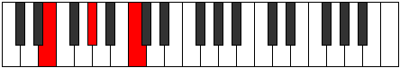

# Mode AFlatDolimic

## Links

- [Documentation](README.md)
- [Scales Index](Scales.md)
- [Modes Index](Modes.md)
- [Chords Index](Chords.md)

## Scale

[Mothimic](ScaleMothimic.md)

## Mode

[AFlatDolimic](ModeAFlatDolimic.md)

## Tonic

Ab

## Signature

[CNaturalMajor]

## Transposition

1, 3, 1, 3, 2, 2

## Chord Pattern

I⁺, I⁺, III⁺, V⁺, vi, vi

## Perfection

 - 3 Perfect Notes

 - 3 Imperfect Notes

## Notes

- Ab (Imperfect)
- Bbb
- C (Imperfect)
- Db
- E (Imperfect)
- F#
- Ab (Imperfect)

## Illustration

## Diagram

## Relative Modes

| Number | Mode | Tonic | Notes | Illustration |
|--------|------|-------|-------|--------------|
| [1331](https://ianring.com/musictheory/scales/1331) | [Dolimic](ModeDolimic.md) | G# | G#, A, B#, C#, D##, E##, G# |  |
| [1331](https://ianring.com/musictheory/scales/1331) | [Dolimic](ModeDolimic.md) | Ab | Ab, Bbb, C, Db, E, F#, Ab |  |
| [2713](https://ianring.com/musictheory/scales/2713) | [Porimic](ModePorimic.md) | A | A, B#, C#, D##, E##, F###, A |  |
| [851](https://ianring.com/musictheory/scales/851) | [Aerylimic](ModeAerylimic.md) | C | C, Db, E, F#, G#, A, C |  |
| [2473](https://ianring.com/musictheory/scales/2473) | [Mothimic](ModeMothimic.md) | C# | C#, D##, E##, F###, G##, A###, C# |  |
| [2473](https://ianring.com/musictheory/scales/2473) | [Mothimic](ModeMothimic.md) | Db | Db, E, F#, G#, A, B#, Db |  |
| [821](https://ianring.com/musictheory/scales/821) | [Aeranimic](ModeAeranimic.md) | E | E, F#, G#, A, B#, C#, E |  |
| [1229](https://ianring.com/musictheory/scales/1229) | [Ragimic](ModeRagimic.md) | F# | F#, G#, A, B#, C#, D##, F# |  |
| [1229](https://ianring.com/musictheory/scales/1229) | [Ragimic](ModeRagimic.md) | Gb | Gb, Ab, Bbb, C, Db, E, Gb |  |
## Relative Brightness

| Number | Mode | Tonic | Notes | Illustration |
|--------|------|-------|-------|--------------|
| [1331](https://ianring.com/musictheory/scales/1331) | [Dolimic](ModeDolimic.md) | G# | G#, A, B#, C#, D##, E##, G# |  |
| [1331](https://ianring.com/musictheory/scales/1331) | [Dolimic](ModeDolimic.md) | Ab | Ab, Bbb, C, Db, E, F#, Ab |  |
| [2713](https://ianring.com/musictheory/scales/2713) | [Porimic](ModePorimic.md) | A | A, B#, C#, D##, E##, F###, A |  |
| [851](https://ianring.com/musictheory/scales/851) | [Aerylimic](ModeAerylimic.md) | C | C, Db, E, F#, G#, A, C |  |
| [2473](https://ianring.com/musictheory/scales/2473) | [Mothimic](ModeMothimic.md) | C# | C#, D##, E##, F###, G##, A###, C# |  |
| [2473](https://ianring.com/musictheory/scales/2473) | [Mothimic](ModeMothimic.md) | Db | Db, E, F#, G#, A, B#, Db |  |
| [821](https://ianring.com/musictheory/scales/821) | [Aeranimic](ModeAeranimic.md) | E | E, F#, G#, A, B#, C#, E |  |
| [1229](https://ianring.com/musictheory/scales/1229) | [Ragimic](ModeRagimic.md) | F# | F#, G#, A, B#, C#, D##, F# |  |
| [1229](https://ianring.com/musictheory/scales/1229) | [Ragimic](ModeRagimic.md) | Gb | Gb, Ab, Bbb, C, Db, E, Gb |  |

## Chords

### Ab

| Number | Root | Name | Notes | Illustration | Audio |
|--------|------|------|-------|--------------|-------|
| 273 | Ab | [G#+](ChordGSharpAugmented.md) | G#, B#, D## |  | [midi](ChordGSharpAugmentedRootPosition.mid) |
| 273 | Ab | [G#+7](ChordGSharpAugmentedAugmentedSeventh.md) | G#, B#, D##, F### |  | [midi](ChordGSharpAugmentedAugmentedSeventhRootPosition.mid) |
| 273 | Ab | [Ab+](ChordAFlatAugmented.md) | Ab, C, E |  | [midi](ChordAFlatAugmentedRootPosition.mid) |
| 273 | Ab | [Ab+7](ChordAFlatAugmentedAugmentedSeventh.md) | Ab, C, E, G# |  | [midi](ChordAFlatAugmentedAugmentedSeventhRootPosition.mid) |
| 274 | Ab | [G#sus4#5](ChordGSharpSuspendedFourthSharpFifth.md) | G#, C#, D## |  | [midi](ChordGSharpSuspendedFourthSharpFifthRootPosition.mid) |
| 274 | Ab | [Absus4#5](ChordAFlatSuspendedFourthSharpFifth.md) | Ab, Db, E |  | [midi](ChordAFlatSuspendedFourthSharpFifthRootPosition.mid) |
| 322 | Ab | [G#Q](ChordGSharpQuartal.md) | G#, C#, F# |  | [midi](ChordGSharpQuartalRootPosition.mid) |
| 322 | Ab | [AbQ](ChordAFlatQuartal.md) | Ab, Db, Gb |  | [midi](ChordAFlatQuartalRootPosition.mid) |
| 849 | Ab | [G#7#5b9](ChordGSharpDominantSeventhSharpFifthFlatNinth.md) | G#, B#, D##, F#, A |  | [midi](ChordGSharpDominantSeventhSharpFifthFlatNinthRootPosition.mid) |
| 849 | Ab | [Ab7#5b9](ChordAFlatDominantSeventhSharpFifthFlatNinth.md) | Ab, C, E, Gb, Bbb |  | [midi](ChordAFlatDominantSeventhSharpFifthFlatNinthRootPosition.mid) |

### Bbb

| Number | Root | Name | Notes | Illustration | Audio |
|--------|------|------|-------|--------------|-------|
| 528 | Bbb | [A5](ChordANaturalPowerChord.md) | A, E |  | [midi](ChordANaturalPowerChordRootPosition.mid) |
| 529 | Bbb | [Am](ChordANaturalMinor.md) | A, C, E |  | [midi](ChordANaturalMinorRootPosition.mid) |
| 529 | Bbb | [Am(add(#9))](ChordANaturalMinorAddSharpNinth.md) | A, C, E, B# |  | [midi](ChordANaturalMinorAddSharpNinthRootPosition.mid) |
| 530 | Bbb | [AM](ChordANaturalMajor.md) | A, C#, E |  | [midi](ChordANaturalMajorRootPosition.mid) |
| 531 | Bbb | [AM(add(#9))](ChordANaturalMajorAddSharpNinth.md) | A, C#, E, B# |  | [midi](ChordANaturalMajorAddSharpNinthRootPosition.mid) |
| 578 | Bbb | [AM##5](ChordANaturalMajorDoubleSharpFifth.md) | A, C#, F# |  | [midi](ChordANaturalMajorDoubleSharpFifthRootPosition.mid) |
| 593 | Bbb | [Am6](ChordANaturalMinorSixth.md) | A, C, E, F# |  | [midi](ChordANaturalMinorSixthRootPosition.mid) |
| 594 | Bbb | [AM6](ChordANaturalMajorSixth.md) | A, C#, E, F# |  | [midi](ChordANaturalMajorSixthRootPosition.mid) |
| 785 | Bbb | [Am(M7)](ChordANaturalMinorMajorSeventh.md) | A, C, E, G# |  | [midi](ChordANaturalMinorMajorSeventhRootPosition.mid) |
| 786 | Bbb | [AM7](ChordANaturalMajorSeventh.md) | A, C#, E, G# |  | [midi](ChordANaturalMajorSeventhRootPosition.mid) |
| 834 | Bbb | [AM7##5](ChordANaturalMajorSeventhDoubleSharpFifth.md) | A, C#, F#, G# |  | [midi](ChordANaturalMajorSeventhDoubleSharpFifthRootPosition.mid) |
| 849 | Bbb | [Am(M7)add13](ChordANaturalMinorMajorSeventhAddThirteenth.md) | A, C, E, G#, F# |  | [midi](ChordANaturalMinorMajorSeventhAddThirteenthRootPosition.mid) |
| 850 | Bbb | [AM7add13](ChordANaturalMajorSeventhAddThirteenth.md) | A, C#, E, G#, F# |  | [midi](ChordANaturalMajorSeventhAddThirteenthRootPosition.mid) |

### C

| Number | Root | Name | Notes | Illustration | Audio |
|--------|------|------|-------|--------------|-------|
| 67 | C | [Cloc](ChordCNaturalLocrian.md) | C, Db, Gb |  | [midi](ChordCNaturalLocrianRootPosition.mid) |
| 81 | C | [CMb5](ChordCNaturalMajorFlatFifth.md) | C, E, Gb |  | [midi](ChordCNaturalMajorFlatFifthRootPosition.mid) |
| 273 | C | [C+](ChordCNaturalAugmented.md) | C, E, G# |  | [midi](ChordCNaturalAugmentedRootPosition.mid) |
| 273 | C | [C+7](ChordCNaturalAugmentedAugmentedSeventh.md) | C, E, G#, B# |  | [midi](ChordCNaturalAugmentedAugmentedSeventhRootPosition.mid) |
| 529 | C | [CM##5](ChordCNaturalMajorDoubleSharpFifth.md) | C, E, A |  | [midi](ChordCNaturalMajorDoubleSharpFifthRootPosition.mid) |
| 593 | C | [CM6b5](ChordCNaturalMajorSixthFlatFifth.md) | C, E, Gb, A |  | [midi](ChordCNaturalMajorSixthFlatFifthRootPosition.mid) |

### Db

| Number | Root | Name | Notes | Illustration | Audio |
|--------|------|------|-------|--------------|-------|
| 82 | Db | [C#mbb5](ChordCSharpMinorDoubleFlatFifth.md) | C#, E, F# |  | [midi](ChordCSharpMinorDoubleFlatFifthRootPosition.mid) |
| 82 | Db | [Dbmbb5](ChordDFlatMinorDoubleFlatFifth.md) | Db, Fb, Gb |  | [midi](ChordDFlatMinorDoubleFlatFifthRootPosition.mid) |
| 258 | Db | [C#5](ChordCSharpPowerChord.md) | C#, G# |  | [midi](ChordCSharpPowerChordRootPosition.mid) |
| 258 | Db | [Db5](ChordDFlatPowerChord.md) | Db, Ab |  | [midi](ChordDFlatPowerChordRootPosition.mid) |
| 274 | Db | [C#m](ChordCSharpMinor.md) | C#, E, G# |  | [midi](ChordCSharpMinorRootPosition.mid) |
| 274 | Db | [C#m(add(#9))](ChordCSharpMinorAddSharpNinth.md) | C#, E, G#, D## |  | [midi](ChordCSharpMinorAddSharpNinthRootPosition.mid) |
| 274 | Db | [Dbm](ChordDFlatMinor.md) | Db, Fb, Ab |  | [midi](ChordDFlatMinorRootPosition.mid) |
| 274 | Db | [Dbm(add(#9))](ChordDFlatMinorAddSharpNinth.md) | Db, Fb, Ab, E |  | [midi](ChordDFlatMinorAddSharpNinthRootPosition.mid) |
| 322 | Db | [C#sus4](ChordCSharpSuspendedFourth.md) | C#, F#, G# |  | [midi](ChordCSharpSuspendedFourthRootPosition.mid) |
| 322 | Db | [Dbsus4](ChordDFlatSuspendedFourth.md) | Db, Gb, Ab |  | [midi](ChordDFlatSuspendedFourthRootPosition.mid) |
| 338 | Db | [C#m(add11)](ChordCSharpMinorAddEleventh.md) | C#, E, G#, F# |  | [midi](ChordCSharpMinorAddEleventhRootPosition.mid) |
| 338 | Db | [C#m(add4)](ChordCSharpMinorAddFourth.md) | C#, E, F#, G# |  | [midi](ChordCSharpMinorAddFourthRootPosition.mid) |
| 338 | Db | [Dbm(add11)](ChordDFlatMinorAddEleventh.md) | Db, Fb, Ab, Gb |  | [midi](ChordDFlatMinorAddEleventhRootPosition.mid) |
| 338 | Db | [Dbm(add4)](ChordDFlatMinorAddFourth.md) | Db, Fb, Gb, Ab |  | [midi](ChordDFlatMinorAddFourthRootPosition.mid) |
| 530 | Db | [C#m#5](ChordCSharpMinorSharpFifth.md) | C#, E, A |  | [midi](ChordCSharpMinorSharpFifthRootPosition.mid) |
| 530 | Db | [Dbm#5](ChordDFlatMinorSharpFifth.md) | Db, Fb, Bbb |  | [midi](ChordDFlatMinorSharpFifthRootPosition.mid) |
| 578 | Db | [C#sus4#5](ChordCSharpSuspendedFourthSharpFifth.md) | C#, F#, G## |  | [midi](ChordCSharpSuspendedFourthSharpFifthRootPosition.mid) |
| 578 | Db | [Dbsus4#5](ChordDFlatSuspendedFourthSharpFifth.md) | Db, Gb, A |  | [midi](ChordDFlatSuspendedFourthSharpFifthRootPosition.mid) |
| 67 | Db | [C#Q+](ChordCSharpQuartalAugmented.md) | C#, F#, B# |  | [midi](ChordCSharpQuartalAugmentedRootPosition.mid) |
| 67 | Db | [DbQ+](ChordDFlatQuartalAugmented.md) | Db, Gb, C |  | [midi](ChordDFlatQuartalAugmentedRootPosition.mid) |
| 275 | Db | [C#m(M7)](ChordCSharpMinorMajorSeventh.md) | C#, E, G#, B# |  | [midi](ChordCSharpMinorMajorSeventhRootPosition.mid) |
| 275 | Db | [Dbm(M7)](ChordDFlatMinorMajorSeventh.md) | Db, Fb, Ab, C |  | [midi](ChordDFlatMinorMajorSeventhRootPosition.mid) |
| 323 | Db | [C#M7(sus4)](ChordCSharpMajorSeventhSuspendedFourth.md) | C#, F#, G#, B# |  | [midi](ChordCSharpMajorSeventhSuspendedFourthRootPosition.mid) |
| 323 | Db | [DbM7(sus4)](ChordDFlatMajorSeventhSuspendedFourth.md) | Db, Gb, Ab, C |  | [midi](ChordDFlatMajorSeventhSuspendedFourthRootPosition.mid) |
| 339 | Db | [C#m(M7)add11](ChordCSharpMinorMajorSeventhAddEleventh.md) | C#, E, G#, B#, F# |  | [midi](ChordCSharpMinorMajorSeventhAddEleventhRootPosition.mid) |
| 339 | Db | [Dbm(M7)add11](ChordDFlatMinorMajorSeventhAddEleventh.md) | Db, Fb, Ab, C, Gb |  | [midi](ChordDFlatMinorMajorSeventhAddEleventhRootPosition.mid) |
| 579 | Db | [C#M7(sus4)#5](ChordCSharpMajorSeventhSuspendedFourthSharpFifth.md) | C#, F#, G##, B# |  | [midi](ChordCSharpMajorSeventhSuspendedFourthSharpFifthRootPosition.mid) |
| 579 | Db | [DbM7(sus4)#5](ChordDFlatMajorSeventhSuspendedFourthSharpFifth.md) | Db, Gb, A, C |  | [midi](ChordDFlatMajorSeventhSuspendedFourthSharpFifthRootPosition.mid) |

### E

| Number | Root | Name | Notes | Illustration | Audio |
|--------|------|------|-------|--------------|-------|
| 592 | E | [Esus2bb5](ChordENaturalSuspendedSecondDoubleFlatFifth.md) | E, F#, A |  | [midi](ChordENaturalSuspendedSecondDoubleFlatFifthRootPosition.mid) |
| 81 | E | [Esus2#5](ChordENaturalSuspendedSecondSharpFifth.md) | E, F#, B# |  | [midi](ChordENaturalSuspendedSecondSharpFifthRootPosition.mid) |
| 273 | E | [E+](ChordENaturalAugmented.md) | E, G#, B# |  | [midi](ChordENaturalAugmentedRootPosition.mid) |
| 273 | E | [E+7](ChordENaturalAugmentedAugmentedSeventh.md) | E, G#, B#, D## |  | [midi](ChordENaturalAugmentedAugmentedSeventhRootPosition.mid) |
| 529 | E | [Esus4#5](ChordENaturalSuspendedFourthSharpFifth.md) | E, A, B# |  | [midi](ChordENaturalSuspendedFourthSharpFifthRootPosition.mid) |
| 274 | E | [EM##5](ChordENaturalMajorDoubleSharpFifth.md) | E, G#, C# |  | [midi](ChordENaturalMajorDoubleSharpFifthRootPosition.mid) |
| 530 | E | [Esus4##5](ChordENaturalSuspendedFourthDoubleSharpFifth.md) | E, A, C# |  | [midi](ChordENaturalSuspendedFourthDoubleSharpFifthRootPosition.mid) |
| 594 | E | [EM6sus2bb5](ChordENaturalMajorSixthSuspendedSecondDoubleFlatFifth.md) | E, F#, A, C# |  | [midi](ChordENaturalMajorSixthSuspendedSecondDoubleFlatFifthRootPosition.mid) |

### F#

| Number | Root | Name | Notes | Illustration | Audio |
|--------|------|------|-------|--------------|-------|
| 321 | F# | [F#](ChordFSharpDiminishedFlatThird.md) | F#, Ab, C |  | [midi](ChordFSharpDiminishedFlatThirdRootPosition.mid) |
| 321 | F# | [F#sus2b5](ChordFSharpSuspendedSecondFlatFifth.md) | F#, G#, C |  | [midi](ChordFSharpSuspendedSecondFlatFifthRootPosition.mid) |
| 321 | F# | [Gb](ChordGFlatDiminishedFlatThird.md) | Gb, Bbbb, Dbb |  | [midi](ChordGFlatDiminishedFlatThirdRootPosition.mid) |
| 321 | F# | [Gbsus2b5](ChordGFlatSuspendedSecondFlatFifth.md) | Gb, Ab, Dbb |  | [midi](ChordGFlatSuspendedSecondFlatFifthRootPosition.mid) |
| 577 | F# | [F#o](ChordFSharpDiminished.md) | F#, A, C |  | [midi](ChordFSharpDiminishedRootPosition.mid) |
| 577 | F# | [Gbo](ChordGFlatDiminished.md) | Gb, Bbb, Dbb |  | [midi](ChordGFlatDiminishedRootPosition.mid) |
| 66 | F# | [F#5](ChordFSharpPowerChord.md) | F#, C# |  | [midi](ChordFSharpPowerChordRootPosition.mid) |
| 66 | F# | [Gb5](ChordGFlatPowerChord.md) | Gb, Db |  | [midi](ChordGFlatPowerChordRootPosition.mid) |
| 322 | F# | [F#sus2](ChordFSharpSuspendedSecond.md) | F#, G#, C# |  | [midi](ChordFSharpSuspendedSecondRootPosition.mid) |
| 322 | F# | [Gbsus2](ChordGFlatSuspendedSecond.md) | Gb, Ab, Db |  | [midi](ChordGFlatSuspendedSecondRootPosition.mid) |
| 578 | F# | [F#m](ChordFSharpMinor.md) | F#, A, C# |  | [midi](ChordFSharpMinorRootPosition.mid) |
| 578 | F# | [F#m(add(#9))](ChordFSharpMinorAddSharpNinth.md) | F#, A, C#, G## |  | [midi](ChordFSharpMinorAddSharpNinthRootPosition.mid) |
| 578 | F# | [Gbm](ChordGFlatMinor.md) | Gb, Bbb, Db |  | [midi](ChordGFlatMinorRootPosition.mid) |
| 578 | F# | [Gbm(add(#9))](ChordGFlatMinorAddSharpNinth.md) | Gb, Bbb, Db, A |  | [midi](ChordGFlatMinorAddSharpNinthRootPosition.mid) |
| 834 | F# | [F#m(add9)](ChordFSharpMinorAddNinth.md) | F#, A, C#, G# |  | [midi](ChordFSharpMinorAddNinthRootPosition.mid) |
| 834 | F# | [Gbm(add9)](ChordGFlatMinorAddNinth.md) | Gb, Bbb, Db, Ab |  | [midi](ChordGFlatMinorAddNinthRootPosition.mid) |
| 67 | F# | [F#lyd](ChordFSharpLydian.md) | F#, B#, C# |  | [midi](ChordFSharpLydianRootPosition.mid) |
| 67 | F# | [Gblyd](ChordGFlatLydian.md) | Gb, C, Db |  | [midi](ChordGFlatLydianRootPosition.mid) |
| 579 | F# | [F#m(add(#4))](ChordFSharpMinorAddSharpFourth.md) | F#, A, B#, C# |  | [midi](ChordFSharpMinorAddSharpFourthRootPosition.mid) |
| 579 | F# | [Gbm(add(#4))](ChordGFlatMinorAddSharpFourth.md) | Gb, Bbb, C, Db |  | [midi](ChordGFlatMinorAddSharpFourthRootPosition.mid) |
| 593 | F# | [F#ø7](ChordFSharpHalfDiminishedSeventh.md) | F#, A, C, E |  | [midi](ChordFSharpHalfDiminishedSeventhRootPosition.mid) |
| 593 | F# | [Gbø7](ChordGFlatHalfDiminishedSeventh.md) | Gb, Bbb, Dbb, Fb |  | [midi](ChordGFlatHalfDiminishedSeventhRootPosition.mid) |
| 338 | F# | [F#7sus2](ChordFSharpDominantSeventhSuspendedSecond.md) | F#, G#, C#, E |  | [midi](ChordFSharpDominantSeventhSuspendedSecondRootPosition.mid) |
| 338 | F# | [F#9sus2](ChordFSharpDominantNinthSuspendedSecond.md) | F#, G#, C#, E, G# |  | [midi](ChordFSharpDominantNinthSuspendedSecondRootPosition.mid) |
| 338 | F# | [Gb7sus2](ChordGFlatDominantSeventhSuspendedSecond.md) | Gb, Ab, Db, Fb |  | [midi](ChordGFlatDominantSeventhSuspendedSecondRootPosition.mid) |
| 338 | F# | [Gb9sus2](ChordGFlatDominantNinthSuspendedSecond.md) | Gb, Ab, Db, Fb, Ab |  | [midi](ChordGFlatDominantNinthSuspendedSecondRootPosition.mid) |
| 594 | F# | [F#m7](ChordFSharpMinorSeventh.md) | F#, A, C#, E |  | [midi](ChordFSharpMinorSeventhRootPosition.mid) |
| 594 | F# | [Gbm7](ChordGFlatMinorSeventh.md) | Gb, Bbb, Db, Fb |  | [midi](ChordGFlatMinorSeventhRootPosition.mid) |
| 850 | F# | [F#m9](ChordFSharpMinorNinth.md) | F#, A, C#, E, G# |  | [midi](ChordFSharpMinorNinthRootPosition.mid) |
| 850 | F# | [Gbm9](ChordGFlatMinorNinth.md) | Gb, Bbb, Db, Fb, Ab |  | [midi](ChordGFlatMinorNinthRootPosition.mid) |
| 595 | F# | [F#m7add(#11)](ChordFSharpMinorSeventhAddSharpEleventh.md) | F#, A, C#, E, B# |  | [midi](ChordFSharpMinorSeventhAddSharpEleventhRootPosition.mid) |
| 595 | F# | [Gbm7add(#11)](ChordGFlatMinorSeventhAddSharpEleventh.md) | Gb, Bbb, Db, Fb, C |  | [midi](ChordGFlatMinorSeventhAddSharpEleventhRootPosition.mid) |

