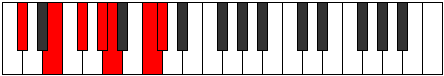

# Mode AFlatDolimic

## Links

- [Documentation](index.md)
- [Scales Index](Scales.md)
- [Modes Index](Modes.md)
- [Chords Index](Chords.md)

## Scale

[Mothimic](ScaleMothimic.md)

## Mode

[AFlatDolimic](ModeAFlatDolimic.md)

## Tonic

Ab

## Signature

[CNaturalMajor]

## Perfection

 - 3 Perfect Notes

 - 3 Imperfect Notes

## Notes

- Ab (Imperfect)
- Bbb
- C (Imperfect)
- Db
- E (Imperfect)
- F#
- Ab (Imperfect)

## Illustration

## Relative Modes

| Number | Mode | Tonic | Notes | Illustration |
|--------|------|-------|-------|--------------|
| [821](https://ianring.com/musictheory/scales/821) | [Aeranimic](ModeAeranimic.md) | E | E, F#, G#, A, B#, C#, E |  |
| [851](https://ianring.com/musictheory/scales/851) | [Aerylimic](ModeAerylimic.md) | C | C, Db, E, F#, G#, A, C |  |
| [1229](https://ianring.com/musictheory/scales/1229) | [Ragimic](ModeRagimic.md) | F# | F#, G#, A, B#, C#, D##, F# |  |
| [1229](https://ianring.com/musictheory/scales/1229) | [Ragimic](ModeRagimic.md) | Gb | Gb, Ab, Bbb, C, Db, E, Gb |  |
| [1331](https://ianring.com/musictheory/scales/1331) | [Dolimic](ModeDolimic.md) | G# | G#, A, B#, C#, D##, E##, G# |  |
| [1331](https://ianring.com/musictheory/scales/1331) | [Dolimic](ModeDolimic.md) | Ab | Ab, Bbb, C, Db, E, F#, Ab |  |
| [2473](https://ianring.com/musictheory/scales/2473) | [Mothimic](ModeMothimic.md) | C# | C#, D##, E##, F###, G##, A###, C# |  |
| [2473](https://ianring.com/musictheory/scales/2473) | [Mothimic](ModeMothimic.md) | Db | Db, E, F#, G#, A, B#, Db |  |
| [2713](https://ianring.com/musictheory/scales/2713) | [Porimic](ModePorimic.md) | A | A, B#, C#, D##, E##, F###, A |  |

## Chords

### Ab

| Number | Root | Name | Notes | Illustration | Audio |
|--------|------|------|-------|--------------|-------|

### Bbb

| Number | Root | Name | Notes | Illustration | Audio |
|--------|------|------|-------|--------------|-------|

### C

| Number | Root | Name | Notes | Illustration | Audio |
|--------|------|------|-------|--------------|-------|

### Db

| Number | Root | Name | Notes | Illustration | Audio |
|--------|------|------|-------|--------------|-------|

### E

| Number | Root | Name | Notes | Illustration | Audio |
|--------|------|------|-------|--------------|-------|

### F#

| Number | Root | Name | Notes | Illustration | Audio |
|--------|------|------|-------|--------------|-------|

