# Mode AFlatDothian

## Links

- [Documentation](README.md)
- [Scales Index](Scales.md)
- [Modes Index](Modes.md)
- [Chords Index](Chords.md)

## Scale

[Bonian](ScaleBonian.md)

## Mode

[AFlatDothian](ModeAFlatDothian.md)

## Tonic

Ab

## Signature

[CNaturalMajor]

## Transposition

1, 1, 1, 3, 3, 2, 1

## Chord Pattern

i⁰b3

## Perfection

 - 3 Perfect Notes

 - 4 Imperfect Notes

## Notes

- Ab (Imperfect)
- Bbb (Imperfect)
- Cbb
- Dbbb (Imperfect)
- Ebb
- F (Imperfect)
- G
- Ab (Imperfect)

## Illustration

## Diagram

| Circle of Fifth | Chromatic Circle |
|-----------------|------------------|
| 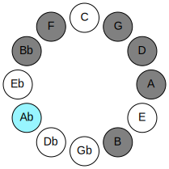 | 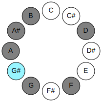 |
## Relative Modes

| Number | Mode | Tonic | Notes | Illustration |
|--------|------|-------|-------|--------------|
| [2639](https://ianring.com/musictheory/scales/2639) | [Dothian](ModeDothian.md) | G# | G#, A, Bb, Cb, D, E#, F##, G# |  |
| [2639](https://ianring.com/musictheory/scales/2639) | [Dothian](ModeDothian.md) | Ab | Ab, Bbb, Cbb, Dbbb, Ebb, F, G, Ab |  |
| [3367](https://ianring.com/musictheory/scales/3367) | [Moptian](ModeMoptian.md) | A | A, Bb, Cb, D, E#, F##, G#, A |  |
| [3731](https://ianring.com/musictheory/scales/3731) | [Aeryrian](ModeAeryrian.md) | A# | A#, B, C##, D###, E###, F###, G##, A# |  |
| [3731](https://ianring.com/musictheory/scales/3731) | [Aeryrian](ModeAeryrian.md) | Bb | Bb, Cb, D, E#, F##, G#, A, Bb |  |
| [3913](https://ianring.com/musictheory/scales/3913) | [Bonian](ModeBonian.md) | B | B, C##, D###, E###, F###, G##, A#, B |  |
| [1001](https://ianring.com/musictheory/scales/1001) | [Badian](ModeBadian.md) | D | D, E#, F##, G#, A, Bb, Cb, D |  |
| [637](https://ianring.com/musictheory/scales/637) | [Katodian](ModeKatodian.md) | F | F, G, Ab, Bbb, Cbb, Dbbb, Ebb, F |  |
| [1183](https://ianring.com/musictheory/scales/1183) | [Sadian](ModeSadian.md) | G | G, Ab, Bbb, Cbb, Dbbb, Ebb, F, G |  |
## Relative Brightness

| Number | Mode | Tonic | Notes | Circle Of Fifth | Chromatic Circle |
|--------|------|-------|-------|-----------------|------------------|
| [2639](https://ianring.com/musictheory/scales/2639) | [Dothian](ModeDothian.md) | G# | G#, A, Bb, Cb, D, E#, F##, G# |  |  |
| [2639](https://ianring.com/musictheory/scales/2639) | [Dothian](ModeDothian.md) | Ab | Ab, Bbb, Cbb, Dbbb, Ebb, F, G, Ab |  |  |
| [3367](https://ianring.com/musictheory/scales/3367) | [Moptian](ModeMoptian.md) | A | A, Bb, Cb, D, E#, F##, G#, A | 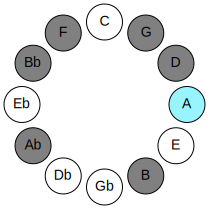 | 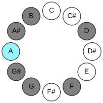 |
| [3731](https://ianring.com/musictheory/scales/3731) | [Aeryrian](ModeAeryrian.md) | A# | A#, B, C##, D###, E###, F###, G##, A# | 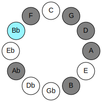 | 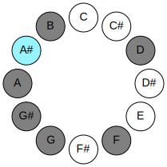 |
| [3731](https://ianring.com/musictheory/scales/3731) | [Aeryrian](ModeAeryrian.md) | Bb | Bb, Cb, D, E#, F##, G#, A, Bb |  |  |
| [3913](https://ianring.com/musictheory/scales/3913) | [Bonian](ModeBonian.md) | B | B, C##, D###, E###, F###, G##, A#, B | 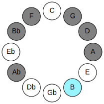 | 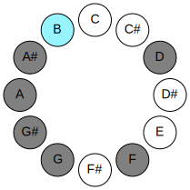 |
| [1001](https://ianring.com/musictheory/scales/1001) | [Badian](ModeBadian.md) | D | D, E#, F##, G#, A, Bb, Cb, D | 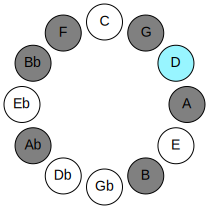 | 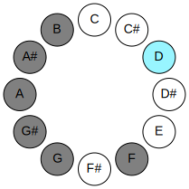 |
| [637](https://ianring.com/musictheory/scales/637) | [Katodian](ModeKatodian.md) | F | F, G, Ab, Bbb, Cbb, Dbbb, Ebb, F | 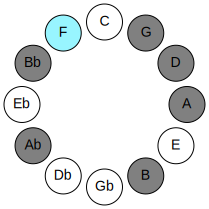 | 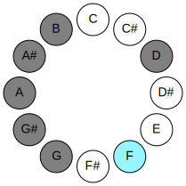 |
| [1183](https://ianring.com/musictheory/scales/1183) | [Sadian](ModeSadian.md) | G | G, Ab, Bbb, Cbb, Dbbb, Ebb, F, G | 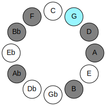 | 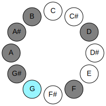 |

## Chords

### Ab

| Number | Root | Name | Notes | Illustration | Audio |
|--------|------|------|-------|--------------|-------|
| 772 | Ab | [G#loc](ChordGSharpLocrian.md) | G#, A, D |  | [midi](ChordGSharpLocrianRootPosition.mid) |
| 772 | Ab | [Abloc](ChordAFlatLocrian.md) | Ab, Bbb, Ebb |  | [midi](ChordAFlatLocrianRootPosition.mid) |
| 1284 | Ab | [G#](ChordGSharpDiminishedFlatThird.md) | G#, Bb, D |  | [midi](ChordGSharpDiminishedFlatThirdRootPosition.mid) |
| 1284 | Ab | [G#sus2b5](ChordGSharpSuspendedSecondFlatFifth.md) | G#, A#, D |  | [midi](ChordGSharpSuspendedSecondFlatFifthRootPosition.mid) |
| 1284 | Ab | [Ab](ChordAFlatDiminishedFlatThird.md) | Ab, Cbb, Ebb |  | [midi](ChordAFlatDiminishedFlatThirdRootPosition.mid) |
| 1284 | Ab | [Absus2b5](ChordAFlatSuspendedSecondFlatFifth.md) | Ab, Bb, Ebb |  | [midi](ChordAFlatSuspendedSecondFlatFifthRootPosition.mid) |
| 2308 | Ab | [G#o](ChordGSharpDiminished.md) | G#, B, D |  | [midi](ChordGSharpDiminishedRootPosition.mid) |
| 2308 | Ab | [Abo](ChordAFlatDiminished.md) | Ab, Cb, Ebb |  | [midi](ChordAFlatDiminishedRootPosition.mid) |
| 1316 | Ab | [G#M6sus2b5](ChordGSharpMajorSixthSuspendedSecondFlatFifth.md) | G#, A#, D, E# |  | [midi](ChordGSharpMajorSixthSuspendedSecondFlatFifthRootPosition.mid) |
| 1316 | Ab | [AbM6sus2b5](ChordAFlatMajorSixthSuspendedSecondFlatFifth.md) | Ab, Bb, Ebb, F |  | [midi](ChordAFlatMajorSixthSuspendedSecondFlatFifthRootPosition.mid) |
| 2340 | Ab | [G#o7](ChordGSharpFullDiminishedSeventh.md) | G#, B, D, F |  | [midi](ChordGSharpFullDiminishedSeventhRootPosition.mid) |
| 2340 | Ab | [Abo7](ChordAFlatFullDiminishedSeventh.md) | Ab, Cb, Ebb, Gbb |  | [midi](ChordAFlatFullDiminishedSeventhRootPosition.mid) |
| 2436 | Ab | [G#oM7](ChordGSharpDiminishedMajorSeventh.md) | G#, B, D, F## |  | [midi](ChordGSharpDiminishedMajorSeventhRootPosition.mid) |
| 2436 | Ab | [AboM7](ChordAFlatDiminishedMajorSeventh.md) | Ab, Cb, Ebb, G |  | [midi](ChordAFlatDiminishedMajorSeventhRootPosition.mid) |

### Bbb

| Number | Root | Name | Notes | Illustration | Audio |
|--------|------|------|-------|--------------|-------|
| 2564 | Bbb | [Asus2bb5](ChordANaturalSuspendedSecondDoubleFlatFifth.md) | A, B, D |  | [midi](ChordANaturalSuspendedSecondDoubleFlatFifthRootPosition.mid) |
| 2592 | Bbb | [Asus2#5](ChordANaturalSuspendedSecondSharpFifth.md) | A, B, E# |  | [midi](ChordANaturalSuspendedSecondSharpFifthRootPosition.mid) |
| 548 | Bbb | [Asus4#5](ChordANaturalSuspendedFourthSharpFifth.md) | A, D, E# |  | [midi](ChordANaturalSuspendedFourthSharpFifthRootPosition.mid) |
| 644 | Bbb | [AQ](ChordANaturalQuartal.md) | A, D, G |  | [midi](ChordANaturalQuartalRootPosition.mid) |
| 772 | Bbb | [AQ+](ChordANaturalQuartalAugmented.md) | A, D, G# |  | [midi](ChordANaturalQuartalAugmentedRootPosition.mid) |
| 804 | Bbb | [AM7(sus4)#5](ChordANaturalMajorSeventhSuspendedFourthSharpFifth.md) | A, D, E#, G# |  | [midi](ChordANaturalMajorSeventhSuspendedFourthSharpFifthRootPosition.mid) |

### Cbb

| Number | Root | Name | Notes | Illustration | Audio |
|--------|------|------|-------|--------------|-------|
| 1056 | Cbb | [A#5](ChordASharpPowerChord.md) | A#, E# |  | [midi](ChordASharpPowerChordRootPosition.mid) |
| 1056 | Cbb | [Bb5](ChordBFlatPowerChord.md) | Bb, F |  | [midi](ChordBFlatPowerChordRootPosition.mid) |
| 3104 | Cbb | [A#phryg](ChordASharpPhrygian.md) | A#, B, E# |  | [midi](ChordASharpPhrygianRootPosition.mid) |
| 3104 | Cbb | [Bbphryg](ChordBFlatPhrygian.md) | Bb, Cb, F |  | [midi](ChordBFlatPhrygianRootPosition.mid) |
| 1060 | Cbb | [A#M](ChordASharpMajor.md) | A#, C##, E# |  | [midi](ChordASharpMajorRootPosition.mid) |
| 1060 | Cbb | [BbM](ChordBFlatMajor.md) | Bb, D, F |  | [midi](ChordBFlatMajorRootPosition.mid) |
| 1156 | Cbb | [A#M##5](ChordASharpMajorDoubleSharpFifth.md) | A#, C##, F## |  | [midi](ChordASharpMajorDoubleSharpFifthRootPosition.mid) |
| 1156 | Cbb | [BbM##5](ChordBFlatMajorDoubleSharpFifth.md) | Bb, D, G |  | [midi](ChordBFlatMajorDoubleSharpFifthRootPosition.mid) |
| 1188 | Cbb | [A#M6](ChordASharpMajorSixth.md) | A#, C##, E#, F## |  | [midi](ChordASharpMajorSixthRootPosition.mid) |
| 1188 | Cbb | [BbM6](ChordBFlatMajorSixth.md) | Bb, D, F, G |  | [midi](ChordBFlatMajorSixthRootPosition.mid) |
| 3236 | Cbb | [A#M6(addb9)](ChordASharpMajorSixthAddFlatNinth.md) | A#, C##, E#, F##, B |  | [midi](ChordASharpMajorSixthAddFlatNinthRootPosition.mid) |
| 3236 | Cbb | [BbM6(addb9)](ChordBFlatMajorSixthAddFlatNinth.md) | Bb, D, F, G, Cb |  | [midi](ChordBFlatMajorSixthAddFlatNinthRootPosition.mid) |
| 1316 | Cbb | [A#7](ChordASharpDominantSeventh.md) | A#, C##, E#, G# |  | [midi](ChordASharpDominantSeventhRootPosition.mid) |
| 1316 | Cbb | [Bb7](ChordBFlatDominantSeventh.md) | Bb, D, F, Ab |  | [midi](ChordBFlatDominantSeventhRootPosition.mid) |
| 3364 | Cbb | [A#7b9](ChordASharpDominantSeventhFlatNinth.md) | A#, C##, E#, G#, B |  | [midi](ChordASharpDominantSeventhFlatNinthRootPosition.mid) |
| 3364 | Cbb | [Bb7b9](ChordBFlatDominantSeventhFlatNinth.md) | Bb, D, F, Ab, Cb |  | [midi](ChordBFlatDominantSeventhFlatNinthRootPosition.mid) |
| 1444 | Cbb | [A#7add13](ChordASharpDominantSeventhAddThirteenth.md) | A#, C##, E#, G#, F## |  | [midi](ChordASharpDominantSeventhAddThirteenthRootPosition.mid) |
| 1444 | Cbb | [Bb7add13](ChordBFlatDominantSeventhAddThirteenth.md) | Bb, D, F, Ab, G |  | [midi](ChordBFlatDominantSeventhAddThirteenthRootPosition.mid) |
| 3616 | Cbb | [A#phryg+7](ChordASharpPhrygianAddSeventh.md) | A#, B, E#, G## |  | [midi](ChordASharpPhrygianAddSeventhRootPosition.mid) |
| 3616 | Cbb | [Bbphryg+7](ChordBFlatPhrygianAddSeventh.md) | Bb, Cb, F, A |  | [midi](ChordBFlatPhrygianAddSeventhRootPosition.mid) |
| 1572 | Cbb | [A#M7](ChordASharpMajorSeventh.md) | A#, C##, E#, G## |  | [midi](ChordASharpMajorSeventhRootPosition.mid) |
| 1572 | Cbb | [BbM7](ChordBFlatMajorSeventh.md) | Bb, D, F, A |  | [midi](ChordBFlatMajorSeventhRootPosition.mid) |
| 1668 | Cbb | [A#M7##5](ChordASharpMajorSeventhDoubleSharpFifth.md) | A#, C##, F##, G## |  | [midi](ChordASharpMajorSeventhDoubleSharpFifthRootPosition.mid) |
| 1668 | Cbb | [BbM7##5](ChordBFlatMajorSeventhDoubleSharpFifth.md) | Bb, D, G, A |  | [midi](ChordBFlatMajorSeventhDoubleSharpFifthRootPosition.mid) |
| 1700 | Cbb | [A#M7add13](ChordASharpMajorSeventhAddThirteenth.md) | A#, C##, E#, G##, F## |  | [midi](ChordASharpMajorSeventhAddThirteenthRootPosition.mid) |
| 1700 | Cbb | [BbM7add13](ChordBFlatMajorSeventhAddThirteenth.md) | Bb, D, F, A, G |  | [midi](ChordBFlatMajorSeventhAddThirteenthRootPosition.mid) |

### Dbbb

| Number | Root | Name | Notes | Illustration | Audio |
|--------|------|------|-------|--------------|-------|
| 2084 | Dbbb | [Bo](ChordBNaturalDiminished.md) | B, D, F |  | [midi](ChordBNaturalDiminishedRootPosition.mid) |
| 2180 | Dbbb | [Bm#5](ChordBNaturalMinorSharpFifth.md) | B, D, G |  | [midi](ChordBNaturalMinorSharpFifthRootPosition.mid) |
| 2340 | Dbbb | [Bo7](ChordBNaturalFullDiminishedSeventh.md) | B, D, F, Ab |  | [midi](ChordBNaturalFullDiminishedSeventhRootPosition.mid) |
| 2596 | Dbbb | [Bø7](ChordBNaturalHalfDiminishedSeventh.md) | B, D, F, A |  | [midi](ChordBNaturalHalfDiminishedSeventhRootPosition.mid) |
| 2692 | Dbbb | [Bm7#5](ChordBNaturalMinorSeventhSharpFifth.md) | B, D, F##, A |  | [midi](ChordBNaturalMinorSeventhSharpFifthRootPosition.mid) |
| 3108 | Dbbb | [BoM7](ChordBNaturalDiminishedMajorSeventh.md) | B, D, F, A# |  | [midi](ChordBNaturalDiminishedMajorSeventhRootPosition.mid) |

### Ebb

| Number | Root | Name | Notes | Illustration | Audio |
|--------|------|------|-------|--------------|-------|
| 164 | Ebb | [Dmbb5](ChordDNaturalMinorDoubleFlatFifth.md) | D, F, G |  | [midi](ChordDNaturalMinorDoubleFlatFifthRootPosition.mid) |
| 292 | Ebb | [Do](ChordDNaturalDiminished.md) | D, F, Ab |  | [midi](ChordDNaturalDiminishedRootPosition.mid) |
| 388 | Ebb | [Dsus4b5](ChordDNaturalSuspendedFourthFlatFifth.md) | D, G, Ab |  | [midi](ChordDNaturalSuspendedFourthFlatFifthRootPosition.mid) |
| 516 | Ebb | [D5](ChordDNaturalPowerChord.md) | D, A |  | [midi](ChordDNaturalPowerChordRootPosition.mid) |
| 548 | Ebb | [Dm](ChordDNaturalMinor.md) | D, F, A |  | [midi](ChordDNaturalMinorRootPosition.mid) |
| 548 | Ebb | [Dm(add(#9))](ChordDNaturalMinorAddSharpNinth.md) | D, F, A, E# |  | [midi](ChordDNaturalMinorAddSharpNinthRootPosition.mid) |
| 644 | Ebb | [Dsus4](ChordDNaturalSuspendedFourth.md) | D, G, A |  | [midi](ChordDNaturalSuspendedFourthRootPosition.mid) |
| 676 | Ebb | [Dm(add11)](ChordDNaturalMinorAddEleventh.md) | D, F, A, G |  | [midi](ChordDNaturalMinorAddEleventhRootPosition.mid) |
| 676 | Ebb | [Dm(add4)](ChordDNaturalMinorAddFourth.md) | D, F, G, A |  | [midi](ChordDNaturalMinorAddFourthRootPosition.mid) |
| 772 | Ebb | [Dlyd](ChordDNaturalLydian.md) | D, G#, A |  | [midi](ChordDNaturalLydianRootPosition.mid) |
| 804 | Ebb | [Dm(add(#4))](ChordDNaturalMinorAddSharpFourth.md) | D, F, G#, A |  | [midi](ChordDNaturalMinorAddSharpFourthRootPosition.mid) |
| 1060 | Ebb | [Dm#5](ChordDNaturalMinorSharpFifth.md) | D, F, Bb |  | [midi](ChordDNaturalMinorSharpFifthRootPosition.mid) |
| 1156 | Ebb | [Dsus4#5](ChordDNaturalSuspendedFourthSharpFifth.md) | D, G, A# |  | [midi](ChordDNaturalSuspendedFourthSharpFifthRootPosition.mid) |
| 2180 | Ebb | [Dsus4##5](ChordDNaturalSuspendedFourthDoubleSharpFifth.md) | D, G, B |  | [midi](ChordDNaturalSuspendedFourthDoubleSharpFifthRootPosition.mid) |
| 2340 | Ebb | [Do7](ChordDNaturalFullDiminishedSeventh.md) | D, F, Ab, Cb |  | [midi](ChordDNaturalFullDiminishedSeventhRootPosition.mid) |
| 2596 | Ebb | [Dm6](ChordDNaturalMinorSixth.md) | D, F, A, B |  | [midi](ChordDNaturalMinorSixthRootPosition.mid) |
| 2692 | Ebb | [DM6sus4](ChordDNaturalMajorSixthSuspendedFourth.md) | D, G, A, B |  | [midi](ChordDNaturalMajorSixthSuspendedFourthRootPosition.mid) |

### F

| Number | Root | Name | Notes | Illustration | Audio |
|--------|------|------|-------|--------------|-------|
| 1184 | F | [Fsus2bb5](ChordFNaturalSuspendedSecondDoubleFlatFifth.md) | F, G, Bb |  | [midi](ChordFNaturalSuspendedSecondDoubleFlatFifthRootPosition.mid) |
| 1312 | F | [Fmbb5](ChordFNaturalMinorDoubleFlatFifth.md) | F, Ab, Bb |  | [midi](ChordFNaturalMinorDoubleFlatFifthRootPosition.mid) |
| 2208 | F | [F](ChordFNaturalDiminishedFlatThird.md) | F, Abb, Cb |  | [midi](ChordFNaturalDiminishedFlatThirdRootPosition.mid) |
| 2208 | F | [Fsus2b5](ChordFNaturalSuspendedSecondFlatFifth.md) | F, G, Cb |  | [midi](ChordFNaturalSuspendedSecondFlatFifthRootPosition.mid) |
| 2336 | F | [Fo](ChordFNaturalDiminished.md) | F, Ab, Cb |  | [midi](ChordFNaturalDiminishedRootPosition.mid) |
| 2592 | F | [FMb5](ChordFNaturalMajorFlatFifth.md) | F, A, Cb |  | [midi](ChordFNaturalMajorFlatFifthRootPosition.mid) |
| 3104 | F | [Fsus4b5](ChordFNaturalSuspendedFourthFlatFifth.md) | F, Bb, Cb |  | [midi](ChordFNaturalSuspendedFourthFlatFifthRootPosition.mid) |
| 548 | F | [FM##5](ChordFNaturalMajorDoubleSharpFifth.md) | F, A, D |  | [midi](ChordFNaturalMajorDoubleSharpFifthRootPosition.mid) |
| 1060 | F | [Fsus4##5](ChordFNaturalSuspendedFourthDoubleSharpFifth.md) | F, Bb, D |  | [midi](ChordFNaturalSuspendedFourthDoubleSharpFifthRootPosition.mid) |
| 1188 | F | [FM6sus2bb5](ChordFNaturalMajorSixthSuspendedSecondDoubleFlatFifth.md) | F, G, Bb, D |  | [midi](ChordFNaturalMajorSixthSuspendedSecondDoubleFlatFifthRootPosition.mid) |
| 2212 | F | [FM6sus2b5](ChordFNaturalMajorSixthSuspendedSecondFlatFifth.md) | F, G, Cb, D |  | [midi](ChordFNaturalMajorSixthSuspendedSecondFlatFifthRootPosition.mid) |
| 2340 | F | [Fo7](ChordFNaturalFullDiminishedSeventh.md) | F, Ab, Cb, Ebb |  | [midi](ChordFNaturalFullDiminishedSeventhRootPosition.mid) |
| 2596 | F | [FM6b5](ChordFNaturalMajorSixthFlatFifth.md) | F, A, Cb, D |  | [midi](ChordFNaturalMajorSixthFlatFifthRootPosition.mid) |

### G

| Number | Root | Name | Notes | Illustration | Audio |
|--------|------|------|-------|--------------|-------|
| 132 | G | [G5](ChordGNaturalPowerChord.md) | G, D |  | [midi](ChordGNaturalPowerChordRootPosition.mid) |
| 388 | G | [Gphryg](ChordGNaturalPhrygian.md) | G, Ab, D |  | [midi](ChordGNaturalPhrygianRootPosition.mid) |
| 644 | G | [Gsus2](ChordGNaturalSuspendedSecond.md) | G, A, D |  | [midi](ChordGNaturalSuspendedSecondRootPosition.mid) |
| 1156 | G | [Gm](ChordGNaturalMinor.md) | G, Bb, D |  | [midi](ChordGNaturalMinorRootPosition.mid) |
| 1156 | G | [Gm(add(#9))](ChordGNaturalMinorAddSharpNinth.md) | G, Bb, D, A# |  | [midi](ChordGNaturalMinorAddSharpNinthRootPosition.mid) |
| 1668 | G | [Gm(add9)](ChordGNaturalMinorAddNinth.md) | G, Bb, D, A |  | [midi](ChordGNaturalMinorAddNinthRootPosition.mid) |
| 2180 | G | [GM](ChordGNaturalMajor.md) | G, B, D |  | [midi](ChordGNaturalMajorRootPosition.mid) |
| 2692 | G | [GM(add9)](ChordGNaturalMajorAddNinth.md) | G, B, D, A |  | [midi](ChordGNaturalMajorAddNinthRootPosition.mid) |
| 3204 | G | [GM(add(#9))](ChordGNaturalMajorAddSharpNinth.md) | G, B, D, A# |  | [midi](ChordGNaturalMajorAddSharpNinthRootPosition.mid) |
| 676 | G | [G7sus2](ChordGNaturalDominantSeventhSuspendedSecond.md) | G, A, D, F |  | [midi](ChordGNaturalDominantSeventhSuspendedSecondRootPosition.mid) |
| 676 | G | [G9sus2](ChordGNaturalDominantNinthSuspendedSecond.md) | G, A, D, F, A |  | [midi](ChordGNaturalDominantNinthSuspendedSecondRootPosition.mid) |
| 1188 | G | [Gm7](ChordGNaturalMinorSeventh.md) | G, Bb, D, F |  | [midi](ChordGNaturalMinorSeventhRootPosition.mid) |
| 1444 | G | [Gm7b9](ChordGNaturalMinorSeventhFlatNinth.md) | G, Bb, D, F, Ab |  | [midi](ChordGNaturalMinorSeventhFlatNinthRootPosition.mid) |
| 1700 | G | [Gm9](ChordGNaturalMinorNinth.md) | G, Bb, D, F, A |  | [midi](ChordGNaturalMinorNinthRootPosition.mid) |
| 2212 | G | [G7](ChordGNaturalDominantSeventh.md) | G, B, D, F |  | [midi](ChordGNaturalDominantSeventhRootPosition.mid) |
| 2468 | G | [G7b9](ChordGNaturalDominantSeventhFlatNinth.md) | G, B, D, F, Ab |  | [midi](ChordGNaturalDominantSeventhFlatNinthRootPosition.mid) |
| 2724 | G | [G9](ChordGNaturalDominantNinth.md) | G, B, D, F, A |  | [midi](ChordGNaturalDominantNinthRootPosition.mid) |
| 3236 | G | [G7#9](ChordGNaturalDominantSeventhSharpNinth.md) | G, B, D, F, A# |  | [midi](ChordGNaturalDominantSeventhSharpNinthRootPosition.mid) |

