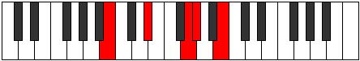

# Mode AFlatDygic

## Links

- [Documentation](README.md)
- [Scales Index](Scales.md)
- [Modes Index](Modes.md)
- [Chords Index](Chords.md)

## Scale

[Aeoloric](ScaleAeoloric.md)

## Mode

[AFlatDygic](ModeAFlatDygic.md)

## Tonic

Ab

## Signature

[CNaturalMajor]

## Transposition

3, 4, 4, 1

## Chord Pattern

## Perfection

 - 1 Perfect Notes

 - 3 Imperfect Notes

## Notes

- Ab
- B (Imperfect)
- Eb (Imperfect)
- G (Imperfect)
- Ab

## Illustration

## Diagram

## Relative Modes

| Number | Mode | Tonic | Notes | Illustration |
|--------|------|-------|-------|--------------|
| [2185](https://ianring.com/musictheory/scales/2185) | [Dygic](ModeDygic.md) | G# | G#, B, D#, G, G# |  |
| [2185](https://ianring.com/musictheory/scales/2185) | [Dygic](ModeDygic.md) | Ab | Ab, B, Eb, G, Ab |  |
| [785](https://ianring.com/musictheory/scales/785) | [Aeoloric](ModeAeoloric.md) | B | B, D#, G, G#, B |  |
| [305](https://ianring.com/musictheory/scales/305) | [Gonic](ModeGonic.md) | D# | D#, G, G#, B, D# |  |
| [305](https://ianring.com/musictheory/scales/305) | [Gonic](ModeGonic.md) | Eb | Eb, G, Ab, B, Eb |  |
| [275](https://ianring.com/musictheory/scales/275) | [Dalic](ModeDalic.md) | G | G, G#, B, D#, G |  |
## Relative Brightness

| Number | Mode | Tonic | Notes | Illustration |
|--------|------|-------|-------|--------------|
| [2185](https://ianring.com/musictheory/scales/2185) | [Dygic](ModeDygic.md) | G# | G#, B, D#, G, G# |  |
| [2185](https://ianring.com/musictheory/scales/2185) | [Dygic](ModeDygic.md) | Ab | Ab, B, Eb, G, Ab |  |
| [785](https://ianring.com/musictheory/scales/785) | [Aeoloric](ModeAeoloric.md) | B | B, D#, G, G#, B |  |
| [305](https://ianring.com/musictheory/scales/305) | [Gonic](ModeGonic.md) | D# | D#, G, G#, B, D# |  |
| [305](https://ianring.com/musictheory/scales/305) | [Gonic](ModeGonic.md) | Eb | Eb, G, Ab, B, Eb |  |
| [275](https://ianring.com/musictheory/scales/275) | [Dalic](ModeDalic.md) | G | G, G#, B, D#, G |  |

## Chords

### Ab

| Number | Root | Name | Notes | Illustration | Audio |
|--------|------|------|-------|--------------|-------|
| 264 | Ab | [G#5](ChordGSharpPowerChord.md) | G#, D# |  | [midi](ChordGSharpPowerChordRootPosition.mid) |
| 264 | Ab | [Ab5](ChordAFlatPowerChord.md) | Ab, Eb |  | [midi](ChordAFlatPowerChordRootPosition.mid) |
| 2312 | Ab | [G#m](ChordGSharpMinor.md) | G#, B, D# |  | [midi](ChordGSharpMinorRootPosition.mid) |
| 2312 | Ab | [G#m(add(#9))](ChordGSharpMinorAddSharpNinth.md) | G#, B, D#, A## |  | [midi](ChordGSharpMinorAddSharpNinthRootPosition.mid) |
| 2312 | Ab | [Abm](ChordAFlatMinor.md) | Ab, Cb, Eb |  | [midi](ChordAFlatMinorRootPosition.mid) |
| 2312 | Ab | [Abm(add(#9))](ChordAFlatMinorAddSharpNinth.md) | Ab, Cb, Eb, B |  | [midi](ChordAFlatMinorAddSharpNinthRootPosition.mid) |
| 2440 | Ab | [G#m(M7)](ChordGSharpMinorMajorSeventh.md) | G#, B, D#, F## |  | [midi](ChordGSharpMinorMajorSeventhRootPosition.mid) |
| 2440 | Ab | [Abm(M7)](ChordAFlatMinorMajorSeventh.md) | Ab, Cb, Eb, G |  | [midi](ChordAFlatMinorMajorSeventhRootPosition.mid) |

### B

| Number | Root | Name | Notes | Illustration | Audio |
|--------|------|------|-------|--------------|-------|
| 2184 | B | [B+](ChordBNaturalAugmented.md) | B, D#, F## |  | [midi](ChordBNaturalAugmentedRootPosition.mid) |
| 2184 | B | [B+7](ChordBNaturalAugmentedAugmentedSeventh.md) | B, D#, F##, A## |  | [midi](ChordBNaturalAugmentedAugmentedSeventhRootPosition.mid) |
| 2312 | B | [BM##5](ChordBNaturalMajorDoubleSharpFifth.md) | B, D#, G# |  | [midi](ChordBNaturalMajorDoubleSharpFifthRootPosition.mid) |

### Eb

| Number | Root | Name | Notes | Illustration | Audio |
|--------|------|------|-------|--------------|-------|
| 2184 | Eb | [D#+](ChordDSharpAugmented.md) | D#, F##, A## |  | [midi](ChordDSharpAugmentedRootPosition.mid) |
| 2184 | Eb | [D#+7](ChordDSharpAugmentedAugmentedSeventh.md) | D#, F##, A##, C### |  | [midi](ChordDSharpAugmentedAugmentedSeventhRootPosition.mid) |
| 2184 | Eb | [Eb+](ChordEFlatAugmented.md) | Eb, G, B |  | [midi](ChordEFlatAugmentedRootPosition.mid) |
| 2184 | Eb | [Eb+7](ChordEFlatAugmentedAugmentedSeventh.md) | Eb, G, B, D# |  | [midi](ChordEFlatAugmentedAugmentedSeventhRootPosition.mid) |
| 2312 | Eb | [D#sus4#5](ChordDSharpSuspendedFourthSharpFifth.md) | D#, G#, A## |  | [midi](ChordDSharpSuspendedFourthSharpFifthRootPosition.mid) |
| 2312 | Eb | [Ebsus4#5](ChordEFlatSuspendedFourthSharpFifth.md) | Eb, Ab, B |  | [midi](ChordEFlatSuspendedFourthSharpFifthRootPosition.mid) |

### G

| Number | Root | Name | Notes | Illustration | Audio |
|--------|------|------|-------|--------------|-------|
| 2184 | G | [G+](ChordGNaturalAugmented.md) | G, B, D# |  | [midi](ChordGNaturalAugmentedRootPosition.mid) |
| 2184 | G | [G+7](ChordGNaturalAugmentedAugmentedSeventh.md) | G, B, D#, F## |  | [midi](ChordGNaturalAugmentedAugmentedSeventhRootPosition.mid) |

