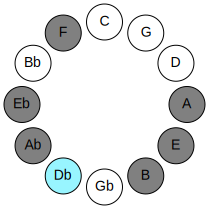

# Mode AFlatDyptian

## Links

- [Documentation](README.md)
- [Scales Index](Scales.md)
- [Modes Index](Modes.md)
- [Chords Index](Chords.md)

## Parent Scale

[Golian](ScaleGolian.md)

## Mode

[Dyptian](ModeDyptian.md)

## Number

939

## Luminosity

-1

## Tonic

Ab

## Signature

C

## Transposition

1, 2, 2, 2, 1, 1, 3

## Chord Pattern

i, II, IIIb5, iv, v⁰b3, VI, VII⁺

## Perfection

 - 4 Perfect Notes

 - 3 Imperfect Notes

 - Perfection Profile - true, true, false, true, false, true, false

## Notes

- Ab
- Bbb
- Cb (Imperfect)
- Db
- Eb (Imperfect)
- Fb
- Gbb (Imperfect)
- Ab

## Illustration

## Diagram

| Circle of Fifth | Chromatic Circle |
|-----------------|------------------|
|  |  |
## Relative Modes

| Number | Mode | Luminosity | Tonic | Notes | Illustration |
|--------|------|------------|-------|-------|--------------|
| [939](https://ianring.com/musictheory/scales/939) | [Dyptian](ModeDyptian.md) | -1 | G# | G#, A, B, C#, D#, E, F, G# |  |
| [2517](https://ianring.com/musictheory/scales/2517) | [Ryphian](ModeRyphian.md) | -1 | A | A, B, C#, D#, E, F, G#, A |  |
| [1653](https://ianring.com/musictheory/scales/1653) | [Gylian](ModeGylian.md) | -1 | B | B, C#, D#, E, F, G#, A, B |  |
| [1437](https://ianring.com/musictheory/scales/1437) | [Aeolycrian](ModeAeolycrian.md) | -1 | C# | C#, D#, E, F, G#, A, B, C# |  |
| [1383](https://ianring.com/musictheory/scales/1383) | [Pynian](ModePynian.md) | -1 | D# | D#, E, F, G#, A, B, C#, D# |  |
| [2739](https://ianring.com/musictheory/scales/2739) | [Zanian](ModeZanian.md) | 6 | E | E, F, G#, A, B, C#, D#, E |  |
| [3417](https://ianring.com/musictheory/scales/3417) | [Golian](ModeGolian.md) | -1 | F | F, G#, A, B, C#, D#, E, F |  |
## Relative Brightness

| Number | Mode | Luminosity | Tonic | Notes | Circle Of Fifth | Chromatic Circle |
|--------|------|------------|-------|-------|-----------------|------------------|
| [939](https://ianring.com/musictheory/scales/939) | [Dyptian](ModeDyptian.md) | 6 | G# | G#, A, B, C#, D#, E, F, G# |  |  |
| [2517](https://ianring.com/musictheory/scales/2517) | [Ryphian](ModeRyphian.md) | 7 | A | A, B, C#, D#, E, F, G#, A |  |  |
| [1653](https://ianring.com/musictheory/scales/1653) | [Gylian](ModeGylian.md) | 5 | B | B, C#, D#, E, F, G#, A, B |  |  |
| [1437](https://ianring.com/musictheory/scales/1437) | [Aeolycrian](ModeAeolycrian.md) | 7 | C# | C#, D#, E, F, G#, A, B, C# |  |  |
| [1383](https://ianring.com/musictheory/scales/1383) | [Pynian](ModePynian.md) | -1 | D# | D#, E, F, G#, A, B, C#, D# |  |  |
| [2739](https://ianring.com/musictheory/scales/2739) | [Zanian](ModeZanian.md) | 6 | E | E, F, G#, A, B, C#, D#, E |  |  |
| [3417](https://ianring.com/musictheory/scales/3417) | [Golian](ModeGolian.md) | -1 | F | F, G#, A, B, C#, D#, E, F |  |  |

## Chords

### Ab

| Number | Root | Name | Notes | Illustration | Audio |
|--------|------|------|-------|--------------|-------|
| 2306 | Ab | [G#mbb5](ChordGSharpMinorDoubleFlatFifth.md) | G#, B, C# |  | [midi](ChordGSharpMinorDoubleFlatFifthRootPosition.mid) |
| 2306 | Ab | [Abmbb5](ChordAFlatMinorDoubleFlatFifth.md) | Ab, Cb, Db |  | [midi](ChordAFlatMinorDoubleFlatFifthRootPosition.mid) |
| 264 | Ab | [G#5](ChordGSharpPowerChord.md) | G#, D# |  | [midi](ChordGSharpPowerChordRootPosition.mid) |
| 264 | Ab | [Ab5](ChordAFlatPowerChord.md) | Ab, Eb |  | [midi](ChordAFlatPowerChordRootPosition.mid) |
| 776 | Ab | [G#phryg](ChordGSharpPhrygian.md) | G#, A, D# |  | [midi](ChordGSharpPhrygianRootPosition.mid) |
| 776 | Ab | [Abphryg](ChordAFlatPhrygian.md) | Ab, Bbb, Eb |  | [midi](ChordAFlatPhrygianRootPosition.mid) |
| 2312 | Ab | [G#m](ChordGSharpMinor.md) | G#, B, D# |  | [midi](ChordGSharpMinorRootPosition.mid) |
| 2312 | Ab | [G#m(add(#9))](ChordGSharpMinorAddSharpNinth.md) | G#, B, D#, A## |  | [midi](ChordGSharpMinorAddSharpNinthRootPosition.mid) |
| 2312 | Ab | [Abm](ChordAFlatMinor.md) | Ab, Cb, Eb |  | [midi](ChordAFlatMinorRootPosition.mid) |
| 2312 | Ab | [Abm(add(#9))](ChordAFlatMinorAddSharpNinth.md) | Ab, Cb, Eb, B |  | [midi](ChordAFlatMinorAddSharpNinthRootPosition.mid) |
| 266 | Ab | [G#sus4](ChordGSharpSuspendedFourth.md) | G#, C#, D# |  | [midi](ChordGSharpSuspendedFourthRootPosition.mid) |
| 266 | Ab | [Absus4](ChordAFlatSuspendedFourth.md) | Ab, Db, Eb |  | [midi](ChordAFlatSuspendedFourthRootPosition.mid) |
| 2314 | Ab | [G#m(add11)](ChordGSharpMinorAddEleventh.md) | G#, B, D#, C# |  | [midi](ChordGSharpMinorAddEleventhRootPosition.mid) |
| 2314 | Ab | [G#m(add4)](ChordGSharpMinorAddFourth.md) | G#, B, C#, D# |  | [midi](ChordGSharpMinorAddFourthRootPosition.mid) |
| 2314 | Ab | [Abm(add11)](ChordAFlatMinorAddEleventh.md) | Ab, Cb, Eb, Db |  | [midi](ChordAFlatMinorAddEleventhRootPosition.mid) |
| 2314 | Ab | [Abm(add4)](ChordAFlatMinorAddFourth.md) | Ab, Cb, Db, Eb |  | [midi](ChordAFlatMinorAddFourthRootPosition.mid) |
| 2320 | Ab | [G#m#5](ChordGSharpMinorSharpFifth.md) | G#, B, E |  | [midi](ChordGSharpMinorSharpFifthRootPosition.mid) |
| 2320 | Ab | [Abm#5](ChordAFlatMinorSharpFifth.md) | Ab, Cb, Fb |  | [midi](ChordAFlatMinorSharpFifthRootPosition.mid) |
| 274 | Ab | [G#sus4#5](ChordGSharpSuspendedFourthSharpFifth.md) | G#, C#, D## |  | [midi](ChordGSharpSuspendedFourthSharpFifthRootPosition.mid) |
| 274 | Ab | [Absus4#5](ChordAFlatSuspendedFourthSharpFifth.md) | Ab, Db, E |  | [midi](ChordAFlatSuspendedFourthSharpFifthRootPosition.mid) |
| 290 | Ab | [G#sus4##5](ChordGSharpSuspendedFourthDoubleSharpFifth.md) | G#, C#, E# |  | [midi](ChordGSharpSuspendedFourthDoubleSharpFifthRootPosition.mid) |
| 290 | Ab | [Absus4##5](ChordAFlatSuspendedFourthDoubleSharpFifth.md) | Ab, Db, F |  | [midi](ChordAFlatSuspendedFourthDoubleSharpFifthRootPosition.mid) |
| 2344 | Ab | [G#m6](ChordGSharpMinorSixth.md) | G#, B, D#, E# |  | [midi](ChordGSharpMinorSixthRootPosition.mid) |
| 2344 | Ab | [Abm6](ChordAFlatMinorSixth.md) | Ab, Cb, Eb, F |  | [midi](ChordAFlatMinorSixthRootPosition.mid) |
| 2856 | Ab | [G#m6(addb9)](ChordGSharpMinorSixthAddFlatNinth.md) | G#, B, D#, E#, A |  | [midi](ChordGSharpMinorSixthAddFlatNinthRootPosition.mid) |
| 2856 | Ab | [Abm6(addb9)](ChordAFlatMinorSixthAddFlatNinth.md) | Ab, Cb, Eb, F, Bbb |  | [midi](ChordAFlatMinorSixthAddFlatNinthRootPosition.mid) |
| 298 | Ab | [G#M6sus4](ChordGSharpMajorSixthSuspendedFourth.md) | G#, C#, D#, E# |  | [midi](ChordGSharpMajorSixthSuspendedFourthRootPosition.mid) |
| 298 | Ab | [AbM6sus4](ChordAFlatMajorSixthSuspendedFourth.md) | Ab, Db, Eb, F |  | [midi](ChordAFlatMajorSixthSuspendedFourthRootPosition.mid) |

### Bbb

| Number | Root | Name | Notes | Illustration | Audio |
|--------|------|------|-------|--------------|-------|
| 2568 | Bbb | [A](ChordANaturalDiminishedFlatThird.md) | A, Cb, Eb |  | [midi](ChordANaturalDiminishedFlatThirdRootPosition.mid) |
| 2568 | Bbb | [Asus2b5](ChordANaturalSuspendedSecondFlatFifth.md) | A, B, Eb |  | [midi](ChordANaturalSuspendedSecondFlatFifthRootPosition.mid) |
| 522 | Bbb | [AMb5](ChordANaturalMajorFlatFifth.md) | A, C#, Eb |  | [midi](ChordANaturalMajorFlatFifthRootPosition.mid) |
| 528 | Bbb | [A5](ChordANaturalPowerChord.md) | A, E |  | [midi](ChordANaturalPowerChordRootPosition.mid) |
| 2576 | Bbb | [Asus2](ChordANaturalSuspendedSecond.md) | A, B, E |  | [midi](ChordANaturalSuspendedSecondRootPosition.mid) |
| 530 | Bbb | [AM](ChordANaturalMajor.md) | A, C#, E |  | [midi](ChordANaturalMajorRootPosition.mid) |
| 2578 | Bbb | [AM(add9)](ChordANaturalMajorAddNinth.md) | A, C#, E, B |  | [midi](ChordANaturalMajorAddNinthRootPosition.mid) |
| 536 | Bbb | [Alyd](ChordANaturalLydian.md) | A, D#, E |  | [midi](ChordANaturalLydianRootPosition.mid) |
| 538 | Bbb | [AM(add(#4))](ChordANaturalMajorAddSharpFourth.md) | A, C#, D#, E |  | [midi](ChordANaturalMajorAddSharpFourthRootPosition.mid) |
| 2592 | Bbb | [Asus2#5](ChordANaturalSuspendedSecondSharpFifth.md) | A, B, E# |  | [midi](ChordANaturalSuspendedSecondSharpFifthRootPosition.mid) |
| 546 | Bbb | [A+](ChordANaturalAugmented.md) | A, C#, E# |  | [midi](ChordANaturalAugmentedRootPosition.mid) |
| 546 | Bbb | [A+7](ChordANaturalAugmentedAugmentedSeventh.md) | A, C#, E#, G## |  | [midi](ChordANaturalAugmentedAugmentedSeventhRootPosition.mid) |
| 2600 | Bbb | [Asus2b5add(#5)](ChordANaturalSuspendedSecondFlatFifthAddSharpFifth.md) | A, B, Eb, E# |  | [midi](ChordANaturalSuspendedSecondFlatFifthAddSharpFifthRootPosition.mid) |
| 778 | Bbb | [AM7b5](ChordANaturalMajorSeventhFlatFifth.md) | A, C#, Eb, G# |  | [midi](ChordANaturalMajorSeventhFlatFifthRootPosition.mid) |
| 2832 | Bbb | [AM7(sus2)](ChordANaturalMajorSeventhSuspendedSecond.md) | A, B, E, G# |  | [midi](ChordANaturalMajorSeventhSuspendedSecondRootPosition.mid) |
| 2832 | Bbb | [AM9sus2](ChordANaturalMajorNinthSuspendedSecond.md) | A, B, E, G#, B |  | [midi](ChordANaturalMajorNinthSuspendedSecondRootPosition.mid) |
| 786 | Bbb | [AM7](ChordANaturalMajorSeventh.md) | A, C#, E, G# |  | [midi](ChordANaturalMajorSeventhRootPosition.mid) |
| 2834 | Bbb | [AM9](ChordANaturalMajorNinth.md) | A, C#, E, G#, B |  | [midi](ChordANaturalMajorNinthRootPosition.mid) |
| 792 | Bbb | [Alyd(M7)](ChordANaturalLydianMajorSeventh.md) | A, D#, E, G# |  | [midi](ChordANaturalLydianMajorSeventhRootPosition.mid) |
| 794 | Bbb | [AM7add(#11)](ChordANaturalMajorSeventhAddSharpEleventh.md) | A, C#, E, G#, D# |  | [midi](ChordANaturalMajorSeventhAddSharpEleventhRootPosition.mid) |
| 794 | Bbb | [AM7add(#4)](ChordANaturalMajorSeventhAddSharpFourth.md) | A, C#, D#, E, G# |  | [midi](ChordANaturalMajorSeventhAddSharpFourthRootPosition.mid) |
| 802 | Bbb | [A+(M7)](ChordANaturalAugmentedMajorSeventh.md) | A, C#, E#, G# |  | [midi](ChordANaturalAugmentedMajorSeventhRootPosition.mid) |

### Cb

| Number | Root | Name | Notes | Illustration | Audio |
|--------|------|------|-------|--------------|-------|
| 2066 | Cb | [Bsus2bb5](ChordBNaturalSuspendedSecondDoubleFlatFifth.md) | B, C#, E |  | [midi](ChordBNaturalSuspendedSecondDoubleFlatFifthRootPosition.mid) |
| 2082 | Cb | [B](ChordBNaturalDiminishedFlatThird.md) | B, Db, F |  | [midi](ChordBNaturalDiminishedFlatThirdRootPosition.mid) |
| 2082 | Cb | [Bsus2b5](ChordBNaturalSuspendedSecondFlatFifth.md) | B, C#, F |  | [midi](ChordBNaturalSuspendedSecondFlatFifthRootPosition.mid) |
| 2088 | Cb | [BMb5](ChordBNaturalMajorFlatFifth.md) | B, D#, F |  | [midi](ChordBNaturalMajorFlatFifthRootPosition.mid) |
| 2096 | Cb | [Bsus4b5](ChordBNaturalSuspendedFourthFlatFifth.md) | B, E, F |  | [midi](ChordBNaturalSuspendedFourthFlatFifthRootPosition.mid) |
| 2312 | Cb | [BM##5](ChordBNaturalMajorDoubleSharpFifth.md) | B, D#, G# |  | [midi](ChordBNaturalMajorDoubleSharpFifthRootPosition.mid) |
| 2320 | Cb | [Bsus4##5](ChordBNaturalSuspendedFourthDoubleSharpFifth.md) | B, E, G# |  | [midi](ChordBNaturalSuspendedFourthDoubleSharpFifthRootPosition.mid) |
| 2322 | Cb | [BM6sus2bb5](ChordBNaturalMajorSixthSuspendedSecondDoubleFlatFifth.md) | B, C#, E, G# |  | [midi](ChordBNaturalMajorSixthSuspendedSecondDoubleFlatFifthRootPosition.mid) |
| 2338 | Cb | [BM6sus2b5](ChordBNaturalMajorSixthSuspendedSecondFlatFifth.md) | B, C#, F, G# |  | [midi](ChordBNaturalMajorSixthSuspendedSecondFlatFifthRootPosition.mid) |
| 2344 | Cb | [BM6b5](ChordBNaturalMajorSixthFlatFifth.md) | B, D#, F, G# |  | [midi](ChordBNaturalMajorSixthFlatFifthRootPosition.mid) |
| 2576 | Cb | [BQ](ChordBNaturalQuartal.md) | B, E, A |  | [midi](ChordBNaturalQuartalRootPosition.mid) |
| 2600 | Cb | [B7b5](ChordBNaturalDominantSeventhFlatFifth.md) | B, D#, F, A |  | [midi](ChordBNaturalDominantSeventhFlatFifthRootPosition.mid) |

### Db

| Number | Root | Name | Notes | Illustration | Audio |
|--------|------|------|-------|--------------|-------|
| 258 | Db | [C#5](ChordCSharpPowerChord.md) | C#, G# |  | [midi](ChordCSharpPowerChordRootPosition.mid) |
| 258 | Db | [Db5](ChordDFlatPowerChord.md) | Db, Ab |  | [midi](ChordDFlatPowerChordRootPosition.mid) |
| 266 | Db | [C#sus2](ChordCSharpSuspendedSecond.md) | C#, D#, G# |  | [midi](ChordCSharpSuspendedSecondRootPosition.mid) |
| 266 | Db | [Dbsus2](ChordDFlatSuspendedSecond.md) | Db, Eb, Ab |  | [midi](ChordDFlatSuspendedSecondRootPosition.mid) |
| 274 | Db | [C#m](ChordCSharpMinor.md) | C#, E, G# |  | [midi](ChordCSharpMinorRootPosition.mid) |
| 274 | Db | [C#m(add(#9))](ChordCSharpMinorAddSharpNinth.md) | C#, E, G#, D## |  | [midi](ChordCSharpMinorAddSharpNinthRootPosition.mid) |
| 274 | Db | [Dbm](ChordDFlatMinor.md) | Db, Fb, Ab |  | [midi](ChordDFlatMinorRootPosition.mid) |
| 274 | Db | [Dbm(add(#9))](ChordDFlatMinorAddSharpNinth.md) | Db, Fb, Ab, E |  | [midi](ChordDFlatMinorAddSharpNinthRootPosition.mid) |
| 282 | Db | [C#m(add9)](ChordCSharpMinorAddNinth.md) | C#, E, G#, D# |  | [midi](ChordCSharpMinorAddNinthRootPosition.mid) |
| 282 | Db | [Dbm(add9)](ChordDFlatMinorAddNinth.md) | Db, Fb, Ab, Eb |  | [midi](ChordDFlatMinorAddNinthRootPosition.mid) |
| 290 | Db | [C#M](ChordCSharpMajor.md) | C#, E#, G# |  | [midi](ChordCSharpMajorRootPosition.mid) |
| 290 | Db | [DbM](ChordDFlatMajor.md) | Db, F, Ab |  | [midi](ChordDFlatMajorRootPosition.mid) |
| 298 | Db | [C#M(add9)](ChordCSharpMajorAddNinth.md) | C#, E#, G#, D# |  | [midi](ChordCSharpMajorAddNinthRootPosition.mid) |
| 298 | Db | [DbM(add9)](ChordDFlatMajorAddNinth.md) | Db, F, Ab, Eb |  | [midi](ChordDFlatMajorAddNinthRootPosition.mid) |
| 306 | Db | [C#M(add(#9))](ChordCSharpMajorAddSharpNinth.md) | C#, E#, G#, D## |  | [midi](ChordCSharpMajorAddSharpNinthRootPosition.mid) |
| 306 | Db | [DbM(add(#9))](ChordDFlatMajorAddSharpNinth.md) | Db, F, Ab, E |  | [midi](ChordDFlatMajorAddSharpNinthRootPosition.mid) |
| 522 | Db | [C#sus2#5](ChordCSharpSuspendedSecondSharpFifth.md) | C#, D#, G## |  | [midi](ChordCSharpSuspendedSecondSharpFifthRootPosition.mid) |
| 522 | Db | [Dbsus2#5](ChordDFlatSuspendedSecondSharpFifth.md) | Db, Eb, A |  | [midi](ChordDFlatSuspendedSecondSharpFifthRootPosition.mid) |
| 530 | Db | [C#m#5](ChordCSharpMinorSharpFifth.md) | C#, E, A |  | [midi](ChordCSharpMinorSharpFifthRootPosition.mid) |
| 530 | Db | [Dbm#5](ChordDFlatMinorSharpFifth.md) | Db, Fb, Bbb |  | [midi](ChordDFlatMinorSharpFifthRootPosition.mid) |
| 546 | Db | [C#+](ChordCSharpAugmented.md) | C#, E#, G## |  | [midi](ChordCSharpAugmentedRootPosition.mid) |
| 546 | Db | [C#+7](ChordCSharpAugmentedAugmentedSeventh.md) | C#, E#, G##, B## |  | [midi](ChordCSharpAugmentedAugmentedSeventhRootPosition.mid) |
| 546 | Db | [Db+](ChordDFlatAugmented.md) | Db, F, A |  | [midi](ChordDFlatAugmentedRootPosition.mid) |
| 546 | Db | [Db+7](ChordDFlatAugmentedAugmentedSeventh.md) | Db, F, A, C# |  | [midi](ChordDFlatAugmentedAugmentedSeventhRootPosition.mid) |
| 2314 | Db | [C#7sus2](ChordCSharpDominantSeventhSuspendedSecond.md) | C#, D#, G#, B |  | [midi](ChordCSharpDominantSeventhSuspendedSecondRootPosition.mid) |
| 2314 | Db | [C#9sus2](ChordCSharpDominantNinthSuspendedSecond.md) | C#, D#, G#, B, D# |  | [midi](ChordCSharpDominantNinthSuspendedSecondRootPosition.mid) |
| 2314 | Db | [Db7sus2](ChordDFlatDominantSeventhSuspendedSecond.md) | Db, Eb, Ab, Cb |  | [midi](ChordDFlatDominantSeventhSuspendedSecondRootPosition.mid) |
| 2314 | Db | [Db9sus2](ChordDFlatDominantNinthSuspendedSecond.md) | Db, Eb, Ab, Cb, Eb |  | [midi](ChordDFlatDominantNinthSuspendedSecondRootPosition.mid) |
| 2322 | Db | [C#m7](ChordCSharpMinorSeventh.md) | C#, E, G#, B |  | [midi](ChordCSharpMinorSeventhRootPosition.mid) |
| 2322 | Db | [Dbm7](ChordDFlatMinorSeventh.md) | Db, Fb, Ab, Cb |  | [midi](ChordDFlatMinorSeventhRootPosition.mid) |
| 2330 | Db | [C#m9](ChordCSharpMinorNinth.md) | C#, E, G#, B, D# |  | [midi](ChordCSharpMinorNinthRootPosition.mid) |
| 2330 | Db | [Dbm9](ChordDFlatMinorNinth.md) | Db, Fb, Ab, Cb, Eb |  | [midi](ChordDFlatMinorNinthRootPosition.mid) |
| 2338 | Db | [C#7](ChordCSharpDominantSeventh.md) | C#, E#, G#, B |  | [midi](ChordCSharpDominantSeventhRootPosition.mid) |
| 2338 | Db | [Db7](ChordDFlatDominantSeventh.md) | Db, F, Ab, Cb |  | [midi](ChordDFlatDominantSeventhRootPosition.mid) |
| 2346 | Db | [C#9](ChordCSharpDominantNinth.md) | C#, E#, G#, B, D# |  | [midi](ChordCSharpDominantNinthRootPosition.mid) |
| 2346 | Db | [Db9](ChordDFlatDominantNinth.md) | Db, F, Ab, Cb, Eb |  | [midi](ChordDFlatDominantNinthRootPosition.mid) |
| 2354 | Db | [C#7#9](ChordCSharpDominantSeventhSharpNinth.md) | C#, E#, G#, B, D## |  | [midi](ChordCSharpDominantSeventhSharpNinthRootPosition.mid) |
| 2354 | Db | [Db7#9](ChordDFlatDominantSeventhSharpNinth.md) | Db, F, Ab, Cb, E |  | [midi](ChordDFlatDominantSeventhSharpNinthRootPosition.mid) |
| 2578 | Db | [C#m7#5](ChordCSharpMinorSeventhSharpFifth.md) | C#, E, G##, B |  | [midi](ChordCSharpMinorSeventhSharpFifthRootPosition.mid) |
| 2578 | Db | [Dbm7#5](ChordDFlatMinorSeventhSharpFifth.md) | Db, Fb, A, Cb |  | [midi](ChordDFlatMinorSeventhSharpFifthRootPosition.mid) |
| 2858 | Db | [C#9b13](ChordCSharpDominantNinthFlatThirteenth.md) | C#, E#, G#, B, D#, A |  | [midi](ChordCSharpDominantNinthFlatThirteenthRootPosition.mid) |
| 2858 | Db | [Db9b13](ChordDFlatDominantNinthFlatThirteenth.md) | Db, F, Ab, Cb, Eb, Bbb |  | [midi](ChordDFlatDominantNinthFlatThirteenthRootPosition.mid) |

### Eb

| Number | Root | Name | Notes | Illustration | Audio |
|--------|------|------|-------|--------------|-------|
| 296 | Eb | [D#sus2bb5](ChordDSharpSuspendedSecondDoubleFlatFifth.md) | D#, E#, G# |  | [midi](ChordDSharpSuspendedSecondDoubleFlatFifthRootPosition.mid) |
| 296 | Eb | [Ebsus2bb5](ChordEFlatSuspendedSecondDoubleFlatFifth.md) | Eb, F, Ab |  | [midi](ChordEFlatSuspendedSecondDoubleFlatFifthRootPosition.mid) |
| 536 | Eb | [D#loc](ChordDSharpLocrian.md) | D#, E, A |  | [midi](ChordDSharpLocrianRootPosition.mid) |
| 536 | Eb | [Ebloc](ChordEFlatLocrian.md) | Eb, Fb, Bbb |  | [midi](ChordEFlatLocrianRootPosition.mid) |
| 552 | Eb | [D#](ChordDSharpDiminishedFlatThird.md) | D#, F, A |  | [midi](ChordDSharpDiminishedFlatThirdRootPosition.mid) |
| 552 | Eb | [D#sus2b5](ChordDSharpSuspendedSecondFlatFifth.md) | D#, E#, A |  | [midi](ChordDSharpSuspendedSecondFlatFifthRootPosition.mid) |
| 552 | Eb | [Eb](ChordEFlatDiminishedFlatThird.md) | Eb, Gbb, Bbb |  | [midi](ChordEFlatDiminishedFlatThirdRootPosition.mid) |
| 552 | Eb | [Ebsus2b5](ChordEFlatSuspendedSecondFlatFifth.md) | Eb, F, Bbb |  | [midi](ChordEFlatSuspendedSecondFlatFifthRootPosition.mid) |
| 776 | Eb | [D#sus4b5](ChordDSharpSuspendedFourthFlatFifth.md) | D#, G#, A |  | [midi](ChordDSharpSuspendedFourthFlatFifthRootPosition.mid) |
| 776 | Eb | [Ebsus4b5](ChordEFlatSuspendedFourthFlatFifth.md) | Eb, Ab, Bbb |  | [midi](ChordEFlatSuspendedFourthFlatFifthRootPosition.mid) |
| 2088 | Eb | [D#sus2#5](ChordDSharpSuspendedSecondSharpFifth.md) | D#, E#, A## |  | [midi](ChordDSharpSuspendedSecondSharpFifthRootPosition.mid) |
| 2088 | Eb | [Ebsus2#5](ChordEFlatSuspendedSecondSharpFifth.md) | Eb, F, B |  | [midi](ChordEFlatSuspendedSecondSharpFifthRootPosition.mid) |
| 2312 | Eb | [D#sus4#5](ChordDSharpSuspendedFourthSharpFifth.md) | D#, G#, A## |  | [midi](ChordDSharpSuspendedFourthSharpFifthRootPosition.mid) |
| 2312 | Eb | [Ebsus4#5](ChordEFlatSuspendedFourthSharpFifth.md) | Eb, Ab, B |  | [midi](ChordEFlatSuspendedFourthSharpFifthRootPosition.mid) |
| 2600 | Eb | [D#sus2b5add(#5)](ChordDSharpSuspendedSecondFlatFifthAddSharpFifth.md) | D#, E#, A, A## |  | [midi](ChordDSharpSuspendedSecondFlatFifthAddSharpFifthRootPosition.mid) |
| 2600 | Eb | [Ebsus2b5add(#5)](ChordEFlatSuspendedSecondFlatFifthAddSharpFifth.md) | Eb, F, Bbb, B |  | [midi](ChordEFlatSuspendedSecondFlatFifthAddSharpFifthRootPosition.mid) |
| 266 | Eb | [D#Q](ChordDSharpQuartal.md) | D#, G#, C# |  | [midi](ChordDSharpQuartalRootPosition.mid) |
| 266 | Eb | [EbQ](ChordEFlatQuartal.md) | Eb, Ab, Db |  | [midi](ChordEFlatQuartalRootPosition.mid) |

### Fb

| Number | Root | Name | Notes | Illustration | Audio |
|--------|------|------|-------|--------------|-------|
| 2064 | Fb | [E5](ChordENaturalPowerChord.md) | E, B |  | [midi](ChordENaturalPowerChordRootPosition.mid) |
| 2096 | Fb | [Ephryg](ChordENaturalPhrygian.md) | E, F, B |  | [midi](ChordENaturalPhrygianRootPosition.mid) |
| 2320 | Fb | [EM](ChordENaturalMajor.md) | E, G#, B |  | [midi](ChordENaturalMajorRootPosition.mid) |
| 2576 | Fb | [Esus4](ChordENaturalSuspendedFourth.md) | E, A, B |  | [midi](ChordENaturalSuspendedFourthRootPosition.mid) |
| 2832 | Fb | [EM(add11)](ChordENaturalMajorAddEleventh.md) | E, G#, B, A |  | [midi](ChordENaturalMajorAddEleventhRootPosition.mid) |
| 2832 | Fb | [EM(add4)](ChordENaturalMajorAddFourth.md) | E, G#, A, B |  | [midi](ChordENaturalMajorAddFourthRootPosition.mid) |
| 274 | Fb | [EM##5](ChordENaturalMajorDoubleSharpFifth.md) | E, G#, C# |  | [midi](ChordENaturalMajorDoubleSharpFifthRootPosition.mid) |
| 530 | Fb | [Esus4##5](ChordENaturalSuspendedFourthDoubleSharpFifth.md) | E, A, C# |  | [midi](ChordENaturalSuspendedFourthDoubleSharpFifthRootPosition.mid) |
| 2322 | Fb | [EM6](ChordENaturalMajorSixth.md) | E, G#, B, C# |  | [midi](ChordENaturalMajorSixthRootPosition.mid) |
| 2354 | Fb | [EM6(addb9)](ChordENaturalMajorSixthAddFlatNinth.md) | E, G#, B, C#, F |  | [midi](ChordENaturalMajorSixthAddFlatNinthRootPosition.mid) |
| 2578 | Fb | [EM6sus4](ChordENaturalMajorSixthSuspendedFourth.md) | E, A, B, C# |  | [midi](ChordENaturalMajorSixthSuspendedFourthRootPosition.mid) |
| 536 | Fb | [EQ+](ChordENaturalQuartalAugmented.md) | E, A, D# |  | [midi](ChordENaturalQuartalAugmentedRootPosition.mid) |
| 2104 | Fb | [Ephryg+7](ChordENaturalPhrygianAddSeventh.md) | E, F, B, D# |  | [midi](ChordENaturalPhrygianAddSeventhRootPosition.mid) |
| 2328 | Fb | [EM7](ChordENaturalMajorSeventh.md) | E, G#, B, D# |  | [midi](ChordENaturalMajorSeventhRootPosition.mid) |
| 2584 | Fb | [EM7(sus4)](ChordENaturalMajorSeventhSuspendedFourth.md) | E, A, B, D# |  | [midi](ChordENaturalMajorSeventhSuspendedFourthRootPosition.mid) |
| 2840 | Fb | [EM7add4](ChordENaturalMajorSeventhAddFourth.md) | E, G#, A, B, D# |  | [midi](ChordENaturalMajorSeventhAddFourthRootPosition.mid) |
| 2840 | Fb | [EM7add11](ChordENaturalMajorSeventhAddEleventh.md) | E, G#, B, D#, A |  | [midi](ChordENaturalMajorSeventhAddEleventhRootPosition.mid) |
| 282 | Fb | [EM7##5](ChordENaturalMajorSeventhDoubleSharpFifth.md) | E, G#, C#, D# |  | [midi](ChordENaturalMajorSeventhDoubleSharpFifthRootPosition.mid) |
| 538 | Fb | [EM7(sus4)##5](ChordENaturalMajorSeventhSuspendedFourthDoubleSharpFifth.md) | E, A, C#, D# |  | [midi](ChordENaturalMajorSeventhSuspendedFourthDoubleSharpFifthRootPosition.mid) |
| 2330 | Fb | [EM7add13](ChordENaturalMajorSeventhAddThirteenth.md) | E, G#, B, D#, C# |  | [midi](ChordENaturalMajorSeventhAddThirteenthRootPosition.mid) |

### Gbb

| Number | Root | Name | Notes | Illustration | Audio |
|--------|------|------|-------|--------------|-------|
| 2336 | Gbb | [Fo](ChordFNaturalDiminished.md) | F, Ab, Cb |  | [midi](ChordFNaturalDiminishedRootPosition.mid) |
| 2592 | Gbb | [FMb5](ChordFNaturalMajorFlatFifth.md) | F, A, Cb |  | [midi](ChordFNaturalMajorFlatFifthRootPosition.mid) |
| 290 | Gbb | [Fm#5](ChordFNaturalMinorSharpFifth.md) | F, Ab, Db |  | [midi](ChordFNaturalMinorSharpFifthRootPosition.mid) |
| 546 | Gbb | [F+](ChordFNaturalAugmented.md) | F, A, C# |  | [midi](ChordFNaturalAugmentedRootPosition.mid) |
| 546 | Gbb | [F+7](ChordFNaturalAugmentedAugmentedSeventh.md) | F, A, C#, E# |  | [midi](ChordFNaturalAugmentedAugmentedSeventhRootPosition.mid) |
| 2344 | Gbb | [Fø7](ChordFNaturalHalfDiminishedSeventh.md) | F, Ab, Cb, Eb |  | [midi](ChordFNaturalHalfDiminishedSeventhRootPosition.mid) |
| 2600 | Gbb | [F7b5](ChordFNaturalDominantSeventhFlatFifth.md) | F, A, Cb, Eb |  | [midi](ChordFNaturalDominantSeventhFlatFifthRootPosition.mid) |
| 298 | Gbb | [Fm7#5](ChordFNaturalMinorSeventhSharpFifth.md) | F, Ab, C#, Eb |  | [midi](ChordFNaturalMinorSeventhSharpFifthRootPosition.mid) |
| 2352 | Gbb | [FoM7](ChordFNaturalDiminishedMajorSeventh.md) | F, Ab, Cb, E |  | [midi](ChordFNaturalDiminishedMajorSeventhRootPosition.mid) |
| 2608 | Gbb | [FM7b5](ChordFNaturalMajorSeventhFlatFifth.md) | F, A, Cb, E |  | [midi](ChordFNaturalMajorSeventhFlatFifthRootPosition.mid) |
| 562 | Gbb | [F+(M7)](ChordFNaturalAugmentedMajorSeventh.md) | F, A, C#, E |  | [midi](ChordFNaturalAugmentedMajorSeventhRootPosition.mid) |

