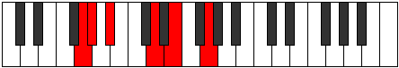

# Mode AFlatDyptitonic

## Links

- [Documentation](index.md)
- [Scales Index](Scales.md)
- [Modes Index](Modes.md)
- [Chords Index](Chords.md)

## Scale

[Phronitonic](ScalePhronitonic.md)

## Mode

[AFlatDyptitonic](ModeAFlatDyptitonic.md)

## Tonic

Ab

## Signature

[CNaturalMajor]

## Perfection

 - 1 Perfect Notes

 - 4 Imperfect Notes

## Notes

- Ab (Imperfect)
- Bb (Imperfect)
- D (Imperfect)
- E (Imperfect)
- G
- Ab (Imperfect)

## Illustration

## Relative Modes

| Number | Mode | Tonic | Notes | Illustration |
|--------|------|-------|-------|--------------|
| [357](https://ianring.com/musictheory/scales/357) | [Banitonic](ModeBanitonic.md) | D | D, E, G, G#, A#, D |  |
| [651](https://ianring.com/musictheory/scales/651) | [Golitonic](ModeGolitonic.md) | G | G, G#, A#, D, E, G |  |
| [1113](https://ianring.com/musictheory/scales/1113) | [Aeronitonic](ModeAeronitonic.md) | E | E, G, G#, A#, D, E |  |
| [1617](https://ianring.com/musictheory/scales/1617) | [Phronitonic](ModePhronitonic.md) | A# | A#, D, E, G, G#, A# |  |
| [1617](https://ianring.com/musictheory/scales/1617) | [Phronitonic](ModePhronitonic.md) | Bb | Bb, D, E, G, Ab, Bb |  |
| [2373](https://ianring.com/musictheory/scales/2373) | [Dyptitonic](ModeDyptitonic.md) | G# | G#, A#, D, E, G, G# |  |
| [2373](https://ianring.com/musictheory/scales/2373) | [Dyptitonic](ModeDyptitonic.md) | Ab | Ab, Bb, D, E, G, Ab |  |

## Chords

### Ab

| Number | Root | Name | Notes | Illustration | Audio |
|--------|------|------|-------|--------------|-------|
| 1284 | Ab | [Absus2b5](ChordAFlatSuspendedSecondFlatFifth.md) | Ab, Bb, Ebb |  | [midi](ChordAFlatSuspendedSecondFlatFifthRootPosition.mid) [ogg](ChordAFlatSuspendedSecondFlatFifthRootPosition.ogg) |
| 1296 | Ab | [Absus2#5](ChordAFlatSuspendedSecondSharpFifth.md) | Ab, Bb, E |  | [midi](ChordAFlatSuspendedSecondSharpFifthRootPosition.mid) [ogg](ChordAFlatSuspendedSecondSharpFifthRootPosition.ogg) |
| 1300 | Ab | [Absus2b5add(#5)](ChordAFlatSuspendedSecondFlatFifthAddSharpFifth.md) | Ab, Bb, Ebb, E |  | [midi](ChordAFlatSuspendedSecondFlatFifthAddSharpFifthRootPosition.mid) [ogg](ChordAFlatSuspendedSecondFlatFifthAddSharpFifthRootPosition.ogg) |

### Bb

| Number | Root | Name | Notes | Illustration | Audio |
|--------|------|------|-------|--------------|-------|
| 1044 | Bb | [BbMb5](ChordBFlatMajorFlatFifth.md) | Bb, D, Fb |  | [midi](ChordBFlatMajorFlatFifthRootPosition.mid) [ogg](ChordBFlatMajorFlatFifthRootPosition.ogg) |
| 1156 | Bb | [BbM##5](ChordBFlatMajorDoubleSharpFifth.md) | Bb, D, G |  | [midi](ChordBFlatMajorDoubleSharpFifthRootPosition.mid) [ogg](ChordBFlatMajorDoubleSharpFifthRootPosition.ogg) |
| 1172 | Bb | [BbM6b5](ChordBFlatMajorSixthFlatFifth.md) | Bb, D, Fb, G |  | [midi](ChordBFlatMajorSixthFlatFifthRootPosition.mid) [ogg](ChordBFlatMajorSixthFlatFifthRootPosition.ogg) |
| 1300 | Bb | [Bb7b5](ChordBFlatDominantSeventhFlatFifth.md) | Bb, D, Fb, Ab |  | [midi](ChordBFlatDominantSeventhFlatFifthRootPosition.mid) [ogg](ChordBFlatDominantSeventhFlatFifthRootPosition.ogg) |

### D

| Number | Root | Name | Notes | Illustration | Audio |
|--------|------|------|-------|--------------|-------|
| 148 | D | [Dsus2bb5](ChordDNaturalSuspendedSecondDoubleFlatFifth.md) | D, E, G |  | [midi](ChordDNaturalSuspendedSecondDoubleFlatFifthRootPosition.mid) [ogg](ChordDNaturalSuspendedSecondDoubleFlatFifthRootPosition.ogg) |
| 276 | D | [Dsus2b5](ChordDNaturalSuspendedSecondFlatFifth.md) | D, E, Ab |  | [midi](ChordDNaturalSuspendedSecondFlatFifthRootPosition.mid) [ogg](ChordDNaturalSuspendedSecondFlatFifthRootPosition.ogg) |
| 388 | D | [Dsus4b5](ChordDNaturalSuspendedFourthFlatFifth.md) | D, G, Ab |  | [midi](ChordDNaturalSuspendedFourthFlatFifthRootPosition.mid) [ogg](ChordDNaturalSuspendedFourthFlatFifthRootPosition.ogg) |
| 1044 | D | [Dsus2#5](ChordDNaturalSuspendedSecondSharpFifth.md) | D, E, A# |  | [midi](ChordDNaturalSuspendedSecondSharpFifthRootPosition.mid) [ogg](ChordDNaturalSuspendedSecondSharpFifthRootPosition.ogg) |
| 1156 | D | [Dsus4#5](ChordDNaturalSuspendedFourthSharpFifth.md) | D, G, A# |  | [midi](ChordDNaturalSuspendedFourthSharpFifthRootPosition.mid) [ogg](ChordDNaturalSuspendedFourthSharpFifthRootPosition.ogg) |
| 1300 | D | [Dsus2b5add(#5)](ChordDNaturalSuspendedSecondFlatFifthAddSharpFifth.md) | D, E, Ab, A# |  | [midi](ChordDNaturalSuspendedSecondFlatFifthAddSharpFifthRootPosition.mid) [ogg](ChordDNaturalSuspendedSecondFlatFifthAddSharpFifthRootPosition.ogg) |

### E

| Number | Root | Name | Notes | Illustration | Audio |
|--------|------|------|-------|--------------|-------|
| 1168 | E | [Eo](ChordENaturalDiminished.md) | E, G, Bb |  | [midi](ChordENaturalDiminishedRootPosition.mid) [ogg](ChordENaturalDiminishedRootPosition.ogg) |
| 1296 | E | [EMb5](ChordENaturalMajorFlatFifth.md) | E, G#, Bb |  | [midi](ChordENaturalMajorFlatFifthRootPosition.mid) [ogg](ChordENaturalMajorFlatFifthRootPosition.ogg) |
| 1172 | E | [Eø7](ChordENaturalHalfDiminishedSeventh.md) | E, G, Bb, D |  | [midi](ChordENaturalHalfDiminishedSeventhRootPosition.mid) [ogg](ChordENaturalHalfDiminishedSeventhRootPosition.ogg) |
| 1300 | E | [E7b5](ChordENaturalDominantSeventhFlatFifth.md) | E, G#, Bb, D |  | [midi](ChordENaturalDominantSeventhFlatFifthRootPosition.mid) [ogg](ChordENaturalDominantSeventhFlatFifthRootPosition.ogg) |

### G

| Number | Root | Name | Notes | Illustration | Audio |
|--------|------|------|-------|--------------|-------|
| 132 | G | [G5](ChordGNaturalPowerChord.md) | G, D |  | [midi](ChordGNaturalPowerChordRootPosition.mid) [ogg](ChordGNaturalPowerChordRootPosition.ogg) |
| 388 | G | [Gphryg](ChordGNaturalPhrygian.md) | G, Ab, D |  | [midi](ChordGNaturalPhrygianRootPosition.mid) [ogg](ChordGNaturalPhrygianRootPosition.ogg) |
| 1156 | G | [Gm](ChordGNaturalMinor.md) | G, Bb, D |  | [midi](ChordGNaturalMinorRootPosition.mid) [ogg](ChordGNaturalMinorRootPosition.ogg) |
| 1156 | G | [Gm(add(#9))](ChordGNaturalMinorAddSharpNinth.md) | G, Bb, D, A# |  | [midi](ChordGNaturalMinorAddSharpNinthRootPosition.mid) [ogg](ChordGNaturalMinorAddSharpNinthRootPosition.ogg) |
| 1172 | G | [Gm6](ChordGNaturalMinorSixth.md) | G, Bb, D, E |  | [midi](ChordGNaturalMinorSixthRootPosition.mid) [ogg](ChordGNaturalMinorSixthRootPosition.ogg) |
| 1428 | G | [Gm6(addb9)](ChordGNaturalMinorSixthAddFlatNinth.md) | G, Bb, D, E, Ab |  | [midi](ChordGNaturalMinorSixthAddFlatNinthRootPosition.mid) [ogg](ChordGNaturalMinorSixthAddFlatNinthRootPosition.ogg) |

