# Mode AFlatDyrimic

## Links

- [Documentation](README.md)
- [Scales Index](Scales.md)
- [Modes Index](Modes.md)
- [Chords Index](Chords.md)

## Parent Scale

[Dyrimic](ScaleDyrimic.md)

## Mode

[AFlatDyrimic](ModeAFlatDyrimic.md)

## Number

2769

## Luminosity

6

## Tonic

Ab

## Signature

C

## Transposition

4, 2, 1, 2, 2, 1

## Chord Pattern

ii, iii⁰

## Perfection

 - 4 Perfect Notes

 - 2 Imperfect Notes

 - Perfection Profile - true, true, false, false, true, true

## Notes

- Ab
- B#
- C## (Imperfect)
- D# (Imperfect)
- E#
- F##
- Ab

## Illustration

## Diagram

| Circle of Fifth | Chromatic Circle |
|-----------------|------------------|
| 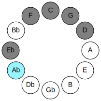 | 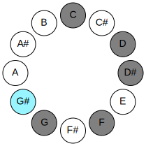 |
## Relative Modes

| Number | Mode | Luminosity | Tonic | Notes | Illustration |
|--------|------|------------|-------|-------|--------------|
| [2769](https://ianring.com/musictheory/scales/2769) | [Dyrimic](ModeDyrimic.md) | -1 | G# | G#, A###, B###, C###, D###, E###, G# |  |
| [2769](https://ianring.com/musictheory/scales/2769) | [Dyrimic](ModeDyrimic.md) | 6 | Ab | Ab, B#, C##, D#, E#, F##, Ab |  |
| [429](https://ianring.com/musictheory/scales/429) | [Koptimic](ModeKoptimic.md) | -1 | C | C, D, Eb, F, G, Ab, C |  |
| [1131](https://ianring.com/musictheory/scales/1131) | [Thocrimic](ModeThocrimic.md) | 3 | D | D, Eb, F, G, Ab, B#, D |  |
| [2613](https://ianring.com/musictheory/scales/2613) | [Aeolanimic](ModeAeolanimic.md) | 5 | D# | D#, E#, F##, G#, A###, B###, D# |  |
| [2613](https://ianring.com/musictheory/scales/2613) | [Aeolanimic](ModeAeolanimic.md) | 5 | Eb | Eb, F, G, Ab, B#, C##, Eb |  |
| [1677](https://ianring.com/musictheory/scales/1677) | [Danimic](ModeDanimic.md) | 6 | F | F, G, Ab, B#, C##, D#, F |  |
| [1443](https://ianring.com/musictheory/scales/1443) | [Ionarimic](ModeIonarimic.md) | -1 | G | G, Ab, B#, C##, D#, E#, G |  |
## Relative Brightness

| Number | Mode | Luminosity | Tonic | Notes | Circle Of Fifth | Chromatic Circle |
|--------|------|------------|-------|-------|-----------------|------------------|
| [2769](https://ianring.com/musictheory/scales/2769) | [Dyrimic](ModeDyrimic.md) | -1 | G# | G#, A###, B###, C###, D###, E###, G# |  |  |
| [2769](https://ianring.com/musictheory/scales/2769) | [Dyrimic](ModeDyrimic.md) | 6 | Ab | Ab, B#, C##, D#, E#, F##, Ab |  |  |
| [429](https://ianring.com/musictheory/scales/429) | [Koptimic](ModeKoptimic.md) | -1 | C | C, D, Eb, F, G, Ab, C | 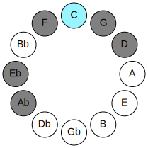 | 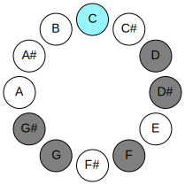 |
| [1131](https://ianring.com/musictheory/scales/1131) | [Thocrimic](ModeThocrimic.md) | -1 | D | D, Eb, F, G, Ab, B#, D | 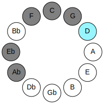 | 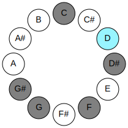 |
| [2613](https://ianring.com/musictheory/scales/2613) | [Aeolanimic](ModeAeolanimic.md) | -1 | D# | D#, E#, F##, G#, A###, B###, D# | 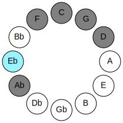 | 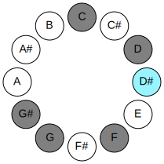 |
| [2613](https://ianring.com/musictheory/scales/2613) | [Aeolanimic](ModeAeolanimic.md) | 5 | Eb | Eb, F, G, Ab, B#, C##, Eb |  |  |
| [1677](https://ianring.com/musictheory/scales/1677) | [Danimic](ModeDanimic.md) | -1 | F | F, G, Ab, B#, C##, D#, F | 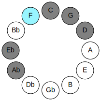 | 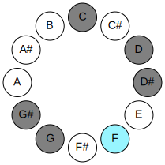 |
| [1443](https://ianring.com/musictheory/scales/1443) | [Ionarimic](ModeIonarimic.md) | -1 | G | G, Ab, B#, C##, D#, E#, G | 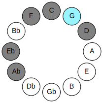 | 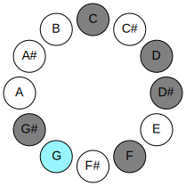 |

## Chords

### Ab

| Number | Root | Name | Notes | Illustration | Audio |
|--------|------|------|-------|--------------|-------|
| 261 | Ab | [G#Mb5](ChordGSharpMajorFlatFifth.md) | G#, B#, D |  | [midi](ChordGSharpMajorFlatFifthRootPosition.mid) |
| 261 | Ab | [AbMb5](ChordAFlatMajorFlatFifth.md) | Ab, C, Ebb |  | [midi](ChordAFlatMajorFlatFifthRootPosition.mid) |
| 264 | Ab | [G#5](ChordGSharpPowerChord.md) | G#, D# |  | [midi](ChordGSharpPowerChordRootPosition.mid) |
| 264 | Ab | [Ab5](ChordAFlatPowerChord.md) | Ab, Eb |  | [midi](ChordAFlatPowerChordRootPosition.mid) |
| 265 | Ab | [G#M](ChordGSharpMajor.md) | G#, B#, D# |  | [midi](ChordGSharpMajorRootPosition.mid) |
| 265 | Ab | [AbM](ChordAFlatMajor.md) | Ab, C, Eb |  | [midi](ChordAFlatMajorRootPosition.mid) |
| 268 | Ab | [G#lyd](ChordGSharpLydian.md) | G#, C##, D# |  | [midi](ChordGSharpLydianRootPosition.mid) |
| 268 | Ab | [Ablyd](ChordAFlatLydian.md) | Ab, D, Eb |  | [midi](ChordAFlatLydianRootPosition.mid) |
| 269 | Ab | [G#M(add(#4))](ChordGSharpMajorAddSharpFourth.md) | G#, B#, C##, D# |  | [midi](ChordGSharpMajorAddSharpFourthRootPosition.mid) |
| 269 | Ab | [AbM(add(#4))](ChordAFlatMajorAddSharpFourth.md) | Ab, C, D, Eb |  | [midi](ChordAFlatMajorAddSharpFourthRootPosition.mid) |
| 289 | Ab | [G#M##5](ChordGSharpMajorDoubleSharpFifth.md) | G#, B#, E# |  | [midi](ChordGSharpMajorDoubleSharpFifthRootPosition.mid) |
| 289 | Ab | [AbM##5](ChordAFlatMajorDoubleSharpFifth.md) | Ab, C, F |  | [midi](ChordAFlatMajorDoubleSharpFifthRootPosition.mid) |
| 293 | Ab | [G#M6b5](ChordGSharpMajorSixthFlatFifth.md) | G#, B#, D, E# |  | [midi](ChordGSharpMajorSixthFlatFifthRootPosition.mid) |
| 293 | Ab | [AbM6b5](ChordAFlatMajorSixthFlatFifth.md) | Ab, C, Ebb, F |  | [midi](ChordAFlatMajorSixthFlatFifthRootPosition.mid) |
| 297 | Ab | [G#M6](ChordGSharpMajorSixth.md) | G#, B#, D#, E# |  | [midi](ChordGSharpMajorSixthRootPosition.mid) |
| 297 | Ab | [AbM6](ChordAFlatMajorSixth.md) | Ab, C, Eb, F |  | [midi](ChordAFlatMajorSixthRootPosition.mid) |
| 389 | Ab | [G#M7b5](ChordGSharpMajorSeventhFlatFifth.md) | G#, B#, D, F## |  | [midi](ChordGSharpMajorSeventhFlatFifthRootPosition.mid) |
| 389 | Ab | [AbM7b5](ChordAFlatMajorSeventhFlatFifth.md) | Ab, C, Ebb, G |  | [midi](ChordAFlatMajorSeventhFlatFifthRootPosition.mid) |
| 393 | Ab | [G#M7](ChordGSharpMajorSeventh.md) | G#, B#, D#, F## |  | [midi](ChordGSharpMajorSeventhRootPosition.mid) |
| 393 | Ab | [AbM7](ChordAFlatMajorSeventh.md) | Ab, C, Eb, G |  | [midi](ChordAFlatMajorSeventhRootPosition.mid) |
| 396 | Ab | [G#lyd(M7)](ChordGSharpLydianMajorSeventh.md) | G#, C##, D#, F## |  | [midi](ChordGSharpLydianMajorSeventhRootPosition.mid) |
| 396 | Ab | [Ablyd(M7)](ChordAFlatLydianMajorSeventh.md) | Ab, D, Eb, G |  | [midi](ChordAFlatLydianMajorSeventhRootPosition.mid) |
| 397 | Ab | [G#M7add(#11)](ChordGSharpMajorSeventhAddSharpEleventh.md) | G#, B#, D#, F##, C## |  | [midi](ChordGSharpMajorSeventhAddSharpEleventhRootPosition.mid) |
| 397 | Ab | [G#M7add(#4)](ChordGSharpMajorSeventhAddSharpFourth.md) | G#, B#, C##, D#, F## |  | [midi](ChordGSharpMajorSeventhAddSharpFourthRootPosition.mid) |
| 397 | Ab | [AbM7add(#11)](ChordAFlatMajorSeventhAddSharpEleventh.md) | Ab, C, Eb, G, D |  | [midi](ChordAFlatMajorSeventhAddSharpEleventhRootPosition.mid) |
| 397 | Ab | [AbM7add(#4)](ChordAFlatMajorSeventhAddSharpFourth.md) | Ab, C, D, Eb, G |  | [midi](ChordAFlatMajorSeventhAddSharpFourthRootPosition.mid) |
| 417 | Ab | [G#M7##5](ChordGSharpMajorSeventhDoubleSharpFifth.md) | G#, B#, E#, F## |  | [midi](ChordGSharpMajorSeventhDoubleSharpFifthRootPosition.mid) |
| 417 | Ab | [AbM7##5](ChordAFlatMajorSeventhDoubleSharpFifth.md) | Ab, C, F, G |  | [midi](ChordAFlatMajorSeventhDoubleSharpFifthRootPosition.mid) |
| 425 | Ab | [G#M7add13](ChordGSharpMajorSeventhAddThirteenth.md) | G#, B#, D#, F##, E# |  | [midi](ChordGSharpMajorSeventhAddThirteenthRootPosition.mid) |
| 425 | Ab | [AbM7add13](ChordAFlatMajorSeventhAddThirteenth.md) | Ab, C, Eb, G, F |  | [midi](ChordAFlatMajorSeventhAddThirteenthRootPosition.mid) |

### B#

| Number | Root | Name | Notes | Illustration | Audio |
|--------|------|------|-------|--------------|-------|
| 37 | B# | [Csus2bb5](ChordCNaturalSuspendedSecondDoubleFlatFifth.md) | C, D, F |  | [midi](ChordCNaturalSuspendedSecondDoubleFlatFifthRootPosition.mid) |
| 41 | B# | [Cmbb5](ChordCNaturalMinorDoubleFlatFifth.md) | C, Eb, F |  | [midi](ChordCNaturalMinorDoubleFlatFifthRootPosition.mid) |
| 129 | B# | [C5](ChordCNaturalPowerChord.md) | C, G |  | [midi](ChordCNaturalPowerChordRootPosition.mid) |
| 133 | B# | [Csus2](ChordCNaturalSuspendedSecond.md) | C, D, G |  | [midi](ChordCNaturalSuspendedSecondRootPosition.mid) |
| 137 | B# | [Cm](ChordCNaturalMinor.md) | C, Eb, G |  | [midi](ChordCNaturalMinorRootPosition.mid) |
| 137 | B# | [Cm(add(#9))](ChordCNaturalMinorAddSharpNinth.md) | C, Eb, G, D# |  | [midi](ChordCNaturalMinorAddSharpNinthRootPosition.mid) |
| 141 | B# | [Cm(add9)](ChordCNaturalMinorAddNinth.md) | C, Eb, G, D |  | [midi](ChordCNaturalMinorAddNinthRootPosition.mid) |
| 161 | B# | [Csus4](ChordCNaturalSuspendedFourth.md) | C, F, G |  | [midi](ChordCNaturalSuspendedFourthRootPosition.mid) |
| 169 | B# | [Cm(add11)](ChordCNaturalMinorAddEleventh.md) | C, Eb, G, F |  | [midi](ChordCNaturalMinorAddEleventhRootPosition.mid) |
| 169 | B# | [Cm(add4)](ChordCNaturalMinorAddFourth.md) | C, Eb, F, G |  | [midi](ChordCNaturalMinorAddFourthRootPosition.mid) |
| 261 | B# | [Csus2#5](ChordCNaturalSuspendedSecondSharpFifth.md) | C, D, G# |  | [midi](ChordCNaturalSuspendedSecondSharpFifthRootPosition.mid) |
| 265 | B# | [Cm#5](ChordCNaturalMinorSharpFifth.md) | C, Eb, Ab |  | [midi](ChordCNaturalMinorSharpFifthRootPosition.mid) |
| 289 | B# | [Csus4#5](ChordCNaturalSuspendedFourthSharpFifth.md) | C, F, G# |  | [midi](ChordCNaturalSuspendedFourthSharpFifthRootPosition.mid) |

### C##

| Number | Root | Name | Notes | Illustration | Audio |
|--------|------|------|-------|--------------|-------|
| 164 | C## | [Dmbb5](ChordDNaturalMinorDoubleFlatFifth.md) | D, F, G |  | [midi](ChordDNaturalMinorDoubleFlatFifthRootPosition.mid) |
| 268 | C## | [Dloc](ChordDNaturalLocrian.md) | D, Eb, Ab |  | [midi](ChordDNaturalLocrianRootPosition.mid) |
| 292 | C## | [Do](ChordDNaturalDiminished.md) | D, F, Ab |  | [midi](ChordDNaturalDiminishedRootPosition.mid) |
| 388 | C## | [Dsus4b5](ChordDNaturalSuspendedFourthFlatFifth.md) | D, G, Ab |  | [midi](ChordDNaturalSuspendedFourthFlatFifthRootPosition.mid) |
| 133 | C## | [DQ](ChordDNaturalQuartal.md) | D, G, C |  | [midi](ChordDNaturalQuartalRootPosition.mid) |
| 165 | C## | [Dm7bb5](ChordDNaturalMinorSeventhDoubleFlatFifth.md) | D, F, G, C |  | [midi](ChordDNaturalMinorSeventhDoubleFlatFifthRootPosition.mid) |
| 293 | C## | [Dø7](ChordDNaturalHalfDiminishedSeventh.md) | D, F, Ab, C |  | [midi](ChordDNaturalHalfDiminishedSeventhRootPosition.mid) |

### D#

| Number | Root | Name | Notes | Illustration | Audio |
|--------|------|------|-------|--------------|-------|
| 296 | D# | [D#sus2bb5](ChordDSharpSuspendedSecondDoubleFlatFifth.md) | D#, E#, G# |  | [midi](ChordDSharpSuspendedSecondDoubleFlatFifthRootPosition.mid) |
| 296 | D# | [Ebsus2bb5](ChordEFlatSuspendedSecondDoubleFlatFifth.md) | Eb, F, Ab |  | [midi](ChordEFlatSuspendedSecondDoubleFlatFifthRootPosition.mid) |
| 137 | D# | [D#M##5](ChordDSharpMajorDoubleSharpFifth.md) | D#, F##, B# |  | [midi](ChordDSharpMajorDoubleSharpFifthRootPosition.mid) |
| 137 | D# | [EbM##5](ChordEFlatMajorDoubleSharpFifth.md) | Eb, G, C |  | [midi](ChordEFlatMajorDoubleSharpFifthRootPosition.mid) |
| 265 | D# | [D#sus4##5](ChordDSharpSuspendedFourthDoubleSharpFifth.md) | D#, G#, B# |  | [midi](ChordDSharpSuspendedFourthDoubleSharpFifthRootPosition.mid) |
| 265 | D# | [Ebsus4##5](ChordEFlatSuspendedFourthDoubleSharpFifth.md) | Eb, Ab, C |  | [midi](ChordEFlatSuspendedFourthDoubleSharpFifthRootPosition.mid) |
| 297 | D# | [D#M6sus2bb5](ChordDSharpMajorSixthSuspendedSecondDoubleFlatFifth.md) | D#, E#, G#, B# |  | [midi](ChordDSharpMajorSixthSuspendedSecondDoubleFlatFifthRootPosition.mid) |
| 297 | D# | [EbM6sus2bb5](ChordEFlatMajorSixthSuspendedSecondDoubleFlatFifth.md) | Eb, F, Ab, C |  | [midi](ChordEFlatMajorSixthSuspendedSecondDoubleFlatFifthRootPosition.mid) |
| 268 | D# | [D#Q+](ChordDSharpQuartalAugmented.md) | D#, G#, C## |  | [midi](ChordDSharpQuartalAugmentedRootPosition.mid) |
| 268 | D# | [EbQ+](ChordEFlatQuartalAugmented.md) | Eb, Ab, D |  | [midi](ChordEFlatQuartalAugmentedRootPosition.mid) |
| 141 | D# | [D#M7##5](ChordDSharpMajorSeventhDoubleSharpFifth.md) | D#, F##, B#, C## |  | [midi](ChordDSharpMajorSeventhDoubleSharpFifthRootPosition.mid) |
| 141 | D# | [EbM7##5](ChordEFlatMajorSeventhDoubleSharpFifth.md) | Eb, G, C, D |  | [midi](ChordEFlatMajorSeventhDoubleSharpFifthRootPosition.mid) |
| 269 | D# | [D#M7(sus4)##5](ChordDSharpMajorSeventhSuspendedFourthDoubleSharpFifth.md) | D#, G#, B#, C## |  | [midi](ChordDSharpMajorSeventhSuspendedFourthDoubleSharpFifthRootPosition.mid) |
| 269 | D# | [EbM7(sus4)##5](ChordEFlatMajorSeventhSuspendedFourthDoubleSharpFifth.md) | Eb, Ab, C, D |  | [midi](ChordEFlatMajorSeventhSuspendedFourthDoubleSharpFifthRootPosition.mid) |

### E#

| Number | Root | Name | Notes | Illustration | Audio |
|--------|------|------|-------|--------------|-------|
| 33 | E# | [F5](ChordFNaturalPowerChord.md) | F, C |  | [midi](ChordFNaturalPowerChordRootPosition.mid) |
| 161 | E# | [Fsus2](ChordFNaturalSuspendedSecond.md) | F, G, C |  | [midi](ChordFNaturalSuspendedSecondRootPosition.mid) |
| 289 | E# | [Fm](ChordFNaturalMinor.md) | F, Ab, C |  | [midi](ChordFNaturalMinorRootPosition.mid) |
| 289 | E# | [Fm(add(#9))](ChordFNaturalMinorAddSharpNinth.md) | F, Ab, C, G# |  | [midi](ChordFNaturalMinorAddSharpNinthRootPosition.mid) |
| 417 | E# | [Fm(add9)](ChordFNaturalMinorAddNinth.md) | F, Ab, C, G |  | [midi](ChordFNaturalMinorAddNinthRootPosition.mid) |
| 165 | E# | [FM6sus2](ChordFNaturalMajorSixthSuspendedSecond.md) | F, G, C, D |  | [midi](ChordFNaturalMajorSixthSuspendedSecondRootPosition.mid) |
| 165 | E# | [F7sus2b5](ChordFNaturalDominantSeventhSuspendedSecondFlatFifth.md) | F, G, C, Ebb |  | [midi](ChordFNaturalDominantSeventhSuspendedSecondFlatFifthRootPosition.mid) |
| 293 | E# | [Fm6](ChordFNaturalMinorSixth.md) | F, Ab, C, D |  | [midi](ChordFNaturalMinorSixthRootPosition.mid) |
| 421 | E# | [Fm6(add9)](ChordFNaturalMinorSixthAddNinth.md) | F, Ab, C, D, G |  | [midi](ChordFNaturalMinorSixthAddNinthRootPosition.mid) |
| 169 | E# | [F7sus2](ChordFNaturalDominantSeventhSuspendedSecond.md) | F, G, C, Eb |  | [midi](ChordFNaturalDominantSeventhSuspendedSecondRootPosition.mid) |
| 169 | E# | [F9sus2](ChordFNaturalDominantNinthSuspendedSecond.md) | F, G, C, Eb, G |  | [midi](ChordFNaturalDominantNinthSuspendedSecondRootPosition.mid) |
| 297 | E# | [Fm7](ChordFNaturalMinorSeventh.md) | F, Ab, C, Eb |  | [midi](ChordFNaturalMinorSeventhRootPosition.mid) |
| 425 | E# | [Fm9](ChordFNaturalMinorNinth.md) | F, Ab, C, Eb, G |  | [midi](ChordFNaturalMinorNinthRootPosition.mid) |
| 301 | E# | [Fm7add13](ChordFNaturalMinorSeventhAddThirteenth.md) | F, Ab, C, Eb, D |  | [midi](ChordFNaturalMinorSeventhAddThirteenthRootPosition.mid) |

### F##

| Number | Root | Name | Notes | Illustration | Audio |
|--------|------|------|-------|--------------|-------|
| 132 | F## | [G5](ChordGNaturalPowerChord.md) | G, D |  | [midi](ChordGNaturalPowerChordRootPosition.mid) |
| 388 | F## | [Gphryg](ChordGNaturalPhrygian.md) | G, Ab, D |  | [midi](ChordGNaturalPhrygianRootPosition.mid) |
| 133 | F## | [Gsus4](ChordGNaturalSuspendedFourth.md) | G, C, D |  | [midi](ChordGNaturalSuspendedFourthRootPosition.mid) |
| 137 | F## | [Gsus4#5](ChordGNaturalSuspendedFourthSharpFifth.md) | G, C, D# |  | [midi](ChordGNaturalSuspendedFourthSharpFifthRootPosition.mid) |
| 161 | F## | [GQ](ChordGNaturalQuartal.md) | G, C, F |  | [midi](ChordGNaturalQuartalRootPosition.mid) |
| 165 | F## | [G7sus4](ChordGNaturalDominantSeventhSuspendedFourth.md) | G, C, D, F |  | [midi](ChordGNaturalDominantSeventhSuspendedFourthRootPosition.mid) |

