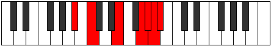

# Mode AFlatEpalimic

## Links

- [Documentation](README.md)
- [Scales Index](Scales.md)
- [Modes Index](Modes.md)
- [Chords Index](Chords.md)

## Scale

[Galimic](ScaleGalimic.md)

## Mode

[AFlatEpalimic](ModeAFlatEpalimic.md)

## Tonic

Ab

## Signature

[CNaturalMajor]

## Transposition

1, 1, 2, 4, 3, 1

## Chord Pattern

Vb5

## Perfection

 - 2 Perfect Notes

 - 4 Imperfect Notes

## Notes

- Ab (Imperfect)
- Bbb
- Cbb (Imperfect)
- Dbb
- E (Imperfect)
- F## (Imperfect)
- Ab (Imperfect)

## Illustration

## Diagram

| Circle of Fifth | Chromatic Circle |
|-----------------|------------------|
|  |  |
## Relative Modes

| Number | Mode | Tonic | Notes | Illustration |
|--------|------|-------|-------|--------------|
| [2327](https://ianring.com/musictheory/scales/2327) | [Epalimic](ModeEpalimic.md) | G# | G#, A, Bb, C, D##, E###, G# |  |
| [2327](https://ianring.com/musictheory/scales/2327) | [Epalimic](ModeEpalimic.md) | Ab | Ab, Bbb, Cbb, Dbb, E, F##, Ab |  |
| [3211](https://ianring.com/musictheory/scales/3211) | [Epacrimic](ModeEpacrimic.md) | A | A, Bb, C, D##, E###, F###, A |  |
| [3653](https://ianring.com/musictheory/scales/3653) | [Sathimic](ModeSathimic.md) | A# | A#, B#, D##, E###, F###, G##, A# |  |
| [3653](https://ianring.com/musictheory/scales/3653) | [Sathimic](ModeSathimic.md) | Bb | Bb, C, D##, E###, F###, G##, Bb |  |
| [1937](https://ianring.com/musictheory/scales/1937) | [Galimic](ModeGalimic.md) | C | C, D##, E###, F###, G##, A#, C |  |
| [377](https://ianring.com/musictheory/scales/377) | [Kathimic](ModeKathimic.md) | E | E, F##, G#, A, Bb, C, E |  |
| [559](https://ianring.com/musictheory/scales/559) | [Lylimic](ModeLylimic.md) | G | G, Ab, Bbb, Cbb, Dbb, E, G |  |
## Relative Brightness

| Number | Mode | Tonic | Notes | Circle Of Fifth | Chromatic Circle |
|--------|------|-------|-------|-----------------|------------------|
| [2327](https://ianring.com/musictheory/scales/2327) | [Epalimic](ModeEpalimic.md) | G# | G#, A, Bb, C, D##, E###, G# |  |  |
| [2327](https://ianring.com/musictheory/scales/2327) | [Epalimic](ModeEpalimic.md) | Ab | Ab, Bbb, Cbb, Dbb, E, F##, Ab |  |  |
| [3211](https://ianring.com/musictheory/scales/3211) | [Epacrimic](ModeEpacrimic.md) | A | A, Bb, C, D##, E###, F###, A |  |  |
| [3653](https://ianring.com/musictheory/scales/3653) | [Sathimic](ModeSathimic.md) | A# | A#, B#, D##, E###, F###, G##, A# |  |  |
| [3653](https://ianring.com/musictheory/scales/3653) | [Sathimic](ModeSathimic.md) | Bb | Bb, C, D##, E###, F###, G##, Bb |  |  |
| [1937](https://ianring.com/musictheory/scales/1937) | [Galimic](ModeGalimic.md) | C | C, D##, E###, F###, G##, A#, C |  |  |
| [377](https://ianring.com/musictheory/scales/377) | [Kathimic](ModeKathimic.md) | E | E, F##, G#, A, Bb, C, E |  |  |
| [559](https://ianring.com/musictheory/scales/559) | [Lylimic](ModeLylimic.md) | G | G, Ab, Bbb, Cbb, Dbb, E, G |  |  |

## Chords

### Ab

| Number | Root | Name | Notes | Illustration | Audio |
|--------|------|------|-------|--------------|-------|
| 1296 | Ab | [G#sus2#5](ChordGSharpSuspendedSecondSharpFifth.md) | G#, A#, D## |  | [midi](ChordGSharpSuspendedSecondSharpFifthRootPosition.mid) |
| 1296 | Ab | [Absus2#5](ChordAFlatSuspendedSecondSharpFifth.md) | Ab, Bb, E |  | [midi](ChordAFlatSuspendedSecondSharpFifthRootPosition.mid) |
| 273 | Ab | [G#+](ChordGSharpAugmented.md) | G#, B#, D## |  | [midi](ChordGSharpAugmentedRootPosition.mid) |
| 273 | Ab | [G#+7](ChordGSharpAugmentedAugmentedSeventh.md) | G#, B#, D##, F### |  | [midi](ChordGSharpAugmentedAugmentedSeventhRootPosition.mid) |
| 273 | Ab | [Ab+](ChordAFlatAugmented.md) | Ab, C, E |  | [midi](ChordAFlatAugmentedRootPosition.mid) |
| 273 | Ab | [Ab+7](ChordAFlatAugmentedAugmentedSeventh.md) | Ab, C, E, G# |  | [midi](ChordAFlatAugmentedAugmentedSeventhRootPosition.mid) |
| 401 | Ab | [G#+(M7)](ChordGSharpAugmentedMajorSeventh.md) | G#, B#, D##, F## |  | [midi](ChordGSharpAugmentedMajorSeventhRootPosition.mid) |
| 401 | Ab | [Ab+(M7)](ChordAFlatAugmentedMajorSeventh.md) | Ab, C, E, G |  | [midi](ChordAFlatAugmentedMajorSeventhRootPosition.mid) |

### Bbb

| Number | Root | Name | Notes | Illustration | Audio |
|--------|------|------|-------|--------------|-------|
| 528 | Bbb | [A5](ChordANaturalPowerChord.md) | A, E |  | [midi](ChordANaturalPowerChordRootPosition.mid) |
| 1552 | Bbb | [Aphryg](ChordANaturalPhrygian.md) | A, Bb, E |  | [midi](ChordANaturalPhrygianRootPosition.mid) |
| 529 | Bbb | [Am](ChordANaturalMinor.md) | A, C, E |  | [midi](ChordANaturalMinorRootPosition.mid) |
| 529 | Bbb | [Am(add(#9))](ChordANaturalMinorAddSharpNinth.md) | A, C, E, B# |  | [midi](ChordANaturalMinorAddSharpNinthRootPosition.mid) |
| 657 | Bbb | [Am7](ChordANaturalMinorSeventh.md) | A, C, E, G |  | [midi](ChordANaturalMinorSeventhRootPosition.mid) |
| 1681 | Bbb | [Am7b9](ChordANaturalMinorSeventhFlatNinth.md) | A, C, E, G, Bb |  | [midi](ChordANaturalMinorSeventhFlatNinthRootPosition.mid) |
| 1808 | Bbb | [Aphryg+7](ChordANaturalPhrygianAddSeventh.md) | A, Bb, E, G# |  | [midi](ChordANaturalPhrygianAddSeventhRootPosition.mid) |
| 785 | Bbb | [Am(M7)](ChordANaturalMinorMajorSeventh.md) | A, C, E, G# |  | [midi](ChordANaturalMinorMajorSeventhRootPosition.mid) |

### Cbb

| Number | Root | Name | Notes | Illustration | Audio |
|--------|------|------|-------|--------------|-------|
| 1041 | Cbb | [A#](ChordASharpDiminishedFlatThird.md) | A#, C, E |  | [midi](ChordASharpDiminishedFlatThirdRootPosition.mid) |
| 1041 | Cbb | [A#sus2b5](ChordASharpSuspendedSecondFlatFifth.md) | A#, B#, E |  | [midi](ChordASharpSuspendedSecondFlatFifthRootPosition.mid) |
| 1041 | Cbb | [Bb](ChordBFlatDiminishedFlatThird.md) | Bb, Dbb, Fb |  | [midi](ChordBFlatDiminishedFlatThirdRootPosition.mid) |
| 1041 | Cbb | [Bbsus2b5](ChordBFlatSuspendedSecondFlatFifth.md) | Bb, C, Fb |  | [midi](ChordBFlatSuspendedSecondFlatFifthRootPosition.mid) |
| 1169 | Cbb | [A#M6sus2b5](ChordASharpMajorSixthSuspendedSecondFlatFifth.md) | A#, B#, E, F## |  | [midi](ChordASharpMajorSixthSuspendedSecondFlatFifthRootPosition.mid) |
| 1169 | Cbb | [BbM6sus2b5](ChordBFlatMajorSixthSuspendedSecondFlatFifth.md) | Bb, C, Fb, G |  | [midi](ChordBFlatMajorSixthSuspendedSecondFlatFifthRootPosition.mid) |

### Dbb

| Number | Root | Name | Notes | Illustration | Audio |
|--------|------|------|-------|--------------|-------|
| 129 | Dbb | [C5](ChordCNaturalPowerChord.md) | C, G |  | [midi](ChordCNaturalPowerChordRootPosition.mid) |
| 145 | Dbb | [CM](ChordCNaturalMajor.md) | C, E, G |  | [midi](ChordCNaturalMajorRootPosition.mid) |
| 273 | Dbb | [C+](ChordCNaturalAugmented.md) | C, E, G# |  | [midi](ChordCNaturalAugmentedRootPosition.mid) |
| 273 | Dbb | [C+7](ChordCNaturalAugmentedAugmentedSeventh.md) | C, E, G#, B# |  | [midi](ChordCNaturalAugmentedAugmentedSeventhRootPosition.mid) |
| 529 | Dbb | [CM##5](ChordCNaturalMajorDoubleSharpFifth.md) | C, E, A |  | [midi](ChordCNaturalMajorDoubleSharpFifthRootPosition.mid) |
| 657 | Dbb | [CM6](ChordCNaturalMajorSixth.md) | C, E, G, A |  | [midi](ChordCNaturalMajorSixthRootPosition.mid) |
| 1169 | Dbb | [C7](ChordCNaturalDominantSeventh.md) | C, E, G, Bb |  | [midi](ChordCNaturalDominantSeventhRootPosition.mid) |
| 1681 | Dbb | [C7add13](ChordCNaturalDominantSeventhAddThirteenth.md) | C, E, G, Bb, A |  | [midi](ChordCNaturalDominantSeventhAddThirteenthRootPosition.mid) |

### E

| Number | Root | Name | Notes | Illustration | Audio |
|--------|------|------|-------|--------------|-------|
| 656 | E | [Embb5](ChordENaturalMinorDoubleFlatFifth.md) | E, G, A |  | [midi](ChordENaturalMinorDoubleFlatFifthRootPosition.mid) |
| 1168 | E | [Eo](ChordENaturalDiminished.md) | E, G, Bb |  | [midi](ChordENaturalDiminishedRootPosition.mid) |
| 1296 | E | [EMb5](ChordENaturalMajorFlatFifth.md) | E, G#, Bb |  | [midi](ChordENaturalMajorFlatFifthRootPosition.mid) |
| 1552 | E | [Esus4b5](ChordENaturalSuspendedFourthFlatFifth.md) | E, A, Bb |  | [midi](ChordENaturalSuspendedFourthFlatFifthRootPosition.mid) |
| 145 | E | [Em#5](ChordENaturalMinorSharpFifth.md) | E, G, C |  | [midi](ChordENaturalMinorSharpFifthRootPosition.mid) |
| 273 | E | [E+](ChordENaturalAugmented.md) | E, G#, B# |  | [midi](ChordENaturalAugmentedRootPosition.mid) |
| 273 | E | [E+7](ChordENaturalAugmentedAugmentedSeventh.md) | E, G#, B#, D## |  | [midi](ChordENaturalAugmentedAugmentedSeventhRootPosition.mid) |
| 529 | E | [Esus4#5](ChordENaturalSuspendedFourthSharpFifth.md) | E, A, B# |  | [midi](ChordENaturalSuspendedFourthSharpFifthRootPosition.mid) |

### F##

| Number | Root | Name | Notes | Illustration | Audio |
|--------|------|------|-------|--------------|-------|
| 641 | F## | [Gsus2bb5](ChordGNaturalSuspendedSecondDoubleFlatFifth.md) | G, A, C |  | [midi](ChordGNaturalSuspendedSecondDoubleFlatFifthRootPosition.mid) |
| 1153 | F## | [Gmbb5](ChordGNaturalMinorDoubleFlatFifth.md) | G, Bb, C |  | [midi](ChordGNaturalMinorDoubleFlatFifthRootPosition.mid) |
| 145 | F## | [Gsus4##5](ChordGNaturalSuspendedFourthDoubleSharpFifth.md) | G, C, E |  | [midi](ChordGNaturalSuspendedFourthDoubleSharpFifthRootPosition.mid) |
| 657 | F## | [GM6sus2bb5](ChordGNaturalMajorSixthSuspendedSecondDoubleFlatFifth.md) | G, A, C, E |  | [midi](ChordGNaturalMajorSixthSuspendedSecondDoubleFlatFifthRootPosition.mid) |

