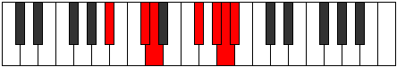

# Mode AFlatEparimic

## Links

- [Documentation](index.md)
- [Scales Index](Scales.md)
- [Modes Index](Modes.md)
- [Chords Index](Chords.md)

## Scale

[Aerycrimic](ScaleAerycrimic.md)

## Mode

[AFlatEparimic](ModeAFlatEparimic.md)

## Tonic

Ab

## Signature

[CNaturalMajor]

## Perfection

 - 3 Perfect Notes

 - 3 Imperfect Notes

## Notes

- Ab (Imperfect)
- Bbb (Imperfect)
- Cbb (Imperfect)
- Db
- Ebb
- F#
- Ab (Imperfect)

## Illustration

## Relative Modes

| Number | Mode | Tonic | Notes | Illustration |
|--------|------|-------|-------|--------------|
| [413](https://ianring.com/musictheory/scales/413) | [Ganimic](ModeGanimic.md) | F# | F#, G#, A, Bb, C#, D, F# |  |
| [413](https://ianring.com/musictheory/scales/413) | [Ganimic](ModeGanimic.md) | Gb | Gb, Ab, Bbb, Cbb, Db, Ebb, Gb |  |
| [931](https://ianring.com/musictheory/scales/931) | [Bacrimic](ModeBacrimic.md) | C# | C#, D, E##, F###, G##, A#, C# |  |
| [931](https://ianring.com/musictheory/scales/931) | [Bacrimic](ModeBacrimic.md) | Db | Db, Ebb, F#, G#, A, Bb, Db |  |
| [1127](https://ianring.com/musictheory/scales/1127) | [Eparimic](ModeEparimic.md) | G# | G#, A, Bb, C#, D, E##, G# |  |
| [1127](https://ianring.com/musictheory/scales/1127) | [Eparimic](ModeEparimic.md) | Ab | Ab, Bbb, Cbb, Db, Ebb, F#, Ab |  |
| [2513](https://ianring.com/musictheory/scales/2513) | [Aerycrimic](ModeAerycrimic.md) | D | D, E##, F###, G##, A#, B##, D |  |
| [2611](https://ianring.com/musictheory/scales/2611) | [Lyrimic](ModeLyrimic.md) | A | A, Bb, C#, D, E##, F###, A |  |
| [3353](https://ianring.com/musictheory/scales/3353) | [Phraptimic](ModePhraptimic.md) | A# | A#, B##, C##, E##, F###, G##, A# |  |
| [3353](https://ianring.com/musictheory/scales/3353) | [Phraptimic](ModePhraptimic.md) | Bb | Bb, C#, D, E##, F###, G##, Bb |  |

## Chords

### Ab

| Number | Root | Name | Notes | Illustration | Audio |
|--------|------|------|-------|--------------|-------|

### Bbb

| Number | Root | Name | Notes | Illustration | Audio |
|--------|------|------|-------|--------------|-------|

### Cbb

| Number | Root | Name | Notes | Illustration | Audio |
|--------|------|------|-------|--------------|-------|

### Db

| Number | Root | Name | Notes | Illustration | Audio |
|--------|------|------|-------|--------------|-------|

### Ebb

| Number | Root | Name | Notes | Illustration | Audio |
|--------|------|------|-------|--------------|-------|

### F#

| Number | Root | Name | Notes | Illustration | Audio |
|--------|------|------|-------|--------------|-------|

