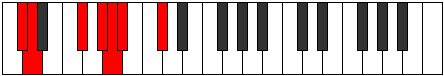

# Mode AFlatEparimic

## Links

- [Documentation](README.md)
- [Scales Index](Scales.md)
- [Modes Index](Modes.md)
- [Chords Index](Chords.md)

## Parent Scale

[Aerycrimic](ScaleAerycrimic.md)

## Mode

[AFlatEparimic](ModeAFlatEparimic.md)

## Number

1127

## Luminosity

-1

## Tonic

Ab

## Signature

C

## Transposition

1, 1, 3, 1, 4, 2

## Chord Pattern

i⁰b3, vi

## Perfection

 - 3 Perfect Notes

 - 3 Imperfect Notes

 - Perfection Profile - false, false, false, true, true, true

## Notes

- Ab (Imperfect)
- Bbb (Imperfect)
- Cbb (Imperfect)
- Db
- Ebb
- F#
- Ab (Imperfect)

## Illustration

## Diagram

| Circle of Fifth | Chromatic Circle |
|-----------------|------------------|
|  |  |
## Relative Modes

| Number | Mode | Luminosity | Tonic | Notes | Illustration |
|--------|------|------------|-------|-------|--------------|
| [1127](https://ianring.com/musictheory/scales/1127) | [Eparimic](ModeEparimic.md) | -1 | G# | G#, A, Bb, C#, D, E##, G# |  |
| [1127](https://ianring.com/musictheory/scales/1127) | [Eparimic](ModeEparimic.md) | -1 | Ab | Ab, Bbb, Cbb, Db, Ebb, F#, Ab |  |
| [2611](https://ianring.com/musictheory/scales/2611) | [Lyrimic](ModeLyrimic.md) | 5 | A | A, Bb, C#, D, E##, F###, A |  |
| [3353](https://ianring.com/musictheory/scales/3353) | [Phraptimic](ModePhraptimic.md) | -1 | A# | A#, B##, C##, E##, F###, G##, A# |  |
| [3353](https://ianring.com/musictheory/scales/3353) | [Phraptimic](ModePhraptimic.md) | -1 | Bb | Bb, C#, D, E##, F###, G##, Bb |  |
| [931](https://ianring.com/musictheory/scales/931) | [Bacrimic](ModeBacrimic.md) | -1 | C# | C#, D, E##, F###, G##, A#, C# |  |
| [931](https://ianring.com/musictheory/scales/931) | [Bacrimic](ModeBacrimic.md) | -1 | Db | Db, Ebb, F#, G#, A, Bb, Db |  |
| [2513](https://ianring.com/musictheory/scales/2513) | [Aerycrimic](ModeAerycrimic.md) | -1 | D | D, E##, F###, G##, A#, B##, D |  |
| [413](https://ianring.com/musictheory/scales/413) | [Ganimic](ModeGanimic.md) | -1 | F# | F#, G#, A, Bb, C#, D, F# |  |
| [413](https://ianring.com/musictheory/scales/413) | [Ganimic](ModeGanimic.md) | -1 | Gb | Gb, Ab, Bbb, Cbb, Db, Ebb, Gb |  |
## Relative Brightness

| Number | Mode | Luminosity | Tonic | Notes | Circle Of Fifth | Chromatic Circle |
|--------|------|------------|-------|-------|-----------------|------------------|
| [1127](https://ianring.com/musictheory/scales/1127) | [Eparimic](ModeEparimic.md) | 4 | G# | G#, A, Bb, C#, D, E##, G# |  |  |
| [1127](https://ianring.com/musictheory/scales/1127) | [Eparimic](ModeEparimic.md) | -1 | Ab | Ab, Bbb, Cbb, Db, Ebb, F#, Ab |  |  |
| [2611](https://ianring.com/musictheory/scales/2611) | [Lyrimic](ModeLyrimic.md) | 5 | A | A, Bb, C#, D, E##, F###, A |  |  |
| [3353](https://ianring.com/musictheory/scales/3353) | [Phraptimic](ModePhraptimic.md) | -1 | A# | A#, B##, C##, E##, F###, G##, A# |  |  |
| [3353](https://ianring.com/musictheory/scales/3353) | [Phraptimic](ModePhraptimic.md) | -1 | Bb | Bb, C#, D, E##, F###, G##, Bb |  |  |
| [931](https://ianring.com/musictheory/scales/931) | [Bacrimic](ModeBacrimic.md) | -1 | C# | C#, D, E##, F###, G##, A#, C# |  |  |
| [931](https://ianring.com/musictheory/scales/931) | [Bacrimic](ModeBacrimic.md) | 5 | Db | Db, Ebb, F#, G#, A, Bb, Db |  |  |
| [2513](https://ianring.com/musictheory/scales/2513) | [Aerycrimic](ModeAerycrimic.md) | 6 | D | D, E##, F###, G##, A#, B##, D |  |  |
| [413](https://ianring.com/musictheory/scales/413) | [Ganimic](ModeGanimic.md) | -1 | F# | F#, G#, A, Bb, C#, D, F# |  |  |
| [413](https://ianring.com/musictheory/scales/413) | [Ganimic](ModeGanimic.md) | -1 | Gb | Gb, Ab, Bbb, Cbb, Db, Ebb, Gb |  |  |

## Chords

### Ab

| Number | Root | Name | Notes | Illustration | Audio |
|--------|------|------|-------|--------------|-------|
| 1282 | Ab | [G#sus2bb5](ChordGSharpSuspendedSecondDoubleFlatFifth.md) | G#, A#, C# |  | [midi](ChordGSharpSuspendedSecondDoubleFlatFifthRootPosition.mid) |
| 1282 | Ab | [Absus2bb5](ChordAFlatSuspendedSecondDoubleFlatFifth.md) | Ab, Bb, Db |  | [midi](ChordAFlatSuspendedSecondDoubleFlatFifthRootPosition.mid) |
| 772 | Ab | [G#loc](ChordGSharpLocrian.md) | G#, A, D |  | [midi](ChordGSharpLocrianRootPosition.mid) |
| 772 | Ab | [Abloc](ChordAFlatLocrian.md) | Ab, Bbb, Ebb |  | [midi](ChordAFlatLocrianRootPosition.mid) |
| 1284 | Ab | [G#](ChordGSharpDiminishedFlatThird.md) | G#, Bb, D |  | [midi](ChordGSharpDiminishedFlatThirdRootPosition.mid) |
| 1284 | Ab | [G#sus2b5](ChordGSharpSuspendedSecondFlatFifth.md) | G#, A#, D |  | [midi](ChordGSharpSuspendedSecondFlatFifthRootPosition.mid) |
| 1284 | Ab | [Ab](ChordAFlatDiminishedFlatThird.md) | Ab, Cbb, Ebb |  | [midi](ChordAFlatDiminishedFlatThirdRootPosition.mid) |
| 1284 | Ab | [Absus2b5](ChordAFlatSuspendedSecondFlatFifth.md) | Ab, Bb, Ebb |  | [midi](ChordAFlatSuspendedSecondFlatFifthRootPosition.mid) |
| 262 | Ab | [G#sus4b5](ChordGSharpSuspendedFourthFlatFifth.md) | G#, C#, D |  | [midi](ChordGSharpSuspendedFourthFlatFifthRootPosition.mid) |
| 262 | Ab | [Absus4b5](ChordAFlatSuspendedFourthFlatFifth.md) | Ab, Db, Ebb |  | [midi](ChordAFlatSuspendedFourthFlatFifthRootPosition.mid) |
| 322 | Ab | [G#Q](ChordGSharpQuartal.md) | G#, C#, F# |  | [midi](ChordGSharpQuartalRootPosition.mid) |
| 322 | Ab | [AbQ](ChordAFlatQuartal.md) | Ab, Db, Gb |  | [midi](ChordAFlatQuartalRootPosition.mid) |

### Bbb

| Number | Root | Name | Notes | Illustration | Audio |
|--------|------|------|-------|--------------|-------|
| 578 | Bbb | [AM##5](ChordANaturalMajorDoubleSharpFifth.md) | A, C#, F# |  | [midi](ChordANaturalMajorDoubleSharpFifthRootPosition.mid) |
| 580 | Bbb | [Asus4##5](ChordANaturalSuspendedFourthDoubleSharpFifth.md) | A, D, F# |  | [midi](ChordANaturalSuspendedFourthDoubleSharpFifthRootPosition.mid) |
| 772 | Bbb | [AQ+](ChordANaturalQuartalAugmented.md) | A, D, G# |  | [midi](ChordANaturalQuartalAugmentedRootPosition.mid) |
| 834 | Bbb | [AM7##5](ChordANaturalMajorSeventhDoubleSharpFifth.md) | A, C#, F#, G# |  | [midi](ChordANaturalMajorSeventhDoubleSharpFifthRootPosition.mid) |
| 836 | Bbb | [AM7(sus4)##5](ChordANaturalMajorSeventhSuspendedFourthDoubleSharpFifth.md) | A, D, F#, G# |  | [midi](ChordANaturalMajorSeventhSuspendedFourthDoubleSharpFifthRootPosition.mid) |

### Cbb

| Number | Root | Name | Notes | Illustration | Audio |
|--------|------|------|-------|--------------|-------|
| 1090 | Cbb | [A#m#5](ChordASharpMinorSharpFifth.md) | A#, C#, F# |  | [midi](ChordASharpMinorSharpFifthRootPosition.mid) |
| 1090 | Cbb | [Bbm#5](ChordBFlatMinorSharpFifth.md) | Bb, Db, Gb |  | [midi](ChordBFlatMinorSharpFifthRootPosition.mid) |
| 1092 | Cbb | [A#+](ChordASharpAugmented.md) | A#, C##, E## |  | [midi](ChordASharpAugmentedRootPosition.mid) |
| 1092 | Cbb | [A#+7](ChordASharpAugmentedAugmentedSeventh.md) | A#, C##, E##, G### |  | [midi](ChordASharpAugmentedAugmentedSeventhRootPosition.mid) |
| 1092 | Cbb | [Bb+](ChordBFlatAugmented.md) | Bb, D, F# |  | [midi](ChordBFlatAugmentedRootPosition.mid) |
| 1092 | Cbb | [Bb+7](ChordBFlatAugmentedAugmentedSeventh.md) | Bb, D, F#, A# |  | [midi](ChordBFlatAugmentedAugmentedSeventhRootPosition.mid) |
| 1346 | Cbb | [A#m7#5](ChordASharpMinorSeventhSharpFifth.md) | A#, C#, E##, G# |  | [midi](ChordASharpMinorSeventhSharpFifthRootPosition.mid) |
| 1346 | Cbb | [Bbm7#5](ChordBFlatMinorSeventhSharpFifth.md) | Bb, Db, F#, Ab |  | [midi](ChordBFlatMinorSeventhSharpFifthRootPosition.mid) |
| 1604 | Cbb | [A#+(M7)](ChordASharpAugmentedMajorSeventh.md) | A#, C##, E##, G## |  | [midi](ChordASharpAugmentedMajorSeventhRootPosition.mid) |
| 1604 | Cbb | [Bb+(M7)](ChordBFlatAugmentedMajorSeventh.md) | Bb, D, F#, A |  | [midi](ChordBFlatAugmentedMajorSeventhRootPosition.mid) |

### Db

| Number | Root | Name | Notes | Illustration | Audio |
|--------|------|------|-------|--------------|-------|
| 258 | Db | [C#5](ChordCSharpPowerChord.md) | C#, G# |  | [midi](ChordCSharpPowerChordRootPosition.mid) |
| 258 | Db | [Db5](ChordDFlatPowerChord.md) | Db, Ab |  | [midi](ChordDFlatPowerChordRootPosition.mid) |
| 262 | Db | [C#phryg](ChordCSharpPhrygian.md) | C#, D, G# |  | [midi](ChordCSharpPhrygianRootPosition.mid) |
| 262 | Db | [Dbphryg](ChordDFlatPhrygian.md) | Db, Ebb, Ab |  | [midi](ChordDFlatPhrygianRootPosition.mid) |
| 322 | Db | [C#sus4](ChordCSharpSuspendedFourth.md) | C#, F#, G# |  | [midi](ChordCSharpSuspendedFourthRootPosition.mid) |
| 322 | Db | [Dbsus4](ChordDFlatSuspendedFourth.md) | Db, Gb, Ab |  | [midi](ChordDFlatSuspendedFourthRootPosition.mid) |
| 578 | Db | [C#sus4#5](ChordCSharpSuspendedFourthSharpFifth.md) | C#, F#, G## |  | [midi](ChordCSharpSuspendedFourthSharpFifthRootPosition.mid) |
| 578 | Db | [Dbsus4#5](ChordDFlatSuspendedFourthSharpFifth.md) | Db, Gb, A |  | [midi](ChordDFlatSuspendedFourthSharpFifthRootPosition.mid) |
| 1090 | Db | [C#sus4##5](ChordCSharpSuspendedFourthDoubleSharpFifth.md) | C#, F#, A# |  | [midi](ChordCSharpSuspendedFourthDoubleSharpFifthRootPosition.mid) |
| 1090 | Db | [Dbsus4##5](ChordDFlatSuspendedFourthDoubleSharpFifth.md) | Db, Gb, Bb |  | [midi](ChordDFlatSuspendedFourthDoubleSharpFifthRootPosition.mid) |
| 1346 | Db | [C#M6sus4](ChordCSharpMajorSixthSuspendedFourth.md) | C#, F#, G#, A# |  | [midi](ChordCSharpMajorSixthSuspendedFourthRootPosition.mid) |
| 1346 | Db | [DbM6sus4](ChordDFlatMajorSixthSuspendedFourth.md) | Db, Gb, Ab, Bb |  | [midi](ChordDFlatMajorSixthSuspendedFourthRootPosition.mid) |

### Ebb

| Number | Root | Name | Notes | Illustration | Audio |
|--------|------|------|-------|--------------|-------|
| 324 | Ebb | [DMb5](ChordDNaturalMajorFlatFifth.md) | D, F#, Ab |  | [midi](ChordDNaturalMajorFlatFifthRootPosition.mid) |
| 516 | Ebb | [D5](ChordDNaturalPowerChord.md) | D, A |  | [midi](ChordDNaturalPowerChordRootPosition.mid) |
| 580 | Ebb | [DM](ChordDNaturalMajor.md) | D, F#, A |  | [midi](ChordDNaturalMajorRootPosition.mid) |
| 772 | Ebb | [Dlyd](ChordDNaturalLydian.md) | D, G#, A |  | [midi](ChordDNaturalLydianRootPosition.mid) |
| 836 | Ebb | [DM(add(#4))](ChordDNaturalMajorAddSharpFourth.md) | D, F#, G#, A |  | [midi](ChordDNaturalMajorAddSharpFourthRootPosition.mid) |
| 1092 | Ebb | [D+](ChordDNaturalAugmented.md) | D, F#, A# |  | [midi](ChordDNaturalAugmentedRootPosition.mid) |
| 1092 | Ebb | [D+7](ChordDNaturalAugmentedAugmentedSeventh.md) | D, F#, A#, C## |  | [midi](ChordDNaturalAugmentedAugmentedSeventhRootPosition.mid) |
| 326 | Ebb | [DM7b5](ChordDNaturalMajorSeventhFlatFifth.md) | D, F#, Ab, C# |  | [midi](ChordDNaturalMajorSeventhFlatFifthRootPosition.mid) |
| 582 | Ebb | [DM7](ChordDNaturalMajorSeventh.md) | D, F#, A, C# |  | [midi](ChordDNaturalMajorSeventhRootPosition.mid) |
| 774 | Ebb | [Dlyd(M7)](ChordDNaturalLydianMajorSeventh.md) | D, G#, A, C# |  | [midi](ChordDNaturalLydianMajorSeventhRootPosition.mid) |
| 838 | Ebb | [DM7add(#11)](ChordDNaturalMajorSeventhAddSharpEleventh.md) | D, F#, A, C#, G# |  | [midi](ChordDNaturalMajorSeventhAddSharpEleventhRootPosition.mid) |
| 838 | Ebb | [DM7add(#4)](ChordDNaturalMajorSeventhAddSharpFourth.md) | D, F#, G#, A, C# |  | [midi](ChordDNaturalMajorSeventhAddSharpFourthRootPosition.mid) |
| 1094 | Ebb | [D+(M7)](ChordDNaturalAugmentedMajorSeventh.md) | D, F#, A#, C# |  | [midi](ChordDNaturalAugmentedMajorSeventhRootPosition.mid) |

### F#

| Number | Root | Name | Notes | Illustration | Audio |
|--------|------|------|-------|--------------|-------|
| 66 | F# | [F#5](ChordFSharpPowerChord.md) | F#, C# |  | [midi](ChordFSharpPowerChordRootPosition.mid) |
| 66 | F# | [Gb5](ChordGFlatPowerChord.md) | Gb, Db |  | [midi](ChordGFlatPowerChordRootPosition.mid) |
| 322 | F# | [F#sus2](ChordFSharpSuspendedSecond.md) | F#, G#, C# |  | [midi](ChordFSharpSuspendedSecondRootPosition.mid) |
| 322 | F# | [Gbsus2](ChordGFlatSuspendedSecond.md) | Gb, Ab, Db |  | [midi](ChordGFlatSuspendedSecondRootPosition.mid) |
| 578 | F# | [F#m](ChordFSharpMinor.md) | F#, A, C# |  | [midi](ChordFSharpMinorRootPosition.mid) |
| 578 | F# | [F#m(add(#9))](ChordFSharpMinorAddSharpNinth.md) | F#, A, C#, G## |  | [midi](ChordFSharpMinorAddSharpNinthRootPosition.mid) |
| 578 | F# | [Gbm](ChordGFlatMinor.md) | Gb, Bbb, Db |  | [midi](ChordGFlatMinorRootPosition.mid) |
| 578 | F# | [Gbm(add(#9))](ChordGFlatMinorAddSharpNinth.md) | Gb, Bbb, Db, A |  | [midi](ChordGFlatMinorAddSharpNinthRootPosition.mid) |
| 834 | F# | [F#m(add9)](ChordFSharpMinorAddNinth.md) | F#, A, C#, G# |  | [midi](ChordFSharpMinorAddNinthRootPosition.mid) |
| 834 | F# | [Gbm(add9)](ChordGFlatMinorAddNinth.md) | Gb, Bbb, Db, Ab |  | [midi](ChordGFlatMinorAddNinthRootPosition.mid) |
| 1090 | F# | [F#M](ChordFSharpMajor.md) | F#, A#, C# |  | [midi](ChordFSharpMajorRootPosition.mid) |
| 1090 | F# | [GbM](ChordGFlatMajor.md) | Gb, Bb, Db |  | [midi](ChordGFlatMajorRootPosition.mid) |
| 1346 | F# | [F#M(add9)](ChordFSharpMajorAddNinth.md) | F#, A#, C#, G# |  | [midi](ChordFSharpMajorAddNinthRootPosition.mid) |
| 1346 | F# | [GbM(add9)](ChordGFlatMajorAddNinth.md) | Gb, Bb, Db, Ab |  | [midi](ChordGFlatMajorAddNinthRootPosition.mid) |
| 1602 | F# | [F#M(add(#9))](ChordFSharpMajorAddSharpNinth.md) | F#, A#, C#, G## |  | [midi](ChordFSharpMajorAddSharpNinthRootPosition.mid) |
| 1602 | F# | [GbM(add(#9))](ChordGFlatMajorAddSharpNinth.md) | Gb, Bb, Db, A |  | [midi](ChordGFlatMajorAddSharpNinthRootPosition.mid) |
| 324 | F# | [F#sus2#5](ChordFSharpSuspendedSecondSharpFifth.md) | F#, G#, C## |  | [midi](ChordFSharpSuspendedSecondSharpFifthRootPosition.mid) |
| 324 | F# | [Gbsus2#5](ChordGFlatSuspendedSecondSharpFifth.md) | Gb, Ab, D |  | [midi](ChordGFlatSuspendedSecondSharpFifthRootPosition.mid) |
| 580 | F# | [F#m#5](ChordFSharpMinorSharpFifth.md) | F#, A, D |  | [midi](ChordFSharpMinorSharpFifthRootPosition.mid) |
| 580 | F# | [Gbm#5](ChordGFlatMinorSharpFifth.md) | Gb, Bbb, Ebb |  | [midi](ChordGFlatMinorSharpFifthRootPosition.mid) |
| 1092 | F# | [F#+](ChordFSharpAugmented.md) | F#, A#, C## |  | [midi](ChordFSharpAugmentedRootPosition.mid) |
| 1092 | F# | [F#+7](ChordFSharpAugmentedAugmentedSeventh.md) | F#, A#, C##, E## |  | [midi](ChordFSharpAugmentedAugmentedSeventhRootPosition.mid) |
| 1092 | F# | [Gb+](ChordGFlatAugmented.md) | Gb, Bb, D |  | [midi](ChordGFlatAugmentedRootPosition.mid) |
| 1092 | F# | [Gb+7](ChordGFlatAugmentedAugmentedSeventh.md) | Gb, Bb, D, F# |  | [midi](ChordGFlatAugmentedAugmentedSeventhRootPosition.mid) |

