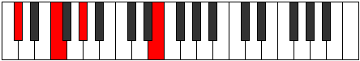
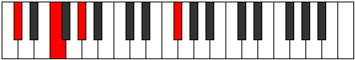
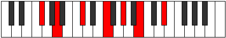

# Mode AFlatEpocryllic

## Links

- [Documentation](README.md)
- [Scales Index](Scales.md)
- [Modes Index](Modes.md)
- [Chords Index](Chords.md)

## Scale

[Ionocryllic](ScaleIonocryllic.md)

## Mode

[AFlatEpocryllic](ModeAFlatEpocryllic.md)

## Tonic

Ab

## Signature

[CNaturalMajor]

## Transposition

1, 2, 2, 2, 1, 1, 1, 2

## Chord Pattern

i, i, II, IIIb5, vii⁰, viii, viii

## Perfection

 - 6 Perfect Notes

 - 2 Imperfect Notes

## Notes

- Ab
- A
- B
- Db
- Eb (Imperfect)
- E
- F (Imperfect)
- Gb
- Ab

## Illustration

## Diagram

| Circle of Fifth | Chromatic Circle |
|-----------------|------------------|
|  |  |
## Relative Modes

| Number | Mode | Tonic | Notes | Illustration |
|--------|------|-------|-------|--------------|
| [1963](https://ianring.com/musictheory/scales/1963) | [Epocryllic](ModeEpocryllic.md) | G# | G#, A, B, C#, D#, E, F, F#, G# |  |
| [1963](https://ianring.com/musictheory/scales/1963) | [Epocryllic](ModeEpocryllic.md) | Ab | Ab, A, B, Db, Eb, E, F, Gb, Ab |  |
| [3029](https://ianring.com/musictheory/scales/3029) | [Ionocryllic](ModeIonocryllic.md) | A | A, B, C#, D#, E, F, F#, G#, A |  |
| [1781](https://ianring.com/musictheory/scales/1781) | [Gocryllic](ModeGocryllic.md) | B | B, C#, D#, E, F, F#, G#, A, B |  |
| [1469](https://ianring.com/musictheory/scales/1469) | [Epiryllic](ModeEpiryllic.md) | C# | C#, D#, E, F, F#, G#, A, B, C# |  |
| [1469](https://ianring.com/musictheory/scales/1469) | [Epiryllic](ModeEpiryllic.md) | Db | Db, Eb, E, F, Gb, Ab, A, B, Db |  |
| [1391](https://ianring.com/musictheory/scales/1391) | [Aeradyllic](ModeAeradyllic.md) | D# | D#, E, F, F#, G#, A, B, C#, D# |  |
| [1391](https://ianring.com/musictheory/scales/1391) | [Aeradyllic](ModeAeradyllic.md) | Eb | Eb, E, F, Gb, Ab, A, B, Db, Eb |  |
| [2743](https://ianring.com/musictheory/scales/2743) | [Staptyllic](ModeStaptyllic.md) | E | E, F, F#, G#, A, B, C#, D#, E |  |
| [3419](https://ianring.com/musictheory/scales/3419) | [Danyllic](ModeDanyllic.md) | F | F, F#, G#, A, B, C#, D#, E, F |  |
| [3757](https://ianring.com/musictheory/scales/3757) | [Goptyllic](ModeGoptyllic.md) | F# | F#, G#, A, B, C#, D#, E, F, F# |  |
| [3757](https://ianring.com/musictheory/scales/3757) | [Goptyllic](ModeGoptyllic.md) | Gb | Gb, Ab, A, B, Db, Eb, E, F, Gb |  |
## Relative Brightness

| Number | Mode | Tonic | Notes | Circle Of Fifth | Chromatic Circle |
|--------|------|-------|-------|-----------------|------------------|
| [1963](https://ianring.com/musictheory/scales/1963) | [Epocryllic](ModeEpocryllic.md) | G# | G#, A, B, C#, D#, E, F, F#, G# |  |  
| [1963](https://ianring.com/musictheory/scales/1963) | [Epocryllic](ModeEpocryllic.md) | Ab | Ab, A, B, Db, Eb, E, F, Gb, Ab |  |  
| [3029](https://ianring.com/musictheory/scales/3029) | [Ionocryllic](ModeIonocryllic.md) | A | A, B, C#, D#, E, F, F#, G#, A |  |  
| [1781](https://ianring.com/musictheory/scales/1781) | [Gocryllic](ModeGocryllic.md) | B | B, C#, D#, E, F, F#, G#, A, B |  |  
| [1469](https://ianring.com/musictheory/scales/1469) | [Epiryllic](ModeEpiryllic.md) | C# | C#, D#, E, F, F#, G#, A, B, C# |  |  
| [1469](https://ianring.com/musictheory/scales/1469) | [Epiryllic](ModeEpiryllic.md) | Db | Db, Eb, E, F, Gb, Ab, A, B, Db |  |  
| [1391](https://ianring.com/musictheory/scales/1391) | [Aeradyllic](ModeAeradyllic.md) | D# | D#, E, F, F#, G#, A, B, C#, D# |  |  
| [1391](https://ianring.com/musictheory/scales/1391) | [Aeradyllic](ModeAeradyllic.md) | Eb | Eb, E, F, Gb, Ab, A, B, Db, Eb |  |  
| [2743](https://ianring.com/musictheory/scales/2743) | [Staptyllic](ModeStaptyllic.md) | E | E, F, F#, G#, A, B, C#, D#, E |  |  
| [3419](https://ianring.com/musictheory/scales/3419) | [Danyllic](ModeDanyllic.md) | F | F, F#, G#, A, B, C#, D#, E, F |  |  
| [3757](https://ianring.com/musictheory/scales/3757) | [Goptyllic](ModeGoptyllic.md) | F# | F#, G#, A, B, C#, D#, E, F, F# |  |  
| [3757](https://ianring.com/musictheory/scales/3757) | [Goptyllic](ModeGoptyllic.md) | Gb | Gb, Ab, A, B, Db, Eb, E, F, Gb |  |  

## Chords

### Ab

| Number | Root | Name | Notes | Illustration | Audio |
|--------|------|------|-------|--------------|-------|
| 2306 | Ab | [G#mbb5](ChordGSharpMinorDoubleFlatFifth.md) | G#, B, C# |  | [midi](ChordGSharpMinorDoubleFlatFifthRootPosition.mid) |
| 2306 | Ab | [Abmbb5](ChordAFlatMinorDoubleFlatFifth.md) | Ab, Cb, Db |  | [midi](ChordAFlatMinorDoubleFlatFifthRootPosition.mid) |
| 264 | Ab | [G#5](ChordGSharpPowerChord.md) | G#, D# |  | [midi](ChordGSharpPowerChordRootPosition.mid) |
| 264 | Ab | [Ab5](ChordAFlatPowerChord.md) | Ab, Eb |  | [midi](ChordAFlatPowerChordRootPosition.mid) |
| 776 | Ab | [G#phryg](ChordGSharpPhrygian.md) | G#, A, D# |  | [midi](ChordGSharpPhrygianRootPosition.mid) |
| 776 | Ab | [Abphryg](ChordAFlatPhrygian.md) | Ab, Bbb, Eb |  | [midi](ChordAFlatPhrygianRootPosition.mid) |
| 2312 | Ab | [G#m](ChordGSharpMinor.md) | G#, B, D# |  | [midi](ChordGSharpMinorRootPosition.mid) |
| 2312 | Ab | [G#m(add(#9))](ChordGSharpMinorAddSharpNinth.md) | G#, B, D#, A## |  | [midi](ChordGSharpMinorAddSharpNinthRootPosition.mid) |
| 2312 | Ab | [Abm](ChordAFlatMinor.md) | Ab, Cb, Eb |  | [midi](ChordAFlatMinorRootPosition.mid) |
| 2312 | Ab | [Abm(add(#9))](ChordAFlatMinorAddSharpNinth.md) | Ab, Cb, Eb, B |  | [midi](ChordAFlatMinorAddSharpNinthRootPosition.mid) |
| 266 | Ab | [G#sus4](ChordGSharpSuspendedFourth.md) | G#, C#, D# |  | [midi](ChordGSharpSuspendedFourthRootPosition.mid) |
| 266 | Ab | [Absus4](ChordAFlatSuspendedFourth.md) | Ab, Db, Eb |  | [midi](ChordAFlatSuspendedFourthRootPosition.mid) |
| 2314 | Ab | [G#m(add11)](ChordGSharpMinorAddEleventh.md) | G#, B, D#, C# |  | [midi](ChordGSharpMinorAddEleventhRootPosition.mid) |
| 2314 | Ab | [G#m(add4)](ChordGSharpMinorAddFourth.md) | G#, B, C#, D# |  | [midi](ChordGSharpMinorAddFourthRootPosition.mid) |
| 2314 | Ab | [Abm(add11)](ChordAFlatMinorAddEleventh.md) | Ab, Cb, Eb, Db |  | [midi](ChordAFlatMinorAddEleventhRootPosition.mid) |
| 2314 | Ab | [Abm(add4)](ChordAFlatMinorAddFourth.md) | Ab, Cb, Db, Eb |  | [midi](ChordAFlatMinorAddFourthRootPosition.mid) |
| 2320 | Ab | [G#m#5](ChordGSharpMinorSharpFifth.md) | G#, B, E |  | [midi](ChordGSharpMinorSharpFifthRootPosition.mid) |
| 2320 | Ab | [Abm#5](ChordAFlatMinorSharpFifth.md) | Ab, Cb, Fb |  | [midi](ChordAFlatMinorSharpFifthRootPosition.mid) |
| 274 | Ab | [G#sus4#5](ChordGSharpSuspendedFourthSharpFifth.md) | G#, C#, D## |  | [midi](ChordGSharpSuspendedFourthSharpFifthRootPosition.mid) |
| 274 | Ab | [Absus4#5](ChordAFlatSuspendedFourthSharpFifth.md) | Ab, Db, E |  | [midi](ChordAFlatSuspendedFourthSharpFifthRootPosition.mid) |
| 290 | Ab | [G#sus4##5](ChordGSharpSuspendedFourthDoubleSharpFifth.md) | G#, C#, E# |  | [midi](ChordGSharpSuspendedFourthDoubleSharpFifthRootPosition.mid) |
| 290 | Ab | [Absus4##5](ChordAFlatSuspendedFourthDoubleSharpFifth.md) | Ab, Db, F |  | [midi](ChordAFlatSuspendedFourthDoubleSharpFifthRootPosition.mid) |
| 2344 | Ab | [G#m6](ChordGSharpMinorSixth.md) | G#, B, D#, E# |  | [midi](ChordGSharpMinorSixthRootPosition.mid) |
| 2344 | Ab | [Abm6](ChordAFlatMinorSixth.md) | Ab, Cb, Eb, F |  | [midi](ChordAFlatMinorSixthRootPosition.mid) |
| 2856 | Ab | [G#m6(addb9)](ChordGSharpMinorSixthAddFlatNinth.md) | G#, B, D#, E#, A |  | [midi](ChordGSharpMinorSixthAddFlatNinthRootPosition.mid) |
| 2856 | Ab | [Abm6(addb9)](ChordAFlatMinorSixthAddFlatNinth.md) | Ab, Cb, Eb, F, Bbb |  | [midi](ChordAFlatMinorSixthAddFlatNinthRootPosition.mid) |
| 298 | Ab | [G#M6sus4](ChordGSharpMajorSixthSuspendedFourth.md) | G#, C#, D#, E# |  | [midi](ChordGSharpMajorSixthSuspendedFourthRootPosition.mid) |
| 298 | Ab | [AbM6sus4](ChordAFlatMajorSixthSuspendedFourth.md) | Ab, Db, Eb, F |  | [midi](ChordAFlatMajorSixthSuspendedFourthRootPosition.mid) |
| 322 | Ab | [G#Q](ChordGSharpQuartal.md) | G#, C#, F# |  | [midi](ChordGSharpQuartalRootPosition.mid) |
| 322 | Ab | [AbQ](ChordAFlatQuartal.md) | Ab, Db, Gb |  | [midi](ChordAFlatQuartalRootPosition.mid) |
| 2370 | Ab | [G#m7bb5](ChordGSharpMinorSeventhDoubleFlatFifth.md) | G#, B, C#, F# |  | [midi](ChordGSharpMinorSeventhDoubleFlatFifthRootPosition.mid) |
| 2370 | Ab | [Abm7bb5](ChordAFlatMinorSeventhDoubleFlatFifth.md) | Ab, Cb, Db, Gb |  | [midi](ChordAFlatMinorSeventhDoubleFlatFifthRootPosition.mid) |
| 2376 | Ab | [G#m7](ChordGSharpMinorSeventh.md) | G#, B, D#, F# |  | [midi](ChordGSharpMinorSeventhRootPosition.mid) |
| 2376 | Ab | [Abm7](ChordAFlatMinorSeventh.md) | Ab, Cb, Eb, Gb |  | [midi](ChordAFlatMinorSeventhRootPosition.mid) |
| 2888 | Ab | [G#m7b9](ChordGSharpMinorSeventhFlatNinth.md) | G#, B, D#, F#, A |  | [midi](ChordGSharpMinorSeventhFlatNinthRootPosition.mid) |
| 2888 | Ab | [Abm7b9](ChordAFlatMinorSeventhFlatNinth.md) | Ab, Cb, Eb, Gb, Bbb |  | [midi](ChordAFlatMinorSeventhFlatNinthRootPosition.mid) |
| 330 | Ab | [G#7sus4](ChordGSharpDominantSeventhSuspendedFourth.md) | G#, C#, D#, F# |  | [midi](ChordGSharpDominantSeventhSuspendedFourthRootPosition.mid) |
| 330 | Ab | [Ab7sus4](ChordAFlatDominantSeventhSuspendedFourth.md) | Ab, Db, Eb, Gb |  | [midi](ChordAFlatDominantSeventhSuspendedFourthRootPosition.mid) |
| 2378 | Ab | [G#m7add11](ChordGSharpMinorSeventhAddEleventh.md) | G#, B, D#, F#, C# |  | [midi](ChordGSharpMinorSeventhAddEleventhRootPosition.mid) |
| 2378 | Ab | [Abm7add11](ChordAFlatMinorSeventhAddEleventh.md) | Ab, Cb, Eb, Gb, Db |  | [midi](ChordAFlatMinorSeventhAddEleventhRootPosition.mid) |
| 2384 | Ab | [G#m7#5](ChordGSharpMinorSeventhSharpFifth.md) | G#, B, D##, F# |  | [midi](ChordGSharpMinorSeventhSharpFifthRootPosition.mid) |
| 2384 | Ab | [Abm7#5](ChordAFlatMinorSeventhSharpFifth.md) | Ab, Cb, E, Gb |  | [midi](ChordAFlatMinorSeventhSharpFifthRootPosition.mid) |
| 2408 | Ab | [G#m7add13](ChordGSharpMinorSeventhAddThirteenth.md) | G#, B, D#, F#, E# |  | [midi](ChordGSharpMinorSeventhAddThirteenthRootPosition.mid) |
| 2408 | Ab | [Abm7add13](ChordAFlatMinorSeventhAddThirteenth.md) | Ab, Cb, Eb, Gb, F |  | [midi](ChordAFlatMinorSeventhAddThirteenthRootPosition.mid) |

### A

| Number | Root | Name | Notes | Illustration | Audio |
|--------|------|------|-------|--------------|-------|
| 2568 | A | [A](ChordANaturalDiminishedFlatThird.md) | A, Cb, Eb |  | [midi](ChordANaturalDiminishedFlatThirdRootPosition.mid) |
| 2568 | A | [Asus2b5](ChordANaturalSuspendedSecondFlatFifth.md) | A, B, Eb |  | [midi](ChordANaturalSuspendedSecondFlatFifthRootPosition.mid) |
| 522 | A | [AMb5](ChordANaturalMajorFlatFifth.md) | A, C#, Eb |  | [midi](ChordANaturalMajorFlatFifthRootPosition.mid) |
| 528 | A | [A5](ChordANaturalPowerChord.md) | A, E |  | [midi](ChordANaturalPowerChordRootPosition.mid) |
| 2576 | A | [Asus2](ChordANaturalSuspendedSecond.md) | A, B, E |  | [midi](ChordANaturalSuspendedSecondRootPosition.mid) |
| 530 | A | [AM](ChordANaturalMajor.md) | A, C#, E |  | [midi](ChordANaturalMajorRootPosition.mid) |
| 2578 | A | [AM(add9)](ChordANaturalMajorAddNinth.md) | A, C#, E, B |  | [midi](ChordANaturalMajorAddNinthRootPosition.mid) |
| 536 | A | [Alyd](ChordANaturalLydian.md) | A, D#, E |  | [midi](ChordANaturalLydianRootPosition.mid) |
| 538 | A | [AM(add(#4))](ChordANaturalMajorAddSharpFourth.md) | A, C#, D#, E |  | [midi](ChordANaturalMajorAddSharpFourthRootPosition.mid) |
| 2592 | A | [Asus2#5](ChordANaturalSuspendedSecondSharpFifth.md) | A, B, E# |  | [midi](ChordANaturalSuspendedSecondSharpFifthRootPosition.mid) |
| 546 | A | [A+](ChordANaturalAugmented.md) | A, C#, E# |  | [midi](ChordANaturalAugmentedRootPosition.mid) |
| 546 | A | [A+7](ChordANaturalAugmentedAugmentedSeventh.md) | A, C#, E#, G## |  | [midi](ChordANaturalAugmentedAugmentedSeventhRootPosition.mid) |
| 2600 | A | [Asus2b5add(#5)](ChordANaturalSuspendedSecondFlatFifthAddSharpFifth.md) | A, B, Eb, E# |  | [midi](ChordANaturalSuspendedSecondFlatFifthAddSharpFifthRootPosition.mid) |
| 578 | A | [AM##5](ChordANaturalMajorDoubleSharpFifth.md) | A, C#, F# |  | [midi](ChordANaturalMajorDoubleSharpFifthRootPosition.mid) |
| 2632 | A | [AM6sus2b5](ChordANaturalMajorSixthSuspendedSecondFlatFifth.md) | A, B, Eb, F# |  | [midi](ChordANaturalMajorSixthSuspendedSecondFlatFifthRootPosition.mid) |
| 586 | A | [AM6b5](ChordANaturalMajorSixthFlatFifth.md) | A, C#, Eb, F# |  | [midi](ChordANaturalMajorSixthFlatFifthRootPosition.mid) |
| 2640 | A | [AM6sus2](ChordANaturalMajorSixthSuspendedSecond.md) | A, B, E, F# |  | [midi](ChordANaturalMajorSixthSuspendedSecondRootPosition.mid) |
| 2640 | A | [A7sus2b5](ChordANaturalDominantSeventhSuspendedSecondFlatFifth.md) | A, B, E, Gb |  | [midi](ChordANaturalDominantSeventhSuspendedSecondFlatFifthRootPosition.mid) |
| 594 | A | [AM6](ChordANaturalMajorSixth.md) | A, C#, E, F# |  | [midi](ChordANaturalMajorSixthRootPosition.mid) |
| 2642 | A | [AM6(add9)](ChordANaturalMajorSixthAddNinth.md) | A, C#, E, F#, B |  | [midi](ChordANaturalMajorSixthAddNinthRootPosition.mid) |
| 778 | A | [AM7b5](ChordANaturalMajorSeventhFlatFifth.md) | A, C#, Eb, G# |  | [midi](ChordANaturalMajorSeventhFlatFifthRootPosition.mid) |
| 2832 | A | [AM7(sus2)](ChordANaturalMajorSeventhSuspendedSecond.md) | A, B, E, G# |  | [midi](ChordANaturalMajorSeventhSuspendedSecondRootPosition.mid) |
| 2832 | A | [AM9sus2](ChordANaturalMajorNinthSuspendedSecond.md) | A, B, E, G#, B |  | [midi](ChordANaturalMajorNinthSuspendedSecondRootPosition.mid) |
| 786 | A | [AM7](ChordANaturalMajorSeventh.md) | A, C#, E, G# |  | [midi](ChordANaturalMajorSeventhRootPosition.mid) |
| 2834 | A | [AM9](ChordANaturalMajorNinth.md) | A, C#, E, G#, B |  | [midi](ChordANaturalMajorNinthRootPosition.mid) |
| 792 | A | [Alyd(M7)](ChordANaturalLydianMajorSeventh.md) | A, D#, E, G# |  | [midi](ChordANaturalLydianMajorSeventhRootPosition.mid) |
| 794 | A | [AM7add(#11)](ChordANaturalMajorSeventhAddSharpEleventh.md) | A, C#, E, G#, D# |  | [midi](ChordANaturalMajorSeventhAddSharpEleventhRootPosition.mid) |
| 794 | A | [AM7add(#4)](ChordANaturalMajorSeventhAddSharpFourth.md) | A, C#, D#, E, G# |  | [midi](ChordANaturalMajorSeventhAddSharpFourthRootPosition.mid) |
| 802 | A | [A+(M7)](ChordANaturalAugmentedMajorSeventh.md) | A, C#, E#, G# |  | [midi](ChordANaturalAugmentedMajorSeventhRootPosition.mid) |
| 834 | A | [AM7##5](ChordANaturalMajorSeventhDoubleSharpFifth.md) | A, C#, F#, G# |  | [midi](ChordANaturalMajorSeventhDoubleSharpFifthRootPosition.mid) |
| 850 | A | [AM7add13](ChordANaturalMajorSeventhAddThirteenth.md) | A, C#, E, G#, F# |  | [midi](ChordANaturalMajorSeventhAddThirteenthRootPosition.mid) |

### B

| Number | Root | Name | Notes | Illustration | Audio |
|--------|------|------|-------|--------------|-------|
| 2066 | B | [Bsus2bb5](ChordBNaturalSuspendedSecondDoubleFlatFifth.md) | B, C#, E |  | [midi](ChordBNaturalSuspendedSecondDoubleFlatFifthRootPosition.mid) |
| 2082 | B | [B](ChordBNaturalDiminishedFlatThird.md) | B, Db, F |  | [midi](ChordBNaturalDiminishedFlatThirdRootPosition.mid) |
| 2082 | B | [Bsus2b5](ChordBNaturalSuspendedSecondFlatFifth.md) | B, C#, F |  | [midi](ChordBNaturalSuspendedSecondFlatFifthRootPosition.mid) |
| 2088 | B | [BMb5](ChordBNaturalMajorFlatFifth.md) | B, D#, F |  | [midi](ChordBNaturalMajorFlatFifthRootPosition.mid) |
| 2096 | B | [Bsus4b5](ChordBNaturalSuspendedFourthFlatFifth.md) | B, E, F |  | [midi](ChordBNaturalSuspendedFourthFlatFifthRootPosition.mid) |
| 2112 | B | [B5](ChordBNaturalPowerChord.md) | B, F# |  | [midi](ChordBNaturalPowerChordRootPosition.mid) |
| 2114 | B | [Bsus2](ChordBNaturalSuspendedSecond.md) | B, C#, F# |  | [midi](ChordBNaturalSuspendedSecondRootPosition.mid) |
| 2120 | B | [BM](ChordBNaturalMajor.md) | B, D#, F# |  | [midi](ChordBNaturalMajorRootPosition.mid) |
| 2122 | B | [BM(add9)](ChordBNaturalMajorAddNinth.md) | B, D#, F#, C# |  | [midi](ChordBNaturalMajorAddNinthRootPosition.mid) |
| 2128 | B | [Bsus4](ChordBNaturalSuspendedFourth.md) | B, E, F# |  | [midi](ChordBNaturalSuspendedFourthRootPosition.mid) |
| 2136 | B | [BM(add11)](ChordBNaturalMajorAddEleventh.md) | B, D#, F#, E |  | [midi](ChordBNaturalMajorAddEleventhRootPosition.mid) |
| 2136 | B | [BM(add4)](ChordBNaturalMajorAddFourth.md) | B, D#, E, F# |  | [midi](ChordBNaturalMajorAddFourthRootPosition.mid) |
| 2144 | B | [Blyd](ChordBNaturalLydian.md) | B, E#, F# |  | [midi](ChordBNaturalLydianRootPosition.mid) |
| 2152 | B | [BM(add(#4))](ChordBNaturalMajorAddSharpFourth.md) | B, D#, E#, F# |  | [midi](ChordBNaturalMajorAddSharpFourthRootPosition.mid) |
| 2312 | B | [BM##5](ChordBNaturalMajorDoubleSharpFifth.md) | B, D#, G# |  | [midi](ChordBNaturalMajorDoubleSharpFifthRootPosition.mid) |
| 2320 | B | [Bsus4##5](ChordBNaturalSuspendedFourthDoubleSharpFifth.md) | B, E, G# |  | [midi](ChordBNaturalSuspendedFourthDoubleSharpFifthRootPosition.mid) |
| 2322 | B | [BM6sus2bb5](ChordBNaturalMajorSixthSuspendedSecondDoubleFlatFifth.md) | B, C#, E, G# |  | [midi](ChordBNaturalMajorSixthSuspendedSecondDoubleFlatFifthRootPosition.mid) |
| 2338 | B | [BM6sus2b5](ChordBNaturalMajorSixthSuspendedSecondFlatFifth.md) | B, C#, F, G# |  | [midi](ChordBNaturalMajorSixthSuspendedSecondFlatFifthRootPosition.mid) |
| 2344 | B | [BM6b5](ChordBNaturalMajorSixthFlatFifth.md) | B, D#, F, G# |  | [midi](ChordBNaturalMajorSixthFlatFifthRootPosition.mid) |
| 2370 | B | [BM6sus2](ChordBNaturalMajorSixthSuspendedSecond.md) | B, C#, F#, G# |  | [midi](ChordBNaturalMajorSixthSuspendedSecondRootPosition.mid) |
| 2370 | B | [B7sus2b5](ChordBNaturalDominantSeventhSuspendedSecondFlatFifth.md) | B, C#, F#, Ab |  | [midi](ChordBNaturalDominantSeventhSuspendedSecondFlatFifthRootPosition.mid) |
| 2376 | B | [BM6](ChordBNaturalMajorSixth.md) | B, D#, F#, G# |  | [midi](ChordBNaturalMajorSixthRootPosition.mid) |
| 2378 | B | [BM6(add9)](ChordBNaturalMajorSixthAddNinth.md) | B, D#, F#, G#, C# |  | [midi](ChordBNaturalMajorSixthAddNinthRootPosition.mid) |
| 2384 | B | [BM6sus4](ChordBNaturalMajorSixthSuspendedFourth.md) | B, E, F#, G# |  | [midi](ChordBNaturalMajorSixthSuspendedFourthRootPosition.mid) |
| 2576 | B | [BQ](ChordBNaturalQuartal.md) | B, E, A |  | [midi](ChordBNaturalQuartalRootPosition.mid) |
| 2600 | B | [B7b5](ChordBNaturalDominantSeventhFlatFifth.md) | B, D#, F, A |  | [midi](ChordBNaturalDominantSeventhFlatFifthRootPosition.mid) |
| 2626 | B | [B7sus2](ChordBNaturalDominantSeventhSuspendedSecond.md) | B, C#, F#, A |  | [midi](ChordBNaturalDominantSeventhSuspendedSecondRootPosition.mid) |
| 2626 | B | [B9sus2](ChordBNaturalDominantNinthSuspendedSecond.md) | B, C#, F#, A, C# |  | [midi](ChordBNaturalDominantNinthSuspendedSecondRootPosition.mid) |
| 2632 | B | [B7](ChordBNaturalDominantSeventh.md) | B, D#, F#, A |  | [midi](ChordBNaturalDominantSeventhRootPosition.mid) |
| 2634 | B | [B9](ChordBNaturalDominantNinth.md) | B, D#, F#, A, C# |  | [midi](ChordBNaturalDominantNinthRootPosition.mid) |
| 2640 | B | [B7sus4](ChordBNaturalDominantSeventhSuspendedFourth.md) | B, E, F#, A |  | [midi](ChordBNaturalDominantSeventhSuspendedFourthRootPosition.mid) |
| 2642 | B | [B9sus4](ChordBNaturalDominantNinthSuspendedFourth.md) | B, E, F#, A, C# |  | [midi](ChordBNaturalDominantNinthSuspendedFourthRootPosition.mid) |
| 2648 | B | [B7add4](ChordBNaturalDominantSeventhAddFourth.md) | B, D#, E, F#, A |  | [midi](ChordBNaturalDominantSeventhAddFourthRootPosition.mid) |
| 2648 | B | [B7add11](ChordBNaturalDominantSeventhAddEleventh.md) | B, D#, F#, A, E |  | [midi](ChordBNaturalDominantSeventhAddEleventhRootPosition.mid) |
| 2650 | B | [B11](ChordBNaturalDominantEleventh.md) | B, D#, F#, A, C#, E |  | [midi](ChordBNaturalDominantEleventhRootPosition.mid) |
| 2664 | B | [B7add(#4)](ChordBNaturalDominantSeventhAddSharpFourth.md) | B, D#, E#, F#, A |  | [midi](ChordBNaturalDominantSeventhAddSharpFourthRootPosition.mid) |
| 2664 | B | [B7#11](ChordBNaturalDominantSeventhSharpEleventh.md) | B, D#, F#, A, E# |  | [midi](ChordBNaturalDominantSeventhSharpEleventhRootPosition.mid) |
| 2666 | B | [B9#11](ChordBNaturalDominantNinthSharpEleventh.md) | B, D#, F#, A, C#, E# |  | [midi](ChordBNaturalDominantNinthSharpEleventhRootPosition.mid) |
| 2888 | B | [B7add13](ChordBNaturalDominantSeventhAddThirteenth.md) | B, D#, F#, A, G# |  | [midi](ChordBNaturalDominantSeventhAddThirteenthRootPosition.mid) |
| 2906 | B | [B13](ChordBNaturalDominantThirteenth.md) | B, D#, F#, A, C#, E, G# |  | [midi](ChordBNaturalDominantThirteenthRootPosition.mid) |

### Db

| Number | Root | Name | Notes | Illustration | Audio |
|--------|------|------|-------|--------------|-------|
| 74 | Db | [C#sus2bb5](ChordCSharpSuspendedSecondDoubleFlatFifth.md) | C#, D#, F# |  | [midi](ChordCSharpSuspendedSecondDoubleFlatFifthRootPosition.mid) |
| 74 | Db | [Dbsus2bb5](ChordDFlatSuspendedSecondDoubleFlatFifth.md) | Db, Eb, Gb |  | [midi](ChordDFlatSuspendedSecondDoubleFlatFifthRootPosition.mid) |
| 82 | Db | [C#mbb5](ChordCSharpMinorDoubleFlatFifth.md) | C#, E, F# |  | [midi](ChordCSharpMinorDoubleFlatFifthRootPosition.mid) |
| 82 | Db | [Dbmbb5](ChordDFlatMinorDoubleFlatFifth.md) | Db, Fb, Gb |  | [midi](ChordDFlatMinorDoubleFlatFifthRootPosition.mid) |
| 258 | Db | [C#5](ChordCSharpPowerChord.md) | C#, G# |  | [midi](ChordCSharpPowerChordRootPosition.mid) |
| 258 | Db | [Db5](ChordDFlatPowerChord.md) | Db, Ab |  | [midi](ChordDFlatPowerChordRootPosition.mid) |
| 266 | Db | [C#sus2](ChordCSharpSuspendedSecond.md) | C#, D#, G# |  | [midi](ChordCSharpSuspendedSecondRootPosition.mid) |
| 266 | Db | [Dbsus2](ChordDFlatSuspendedSecond.md) | Db, Eb, Ab |  | [midi](ChordDFlatSuspendedSecondRootPosition.mid) |
| 274 | Db | [C#m](ChordCSharpMinor.md) | C#, E, G# |  | [midi](ChordCSharpMinorRootPosition.mid) |
| 274 | Db | [C#m(add(#9))](ChordCSharpMinorAddSharpNinth.md) | C#, E, G#, D## |  | [midi](ChordCSharpMinorAddSharpNinthRootPosition.mid) |
| 274 | Db | [Dbm](ChordDFlatMinor.md) | Db, Fb, Ab |  | [midi](ChordDFlatMinorRootPosition.mid) |
| 274 | Db | [Dbm(add(#9))](ChordDFlatMinorAddSharpNinth.md) | Db, Fb, Ab, E |  | [midi](ChordDFlatMinorAddSharpNinthRootPosition.mid) |
| 282 | Db | [C#m(add9)](ChordCSharpMinorAddNinth.md) | C#, E, G#, D# |  | [midi](ChordCSharpMinorAddNinthRootPosition.mid) |
| 282 | Db | [Dbm(add9)](ChordDFlatMinorAddNinth.md) | Db, Fb, Ab, Eb |  | [midi](ChordDFlatMinorAddNinthRootPosition.mid) |
| 290 | Db | [C#M](ChordCSharpMajor.md) | C#, E#, G# |  | [midi](ChordCSharpMajorRootPosition.mid) |
| 290 | Db | [DbM](ChordDFlatMajor.md) | Db, F, Ab |  | [midi](ChordDFlatMajorRootPosition.mid) |
| 298 | Db | [C#M(add9)](ChordCSharpMajorAddNinth.md) | C#, E#, G#, D# |  | [midi](ChordCSharpMajorAddNinthRootPosition.mid) |
| 298 | Db | [DbM(add9)](ChordDFlatMajorAddNinth.md) | Db, F, Ab, Eb |  | [midi](ChordDFlatMajorAddNinthRootPosition.mid) |
| 306 | Db | [C#M(add(#9))](ChordCSharpMajorAddSharpNinth.md) | C#, E#, G#, D## |  | [midi](ChordCSharpMajorAddSharpNinthRootPosition.mid) |
| 306 | Db | [DbM(add(#9))](ChordDFlatMajorAddSharpNinth.md) | Db, F, Ab, E |  | [midi](ChordDFlatMajorAddSharpNinthRootPosition.mid) |
| 322 | Db | [C#sus4](ChordCSharpSuspendedFourth.md) | C#, F#, G# |  | [midi](ChordCSharpSuspendedFourthRootPosition.mid) |
| 322 | Db | [Dbsus4](ChordDFlatSuspendedFourth.md) | Db, Gb, Ab |  | [midi](ChordDFlatSuspendedFourthRootPosition.mid) |
| 338 | Db | [C#m(add11)](ChordCSharpMinorAddEleventh.md) | C#, E, G#, F# |  | [midi](ChordCSharpMinorAddEleventhRootPosition.mid) |
| 338 | Db | [C#m(add4)](ChordCSharpMinorAddFourth.md) | C#, E, F#, G# |  | [midi](ChordCSharpMinorAddFourthRootPosition.mid) |
| 338 | Db | [Dbm(add11)](ChordDFlatMinorAddEleventh.md) | Db, Fb, Ab, Gb |  | [midi](ChordDFlatMinorAddEleventhRootPosition.mid) |
| 338 | Db | [Dbm(add4)](ChordDFlatMinorAddFourth.md) | Db, Fb, Gb, Ab |  | [midi](ChordDFlatMinorAddFourthRootPosition.mid) |
| 354 | Db | [C#M(add11)](ChordCSharpMajorAddEleventh.md) | C#, E#, G#, F# |  | [midi](ChordCSharpMajorAddEleventhRootPosition.mid) |
| 354 | Db | [C#M(add4)](ChordCSharpMajorAddFourth.md) | C#, E#, F#, G# |  | [midi](ChordCSharpMajorAddFourthRootPosition.mid) |
| 354 | Db | [DbM(add11)](ChordDFlatMajorAddEleventh.md) | Db, F, Ab, Gb |  | [midi](ChordDFlatMajorAddEleventhRootPosition.mid) |
| 354 | Db | [DbM(add4)](ChordDFlatMajorAddFourth.md) | Db, F, Gb, Ab |  | [midi](ChordDFlatMajorAddFourthRootPosition.mid) |
| 522 | Db | [C#sus2#5](ChordCSharpSuspendedSecondSharpFifth.md) | C#, D#, G## |  | [midi](ChordCSharpSuspendedSecondSharpFifthRootPosition.mid) |
| 522 | Db | [Dbsus2#5](ChordDFlatSuspendedSecondSharpFifth.md) | Db, Eb, A |  | [midi](ChordDFlatSuspendedSecondSharpFifthRootPosition.mid) |
| 530 | Db | [C#m#5](ChordCSharpMinorSharpFifth.md) | C#, E, A |  | [midi](ChordCSharpMinorSharpFifthRootPosition.mid) |
| 530 | Db | [Dbm#5](ChordDFlatMinorSharpFifth.md) | Db, Fb, Bbb |  | [midi](ChordDFlatMinorSharpFifthRootPosition.mid) |
| 546 | Db | [C#+](ChordCSharpAugmented.md) | C#, E#, G## |  | [midi](ChordCSharpAugmentedRootPosition.mid) |
| 546 | Db | [C#+7](ChordCSharpAugmentedAugmentedSeventh.md) | C#, E#, G##, B## |  | [midi](ChordCSharpAugmentedAugmentedSeventhRootPosition.mid) |
| 546 | Db | [Db+](ChordDFlatAugmented.md) | Db, F, A |  | [midi](ChordDFlatAugmentedRootPosition.mid) |
| 546 | Db | [Db+7](ChordDFlatAugmentedAugmentedSeventh.md) | Db, F, A, C# |  | [midi](ChordDFlatAugmentedAugmentedSeventhRootPosition.mid) |
| 578 | Db | [C#sus4#5](ChordCSharpSuspendedFourthSharpFifth.md) | C#, F#, G## |  | [midi](ChordCSharpSuspendedFourthSharpFifthRootPosition.mid) |
| 578 | Db | [Dbsus4#5](ChordDFlatSuspendedFourthSharpFifth.md) | Db, Gb, A |  | [midi](ChordDFlatSuspendedFourthSharpFifthRootPosition.mid) |
| 2114 | Db | [C#Q](ChordCSharpQuartal.md) | C#, F#, B |  | [midi](ChordCSharpQuartalRootPosition.mid) |
| 2114 | Db | [DbQ](ChordDFlatQuartal.md) | Db, Gb, Cb |  | [midi](ChordDFlatQuartalRootPosition.mid) |
| 2130 | Db | [C#m7bb5](ChordCSharpMinorSeventhDoubleFlatFifth.md) | C#, E, F#, B |  | [midi](ChordCSharpMinorSeventhDoubleFlatFifthRootPosition.mid) |
| 2130 | Db | [Dbm7bb5](ChordDFlatMinorSeventhDoubleFlatFifth.md) | Db, Fb, Gb, Cb |  | [midi](ChordDFlatMinorSeventhDoubleFlatFifthRootPosition.mid) |
| 2314 | Db | [C#7sus2](ChordCSharpDominantSeventhSuspendedSecond.md) | C#, D#, G#, B |  | [midi](ChordCSharpDominantSeventhSuspendedSecondRootPosition.mid) |
| 2314 | Db | [C#9sus2](ChordCSharpDominantNinthSuspendedSecond.md) | C#, D#, G#, B, D# |  | [midi](ChordCSharpDominantNinthSuspendedSecondRootPosition.mid) |
| 2314 | Db | [Db7sus2](ChordDFlatDominantSeventhSuspendedSecond.md) | Db, Eb, Ab, Cb |  | [midi](ChordDFlatDominantSeventhSuspendedSecondRootPosition.mid) |
| 2314 | Db | [Db9sus2](ChordDFlatDominantNinthSuspendedSecond.md) | Db, Eb, Ab, Cb, Eb |  | [midi](ChordDFlatDominantNinthSuspendedSecondRootPosition.mid) |
| 2322 | Db | [C#m7](ChordCSharpMinorSeventh.md) | C#, E, G#, B |  | [midi](ChordCSharpMinorSeventhRootPosition.mid) |
| 2322 | Db | [Dbm7](ChordDFlatMinorSeventh.md) | Db, Fb, Ab, Cb |  | [midi](ChordDFlatMinorSeventhRootPosition.mid) |
| 2330 | Db | [C#m9](ChordCSharpMinorNinth.md) | C#, E, G#, B, D# |  | [midi](ChordCSharpMinorNinthRootPosition.mid) |
| 2330 | Db | [Dbm9](ChordDFlatMinorNinth.md) | Db, Fb, Ab, Cb, Eb |  | [midi](ChordDFlatMinorNinthRootPosition.mid) |
| 2338 | Db | [C#7](ChordCSharpDominantSeventh.md) | C#, E#, G#, B |  | [midi](ChordCSharpDominantSeventhRootPosition.mid) |
| 2338 | Db | [Db7](ChordDFlatDominantSeventh.md) | Db, F, Ab, Cb |  | [midi](ChordDFlatDominantSeventhRootPosition.mid) |
| 2346 | Db | [C#9](ChordCSharpDominantNinth.md) | C#, E#, G#, B, D# |  | [midi](ChordCSharpDominantNinthRootPosition.mid) |
| 2346 | Db | [Db9](ChordDFlatDominantNinth.md) | Db, F, Ab, Cb, Eb |  | [midi](ChordDFlatDominantNinthRootPosition.mid) |
| 2354 | Db | [C#7#9](ChordCSharpDominantSeventhSharpNinth.md) | C#, E#, G#, B, D## |  | [midi](ChordCSharpDominantSeventhSharpNinthRootPosition.mid) |
| 2354 | Db | [Db7#9](ChordDFlatDominantSeventhSharpNinth.md) | Db, F, Ab, Cb, E |  | [midi](ChordDFlatDominantSeventhSharpNinthRootPosition.mid) |
| 2370 | Db | [C#7sus4](ChordCSharpDominantSeventhSuspendedFourth.md) | C#, F#, G#, B |  | [midi](ChordCSharpDominantSeventhSuspendedFourthRootPosition.mid) |
| 2370 | Db | [Db7sus4](ChordDFlatDominantSeventhSuspendedFourth.md) | Db, Gb, Ab, Cb |  | [midi](ChordDFlatDominantSeventhSuspendedFourthRootPosition.mid) |
| 2378 | Db | [C#9sus4](ChordCSharpDominantNinthSuspendedFourth.md) | C#, F#, G#, B, D# |  | [midi](ChordCSharpDominantNinthSuspendedFourthRootPosition.mid) |
| 2378 | Db | [Db9sus4](ChordDFlatDominantNinthSuspendedFourth.md) | Db, Gb, Ab, Cb, Eb |  | [midi](ChordDFlatDominantNinthSuspendedFourthRootPosition.mid) |
| 2386 | Db | [C#m7add11](ChordCSharpMinorSeventhAddEleventh.md) | C#, E, G#, B, F# |  | [midi](ChordCSharpMinorSeventhAddEleventhRootPosition.mid) |
| 2386 | Db | [Dbm7add11](ChordDFlatMinorSeventhAddEleventh.md) | Db, Fb, Ab, Cb, Gb |  | [midi](ChordDFlatMinorSeventhAddEleventhRootPosition.mid) |
| 2394 | Db | [C#m11](ChordCSharpMinorEleventh.md) | C#, E, G#, B, D#, F# |  | [midi](ChordCSharpMinorEleventhRootPosition.mid) |
| 2394 | Db | [Dbm11](ChordDFlatMinorEleventh.md) | Db, Fb, Ab, Cb, Eb, Gb |  | [midi](ChordDFlatMinorEleventhRootPosition.mid) |
| 2402 | Db | [C#7add4](ChordCSharpDominantSeventhAddFourth.md) | C#, E#, F#, G#, B |  | [midi](ChordCSharpDominantSeventhAddFourthRootPosition.mid) |
| 2402 | Db | [C#7add11](ChordCSharpDominantSeventhAddEleventh.md) | C#, E#, G#, B, F# |  | [midi](ChordCSharpDominantSeventhAddEleventhRootPosition.mid) |
| 2402 | Db | [Db7add4](ChordDFlatDominantSeventhAddFourth.md) | Db, F, Gb, Ab, Cb |  | [midi](ChordDFlatDominantSeventhAddFourthRootPosition.mid) |
| 2402 | Db | [Db7add11](ChordDFlatDominantSeventhAddEleventh.md) | Db, F, Ab, Cb, Gb |  | [midi](ChordDFlatDominantSeventhAddEleventhRootPosition.mid) |
| 2410 | Db | [C#11](ChordCSharpDominantEleventh.md) | C#, E#, G#, B, D#, F# |  | [midi](ChordCSharpDominantEleventhRootPosition.mid) |
| 2410 | Db | [Db11](ChordDFlatDominantEleventh.md) | Db, F, Ab, Cb, Eb, Gb |  | [midi](ChordDFlatDominantEleventhRootPosition.mid) |
| 2578 | Db | [C#m7#5](ChordCSharpMinorSeventhSharpFifth.md) | C#, E, G##, B |  | [midi](ChordCSharpMinorSeventhSharpFifthRootPosition.mid) |
| 2578 | Db | [Dbm7#5](ChordDFlatMinorSeventhSharpFifth.md) | Db, Fb, A, Cb |  | [midi](ChordDFlatMinorSeventhSharpFifthRootPosition.mid) |
| 2858 | Db | [C#9b13](ChordCSharpDominantNinthFlatThirteenth.md) | C#, E#, G#, B, D#, A |  | [midi](ChordCSharpDominantNinthFlatThirteenthRootPosition.mid) |
| 2858 | Db | [Db9b13](ChordDFlatDominantNinthFlatThirteenth.md) | Db, F, Ab, Cb, Eb, Bbb |  | [midi](ChordDFlatDominantNinthFlatThirteenthRootPosition.mid) |

### Eb

| Number | Root | Name | Notes | Illustration | Audio |
|--------|------|------|-------|--------------|-------|
| 296 | Eb | [D#sus2bb5](ChordDSharpSuspendedSecondDoubleFlatFifth.md) | D#, E#, G# |  | [midi](ChordDSharpSuspendedSecondDoubleFlatFifthRootPosition.mid) |
| 296 | Eb | [Ebsus2bb5](ChordEFlatSuspendedSecondDoubleFlatFifth.md) | Eb, F, Ab |  | [midi](ChordEFlatSuspendedSecondDoubleFlatFifthRootPosition.mid) |
| 328 | Eb | [D#mbb5](ChordDSharpMinorDoubleFlatFifth.md) | D#, F#, G# |  | [midi](ChordDSharpMinorDoubleFlatFifthRootPosition.mid) |
| 328 | Eb | [Ebmbb5](ChordEFlatMinorDoubleFlatFifth.md) | Eb, Gb, Ab |  | [midi](ChordEFlatMinorDoubleFlatFifthRootPosition.mid) |
| 536 | Eb | [D#loc](ChordDSharpLocrian.md) | D#, E, A |  | [midi](ChordDSharpLocrianRootPosition.mid) |
| 536 | Eb | [Ebloc](ChordEFlatLocrian.md) | Eb, Fb, Bbb |  | [midi](ChordEFlatLocrianRootPosition.mid) |
| 552 | Eb | [D#](ChordDSharpDiminishedFlatThird.md) | D#, F, A |  | [midi](ChordDSharpDiminishedFlatThirdRootPosition.mid) |
| 552 | Eb | [D#sus2b5](ChordDSharpSuspendedSecondFlatFifth.md) | D#, E#, A |  | [midi](ChordDSharpSuspendedSecondFlatFifthRootPosition.mid) |
| 552 | Eb | [Eb](ChordEFlatDiminishedFlatThird.md) | Eb, Gbb, Bbb |  | [midi](ChordEFlatDiminishedFlatThirdRootPosition.mid) |
| 552 | Eb | [Ebsus2b5](ChordEFlatSuspendedSecondFlatFifth.md) | Eb, F, Bbb |  | [midi](ChordEFlatSuspendedSecondFlatFifthRootPosition.mid) |
| 584 | Eb | [D#o](ChordDSharpDiminished.md) | D#, F#, A |  | [midi](ChordDSharpDiminishedRootPosition.mid) |
| 584 | Eb | [Ebo](ChordEFlatDiminished.md) | Eb, Gb, Bbb |  | [midi](ChordEFlatDiminishedRootPosition.mid) |
| 776 | Eb | [D#sus4b5](ChordDSharpSuspendedFourthFlatFifth.md) | D#, G#, A |  | [midi](ChordDSharpSuspendedFourthFlatFifthRootPosition.mid) |
| 776 | Eb | [Ebsus4b5](ChordEFlatSuspendedFourthFlatFifth.md) | Eb, Ab, Bbb |  | [midi](ChordEFlatSuspendedFourthFlatFifthRootPosition.mid) |
| 2088 | Eb | [D#sus2#5](ChordDSharpSuspendedSecondSharpFifth.md) | D#, E#, A## |  | [midi](ChordDSharpSuspendedSecondSharpFifthRootPosition.mid) |
| 2088 | Eb | [Ebsus2#5](ChordEFlatSuspendedSecondSharpFifth.md) | Eb, F, B |  | [midi](ChordEFlatSuspendedSecondSharpFifthRootPosition.mid) |
| 2120 | Eb | [D#m#5](ChordDSharpMinorSharpFifth.md) | D#, F#, B |  | [midi](ChordDSharpMinorSharpFifthRootPosition.mid) |
| 2120 | Eb | [Ebm#5](ChordEFlatMinorSharpFifth.md) | Eb, Gb, Cb |  | [midi](ChordEFlatMinorSharpFifthRootPosition.mid) |
| 2312 | Eb | [D#sus4#5](ChordDSharpSuspendedFourthSharpFifth.md) | D#, G#, A## |  | [midi](ChordDSharpSuspendedFourthSharpFifthRootPosition.mid) |
| 2312 | Eb | [Ebsus4#5](ChordEFlatSuspendedFourthSharpFifth.md) | Eb, Ab, B |  | [midi](ChordEFlatSuspendedFourthSharpFifthRootPosition.mid) |
| 2600 | Eb | [D#sus2b5add(#5)](ChordDSharpSuspendedSecondFlatFifthAddSharpFifth.md) | D#, E#, A, A## |  | [midi](ChordDSharpSuspendedSecondFlatFifthAddSharpFifthRootPosition.mid) |
| 2600 | Eb | [Ebsus2b5add(#5)](ChordEFlatSuspendedSecondFlatFifthAddSharpFifth.md) | Eb, F, Bbb, B |  | [midi](ChordEFlatSuspendedSecondFlatFifthAddSharpFifthRootPosition.mid) |
| 266 | Eb | [D#Q](ChordDSharpQuartal.md) | D#, G#, C# |  | [midi](ChordDSharpQuartalRootPosition.mid) |
| 266 | Eb | [EbQ](ChordEFlatQuartal.md) | Eb, Ab, Db |  | [midi](ChordEFlatQuartalRootPosition.mid) |
| 330 | Eb | [D#m7bb5](ChordDSharpMinorSeventhDoubleFlatFifth.md) | D#, F#, G#, C# |  | [midi](ChordDSharpMinorSeventhDoubleFlatFifthRootPosition.mid) |
| 330 | Eb | [Ebm7bb5](ChordEFlatMinorSeventhDoubleFlatFifth.md) | Eb, Gb, Ab, Db |  | [midi](ChordEFlatMinorSeventhDoubleFlatFifthRootPosition.mid) |
| 586 | Eb | [D#ø7](ChordDSharpHalfDiminishedSeventh.md) | D#, F#, A, C# |  | [midi](ChordDSharpHalfDiminishedSeventhRootPosition.mid) |
| 586 | Eb | [Ebø7](ChordEFlatHalfDiminishedSeventh.md) | Eb, Gb, Bbb, Db |  | [midi](ChordEFlatHalfDiminishedSeventhRootPosition.mid) |
| 2122 | Eb | [D#m7#5](ChordDSharpMinorSeventhSharpFifth.md) | D#, F#, A##, C# |  | [midi](ChordDSharpMinorSeventhSharpFifthRootPosition.mid) |
| 2122 | Eb | [Ebm7#5](ChordEFlatMinorSeventhSharpFifth.md) | Eb, Gb, B, Db |  | [midi](ChordEFlatMinorSeventhSharpFifthRootPosition.mid) |

### E

| Number | Root | Name | Notes | Illustration | Audio |
|--------|------|------|-------|--------------|-------|
| 592 | E | [Esus2bb5](ChordENaturalSuspendedSecondDoubleFlatFifth.md) | E, F#, A |  | [midi](ChordENaturalSuspendedSecondDoubleFlatFifthRootPosition.mid) |
| 2064 | E | [E5](ChordENaturalPowerChord.md) | E, B |  | [midi](ChordENaturalPowerChordRootPosition.mid) |
| 2096 | E | [Ephryg](ChordENaturalPhrygian.md) | E, F, B |  | [midi](ChordENaturalPhrygianRootPosition.mid) |
| 2128 | E | [Esus2](ChordENaturalSuspendedSecond.md) | E, F#, B |  | [midi](ChordENaturalSuspendedSecondRootPosition.mid) |
| 2320 | E | [EM](ChordENaturalMajor.md) | E, G#, B |  | [midi](ChordENaturalMajorRootPosition.mid) |
| 2384 | E | [EM(add9)](ChordENaturalMajorAddNinth.md) | E, G#, B, F# |  | [midi](ChordENaturalMajorAddNinthRootPosition.mid) |
| 2576 | E | [Esus4](ChordENaturalSuspendedFourth.md) | E, A, B |  | [midi](ChordENaturalSuspendedFourthRootPosition.mid) |
| 2832 | E | [EM(add11)](ChordENaturalMajorAddEleventh.md) | E, G#, B, A |  | [midi](ChordENaturalMajorAddEleventhRootPosition.mid) |
| 2832 | E | [EM(add4)](ChordENaturalMajorAddFourth.md) | E, G#, A, B |  | [midi](ChordENaturalMajorAddFourthRootPosition.mid) |
| 274 | E | [EM##5](ChordENaturalMajorDoubleSharpFifth.md) | E, G#, C# |  | [midi](ChordENaturalMajorDoubleSharpFifthRootPosition.mid) |
| 530 | E | [Esus4##5](ChordENaturalSuspendedFourthDoubleSharpFifth.md) | E, A, C# |  | [midi](ChordENaturalSuspendedFourthDoubleSharpFifthRootPosition.mid) |
| 594 | E | [EM6sus2bb5](ChordENaturalMajorSixthSuspendedSecondDoubleFlatFifth.md) | E, F#, A, C# |  | [midi](ChordENaturalMajorSixthSuspendedSecondDoubleFlatFifthRootPosition.mid) |
| 2130 | E | [EM6sus2](ChordENaturalMajorSixthSuspendedSecond.md) | E, F#, B, C# |  | [midi](ChordENaturalMajorSixthSuspendedSecondRootPosition.mid) |
| 2130 | E | [E7sus2b5](ChordENaturalDominantSeventhSuspendedSecondFlatFifth.md) | E, F#, B, Db |  | [midi](ChordENaturalDominantSeventhSuspendedSecondFlatFifthRootPosition.mid) |
| 2322 | E | [EM6](ChordENaturalMajorSixth.md) | E, G#, B, C# |  | [midi](ChordENaturalMajorSixthRootPosition.mid) |
| 2354 | E | [EM6(addb9)](ChordENaturalMajorSixthAddFlatNinth.md) | E, G#, B, C#, F |  | [midi](ChordENaturalMajorSixthAddFlatNinthRootPosition.mid) |
| 2386 | E | [EM6(add9)](ChordENaturalMajorSixthAddNinth.md) | E, G#, B, C#, F# |  | [midi](ChordENaturalMajorSixthAddNinthRootPosition.mid) |
| 2578 | E | [EM6sus4](ChordENaturalMajorSixthSuspendedFourth.md) | E, A, B, C# |  | [midi](ChordENaturalMajorSixthSuspendedFourthRootPosition.mid) |
| 536 | E | [EQ+](ChordENaturalQuartalAugmented.md) | E, A, D# |  | [midi](ChordENaturalQuartalAugmentedRootPosition.mid) |
| 2104 | E | [Ephryg+7](ChordENaturalPhrygianAddSeventh.md) | E, F, B, D# |  | [midi](ChordENaturalPhrygianAddSeventhRootPosition.mid) |
| 2136 | E | [EM7(sus2)](ChordENaturalMajorSeventhSuspendedSecond.md) | E, F#, B, D# |  | [midi](ChordENaturalMajorSeventhSuspendedSecondRootPosition.mid) |
| 2136 | E | [EM9sus2](ChordENaturalMajorNinthSuspendedSecond.md) | E, F#, B, D#, F# |  | [midi](ChordENaturalMajorNinthSuspendedSecondRootPosition.mid) |
| 2328 | E | [EM7](ChordENaturalMajorSeventh.md) | E, G#, B, D# |  | [midi](ChordENaturalMajorSeventhRootPosition.mid) |
| 2392 | E | [EM9](ChordENaturalMajorNinth.md) | E, G#, B, D#, F# |  | [midi](ChordENaturalMajorNinthRootPosition.mid) |
| 2584 | E | [EM7(sus4)](ChordENaturalMajorSeventhSuspendedFourth.md) | E, A, B, D# |  | [midi](ChordENaturalMajorSeventhSuspendedFourthRootPosition.mid) |
| 2648 | E | [EM9sus4](ChordENaturalMajorNinthSuspendedFourth.md) | E, A, B, D#, F# |  | [midi](ChordENaturalMajorNinthSuspendedFourthRootPosition.mid) |
| 2840 | E | [EM7add4](ChordENaturalMajorSeventhAddFourth.md) | E, G#, A, B, D# |  | [midi](ChordENaturalMajorSeventhAddFourthRootPosition.mid) |
| 2840 | E | [EM7add11](ChordENaturalMajorSeventhAddEleventh.md) | E, G#, B, D#, A |  | [midi](ChordENaturalMajorSeventhAddEleventhRootPosition.mid) |
| 2904 | E | [EM11](ChordENaturalMajorEleventh.md) | E, G#, B, D#, F#, A |  | [midi](ChordENaturalMajorEleventhRootPosition.mid) |
| 282 | E | [EM7##5](ChordENaturalMajorSeventhDoubleSharpFifth.md) | E, G#, C#, D# |  | [midi](ChordENaturalMajorSeventhDoubleSharpFifthRootPosition.mid) |
| 538 | E | [EM7(sus4)##5](ChordENaturalMajorSeventhSuspendedFourthDoubleSharpFifth.md) | E, A, C#, D# |  | [midi](ChordENaturalMajorSeventhSuspendedFourthDoubleSharpFifthRootPosition.mid) |
| 2330 | E | [EM7add13](ChordENaturalMajorSeventhAddThirteenth.md) | E, G#, B, D#, C# |  | [midi](ChordENaturalMajorSeventhAddThirteenthRootPosition.mid) |
| 2906 | E | [EM13](ChordENaturalMajorThirteenth.md) | E, G#, B, D#, F#, A, C# |  | [midi](ChordENaturalMajorThirteenthRootPosition.mid) |

### F

| Number | Root | Name | Notes | Illustration | Audio |
|--------|------|------|-------|--------------|-------|
| 2144 | F | [Floc](ChordFNaturalLocrian.md) | F, Gb, Cb |  | [midi](ChordFNaturalLocrianRootPosition.mid) |
| 2336 | F | [Fo](ChordFNaturalDiminished.md) | F, Ab, Cb |  | [midi](ChordFNaturalDiminishedRootPosition.mid) |
| 2592 | F | [FMb5](ChordFNaturalMajorFlatFifth.md) | F, A, Cb |  | [midi](ChordFNaturalMajorFlatFifthRootPosition.mid) |
| 290 | F | [Fm#5](ChordFNaturalMinorSharpFifth.md) | F, Ab, Db |  | [midi](ChordFNaturalMinorSharpFifthRootPosition.mid) |
| 546 | F | [F+](ChordFNaturalAugmented.md) | F, A, C# |  | [midi](ChordFNaturalAugmentedRootPosition.mid) |
| 546 | F | [F+7](ChordFNaturalAugmentedAugmentedSeventh.md) | F, A, C#, E# |  | [midi](ChordFNaturalAugmentedAugmentedSeventhRootPosition.mid) |
| 2344 | F | [Fø7](ChordFNaturalHalfDiminishedSeventh.md) | F, Ab, Cb, Eb |  | [midi](ChordFNaturalHalfDiminishedSeventhRootPosition.mid) |
| 2600 | F | [F7b5](ChordFNaturalDominantSeventhFlatFifth.md) | F, A, Cb, Eb |  | [midi](ChordFNaturalDominantSeventhFlatFifthRootPosition.mid) |
| 2664 | F | [F7b5b9](ChordFNaturalDominantSeventhFlatFifthFlatNinth.md) | F, A, Cb, Eb, Gb |  | [midi](ChordFNaturalDominantSeventhFlatFifthFlatNinthRootPosition.mid) |
| 298 | F | [Fm7#5](ChordFNaturalMinorSeventhSharpFifth.md) | F, Ab, C#, Eb |  | [midi](ChordFNaturalMinorSeventhSharpFifthRootPosition.mid) |
| 618 | F | [F7#5b9](ChordFNaturalDominantSeventhSharpFifthFlatNinth.md) | F, A, C#, Eb, Gb |  | [midi](ChordFNaturalDominantSeventhSharpFifthFlatNinthRootPosition.mid) |
| 2352 | F | [FoM7](ChordFNaturalDiminishedMajorSeventh.md) | F, Ab, Cb, E |  | [midi](ChordFNaturalDiminishedMajorSeventhRootPosition.mid) |
| 2608 | F | [FM7b5](ChordFNaturalMajorSeventhFlatFifth.md) | F, A, Cb, E |  | [midi](ChordFNaturalMajorSeventhFlatFifthRootPosition.mid) |
| 562 | F | [F+(M7)](ChordFNaturalAugmentedMajorSeventh.md) | F, A, C#, E |  | [midi](ChordFNaturalAugmentedMajorSeventhRootPosition.mid) |

### Gb

| Number | Root | Name | Notes | Illustration | Audio |
|--------|------|------|-------|--------------|-------|
| 2368 | Gb | [F#sus2bb5](ChordFSharpSuspendedSecondDoubleFlatFifth.md) | F#, G#, B |  | [midi](ChordFSharpSuspendedSecondDoubleFlatFifthRootPosition.mid) |
| 2368 | Gb | [Gbsus2bb5](ChordGFlatSuspendedSecondDoubleFlatFifth.md) | Gb, Ab, Cb |  | [midi](ChordGFlatSuspendedSecondDoubleFlatFifthRootPosition.mid) |
| 2624 | Gb | [F#mbb5](ChordFSharpMinorDoubleFlatFifth.md) | F#, A, B |  | [midi](ChordFSharpMinorDoubleFlatFifthRootPosition.mid) |
| 2624 | Gb | [Gbmbb5](ChordGFlatMinorDoubleFlatFifth.md) | Gb, Bbb, Cb |  | [midi](ChordGFlatMinorDoubleFlatFifthRootPosition.mid) |
| 66 | Gb | [F#5](ChordFSharpPowerChord.md) | F#, C# |  | [midi](ChordFSharpPowerChordRootPosition.mid) |
| 66 | Gb | [Gb5](ChordGFlatPowerChord.md) | Gb, Db |  | [midi](ChordGFlatPowerChordRootPosition.mid) |
| 322 | Gb | [F#sus2](ChordFSharpSuspendedSecond.md) | F#, G#, C# |  | [midi](ChordFSharpSuspendedSecondRootPosition.mid) |
| 322 | Gb | [Gbsus2](ChordGFlatSuspendedSecond.md) | Gb, Ab, Db |  | [midi](ChordGFlatSuspendedSecondRootPosition.mid) |
| 578 | Gb | [F#m](ChordFSharpMinor.md) | F#, A, C# |  | [midi](ChordFSharpMinorRootPosition.mid) |
| 578 | Gb | [F#m(add(#9))](ChordFSharpMinorAddSharpNinth.md) | F#, A, C#, G## |  | [midi](ChordFSharpMinorAddSharpNinthRootPosition.mid) |
| 578 | Gb | [Gbm](ChordGFlatMinor.md) | Gb, Bbb, Db |  | [midi](ChordGFlatMinorRootPosition.mid) |
| 578 | Gb | [Gbm(add(#9))](ChordGFlatMinorAddSharpNinth.md) | Gb, Bbb, Db, A |  | [midi](ChordGFlatMinorAddSharpNinthRootPosition.mid) |
| 834 | Gb | [F#m(add9)](ChordFSharpMinorAddNinth.md) | F#, A, C#, G# |  | [midi](ChordFSharpMinorAddNinthRootPosition.mid) |
| 834 | Gb | [Gbm(add9)](ChordGFlatMinorAddNinth.md) | Gb, Bbb, Db, Ab |  | [midi](ChordGFlatMinorAddNinthRootPosition.mid) |
| 2114 | Gb | [F#sus4](ChordFSharpSuspendedFourth.md) | F#, B, C# |  | [midi](ChordFSharpSuspendedFourthRootPosition.mid) |
| 2114 | Gb | [Gbsus4](ChordGFlatSuspendedFourth.md) | Gb, Cb, Db |  | [midi](ChordGFlatSuspendedFourthRootPosition.mid) |
| 2626 | Gb | [F#m(add11)](ChordFSharpMinorAddEleventh.md) | F#, A, C#, B |  | [midi](ChordFSharpMinorAddEleventhRootPosition.mid) |
| 2626 | Gb | [F#m(add4)](ChordFSharpMinorAddFourth.md) | F#, A, B, C# |  | [midi](ChordFSharpMinorAddFourthRootPosition.mid) |
| 2626 | Gb | [Gbm(add11)](ChordGFlatMinorAddEleventh.md) | Gb, Bbb, Db, Cb |  | [midi](ChordGFlatMinorAddEleventhRootPosition.mid) |
| 2626 | Gb | [Gbm(add4)](ChordGFlatMinorAddFourth.md) | Gb, Bbb, Cb, Db |  | [midi](ChordGFlatMinorAddFourthRootPosition.mid) |
| 2120 | Gb | [F#sus4##5](ChordFSharpSuspendedFourthDoubleSharpFifth.md) | F#, B, D# |  | [midi](ChordFSharpSuspendedFourthDoubleSharpFifthRootPosition.mid) |
| 2120 | Gb | [Gbsus4##5](ChordGFlatSuspendedFourthDoubleSharpFifth.md) | Gb, Cb, Eb |  | [midi](ChordGFlatSuspendedFourthDoubleSharpFifthRootPosition.mid) |
| 2376 | Gb | [F#M6sus2bb5](ChordFSharpMajorSixthSuspendedSecondDoubleFlatFifth.md) | F#, G#, B, D# |  | [midi](ChordFSharpMajorSixthSuspendedSecondDoubleFlatFifthRootPosition.mid) |
| 2376 | Gb | [GbM6sus2bb5](ChordGFlatMajorSixthSuspendedSecondDoubleFlatFifth.md) | Gb, Ab, Cb, Eb |  | [midi](ChordGFlatMajorSixthSuspendedSecondDoubleFlatFifthRootPosition.mid) |
| 330 | Gb | [F#M6sus2](ChordFSharpMajorSixthSuspendedSecond.md) | F#, G#, C#, D# |  | [midi](ChordFSharpMajorSixthSuspendedSecondRootPosition.mid) |
| 330 | Gb | [F#7sus2b5](ChordFSharpDominantSeventhSuspendedSecondFlatFifth.md) | F#, G#, C#, Eb |  | [midi](ChordFSharpDominantSeventhSuspendedSecondFlatFifthRootPosition.mid) |
| 330 | Gb | [GbM6sus2](ChordGFlatMajorSixthSuspendedSecond.md) | Gb, Ab, Db, Eb |  | [midi](ChordGFlatMajorSixthSuspendedSecondRootPosition.mid) |
| 330 | Gb | [Gb7sus2b5](ChordGFlatDominantSeventhSuspendedSecondFlatFifth.md) | Gb, Ab, Db, Fbb |  | [midi](ChordGFlatDominantSeventhSuspendedSecondFlatFifthRootPosition.mid) |
| 586 | Gb | [F#m6](ChordFSharpMinorSixth.md) | F#, A, C#, D# |  | [midi](ChordFSharpMinorSixthRootPosition.mid) |
| 586 | Gb | [Gbm6](ChordGFlatMinorSixth.md) | Gb, Bbb, Db, Eb |  | [midi](ChordGFlatMinorSixthRootPosition.mid) |
| 842 | Gb | [F#m6(add9)](ChordFSharpMinorSixthAddNinth.md) | F#, A, C#, D#, G# |  | [midi](ChordFSharpMinorSixthAddNinthRootPosition.mid) |
| 842 | Gb | [Gbm6(add9)](ChordGFlatMinorSixthAddNinth.md) | Gb, Bbb, Db, Eb, Ab |  | [midi](ChordGFlatMinorSixthAddNinthRootPosition.mid) |
| 2122 | Gb | [F#M6sus4](ChordFSharpMajorSixthSuspendedFourth.md) | F#, B, C#, D# |  | [midi](ChordFSharpMajorSixthSuspendedFourthRootPosition.mid) |
| 2122 | Gb | [GbM6sus4](ChordGFlatMajorSixthSuspendedFourth.md) | Gb, Cb, Db, Eb |  | [midi](ChordGFlatMajorSixthSuspendedFourthRootPosition.mid) |
| 2128 | Gb | [F#Q](ChordFSharpQuartal.md) | F#, B, E |  | [midi](ChordFSharpQuartalRootPosition.mid) |
| 2128 | Gb | [GbQ](ChordGFlatQuartal.md) | Gb, Cb, Fb |  | [midi](ChordGFlatQuartalRootPosition.mid) |
| 2640 | Gb | [F#m7bb5](ChordFSharpMinorSeventhDoubleFlatFifth.md) | F#, A, B, E |  | [midi](ChordFSharpMinorSeventhDoubleFlatFifthRootPosition.mid) |
| 2640 | Gb | [Gbm7bb5](ChordGFlatMinorSeventhDoubleFlatFifth.md) | Gb, Bbb, Cb, Fb |  | [midi](ChordGFlatMinorSeventhDoubleFlatFifthRootPosition.mid) |
| 338 | Gb | [F#7sus2](ChordFSharpDominantSeventhSuspendedSecond.md) | F#, G#, C#, E |  | [midi](ChordFSharpDominantSeventhSuspendedSecondRootPosition.mid) |
| 338 | Gb | [F#9sus2](ChordFSharpDominantNinthSuspendedSecond.md) | F#, G#, C#, E, G# |  | [midi](ChordFSharpDominantNinthSuspendedSecondRootPosition.mid) |
| 338 | Gb | [Gb7sus2](ChordGFlatDominantSeventhSuspendedSecond.md) | Gb, Ab, Db, Fb |  | [midi](ChordGFlatDominantSeventhSuspendedSecondRootPosition.mid) |
| 338 | Gb | [Gb9sus2](ChordGFlatDominantNinthSuspendedSecond.md) | Gb, Ab, Db, Fb, Ab |  | [midi](ChordGFlatDominantNinthSuspendedSecondRootPosition.mid) |
| 594 | Gb | [F#m7](ChordFSharpMinorSeventh.md) | F#, A, C#, E |  | [midi](ChordFSharpMinorSeventhRootPosition.mid) |
| 594 | Gb | [Gbm7](ChordGFlatMinorSeventh.md) | Gb, Bbb, Db, Fb |  | [midi](ChordGFlatMinorSeventhRootPosition.mid) |
| 850 | Gb | [F#m9](ChordFSharpMinorNinth.md) | F#, A, C#, E, G# |  | [midi](ChordFSharpMinorNinthRootPosition.mid) |
| 850 | Gb | [Gbm9](ChordGFlatMinorNinth.md) | Gb, Bbb, Db, Fb, Ab |  | [midi](ChordGFlatMinorNinthRootPosition.mid) |
| 2130 | Gb | [F#7sus4](ChordFSharpDominantSeventhSuspendedFourth.md) | F#, B, C#, E |  | [midi](ChordFSharpDominantSeventhSuspendedFourthRootPosition.mid) |
| 2130 | Gb | [Gb7sus4](ChordGFlatDominantSeventhSuspendedFourth.md) | Gb, Cb, Db, Fb |  | [midi](ChordGFlatDominantSeventhSuspendedFourthRootPosition.mid) |
| 2386 | Gb | [F#9sus4](ChordFSharpDominantNinthSuspendedFourth.md) | F#, B, C#, E, G# |  | [midi](ChordFSharpDominantNinthSuspendedFourthRootPosition.mid) |
| 2386 | Gb | [Gb9sus4](ChordGFlatDominantNinthSuspendedFourth.md) | Gb, Cb, Db, Fb, Ab |  | [midi](ChordGFlatDominantNinthSuspendedFourthRootPosition.mid) |
| 2642 | Gb | [F#m7add11](ChordFSharpMinorSeventhAddEleventh.md) | F#, A, C#, E, B |  | [midi](ChordFSharpMinorSeventhAddEleventhRootPosition.mid) |
| 2642 | Gb | [Gbm7add11](ChordGFlatMinorSeventhAddEleventh.md) | Gb, Bbb, Db, Fb, Cb |  | [midi](ChordGFlatMinorSeventhAddEleventhRootPosition.mid) |
| 2898 | Gb | [F#m11](ChordFSharpMinorEleventh.md) | F#, A, C#, E, G#, B |  | [midi](ChordFSharpMinorEleventhRootPosition.mid) |
| 2898 | Gb | [Gbm11](ChordGFlatMinorEleventh.md) | Gb, Bbb, Db, Fb, Ab, Cb |  | [midi](ChordGFlatMinorEleventhRootPosition.mid) |
| 602 | Gb | [F#m7add13](ChordFSharpMinorSeventhAddThirteenth.md) | F#, A, C#, E, D# |  | [midi](ChordFSharpMinorSeventhAddThirteenthRootPosition.mid) |
| 602 | Gb | [Gbm7add13](ChordGFlatMinorSeventhAddThirteenth.md) | Gb, Bbb, Db, Fb, Eb |  | [midi](ChordGFlatMinorSeventhAddThirteenthRootPosition.mid) |
| 2906 | Gb | [F#m13](ChordFSharpMinorThirteenth.md) | F#, A, C#, E, G#, B, D# |  | [midi](ChordFSharpMinorThirteenthRootPosition.mid) |
| 2906 | Gb | [Gbm13](ChordGFlatMinorThirteenth.md) | Gb, Bbb, Db, Fb, Ab, Cb, Eb |  | [midi](ChordGFlatMinorThirteenthRootPosition.mid) |
| 2144 | Gb | [F#Q+](ChordFSharpQuartalAugmented.md) | F#, B, E# |  | [midi](ChordFSharpQuartalAugmentedRootPosition.mid) |
| 2144 | Gb | [GbQ+](ChordGFlatQuartalAugmented.md) | Gb, Cb, F |  | [midi](ChordGFlatQuartalAugmentedRootPosition.mid) |
| 354 | Gb | [F#M7(sus2)](ChordFSharpMajorSeventhSuspendedSecond.md) | F#, G#, C#, E# |  | [midi](ChordFSharpMajorSeventhSuspendedSecondRootPosition.mid) |
| 354 | Gb | [F#M9sus2](ChordFSharpMajorNinthSuspendedSecond.md) | F#, G#, C#, E#, G# |  | [midi](ChordFSharpMajorNinthSuspendedSecondRootPosition.mid) |
| 354 | Gb | [GbM7(sus2)](ChordGFlatMajorSeventhSuspendedSecond.md) | Gb, Ab, Db, F |  | [midi](ChordGFlatMajorSeventhSuspendedSecondRootPosition.mid) |
| 354 | Gb | [GbM9sus2](ChordGFlatMajorNinthSuspendedSecond.md) | Gb, Ab, Db, F, Ab |  | [midi](ChordGFlatMajorNinthSuspendedSecondRootPosition.mid) |
| 610 | Gb | [F#m(M7)](ChordFSharpMinorMajorSeventh.md) | F#, A, C#, E# |  | [midi](ChordFSharpMinorMajorSeventhRootPosition.mid) |
| 610 | Gb | [Gbm(M7)](ChordGFlatMinorMajorSeventh.md) | Gb, Bbb, Db, F |  | [midi](ChordGFlatMinorMajorSeventhRootPosition.mid) |
| 866 | Gb | [F#m(M9)](ChordFSharpMinorMajorNinth.md) | F#, A, C#, E#, G# |  | [midi](ChordFSharpMinorMajorNinthRootPosition.mid) |
| 866 | Gb | [Gbm(M9)](ChordGFlatMinorMajorNinth.md) | Gb, Bbb, Db, F, Ab |  | [midi](ChordGFlatMinorMajorNinthRootPosition.mid) |
| 2146 | Gb | [F#M7(sus4)](ChordFSharpMajorSeventhSuspendedFourth.md) | F#, B, C#, E# |  | [midi](ChordFSharpMajorSeventhSuspendedFourthRootPosition.mid) |
| 2146 | Gb | [GbM7(sus4)](ChordGFlatMajorSeventhSuspendedFourth.md) | Gb, Cb, Db, F |  | [midi](ChordGFlatMajorSeventhSuspendedFourthRootPosition.mid) |
| 2402 | Gb | [F#M9sus4](ChordFSharpMajorNinthSuspendedFourth.md) | F#, B, C#, E#, G# |  | [midi](ChordFSharpMajorNinthSuspendedFourthRootPosition.mid) |
| 2402 | Gb | [GbM9sus4](ChordGFlatMajorNinthSuspendedFourth.md) | Gb, Cb, Db, F, Ab |  | [midi](ChordGFlatMajorNinthSuspendedFourthRootPosition.mid) |
| 2658 | Gb | [F#m(M7)add11](ChordFSharpMinorMajorSeventhAddEleventh.md) | F#, A, C#, E#, B |  | [midi](ChordFSharpMinorMajorSeventhAddEleventhRootPosition.mid) |
| 2658 | Gb | [Gbm(M7)add11](ChordGFlatMinorMajorSeventhAddEleventh.md) | Gb, Bbb, Db, F, Cb |  | [midi](ChordGFlatMinorMajorSeventhAddEleventhRootPosition.mid) |
| 2914 | Gb | [F#m(M11)](ChordFSharpMinorMajorEleventh.md) | F#, A, C#, E#, G#, B |  | [midi](ChordFSharpMinorMajorEleventhRootPosition.mid) |
| 2914 | Gb | [Gbm(M11)](ChordGFlatMinorMajorEleventh.md) | Gb, Bbb, Db, F, Ab, Cb |  | [midi](ChordGFlatMinorMajorEleventhRootPosition.mid) |
| 2152 | Gb | [F#M7(sus4)##5](ChordFSharpMajorSeventhSuspendedFourthDoubleSharpFifth.md) | F#, B, D#, E# |  | [midi](ChordFSharpMajorSeventhSuspendedFourthDoubleSharpFifthRootPosition.mid) |
| 2152 | Gb | [GbM7(sus4)##5](ChordGFlatMajorSeventhSuspendedFourthDoubleSharpFifth.md) | Gb, Cb, Eb, F |  | [midi](ChordGFlatMajorSeventhSuspendedFourthDoubleSharpFifthRootPosition.mid) |
| 618 | Gb | [F#m(M7)add13](ChordFSharpMinorMajorSeventhAddThirteenth.md) | F#, A, C#, E#, D# |  | [midi](ChordFSharpMinorMajorSeventhAddThirteenthRootPosition.mid) |
| 618 | Gb | [Gbm(M7)add13](ChordGFlatMinorMajorSeventhAddThirteenth.md) | Gb, Bbb, Db, F, Eb |  | [midi](ChordGFlatMinorMajorSeventhAddThirteenthRootPosition.mid) |
| 2922 | Gb | [F#m(M13)](ChordFSharpMinorMajorThirteenth.md) | F#, A, C#, E#, G#, B, D# |  | [midi](ChordFSharpMinorMajorThirteenthRootPosition.mid) |
| 2922 | Gb | [Gbm(M13)](ChordGFlatMinorMajorThirteenth.md) | Gb, Bbb, Db, F, Ab, Cb, Eb |  | [midi](ChordGFlatMinorMajorThirteenthRootPosition.mid) |

